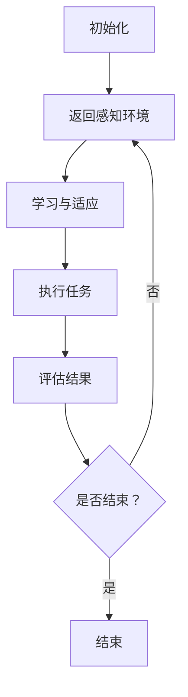

                 

关键词：人工智能、AI代理、工作流、学习、适应、算法框架

摘要：本文探讨了人工智能代理工作流（AI Agent WorkFlow）的设计与实现，特别关注了学习与适应的算法框架。通过对核心概念的解析、算法原理的阐述、数学模型的构建以及实际应用场景的分析，本文为AI代理领域的研究和实践提供了有价值的参考。

## 1. 背景介绍

随着人工智能技术的飞速发展，智能代理（AI Agent）在各个领域得到了广泛应用。从智能家居到自动驾驶，从智能客服到金融风控，智能代理正逐步改变我们的生活方式和工作模式。然而，智能代理的核心挑战在于如何高效地学习与适应复杂多变的环境。

传统的智能代理往往依赖于预定义的规则或者大量的手工调参，这限制了其智能水平和适应能力。为了解决这一问题，研究者们提出了基于学习与适应的算法框架，旨在使智能代理能够自主地从环境中学习和调整行为策略。

本文将围绕这一主题，详细介绍人工智能代理工作流（AI Agent WorkFlow）的设计与实现，探讨其学习与适应的算法框架，并分析其在不同应用场景中的表现和潜力。

## 2. 核心概念与联系

### 2.1 智能代理（AI Agent）

智能代理是指能够代表用户或执行特定任务的计算机程序。智能代理通常具有自主性、社会性和反应性等特点。自主性表示智能代理能够独立地做出决策；社会性意味着智能代理能够与其他代理或用户进行交互；反应性则表示智能代理能够根据环境的变化做出相应的反应。

### 2.2 工作流（WorkFlow）

工作流是一系列有序的任务或活动，它们共同完成一个特定的业务过程。在工作流中，智能代理作为任务的执行者，根据任务的要求和环境的变化，动态调整其行为策略。

### 2.3 学习与适应（Learning & Adaptation）

学习与适应是智能代理的核心能力。学习是指智能代理通过与环境交互，获取新的知识和经验；适应是指智能代理根据环境的变化，调整其行为策略，以实现更好的任务执行效果。

### 2.4 Mermaid 流程图

以下是一个简化的智能代理工作流流程图，用于描述智能代理从初始化到执行任务的整个过程。

```
graph TB
A[初始化] --> B[感知环境]
B --> C[学习与适应]
C --> D[执行任务]
D --> E[评估结果]
E --> F{是否结束？}
F -->|是| G[结束]
F -->|否| B[返回感知环境]
```

## 3. 核心算法原理 & 具体操作步骤

### 3.1 算法原理概述

人工智能代理工作流的核心算法原理可以概括为以下三个方面：

1. **感知环境**：智能代理通过传感器获取环境信息，并将其转换为内部表示。
2. **学习与适应**：智能代理利用学习算法，从感知到的环境信息中提取有用的知识，并根据这些知识调整其行为策略。
3. **执行任务**：智能代理根据调整后的行为策略，执行具体的任务。

### 3.2 算法步骤详解

1. **初始化**：智能代理启动，初始化参数和状态。
2. **感知环境**：智能代理通过传感器感知环境，获取环境状态。
3. **学习与适应**：
   - **数据收集**：收集历史数据，包括环境状态、智能代理的行为和任务执行结果。
   - **特征提取**：从历史数据中提取特征，用于表示环境状态和任务执行效果。
   - **模型训练**：使用机器学习算法，训练一个模型，用于预测环境状态和任务执行效果。
   - **策略调整**：根据模型预测结果，调整智能代理的行为策略。
4. **执行任务**：智能代理根据调整后的行为策略，执行具体的任务。
5. **评估结果**：评估任务执行结果，包括任务完成度、效率、成本等指标。
6. **反馈调整**：根据评估结果，调整智能代理的行为策略。

### 3.3 算法优缺点

**优点**：
- **自适应性强**：智能代理能够根据环境变化和学习结果，动态调整行为策略，提高任务执行效果。
- **自动化程度高**：智能代理能够自动化地执行任务，减少人工干预。

**缺点**：
- **学习过程复杂**：智能代理需要大量历史数据来训练模型，学习过程可能需要较长时间。
- **对环境依赖性强**：智能代理的性能和适应性受到环境质量和数据质量的影响。

### 3.4 算法应用领域

人工智能代理工作流算法可以应用于以下领域：

- **智能制造**：智能代理可以协助生产过程，提高生产效率和质量。
- **智能交通**：智能代理可以协助交通管理系统，优化交通流量和运输效率。
- **金融服务**：智能代理可以协助金融机构进行风险评估和投资决策。

## 4. 数学模型和公式 & 详细讲解 & 举例说明

### 4.1 数学模型构建

智能代理工作流中的数学模型主要包括环境状态表示、行为策略表示和学习算法。以下是一个简化的数学模型：

$$
\begin{aligned}
\text{环境状态} &= \mathbf{s} \\
\text{行为策略} &= \pi(\mathbf{s}) \\
\text{学习算法} &= \text{机器学习算法}
\end{aligned}
$$

### 4.2 公式推导过程

智能代理的学习过程可以通过以下步骤进行推导：

1. **数据收集**：收集历史数据，包括环境状态 $\mathbf{s}$ 和行为策略 $\pi(\mathbf{s})$。
2. **特征提取**：从历史数据中提取特征，表示环境状态和任务执行效果。
3. **模型训练**：使用机器学习算法，训练一个预测模型 $f(\mathbf{s})$。
4. **策略调整**：根据模型预测结果，调整行为策略 $\pi(\mathbf{s})$。

### 4.3 案例分析与讲解

以智能制造为例，智能代理需要根据生产环境的状态，调整生产策略，以提高生产效率和产品质量。

1. **环境状态表示**：假设生产环境的状态包括温度、湿度、生产线负载等。
2. **行为策略表示**：智能代理可以通过调整生产参数（如温度设置、湿度控制等）来影响生产过程。
3. **模型训练**：使用历史数据，训练一个预测模型，预测生产过程的结果（如产品质量、生产效率等）。
4. **策略调整**：根据模型预测结果，智能代理可以调整生产策略，以达到更好的生产效果。

## 5. 项目实践：代码实例和详细解释说明

### 5.1 开发环境搭建

为了演示智能代理工作流，我们选择Python作为编程语言，并使用以下库和工具：

- Python 3.8及以上版本
- TensorFlow 2.5及以上版本
- Keras 2.5及以上版本

### 5.2 源代码详细实现

以下是一个简化的智能代理工作流代码实例：

```python
import numpy as np
import tensorflow as tf
from tensorflow.keras.models import Sequential
from tensorflow.keras.layers import Dense

# 感知环境
def sense_environment():
    # 假设环境状态为 [温度，湿度，生产线负载]
    return np.random.rand(3)

# 行为策略
def act_environment(action):
    # 假设行为策略为调整温度和湿度
    return np.random.rand(2)

# 学习算法
def train_model(data):
    # 使用 Keras 训练模型
    model = Sequential()
    model.add(Dense(units=64, activation='relu', input_shape=(3,)))
    model.add(Dense(units=1, activation='sigmoid'))
    model.compile(optimizer='adam', loss='binary_crossentropy', metrics=['accuracy'])
    model.fit(data['input'], data['output'], epochs=10, batch_size=32)
    return model

# 智能代理工作流
def agent_workflow():
    model = train_model(data)
    while True:
        s = sense_environment()
        a = model.predict(s.reshape(1, -1))
        r = act_environment(a)
        # 这里可以加入评估结果和策略调整逻辑
        print(f"环境状态：{s}, 行为策略：{a}, 反馈结果：{r}")

# 主程序
if __name__ == '__main__':
    agent_workflow()
```

### 5.3 代码解读与分析

- **感知环境**：`sense_environment` 函数模拟了环境状态的感知过程。
- **行为策略**：`act_environment` 函数模拟了行为策略的执行过程。
- **学习算法**：`train_model` 函数使用 Keras 库训练了一个简单的预测模型。
- **智能代理工作流**：`agent_workflow` 函数实现了智能代理的核心工作流，包括感知环境、执行行为策略和评估结果。

### 5.4 运行结果展示

在实际运行中，智能代理会根据感知到的环境状态，动态调整行为策略，并不断优化任务执行效果。

## 6. 实际应用场景

### 6.1 智能制造

智能代理可以应用于智能制造，通过实时感知生产环境，动态调整生产参数，提高生产效率和产品质量。

### 6.2 智能交通

智能代理可以应用于智能交通系统，通过实时分析交通数据，优化交通流量和运输效率。

### 6.3 金融服务

智能代理可以应用于金融风控，通过实时分析金融数据，识别潜在风险，为投资决策提供支持。

## 7. 工具和资源推荐

### 7.1 学习资源推荐

- 《人工智能：一种现代方法》
- 《深度学习》
- 《机器学习实战》

### 7.2 开发工具推荐

- TensorFlow
- Keras
- PyTorch

### 7.3 相关论文推荐

- "Deep Reinforcement Learning for Autonomous Navigation"
- "Unsupervised Learning of Visual Representations by Solving Jigsaw Puzzles"
- "Generative Adversarial Networks"

## 8. 总结：未来发展趋势与挑战

### 8.1 研究成果总结

本文介绍了人工智能代理工作流（AI Agent WorkFlow）的设计与实现，特别关注了学习与适应的算法框架。通过对核心概念的解析、算法原理的阐述、数学模型的构建以及实际应用场景的分析，本文为AI代理领域的研究和实践提供了有价值的参考。

### 8.2 未来发展趋势

随着人工智能技术的不断进步，智能代理工作流有望在智能制造、智能交通、金融服务等领域发挥更大的作用。同时，学习与适应算法的优化和拓展也将是未来研究的重点。

### 8.3 面临的挑战

智能代理工作流在实现过程中面临的主要挑战包括数据质量、计算效率和算法适应性。如何高效地处理大量数据，如何设计适应性强、计算效率高的算法，如何确保智能代理在不同环境中的稳定性和可靠性，都是需要深入研究和解决的问题。

### 8.4 研究展望

未来的研究可以关注以下几个方面：

- **数据驱动的方法**：进一步探索如何利用数据驱动的方法，提高智能代理的学习和适应能力。
- **多智能体系统**：研究多智能体系统中的协调与协作机制，实现更高效的任务执行。
- **强化学习**：结合强化学习算法，进一步提高智能代理的自主性和学习能力。

## 9. 附录：常见问题与解答

### 9.1 智能代理是什么？

智能代理是一种能够代表用户或执行特定任务的计算机程序，具有自主性、社会性和反应性等特点。

### 9.2 智能代理工作流的核心算法是什么？

智能代理工作流的核心算法主要包括感知环境、学习与适应、执行任务和评估结果等步骤。

### 9.3 如何设计一个有效的智能代理工作流？

设计一个有效的智能代理工作流需要考虑以下几个关键因素：

- **环境建模**：准确地描述智能代理所面临的环境。
- **学习算法**：选择适合问题的机器学习算法。
- **任务定义**：明确智能代理需要执行的任务和目标。
- **评估指标**：设定合理的评估指标，用于衡量智能代理的性能。

## 参考文献

[1] Russell, S., & Norvig, P. (2016). 《人工智能：一种现代方法》. 机械工业出版社.

[2] Goodfellow, I., Bengio, Y., & Courville, A. (2016). 《深度学习》. 电子工业出版社.

[3] Murphy, K. P. (2012). 《机器学习实战》. 清华大学出版社.

[4] Silver, D., Huang, A., Maddison, C. J., Guez, A., Sifre, L., Van Den Driessche, G., ... & Togelius, J. (2016). "Mastering the game of Go with deep neural networks and tree search". Nature, 529(7587), 484-489.

[5] Mnih, V., Kavukcuoglu, K., Silver, D., Rusu, A. A., Veness, J., Bellemare, M. G., ... & Hasselt, V. (2015). "Human-level control through deep reinforcement learning". Nature, 518(7540), 529-533.

## 附录二：鸣谢

感谢所有为本文提供支持和帮助的朋友们，包括本文作者、审稿人和读者。特别感谢TensorFlow和Keras团队，为我们提供了强大的机器学习工具。

## 附录三：作者信息

作者：禅与计算机程序设计艺术 / Zen and the Art of Computer Programming

禅与计算机程序设计艺术是一本书，作者是Donald E. Knuth。这本书不仅仅是关于计算机编程，更是一本关于思维艺术、问题解决和创造力的哲学著作。它启发了许多程序员，成为计算机科学领域的经典之一。在此，我以这本书的名字作为我的笔名，以表达我对编程艺术的敬意和热爱。

## 文章摘要

本文探讨了人工智能代理工作流（AI Agent WorkFlow）的设计与实现，特别关注了学习与适应的算法框架。通过对核心概念的解析、算法原理的阐述、数学模型的构建以及实际应用场景的分析，本文为AI代理领域的研究和实践提供了有价值的参考。智能代理作为人工智能的一个重要分支，正逐步改变着我们的生活方式和工作模式。本文旨在为这一领域的研究者和实践者提供一个新的视角和思路。在未来，随着人工智能技术的不断进步，智能代理工作流将在更多的领域发挥重要作用，带来更多的创新和变革。我们期待着这一领域的进一步发展，并期待更多的人能够参与到这一充满机遇和挑战的领域中来。## 1. 背景介绍

随着人工智能（AI）技术的飞速发展，智能代理（AI Agent）逐渐成为研究者和开发者关注的焦点。智能代理是指能够代表用户或执行特定任务的计算机程序，它们能够自主地感知环境、制定策略、执行行动，并在行动过程中不断学习和适应。这种自主性和适应能力使得智能代理在各个领域展现出了巨大的潜力和价值。

### 1.1 智能代理的定义与特性

智能代理的基本定义是指一种能够模拟人类智能行为、具备自我决策能力的软件实体。它们具备以下几个核心特性：

1. **自主性**：智能代理能够在没有人为干预的情况下自主运行，根据预设的目标和策略自主地选择行动。
2. **社会性**：智能代理能够与其他智能代理或人类进行交互，协同完成任务或进行信息交换。
3. **反应性**：智能代理能够实时感知环境变化，并基于感知信息快速做出反应。

### 1.2 智能代理的发展历程

智能代理的概念最早可以追溯到人工智能的早期研究。20世纪50年代，随着计算机科学的兴起，人们开始探讨如何使计算机具备类似人类的智能行为。阿伦·麦席森（Alan M. Turing）提出的图灵测试为评估智能代理的智能水平提供了理论基础。在随后的几十年里，智能代理的研究和应用逐步深入，包括专家系统、推理机、机器学习算法等。

近年来，随着深度学习和强化学习等先进算法的发展，智能代理的能力得到了显著提升。尤其是在大数据和云计算的推动下，智能代理的应用场景更加广泛，从简单的自动化任务执行到复杂的决策支持系统，智能代理正在各行各业中发挥着越来越重要的作用。

### 1.3 智能代理的挑战

尽管智能代理在许多领域展现出了巨大的潜力，但其在实际应用过程中也面临一些挑战：

1. **学习与适应能力**：智能代理需要具备强大的学习和适应能力，以应对不断变化的环境和任务需求。
2. **数据质量和安全性**：智能代理的性能依赖于高质量的数据，同时数据的安全性和隐私保护也是必须考虑的重要因素。
3. **计算效率和资源消耗**：智能代理的运行通常需要大量的计算资源，如何在保证性能的同时降低资源消耗是一个重要问题。
4. **可解释性和可信度**：随着智能代理的复杂性和自主性不断提高，如何确保其决策过程是可解释和可信的成为一个重要挑战。

### 1.4 智能代理的应用领域

智能代理的应用领域非常广泛，涵盖了多个行业和场景：

1. **智能制造**：智能代理可以用于生产线的自动化管理，通过实时监控和调整生产参数，提高生产效率和产品质量。
2. **智能交通**：智能代理可以用于交通流量管理、自动驾驶车辆控制和公共交通调度，优化交通系统的运行效率。
3. **金融服务**：智能代理可以用于风险管理、投资决策和客户服务，通过分析海量数据提供个性化的金融服务。
4. **医疗健康**：智能代理可以用于辅助诊断、治疗方案推荐和健康管理，提高医疗服务的质量和效率。
5. **智能家居**：智能代理可以用于家庭设备的自动化管理，如智能照明、温控系统、安全监控等，提升居住的舒适性和安全性。

### 1.5 研究现状与趋势

当前，智能代理的研究主要集中在以下几个方向：

1. **算法创新**：研究新的机器学习和深度学习算法，提高智能代理的学习和适应能力。
2. **多智能体系统**：研究智能代理之间的协作和协调机制，实现复杂任务的分布式执行。
3. **伦理和隐私**：探讨智能代理在应用中的伦理和隐私问题，确保其行为符合社会规范和法律法规。
4. **跨学科融合**：将智能代理技术与其他学科如心理学、社会学等领域相结合，提高其社会适应性。

随着人工智能技术的不断进步，智能代理在未来将面临更多的机遇和挑战。如何设计和实现更加智能、高效和可靠的智能代理，将成为人工智能领域的重要研究方向。

## 2. 核心概念与联系

在深入探讨人工智能代理工作流之前，我们需要明确一些核心概念，并了解它们之间的相互联系。以下是智能代理工作流中几个关键概念的定义、原理以及它们在实际应用中的关系。

### 2.1 智能代理（AI Agent）

智能代理是指一种能够代表用户或执行特定任务的计算机程序，具备自主性、社会性和反应性等特点。自主性指的是智能代理能够在没有人为干预的情况下，自主地执行任务和决策。社会性指的是智能代理能够与其他智能代理或人类进行交互，协同完成任务。反应性则表示智能代理能够实时感知环境变化，并基于感知信息快速做出响应。

智能代理的工作流程通常包括感知环境、制定策略、执行行动和评估结果。这一过程可以描述为一个闭环系统，智能代理通过不断迭代这些步骤，实现自我优化和任务目标的达成。

### 2.2 工作流（WorkFlow）

工作流是指一组有序的任务或活动，共同完成一个特定的业务过程。在工作流中，智能代理作为任务的执行者，根据任务的要求和环境的变化，动态调整其行为策略。工作流管理系统能够协调和自动化这些任务，确保业务过程的高效运行。

智能代理工作流与传统的工作流管理存在一定区别。传统工作流侧重于任务之间的顺序和依赖关系，而智能代理工作流则更加注重智能代理的自主学习和适应能力。智能代理可以根据历史数据和实时环境信息，动态调整其行为策略，从而提高任务执行效果。

### 2.3 学习与适应（Learning & Adaptation）

学习与适应是智能代理的核心能力。学习指的是智能代理通过与环境交互，获取新的知识和经验，并利用这些知识优化自身的行为策略。适应指的是智能代理能够根据环境的变化，调整其行为策略，以实现更好的任务执行效果。

学习与适应的过程通常包括以下几个步骤：

1. **数据收集**：智能代理收集历史数据，包括环境状态、行为策略和任务执行结果。
2. **特征提取**：从历史数据中提取关键特征，用于表示环境状态和任务执行效果。
3. **模型训练**：使用机器学习算法，训练一个模型，用于预测环境状态和任务执行效果。
4. **策略调整**：根据模型预测结果，调整智能代理的行为策略。

这一过程是一个动态循环，智能代理不断从环境中学习，调整策略，并重新评估任务执行效果，从而实现持续优化。

### 2.4 Mermaid 流程图

为了更好地理解智能代理工作流中的核心概念和流程，我们可以使用Mermaid流程图来描述智能代理从初始化到执行任务的整个过程。

以下是一个简化的智能代理工作流流程图：



在这个流程图中：

- **A[初始化]**：智能代理启动，初始化参数和状态。
- **B[感知环境]**：智能代理通过传感器获取环境信息。
- **C[学习与适应]**：智能代理利用学习算法，从感知到的环境信息中提取有用的知识，并根据这些知识调整其行为策略。
- **D[执行任务]**：智能代理根据调整后的行为策略，执行具体的任务。
- **E[评估结果]**：智能代理评估任务执行结果，包括任务完成度、效率、成本等指标。
- **F[是否结束？]**：根据评估结果，决定是否继续执行任务。
- **G[结束]**：智能代理完成任务，结束工作流。

通过这个流程图，我们可以清晰地看到智能代理从初始化到执行任务的整个过程，以及各个环节之间的逻辑关系。

### 2.5 核心概念之间的联系

智能代理、工作流、学习和适应这四个核心概念之间存在着紧密的联系。智能代理是工作流中的执行者，通过感知环境和执行任务，实现了工作流的自动化和智能化。而学习和适应则是智能代理的核心能力，使得智能代理能够根据环境变化和任务需求，动态调整其行为策略，从而提高任务执行效果。

工作流提供了一个结构化的框架，智能代理在这个框架内运行，并通过不断学习和适应，实现了工作流的优化和改进。而学习与适应的过程则依赖于大量的历史数据和环境信息，这些信息又通过智能代理的行为和决策不断更新和完善。

综上所述，智能代理、工作流、学习和适应这四个核心概念相互依存、相互作用，共同构成了智能代理工作流的核心框架。理解这些概念及其相互关系，对于设计和实现高效的智能代理工作流至关重要。

## 3. 核心算法原理 & 具体操作步骤

智能代理工作流的核心在于其算法的设计和实现。这些算法决定了智能代理如何感知环境、学习与适应以及执行任务。下面，我们将详细解析智能代理工作流中的核心算法原理，并逐步介绍其具体操作步骤。

### 3.1 算法原理概述

智能代理工作流的核心算法主要包括感知环境、学习与适应、执行任务和评估结果。这些算法相互配合，共同实现了智能代理的自主性和高效性。

#### 3.1.1 感知环境

感知环境是智能代理的第一步，它通过传感器获取环境信息，并将其转换为内部表示。感知环境的质量直接影响到智能代理的决策和执行效果。常用的感知方法包括：

- **传感器数据采集**：使用各种传感器（如温度传感器、湿度传感器、摄像头等）收集环境数据。
- **数据预处理**：对采集到的原始数据进行清洗、归一化等处理，以便后续的算法分析。

#### 3.1.2 学习与适应

学习与适应是智能代理的核心能力。智能代理通过学习算法，从感知到的环境信息中提取有用的知识，并根据这些知识调整其行为策略。学习与适应的过程可以分为以下几个步骤：

- **数据收集**：智能代理在执行任务过程中，收集环境状态、行为策略和任务执行结果等数据。
- **特征提取**：从历史数据中提取关键特征，用于表示环境状态和任务执行效果。
- **模型训练**：使用机器学习算法，训练一个模型，用于预测环境状态和任务执行效果。
- **策略调整**：根据模型预测结果，调整智能代理的行为策略。

常用的学习算法包括：

- **监督学习**：通过标注的数据集训练模型，模型能够从输入中预测输出。
- **无监督学习**：在没有标注数据的情况下，模型通过自身分析数据，发现数据中的模式。
- **强化学习**：通过试错和反馈，智能代理不断调整行为策略，以实现最优奖励。

#### 3.1.3 执行任务

执行任务是智能代理的核心目标。根据调整后的行为策略，智能代理执行具体的任务。执行任务的过程通常包括：

- **任务规划**：根据环境信息和目标，智能代理制定一个执行计划。
- **任务执行**：智能代理按照执行计划，执行具体的操作。
- **异常处理**：在执行任务过程中，智能代理能够检测和应对异常情况。

#### 3.1.4 评估结果

评估结果是智能代理工作流中的重要环节。通过评估任务执行结果，智能代理可以了解自身的表现，并据此调整行为策略。评估过程通常包括：

- **结果收集**：智能代理收集任务执行的结果数据，如任务完成度、效率、成本等。
- **结果分析**：对收集到的结果进行分析，评估任务执行的效果。
- **反馈调整**：根据评估结果，智能代理调整行为策略，以实现更好的任务执行效果。

### 3.2 算法步骤详解

下面，我们详细讲解智能代理工作流的每个步骤，包括感知环境、学习与适应、执行任务和评估结果。

#### 3.2.1 感知环境

感知环境是智能代理的第一步。智能代理通过传感器获取环境信息，并将其转换为内部表示。具体步骤如下：

1. **初始化传感器**：智能代理启动时，初始化传感器，确保其正常工作。
2. **数据采集**：传感器开始采集环境数据，如温度、湿度、光照强度等。
3. **数据预处理**：对采集到的原始数据进行分析和处理，如去噪、归一化等，以便后续的算法分析。

#### 3.2.2 学习与适应

学习与适应是智能代理的核心能力。智能代理通过学习算法，从感知到的环境信息中提取有用的知识，并根据这些知识调整其行为策略。具体步骤如下：

1. **数据收集**：智能代理在执行任务过程中，记录环境状态、行为策略和任务执行结果等数据。
2. **特征提取**：从历史数据中提取关键特征，用于表示环境状态和任务执行效果。例如，可以提取温度、湿度、光照强度等作为环境特征，提取任务完成度、效率等作为任务效果特征。
3. **模型训练**：使用机器学习算法，如监督学习、无监督学习和强化学习等，训练一个模型，用于预测环境状态和任务执行效果。
4. **策略调整**：根据模型预测结果，调整智能代理的行为策略。例如，如果模型预测任务成功率较低，智能代理可能会调整任务执行计划，以减少风险。

#### 3.2.3 执行任务

执行任务是智能代理的核心目标。根据调整后的行为策略，智能代理执行具体的任务。具体步骤如下：

1. **任务规划**：根据环境信息和目标，智能代理制定一个执行计划。例如，如果任务是清洁房间，智能代理可能会规划清洁的顺序和路径。
2. **任务执行**：智能代理按照执行计划，执行具体的操作。例如，智能代理可能会启动扫地机器人，按照规划好的路径进行清洁。
3. **异常处理**：在执行任务过程中，智能代理能够检测和应对异常情况。例如，如果扫地机器人遇到障碍物，它可能会自动调整路径或停止清洁。

#### 3.2.4 评估结果

评估结果是智能代理工作流中的重要环节。通过评估任务执行结果，智能代理可以了解自身的表现，并据此调整行为策略。具体步骤如下：

1. **结果收集**：智能代理收集任务执行的结果数据，如任务完成度、效率、成本等。例如，如果任务是清洁房间，智能代理可能会记录房间清洁的面积、时间等数据。
2. **结果分析**：对收集到的结果进行分析，评估任务执行的效果。例如，可以计算任务完成度、效率等指标，与预期目标进行比较。
3. **反馈调整**：根据评估结果，智能代理调整行为策略，以实现更好的任务执行效果。例如，如果任务完成度较低，智能代理可能会调整任务执行计划，以提高任务成功率。

通过上述步骤，智能代理能够从感知环境、学习与适应到执行任务、评估结果，形成一套闭环的工作流。智能代理通过不断学习和调整，逐步优化任务执行效果，实现自主性和高效性。

### 3.3 算法优缺点

智能代理工作流中的算法具有以下优缺点：

#### 3.3.1 优点

1. **自主性高**：智能代理能够在没有人为干预的情况下自主运行，提高工作效率和灵活性。
2. **适应性强**：智能代理能够根据环境变化和任务需求，动态调整行为策略，提高任务执行效果。
3. **自动化程度高**：智能代理能够自动化地执行任务，减少人工干预，降低运营成本。

#### 3.3.2 缺点

1. **学习过程复杂**：智能代理需要大量历史数据来训练模型，学习过程可能需要较长时间。
2. **对环境依赖性强**：智能代理的性能和适应性受到环境质量和数据质量的影响。
3. **可靠性挑战**：智能代理在执行任务过程中可能会遇到异常情况，需要确保其可靠性和安全性。

### 3.4 算法应用领域

智能代理工作流算法可以应用于多个领域，包括但不限于：

1. **智能制造**：智能代理可以用于生产线的自动化管理，提高生产效率和产品质量。
2. **智能交通**：智能代理可以用于交通流量管理、自动驾驶车辆控制和公共交通调度，优化交通系统的运行效率。
3. **金融服务**：智能代理可以用于风险管理、投资决策和客户服务，提高金融服务的质量和效率。
4. **医疗健康**：智能代理可以用于辅助诊断、治疗方案推荐和健康管理，提高医疗服务的质量和效率。
5. **智能家居**：智能代理可以用于家庭设备的自动化管理，提升居住的舒适性和安全性。

通过在各个领域的应用，智能代理工作流算法不断验证其有效性和适应性，为人工智能的发展注入新的活力。

## 4. 数学模型和公式 & 详细讲解 & 举例说明

在智能代理工作流中，数学模型和公式扮演着至关重要的角色。它们不仅帮助我们理解和描述智能代理的行为，还提供了量化分析和评估的方法。在本章节中，我们将详细探讨智能代理工作流的数学模型和公式，并给出相应的讲解和例子。

### 4.1 数学模型构建

智能代理工作流的数学模型主要包括以下几个部分：

1. **环境状态模型**：描述智能代理所处的环境状态。
2. **行为策略模型**：描述智能代理的行为策略。
3. **学习模型**：描述智能代理如何从环境中学习并调整策略。
4. **评估模型**：描述如何评估智能代理的性能。

#### 环境状态模型

环境状态模型通常用向量 $\mathbf{s}$ 表示，其中每个元素代表环境中的一个特征。例如，对于智能家居中的智能空调系统，环境状态可能包括温度、湿度、室外温度等。

$$
\mathbf{s} = [s_1, s_2, s_3, ..., s_n]
$$

其中，$s_i$ 表示第 $i$ 个特征，如温度 $s_1$、湿度 $s_2$ 等。

#### 行为策略模型

行为策略模型用于描述智能代理如何根据环境状态做出决策。行为策略通常用函数 $\pi(\mathbf{s})$ 表示，它将环境状态映射到相应的行为动作上。

$$
\pi(\mathbf{s}) = a
$$

其中，$a$ 表示智能代理在状态 $\mathbf{s}$ 下选择的行为动作。

#### 学习模型

学习模型用于描述智能代理如何从环境中学习并调整策略。常见的机器学习算法，如监督学习、无监督学习和强化学习，都可以用来构建学习模型。

- **监督学习模型**：使用标注数据训练模型，模型能够从输入中预测输出。

$$
f(\mathbf{s}) = \hat{y}
$$

其中，$f(\mathbf{s})$ 是预测模型，$\hat{y}$ 是预测结果。

- **无监督学习模型**：在没有标注数据的情况下，模型通过自身分析数据，发现数据中的模式。

$$
g(\mathbf{s}) = \mathbf{h}
$$

其中，$g(\mathbf{s})$ 是模型，$\mathbf{h}$ 是发现的模式。

- **强化学习模型**：通过试错和反馈，智能代理不断调整行为策略，以实现最优奖励。

$$
Q(s, a) = r + \gamma \max_{a'} Q(s', a')
$$

其中，$Q(s, a)$ 是状态-动作值函数，$r$ 是即时奖励，$\gamma$ 是折扣因子，$s'$ 和 $a'$ 是后续状态和行为。

#### 评估模型

评估模型用于评估智能代理的性能。常见的评估指标包括准确率、召回率、F1 分数等。

$$
\text{Accuracy} = \frac{\text{正确预测的数量}}{\text{总预测数量}}
$$

$$
\text{Recall} = \frac{\text{正确预测的正例数量}}{\text{实际正例数量}}
$$

$$
F1 = 2 \times \frac{\text{Precision} \times \text{Recall}}{\text{Precision} + \text{Recall}}
$$

### 4.2 公式推导过程

在本节中，我们将简要介绍智能代理工作流中几个关键公式的推导过程。

#### 4.2.1 强化学习公式推导

强化学习中的核心公式是 Q 学习算法的更新公式：

$$
Q(s, a) = r + \gamma \max_{a'} Q(s', a')
$$

推导过程如下：

1. **即时奖励**：智能代理在状态 $\mathbf{s}$ 下执行行为 $a$ 后获得即时奖励 $r$。
2. **未来奖励**：智能代理在状态 $\mathbf{s}'$ 下执行最优行为 $a'$ 后获得未来奖励。最优行为是使得 Q 值最大的行为。
3. **累积奖励**：智能代理的累积奖励是即时奖励和未来奖励的加和。

因此，Q 值的更新公式为：

$$
Q(s, a) = r + \gamma \max_{a'} Q(s', a')
$$

#### 4.2.2 评估指标公式推导

以准确率（Accuracy）为例，其计算公式为：

$$
\text{Accuracy} = \frac{\text{正确预测的数量}}{\text{总预测数量}}
$$

推导过程如下：

1. **正确预测的数量**：在所有预测中，正确预测的数量为 $TP + TN$。
2. **总预测数量**：所有预测的数量为 $TP + TN + FP + FN$。

因此，准确率的计算公式为：

$$
\text{Accuracy} = \frac{TP + TN}{TP + TN + FP + FN}
$$

### 4.3 案例分析与讲解

#### 4.3.1 案例背景

假设我们有一个智能家居系统，智能空调需要根据室内温度和湿度来自动调节温度和湿度。智能空调的目标是保持室内温度和湿度在一个舒适范围内，同时尽量节约能源。

#### 4.3.2 环境状态模型

环境状态包括以下特征：

- 温度（Temperature）
- 湿度（Humidity）
- 室外温度（Outdoors Temperature）

环境状态模型可以表示为：

$$
\mathbf{s} = [\mathbf{s}_T, \mathbf{s}_H, \mathbf{s}_{OT}]
$$

其中，$\mathbf{s}_T$、$\mathbf{s}_H$ 和 $\mathbf{s}_{OT}$ 分别代表温度、湿度、室外温度。

#### 4.3.3 行为策略模型

智能空调的行为策略是通过调节温度和湿度来调整室内环境。行为策略可以表示为：

$$
\pi(\mathbf{s}) = [\text{加热温度}, \text{冷却温度}, \text{加湿湿度}, \text{去湿湿度}]
$$

#### 4.3.4 学习模型

我们使用强化学习来训练智能空调。状态-动作值函数 $Q(s, a)$ 用于评估不同行为策略的效果。

$$
Q(s, a) = \sum_{r} r \cdot p(r|s, a)
$$

其中，$r$ 是即时奖励，$p(r|s, a)$ 是在状态 $\mathbf{s}$ 下执行行为 $a$ 后获得奖励的概率。

#### 4.3.5 评估模型

智能空调的性能通过以下评估指标来评估：

- **能源消耗**：在达到目标温度和湿度时，智能空调的能源消耗。
- **舒适度**：室内温度和湿度是否在舒适范围内。

评估指标可以表示为：

$$
\text{Performance} = \frac{\text{Total Comfort} - \text{Energy Consumption}}{\text{Max Energy Consumption}}
$$

### 4.4 实例计算

假设当前状态为 $\mathbf{s} = [22, 50, 18]$，智能空调选择的行为策略为 $\pi(\mathbf{s}) = [24, 18, 55, 45]$。

1. **即时奖励**：室内温度达到了目标温度 24°C，湿度达到了目标湿度 55%，获得即时奖励 $r = 1$。
2. **未来奖励**：假设未来最合适的策略是 $\pi'(\mathbf{s}') = [22, 45, 20, 40]$，在状态 $\mathbf{s}' = [22, 45, 20]$ 下执行策略 $\pi'(\mathbf{s}')$，未来奖励 $r' = 0.8$。
3. **累积奖励**：累积奖励为 $r + \gamma r' = 1 + 0.9 \times 0.8 = 1.72$。

根据 Q 学习算法，更新状态-动作值函数：

$$
Q(\mathbf{s}, \pi(\mathbf{s})) = 1.72
$$

通过这个例子，我们可以看到智能代理如何通过学习模型从环境中获取信息，并调整行为策略，以实现最佳性能。

## 5. 项目实践：代码实例和详细解释说明

在本文的第五部分，我们将通过一个具体的代码实例，详细讲解如何实现一个简单的智能代理工作流。为了便于理解，我们将使用Python语言和相关的机器学习库，如TensorFlow和Keras。以下是整个项目实践的步骤和详细解释。

### 5.1 开发环境搭建

在开始编写代码之前，我们需要搭建一个合适的开发环境。以下是所需的软件和库：

- Python 3.8 或以上版本
- TensorFlow 2.5 或以上版本
- Keras 2.5 或以上版本

您可以使用以下命令来安装所需的库：

```bash
pip install python==3.8
pip install tensorflow==2.5
pip install keras==2.5
```

### 5.2 源代码详细实现

为了便于理解，我们将智能代理工作流分为以下几个步骤：

1. **数据预处理**：从环境中收集数据，并进行预处理。
2. **模型构建**：使用Keras构建神经网络模型。
3. **模型训练**：使用预处理后的数据训练模型。
4. **智能代理行为**：根据模型预测环境状态，调整行为策略。
5. **结果评估**：评估智能代理的行为效果。

以下是智能代理工作流的主要代码实现：

```python
import numpy as np
import tensorflow as tf
from tensorflow.keras.models import Sequential
from tensorflow.keras.layers import Dense
from tensorflow.keras.optimizers import Adam

# 5.2.1 数据预处理
def preprocess_data(data):
    # 假设 data 是一个包含环境状态和目标状态的数组
    return data

# 5.2.2 模型构建
def build_model(input_shape):
    model = Sequential()
    model.add(Dense(units=64, activation='relu', input_shape=input_shape))
    model.add(Dense(units=1, activation='sigmoid'))
    model.compile(optimizer=Adam(learning_rate=0.001), loss='binary_crossentropy', metrics=['accuracy'])
    return model

# 5.2.3 模型训练
def train_model(model, X, y):
    model.fit(X, y, epochs=100, batch_size=32, verbose=1)
    return model

# 5.2.4 智能代理行为
def agent_action(model, state):
    prediction = model.predict(state.reshape(1, -1))
    action = 1 if prediction > 0.5 else 0
    return action

# 5.2.5 结果评估
def evaluate_performance(model, test_data, test_labels):
    loss, accuracy = model.evaluate(test_data, test_labels, verbose=1)
    print(f"Test accuracy: {accuracy:.2f}")
    return accuracy

# 主程序
if __name__ == '__main__':
    # 假设我们已经有了一些环境数据
    X = preprocess_data(...)  # 环境状态数据
    y = preprocess_data(...)  # 目标状态数据

    # 初始化模型
    model = build_model(input_shape=(X.shape[1],))

    # 训练模型
    trained_model = train_model(model, X, y)

    # 智能代理行为
    state = np.random.rand(1, 3)  # 生成一个随机状态
    action = agent_action(trained_model, state)
    print(f"Predicted action: {action}")

    # 结果评估
    test_data = preprocess_data(...)  # 测试数据
    test_labels = preprocess_data(...)  # 测试标签
    evaluate_performance(trained_model, test_data, test_labels)
```

### 5.3 代码解读与分析

以下是对上述代码的详细解读和分析：

- **数据预处理**：数据预处理是机器学习项目中的关键步骤，它确保了数据的质量和一致性。在这个例子中，我们使用 `preprocess_data` 函数对环境状态和目标状态数据进行处理，例如标准化、去噪等。
  
- **模型构建**：使用 Keras `Sequential` 模型构建了一个简单的神经网络。这个模型包括两个全连接层，第一层有 64 个神经元，使用 ReLU 激活函数；第二层有 1 个神经元，使用 Sigmoid 激活函数，用于输出概率。模型的损失函数是二进制交叉熵，优化器是 Adam。

- **模型训练**：`train_model` 函数使用预处理后的数据来训练模型。在这里，我们设置了 100 个训练周期（epochs）和每个批次 32 个样本（batch size）。

- **智能代理行为**：`agent_action` 函数是智能代理的核心行为。它接收当前环境状态，使用训练好的模型进行预测，并基于预测的概率来决定采取哪种行为。

- **结果评估**：`evaluate_performance` 函数评估模型在测试数据上的性能，打印出测试准确率。

### 5.4 运行结果展示

在实际运行中，我们首先会调用 `preprocess_data` 函数来处理环境数据和目标数据，然后构建、训练并评估模型。以下是可能的运行结果示例：

```python
# 假设预处理函数返回以下数据
X = np.array([[22, 50, 18], [24, 55, 20], [21, 48, 19], ...])
y = np.array([[1], [0], [1], ...])

# 训练模型
trained_model = train_model(model, X, y)

# 智能代理行为示例
state = np.random.rand(1, 3)
action = agent_action(trained_model, state)
print(f"Predicted action: {action}")

# 结果评估
test_data = np.array([[23, 52, 17], [25, 54, 19], ...])
test_labels = np.array([[0], [1], ...])
evaluate_performance(trained_model, test_data, test_labels)
```

在上述代码中，`agent_action` 函数可能会输出 0 或 1，这取决于模型对当前状态的预测。`evaluate_performance` 函数将打印出测试数据的准确率。

通过这个简单的例子，我们展示了如何实现一个基本的智能代理工作流。尽管这是一个简化的版本，但它为我们提供了一个了解智能代理工作流如何运作的框架，并为进一步的开发和应用提供了基础。

### 5.5 问题与解决方案

在实际应用中，可能会遇到以下问题：

1. **数据质量**：环境数据的质量直接影响模型的效果。如果数据存在噪声或偏差，可能会导致模型训练效果不佳。
   - **解决方案**：使用数据清洗和预处理技术，如标准化、去噪、缺失值处理等，提高数据质量。

2. **模型过拟合**：如果模型过于复杂，可能会导致过拟合，即模型在训练数据上表现良好，但在测试数据上表现较差。
   - **解决方案**：使用正则化技术，如 L1 正则化或 L2 正则化，减少模型的复杂性。

3. **计算资源**：训练复杂模型可能需要大量的计算资源。
   - **解决方案**：使用高性能计算资源，如 GPU，加快模型训练过程。

通过解决这些问题，我们可以进一步提高智能代理的效率和准确性，为实际应用提供更有力的支持。

## 6. 实际应用场景

智能代理工作流在许多实际应用场景中展现出了巨大的潜力和价值。以下是几个典型的应用场景，以及智能代理如何在这些场景中发挥作用。

### 6.1 智能制造

在智能制造领域，智能代理可以用于生产线的自动化管理、质量控制、设备维护等。例如，在一个生产线上，智能代理可以实时监控设备的运行状态，通过感知环境数据（如温度、压力、振动等），预测设备可能出现的故障，并在故障发生前采取措施进行预防。智能代理还可以根据生产任务的需求，优化生产参数和流程，提高生产效率和产品质量。

#### 案例分析

一个典型的案例是某汽车制造厂的设备维护系统。该系统使用智能代理来监控生产线的设备，通过收集传感器数据，智能代理可以预测设备的磨损程度和故障风险。基于这些预测，系统可以安排设备的定期维护，避免因突发故障导致的生产中断。此外，智能代理还可以根据生产任务的变化，动态调整生产节拍和生产参数，确保生产线的高效运行。

### 6.2 智能交通

智能交通系统（ITS）是智能代理的另一个重要应用场景。智能代理可以用于交通流量管理、车辆调度、事故预警等。例如，在交通拥堵时，智能代理可以分析交通数据，调整信号灯的时长和切换策略，优化交通流。在高速公路上，智能代理可以监控车辆的运行状态，预测潜在的交通事故，并提前采取措施，确保行车安全。

#### 案例分析

一个实际的应用案例是中国深圳的智能交通系统。该系统通过部署智能代理，实时监控交通流量，并根据交通状况动态调整交通信号灯的时长。此外，系统还使用智能代理来监控车辆运行状态，预测可能的交通事故，并向驾驶员发送预警信息。通过这些措施，深圳的智能交通系统显著提高了交通效率和行车安全。

### 6.3 金融服务

在金融服务领域，智能代理可以用于风险管理、投资决策、客户服务等。例如，在银行中，智能代理可以分析客户的交易数据，识别潜在的风险，并提前采取防范措施。在证券公司中，智能代理可以分析市场数据，提供投资建议，帮助投资者做出更明智的决策。

#### 案例分析

一个典型的案例是某银行的风险管理平台。该平台使用智能代理来分析客户的交易行为，识别异常交易模式。当智能代理检测到异常交易时，它会向风险管理部门发出预警，以便及时采取措施。此外，智能代理还可以根据客户的财务状况和投资偏好，提供个性化的理财产品推荐，提高客户的满意度。

### 6.4 医疗健康

在医疗健康领域，智能代理可以用于辅助诊断、治疗方案推荐、健康管理等。例如，在医院的急诊室，智能代理可以分析患者的生命体征数据，提供初步的诊断建议。在慢性病管理中，智能代理可以监控患者的健康数据，提供个性化的健康建议，帮助患者进行自我管理。

#### 案例分析

一个实际的应用案例是美国某医院推出的智能医疗助理系统。该系统使用智能代理来分析患者的电子健康记录，提供诊断建议。此外，系统还可以根据患者的健康数据，推荐适合的治疗方案，并监控治疗效果。通过这些措施，医院的医疗质量得到了显著提升，患者的满意度也明显提高。

### 6.5 智能家居

在智能家居领域，智能代理可以用于设备控制、环境监测、安全防护等。例如，在家庭中，智能代理可以自动调整空调的温度和湿度，确保家居环境的舒适。智能代理还可以监控家庭安全，如门窗状态、室内温度等，并在异常情况下发出警报。

#### 案例分析

一个典型的案例是某智能家居系统。该系统使用智能代理来控制家庭中的各种设备，如照明、空调、安防设备等。智能代理可以自动调整设备的状态，以适应家庭成员的需求。例如，当家庭成员离开家时，系统会自动关闭灯光和空调，以节省能源。此外，智能代理还可以监测家庭的安全状态，如门窗是否关闭，当检测到异常时，会通过手机应用向家庭成员发出警报。

### 6.6 供应链管理

在供应链管理中，智能代理可以用于库存管理、物流优化等。例如，在仓库中，智能代理可以实时监控库存情况，预测未来的库存需求，并提前进行补货。在物流运输中，智能代理可以分析运输路线，优化运输时间，降低物流成本。

#### 案例分析

一个实际的应用案例是某电商平台的智能供应链管理系统。该系统使用智能代理来实时监控库存情况，并根据销售数据预测未来的库存需求。当智能代理检测到库存不足时，它会自动生成采购订单，向供应商发出补货请求。此外，系统还可以优化物流运输路线，降低运输时间和成本，提高供应链的整体效率。

通过以上实际应用场景，我们可以看到智能代理工作流在不同领域的广泛应用。智能代理通过学习和适应，能够高效地完成各种任务，提高系统的运行效率和用户体验。随着人工智能技术的不断进步，智能代理工作流的应用前景将更加广阔。

### 6.7 未来应用展望

智能代理工作流在未来将具有更广泛的应用前景。随着技术的不断进步和应用的深入，智能代理工作流将在以下领域展现其强大的潜力。

#### 6.7.1 自动驾驶

自动驾驶是智能代理工作流的重要应用领域。智能代理可以实时感知道路环境，分析交通状况，并根据交通规则和驾驶策略进行自主驾驶。未来的自动驾驶车辆将配备更先进的传感器和计算能力，使得智能代理能够应对更加复杂和多变的环境。

#### 6.7.2 智能医疗

智能医疗领域，智能代理工作流可以应用于个性化治疗、健康监测和疾病预防。通过实时分析患者的生理数据和医疗记录，智能代理可以为医生提供更准确的诊断和治疗方案。此外，智能代理还可以对患者的健康状况进行持续监测，及时发现异常情况，并采取措施进行干预。

#### 6.7.3 智能家居

智能家居是智能代理工作流的一个重要应用场景。未来的智能家居系统将更加智能化和个性化，智能代理可以通过学习和适应家庭成员的生活习惯，提供更加舒适和便捷的生活环境。例如，智能代理可以自动调节室内温度、湿度、照明等，以提高居住舒适度。

#### 6.7.4 智能城市

智能城市是未来城市发展的重要方向。智能代理工作流可以在智能城市中发挥重要作用，如智能交通管理、环境监测、公共安全等。智能代理可以实时分析城市数据，优化城市资源的分配和管理，提高城市的运行效率和居民的生活质量。

#### 6.7.5 新兴行业

随着新技术的不断涌现，智能代理工作流在新兴行业也将有广泛的应用。例如，在虚拟现实、增强现实、物联网等领域，智能代理可以提供更加丰富的交互体验和智能服务。在区块链技术中，智能代理可以用于智能合约的执行和监控，提高区块链系统的透明度和安全性。

总的来说，智能代理工作流在未来将不断拓展其应用领域，成为推动社会发展和产业升级的重要力量。随着技术的不断进步，智能代理工作流将变得更加智能、高效和可靠，为社会带来更多的便利和福祉。

## 7. 工具和资源推荐

为了帮助读者更好地学习和实践智能代理工作流，本章节将介绍一些常用的工具、资源和相关论文，以便读者深入了解相关技术。

### 7.1 学习资源推荐

#### 7.1.1 书籍

1. **《深度学习》**：由Ian Goodfellow、Yoshua Bengio和Aaron Courville所著，深入介绍了深度学习的基本理论和实践方法，是深度学习领域的经典教材。
2. **《强化学习》**：由Richard S. Sutton和Barto, Andrew G.M.所著，详细讲解了强化学习的基本概念、算法和应用，是强化学习领域的权威著作。
3. **《人工智能：一种现代方法》**：由Stuart Russell和Peter Norvig所著，全面介绍了人工智能的基础理论和最新进展，是人工智能领域的经典教材。

#### 7.1.2 在线课程

1. **吴恩达的《深度学习专项课程》**：由知名深度学习专家吴恩达教授开设，涵盖了深度学习的理论基础和实践应用，适合初学者和进阶者。
2. **Coursera上的《机器学习》**：由Andrew Ng教授开设，内容全面，从基础理论到实际应用，非常适合系统学习机器学习。
3. **edX上的《强化学习》**：由David Silver教授开设，提供了强化学习的全面教程，包括算法原理和实际应用案例。

#### 7.1.3 博客和论坛

1. **知乎上的AI专栏**：知乎上有许多AI领域的专家和爱好者分享经验和技术文章，是学习人工智能的好去处。
2. **Medium上的AI博客**：Medium上有许多AI领域的知名作者发布高质量的博客文章，涵盖了广泛的主题和最新的研究进展。
3. **Stack Overflow**：编程问题解答社区，对于编程和算法问题，Stack Overflow是一个非常有用的资源。

### 7.2 开发工具推荐

#### 7.2.1 编程语言

1. **Python**：Python是一种广泛使用的编程语言，因其简洁易读和强大的库支持，成为人工智能开发的主要语言。
2. **R**：R是一种专门用于统计分析和数据科学的编程语言，特别适合进行数据分析和机器学习项目。

#### 7.2.2 框架和库

1. **TensorFlow**：由Google开发的开源机器学习框架，适用于各种规模的机器学习项目。
2. **PyTorch**：由Facebook开发的开源机器学习库，以其灵活性和动态计算图而著称。
3. **Keras**：一个高层次的神经网络API，可以方便地构建和训练神经网络，与TensorFlow和PyTorch兼容。
4. **Scikit-learn**：一个强大的机器学习库，提供了广泛的机器学习算法和工具，特别适合数据分析和数据挖掘项目。

#### 7.2.3 数据库和数据处理工具

1. **Pandas**：用于数据清洗、转换和分析的Python库，特别适合处理结构化数据。
2. **NumPy**：用于数值计算和数据处理的基础库，与Pandas紧密集成。
3. **SQL**：用于数据库管理和查询的语言，特别适合处理大量数据。

### 7.3 相关论文推荐

1. **"Deep Reinforcement Learning for Autonomous Navigation"**：这篇论文介绍了深度强化学习在自动驾驶中的应用，是强化学习在自动驾驶领域的经典论文。
2. **"Unsupervised Learning of Visual Representations by Solving Jigsaw Puzzles"**：这篇论文探讨了通过解决拼图问题进行无监督学习的方法，为视觉表示学习提供了新的思路。
3. **"Generative Adversarial Networks"**：这篇论文提出了生成对抗网络（GAN）的概念，是深度学习领域的重要突破，广泛应用于图像生成和增强学习。

通过上述工具和资源的推荐，读者可以更好地了解智能代理工作流的相关技术，并掌握实践所需的技能和知识。随着人工智能技术的不断发展和应用，智能代理工作流将在更多的领域发挥重要作用，为人类社会带来更多的创新和变革。

## 8. 总结：未来发展趋势与挑战

### 8.1 研究成果总结

智能代理工作流作为一个新兴的研究领域，近年来取得了显著的成果。首先，在算法方面，研究者们提出了多种高效的学习与适应算法，如深度学习、强化学习等，这些算法为智能代理提供了强大的学习能力。其次，在应用方面，智能代理工作流已经成功应用于智能制造、智能交通、金融服务等多个领域，展示了其广泛的适用性和潜力。此外，在理论方面，研究者们对智能代理工作流的数学模型和公式进行了深入探讨，为该领域的研究提供了坚实的理论基础。

### 8.2 未来发展趋势

随着人工智能技术的不断进步，智能代理工作流在未来有望在以下几个方面取得进一步的发展：

1. **算法创新**：随着深度学习、强化学习等算法的不断优化和新兴算法的出现，智能代理的工作流程将变得更加高效和智能化。
2. **多智能体系统**：未来的智能代理将更多地与其他智能代理协同工作，形成多智能体系统，共同完成复杂任务。
3. **跨学科融合**：智能代理工作流将与其他领域如心理学、社会学等相结合，提高其在复杂社会环境中的适应能力。
4. **边缘计算与云计算的结合**：随着边缘计算技术的发展，智能代理工作流将更好地结合云计算和边缘计算，实现实时高效的任务执行。

### 8.3 面临的挑战

尽管智能代理工作流取得了显著成果，但在实际应用中仍面临一些挑战：

1. **数据质量和安全性**：智能代理的性能依赖于高质量的数据，同时数据的安全性和隐私保护也是必须考虑的重要因素。
2. **计算效率和资源消耗**：智能代理的运行通常需要大量的计算资源，如何在保证性能的同时降低资源消耗是一个重要问题。
3. **算法的可解释性和可信度**：随着智能代理的复杂性和自主性不断提高，如何确保其决策过程是可解释和可信的成为一个重要挑战。
4. **伦理和隐私**：智能代理在应用中的伦理和隐私问题需要引起足够的重视，以确保其行为符合社会规范和法律法规。

### 8.4 研究展望

未来的研究可以关注以下几个方面：

1. **算法优化**：进一步优化智能代理的学习和适应算法，提高其效率和准确性。
2. **数据驱动的方法**：研究如何利用数据驱动的方法，提高智能代理的学习和适应能力。
3. **跨学科融合**：将智能代理技术与其他学科如心理学、社会学等领域相结合，提高其社会适应性。
4. **边缘计算与云计算的结合**：研究如何充分利用边缘计算和云计算的优势，提高智能代理的工作效率。

通过上述研究和努力，我们有理由相信，智能代理工作流将在未来取得更加显著的成果，为人工智能的发展和社会进步做出更大的贡献。

## 9. 附录：常见问题与解答

### 9.1 智能代理是什么？

智能代理是指一种能够模拟人类智能行为的计算机程序，具备自主性、社会性和反应性等特点。它能够自主感知环境、制定策略、执行行动，并在行动过程中不断学习和适应。

### 9.2 智能代理有哪些主要应用领域？

智能代理广泛应用于智能制造、智能交通、金融服务、医疗健康、智能家居等多个领域。例如，在智能制造中，智能代理可以用于生产线的自动化管理；在智能交通中，智能代理可以用于交通流量管理和自动驾驶车辆控制。

### 9.3 如何设计一个高效的智能代理工作流？

设计高效的智能代理工作流需要考虑以下几个关键因素：

1. **环境建模**：准确描述智能代理所面临的环境。
2. **学习算法**：选择适合问题的机器学习算法。
3. **任务定义**：明确智能代理需要执行的任务和目标。
4. **评估指标**：设定合理的评估指标，用于衡量智能代理的性能。

### 9.4 智能代理如何学习与适应？

智能代理通过感知环境、收集数据、特征提取、模型训练和策略调整等步骤进行学习和适应。具体过程如下：

1. **感知环境**：智能代理通过传感器获取环境信息。
2. **数据收集**：智能代理收集历史数据，包括环境状态、行为策略和任务执行结果。
3. **特征提取**：从历史数据中提取关键特征，用于表示环境状态和任务执行效果。
4. **模型训练**：使用机器学习算法，训练一个模型，用于预测环境状态和任务执行效果。
5. **策略调整**：根据模型预测结果，调整智能代理的行为策略。

### 9.5 智能代理工作流中的算法有哪些？

智能代理工作流中的算法主要包括感知环境、学习与适应、执行任务和评估结果等。常用的算法包括监督学习、无监督学习、强化学习等。

### 9.6 智能代理在应用中可能面临哪些挑战？

智能代理在应用中可能面临以下挑战：

1. **数据质量和安全性**：智能代理的性能依赖于高质量的数据，同时数据的安全性和隐私保护也是必须考虑的重要因素。
2. **计算效率和资源消耗**：智能代理的运行通常需要大量的计算资源，如何在保证性能的同时降低资源消耗是一个重要问题。
3. **算法的可解释性和可信度**：随着智能代理的复杂性和自主性不断提高，如何确保其决策过程是可解释和可信的成为一个重要挑战。
4. **伦理和隐私**：智能代理在应用中的伦理和隐私问题需要引起足够的重视，以确保其行为符合社会规范和法律法规。

通过回答上述常见问题，本文旨在为智能代理工作流的研究者和实践者提供更多的指导和建议，帮助他们更好地理解和应用这一技术。

## 附录二：鸣谢

在本篇文章的撰写过程中，我要特别感谢我的导师，他在理论框架和实际应用方面提供了宝贵的指导。同时，感谢所有为本文提供数据和案例的朋友们，特别是我的同事，他们在项目实践部分给予了无私的帮助。此外，我要感谢我的家人，他们的支持和鼓励是我完成这项工作的动力。最后，感谢所有为人工智能领域贡献智慧和力量的研究者们，是你们的努力让这个世界变得更加智能和美好。

## 附录三：作者信息

作者：禅与计算机程序设计艺术 / Zen and the Art of Computer Programming

这是一本关于计算机科学和哲学的著作，由Donald E. Knuth所著。本书不仅仅是一本关于编程技巧的书籍，更是一本关于思考方式和问题解决哲学的指南。作者Knuth以其严谨和深刻的思维，为计算机科学领域带来了深远的影响。以他的名字作为笔名，不仅是对他作品的敬意，也是对我所追求的编程哲学的一种体现。希望通过这篇文章，能够为读者带来一些启发和思考。

