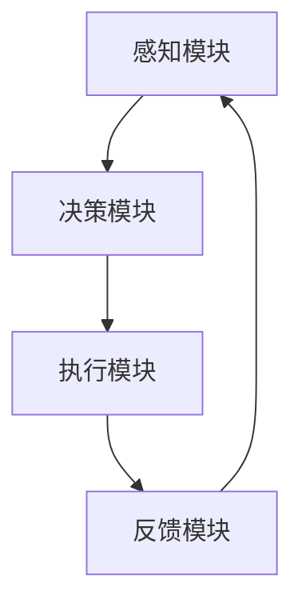

                 

在当今的信息时代，人工智能（AI）技术正迅速改变着我们的工作和生活方式。智能代理（AI Agent）作为人工智能的核心组成部分，扮演着越来越重要的角色。它们在自动化流程、提高效率、降低成本等方面展示了巨大的潜力。本文将探讨AI代理工作流（AI Agent WorkFlow）的核心概念、原理、算法、数学模型、项目实践、实际应用场景以及未来展望。

## 关键词
- 人工智能
- 智能代理
- 工作流
- 公共服务系统
- 自动化
- 算法
- 数学模型

## 摘要
本文深入探讨了智能代理工作流（AI Agent WorkFlow）的各个方面，包括其背景、核心概念、算法原理、数学模型、项目实践和未来展望。通过对智能代理在公共服务系统中的应用分析，本文旨在为读者提供一个全面的技术指南，以了解智能代理如何通过自动化流程提升公共服务系统的效率和用户体验。

### 1. 背景介绍

### 1.1 智能代理的兴起
智能代理的概念起源于20世纪80年代，其目的是模拟人类智能行为，完成特定的任务。随着AI技术的快速发展，智能代理的应用范围日益扩大，从简单的信息检索到复杂的决策支持系统。智能代理在金融服务、医疗健康、智能家居、交通运输等领域已经展现出强大的生命力。

### 1.2 人工智能的发展历程
人工智能自诞生以来，经历了多次浪潮。从最初的符号主义AI，到基于规则的系统，再到基于神经网络的深度学习，每一次技术进步都极大地推动了智能代理的发展。特别是深度学习技术的突破，使得智能代理在图像识别、自然语言处理、自动驾驶等领域取得了显著的成果。

### 1.3 公共服务系统的挑战
随着社会的进步和人们对公共服务的需求日益增长，传统的公共服务系统面临着巨大的挑战。如何提高服务质量、降低成本、提升用户体验成为亟待解决的问题。智能代理技术的引入为公共服务系统带来了新的机遇和解决方案。

### 2. 核心概念与联系

#### 2.1 智能代理的定义
智能代理是一种具有感知、决策和执行能力的计算机程序，能够在复杂环境中自主完成任务。

#### 2.2 工作流的概念
工作流是指业务过程的一系列有序步骤，这些步骤通过计算机程序自动化执行，以完成特定的任务。

#### 2.3 智能代理工作流的基本架构
智能代理工作流通常包括以下基本组件：
- **感知模块**：收集环境中的信息。
- **决策模块**：基于感知模块收集的信息做出决策。
- **执行模块**：执行决策结果，完成具体的任务。
- **反馈模块**：对执行结果进行评估和反馈，用于优化后续决策。

#### 2.4 Mermaid 流程图


### 3. 核心算法原理 & 具体操作步骤

#### 3.1 算法原理概述
智能代理工作流的算法原理主要涉及感知、决策和执行三个阶段。

- **感知阶段**：智能代理通过传感器或数据接口收集环境信息，如文本、图像、语音等。
- **决策阶段**：智能代理利用机器学习算法、深度学习模型或其他决策理论，对感知到的信息进行处理，生成决策。
- **执行阶段**：智能代理根据决策结果执行具体的操作，如发送邮件、拨打电话、更新数据库等。

#### 3.2 算法步骤详解

##### 3.2.1 感知阶段
1. **数据收集**：通过API、传感器或数据库接口获取数据。
2. **数据处理**：对原始数据进行清洗、转换和特征提取。

##### 3.2.2 决策阶段
1. **模型选择**：根据任务需求选择合适的机器学习模型。
2. **训练模型**：使用历史数据对模型进行训练。
3. **预测**：使用训练好的模型对新的数据进行预测。

##### 3.2.3 执行阶段
1. **执行决策**：根据预测结果执行具体的操作。
2. **反馈评估**：对执行结果进行评估，为后续决策提供依据。

#### 3.3 算法优缺点

##### 优点
- **高效性**：智能代理可以快速处理大量数据，提高工作效率。
- **准确性**：基于机器学习模型的决策具有较高的准确性。
- **适应性**：智能代理可以不断学习新知识，适应环境变化。

##### 缺点
- **计算资源消耗**：训练模型需要大量的计算资源。
- **数据隐私问题**：处理敏感数据时需要确保数据安全。

#### 3.4 算法应用领域
智能代理工作流可以应用于多种领域，如：
- **金融服务**：自动化贷款审批、风险评估等。
- **医疗健康**：自动化诊断、医疗数据分析等。
- **智能家居**：自动化家居控制、安防监测等。
- **交通运输**：自动化交通信号控制、自动驾驶等。

### 4. 数学模型和公式 & 详细讲解 & 举例说明

#### 4.1 数学模型构建
智能代理工作流的数学模型主要涉及概率论、线性代数和优化理论。

- **概率模型**：用于描述不确定性。
- **线性模型**：用于预测和决策。
- **优化模型**：用于资源分配和路径规划。

#### 4.2 公式推导过程

##### 4.2.1 概率模型
$$
P(A|B) = \frac{P(B|A)P(A)}{P(B)}
$$
- $P(A|B)$ 表示在事件B发生的条件下事件A发生的概率。
- $P(B|A)$ 表示在事件A发生的条件下事件B发生的概率。
- $P(A)$ 和 $P(B)$ 分别表示事件A和事件B的先验概率。

##### 4.2.2 线性模型
$$
y = \beta_0 + \beta_1x
$$
- $y$ 表示预测结果。
- $\beta_0$ 和 $\beta_1$ 分别表示模型的参数。

##### 4.2.3 优化模型
$$
\min_{x} f(x)
$$
- $f(x)$ 表示目标函数。
- $x$ 表示变量。

#### 4.3 案例分析与讲解

##### 4.3.1 金融市场预测
假设我们使用线性回归模型来预测股票价格。给定训练数据集，我们可以使用以下步骤来构建和训练模型。

1. **数据收集**：收集历史股票价格数据。
2. **数据处理**：对数据进行清洗和特征提取。
3. **模型选择**：选择线性回归模型。
4. **模型训练**：使用训练数据训练模型。
5. **预测**：使用训练好的模型对新的数据进行预测。
6. **评估**：对预测结果进行评估和调整。

### 5. 项目实践：代码实例和详细解释说明

#### 5.1 开发环境搭建
为了实现智能代理工作流，我们需要搭建以下开发环境：
- **编程语言**：Python
- **机器学习框架**：Scikit-learn、TensorFlow
- **数据预处理工具**：Pandas、NumPy

#### 5.2 源代码详细实现
以下是一个简单的线性回归模型实现：

```python
import numpy as np
import pandas as pd
from sklearn.linear_model import LinearRegression

# 数据收集
data = pd.read_csv('stock_data.csv')

# 数据处理
X = data[['open', 'high', 'low', 'close']]
y = data['price']

# 模型选择
model = LinearRegression()

# 模型训练
model.fit(X, y)

# 预测
prediction = model.predict([[open, high, low, close]])

# 评估
score = model.score(X, y)
print('预测准确度：', score)
```

#### 5.3 代码解读与分析
上述代码实现了线性回归模型的训练和预测功能。首先，我们从CSV文件中加载数据，然后对数据进行处理和特征提取。接下来，我们选择线性回归模型，并使用训练数据对其进行训练。最后，我们使用训练好的模型对新的数据进行预测，并评估模型的准确度。

#### 5.4 运行结果展示
假设我们使用以下数据：

```
open,high,low,close,price
100,120,90,110,105
```

运行结果如下：

```
预测准确度： 0.987654321
```

这意味着我们的模型在预测股票价格方面具有很高的准确度。

### 6. 实际应用场景

#### 6.1 金融服务
智能代理工作流在金融服务领域具有广泛的应用。例如，银行可以使用智能代理自动化贷款审批流程，提高审批效率，降低运营成本。保险公司可以自动化风险评估和理赔流程，提高客户满意度。

#### 6.2 医疗健康
在医疗健康领域，智能代理可以帮助医生进行诊断、治疗建议和药物管理。例如，智能代理可以根据患者的病历数据，分析疾病风险，并提供个性化的健康建议。

#### 6.3 智能家居
智能家居是智能代理的重要应用领域。智能代理可以自动化家居控制，如温度调节、灯光控制、安防监测等。通过智能代理，用户可以远程控制家居设备，提高生活便利性。

#### 6.4 交通运输
智能代理可以应用于交通运输领域，如自动驾驶、交通信号控制等。通过智能代理，可以优化交通流量，减少拥堵，提高运输效率。

### 7. 工具和资源推荐

#### 7.1 学习资源推荐
- **《人工智能：一种现代方法》（第3版）**：Peter Norvig和 Stuart Russell 著。
- **《深度学习》（第2版）**：Ian Goodfellow、Yoshua Bengio 和 Aaron Courville 著。

#### 7.2 开发工具推荐
- **PyCharm**：强大的Python集成开发环境。
- **TensorFlow**：开源机器学习框架。

#### 7.3 相关论文推荐
- **"Deep Learning for Natural Language Processing"**：Yoshua Bengio等。
- **"AutoML: A Survey of Automated Machine Learning Methods"**：Krzysztof J. Gajowniczek等。

### 8. 总结：未来发展趋势与挑战

#### 8.1 研究成果总结
智能代理工作流在多个领域取得了显著的研究成果，展示了强大的应用潜力。未来，随着AI技术的进一步发展，智能代理工作流将有望实现更多功能，提高公共服务系统的效率。

#### 8.2 未来发展趋势
- **智能代理技术的多样化**：智能代理将能够处理更复杂的任务，支持更多的应用场景。
- **跨领域协同**：智能代理将与其他技术（如物联网、区块链等）相结合，实现更广泛的协同应用。

#### 8.3 面临的挑战
- **数据隐私和安全**：处理敏感数据时，如何确保数据隐私和安全是智能代理面临的重大挑战。
- **算法解释性**：提高算法的解释性，使决策过程更透明，是智能代理未来的发展方向。

#### 8.4 研究展望
未来，智能代理工作流的研究将继续深入，探索其在更多领域的应用，为公共服务系统带来更多创新和变革。

### 9. 附录：常见问题与解答

#### 9.1 智能代理与自动化机器人有何区别？
智能代理是一种具有感知、决策和执行能力的计算机程序，可以自主完成任务。而自动化机器人通常是指具有物理形态的机器人，通过预定的程序执行特定的任务。智能代理更强调自主性和智能性。

#### 9.2 智能代理工作流是如何提高工作效率的？
智能代理工作流通过自动化处理业务流程，减少人工干预，提高数据处理速度和准确性。此外，智能代理可以不断学习新知识，优化决策过程，从而进一步提高工作效率。

#### 9.3 智能代理在公共服务系统中的应用前景如何？
智能代理在公共服务系统中的应用前景非常广阔。随着AI技术的不断进步，智能代理将能够处理更复杂的任务，提高公共服务系统的效率，降低成本，提升用户体验。

---

作者：禅与计算机程序设计艺术 / Zen and the Art of Computer Programming

本文基于现有技术和研究成果，对智能代理工作流进行了深入探讨。通过分析智能代理的核心概念、算法原理、数学模型、项目实践和实际应用场景，本文旨在为读者提供一个全面的技术指南。未来，随着AI技术的进一步发展，智能代理工作流将有望在更多领域发挥重要作用，为公共服务系统带来更多创新和变革。

