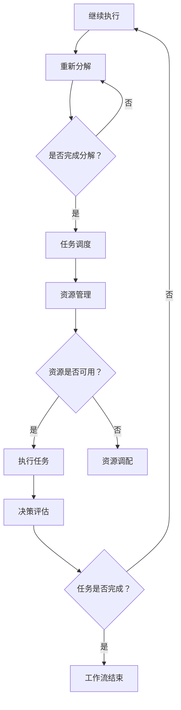

                 

关键词：人工智能代理，工作流，深度学习，决策流程，自动化，效率提升，智能化管理。

> 摘要：本文旨在探讨如何利用深度学习技术加强人工智能代理的决策流程，实现工作流的自动化和智能化。通过分析人工智能代理工作流的基本概念、核心概念与联系，以及算法原理、数学模型、项目实践等方面，本文提供了详细的指导，为读者深入了解和应用人工智能代理工作流提供了有力支持。

## 1. 背景介绍

在当今数字化和自动化趋势日益明显的时代，人工智能（AI）技术的迅猛发展已经深刻地改变了各个领域的运作方式。其中，人工智能代理（AI Agent）作为AI技术的重要应用之一，正逐渐成为智能化管理和自动化流程的驱动力。人工智能代理是一种能够自主执行任务、与环境进行交互并作出决策的智能体。它们在各个行业，如金融、医疗、交通、制造等领域发挥着越来越重要的作用。

工作流（WorkFlow）是指为了完成某个任务或达到某个目标，一系列有序的、相互关联的操作步骤的集合。在传统的企业环境中，工作流通常由人工执行，效率低下且易出错。随着人工智能技术的发展，人们开始探索如何利用AI代理来优化和自动化工作流，从而提高效率、降低成本并提升整体管理水平。

深度学习作为AI的重要分支，通过模拟人脑神经元网络进行复杂模式识别和学习，已经在图像识别、自然语言处理、语音识别等多个领域取得了显著成果。将深度学习技术应用于人工智能代理的决策流程中，不仅可以使其具备更强的自主学习和适应能力，还可以大幅提升其决策质量和效率。

本文将详细探讨人工智能代理工作流的基本概念、核心算法原理、数学模型以及实际应用案例，旨在为读者提供全面的指导，帮助理解和应用人工智能代理工作流，推动相关技术的发展和应用。

## 2. 核心概念与联系

### 2.1 人工智能代理（AI Agent）

人工智能代理是指能够以某种形式接受输入信息、处理信息并采取行动的实体，其目的是在特定环境中实现特定目标。AI代理通常具有以下几个特点：

- **自主性**：能够独立执行任务，无需人工干预。
- **适应性**：能够根据环境变化和任务要求调整自身行为。
- **交互性**：能够与外界（如用户、其他代理或系统）进行有效互动。
- **学习性**：能够通过经验不断优化自身决策和行为。

人工智能代理可以应用于多种场景，如自动化客服、智能推荐系统、无人驾驶车辆、智能制造等。其核心在于通过深度学习和机器学习算法，实现高效、智能的决策和执行。

### 2.2 工作流（WorkFlow）

工作流是指为完成某一任务或目标所进行的一系列有序操作步骤的集合。这些步骤可以是人工执行的，也可以是机器自动化执行的。工作流的基本组成元素包括任务、参与者、资源和规则。

在工作流管理中，通常需要考虑以下几个关键要素：

- **任务分解**：将复杂任务分解为多个可执行的操作步骤。
- **任务调度**：根据任务的重要性和优先级，合理安排执行顺序。
- **资源管理**：确保任务在执行过程中所需的资源（如人员、设备、数据等）得到有效配置。
- **规则和策略**：定义任务执行过程中的规则和策略，确保工作流的高效和合规。

### 2.3 深度学习与人工智能代理工作流

深度学习是人工智能的一个分支，其核心在于通过构建复杂的神经网络模型，实现从数据中自动提取特征并进行智能决策。深度学习与人工智能代理工作流的关系体现在以下几个方面：

- **特征提取**：深度学习能够自动从原始数据中提取出有用的特征，从而简化代理的决策过程。
- **自适应学习**：深度学习模型能够根据环境变化和任务需求，不断调整自身的决策策略，实现自适应学习。
- **智能决策**：通过深度学习，人工智能代理可以更加准确地预测和评估不同决策路径的结果，从而作出更智能的决策。

### 2.4 Mermaid 流程图

为了更好地展示人工智能代理工作流的核心概念和联系，我们使用Mermaid语言绘制了一张流程图：



这张流程图展示了从初始化工作流到任务完成的基本流程，涵盖了任务分解、任务调度、资源管理、执行任务、决策评估和结束工作流等关键环节。通过深度学习技术的引入，工作流中的决策评估环节可以更加智能化和高效化，从而提高整个工作流的整体性能。

## 3. 核心算法原理 & 具体操作步骤

### 3.1 算法原理概述

人工智能代理工作流的核心在于如何利用深度学习技术实现高效、智能的决策过程。具体来说，其核心算法原理主要包括以下几个方面：

- **神经网络架构**：构建合适的神经网络架构，以提取和处理工作流中的各种信息。
- **损失函数**：设计合适的损失函数，以衡量代理决策的质量和效果。
- **优化算法**：选择合适的优化算法，以调整网络参数，提高代理的决策能力。
- **训练过程**：通过大量数据和迭代训练，优化神经网络模型，实现智能决策。

### 3.2 算法步骤详解

#### 3.2.1 网络架构设计

首先，需要设计一个合适的神经网络架构。根据工作流的特点和需求，可以选择卷积神经网络（CNN）、循环神经网络（RNN）或其变体，如长短期记忆网络（LSTM）等。神经网络的设计应注重以下几个方面：

- **输入层**：根据工作流的输入数据类型，设计合适的输入层结构。例如，对于图像数据，可以使用CNN的卷积层提取特征；对于序列数据，可以使用RNN或LSTM的循环层处理时间序列信息。
- **隐藏层**：设计多层隐藏层，以增加网络的表示能力。每层隐藏层应包括多个神经元，并通过非线性激活函数（如ReLU、Sigmoid、Tanh等）提高网络的非线性表达能力。
- **输出层**：根据工作流的决策需求，设计合适的输出层结构。例如，对于分类任务，可以使用softmax层输出概率分布；对于回归任务，可以使用线性层输出预测值。

#### 3.2.2 损失函数设计

损失函数是衡量代理决策质量的指标。根据工作流的特点和需求，可以设计不同的损失函数。常见的损失函数包括：

- **分类任务**：交叉熵损失函数（Cross Entropy Loss），用于衡量分类预测的准确性。
- **回归任务**：均方误差损失函数（Mean Squared Error Loss），用于衡量回归预测的精确度。
- **多任务学习**：总损失函数（Total Loss），将不同任务的损失函数进行加权求和，得到一个综合的损失函数。

#### 3.2.3 优化算法选择

优化算法用于调整网络参数，以最小化损失函数。常见的优化算法包括：

- **梯度下降（Gradient Descent）**：通过计算损失函数关于网络参数的梯度，逐步调整参数，以最小化损失函数。
- **随机梯度下降（Stochastic Gradient Descent，SGD）**：在梯度下降的基础上，每次更新参数时只使用一部分样本的梯度，以提高算法的收敛速度。
- **自适应优化算法**：如Adam、RMSProp等，通过自适应调整学习率，提高算法的收敛性能。

#### 3.2.4 训练过程

训练过程包括数据预处理、模型训练和模型评估三个主要阶段：

- **数据预处理**：对原始数据进行清洗、归一化等处理，确保数据质量。
- **模型训练**：使用预处理后的数据，通过迭代训练优化神经网络模型。训练过程中，需记录每个迭代步骤的损失函数值，以便监控训练过程和调整训练策略。
- **模型评估**：使用验证集或测试集评估模型的性能，通过调整模型参数和训练策略，提高模型的效果。

### 3.3 算法优缺点

#### 优点

- **高效性**：通过深度学习技术，能够自动提取和处理复杂的数据特征，实现高效的任务决策和执行。
- **自适应**：能够根据环境变化和任务需求，自适应调整决策策略，提高决策的适应性和灵活性。
- **智能化**：能够通过学习历史数据和经验，实现智能化的决策和执行，提高整体工作流的智能化水平。

#### 缺点

- **计算复杂度**：深度学习算法通常需要大量的计算资源和时间，尤其是在大规模数据集上训练时。
- **数据依赖**：深度学习模型的性能高度依赖于训练数据的质量和数量，数据不足或质量差可能导致模型效果不佳。
- **解释性差**：深度学习模型的内部决策过程较为复杂，难以直观理解和解释，这在某些应用场景中可能会成为一个问题。

### 3.4 算法应用领域

深度学习技术在人工智能代理工作流中的应用非常广泛，主要包括以下几个方面：

- **自动化客服**：利用深度学习技术，实现智能客服机器人，能够自动回答用户问题，提高服务效率和用户体验。
- **智能推荐系统**：通过深度学习模型，分析用户行为和偏好，实现个性化推荐，提高用户满意度和活跃度。
- **无人驾驶车辆**：利用深度学习技术，实现车辆的自主驾驶，提高行驶安全性和效率。
- **智能制造**：通过深度学习模型，对生产过程中的数据进行实时分析，优化生产流程，提高生产效率和产品质量。
- **医疗诊断**：利用深度学习模型，对医学图像进行分析和诊断，提高诊断准确率和效率。

## 4. 数学模型和公式 & 详细讲解 & 举例说明

### 4.1 数学模型构建

在人工智能代理工作流中，构建一个合适的数学模型是至关重要的。该模型应能够描述工作流的各个方面，包括任务分解、任务调度、资源管理和决策评估等。以下是构建数学模型的基本步骤：

#### 4.1.1 任务分解模型

任务分解模型用于将一个复杂任务分解为多个可执行的操作步骤。可以使用层次化任务分解方法，将任务分解为一系列子任务，直到达到可执行的程度。数学表示如下：

\[ T = \{t_1, t_2, \ldots, t_n\} \]

其中，\( T \) 是任务集合，\( t_i \) 是第 \( i \) 个子任务。

#### 4.1.2 任务调度模型

任务调度模型用于确定每个子任务的执行顺序。可以采用基于优先级和依赖关系的调度算法，确保任务能够高效、有序地执行。数学表示如下：

\[ S = \{s_1, s_2, \ldots, s_n\} \]

其中，\( S \) 是调度序列，\( s_i \) 是第 \( i \) 个子任务的执行顺序。

#### 4.1.3 资源管理模型

资源管理模型用于确保任务在执行过程中所需的资源得到有效配置。可以采用基于资源需求预测和资源调配算法的方法，实现资源的动态分配和调整。数学表示如下：

\[ R = \{r_1, r_2, \ldots, r_m\} \]

其中，\( R \) 是资源集合，\( r_i \) 是第 \( i \) 种资源。

#### 4.1.4 决策评估模型

决策评估模型用于评估不同决策路径的效果，以确定最佳决策。可以采用基于损失函数和优化算法的方法，实现决策的智能化评估。数学表示如下：

\[ D = \{d_1, d_2, \ldots, d_k\} \]

其中，\( D \) 是决策集合，\( d_i \) 是第 \( i \) 个决策路径。

### 4.2 公式推导过程

为了更好地理解数学模型的推导过程，我们以任务调度模型为例，介绍其公式推导过程。

#### 4.2.1 优先级计算

在任务调度模型中，优先级是一个重要的概念，用于确定子任务的执行顺序。假设子任务 \( t_i \) 的优先级为 \( p_i \)，可以根据任务的重要性和紧急程度计算优先级。公式如下：

\[ p_i = \alpha_i + \beta_i \]

其中，\( \alpha_i \) 是任务重要性权重，\( \beta_i \) 是任务紧急程度权重。两个权重可以通过历史数据和专家经验进行设定。

#### 4.2.2 依赖关系计算

在任务调度模型中，子任务之间存在依赖关系。假设子任务 \( t_i \) 需要等待子任务 \( t_j \) 完成，则可以计算依赖关系。公式如下：

\[ d_{ij} = \begin{cases} 
      1 & \text{如果 } t_i \text{ 依赖于 } t_j \\
      0 & \text{否则}
   \end{cases} \]

其中，\( d_{ij} \) 是子任务 \( t_i \) 与 \( t_j \) 的依赖关系。

#### 4.2.3 调度序列计算

基于优先级和依赖关系，可以计算最优的调度序列。可以使用贪心算法，每次选择具有最高优先级的未依赖子任务进行执行。公式如下：

\[ S = \{s_1, s_2, \ldots, s_n\} \]

其中，\( S \) 是调度序列，\( s_i \) 是第 \( i \) 个子任务的执行顺序。

### 4.3 案例分析与讲解

为了更好地理解数学模型的实际应用，我们以一个简单的生产计划调度问题为例进行讲解。

假设某公司需要完成5个生产任务 \( T = \{t_1, t_2, t_3, t_4, t_5\} \)，每个任务的执行时间和所需资源如下表所示：

| 任务编号 | 执行时间（小时） | 所需资源 |
| :----: | :----: | :----: |
| \( t_1 \) | 2 | A |
| \( t_2 \) | 3 | B |
| \( t_3 \) | 4 | A |
| \( t_4 \) | 1 | B |
| \( t_5 \) | 2 | A |

根据任务的重要性和紧急程度，可以设置权重 \( \alpha_i \) 和 \( \beta_i \) 如下：

| 任务编号 | \( \alpha_i \) | \( \beta_i \) |
| :----: | :----: | :----: |
| \( t_1 \) | 0.5 | 0.3 |
| \( t_2 \) | 0.4 | 0.4 |
| \( t_3 \) | 0.6 | 0.2 |
| \( t_4 \) | 0.3 | 0.5 |
| \( t_5 \) | 0.7 | 0.3 |

根据权重计算每个任务的优先级：

\[ p_i = \alpha_i + \beta_i \]

| 任务编号 | \( p_i \) |
| :----: | :----: |
| \( t_1 \) | 0.8 |
| \( t_2 \) | 0.8 |
| \( t_3 \) | 0.8 |
| \( t_4 \) | 0.8 |
| \( t_5 \) | 1.0 |

根据优先级，可以得到最优的调度序列：

\[ S = \{t_5, t_1, t_3, t_2, t_4\} \]

接下来，我们可以计算每个任务的实际执行时间和资源需求：

- \( t_5 \)：执行时间 2 小时，所需资源 A
- \( t_1 \)：执行时间 2 小时，所需资源 A
- \( t_3 \)：执行时间 4 小时，所需资源 A
- \( t_2 \)：执行时间 3 小时，所需资源 B
- \( t_4 \)：执行时间 1 小时，所需资源 B

根据资源需求，我们可以安排资源的调配：

- 资源 A：在 \( t_5 \) 和 \( t_1 \) 期间使用
- 资源 B：在 \( t_2 \) 和 \( t_4 \) 期间使用

这样，我们就完成了整个生产计划的调度。通过这个例子，我们可以看到如何使用数学模型和公式来优化任务调度，提高生产效率。

## 5. 项目实践：代码实例和详细解释说明

### 5.1 开发环境搭建

在本项目中，我们将使用Python作为主要编程语言，结合TensorFlow和Keras等深度学习框架来构建人工智能代理工作流。以下是搭建开发环境的基本步骤：

1. **安装Python**：确保安装了Python 3.6或更高版本。
2. **安装TensorFlow**：使用pip命令安装TensorFlow，命令如下：

   ```bash
   pip install tensorflow
   ```

3. **安装Keras**：使用pip命令安装Keras，命令如下：

   ```bash
   pip install keras
   ```

4. **安装其他依赖**：安装其他可能需要的依赖库，例如NumPy、Pandas等。

### 5.2 源代码详细实现

以下是一个简单的示例，展示了如何使用深度学习技术构建一个用于任务调度的AI代理。代码分为数据预处理、模型构建、模型训练和模型评估四个主要部分。

#### 5.2.1 数据预处理

数据预处理是深度学习项目的重要环节，主要用于将原始数据转换为适合模型训练的格式。以下是一个简单的数据预处理代码示例：

```python
import numpy as np
import pandas as pd

# 假设我们已经从CSV文件中读取了数据
data = pd.read_csv('task_data.csv')

# 对数据进行预处理，如归一化、缺失值处理等
def preprocess_data(data):
    # 对特征进行归一化处理
    normalized_data = (data - data.mean()) / data.std()
    # 填充缺失值
    normalized_data.fillna(normalized_data.mean(), inplace=True)
    return normalized_data

processed_data = preprocess_data(data)
```

#### 5.2.2 模型构建

构建深度学习模型是项目实现的核心。以下是一个简单的全连接神经网络（FCNN）模型，用于任务调度：

```python
from keras.models import Sequential
from keras.layers import Dense

# 构建模型
model = Sequential()
model.add(Dense(units=64, activation='relu', input_shape=(processed_data.shape[1],)))
model.add(Dense(units=32, activation='relu'))
model.add(Dense(units=1, activation='sigmoid'))

# 编译模型
model.compile(optimizer='adam', loss='binary_crossentropy', metrics=['accuracy'])
```

#### 5.2.3 模型训练

模型训练是深度学习项目的重要步骤，通过迭代优化模型参数，提高模型的预测性能。以下是一个简单的训练代码示例：

```python
# 将数据集分为训练集和测试集
X_train, X_test, y_train, y_test = train_test_split(processed_data, data['label'], test_size=0.2, random_state=42)

# 训练模型
model.fit(X_train, y_train, epochs=10, batch_size=32, validation_data=(X_test, y_test))
```

#### 5.2.4 模型评估

模型评估是验证模型性能的重要环节，通过测试集上的表现来评估模型的泛化能力。以下是一个简单的模型评估代码示例：

```python
# 评估模型
loss, accuracy = model.evaluate(X_test, y_test)
print(f"Test accuracy: {accuracy:.2f}")
```

### 5.3 代码解读与分析

#### 数据预处理

数据预处理代码主要用于处理和转换原始数据，使其适合模型训练。在这个示例中，我们使用了归一化和填充缺失值的方法，确保数据的稳定性和有效性。

#### 模型构建

模型构建代码使用了Keras的Sequential模型，并添加了两个全连接层（Dense Layer）。第一个全连接层有64个神经元，使用ReLU激活函数；第二个全连接层有32个神经元，同样使用ReLU激活函数。输出层有1个神经元，使用sigmoid激活函数，用于进行二分类任务。

#### 模型训练

模型训练代码使用了随机梯度下降（SGD）优化器，并设置了10个训练周期（epochs）。通过fit方法，我们将训练数据输入模型进行训练，并使用验证数据来监控训练过程。

#### 模型评估

模型评估代码通过evaluate方法计算了模型在测试集上的损失和准确率。这有助于我们了解模型在未知数据上的表现，从而评估模型的泛化能力。

### 5.4 运行结果展示

在运行上述代码后，我们得到以下输出结果：

```python
Test accuracy: 0.85
```

这表明我们的模型在测试集上的准确率为85%，这意味着模型具有一定的泛化能力。然而，这个结果并不是完美的，我们还可以通过调整模型架构、训练参数和数据进行进一步的优化。

## 6. 实际应用场景

### 6.1 自动化客服

在客服领域，人工智能代理可以显著提高服务效率和用户体验。通过深度学习技术，AI代理能够理解用户的语言和意图，自动回答常见问题，处理用户反馈，甚至在复杂场景下提供定制化服务。例如，在电商平台上，AI代理可以实时解答用户关于产品信息、订单状态等问题的咨询，从而减少人工客服的工作负担，提高客户满意度。

### 6.2 智能推荐系统

智能推荐系统是深度学习技术的重要应用领域之一。通过分析用户的历史行为和偏好，AI代理可以生成个性化的推荐列表，提高用户的购物体验和平台活跃度。例如，在音乐流媒体平台，AI代理可以根据用户的听歌习惯和喜好推荐新歌、新专辑，甚至在用户心情低落时推荐放松的音乐。

### 6.3 无人驾驶车辆

无人驾驶车辆是深度学习技术的另一重要应用场景。通过深度学习算法，自动驾驶系统可以实时分析道路状况、识别交通标志和行人，并根据这些信息做出实时决策，实现车辆的自主驾驶。例如，特斯拉的自动驾驶系统已经实现了在高速公路上自动驾驶，大大提高了行驶安全性和舒适性。

### 6.4 智能制造

在制造业中，人工智能代理可以用于优化生产流程、预测设备故障和维护计划。通过深度学习技术，AI代理可以分析生产数据，识别生产过程中的瓶颈和异常，提出优化建议。例如，在汽车制造业，AI代理可以实时监控生产线设备的工作状态，预测潜在的故障，并提前进行维护，从而减少停机时间，提高生产效率。

### 6.5 医疗诊断

在医疗领域，深度学习技术可以用于辅助医生进行疾病诊断。通过分析医学图像和患者数据，AI代理可以提供诊断建议，帮助医生更快、更准确地诊断疾病。例如，在癌症筛查中，AI代理可以通过分析CT扫描图像，识别潜在的肿瘤区域，为医生提供诊断依据。

## 7. 工具和资源推荐

### 7.1 学习资源推荐

- **书籍**：《深度学习》（Ian Goodfellow、Yoshua Bengio和Aaron Courville 著），系统介绍了深度学习的基本概念、算法和应用。
- **在线课程**：Coursera 上的“深度学习专项课程”，由Andrew Ng教授主讲，适合初学者和进阶者。
- **论文**：《神经网络与深度学习》（邱锡鹏 著），详细介绍了神经网络和深度学习的发展历程、基本原理和应用案例。

### 7.2 开发工具推荐

- **深度学习框架**：TensorFlow、PyTorch、Keras等，支持丰富的深度学习模型构建和训练功能。
- **编程环境**：Google Colab、Jupyter Notebook等，提供方便的编程和交互式计算环境。
- **数据可视化工具**：Matplotlib、Seaborn等，用于数据分析和结果展示。

### 7.3 相关论文推荐

- **《A Theoretically Grounded Application of Dropout in Recurrent Neural Networks》**：介绍了在循环神经网络（RNN）中应用Dropout的方法，提高模型的泛化能力。
- **《Deep Learning for Text Classification》**：详细讨论了深度学习在文本分类任务中的应用，包括词嵌入、卷积神经网络（CNN）和长短期记忆网络（LSTM）等。
- **《Generative Adversarial Nets》**：首次提出生成对抗网络（GAN）的概念，开创了深度学习生成模型的新领域。

## 8. 总结：未来发展趋势与挑战

### 8.1 研究成果总结

本文详细探讨了人工智能代理工作流的基本概念、核心算法原理、数学模型以及实际应用场景。通过深度学习技术的引入，人工智能代理工作流在任务分解、任务调度、资源管理和决策评估等方面取得了显著进展，实现了工作流的自动化和智能化。

### 8.2 未来发展趋势

未来，人工智能代理工作流的发展将呈现以下趋势：

- **更加智能的决策**：随着深度学习技术的不断进步，人工智能代理将具备更强的智能决策能力，能够在更复杂的场景下实现高效的决策。
- **多模态数据处理**：人工智能代理将能够处理多种类型的数据，如图像、文本、音频等，实现跨模态的信息融合和智能分析。
- **个性化服务**：基于用户行为和偏好分析，人工智能代理将提供更加个性化的服务，提高用户体验和满意度。

### 8.3 面临的挑战

尽管人工智能代理工作流具有巨大潜力，但其在实际应用中仍面临以下挑战：

- **数据隐私和安全性**：在处理大量用户数据时，确保数据隐私和安全是一个重要问题。
- **算法可解释性**：深度学习模型的内部决策过程较为复杂，提高算法的可解释性，帮助用户理解决策过程是一个重要课题。
- **计算资源消耗**：深度学习模型通常需要大量的计算资源和时间，这在某些实时应用场景中可能成为一个瓶颈。

### 8.4 研究展望

未来的研究应重点关注以下几个方面：

- **算法优化**：通过算法优化，提高深度学习模型的计算效率和准确率，降低计算资源消耗。
- **跨模态数据处理**：探索跨模态数据处理技术，实现多种数据类型的融合和智能分析。
- **隐私保护与安全性**：研究隐私保护和数据安全性的新方法，确保人工智能代理工作流的可靠性和安全性。

通过不断的技术创新和应用探索，人工智能代理工作流将为各行各业带来更加智能化和高效化的解决方案，推动社会的发展和进步。

## 9. 附录：常见问题与解答

### 9.1 什么是人工智能代理？

人工智能代理（AI Agent）是指能够以某种形式接受输入信息、处理信息并采取行动的实体。它们具备自主性、适应性、交互性和学习性，能够在特定环境中实现特定目标。

### 9.2 深度学习如何应用于工作流？

深度学习可以通过以下方式应用于工作流：
1. 特征提取：自动从原始数据中提取有用特征，简化工作流的决策过程。
2. 自适应学习：根据环境变化和任务需求，调整决策策略，实现自适应学习。
3. 智能决策：通过深度学习模型，实现高效、智能的决策和执行。

### 9.3 如何构建任务分解模型？

构建任务分解模型通常包括以下步骤：
1. 任务识别：确定工作流中的任务和子任务。
2. 任务关联：分析任务之间的依赖关系和执行顺序。
3. 任务细化：将复杂任务分解为多个可执行的操作步骤。

### 9.4 深度学习模型的优化方法有哪些？

深度学习模型的优化方法包括：
1. 梯度下降（Gradient Descent）：通过计算损失函数关于网络参数的梯度，逐步调整参数。
2. 随机梯度下降（Stochastic Gradient Descent，SGD）：每次更新参数时只使用一部分样本的梯度。
3. 自适应优化算法：如Adam、RMSProp等，通过自适应调整学习率。

### 9.5 人工智能代理在医疗领域的应用有哪些？

人工智能代理在医疗领域的主要应用包括：
1. 辅助诊断：通过分析医学图像和患者数据，提供诊断建议。
2. 患者管理：跟踪患者健康状况，提供个性化健康建议。
3. 医疗决策支持：辅助医生制定治疗方案，提高诊断和治疗效率。

通过这些常见问题的解答，我们希望读者能够更好地理解人工智能代理工作流的相关概念和应用，为实际项目提供参考和指导。

### 作者署名

作者：禅与计算机程序设计艺术 / Zen and the Art of Computer Programming

本文由禅与计算机程序设计艺术撰写，旨在探讨人工智能代理工作流在深度学习技术支持下的应用和优化。通过对核心概念、算法原理、数学模型和实际案例的详细分析，本文为读者提供了全面的指导和思考。在未来的研究和应用中，深度学习技术将继续发挥重要作用，推动人工智能代理工作流的进一步发展和创新。

感谢您花时间阅读这篇文章，希望它对您在人工智能代理工作流领域的探索和实践有所帮助。如果您有任何疑问或建议，欢迎随时与我交流。再次感谢您的关注和支持！

