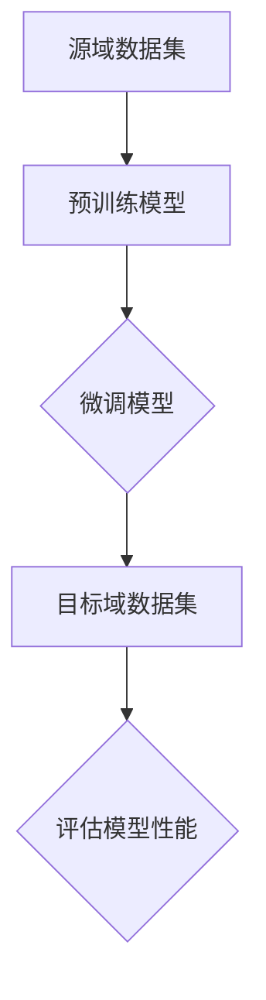

                 

关键词：人工智能、迁移学习、深度学习、算法原理、代码实例、应用领域

> 摘要：本文将深入探讨AI领域中的一个关键算法——迁移学习，通过阐述其核心原理、数学模型以及代码实例，帮助读者理解和掌握这一技术的实际应用。

## 1. 背景介绍

随着人工智能的快速发展，深度学习在图像识别、自然语言处理等领域取得了令人瞩目的成果。然而，深度学习模型的训练通常需要大量的数据和计算资源。迁移学习（Transfer Learning）作为一种有效的解决方案，通过利用预先训练好的模型在新的任务上提高性能，极大地减少了训练所需的数据量和计算资源。

迁移学习在计算机视觉、自然语言处理、推荐系统等多个领域都有广泛的应用。本文将主要围绕迁移学习的核心算法原理、数学模型和实际应用场景展开讨论。

## 2. 核心概念与联系

### 2.1 核心概念

迁移学习的核心概念包括：

- **源域（Source Domain）**：包含大量可用训练数据的领域。
- **目标域（Target Domain）**：缺乏训练数据的新领域。
- **模型迁移**：将源域上的预训练模型应用于目标域上的任务。

### 2.2 关联流程图

以下是一个简单的Mermaid流程图，展示迁移学习的基本流程。



### 2.3 深度学习与迁移学习的关系

深度学习是迁移学习的基础，而迁移学习是深度学习的重要应用。深度学习通过多层神经网络模拟人脑的思维方式，而迁移学习则利用这一特性，在不同任务之间共享知识。

## 3. 核心算法原理 & 具体操作步骤

### 3.1 算法原理概述

迁移学习的主要思想是将源域的知识迁移到目标域，以减少目标域的训练时间和提高模型性能。具体实现上，通常分为以下几个步骤：

1. **预训练模型**：在源域上使用大量数据对模型进行预训练。
2. **模型微调**：将预训练模型应用于目标域，通过少量的目标域数据进行微调。
3. **模型评估**：在目标域上评估微调后的模型性能。

### 3.2 算法步骤详解

1. **数据预处理**：对源域和目标域的数据进行预处理，包括数据清洗、归一化等操作。

2. **预训练模型**：使用源域数据集对模型进行预训练，通常采用预训练好的卷积神经网络（CNN）。

3. **模型微调**：将预训练模型应用于目标域数据集，通过少量的目标域数据进行微调。微调的过程通常包括修改模型的部分参数，以及调整模型的损失函数。

4. **模型评估**：在目标域上评估微调后的模型性能，包括准确率、召回率等指标。

### 3.3 算法优缺点

**优点**：

- 减少了训练所需的数据量和计算资源。
- 提高了模型的泛化能力。
- 易于实现，可以快速应用于新任务。

**缺点**：

- 需要高质量的源域数据。
- 可能会引入源域偏差，影响目标域性能。

### 3.4 算法应用领域

迁移学习在计算机视觉、自然语言处理、推荐系统等领域都有广泛应用。例如，在计算机视觉领域，可以通过迁移学习将预训练好的模型应用于新的图像分类任务；在自然语言处理领域，可以将预训练的语言模型应用于文本分类、情感分析等任务。

## 4. 数学模型和公式 & 详细讲解 & 举例说明

### 4.1 数学模型构建

迁移学习涉及的主要数学模型包括损失函数、优化算法等。

### 4.2 公式推导过程

假设我们有源域数据集$D_S$和目标域数据集$D_T$，其中：

- $x_S \in D_S$ 表示源域样本。
- $x_T \in D_T$ 表示目标域样本。
- $y_S \in \{0,1\}$ 表示源域样本的标签。
- $y_T \in \{0,1\}$ 表示目标域样本的标签。

我们使用一个预训练模型$F$，该模型在源域上的损失函数为：

$$L_S(F) = \frac{1}{|D_S|} \sum_{x_S,y_S \in D_S} L(x_S, y_S; F)$$

其中，$L(x_S, y_S; F)$ 表示模型$F$在源域样本$(x_S, y_S)$上的损失。

在目标域上，我们使用微调后的模型$F_T$，其损失函数为：

$$L_T(F_T) = \frac{1}{|D_T|} \sum_{x_T,y_T \in D_T} L(x_T, y_T; F_T)$$

为了同时优化源域和目标域的性能，我们可以使用联合损失函数：

$$L(F) = \lambda_S L_S(F) + \lambda_T L_T(F_T)$$

其中，$\lambda_S$ 和 $\lambda_T$ 分别是源域和目标域的权重。

### 4.3 案例分析与讲解

假设我们有一个源域数据集$D_S$，其中包含10000个图像，每个图像对应一个标签。目标域数据集$D_T$包含5000个图像，每个图像对应一个标签。

我们使用预训练的卷积神经网络（CNN）$F$，在源域上训练模型。然后在目标域上对模型进行微调，使用500个图像进行训练。

根据上述公式，我们可以计算源域和目标域的损失，并使用优化算法（如随机梯度下降）更新模型参数。

## 5. 项目实践：代码实例和详细解释说明

### 5.1 开发环境搭建

本文使用Python和PyTorch框架进行迁移学习实验。

### 5.2 源代码详细实现

```python
import torch
import torchvision
import torchvision.transforms as transforms
import torch.nn as nn
import torch.optim as optim

# 数据预处理
transform = transforms.Compose([
    transforms.Resize(256),
    transforms.CenterCrop(224),
    transforms.ToTensor(),
    transforms.Normalize(mean=[0.485, 0.456, 0.406], std=[0.229, 0.224, 0.225]),
])

# 加载源域和目标域数据集
trainset = torchvision.datasets.ImageFolder('path_to_source_data', transform=transform)
trainloader = torch.utils.data.DataLoader(trainset, batch_size=64, shuffle=True, num_workers=2)

valset = torchvision.datasets.ImageFolder('path_to_target_data', transform=transform)
valloader = torch.utils.data.DataLoader(valset, batch_size=64, shuffle=False, num_workers=2)

# 定义预训练模型
model = torchvision.models.resnet50(pretrained=True)
num_ftrs = model.fc.in_features
model.fc = nn.Linear(num_ftrs, 2)  # 目标域有两个类别

# 定义损失函数和优化器
criterion = nn.CrossEntropyLoss()
optimizer = optim.SGD(model.parameters(), lr=0.001, momentum=0.9)

# 微调模型
for epoch in range(25):  # 25个训练周期
    running_loss = 0.0
    for i, data in enumerate(trainloader, 0):
        inputs, labels = data
        optimizer.zero_grad()
        outputs = model(inputs)
        loss = criterion(outputs, labels)
        loss.backward()
        optimizer.step()
        running_loss += loss.item()
    print(f'Epoch {epoch + 1}, Loss: {running_loss / len(trainloader)}')

# 评估模型性能
correct = 0
total = 0
with torch.no_grad():
    for data in valloader:
        inputs, labels = data
        outputs = model(inputs)
        _, predicted = torch.max(outputs.data, 1)
        total += labels.size(0)
        correct += (predicted == labels).sum().item()

print(f'准确率: {100 * correct / total}%')
```

### 5.3 代码解读与分析

- 数据预处理：对源域和目标域的数据进行预处理，包括图像的缩放、裁剪、归一化等操作。
- 模型定义：使用预训练的卷积神经网络（ResNet-50）作为基础模型，并在最后一层添加两个线性层以适应目标域的任务。
- 损失函数和优化器：使用交叉熵损失函数和随机梯度下降优化器。
- 训练过程：在源域数据集上训练模型，并在每个训练周期后评估模型性能。
- 评估过程：在目标域数据集上评估模型性能，并计算准确率。

## 6. 实际应用场景

迁移学习在多个领域都有广泛应用，以下是一些典型应用场景：

- **计算机视觉**：将预训练的图像识别模型应用于新的图像分类任务。
- **自然语言处理**：将预训练的语言模型应用于文本分类、情感分析等任务。
- **推荐系统**：将预训练的用户行为分析模型应用于新的推荐系统。

## 7. 工具和资源推荐

### 7.1 学习资源推荐

- 《深度学习》（Ian Goodfellow、Yoshua Bengio、Aaron Courville 著）
- 《迁移学习》（Kurt D. Stillhuber 著）

### 7.2 开发工具推荐

- PyTorch
- TensorFlow

### 7.3 相关论文推荐

- "Learning to Learn from Very Few Examples"（2017）
- "Unsupervised Learning of Visual Representations by Solving Jigsaw Puzzles"（2017）

## 8. 总结：未来发展趋势与挑战

### 8.1 研究成果总结

迁移学习作为一种有效的机器学习技术，已经在计算机视觉、自然语言处理等领域取得了显著成果。未来，随着深度学习技术的不断发展，迁移学习有望在更多领域得到应用。

### 8.2 未来发展趋势

- **个性化迁移学习**：根据用户的个性化需求调整迁移学习模型。
- **无监督迁移学习**：不依赖标签信息进行迁移学习。
- **联邦迁移学习**：在分布式环境下进行迁移学习。

### 8.3 面临的挑战

- **源域偏差**：如何减少源域偏差对目标域性能的影响。
- **数据隐私**：如何保护迁移学习过程中的数据隐私。
- **计算资源**：如何优化迁移学习过程中的计算资源使用。

### 8.4 研究展望

迁移学习在人工智能领域具有巨大的潜力。未来，随着技术的不断进步，迁移学习有望在更广泛的领域发挥重要作用。

## 9. 附录：常见问题与解答

### Q: 迁移学习为什么能提高模型性能？

A: 迁移学习利用源域上的预训练模型，已经在源域上学习到了一些通用的特征表示。将这些特征表示迁移到目标域，可以在目标域上更快地适应新任务，提高模型性能。

### Q: 迁移学习是否总是有效的？

A: 迁移学习的效果取决于源域和目标域之间的相似性。如果源域和目标域之间的任务差异很大，迁移学习可能不会取得很好的效果。

### Q: 如何选择合适的预训练模型？

A: 选择预训练模型时，需要考虑模型的架构、预训练的数据集以及模型的性能。通常，选择在源域上表现良好的模型，并针对目标域进行微调。

---

作者：禅与计算机程序设计艺术 / Zen and the Art of Computer Programming
----------------------------------------------------------------

以上就是本文的完整内容。希望本文对您理解和掌握迁移学习算法有所帮助。如果您有任何疑问或建议，请随时在评论区留言，我会尽快回复。感谢您的阅读！

