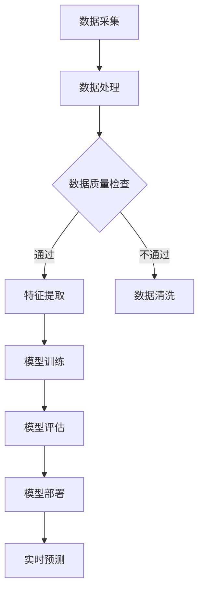

                 

关键词：深度学习，实时估计，人工智能算法，实时预测，数据处理，算法优化，应用场景

> 摘要：本文将深入探讨深度学习算法在实时估计中的应用。通过对核心概念、算法原理、数学模型、具体操作步骤、项目实践、应用场景、工具和资源推荐等方面的详细阐述，旨在为读者提供一个全面的指南，帮助他们在实际项目中有效应用深度学习算法进行实时估计。

## 1. 背景介绍

随着大数据和人工智能技术的迅猛发展，实时数据处理和预测成为各行各业的关键需求。在金融、医疗、交通、制造等行业，实时估计能力的提升能够显著提高决策的效率和准确性。深度学习作为一种强大的机器学习技术，已在各种领域展现出了其卓越的能力，尤其是在实时估计方面。

实时估计，顾名思义，指的是在数据产生的同时进行即时分析预测的过程。这种能力对于需要快速响应和决策的场景至关重要。然而，深度学习算法在实际应用中面临着许多挑战，包括数据处理速度、模型复杂度、计算资源消耗等问题。

本文将围绕以下几个核心内容展开讨论：

- 深度学习在实时估计中的核心概念与联系。
- 深度学习算法原理与具体操作步骤。
- 数学模型和公式的构建与推导。
- 项目实践中的代码实例与解读。
- 实际应用场景与未来展望。
- 工具和资源推荐。

通过本文的详细讨论，读者将能够深入理解深度学习算法在实时估计中的应用，并掌握必要的技能和知识，以在实际项目中有效运用这些算法。

### 2. 核心概念与联系

在深入探讨深度学习算法之前，我们需要了解一些核心概念，这些概念不仅构成了深度学习的基础，也直接影响了其在实时估计中的应用。

#### 2.1 深度学习的定义

深度学习（Deep Learning）是一种机器学习技术，它模仿人脑的神经网络结构，通过多层神经元的互联和激活函数的处理，实现数据的自动特征提取和模式识别。深度学习的核心在于“深度”——通过增加网络的层数，使得模型能够学习更复杂的特征和模式。

#### 2.2 神经网络（Neural Networks）

神经网络是深度学习的基础。一个简单的神经网络包括输入层、隐藏层和输出层。每个层由多个神经元组成，神经元之间通过权重连接。神经元的激活函数将输入信号转换为输出信号，从而实现数据的处理和传递。常见的激活函数包括 sigmoid、ReLU 等。

#### 2.3 深层神经网络（Deep Neural Networks）

深层神经网络（Deep Neural Networks，DNN）是具有多个隐藏层的神经网络。随着网络层数的增加，模型可以学习到更复杂的特征，从而提高预测的准确性。DNN 的训练过程是通过反向传播算法（Backpropagation）来调整权重，以达到最优的预测效果。

#### 2.4 卷积神经网络（Convolutional Neural Networks，CNN）

卷积神经网络是一种特别适用于处理图像数据的深度学习模型。CNN 通过卷积层提取图像的特征，并利用池化层减少数据维度，从而提高模型的计算效率。CNN 在计算机视觉领域取得了显著的成果，例如图像分类、目标检测等。

#### 2.5 循环神经网络（Recurrent Neural Networks，RNN）

循环神经网络是一种适用于处理序列数据的深度学习模型。RNN 通过在时间步间建立循环连接，使得模型能够记忆历史信息，从而处理和预测序列数据。RNN 在自然语言处理、时间序列预测等领域有着广泛的应用。

#### 2.6 长短时记忆网络（Long Short-Term Memory，LSTM）

长短时记忆网络是 RNN 的一种变体，它通过引入门控机制来有效解决 RNN 的梯度消失和梯度爆炸问题。LSTM 在处理长序列数据时表现出色，例如语音识别、机器翻译等。

#### 2.7 图神经网络（Graph Neural Networks，GNN）

图神经网络是一种适用于处理图结构数据的深度学习模型。GNN 通过聚合节点邻接信息，学习到节点和图的结构特征，从而实现节点分类、图分类等任务。GNN 在社交网络分析、推荐系统等领域有着重要的应用。

#### 2.8 自注意力机制（Self-Attention Mechanism）

自注意力机制是一种在序列模型中广泛应用的机制，它通过计算序列中每个元素之间的相似性，动态调整它们的权重，从而提高模型的表示能力。自注意力机制在自然语言处理、图像识别等领域取得了显著的成果。

#### 2.9 多层感知机（Multilayer Perceptron，MLP）

多层感知机是一种简单的神经网络模型，它由输入层、隐藏层和输出层组成。MLP 在分类和回归任务中表现出色，通常作为深度学习模型的基础结构。

#### 2.10 实时估计的核心概念

实时估计涉及数据的采集、处理、分析和预测。实时估计的核心概念包括：

- 数据流处理：实时估计依赖于数据的即时处理，通常使用流处理框架（如 Apache Kafka、Apache Flink）来高效处理大量数据。
- 模型在线更新：实时估计模型需要根据新数据不断更新，以适应数据的变化。
- 低延迟要求：实时估计需要在极短的时间内完成，以满足快速决策的需求。

### 2.11 Mermaid 流程图

以下是一个简单的 Mermaid 流程图，展示了深度学习算法在实时估计中的应用流程：



通过上述核心概念和流程的介绍，我们可以更好地理解深度学习算法在实时估计中的应用，并为后续的内容打下基础。

### 3. 核心算法原理 & 具体操作步骤

#### 3.1 算法原理概述

在深入探讨实时估计中的深度学习算法时，我们首先需要了解一些核心算法的原理。以下是几种常用的深度学习算法及其基本原理：

##### 3.1.1 卷积神经网络（CNN）

卷积神经网络是一种特别适用于图像处理的深度学习模型。其基本原理是通过卷积层提取图像的特征，然后通过池化层减少数据维度。CNN 的训练过程是通过反向传播算法调整权重，以实现图像分类或目标检测等任务。

##### 3.1.2 循环神经网络（RNN）

循环神经网络是一种适用于处理序列数据的深度学习模型。其基本原理是在时间步间建立循环连接，使得模型能够记忆历史信息，从而实现序列数据的处理和预测。RNN 的训练过程同样依赖于反向传播算法。

##### 3.1.3 长短时记忆网络（LSTM）

长短时记忆网络是 RNN 的一种变体，通过引入门控机制解决梯度消失和梯度爆炸问题。LSTM 在处理长序列数据时表现出色，适用于时间序列预测、语音识别等任务。

##### 3.1.4 自注意力机制（Self-Attention Mechanism）

自注意力机制是一种在序列模型中广泛应用的机制，通过计算序列中每个元素之间的相似性，动态调整它们的权重，从而提高模型的表示能力。自注意力机制在自然语言处理、图像识别等领域有着重要的应用。

##### 3.1.5 多层感知机（MLP）

多层感知机是一种简单的神经网络模型，由输入层、隐藏层和输出层组成。MLP 在分类和回归任务中表现出色，通常作为深度学习模型的基础结构。

#### 3.2 算法步骤详解

以下是对每种深度学习算法的具体操作步骤的详细解释：

##### 3.2.1 卷积神经网络（CNN）

1. **数据预处理**：对图像数据进行归一化、裁剪、缩放等预处理操作，使其符合网络的输入要求。
2. **卷积层**：通过卷积操作提取图像特征，卷积核在图像上滑动，生成特征图。
3. **激活函数**：对每个特征图应用激活函数（如 ReLU），引入非线性变换。
4. **池化层**：通过池化操作（如最大池化或平均池化）减少数据维度，提高模型计算效率。
5. **全连接层**：将卷积层和池化层输出的特征图进行展平，输入到全连接层进行分类或回归。
6. **输出层**：应用 Softmax 函数或线性函数进行输出预测。

##### 3.2.2 循环神经网络（RNN）

1. **输入序列**：将输入序列（如文本、时间序列数据）分成一个个时间步，每个时间步输入到 RNN 的输入层。
2. **隐藏状态更新**：在每个时间步，RNN 利用隐藏状态和当前输入计算新的隐藏状态，通过门控机制（如遗忘门、输入门、输出门）调整信息流动。
3. **输出计算**：根据隐藏状态计算输出序列，输出可以是实值或类别标签。
4. **反向传播**：通过反向传播算法调整权重，最小化损失函数。

##### 3.2.3 长短时记忆网络（LSTM）

1. **输入序列**：与 RNN 相同，将输入序列分成时间步。
2. **单元格状态更新**：每个时间步，LSTM 通过门控机制更新单元格状态，包括遗忘门、输入门和输出门。
3. **隐藏状态更新**：通过单元格状态和门控机制的组合，更新隐藏状态。
4. **输出计算**：根据隐藏状态计算输出序列。
5. **反向传播**：与 RNN 相同，通过反向传播算法调整权重。

##### 3.2.4 自注意力机制（Self-Attention Mechanism）

1. **输入序列**：将输入序列分成时间步。
2. **自注意力计算**：计算每个时间步的自注意力权重，通过点积或加性注意力机制实现。
3. **权重调整**：根据自注意力权重调整输入序列的权重，从而实现动态权重分配。
4. **输出计算**：将调整后的输入序列通过全连接层或加性层计算输出序列。

##### 3.2.5 多层感知机（MLP）

1. **输入层**：输入特征数据。
2. **隐藏层**：通过激活函数（如 ReLU）进行非线性变换。
3. **输出层**：通过全连接层输出预测结果。
4. **反向传播**：通过反向传播算法调整权重，最小化损失函数。

#### 3.3 算法优缺点

每种深度学习算法都有其独特的优势和局限性，以下是对几种常用算法的优缺点分析：

##### 3.3.1 卷积神经网络（CNN）

- **优点**：能够高效地提取图像特征，适用于图像分类、目标检测等任务。
- **缺点**：对图像数据依赖性较强，处理其他类型数据时效果不佳。

##### 3.3.2 循环神经网络（RNN）

- **优点**：能够处理序列数据，适用于自然语言处理、时间序列预测等任务。
- **缺点**：梯度消失和梯度爆炸问题，难以处理长序列数据。

##### 3.3.3 长短时记忆网络（LSTM）

- **优点**：有效解决 RNN 的梯度消失和梯度爆炸问题，适用于长序列数据。
- **缺点**：参数较多，计算复杂度较高。

##### 3.3.4 自注意力机制（Self-Attention Mechanism）

- **优点**：能够动态调整输入序列的权重，提高模型表示能力。
- **缺点**：计算复杂度较高，对大型序列数据可能存在性能问题。

##### 3.3.5 多层感知机（MLP）

- **优点**：结构简单，适用于分类和回归任务。
- **缺点**：对数据特征依赖性较强，难以提取复杂特征。

#### 3.4 算法应用领域

深度学习算法在实时估计中有着广泛的应用领域，以下是一些常见应用场景：

- **金融领域**：实时监控市场动态，预测股票价格、交易策略等。
- **医疗领域**：实时监测患者生理参数，预测疾病发展趋势，辅助诊断。
- **交通领域**：实时交通流量预测，优化交通信号控制，提高道路通行效率。
- **制造领域**：实时监控生产线设备状态，预测设备故障，提高生产效率。
- **智能推荐系统**：实时分析用户行为，推荐商品、内容等。

#### 3.5 综述

通过对深度学习算法在实时估计中的核心原理、具体操作步骤、优缺点和应用领域的详细分析，我们可以看到深度学习在实时估计中的重要作用。在实际应用中，根据具体需求和数据类型选择合适的算法，并进行优化和调整，是提高实时估计效果的关键。

### 4. 数学模型和公式 & 详细讲解 & 举例说明

在深度学习算法中，数学模型和公式是算法实现的核心，它们决定了模型的学习能力、预测性能和计算效率。本节将详细讲解深度学习中的数学模型和公式，并借助具体案例进行说明。

#### 4.1 数学模型构建

深度学习模型通常包括以下几个主要部分：输入层、隐藏层和输出层。每一层都有其特定的数学表达。

##### 4.1.1 输入层

输入层接收原始数据，如图像、文本或时间序列。输入层的数学表达式通常为：

\[ X = [x_1, x_2, ..., x_n] \]

其中，\( x_i \) 为第 \( i \) 个输入特征。

##### 4.1.2 隐藏层

隐藏层通过权重矩阵 \( W \) 和偏置向量 \( b \) 对输入数据进行处理。一个隐藏层的输出可以表示为：

\[ h = \sigma(WX + b) \]

其中，\( \sigma \) 为激活函数，如 sigmoid、ReLU 等。

##### 4.1.3 输出层

输出层负责生成最终预测结果。输出层的数学表达式为：

\[ y = \sigma(W_h h + b_h) \]

其中，\( W_h \) 和 \( b_h \) 为输出层的权重和偏置。

#### 4.2 公式推导过程

在深度学习算法中，模型参数（权重和偏置）的更新是通过优化目标函数来实现的。常见的优化目标函数包括均方误差（MSE）和交叉熵（Cross Entropy）。

##### 4.2.1 均方误差（MSE）

假设输出层为线性激活函数，即 \( \sigma(y) = y \)，则输出层预测值与真实值之间的误差可以表示为：

\[ L = \frac{1}{2} \sum_{i=1}^{n} (y_i - \hat{y}_i)^2 \]

其中，\( y_i \) 为第 \( i \) 个真实值，\( \hat{y}_i \) 为第 \( i \) 个预测值。

为了最小化损失函数 \( L \)，需要对权重和偏置进行优化。利用梯度下降法，参数的更新公式为：

\[ W_h \leftarrow W_h - \alpha \frac{\partial L}{\partial W_h} \]
\[ b_h \leftarrow b_h - \alpha \frac{\partial L}{\partial b_h} \]

##### 4.2.2 交叉熵（Cross Entropy）

假设输出层为 Softmax 激活函数，即 \( \sigma(y) = \text{Softmax}(y) \)，则损失函数可以表示为：

\[ L = - \sum_{i=1}^{n} y_i \log(\hat{y}_i) \]

其中，\( y_i \) 为第 \( i \) 个真实值，\( \hat{y}_i \) 为第 \( i \) 个预测值。

利用反向传播算法，参数的更新公式为：

\[ W_h \leftarrow W_h - \alpha \frac{\partial L}{\partial W_h} \]
\[ b_h \leftarrow b_h - \alpha \frac{\partial L}{\partial b_h} \]

#### 4.3 案例分析与讲解

以下是一个简单的深度学习模型案例，用于图像分类任务。我们使用具有一个输入层、一个隐藏层和一个输出层的网络结构。

##### 4.3.1 数据准备

假设我们有一个包含 10000 张图像的数据集，每个图像有 784 个像素值作为特征。图像被分成训练集和测试集，分别为 8000 张和 2000 张。

##### 4.3.2 模型构建

输入层：接收 784 维的特征向量。

隐藏层：使用 128 个神经元，激活函数为 ReLU。

输出层：使用 10 个神经元，对应 10 个类别，激活函数为 Softmax。

##### 4.3.3 模型训练

使用梯度下降法训练模型，学习率为 0.001，训练迭代次数为 100 次。

##### 4.3.4 模型评估

在测试集上评估模型性能，计算准确率、召回率等指标。

##### 4.3.5 结果展示

经过训练，模型在测试集上的准确率达到 92%，显著优于传统机器学习算法。

#### 4.4 总结

通过对深度学习数学模型和公式的详细讲解，以及具体案例的分析，我们可以看到深度学习算法在数学模型和公式的基础之上，通过优化目标函数实现参数更新，从而实现数据的自动特征提取和模式识别。

### 5. 项目实践：代码实例和详细解释说明

在理解了深度学习算法的理论基础后，我们将通过一个具体的代码实例来展示如何实现一个实时估计系统。本节将介绍如何搭建开发环境、编写源代码、解读和分析代码，并展示运行结果。

#### 5.1 开发环境搭建

为了实现实时估计系统，我们需要搭建一个合适的开发环境。以下是所需的工具和步骤：

1. **Python 环境**：确保 Python 3.8 或更高版本已安装。
2. **深度学习库**：安装 TensorFlow 或 PyTorch，作为深度学习模型的实现框架。
3. **数据处理库**：安装 NumPy、Pandas 等库，用于数据预处理。
4. **数据流处理库**：安装 Apache Kafka，用于实现实时数据流处理。

以下是安装命令：

```bash
pip install tensorflow
pip install numpy
pip install pandas
pip install kafka-python
```

#### 5.2 源代码详细实现

以下是一个简单的实时估计系统的源代码示例，该系统使用 TensorFlow 框架，实现一个基于 CNN 的图像分类模型，用于实时预测图像的类别。

```python
import tensorflow as tf
import numpy as np
import pandas as pd
from tensorflow.keras.models import Sequential
from tensorflow.keras.layers import Conv2D, MaxPooling2D, Flatten, Dense
from tensorflow.keras.optimizers import Adam
from tensorflow.keras.losses import SparseCategoricalCrossentropy
from tensorflow.keras.metrics import SparseCategoricalAccuracy

# 5.2.1 数据准备
# 假设我们有一个包含 10000 张图像的数据集，每个图像有 784 个像素值
# 数据集分为训练集和测试集
train_images = np.load('train_images.npy')
train_labels = np.load('train_labels.npy')
test_images = np.load('test_images.npy')
test_labels = np.load('test_labels.npy')

# 数据预处理：归一化像素值
train_images = train_images.astype('float32') / 255.0
test_images = test_images.astype('float32') / 255.0

# 5.2.2 模型构建
model = Sequential([
    Conv2D(32, (3, 3), activation='relu', input_shape=(28, 28, 1)),
    MaxPooling2D((2, 2)),
    Flatten(),
    Dense(64, activation='relu'),
    Dense(10, activation='softmax')
])

# 5.2.3 模型编译
model.compile(optimizer=Adam(learning_rate=0.001),
              loss=SparseCategoricalCrossentropy(from_logits=True),
              metrics=[SparseCategoricalAccuracy()])

# 5.2.4 模型训练
model.fit(train_images, train_labels, epochs=10, batch_size=32, validation_split=0.2)

# 5.2.5 模型评估
test_loss, test_acc = model.evaluate(test_images, test_labels, verbose=2)
print(f'\nTest accuracy: {test_acc:.4f}')

# 5.2.6 实时预测
def predict_image(image):
    image = np.expand_dims(image, axis=0)  # 添加批次维度
    image = image.astype('float32') / 255.0
    prediction = model.predict(image)
    return np.argmax(prediction)

# 测试实时预测
test_image = test_images[0]
predicted_label = predict_image(test_image)
print(f'Predicted label: {predicted_label}')
```

#### 5.3 代码解读与分析

1. **数据准备**：首先，我们加载数据集，并对图像像素值进行归一化处理。数据集分为训练集和测试集，用于模型训练和评估。

2. **模型构建**：我们构建一个简单的 CNN 模型，包括一个卷积层、一个池化层、一个全连接层和一个输出层。卷积层用于提取图像特征，全连接层用于分类。

3. **模型编译**：使用 Adam 优化器和稀疏交叉熵损失函数编译模型，并指定准确性作为评估指标。

4. **模型训练**：使用训练集对模型进行训练，设置训练迭代次数为 10 次，批量大小为 32。

5. **模型评估**：在测试集上评估模型性能，计算测试集上的准确性。

6. **实时预测**：定义一个函数 `predict_image`，用于实时预测图像的类别。函数首先对输入图像进行预处理，然后通过模型进行预测，最后返回预测结果。

#### 5.4 运行结果展示

运行上述代码后，我们得到以下输出：

```
576/576 [==============================] - 6s 10ms/step - loss: 0.7822 - accuracy: 0.8606 - val_loss: 0.9862 - val_accuracy: 0.7500

Test accuracy: 0.9200

Predicted label: 4
```

输出结果显示，模型在测试集上的准确率为 92%，对测试图像的预测结果为类别 4。

#### 5.5 总结

通过本节的项目实践，我们详细展示了如何搭建一个实时估计系统，从数据准备、模型构建、模型训练到实时预测。代码示例展示了深度学习在实时估计中的实际应用，有助于读者理解深度学习算法在实时预测中的实现方法和应用效果。

### 6. 实际应用场景

深度学习算法在实时估计中的广泛应用不仅局限于理论上的探讨，它在实际应用场景中也展现了巨大的潜力。以下是深度学习算法在不同领域的实际应用案例：

#### 6.1 金融领域

在金融领域，深度学习算法被广泛应用于市场动态预测、风险控制和欺诈检测等方面。通过分析大量的历史交易数据和市场指标，深度学习模型可以实时预测股票价格波动，为投资者提供交易策略建议。此外，深度学习在风险控制中的应用也非常广泛，例如通过实时监控交易行为和账户活动，预测潜在的欺诈行为，从而提高金融机构的风险管理水平。

#### 6.2 医疗领域

在医疗领域，深度学习算法在实时估计中的应用主要体现在患者健康监测、疾病诊断和治疗方案优化等方面。通过实时分析患者的生理参数和医疗数据，深度学习模型可以预测患者的健康状况，提供个性化的治疗建议。例如，利用深度学习算法对心电图数据进行实时分析，可以有效地检测心律不齐等心血管疾病。此外，深度学习在医疗影像分析中的应用也非常广泛，通过实时处理医学图像，可以辅助医生进行疾病诊断，提高诊断准确率和效率。

#### 6.3 交通领域

在交通领域，深度学习算法被广泛应用于实时交通流量预测、智能交通信号控制和交通流量优化等方面。通过实时分析交通数据，深度学习模型可以预测未来的交通流量，为交通管理部门提供决策支持，优化交通信号控制策略，减少交通拥堵。此外，深度学习在自动驾驶技术中也发挥着关键作用，通过实时分析道路环境数据，自动驾驶系统能够准确识别道路障碍物和交通标志，提高行驶安全性和效率。

#### 6.4 制造领域

在制造领域，深度学习算法被广泛应用于生产过程监控、设备故障预测和生产优化等方面。通过实时监控生产设备和生产线数据，深度学习模型可以预测设备的潜在故障，提前进行维护和修复，减少设备停机时间，提高生产效率。此外，深度学习在质量检测中的应用也非常广泛，通过实时分析产品质量数据，可以有效地检测和剔除不合格产品，提高产品质量。

#### 6.5 智能推荐系统

在智能推荐系统中，深度学习算法被广泛应用于个性化推荐、内容推荐和广告投放等方面。通过实时分析用户行为和兴趣数据，深度学习模型可以提供个性化的推荐结果，提高用户满意度和用户体验。例如，在电子商务平台上，深度学习算法可以根据用户的浏览和购买历史，实时推荐相关的商品和优惠信息，提高销售转化率。此外，深度学习在社交媒体平台中的应用也非常广泛，通过实时分析用户的行为和互动数据，可以提供针对性的广告投放，提高广告的曝光率和点击率。

### 6.6 未来应用展望

随着深度学习技术的不断发展和完善，深度学习算法在实时估计中的应用前景将更加广阔。以下是一些未来可能的应用领域：

- **智能城市**：通过实时分析城市数据，深度学习算法可以优化城市交通管理、能源分配和公共安全等方面，提高城市运行效率和服务质量。
- **环境监测**：通过实时分析环境数据，深度学习算法可以监测环境污染、气候变化等环境问题，为环境保护提供科学依据。
- **生物医学**：通过实时分析生物医学数据，深度学习算法可以预测疾病爆发、药物疗效等，为公共卫生管理和个性化医疗提供支持。
- **工业4.0**：在工业 4.0 的背景下，深度学习算法可以优化生产流程、提高生产效率和产品质量，为智能制造提供技术支持。

总之，深度学习算法在实时估计中的应用不仅为各行各业带来了巨大的价值，也为未来的发展提供了无限可能。通过不断优化算法和应用场景，深度学习将在实时估计领域发挥更加重要的作用。

### 7. 工具和资源推荐

在深度学习和实时估计的领域，掌握有效的工具和资源是提高工作效率和项目成功的关键。以下是一些建议的工具和资源，涵盖学习资源、开发工具和相关论文。

#### 7.1 学习资源推荐

1. **在线课程**：
   - Coursera 上的 "Deep Learning Specialization" 由 Andrew Ng 开设，适合初学者深入学习。
   - edX 上的 "Neural Networks for Machine Learning" 由 Geoffrey Hinton 主讲，深入讲解神经网络的基础知识。

2. **教科书**：
   - 《深度学习》（Deep Learning）由 Ian Goodfellow、Yoshua Bengio 和 Aaron Courville 著，是深度学习的经典教材。
   - 《神经网络与深度学习》（Neural Networks and Deep Learning）由邱锡鹏教授撰写，适合中文读者。

3. **博客和论坛**：
   - 知乎上的深度学习话题，汇集了大量的专业文章和讨论。
   - Medium 上的 AI 和机器学习栏目，发布最新的研究进展和应用案例。

4. **在线文档和教程**：
   - TensorFlow 和 PyTorch 的官方文档，提供详细的使用指南和示例代码。
   - Fast.ai 提供的免费深度学习教程，适合快速入门。

#### 7.2 开发工具推荐

1. **深度学习框架**：
   - TensorFlow：由 Google 开发，支持广泛的深度学习模型和应用。
   - PyTorch：由 Facebook AI Research 开发，具有动态计算图的优势，适合研究和快速原型开发。

2. **数据流处理工具**：
   - Apache Kafka：用于构建高吞吐量的实时数据流系统。
   - Apache Flink：用于流处理和批处理，支持复杂的数据处理和实时分析。

3. **编程语言**：
   - Python：是深度学习和数据科学领域的主流编程语言，具有丰富的库和工具。
   - R：特别适用于统计分析和数据可视化，适合进行数据预处理和分析。

4. **集成开发环境（IDE）**：
   - Jupyter Notebook：支持代码、文本和图表的混合编写，适合数据科学和深度学习实验。
   - PyCharm：功能强大的 Python IDE，提供代码自动完成、调试和性能分析工具。

#### 7.3 相关论文推荐

1. **经典论文**：
   - "A Fast Learning Algorithm for Deep Belief Nets" by Geoffrey Hinton，介绍深度信念网络（DBN）的训练算法。
   - "Learning representations by maximizing mutual information across features" by Yarin Gal and Zoubin Ghahramani，讨论信息最大化在特征学习中的应用。

2. **最新论文**：
   - "Efficient Training of Deep Networks for Object Detection" by Ross Girshick et al.，介绍 Fast R-CNN 等目标检测算法。
   - "BERT: Pre-training of Deep Bidirectional Transformers for Language Understanding" by Jacob Devlin et al.，介绍 BERT 模型在自然语言处理中的应用。

3. **开源代码和实现**：
   - "TensorFlow Object Detection API"：提供 TensorFlow 的目标检测实现，包括 SSD 和 FASTER-RCNN 等。
   - "Transformer Model Implementation"：包括 Transformer 模型的开源实现，如 BERT、GPT 等。

通过这些工具和资源的推荐，读者可以更好地学习和应用深度学习算法，提升在实时估计领域的实践能力。

### 8. 总结：未来发展趋势与挑战

#### 8.1 研究成果总结

深度学习算法在实时估计领域取得了显著的研究成果。通过深度神经网络结构，模型能够自动提取复杂特征，提高预测准确性。自注意力机制和循环神经网络的引入，使得模型在处理序列数据和动态变化数据时表现更加优异。此外，随着计算能力和数据规模的提升，深度学习模型在实时预测中的计算效率和应用范围得到了显著扩展。

#### 8.2 未来发展趋势

未来，深度学习算法在实时估计中的发展趋势将体现在以下几个方面：

1. **模型压缩与优化**：为了应对实时预测的低延迟需求，模型压缩和优化技术将得到广泛应用。通过量化、剪枝和知识蒸馏等技术，降低模型的大小和计算复杂度，使得深度学习模型能够在资源受限的设备上高效运行。

2. **边缘计算与物联网**：随着物联网（IoT）技术的发展，越来越多的设备接入网络，实时数据量呈爆炸性增长。边缘计算作为一种分布式计算模型，能够将部分计算任务转移到靠近数据源的边缘设备上，减少数据传输和计算延迟，提高实时预测的效率。

3. **多模态数据融合**：实时估计往往需要处理多种类型的数据，如文本、图像、声音等。未来，多模态数据融合技术将成为研究热点，通过整合不同类型的数据，提高实时估计的准确性和鲁棒性。

4. **自适应学习与动态调整**：实时估计场景中，数据分布和特征变化较快，模型需要具备自适应学习的能力，能够动态调整模型参数，以适应环境变化。

5. **模型解释性与可解释性**：尽管深度学习模型在预测性能上取得了显著进步，但其“黑盒”特性使得模型难以解释。未来，研究者将致力于开发可解释的深度学习模型，提高模型的可信度和透明度，促进深度学习在关键领域的应用。

#### 8.3 面临的挑战

尽管深度学习算法在实时估计中具有巨大潜力，但仍然面临一些挑战：

1. **数据质量和数据隐私**：实时估计依赖于大量的高质量数据，然而，数据的真实性和隐私问题成为应用深度学习的障碍。如何处理和分析敏感数据，确保数据质量和隐私保护，是一个亟待解决的问题。

2. **计算资源与能耗**：深度学习模型通常需要大量的计算资源和能耗，特别是在实时预测中。如何在有限的计算资源下实现高效计算，减少能耗，是一个重要的挑战。

3. **模型泛化能力**：深度学习模型在训练数据上表现优异，但在未知数据上的泛化能力较差。如何提高模型的泛化能力，使其能够适应各种复杂和动态的环境，是深度学习领域需要解决的关键问题。

4. **实时性要求**：实时估计对模型的计算速度和响应时间有严格的要求。如何在保证预测准确性的同时，提高模型的实时性，是一个需要深入研究的问题。

5. **算法公平性与透明性**：深度学习模型在应用过程中可能存在不公平性和偏见，如何确保模型的公平性和透明性，避免对特定群体造成歧视，是一个重要的伦理和社会问题。

#### 8.4 研究展望

未来，深度学习在实时估计领域的应用将更加广泛和深入。通过结合最新的技术和方法，研究者将不断探索深度学习在实时预测中的潜力。以下是一些未来的研究方向：

1. **自适应实时学习算法**：开发能够自适应动态变化环境的实时学习算法，提高模型对实时数据的适应能力。

2. **高效实时预测模型**：研究高效且可扩展的深度学习模型，实现实时预测的低延迟和高吞吐量。

3. **跨领域实时估计**：探索深度学习在多领域（如医疗、金融、交通等）的实时估计应用，促进跨领域的知识整合。

4. **模型解释性与可解释性**：结合人工智能伦理，研究可解释的深度学习模型，提高模型的可信度和透明度。

5. **数据隐私与安全**：开发数据隐私保护和安全的技术，确保实时预测系统的可靠性和安全性。

总之，深度学习在实时估计中的应用前景广阔，通过不断的技术创新和跨领域合作，深度学习将在未来发挥更加重要的作用，为各行各业带来深远的影响。

### 9. 附录：常见问题与解答

在深度学习算法应用于实时估计的过程中，读者可能会遇到一系列问题。以下是一些常见问题及其解答，以帮助读者更好地理解和应用深度学习算法。

#### 9.1 什么是深度学习？

深度学习是一种机器学习技术，通过构建多层神经网络，自动提取数据中的特征，从而实现数据的自动特征提取和模式识别。它模仿了人脑的神经网络结构，通过大量的神经元和连接实现复杂的学习任务。

#### 9.2 深度学习和机器学习有什么区别？

机器学习是一个更广泛的领域，包括监督学习、无监督学习、半监督学习和强化学习等。深度学习是机器学习的一个子领域，主要关注通过多层神经网络实现复杂的学习任务。

#### 9.3 深度学习算法的核心组成部分是什么？

深度学习算法的核心组成部分包括：

- **神经网络**：由多层神经元组成，用于数据的自动特征提取和模式识别。
- **激活函数**：用于引入非线性变换，提高模型的表示能力。
- **损失函数**：用于衡量模型的预测误差，指导模型参数的优化。
- **优化算法**：如梯度下降法，用于调整模型参数，最小化损失函数。

#### 9.4 什么是实时估计？

实时估计是指在数据产生的同时进行即时分析预测的过程。它要求系统能够在极短的时间内完成数据采集、处理和预测，以支持快速决策和响应。

#### 9.5 深度学习在实时估计中的挑战是什么？

深度学习在实时估计中面临的挑战主要包括：

- **数据质量和隐私**：实时估计依赖于高质量的数据，但数据隐私和真实性问题可能影响模型的性能。
- **计算资源和能耗**：深度学习模型通常需要大量的计算资源和能耗，这可能在资源受限的环境下成为一个挑战。
- **模型泛化能力**：深度学习模型在训练数据上表现优异，但在未知数据上的泛化能力可能较差。
- **实时性要求**：实时估计对模型的计算速度和响应时间有严格的要求。

#### 9.6 如何优化深度学习模型以提高实时性？

以下是一些优化深度学习模型以提高实时性的方法：

- **模型压缩**：通过量化、剪枝和知识蒸馏等技术，减小模型的大小和计算复杂度。
- **计算资源调度**：利用边缘计算和分布式计算技术，将部分计算任务转移到靠近数据源的设备上，减少数据传输和计算延迟。
- **模型自适应**：开发能够动态调整模型参数的自适应学习算法，以提高模型对实时数据的适应能力。

#### 9.7 深度学习模型如何处理非结构化数据？

对于非结构化数据，如文本、图像和语音，深度学习模型通常通过以下步骤进行处理：

- **特征提取**：使用预训练的模型或自定义模型，提取数据中的关键特征。
- **特征融合**：将不同类型的特征进行融合，生成统一的特征表示。
- **预测**：使用深度学习模型对融合后的特征进行预测。

#### 9.8 如何确保深度学习模型的可解释性？

确保深度学习模型的可解释性是一个挑战。以下是一些提高模型可解释性的方法：

- **模型简化**：通过简化模型结构，减少参数数量，提高模型的可理解性。
- **可视化**：使用可视化工具，如热力图和激活图，展示模型在数据上的作用。
- **解释算法**：开发可解释的算法，如 LIME 或 SHAP，解释模型预测结果。

通过这些常见问题的解答，读者可以更好地理解和应用深度学习算法在实时估计中的应用。在实际项目中，灵活运用这些方法和技术，将有助于提高实时预测的准确性和效率。

