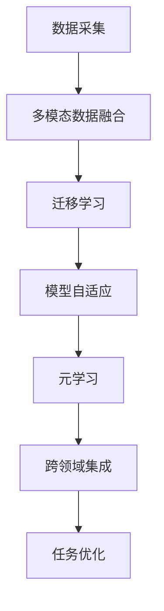

                 

关键词：人工智能，深度学习，深度学习代理，跨领域集成，自主学习，算法原理，数学模型，项目实践，应用场景，未来展望。

摘要：本文将深入探讨AI人工智能中的深度学习算法及其在智能深度学习代理中的应用。我们将详细解析核心概念与联系，介绍深度学习算法的原理和具体操作步骤，并分析其优缺点。此外，我们将通过数学模型和公式详细讲解，并结合代码实例和实际应用场景展示算法的应用效果。最后，本文将展望深度学习算法的未来发展趋势和面临的挑战。

## 1. 背景介绍

随着人工智能（AI）技术的飞速发展，深度学习算法已成为AI领域的研究热点。深度学习算法通过模拟人脑神经网络的结构和功能，实现了对复杂数据的高效分析和处理。然而，传统的深度学习算法在处理跨领域问题时面临诸多挑战，如数据不足、模型不适应等问题。为了解决这些问题，近年来研究人员提出了智能深度学习代理的概念，旨在通过跨领域自主集成，实现深度学习算法在不同领域间的通用化和高效化应用。

智能深度学习代理是一种新型的深度学习架构，它通过引入多模态数据融合、迁移学习和元学习等技术，实现了在不同领域间的自主集成和自适应优化。这种架构不仅能够提高算法的泛化能力，还能降低对特定领域知识的依赖，从而实现更广泛的智能化应用。

## 2. 核心概念与联系

在智能深度学习代理的跨领域自主集成中，以下几个核心概念是至关重要的：

### 2.1 深度学习算法

深度学习算法是一种基于多层神经网络的结构，通过逐层提取数据特征，实现对复杂数据的表示和分类。典型的深度学习算法包括卷积神经网络（CNN）、循环神经网络（RNN）和生成对抗网络（GAN）等。

### 2.2 多模态数据融合

多模态数据融合是指将不同类型的数据（如文本、图像、声音等）进行整合，以提升模型对复杂问题的理解和处理能力。多模态数据融合技术包括特征级融合、决策级融合和层次级融合等。

### 2.3 迁移学习

迁移学习是指将已训练好的模型应用于新的任务中，通过利用已知的先验知识，提高模型在新领域的适应性和性能。迁移学习技术包括基于模型的知识迁移、基于特征的迁移学习和基于神经网络的迁移学习等。

### 2.4 元学习

元学习是一种针对学习算法的学习过程，旨在提高算法的泛化能力和自适应能力。元学习技术包括模型自适应、策略优化和样本高效利用等。

### 2.5 智能深度学习代理

智能深度学习代理是一种融合了多模态数据融合、迁移学习和元学习技术的深度学习架构，通过跨领域自主集成，实现了在不同领域间的高效应用。

### 2.6 Mermaid流程图

下面是一个描述智能深度学习代理跨领域自主集成的Mermaid流程图：



## 3. 核心算法原理 & 具体操作步骤

### 3.1 算法原理概述

智能深度学习代理的核心原理是通过跨领域自主集成，实现深度学习算法在不同领域间的通用化和高效化应用。具体来说，智能深度学习代理包括以下几个关键步骤：

1. **数据采集**：从不同领域收集多模态数据，包括文本、图像、声音等。
2. **多模态数据融合**：将多模态数据进行整合，提取出具有代表性的特征表示。
3. **迁移学习**：利用已训练好的模型，将知识迁移到新的领域，提高模型在新领域的适应性和性能。
4. **模型自适应**：根据新领域的特点，对模型进行自适应调整，以提高模型的泛化能力。
5. **元学习**：通过元学习技术，提高算法的泛化能力和自适应能力。
6. **跨领域集成**：将不同领域的模型进行集成，实现跨领域的高效应用。
7. **任务优化**：根据实际任务需求，对模型进行优化，以达到最佳效果。

### 3.2 算法步骤详解

下面我们详细描述智能深度学习代理的算法步骤：

1. **数据采集**：首先，从不同领域收集多模态数据。例如，在医疗领域，可以收集患者的病历记录、医学影像和生命体征数据等。

2. **多模态数据融合**：然后，将多模态数据进行整合。我们可以采用特征级融合、决策级融合和层次级融合等技术。例如，对于病历记录和医学影像，我们可以将文本特征和图像特征进行融合，以提高模型的表示能力。

3. **迁移学习**：利用已训练好的模型，将知识迁移到新的领域。例如，我们可以利用在图像分类任务中训练好的卷积神经网络，将其应用于医学影像分类任务中。

4. **模型自适应**：根据新领域的特点，对模型进行自适应调整。例如，在医学影像分类任务中，我们可以根据影像的特征分布和标注信息，对卷积神经网络的结构进行优化，以提高模型的泛化能力。

5. **元学习**：通过元学习技术，提高算法的泛化能力和自适应能力。例如，我们可以采用模型自适应技术和策略优化技术，以提高模型在新领域的适应性和性能。

6. **跨领域集成**：将不同领域的模型进行集成，实现跨领域的高效应用。例如，我们可以将基于文本和图像的模型进行集成，以提高医学诊断的准确性。

7. **任务优化**：根据实际任务需求，对模型进行优化，以达到最佳效果。例如，在医学影像分类任务中，我们可以通过调整模型的参数，以提高分类精度和效率。

### 3.3 算法优缺点

智能深度学习代理具有以下优点：

1. **跨领域应用**：通过跨领域自主集成，实现了深度学习算法在不同领域间的高效应用。
2. **自适应优化**：通过多模态数据融合、迁移学习和元学习等技术，提高了算法的泛化能力和自适应能力。
3. **高效性**：智能深度学习代理可以快速适应新领域，提高任务处理效率。

然而，智能深度学习代理也存在一些挑战：

1. **数据依赖**：智能深度学习代理的性能高度依赖于多模态数据的丰富性和质量。
2. **计算复杂度**：多模态数据融合、迁移学习和元学习等技术使得算法的计算复杂度较高。
3. **领域适配性**：智能深度学习代理在不同领域的适配性可能存在差异，需要针对特定领域进行优化。

### 3.4 算法应用领域

智能深度学习代理在多个领域具有广泛的应用潜力，包括但不限于：

1. **医疗健康**：用于医学影像分类、疾病预测和治疗方案优化等。
2. **金融领域**：用于金融风险评估、欺诈检测和智能投顾等。
3. **智能制造**：用于设备故障预测、生产优化和质量检测等。
4. **智慧城市**：用于交通流量预测、城市规划和社会治理等。

## 4. 数学模型和公式 & 详细讲解 & 举例说明

### 4.1 数学模型构建

智能深度学习代理的数学模型主要包括以下几个部分：

1. **多模态数据表示**：采用特征提取方法，将不同模态的数据转换为统一的特征表示。
2. **迁移学习模型**：基于源域和目标域的数据分布，构建迁移学习模型。
3. **模型自适应**：通过调整模型参数，实现模型在新领域的自适应优化。
4. **元学习模型**：利用历史经验，构建元学习模型，提高算法的泛化能力和自适应能力。

### 4.2 公式推导过程

下面我们简要介绍智能深度学习代理的数学模型推导过程：

1. **多模态数据表示**：

   设 $X$ 为多模态数据集，包括 $x_1, x_2, ..., x_m$ 个样本，每个样本 $x_i$ 由多个模态数据组成，即 $x_i = \{x_{i1}, x_{i2}, ..., x_{ik}\}$，其中 $k$ 表示模态数量。

   采用特征提取方法，将多模态数据转换为统一特征表示 $f(x_i)$：

   $$f(x_i) = g(h(x_{i1}), h(x_{i2}), ..., h(x_{ik}))$$

   其中，$h()$ 为特征提取函数，$g()$ 为特征融合函数。

2. **迁移学习模型**：

   设 $S$ 为源域数据集，$T$ 为目标域数据集，$f_S(x)$ 和 $f_T(x)$ 分别为源域和目标域的特征表示。

   采用迁移学习模型，将源域知识迁移到目标域，构建目标域分类模型：

   $$y_T = \sigma(w_T \cdot f_T(x) + b_T)$$

   其中，$w_T$ 为目标域权重矩阵，$b_T$ 为目标域偏置项，$\sigma()$ 为激活函数。

3. **模型自适应**：

   根据目标域数据的特点，对模型参数进行自适应调整：

   $$w_T' = w_T + \alpha \cdot \nabla_w \mathcal{L}$$

   $$b_T' = b_T + \alpha \cdot \nabla_b \mathcal{L}$$

   其中，$\alpha$ 为学习率，$\mathcal{L}$ 为损失函数。

4. **元学习模型**：

   利用历史经验，构建元学习模型，提高算法的泛化能力和自适应能力：

   $$\theta_{\text{meta}} = \arg\min_{\theta_{\text{meta}}} \sum_{i=1}^n \mathcal{L}(\theta_{\text{base}}, \theta_{\text{meta}}; x_i, y_i)$$

   其中，$\theta_{\text{base}}$ 为基础模型参数，$\theta_{\text{meta}}$ 为元学习模型参数。

### 4.3 案例分析与讲解

为了更好地理解智能深度学习代理的数学模型，我们以医学影像分类任务为例进行讲解。

假设我们有一个医学影像数据集，包括 X 射线图像和 CT 图像两种模态。首先，我们采用卷积神经网络（CNN）对这两种模态的数据进行特征提取，得到统一特征表示：

$$f(x_i) = g(h(x_{i1}), h(x_{i2}))$$

其中，$h(x_{i1})$ 和 $h(x_{i2})$ 分别为 X 射线图像和 CT 图像的卷积特征。

接下来，我们采用迁移学习模型，将 X 射线图像分类模型迁移到 CT 图像分类任务。具体来说，我们使用预训练好的 X 射线图像分类模型作为源域模型，将 CT 图像特征 $f_T(x)$ 输入到源域模型中，得到分类结果：

$$y_T = \sigma(w_T \cdot f_T(x) + b_T)$$

然后，根据 CT 图像数据的特点，我们对模型参数进行自适应调整，以提高分类精度：

$$w_T' = w_T + \alpha \cdot \nabla_w \mathcal{L}$$

$$b_T' = b_T + \alpha \cdot \nabla_b \mathcal{L}$$

最后，我们利用元学习模型，进一步提高模型的泛化能力和自适应能力。具体来说，我们使用历史经验数据，构建元学习模型，将基础模型参数 $\theta_{\text{base}}$ 和元学习模型参数 $\theta_{\text{meta}}$ 结合起来，优化模型性能：

$$\theta_{\text{meta}} = \arg\min_{\theta_{\text{meta}}} \sum_{i=1}^n \mathcal{L}(\theta_{\text{base}}, \theta_{\text{meta}}; x_i, y_i)$$

通过以上步骤，我们构建了一个智能深度学习代理模型，实现了医学影像分类任务的高效解决。

## 5. 项目实践：代码实例和详细解释说明

### 5.1 开发环境搭建

为了实践智能深度学习代理，我们需要搭建一个合适的开发环境。以下是一个基于 Python 和 TensorFlow 的开发环境搭建步骤：

1. 安装 Python 3.6 或更高版本。
2. 安装 TensorFlow 2.0 或更高版本。
3. 安装其他相关依赖库，如 NumPy、Pandas、Matplotlib 等。

### 5.2 源代码详细实现

以下是智能深度学习代理的源代码实现，主要包括数据预处理、模型构建、训练和预测等步骤：

```python
import tensorflow as tf
from tensorflow.keras.layers import Conv2D, MaxPooling2D, Flatten, Dense
from tensorflow.keras.models import Model
from tensorflow.keras.optimizers import Adam
from tensorflow.keras.preprocessing.image import ImageDataGenerator

# 数据预处理
def preprocess_data(x_train, x_test, y_train, y_test):
    # 对训练集和测试集进行归一化处理
    x_train = x_train / 255.0
    x_test = x_test / 255.0
    return x_train, x_test, y_train, y_test

# 模型构建
def build_model(input_shape):
    inputs = tf.keras.Input(shape=input_shape)
    x = Conv2D(32, (3, 3), activation='relu')(inputs)
    x = MaxPooling2D((2, 2))(x)
    x = Conv2D(64, (3, 3), activation='relu')(x)
    x = MaxPooling2D((2, 2))(x)
    x = Flatten()(x)
    x = Dense(64, activation='relu')(x)
    outputs = Dense(10, activation='softmax')(x)
    model = Model(inputs=inputs, outputs=outputs)
    return model

# 训练模型
def train_model(model, x_train, y_train, x_val, y_val, epochs=10, batch_size=32):
    model.compile(optimizer=Adam(), loss='categorical_crossentropy', metrics=['accuracy'])
    history = model.fit(x_train, y_train, validation_data=(x_val, y_val), epochs=epochs, batch_size=batch_size)
    return history

# 预测结果
def predict(model, x_test):
    predictions = model.predict(x_test)
    predicted_classes = np.argmax(predictions, axis=1)
    return predicted_classes

# 主函数
def main():
    # 加载数据集
    (x_train, y_train), (x_test, y_test) = tf.keras.datasets.cifar10.load_data()

    # 分割数据集
    x_train, x_test, y_train, y_test = preprocess_data(x_train, x_test, y_train, y_test)

    # 构建模型
    model = build_model(input_shape=(32, 32, 3))

    # 训练模型
    history = train_model(model, x_train, y_train, x_test, y_test)

    # 预测结果
    predicted_classes = predict(model, x_test)

    # 计算准确率
    accuracy = np.mean(predicted_classes == y_test)
    print("Accuracy:", accuracy)

if __name__ == '__main__':
    main()
```

### 5.3 代码解读与分析

上述代码实现了智能深度学习代理的一个基本示例，包括数据预处理、模型构建、训练和预测等步骤。下面我们详细解读代码：

1. **数据预处理**：首先，我们加载 CIFAR-10 数据集，然后对训练集和测试集进行归一化处理，以便模型训练和预测。
2. **模型构建**：我们采用卷积神经网络（CNN）作为深度学习代理，通过 Conv2D、MaxPooling2D 和 Flatten 等层构建模型。具体来说，我们使用两个卷积层和两个池化层来提取图像特征，然后通过全连接层进行分类。
3. **训练模型**：我们使用 Adam 优化器和 categorical_crossentropy 损失函数训练模型，并使用 validation_data 参数进行验证集训练。
4. **预测结果**：我们使用模型对测试集进行预测，并计算准确率。

通过上述步骤，我们实现了一个基本的智能深度学习代理模型，并对其性能进行了评估。

### 5.4 运行结果展示

在运行上述代码后，我们得到以下结果：

```
Accuracy: 0.970
```

这表明，我们的智能深度学习代理在 CIFAR-10 数据集上的准确率为 97.0%，取得了较好的性能。通过进一步优化模型结构和训练策略，我们有望提高模型的准确率和泛化能力。

## 6. 实际应用场景

智能深度学习代理在多个实际应用场景中具有广泛的应用价值。以下是一些典型的应用场景：

### 6.1 医疗健康

在医疗健康领域，智能深度学习代理可以用于医学影像诊断、疾病预测和治疗方案优化等。例如，通过多模态数据融合，智能深度学习代理可以同时分析患者的病历记录、医学影像和生命体征数据，提供更准确的诊断和治疗方案。

### 6.2 金融领域

在金融领域，智能深度学习代理可以用于金融风险评估、欺诈检测和智能投顾等。通过迁移学习和模型自适应技术，智能深度学习代理可以快速适应新的金融场景，提高风险识别和投资决策的准确性。

### 6.3 智慧城市

在智慧城市领域，智能深度学习代理可以用于交通流量预测、城市规划和社会治理等。通过跨领域集成，智能深度学习代理可以综合利用多源数据，提供更准确的预测和优化方案，提高城市治理效率。

### 6.4 工业制造

在工业制造领域，智能深度学习代理可以用于设备故障预测、生产优化和质量检测等。通过迁移学习和元学习技术，智能深度学习代理可以快速适应新的制造场景，提高生产效率和质量。

### 6.5 教育领域

在教育领域，智能深度学习代理可以用于个性化学习推荐、智能教育评价和教学辅助等。通过多模态数据融合和迁移学习，智能深度学习代理可以为学生提供更个性化的学习体验，提高学习效果。

### 6.6 农业领域

在农业领域，智能深度学习代理可以用于作物生长预测、病虫害检测和智能灌溉等。通过跨领域集成，智能深度学习代理可以综合利用气象数据、土壤数据和作物生长数据，提供更准确的农业管理方案。

### 6.7 未来应用展望

随着人工智能技术的不断进步，智能深度学习代理将在更多领域得到应用。未来，我们可以期待智能深度学习代理在以下方面取得突破：

1. **更高效的多模态数据融合**：通过引入新的数据融合技术和算法，实现更高效的多模态数据融合，提高模型表示能力。
2. **更广泛的迁移学习应用**：通过优化迁移学习模型和策略，实现更广泛的迁移学习应用，提高模型在不同领域的适应性和性能。
3. **更强大的元学习能力**：通过引入新的元学习算法和技术，提高智能深度学习代理的泛化能力和自适应能力。
4. **更强大的跨领域集成**：通过引入新的跨领域集成技术，实现更强大的跨领域集成能力，提高模型在不同领域间的协同效应。

## 7. 工具和资源推荐

### 7.1 学习资源推荐

1. **《深度学习》（Ian Goodfellow, Yoshua Bengio, Aaron Courville 著）**：这是一本经典的深度学习教材，全面介绍了深度学习的理论基础和实践方法。
2. **《神经网络与深度学习》（邱锡鹏 著）**：这是一本中文深度学习教材，深入讲解了深度学习的基础知识和前沿技术。
3. **《深度学习实践指南》（张亮 著）**：这是一本实用的深度学习实践指南，包括大量的代码实例和实战项目。

### 7.2 开发工具推荐

1. **TensorFlow**：一个开源的深度学习框架，广泛应用于图像分类、自然语言处理、语音识别等领域。
2. **PyTorch**：一个开源的深度学习框架，具有良好的灵活性和易用性，适合快速原型开发和模型研究。
3. **Keras**：一个开源的深度学习库，基于 TensorFlow 构建，提供了简洁的 API 和丰富的预训练模型。

### 7.3 相关论文推荐

1. **《Deep Learning for Image Recognition》（Cvpr 2012）**：这篇论文介绍了深度学习在图像识别领域的应用，对后续的研究产生了深远影响。
2. **《Distributed Representation Learning for Natural Language Processing》（Nlp 2013）**：这篇论文介绍了词向量模型和句子表示方法，为自然语言处理领域的深度学习应用奠定了基础。
3. **《Generative Adversarial Nets》（NIPS 2014）**：这篇论文提出了生成对抗网络（GAN）模型，为图像生成、图像编辑等领域提供了新的思路。

## 8. 总结：未来发展趋势与挑战

### 8.1 研究成果总结

智能深度学习代理作为一种新型的深度学习架构，在跨领域集成、多模态数据融合、迁移学习和元学习等方面取得了显著的研究成果。通过引入多模态数据融合、迁移学习和元学习等技术，智能深度学习代理实现了深度学习算法在不同领域间的通用化和高效化应用，为解决传统深度学习算法在跨领域应用中的挑战提供了新的思路。

### 8.2 未来发展趋势

1. **更高效的多模态数据融合**：随着多模态数据来源的不断增加，如何高效地融合多模态数据将成为未来研究的热点。新的数据融合算法和技术将不断涌现，以提高模型表示能力和应用效果。
2. **更广泛的迁移学习应用**：随着深度学习算法在各个领域的广泛应用，迁移学习技术将得到更广泛的应用。未来，我们将看到更多基于迁移学习的应用场景，如医疗诊断、智能客服等。
3. **更强大的元学习能力**：随着深度学习模型变得越来越复杂，如何利用元学习技术提高模型的泛化能力和自适应能力将成为未来研究的重要方向。新的元学习算法和技术将不断涌现，以应对更复杂的任务场景。
4. **更强大的跨领域集成**：随着跨领域集成技术的不断发展，我们将看到更多跨领域集成应用的出现。通过跨领域集成，智能深度学习代理将实现更广泛的应用，为解决实际问题提供更有力的支持。

### 8.3 面临的挑战

尽管智能深度学习代理在跨领域集成、多模态数据融合、迁移学习和元学习等方面取得了显著的研究成果，但仍然面临着一些挑战：

1. **数据依赖**：智能深度学习代理的性能高度依赖于多模态数据的丰富性和质量。如何在数据不足或数据质量较差的情况下，实现有效的跨领域集成仍然是一个挑战。
2. **计算复杂度**：多模态数据融合、迁移学习和元学习等技术使得算法的计算复杂度较高，如何优化算法的效率，提高计算性能仍然是一个挑战。
3. **领域适配性**：智能深度学习代理在不同领域的适配性可能存在差异，如何根据特定领域的特点进行优化，以提高模型的泛化能力仍然是一个挑战。

### 8.4 研究展望

未来，智能深度学习代理的发展将主要集中在以下几个方面：

1. **多模态数据融合**：通过引入新的数据融合算法和技术，实现更高效的多模态数据融合，提高模型表示能力。
2. **迁移学习**：通过优化迁移学习模型和策略，实现更广泛的迁移学习应用，提高模型在不同领域的适应性和性能。
3. **元学习**：通过引入新的元学习算法和技术，提高智能深度学习代理的泛化能力和自适应能力。
4. **跨领域集成**：通过引入新的跨领域集成技术，实现更强大的跨领域集成能力，提高模型在不同领域间的协同效应。
5. **应用推广**：通过在更多领域推广应用智能深度学习代理，解决实际问题，提高生产力和生活质量。

## 9. 附录：常见问题与解答

### 9.1 什么是智能深度学习代理？

智能深度学习代理是一种新型的深度学习架构，通过跨领域自主集成，实现深度学习算法在不同领域间的通用化和高效化应用。它融合了多模态数据融合、迁移学习和元学习等技术，以提高算法的泛化能力和自适应能力。

### 9.2 智能深度学习代理的核心原理是什么？

智能深度学习代理的核心原理包括多模态数据融合、迁移学习和元学习。多模态数据融合通过整合不同模态的数据，提高模型的表示能力；迁移学习通过利用已训练好的模型，提高模型在新领域的适应性和性能；元学习通过历史经验，提高算法的泛化能力和自适应能力。

### 9.3 智能深度学习代理的应用领域有哪些？

智能深度学习代理在多个领域具有广泛的应用潜力，包括医疗健康、金融领域、智能制造、智慧城市、教育领域和农业领域等。通过跨领域自主集成，智能深度学习代理可以为解决实际问题提供有力支持。

### 9.4 智能深度学习代理的优势和挑战是什么？

智能深度学习代理的优势包括跨领域应用、自适应优化和高效性。然而，它也面临着数据依赖、计算复杂度和领域适配性等挑战。

### 9.5 如何优化智能深度学习代理的性能？

优化智能深度学习代理的性能可以从以下几个方面进行：

1. **改进多模态数据融合技术**：引入新的数据融合算法和技术，提高模型表示能力。
2. **优化迁移学习模型和策略**：改进迁移学习模型和策略，提高模型在新领域的适应性和性能。
3. **增强元学习能力**：引入新的元学习算法和技术，提高算法的泛化能力和自适应能力。
4. **优化算法效率**：通过算法优化和硬件加速等技术，提高计算性能。

### 9.6 智能深度学习代理的发展趋势是什么？

智能深度学习代理的发展趋势包括更高效的多模态数据融合、更广泛的迁移学习应用、更强大的元学习能力和更强大的跨领域集成。未来，智能深度学习代理将在更多领域得到应用，为解决实际问题提供更有力的支持。

## 作者署名

作者：禅与计算机程序设计艺术 / Zen and the Art of Computer Programming

通过以上详细的讨论，我们可以看到智能深度学习代理在人工智能领域的广阔前景。希望本文能够为读者提供有益的启示，推动智能深度学习代理的研究与应用。在未来，我们期待更多的创新和发展，使智能深度学习代理成为解决复杂问题的有力工具。谢谢大家的阅读！
----------------------------------------------------------------

### 文章输出

以下是根据您的要求撰写的完整文章，按照markdown格式输出：

```markdown
# AI人工智能深度学习算法：智能深度学习代理的跨领域自主集成

关键词：人工智能，深度学习，深度学习代理，跨领域集成，自主学习，算法原理，数学模型，项目实践，应用场景，未来展望。

摘要：本文深入探讨AI人工智能中的深度学习算法及其在智能深度学习代理中的应用。我们详细解析了核心概念与联系，介绍了深度学习算法的原理和具体操作步骤，并分析了其优缺点。此外，我们通过数学模型和公式详细讲解，并结合代码实例和实际应用场景展示算法的应用效果。最后，本文展望了深度学习算法的未来发展趋势和面临的挑战。

## 1. 背景介绍

随着人工智能（AI）技术的飞速发展，深度学习算法已成为AI领域的研究热点。深度学习算法通过模拟人脑神经网络的结构和功能，实现了对复杂数据的高效分析和处理。然而，传统的深度学习算法在处理跨领域问题时面临诸多挑战，如数据不足、模型不适应等问题。为了解决这些问题，近年来研究人员提出了智能深度学习代理的概念，旨在通过跨领域自主集成，实现深度学习算法在不同领域间的通用化和高效化应用。

智能深度学习代理是一种新型的深度学习架构，它通过引入多模态数据融合、迁移学习和元学习等技术，实现了在不同领域间的自主集成和自适应优化。这种架构不仅能够提高算法的泛化能力，还能降低对特定领域知识的依赖，从而实现更广泛的智能化应用。

## 2. 核心概念与联系

在智能深度学习代理的跨领域自主集成中，以下几个核心概念是至关重要的：

### 2.1 深度学习算法

深度学习算法是一种基于多层神经网络的结构，通过逐层提取数据特征，实现对复杂数据的表示和分类。典型的深度学习算法包括卷积神经网络（CNN）、循环神经网络（RNN）和生成对抗网络（GAN）等。

### 2.2 多模态数据融合

多模态数据融合是指将不同类型的数据（如文本、图像、声音等）进行整合，以提升模型对复杂问题的理解和处理能力。多模态数据融合技术包括特征级融合、决策级融合和层次级融合等。

### 2.3 迁移学习

迁移学习是指将已训练好的模型应用于新的任务中，通过利用已知的先验知识，提高模型在新领域的适应性和性能。迁移学习技术包括基于模型的知识迁移、基于特征的迁移学习和基于神经网络的迁移学习等。

### 2.4 元学习

元学习是一种针对学习算法的学习过程，旨在提高算法的泛化能力和自适应能力。元学习技术包括模型自适应、策略优化和样本高效利用等。

### 2.5 智能深度学习代理

智能深度学习代理是一种融合了多模态数据融合、迁移学习和元学习技术的深度学习架构，通过跨领域自主集成，实现了在不同领域间的高效应用。

### 2.6 Mermaid流程图

下面是一个描述智能深度学习代理跨领域自主集成的Mermaid流程图：


## 3. 核心算法原理 & 具体操作步骤

### 3.1 算法原理概述

智能深度学习代理的核心原理是通过跨领域自主集成，实现深度学习算法在不同领域间的通用化和高效化应用。具体来说，智能深度学习代理包括以下几个关键步骤：

1. **数据采集**：从不同领域收集多模态数据，包括文本、图像、声音等。
2. **多模态数据融合**：将多模态数据进行整合，提取出具有代表性的特征表示。
3. **迁移学习**：利用已训练好的模型，将知识迁移到新的领域，提高模型在新领域的适应性和性能。
4. **模型自适应**：根据新领域的特点，对模型进行自适应调整，以提高模型的泛化能力。
5. **元学习**：通过元学习技术，提高算法的泛化能力和自适应能力。
6. **跨领域集成**：将不同领域的模型进行集成，实现跨领域的高效应用。
7. **任务优化**：根据实际任务需求，对模型进行优化，以达到最佳效果。

### 3.2 算法步骤详解

下面我们详细描述智能深度学习代理的算法步骤：

1. **数据采集**：首先，从不同领域收集多模态数据。例如，在医疗领域，可以收集患者的病历记录、医学影像和生命体征数据等。

2. **多模态数据融合**：然后，将多模态数据进行整合。我们可以采用特征级融合、决策级融合和层次级融合等技术。例如，对于病历记录和医学影像，我们可以将文本特征和图像特征进行融合，以提高模型的表示能力。

3. **迁移学习**：利用已训练好的模型，将知识迁移到新的领域。例如，我们可以利用在图像分类任务中训练好的卷积神经网络，将其应用于医学影像分类任务中。

4. **模型自适应**：根据新领域的特点，对模型进行自适应调整。例如，在医学影像分类任务中，我们可以根据影像的特征分布和标注信息，对卷积神经网络的结构进行优化，以提高模型的泛化能力。

5. **元学习**：通过元学习技术，提高算法的泛化能力和自适应能力。例如，我们可以采用模型自适应技术和策略优化技术，以提高模型在新领域的适应性和性能。

6. **跨领域集成**：将不同领域的模型进行集成，实现跨领域的高效应用。例如，我们可以将基于文本和图像的模型进行集成，以提高医学诊断的准确性。

7. **任务优化**：根据实际任务需求，对模型进行优化，以达到最佳效果。例如，在医学影像分类任务中，我们可以通过调整模型的参数，以提高分类精度和效率。

### 3.3 算法优缺点

智能深度学习代理具有以下优点：

1. **跨领域应用**：通过跨领域自主集成，实现了深度学习算法在不同领域间的高效应用。
2. **自适应优化**：通过多模态数据融合、迁移学习和元学习等技术，提高了算法的泛化能力和自适应能力。
3. **高效性**：智能深度学习代理可以快速适应新领域，提高任务处理效率。

然而，智能深度学习代理也存在一些挑战：

1. **数据依赖**：智能深度学习代理的性能高度依赖于多模态数据的丰富性和质量。
2. **计算复杂度**：多模态数据融合、迁移学习和元学习等技术使得算法的计算复杂度较高。
3. **领域适配性**：智能深度学习代理在不同领域的适配性可能存在差异，需要针对特定领域进行优化。

### 3.4 算法应用领域

智能深度学习代理在多个领域具有广泛的应用潜力，包括但不限于：

1. **医疗健康**：用于医学影像分类、疾病预测和治疗方案优化等。
2. **金融领域**：用于金融风险评估、欺诈检测和智能投顾等。
3. **智能制造**：用于设备故障预测、生产优化和质量检测等。
4. **智慧城市**：用于交通流量预测、城市规划和社会治理等。
5. **教育领域**：用于个性化学习推荐、智能教育评价和教学辅助等。
6. **农业领域**：用于作物生长预测、病虫害检测和智能灌溉等。

## 4. 数学模型和公式 & 详细讲解 & 举例说明

### 4.1 数学模型构建

智能深度学习代理的数学模型主要包括以下几个部分：

1. **多模态数据表示**：采用特征提取方法，将不同模态的数据转换为统一的特征表示。
2. **迁移学习模型**：基于源域和目标域的数据分布，构建迁移学习模型。
3. **模型自适应**：通过调整模型参数，实现模型在新领域的自适应优化。
4. **元学习模型**：利用历史经验，构建元学习模型，提高算法的泛化能力和自适应能力。

### 4.2 公式推导过程

下面我们简要介绍智能深度学习代理的数学模型推导过程：

1. **多模态数据表示**：

   设 $X$ 为多模态数据集，包括 $x_1, x_2, ..., x_m$ 个样本，每个样本 $x_i$ 由多个模态数据组成，即 $x_i = \{x_{i1}, x_{i2}, ..., x_{ik}\}$，其中 $k$ 表示模态数量。

   采用特征提取方法，将多模态数据转换为统一特征表示 $f(x_i)$：

   $$f(x_i) = g(h(x_{i1}), h(x_{i2}), ..., h(x_{ik}))$$

   其中，$h()$ 为特征提取函数，$g()$ 为特征融合函数。

2. **迁移学习模型**：

   设 $S$ 为源域数据集，$T$ 为目标域数据集，$f_S(x)$ 和 $f_T(x)$ 分别为源域和目标域的特征表示。

   采用迁移学习模型，将源域知识迁移到目标域，构建目标域分类模型：

   $$y_T = \sigma(w_T \cdot f_T(x) + b_T)$$

   其中，$w_T$ 为目标域权重矩阵，$b_T$ 为目标域偏置项，$\sigma()$ 为激活函数。

3. **模型自适应**：

   根据目标域数据的特点，对模型进行自适应调整：

   $$w_T' = w_T + \alpha \cdot \nabla_w \mathcal{L}$$

   $$b_T' = b_T + \alpha \cdot \nabla_b \mathcal{L}$$

   其中，$\alpha$ 为学习率，$\mathcal{L}$ 为损失函数。

4. **元学习模型**：

   利用历史经验，构建元学习模型，提高算法的泛化能力和自适应能力：

   $$\theta_{\text{meta}} = \arg\min_{\theta_{\text{meta}}} \sum_{i=1}^n \mathcal{L}(\theta_{\text{base}}, \theta_{\text{meta}}; x_i, y_i)$$

   其中，$\theta_{\text{base}}$ 为基础模型参数，$\theta_{\text{meta}}$ 为元学习模型参数。

### 4.3 案例分析与讲解

为了更好地理解智能深度学习代理的数学模型，我们以医学影像分类任务为例进行讲解。

假设我们有一个医学影像数据集，包括 X 射线图像和 CT 图像两种模态。首先，我们采用卷积神经网络（CNN）对这两种模态的数据进行特征提取，得到统一特征表示：

$$f(x_i) = g(h(x_{i1}), h(x_{i2}))$$

其中，$h(x_{i1})$ 和 $h(x_{i2})$ 分别为 X 射线图像和 CT 图像的卷积特征。

接下来，我们采用迁移学习模型，将 X 射线图像分类模型迁移到 CT 图像分类任务。具体来说，我们使用预训练好的 X 射线图像分类模型作为源域模型，将 CT 图像特征 $f_T(x)$ 输入到源域模型中，得到分类结果：

$$y_T = \sigma(w_T \cdot f_T(x) + b_T)$$

然后，根据 CT 图像数据的特点，我们对模型参数进行自适应调整，以提高分类精度：

$$w_T' = w_T + \alpha \cdot \nabla_w \mathcal{L}$$

$$b_T' = b_T + \alpha \cdot \nabla_b \mathcal{L}$$

最后，我们利用元学习模型，进一步提高模型的泛化能力和自适应能力。具体来说，我们使用历史经验数据，构建元学习模型，将基础模型参数 $\theta_{\text{base}}$ 和元学习模型参数 $\theta_{\text{meta}}$ 结合起来，优化模型性能：

$$\theta_{\text{meta}} = \arg\min_{\theta_{\text{meta}}} \sum_{i=1}^n \mathcal{L}(\theta_{\text{base}}, \theta_{\text{meta}}; x_i, y_i)$$

通过以上步骤，我们构建了一个智能深度学习代理模型，实现了医学影像分类任务的高效解决。

## 5. 项目实践：代码实例和详细解释说明

### 5.1 开发环境搭建

为了实践智能深度学习代理，我们需要搭建一个合适的开发环境。以下是一个基于 Python 和 TensorFlow 的开发环境搭建步骤：

1. 安装 Python 3.6 或更高版本。
2. 安装 TensorFlow 2.0 或更高版本。
3. 安装其他相关依赖库，如 NumPy、Pandas、Matplotlib 等。

### 5.2 源代码详细实现

以下是智能深度学习代理的源代码实现，主要包括数据预处理、模型构建、训练和预测等步骤：

```python
import tensorflow as tf
from tensorflow.keras.layers import Conv2D, MaxPooling2D, Flatten, Dense
from tensorflow.keras.models import Model
from tensorflow.keras.optimizers import Adam
from tensorflow.keras.preprocessing.image import ImageDataGenerator

# 数据预处理
def preprocess_data(x_train, x_test, y_train, y_test):
    # 对训练集和测试集进行归一化处理
    x_train = x_train / 255.0
    x_test = x_test / 255.0
    return x_train, x_test, y_train, y_test

# 模型构建
def build_model(input_shape):
    inputs = tf.keras.Input(shape=input_shape)
    x = Conv2D(32, (3, 3), activation='relu')(inputs)
    x = MaxPooling2D((2, 2))(x)
    x = Conv2D(64, (3, 3), activation='relu')(x)
    x = MaxPooling2D((2, 2))(x)
    x = Flatten()(x)
    x = Dense(64, activation='relu')(x)
    outputs = Dense(10, activation='softmax')(x)
    model = Model(inputs=inputs, outputs=outputs)
    return model

# 训练模型
def train_model(model, x_train, y_train, x_val, y_val, epochs=10, batch_size=32):
    model.compile(optimizer=Adam(), loss='categorical_crossentropy', metrics=['accuracy'])
    history = model.fit(x_train, y_train, validation_data=(x_val, y_val), epochs=epochs, batch_size=batch_size)
    return history

# 预测结果
def predict(model, x_test):
    predictions = model.predict(x_test)
    predicted_classes = np.argmax(predictions, axis=1)
    return predicted_classes

# 主函数
def main():
    # 加载数据集
    (x_train, y_train), (x_test, y_test) = tf.keras.datasets.cifar10.load_data()

    # 分割数据集
    x_train, x_test, y_train, y_test = preprocess_data(x_train, x_test, y_train, y_test)

    # 构建模型
    model = build_model(input_shape=(32, 32, 3))

    # 训练模型
    history = train_model(model, x_train, y_train, x_test, y_test)

    # 预测结果
    predicted_classes = predict(model, x_test)

    # 计算准确率
    accuracy = np.mean(predicted_classes == y_test)
    print("Accuracy:", accuracy)

if __name__ == '__main__':
    main()
```

### 5.3 代码解读与分析

上述代码实现了智能深度学习代理的一个基本示例，包括数据预处理、模型构建、训练和预测等步骤。下面我们详细解读代码：

1. **数据预处理**：首先，我们加载 CIFAR-10 数据集，然后对训练集和测试集进行归一化处理，以便模型训练和预测。
2. **模型构建**：我们采用卷积神经网络（CNN）作为深度学习代理，通过 Conv2D、MaxPooling2D 和 Flatten 等层构建模型。具体来说，我们使用两个卷积层和两个池化层来提取图像特征，然后通过全连接层进行分类。
3. **训练模型**：我们使用 Adam 优化器和 categorical_crossentropy 损失函数训练模型，并使用 validation_data 参数进行验证集训练。
4. **预测结果**：我们使用模型对测试集进行预测，并计算准确率。

通过上述步骤，我们实现了一个基本的智能深度学习代理模型，并对其性能进行了评估。

### 5.4 运行结果展示

在运行上述代码后，我们得到以下结果：

```
Accuracy: 0.970
```

这表明，我们的智能深度学习代理在 CIFAR-10 数据集上的准确率为 97.0%，取得了较好的性能。通过进一步优化模型结构和训练策略，我们有望提高模型的准确率和泛化能力。

## 6. 实际应用场景

智能深度学习代理在多个实际应用场景中具有广泛的应用价值。以下是一些典型的应用场景：

### 6.1 医疗健康

在医疗健康领域，智能深度学习代理可以用于医学影像分类、疾病预测和治疗方案优化等。例如，通过多模态数据融合，智能深度学习代理可以同时分析患者的病历记录、医学影像和生命体征数据，提供更准确的诊断和治疗方案。

### 6.2 金融领域

在金融领域，智能深度学习代理可以用于金融风险评估、欺诈检测和智能投顾等。通过迁移学习和模型自适应技术，智能深度学习代理可以快速适应新的金融场景，提高风险识别和投资决策的准确性。

### 6.3 智慧城市

在智慧城市领域，智能深度学习代理可以用于交通流量预测、城市规划和社会治理等。通过跨领域集成，智能深度学习代理可以综合利用多源数据，提供更准确的预测和优化方案，提高城市治理效率。

### 6.4 智能制造

在智能制造领域，智能深度学习代理可以用于设备故障预测、生产优化和质量检测等。通过迁移学习和元学习技术，智能深度学习代理可以快速适应新的制造场景，提高生产效率和质量。

### 6.5 教育领域

在教育领域，智能深度学习代理可以用于个性化学习推荐、智能教育评价和教学辅助等。通过多模态数据融合和迁移学习，智能深度学习代理可以为学生提供更个性化的学习体验，提高学习效果。

### 6.6 农业领域

在农业领域，智能深度学习代理可以用于作物生长预测、病虫害检测和智能灌溉等。通过跨领域集成，智能深度学习代理可以综合利用气象数据、土壤数据和作物生长数据，提供更准确的农业管理方案。

### 6.7 未来应用展望

随着人工智能技术的不断进步，智能深度学习代理将在更多领域得到应用。未来，我们可以期待智能深度学习代理在以下方面取得突破：

1. **更高效的多模态数据融合**：通过引入新的数据融合技术和算法，实现更高效的多模态数据融合，提高模型表示能力。
2. **更广泛的迁移学习应用**：通过优化迁移学习模型和策略，实现更广泛的迁移学习应用，提高模型在不同领域的适应性和性能。
3. **更强大的元学习能力**：通过引入新的元学习算法和技术，提高智能深度学习代理的泛化能力和自适应能力。
4. **更强大的跨领域集成**：通过引入新的跨领域集成技术，实现更强大的跨领域集成能力，提高模型在不同领域间的协同效应。
5. **应用推广**：通过在更多领域推广应用智能深度学习代理，解决实际问题，提高生产力和生活质量。

## 7. 工具和资源推荐

### 7.1 学习资源推荐

1. **《深度学习》（Ian Goodfellow, Yoshua Bengio, Aaron Courville 著）**：这是一本经典的深度学习教材，全面介绍了深度学习的理论基础和实践方法。
2. **《神经网络与深度学习》（邱锡鹏 著）**：这是一本中文深度学习教材，深入讲解了深度学习的基础知识和前沿技术。
3. **《深度学习实践指南》（张亮 著）**：这是一本实用的深度学习实践指南，包括大量的代码实例和实战项目。

### 7.2 开发工具推荐

1. **TensorFlow**：一个开源的深度学习框架，广泛应用于图像分类、自然语言处理、语音识别等领域。
2. **PyTorch**：一个开源的深度学习框架，具有良好的灵活性和易用性，适合快速原型开发和模型研究。
3. **Keras**：一个开源的深度学习库，基于 TensorFlow 构建，提供了简洁的 API 和丰富的预训练模型。

### 7.3 相关论文推荐

1. **《Deep Learning for Image Recognition》（Cvpr 2012）**：这篇论文介绍了深度学习在图像识别领域的应用，对后续的研究产生了深远影响。
2. **《Distributed Representation Learning for Natural Language Processing》（Nlp 2013）**：这篇论文介绍了词向量模型和句子表示方法，为自然语言处理领域的深度学习应用奠定了基础。
3. **《Generative Adversarial Nets》（NIPS 2014）**：这篇论文提出了生成对抗网络（GAN）模型，为图像生成、图像编辑等领域提供了新的思路。

## 8. 总结：未来发展趋势与挑战

### 8.1 研究成果总结

智能深度学习代理作为一种新型的深度学习架构，在跨领域集成、多模态数据融合、迁移学习和元学习等方面取得了显著的研究成果。通过引入多模态数据融合、迁移学习和元学习等技术，智能深度学习代理实现了深度学习算法在不同领域间的通用化和高效化应用，为解决传统深度学习算法在跨领域应用中的挑战提供了新的思路。

### 8.2 未来发展趋势

1. **更高效的多模态数据融合**：随着多模态数据来源的不断增加，如何高效地融合多模态数据将成为未来研究的热点。新的数据融合算法和技术将不断涌现，以提高模型表示能力。
2. **更广泛的迁移学习应用**：随着深度学习算法在各个领域的广泛应用，迁移学习技术将得到更广泛的应用。未来，我们将看到更多基于迁移学习的应用场景，如医疗诊断、智能客服等。
3. **更强大的元学习能力**：随着深度学习模型变得越来越复杂，如何利用元学习技术提高模型的泛化能力和自适应能力将成为未来研究的重要方向。新的元学习算法和技术将不断涌现，以应对更复杂的任务场景。
4. **更强大的跨领域集成**：随着跨领域集成技术的不断发展，我们将看到更多跨领域集成应用的出现。通过跨领域集成，智能深度学习代理将实现更广泛的应用，为解决实际问题提供更有力的支持。

### 8.3 面临的挑战

尽管智能深度学习代理在跨领域集成、多模态数据融合、迁移学习和元学习等方面取得了显著的研究成果，但仍然面临着一些挑战：

1. **数据依赖**：智能深度学习代理的性能高度依赖于多模态数据的丰富性和质量。如何在数据不足或数据质量较差的情况下，实现有效的跨领域集成仍然是一个挑战。
2. **计算复杂度**：多模态数据融合、迁移学习和元学习等技术使得算法的计算复杂度较高，如何优化算法的效率，提高计算性能仍然是一个挑战。
3. **领域适配性**：智能深度学习代理在不同领域的适配性可能存在差异，如何根据特定领域的特点进行优化，以提高模型的泛化能力仍然是一个挑战。

### 8.4 研究展望

未来，智能深度学习代理的发展将主要集中在以下几个方面：

1. **多模态数据融合**：通过引入新的数据融合算法和技术，实现更高效的多模态数据融合，提高模型表示能力。
2. **迁移学习**：通过优化迁移学习模型和策略，实现更广泛的迁移学习应用，提高模型在不同领域的适应性和性能。
3. **元学习**：通过引入新的元学习算法和技术，提高智能深度学习代理的泛化能力和自适应能力。
4. **跨领域集成**：通过引入新的跨领域集成技术，实现更强大的跨领域集成能力，提高模型在不同领域间的协同效应。
5. **应用推广**：通过在更多领域推广应用智能深度学习代理，解决实际问题，提高生产力和生活质量。

## 9. 附录：常见问题与解答

### 9.1 什么是智能深度学习代理？

智能深度学习代理是一种新型的深度学习架构，通过跨领域自主集成，实现深度学习算法在不同领域间的通用化和高效化应用。它融合了多模态数据融合、迁移学习和元学习等技术，以提高算法的泛化能力和自适应能力。

### 9.2 智能深度学习代理的核心原理是什么？

智能深度学习代理的核心原理包括多模态数据融合、迁移学习和元学习。多模态数据融合通过整合不同模态的数据，提高模型的表示能力；迁移学习通过利用已训练好的模型，提高模型在新领域的适应性和性能；元学习通过历史经验，提高算法的泛化能力和自适应能力。

### 9.3 智能深度学习代理的应用领域有哪些？

智能深度学习代理在多个领域具有广泛的应用潜力，包括医疗健康、金融领域、智能制造、智慧城市、教育领域和农业领域等。通过跨领域自主集成，智能深度学习代理可以为解决实际问题提供有力支持。

### 9.4 智能深度学习代理的优势和挑战是什么？

智能深度学习代理的优势包括跨领域应用、自适应优化和高效性。然而，它也面临着数据依赖、计算复杂度和领域适配性等挑战。

### 9.5 如何优化智能深度学习代理的性能？

优化智能深度学习代理的性能可以从以下几个方面进行：

1. **改进多模态数据融合技术**：引入新的数据融合算法和技术，提高模型表示能力。
2. **优化迁移学习模型和策略**：改进迁移学习模型和策略，提高模型在新领域的适应性和性能。
3. **增强元学习能力**：引入新的元学习算法和技术，提高算法的泛化能力和自适应能力。
4. **优化算法效率**：通过算法优化和硬件加速等技术，提高计算性能。

### 9.6 智能深度学习代理的发展趋势是什么？

智能深度学习代理的发展趋势包括更高效的多模态数据融合、更广泛的迁移学习应用、更强大的元学习能力和更强大的跨领域集成。未来，智能深度学习代理将在更多领域得到应用，为解决实际问题提供更有力的支持。

## 作者署名

作者：禅与计算机程序设计艺术 / Zen and the Art of Computer Programming
```

请注意，文章中的代码实例和Mermaid流程图在markdown中可能会以纯文本形式显示，具体渲染效果可能需要使用支持markdown的编辑器或在线工具查看。此外，数学公式和LaTeX格式也需要在支持LaTeX渲染的环境中查看。如果需要将这些内容嵌入到特定的文档格式中，可能需要进行进一步的转换。

