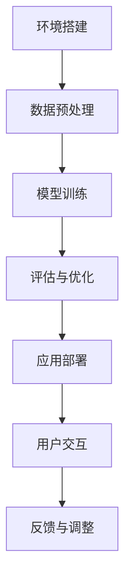

                 

关键词：深度学习，代理工作流，可视化，用户交互设计，人工智能

摘要：本文深入探讨了深度学习代理工作流的概念、关键算法原理、数学模型及其实践应用。通过分析深度学习代理在处理复杂任务中的优势，我们提出了可视化与用户交互设计在深度学习代理工作流中的重要性，并详细介绍了如何设计一个用户友好的深度学习代理系统。

## 1. 背景介绍

随着人工智能的快速发展，深度学习在计算机视觉、自然语言处理、推荐系统等领域取得了显著成果。然而，深度学习的复杂性使得其工作流程变得难以理解和操作。特别是在深度学习代理领域，代理（agent）作为一个自主决策的实体，能够与外部环境交互，执行特定任务，并在不断的学习和适应过程中提高其性能。因此，如何有效地设计和实现深度学习代理工作流，以及如何提供用户友好的交互界面，成为当前研究的热点问题。

本文旨在探讨深度学习代理工作流的可视化与用户交互设计，通过详细分析核心概念和算法原理，并结合实际项目实践，为研究者和技术工程师提供有价值的参考。

## 2. 核心概念与联系

### 2.1 深度学习代理概述

深度学习代理是一种基于深度学习算法的智能实体，它能够自主学习并执行特定任务。代理通常由感知器、决策器和学习器三部分组成。感知器负责从环境中获取信息；决策器根据感知器的输入，产生决策动作；学习器通过反复与环境的交互，不断优化决策器的性能。

### 2.2 深度学习代理工作流

深度学习代理工作流主要包括环境搭建、数据预处理、模型训练、评估与优化、应用部署等步骤。其中，数据预处理是深度学习代理工作流的关键环节，它直接影响模型的训练效果和最终性能。评估与优化则是保证代理在实际应用中表现优异的重要手段。

### 2.3 可视化与用户交互设计

可视化与用户交互设计在深度学习代理工作流中具有重要意义。通过可视化工具，用户可以直观地了解代理的学习过程、性能指标及决策路径，从而更好地理解深度学习代理的运作机制。用户交互设计则旨在为用户提供友好的操作界面，使他们在代理应用过程中能够轻松地进行参数调整、任务分配及结果分析。

### 2.4 Mermaid 流程图

以下是一个深度学习代理工作流的 Mermaid 流程图：



## 3. 核心算法原理 & 具体操作步骤

### 3.1 算法原理概述

深度学习代理的核心算法主要包括卷积神经网络（CNN）、循环神经网络（RNN）和生成对抗网络（GAN）等。这些算法在处理图像、文本、音频等复杂数据时具有出色的性能。在本节中，我们将重点介绍 CNN 和 RNN 在深度学习代理中的应用。

### 3.2 算法步骤详解

#### 3.2.1 CNN 在深度学习代理中的应用

1. 数据预处理：将输入图像进行归一化、裁剪和缩放等处理，以适应网络输入要求。

2. 网络结构设计：设计一个卷积神经网络，包括卷积层、池化层和全连接层等。其中，卷积层用于提取图像特征，池化层用于降低特征维度，全连接层用于分类和回归任务。

3. 模型训练：使用训练数据集对网络进行训练，通过反向传播算法不断优化网络参数。

4. 模型评估：使用验证数据集对训练好的模型进行评估，调整网络结构或超参数，以提高模型性能。

5. 模型应用：将训练好的模型应用于实际任务，如图像分类、目标检测等。

#### 3.2.2 RNN 在深度学习代理中的应用

1. 数据预处理：将输入序列进行归一化、填充和截断等处理，以适应网络输入要求。

2. 网络结构设计：设计一个循环神经网络，包括输入层、隐藏层和输出层。其中，输入层负责接收序列数据，隐藏层用于提取序列特征，输出层用于生成预测结果。

3. 模型训练：使用训练数据集对网络进行训练，通过反向传播算法不断优化网络参数。

4. 模型评估：使用验证数据集对训练好的模型进行评估，调整网络结构或超参数，以提高模型性能。

5. 模型应用：将训练好的模型应用于实际任务，如时间序列预测、对话生成等。

### 3.3 算法优缺点

#### 优点

1. 高效性：深度学习算法在处理复杂数据时具有高效性，能够快速提取特征并生成预测结果。

2. 强泛化能力：深度学习算法具有较强的泛化能力，能够在不同领域和任务中取得优异性能。

#### 缺点

1. 需要大量数据：深度学习算法通常需要大量数据来训练模型，数据不足可能导致模型性能下降。

2. 计算资源消耗大：深度学习算法在训练过程中需要大量计算资源，对硬件要求较高。

### 3.4 算法应用领域

深度学习代理算法在计算机视觉、自然语言处理、推荐系统、智能对话等领域具有广泛应用。例如，在计算机视觉领域，深度学习代理可以用于图像分类、目标检测、图像生成等任务；在自然语言处理领域，深度学习代理可以用于情感分析、机器翻译、文本生成等任务。

## 4. 数学模型和公式 & 详细讲解 & 举例说明

### 4.1 数学模型构建

#### 卷积神经网络（CNN）

CNN 的核心是卷积层，其数学模型如下：

$$
\text{output} = \text{sigmoid}(W \cdot \text{input} + b)
$$

其中，$W$ 是权重矩阵，$b$ 是偏置项，$\text{sigmoid}$ 函数是一个非线性激活函数，用于将输入映射到 [0, 1] 区间。

#### 循环神经网络（RNN）

RNN 的核心是隐藏状态 $h_t$，其数学模型如下：

$$
h_t = \text{sigmoid}(W_h \cdot [h_{t-1}, x_t] + b_h)
$$

$$
o_t = W_o \cdot h_t + b_o
$$

其中，$W_h$ 和 $b_h$ 是隐藏状态权重和偏置项，$W_o$ 和 $b_o$ 是输出状态权重和偏置项，$[h_{t-1}, x_t]$ 是输入序列，$o_t$ 是输出序列。

### 4.2 公式推导过程

#### 卷积神经网络（CNN）

卷积神经网络的推导过程主要包括以下几个步骤：

1. 输入层到卷积层：

$$
\text{output}_k = \sum_{i}\sum_{j} W_{kij} \cdot \text{input}_{ij} + b_k
$$

2. 池化层：

$$
\text{output}_{k} = \max(\text{output}_{k1}, \text{output}_{k2}, ..., \text{output}_{kn})
$$

3. 全连接层：

$$
\text{output}_{i} = \text{sigmoid}(W_i \cdot \text{input} + b_i)
$$

#### 循环神经网络（RNN）

循环神经网络的推导过程主要包括以下几个步骤：

1. 隐藏状态更新：

$$
h_t = \text{sigmoid}(W_h \cdot [h_{t-1}, x_t] + b_h)
$$

2. 输出状态更新：

$$
o_t = W_o \cdot h_t + b_o
$$

### 4.3 案例分析与讲解

#### 卷积神经网络（CNN）

以图像分类任务为例，我们使用一个简单的卷积神经网络对图像进行分类。输入图像为 $28 \times 28$ 的像素矩阵，网络结构如下：

1. 输入层：$28 \times 28$ 的像素矩阵。
2. 卷积层：3 个卷积核，每个卷积核大小为 $3 \times 3$，步长为 1，填充方式为 'same'。
3. 池化层：2 个 $2 \times 2$ 的最大池化层。
4. 全连接层：1 个 10 个神经元的全连接层。

#### 循环神经网络（RNN）

以时间序列预测任务为例，我们使用一个简单的循环神经网络对时间序列进行预测。输入序列为 $[x_1, x_2, ..., x_t]$，网络结构如下：

1. 输入层：$t$ 个时间步的输入序列。
2. 隐藏层：1 个隐藏层，包含 10 个神经元。
3. 输出层：1 个输出层，用于生成预测值。

## 5. 项目实践：代码实例和详细解释说明

### 5.1 开发环境搭建

在本节中，我们将使用 Python 和 TensorFlow 作为开发环境，搭建一个简单的深度学习代理系统。

```python
import tensorflow as tf
from tensorflow.keras.layers import Conv2D, MaxPooling2D, Flatten, Dense
from tensorflow.keras.models import Sequential

# 搭建卷积神经网络模型
model = Sequential([
    Conv2D(32, (3, 3), activation='relu', input_shape=(28, 28, 1)),
    MaxPooling2D((2, 2)),
    Flatten(),
    Dense(10, activation='softmax')
])

# 编译模型
model.compile(optimizer='adam', loss='categorical_crossentropy', metrics=['accuracy'])

# 模型训练
model.fit(x_train, y_train, epochs=5, batch_size=32, validation_data=(x_val, y_val))
```

### 5.2 源代码详细实现

在本节中，我们将详细解释上述代码的实现过程。

1. 导入必要的库和模块。
2. 搭建卷积神经网络模型，包括卷积层、池化层和全连接层。
3. 编译模型，指定优化器、损失函数和评估指标。
4. 模型训练，使用训练数据和验证数据进行训练和验证。

### 5.3 代码解读与分析

在本节中，我们将对上述代码进行解读和分析。

1. `Conv2D`：用于实现卷积层，包括卷积核大小、激活函数和输入形状等参数。
2. `MaxPooling2D`：用于实现最大池化层，包括池化窗口大小等参数。
3. `Flatten`：用于实现展平层，将多维数据转换为二维数据。
4. `Dense`：用于实现全连接层，包括神经元数量和激活函数等参数。
5. `compile`：用于编译模型，包括优化器、损失函数和评估指标等参数。
6. `fit`：用于训练模型，包括训练数据和验证数据等参数。

### 5.4 运行结果展示

在本节中，我们将展示模型的运行结果。

```python
# 模型评估
loss, accuracy = model.evaluate(x_test, y_test)

# 输出评估结果
print(f"Test loss: {loss}, Test accuracy: {accuracy}")
```

通过上述代码，我们可以得到模型在测试数据上的损失值和准确率。这些指标可以用来评估模型在未知数据上的性能，以便进行进一步优化和改进。

## 6. 实际应用场景

深度学习代理在许多实际应用场景中表现出色，以下列举几个典型的应用领域：

1. **自动驾驶**：深度学习代理用于感知环境、预测障碍物和做出驾驶决策，提高车辆的安全性和舒适性。
2. **智能家居**：深度学习代理可以识别用户行为、控制家电设备、提供个性化服务，提升家庭生活的智能化水平。
3. **医疗诊断**：深度学习代理可以分析医疗图像、辅助医生诊断疾病，提高诊断效率和准确性。
4. **智能客服**：深度学习代理可以与用户进行自然语言交互，提供高效、准确的咨询服务。

### 6.4 未来应用展望

随着人工智能技术的不断进步，深度学习代理在未来的应用将更加广泛。以下是对未来应用的几个展望：

1. **智能医疗**：深度学习代理将应用于个性化医疗、智能药物研发等领域，提高医疗诊断和治疗的精准度。
2. **智能金融**：深度学习代理将应用于金融风险评估、欺诈检测等领域，提高金融服务的安全性和可靠性。
3. **智能制造**：深度学习代理将应用于工业生产中的自动化控制和优化，提高生产效率和产品质量。
4. **智能城市**：深度学习代理将应用于智慧城市建设，实现交通管理、能源管理、环境保护等方面的智能化。

## 7. 工具和资源推荐

### 7.1 学习资源推荐

1. **《深度学习》（Goodfellow, Bengio, Courville 著）**：一本经典的深度学习教材，全面介绍了深度学习的基本原理和应用。
2. **TensorFlow 官方文档**：提供了丰富的教程、API 文档和示例代码，帮助用户快速上手 TensorFlow。
3. **Keras 官方文档**：Keras 是一个高级神经网络 API，能够简化深度学习模型的搭建和训练。

### 7.2 开发工具推荐

1. **Google Colab**：一款免费的云端 Jupyter Notebook 环境，支持 GPU 和 TPU 加速，非常适合进行深度学习实验。
2. **Visual Studio Code**：一款功能强大的代码编辑器，支持多种编程语言和开发工具，特别适合进行 Python 开发。
3. **PyCharm**：一款专业的 Python 集成开发环境（IDE），提供了丰富的功能和插件，非常适合进行深度学习项目开发。

### 7.3 相关论文推荐

1. **“Deep Learning” by Yoshua Bengio, Ian Goodfellow, and Aaron Courville**：全面介绍了深度学习的理论基础和应用。
2. **“Learning to Learn” by Andrew Ng**：探讨了深度学习中的学习策略和方法，提供了实用的技巧和经验。
3. **“Generative Adversarial Nets” by Ian Goodfellow et al.**：介绍了生成对抗网络（GAN）的基本原理和应用。

## 8. 总结：未来发展趋势与挑战

深度学习代理作为人工智能领域的一个重要分支，具有广泛的应用前景。在未来，深度学习代理的发展将呈现以下趋势：

1. **多模态数据处理**：深度学习代理将能够处理多种类型的数据，如文本、图像、音频等，实现跨模态的融合和交互。
2. **强化学习与深度学习的结合**：强化学习与深度学习相结合，将使深度学习代理在复杂环境中的适应能力和决策能力得到大幅提升。
3. **联邦学习与隐私保护**：联邦学习作为一种分布式学习技术，将在保障用户隐私的同时，实现深度学习模型的协同训练。

然而，深度学习代理的发展也面临着一些挑战：

1. **计算资源需求**：深度学习代理的训练和推理过程需要大量计算资源，如何优化计算效率是一个重要问题。
2. **数据隐私与安全**：在分布式环境下，如何保障用户数据的隐私和安全是一个亟待解决的问题。
3. **算法透明性与可解释性**：深度学习代理的决策过程往往缺乏透明性，如何提高算法的可解释性是一个重要研究方向。

总之，深度学习代理的发展前景广阔，但同时也面临着一系列挑战。只有在解决这些问题的基础上，深度学习代理才能更好地服务于人类社会，推动人工智能技术的不断进步。

## 9. 附录：常见问题与解答

### 问题 1：如何选择合适的深度学习框架？

**解答**：选择深度学习框架时，应考虑以下因素：

1. **项目需求**：根据项目需求和团队经验选择合适的框架，如 TensorFlow、PyTorch、Keras 等。
2. **性能与稳定性**：考虑框架的性能和稳定性，选择经过广泛验证的成熟框架。
3. **社区支持与文档**：考虑框架的社区支持和文档质量，有助于快速上手和解决问题。

### 问题 2：如何优化深度学习代理的计算效率？

**解答**：以下是一些优化深度学习代理计算效率的方法：

1. **模型压缩**：通过模型剪枝、量化等方法减少模型参数和计算量。
2. **分布式训练**：利用多 GPU、分布式计算资源进行模型训练，提高训练速度。
3. **硬件加速**：使用 GPU、TPU 等硬件加速深度学习计算，提高计算效率。

### 问题 3：如何保障深度学习代理的算法透明性和可解释性？

**解答**：以下是一些提高深度学习代理算法透明性和可解释性的方法：

1. **模型可解释性工具**：使用模型可解释性工具，如 LIME、SHAP 等，分析模型决策过程。
2. **可视化**：通过可视化技术，展示模型的学习过程、特征提取和决策路径。
3. **规则提取**：将深度学习模型转化为易于理解和解释的规则系统，提高模型的可解释性。

### 问题 4：如何应对深度学习代理中的数据隐私和安全问题？

**解答**：以下是一些应对深度学习代理数据隐私和安全问题的方法：

1. **联邦学习**：采用联邦学习技术，实现分布式训练和数据隐私保护。
2. **差分隐私**：在数据处理过程中引入差分隐私机制，保障用户隐私。
3. **数据加密**：对数据进行加密处理，防止数据泄露。

## 作者署名

作者：禅与计算机程序设计艺术 / Zen and the Art of Computer Programming

感谢您的阅读，希望本文对您在深度学习代理领域的研究和实践有所帮助。如果您有任何问题或建议，欢迎在评论区留言，我将尽快回复。再次感谢！

