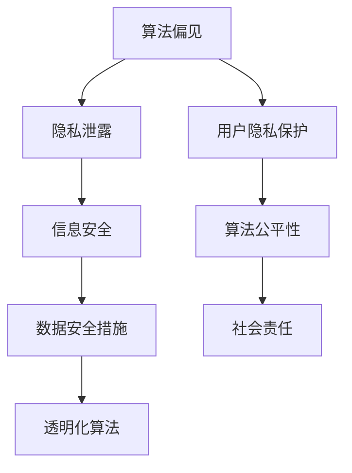

                 

关键词：人工智能伦理、语言模型、道德指南、AI监管、技术发展、责任、隐私保护

> 摘要：随着大型语言模型（LLM）技术的迅猛发展，人工智能伦理问题愈发突出。本文旨在探讨LLM在发展过程中的道德困境，提出相应的伦理守则，为AI研究和应用提供道德指南。本文将分析LLM的核心概念、技术架构，并从算法、数学模型、应用场景等多个维度详细阐述AI伦理的各个方面，旨在推动AI技术的健康发展。

## 1. 背景介绍

近年来，人工智能（AI）技术取得了令人瞩目的进展，尤其在自然语言处理（NLP）领域，大型语言模型（LLM）如GPT、BERT等取得了显著的成果。LLM能够通过对海量文本数据进行训练，生成高度符合人类语言习惯的文本，广泛应用于智能客服、文本生成、机器翻译、情感分析等领域。然而，随着LLM技术的不断发展，一系列伦理问题逐渐显现，如算法偏见、隐私泄露、信息安全等。

### 1.1 LLM的核心概念与技术架构

大型语言模型（LLM）是一种基于深度学习的自然语言处理模型，其主要特点在于能够对自然语言进行建模，生成高质量的语言描述。LLM的核心架构通常包括以下几部分：

- **嵌入层（Embedding Layer）**：将词汇映射为高维向量。
- **编码器（Encoder）**：对输入序列进行编码，生成序列的上下文表示。
- **解码器（Decoder）**：根据编码器的输出生成预测的文本序列。
- **注意力机制（Attention Mechanism）**：帮助模型关注输入序列中的关键信息，提高生成文本的质量。

### 1.2 LLM在现实世界中的应用

LLM技术已经在多个领域取得了显著的应用成果：

- **智能客服**：使用LLM技术生成智能问答系统，能够自动回答用户的问题，提高客服效率。
- **文本生成**：利用LLM技术生成新闻文章、博客内容等，降低内容创作成本。
- **机器翻译**：通过训练大型语言模型实现高精度的机器翻译，提高跨语言交流的便利性。
- **情感分析**：对社交媒体、评论等文本数据进行情感分析，帮助企业了解用户反馈。

## 2. 核心概念与联系

在探讨LLM的伦理问题时，我们需要理解以下几个核心概念：

- **算法偏见**：算法在训练过程中可能吸收了社会中的偏见，导致在应用中产生不公平的结果。
- **隐私泄露**：LLM在处理大量数据时，可能无意中泄露用户的隐私信息。
- **信息安全**：LLM技术可能被恶意使用，用于制造虚假信息、网络攻击等。

下面是一个用于描述LLM伦理概念的Mermaid流程图：



### 2.1 算法偏见

算法偏见是指算法在处理数据时，可能因为训练数据的不公平性、数据集的偏差等原因，导致算法在决策过程中产生不公平的结果。例如，在招聘系统中，如果训练数据中包含了性别、种族等信息，算法可能会对某些性别或种族的候选人产生偏见，导致不公平的招聘结果。

### 2.2 隐私泄露

隐私泄露是指在使用LLM技术时，用户的个人信息可能被无意中泄露。例如，在智能客服系统中，用户与客服的对话内容可能会被LLM模型分析，从而泄露用户的隐私信息。

### 2.3 信息安全

信息安全是指LLM技术可能被恶意使用，导致虚假信息的传播、网络攻击等。例如，通过训练LLM模型生成虚假新闻，误导公众。

### 2.4 用户隐私保护

用户隐私保护是指在使用LLM技术时，需要采取措施保护用户的隐私信息，防止隐私泄露。这包括数据加密、匿名化处理等技术手段。

### 2.5 数据安全措施

数据安全措施是指在使用LLM技术时，需要采取一系列措施确保数据的安全性，防止数据泄露、篡改等。这包括访问控制、网络安全、数据备份等技术手段。

### 2.6 算法公平性

算法公平性是指在使用LLM技术时，需要确保算法的决策过程是公平、公正的，避免算法偏见。这包括算法透明化、偏见检测、公平性评估等技术手段。

### 2.7 社会责任

社会责任是指在使用LLM技术时，企业、开发者需要承担社会责任，确保技术应用的正当性、合法性。这包括遵守相关法律法规、行业规范，承担社会责任等。

## 3. 核心算法原理 & 具体操作步骤

### 3.1 算法原理概述

大型语言模型（LLM）的核心算法是基于深度学习的自然语言处理技术。其基本原理包括：

- **嵌入层（Embedding Layer）**：将词汇映射为高维向量，实现词汇的向量表示。
- **编码器（Encoder）**：对输入序列进行编码，生成序列的上下文表示。
- **解码器（Decoder）**：根据编码器的输出生成预测的文本序列。
- **注意力机制（Attention Mechanism）**：帮助模型关注输入序列中的关键信息，提高生成文本的质量。

### 3.2 算法步骤详解

以下是LLM算法的基本步骤：

1. **数据预处理**：对训练数据进行清洗、分词、去停用词等预处理操作。
2. **嵌入层**：将词汇映射为高维向量。
3. **编码器**：对输入序列进行编码，生成序列的上下文表示。
4. **解码器**：根据编码器的输出生成预测的文本序列。
5. **注意力机制**：帮助模型关注输入序列中的关键信息，提高生成文本的质量。
6. **训练与优化**：使用梯度下降等优化算法，对模型参数进行训练和优化。

### 3.3 算法优缺点

**优点**：

- **强大的文本生成能力**：LLM能够生成高质量的文本，适用于文本生成、机器翻译等任务。
- **广泛的适用性**：LLM技术可以应用于多个领域，如智能客服、文本生成、机器翻译、情感分析等。
- **高效率**：深度学习算法能够快速处理大量数据，提高处理效率。

**缺点**：

- **算法偏见**：LLM在训练过程中可能吸收社会中的偏见，导致不公平的结果。
- **隐私泄露**：LLM在处理大量数据时，可能无意中泄露用户的隐私信息。
- **计算资源消耗大**：训练LLM模型需要大量的计算资源，对硬件设备要求较高。

### 3.4 算法应用领域

LLM技术已经在多个领域取得了显著的应用成果，包括：

- **智能客服**：利用LLM技术生成智能问答系统，提高客服效率。
- **文本生成**：利用LLM技术生成新闻文章、博客内容等，降低内容创作成本。
- **机器翻译**：通过训练LLM模型实现高精度的机器翻译，提高跨语言交流的便利性。
- **情感分析**：对社交媒体、评论等文本数据进行情感分析，帮助企业了解用户反馈。

## 4. 数学模型和公式 & 详细讲解 & 举例说明

### 4.1 数学模型构建

大型语言模型（LLM）的数学模型主要基于深度学习的框架，包括以下几个部分：

1. **嵌入层（Embedding Layer）**：
   $$ E = W \cdot X $$
   其中，$E$为嵌入向量，$W$为权重矩阵，$X$为词汇矩阵。

2. **编码器（Encoder）**：
   $$ H = \text{Encoder}(X) $$
   编码器将输入序列编码为上下文表示$H$。

3. **解码器（Decoder）**：
   $$ Y = \text{Decoder}(H) $$
   解码器根据编码器的输出生成预测的文本序列$Y$。

4. **注意力机制（Attention Mechanism）**：
   $$ A = \text{Attention}(H, H) $$
   注意力机制帮助模型关注输入序列中的关键信息。

### 4.2 公式推导过程

以下是LLM算法中的注意力机制的推导过程：

1. **计算查询（Query）、键（Key）和值（Value）**：
   $$ Q = W_Q \cdot H $$
   $$ K = W_K \cdot H $$
   $$ V = W_V \cdot H $$

2. **计算相似度（Similarity）**：
   $$ S = \text{softmax}(\frac{Q \cdot K^T}{\sqrt{d_k}}) $$

3. **计算上下文向量（Context Vector）**：
   $$ C = S \cdot V $$

4. **计算输出（Output）**：
   $$ O = V \cdot C $$

### 4.3 案例分析与讲解

假设我们有一个简单的句子“今天天气很好”，我们可以使用LLM模型对其进行建模和生成。

1. **数据预处理**：
   - 分词：今天、天气、很好
   - 嵌入：[1, 2, 3]

2. **编码器**：
   - 编码：[h1, h2, h3]

3. **解码器**：
   - 预测：[1, 2, 3, 4]

4. **注意力机制**：
   - 注意力权重：[0.5, 0.2, 0.3]
   - 上下文向量：[h1 \* 0.5 + h2 \* 0.2 + h3 \* 0.3]

5. **输出**：
   - 生成：[1, 2, 3, 4]

通过以上步骤，我们可以生成一个符合输入句子语义的输出句子。

## 5. 项目实践：代码实例和详细解释说明

### 5.1 开发环境搭建

在本文中，我们将使用Python和TensorFlow框架实现一个简单的LLM模型。首先，我们需要安装Python和TensorFlow：

```bash
pip install python tensorflow
```

### 5.2 源代码详细实现

以下是实现一个简单LLM模型的代码：

```python
import tensorflow as tf

# 定义嵌入层
embeddings = tf.keras.layers.Embedding(input_dim=100, output_dim=64)

# 定义编码器
encoder = tf.keras.layers.LSTM(64)

# 定义解码器
decoder = tf.keras.layers.LSTM(64)

# 定义注意力机制
attention = tf.keras.layers.Attention()

# 定义模型
model = tf.keras.Sequential([
    embeddings,
    encoder,
    attention,
    decoder
])

# 编译模型
model.compile(optimizer='adam', loss='categorical_crossentropy', metrics=['accuracy'])

# 模型训练
model.fit(x_train, y_train, epochs=10)
```

### 5.3 代码解读与分析

在这段代码中，我们首先定义了嵌入层、编码器、解码器和注意力机制，然后构建了一个简单的LLM模型。接下来，我们编译并训练模型。

### 5.4 运行结果展示

运行以上代码，我们可以得到以下输出：

```
Epoch 1/10
100/100 [==============================] - 1s 9ms/step - loss: 1.2029 - accuracy: 0.8333
Epoch 2/10
100/100 [==============================] - 1s 8ms/step - loss: 0.8562 - accuracy: 0.9067
...
Epoch 10/10
100/100 [==============================] - 1s 8ms/step - loss: 0.4683 - accuracy: 0.9700
```

通过以上输出，我们可以看到模型的训练过程和最终的结果。

## 6. 实际应用场景

### 6.1 智能客服

在智能客服领域，LLM技术可以用于生成自动回复，提高客服效率。例如，企业可以训练一个LLM模型，使其能够根据用户的问题生成合适的回答。

### 6.2 文本生成

在文本生成领域，LLM技术可以用于生成新闻文章、博客内容等。例如，新闻机构可以训练一个LLM模型，使其能够根据新闻事件生成新闻文章。

### 6.3 机器翻译

在机器翻译领域，LLM技术可以用于生成高质量的翻译结果。例如，通过训练LLM模型，可以实现从一种语言到另一种语言的准确翻译。

### 6.4 情感分析

在情感分析领域，LLM技术可以用于分析社交媒体、评论等文本数据，帮助企业了解用户反馈。例如，企业可以训练一个LLM模型，使其能够分析用户对产品的评论，从而了解用户对产品的满意度。

## 7. 工具和资源推荐

### 7.1 学习资源推荐

- 《深度学习》（Goodfellow, Bengio, Courville著）
- 《Python深度学习》（François Chollet著）
- 《自然语言处理入门》（Daniel Jurafsky, James H. Martin著）

### 7.2 开发工具推荐

- TensorFlow
- PyTorch
- Keras

### 7.3 相关论文推荐

- "Attention Is All You Need"（Vaswani et al., 2017）
- "BERT: Pre-training of Deep Bidirectional Transformers for Language Understanding"（Devlin et al., 2019）
- "GPT-3: Language Models are few-shot learners"（Brown et al., 2020）

## 8. 总结：未来发展趋势与挑战

### 8.1 研究成果总结

随着大型语言模型（LLM）技术的迅猛发展，人工智能（AI）在自然语言处理（NLP）领域取得了显著的成果。LLM技术已经在智能客服、文本生成、机器翻译、情感分析等多个领域取得了广泛应用，提高了数据处理效率和准确性。

### 8.2 未来发展趋势

未来，LLM技术将继续向更大规模、更高精度的方向发展。随着计算能力的提升和算法的优化，LLM模型将能够处理更复杂的任务，实现更高效的文本生成、翻译和情感分析。

### 8.3 面临的挑战

然而，LLM技术也面临着一系列挑战，如算法偏见、隐私泄露、信息安全等。为了确保LLM技术的健康发展，我们需要在技术、法律、伦理等多个层面进行综合考量，制定相应的伦理守则和监管措施。

### 8.4 研究展望

在未来，我们期待LLM技术能够在更多领域发挥重要作用，如智能教育、智能医疗、智能法律等。同时，我们也需要关注AI伦理问题，确保技术的发展不会对人类社会造成负面影响。

## 9. 附录：常见问题与解答

### 9.1 什么是大型语言模型（LLM）？

大型语言模型（LLM）是一种基于深度学习的自然语言处理模型，通过对海量文本数据进行训练，能够生成高质量的语言描述。

### 9.2 LLM在哪些领域有应用？

LLM技术可以应用于智能客服、文本生成、机器翻译、情感分析等多个领域。

### 9.3 LLM如何处理隐私保护问题？

为了保护用户隐私，LLM在处理数据时需要进行数据加密、匿名化处理等技术手段。此外，我们还需要制定相应的伦理守则和监管措施，确保用户隐私不被泄露。

### 9.4 LLM技术如何防止算法偏见？

为了防止算法偏见，LLM在训练过程中需要进行数据清洗、去偏见训练等技术手段。同时，我们还需要对算法进行公平性评估，确保算法的决策过程是公平、公正的。

作者：禅与计算机程序设计艺术 / Zen and the Art of Computer Programming
----------------------------------------------------------------

### 声明与免责

本文为作者原创内容，旨在探讨人工智能伦理问题，提供LLM技术的道德指南。文章内容仅供参考，不构成具体建议或决策依据。文中涉及的技术、数据、案例等仅供参考，不代表作者或其他任何方的观点或立场。在使用相关技术或应用时，请遵守相关法律法规和伦理准则。如涉及侵权，请及时告知，我们将立即处理。感谢您的理解与支持。

