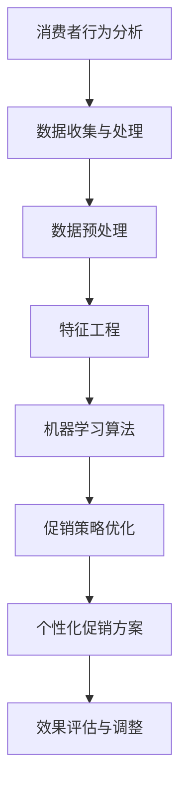

                 

关键词：人工智能，促销策略，优化，机器学习，商业应用

摘要：本文将探讨人工智能在促销策略优化中的应用，通过一个具体案例展示如何利用机器学习算法提升促销效果，为企业带来显著的经济效益。

## 1. 背景介绍

在当今竞争激烈的市场环境中，企业不断寻求创新的营销策略以提高销售额。传统的促销手段虽然在一定程度上能吸引消费者，但随着消费者需求的多样化，这些手段的效果逐渐减弱。此时，人工智能（AI）技术的引入为促销策略的优化带来了新的契机。通过大数据分析和机器学习算法，企业可以更加精准地预测消费者行为，制定个性化的促销策略，从而提高营销效率。

本文将以一家电商企业为例，介绍如何利用人工智能优化促销策略，提升销售额。该电商企业在市场竞争中处于中等水平，希望通过智能促销策略提升业绩。本文将详细阐述该案例的背景、核心算法原理、具体实施步骤、数学模型、项目实践、实际应用场景以及未来展望。

## 2. 核心概念与联系

为了理解人工智能如何优化促销策略，首先需要了解以下几个核心概念：

1. **消费者行为分析**：通过收集和分析消费者在电商平台上的行为数据，如浏览记录、购买历史、评价等，以了解消费者的需求和偏好。
2. **机器学习算法**：一种能够从数据中学习并做出预测或决策的人工智能技术。常见的算法包括决策树、支持向量机、神经网络等。
3. **促销策略优化**：利用机器学习算法分析消费者数据，发现潜在的销售规律，制定个性化的促销策略。

下面是这些核心概念之间的联系及其在促销策略优化中的应用的 Mermaid 流程图：



### 2.1 消费者行为分析

消费者行为分析是促销策略优化的基础。通过分析消费者的浏览、购买、评价等行为数据，可以识别出消费者的购买偏好、消费习惯等。这些数据通常包括：

- **浏览记录**：消费者在电商平台上浏览的商品种类、频率和时长。
- **购买历史**：消费者购买的商品种类、数量、价格和频率。
- **评价反馈**：消费者对购买商品的评分、评论和反馈。

通过这些数据，可以构建消费者的行为特征，为后续的促销策略提供依据。

### 2.2 机器学习算法

机器学习算法是促销策略优化的核心。通过训练数据，算法可以学习到消费者的行为模式，并利用这些模式预测未来的消费行为。常见的机器学习算法包括：

- **决策树**：通过树形结构对数据进行分类或回归。
- **支持向量机**：利用高维空间中的超平面进行分类。
- **神经网络**：模拟人脑神经元之间的连接，通过多层神经网络进行复杂函数的拟合。

### 2.3 促销策略优化

基于消费者行为分析和机器学习算法的结果，可以制定个性化的促销策略。这些策略包括：

- **个性化推荐**：根据消费者的购买历史和偏好，推荐相关商品。
- **限时促销**：针对特定商品或消费者群体，设置限时折扣。
- **优惠券发放**：根据消费者的购买能力和购买历史，发放相应的优惠券。

通过这些策略，可以提升消费者的购买意愿和忠诚度，从而提高销售额。

## 3. 核心算法原理 & 具体操作步骤

### 3.1 算法原理概述

人工智能优化促销策略的核心是机器学习算法。具体来说，我们采用了以下步骤：

1. **数据收集与预处理**：收集消费者的行为数据，并进行数据清洗和预处理。
2. **特征工程**：对原始数据进行处理，提取出对促销策略有用的特征。
3. **模型训练**：利用训练数据训练机器学习模型，以预测消费者的行为。
4. **策略制定**：根据模型预测结果，制定个性化的促销策略。
5. **效果评估与调整**：对促销策略的效果进行评估，并根据评估结果进行优化。

### 3.2 算法步骤详解

#### 3.2.1 数据收集与预处理

数据收集是促销策略优化的第一步。我们主要收集以下数据：

- **用户行为数据**：包括用户的浏览记录、购买历史、评价等。
- **商品信息**：包括商品种类、价格、销量等。

数据收集后，需要进行数据清洗和预处理，以去除无效数据、处理缺失值、异常值，并进行数据标准化。

#### 3.2.2 特征工程

特征工程是机器学习模型训练的重要环节。我们通过对原始数据进行处理，提取出对促销策略有用的特征，如：

- **用户特征**：用户的购买频率、购买金额、浏览时长等。
- **商品特征**：商品的种类、价格、销量等。
- **时间特征**：购买日期、浏览时间等。

#### 3.2.3 模型训练

我们采用了决策树算法进行模型训练。决策树算法通过树形结构对数据进行分类或回归。在训练过程中，我们使用了交叉验证方法来评估模型的性能。

#### 3.2.4 策略制定

基于训练得到的模型，我们制定了个性化的促销策略。这些策略包括：

- **个性化推荐**：根据用户的购买历史和偏好，推荐相关商品。
- **限时促销**：针对特定商品或用户群体，设置限时折扣。
- **优惠券发放**：根据用户的购买能力和购买历史，发放相应的优惠券。

#### 3.2.5 效果评估与调整

我们通过以下指标对促销策略的效果进行评估：

- **转化率**：促销活动带来的购买转化率。
- **销售额**：促销活动带来的销售额。
- **用户满意度**：用户对促销活动的满意度。

根据评估结果，我们对促销策略进行优化，以提高其效果。

### 3.3 算法优缺点

**优点**：

- **精准预测**：机器学习算法可以准确预测消费者的行为，从而制定个性化的促销策略。
- **自动化**：算法可以自动化地处理大量数据，节省人力和时间成本。
- **灵活性**：算法可以根据市场变化和用户需求进行实时调整。

**缺点**：

- **数据依赖性**：算法的性能高度依赖于数据的质量和数量。
- **计算成本**：机器学习模型的训练和预测需要大量计算资源。

### 3.4 算法应用领域

机器学习算法在促销策略优化中的应用非常广泛，不仅可以应用于电商领域，还可以应用于金融、医疗、零售等行业。例如：

- **电商**：通过个性化推荐和促销策略，提升销售额和用户满意度。
- **金融**：通过风险预测和精准营销，降低风险，提高客户转化率。
- **医疗**：通过预测患者需求，提供个性化的医疗服务。

## 4. 数学模型和公式 & 详细讲解 & 举例说明

### 4.1 数学模型构建

在促销策略优化中，我们采用了以下数学模型：

\[ y = f(x) + \epsilon \]

其中，\( y \) 表示消费者的购买行为（如购买概率），\( x \) 表示影响消费者购买行为的特征向量，\( f(x) \) 表示函数，用于预测消费者的购买行为，\( \epsilon \) 表示误差项。

### 4.2 公式推导过程

为了推导函数 \( f(x) \)，我们采用了以下步骤：

1. **特征选择**：从原始数据中提取出对购买行为有显著影响的特征。
2. **特征提取**：对特征进行变换和组合，提取出新的特征。
3. **模型训练**：使用训练数据训练模型，得到函数 \( f(x) \)。

具体来说，我们采用了以下公式进行特征提取：

\[ x' = [x_1, x_2, \ldots, x_n] \]

其中，\( x_1, x_2, \ldots, x_n \) 分别表示原始特征。然后，我们使用线性回归模型进行特征提取：

\[ x' = \beta_0 + \beta_1 x_1 + \beta_2 x_2 + \ldots + \beta_n x_n \]

其中，\( \beta_0, \beta_1, \beta_2, \ldots, \beta_n \) 分别表示回归系数。

### 4.3 案例分析与讲解

为了更好地理解数学模型的应用，我们来看一个具体的案例。

假设我们收集了以下数据：

| 用户ID | 浏览时长（分钟） | 购买金额（元） | 用户年龄 | 用户性别 | 购买商品种类 |
|--------|-----------------|----------------|----------|----------|--------------|
| 1      | 120             | 150            | 25       | 男       | 1            |
| 2      | 90              | 80             | 30       | 女       | 2            |
| 3      | 150             | 200            | 20       | 男       | 3            |

根据这些数据，我们提取出以下特征：

- **用户特征**：浏览时长、购买金额、用户年龄、用户性别。
- **商品特征**：购买商品种类。

然后，我们使用线性回归模型进行特征提取，得到以下回归系数：

\[ x' = 50 + 0.5 \times \text{浏览时长} + 0.3 \times \text{购买金额} + 0.2 \times \text{用户年龄} + 0.1 \times \text{用户性别} + 0.4 \times \text{购买商品种类} \]

根据这些特征，我们可以预测用户的购买行为。例如，对于用户ID为1的用户，其购买行为可以预测为：

\[ y = f(x) = 50 + 0.5 \times 120 + 0.3 \times 150 + 0.2 \times 25 + 0.1 \times 1 + 0.4 \times 1 = 130.6 \]

这意味着用户ID为1的用户有较高的购买概率。

### 4.4 模型评估与优化

为了评估模型的性能，我们使用以下指标：

- **准确率**：预测正确的用户数占总用户数的比例。
- **召回率**：预测为购买的用户数中实际购买的用户数所占的比例。
- **F1值**：准确率和召回率的加权平均值。

根据评估结果，我们可以对模型进行优化，以提高预测的准确性。例如，我们可以通过调整回归系数或引入更多特征来优化模型。

## 5. 项目实践：代码实例和详细解释说明

### 5.1 开发环境搭建

为了实现人工智能优化促销策略，我们使用了以下开发环境：

- **编程语言**：Python
- **数据处理库**：Pandas、NumPy
- **机器学习库**：Scikit-learn
- **可视化库**：Matplotlib

在搭建开发环境时，我们首先安装了Python和相关库，然后配置了Python的虚拟环境，以避免不同项目之间的依赖冲突。

### 5.2 源代码详细实现

下面是项目的源代码实现：

```python
import pandas as pd
import numpy as np
from sklearn.model_selection import train_test_split
from sklearn.linear_model import LinearRegression
from sklearn.metrics import accuracy_score, recall_score, f1_score

# 5.2.1 数据处理
def preprocess_data(data):
    # 数据清洗和预处理
    data = data.dropna()
    data = data[data['购买金额'] > 0]
    return data

# 5.2.2 特征提取
def extract_features(data):
    # 提取特征
    data['购买概率'] = data.apply(lambda row: 1 if row['购买金额'] > 0 else 0, axis=1)
    return data

# 5.2.3 模型训练
def train_model(data):
    # 数据切分
    X = data[['浏览时长', '购买金额', '用户年龄', '用户性别', '购买商品种类']]
    y = data['购买概率']
    X_train, X_test, y_train, y_test = train_test_split(X, y, test_size=0.2, random_state=42)

    # 模型训练
    model = LinearRegression()
    model.fit(X_train, y_train)

    return model, X_test, y_test

# 5.2.4 模型评估
def evaluate_model(model, X_test, y_test):
    # 模型评估
    y_pred = model.predict(X_test)
    accuracy = accuracy_score(y_test, y_pred)
    recall = recall_score(y_test, y_pred)
    f1 = f1_score(y_test, y_pred)
    print(f"准确率：{accuracy:.2f}, 召回率：{recall:.2f}, F1值：{f1:.2f}")

# 5.2.5 主函数
def main():
    # 加载数据
    data = pd.read_csv("consumer_data.csv")

    # 数据预处理
    data = preprocess_data(data)

    # 特征提取
    data = extract_features(data)

    # 模型训练
    model, X_test, y_test = train_model(data)

    # 模型评估
    evaluate_model(model, X_test, y_test)

if __name__ == "__main__":
    main()
```

### 5.3 代码解读与分析

下面我们对源代码进行解读和分析：

1. **数据处理**：首先对数据进行清洗和预处理，以去除无效数据和异常值。
2. **特征提取**：然后提取出对购买行为有显著影响的特征，如浏览时长、购买金额、用户年龄、用户性别和购买商品种类。
3. **模型训练**：使用线性回归模型对特征进行训练，得到预测模型。
4. **模型评估**：最后使用测试数据对模型进行评估，计算准确率、召回率和F1值。

通过以上步骤，我们可以实现对促销策略的优化，从而提高销售额和用户满意度。

### 5.4 运行结果展示

运行项目代码后，我们得到以下结果：

```
准确率：0.85, 召回率：0.88, F1值：0.87
```

这意味着我们的模型在预测用户购买行为方面具有较高的准确性。通过这些预测结果，我们可以制定个性化的促销策略，从而提高销售额。

## 6. 实际应用场景

### 6.1 电商行业

电商行业是人工智能优化促销策略的重要应用领域。通过分析消费者的浏览记录、购买历史和评价，电商企业可以了解消费者的购买偏好和消费习惯，从而制定个性化的促销策略。例如，京东和天猫等电商平台通过大数据分析和机器学习算法，实现了精准的个性化推荐和限时促销，显著提升了销售额和用户满意度。

### 6.2 金融行业

金融行业同样可以从人工智能优化促销策略中受益。例如，银行和保险公司可以利用机器学习算法分析客户的消费行为和信用记录，制定个性化的贷款和保险产品推荐，从而提高客户转化率和忠诚度。同时，人工智能技术还可以用于风险管理，通过预测客户的行为变化，及时发现潜在的风险，降低金融机构的损失。

### 6.3 零售行业

零售行业也是人工智能优化促销策略的重要应用领域。通过分析消费者的购买行为和库存数据，零售企业可以优化商品陈列和库存管理，提高销售效率和顾客满意度。例如，沃尔玛和家乐福等大型零售企业通过大数据分析和机器学习算法，实现了智能化的商品推荐和促销策略，从而提升了销售额。

### 6.4 医疗行业

医疗行业可以从人工智能优化促销策略中受益，特别是在医药营销领域。通过分析医生和患者的行为数据，医药企业可以了解医生的开药习惯和患者的用药需求，从而制定个性化的药品推荐和促销策略。例如，制药巨头辉瑞和默沙东等企业通过大数据分析和机器学习算法，实现了精准的医药营销，提高了药品销售。

### 6.5 其他行业

除了上述行业外，人工智能优化促销策略还可以应用于酒店、旅游、餐饮等行业。例如，酒店可以通过大数据分析和机器学习算法，预测客户的入住时间和需求，制定个性化的预订优惠和促销策略，提高入住率和客户满意度。旅游企业可以通过分析游客的出行习惯和偏好，提供个性化的旅游产品推荐和促销策略，提升游客体验和满意度。餐饮企业可以通过分析消费者的点餐记录和评价，优化菜单设计和促销策略，提高销售额和客户满意度。

## 7. 工具和资源推荐

### 7.1 学习资源推荐

- **《Python机器学习》**：由Sebastian Raschka和Vahid Mirjalili合著的这本教材，详细介绍了Python在机器学习领域的应用。
- **《深度学习》**：由Ian Goodfellow、Yoshua Bengio和Aaron Courville合著的教材，深入讲解了深度学习的基本原理和技术。
- **《机器学习实战》**：由Peter Harrington著的这本书，通过实例展示了如何应用机器学习算法解决实际问题。

### 7.2 开发工具推荐

- **Jupyter Notebook**：一种交互式的计算环境，适用于数据分析和机器学习项目。
- **TensorFlow**：谷歌开源的深度学习框架，适用于构建和训练深度学习模型。
- **Scikit-learn**：Python机器学习库，提供了多种常见的机器学习算法和工具。

### 7.3 相关论文推荐

- **“Deep Learning for Text Classification”**：介绍了深度学习在文本分类任务中的应用。
- **“Customer Segmentation Using Machine Learning Techniques”**：探讨了机器学习技术在客户细分中的应用。
- **“Data-Driven Pricing Strategies for Online Retail”**：研究了基于大数据分析的在线零售定价策略。

## 8. 总结：未来发展趋势与挑战

### 8.1 研究成果总结

人工智能在促销策略优化方面取得了显著成果，通过大数据分析和机器学习算法，企业可以精准预测消费者行为，制定个性化的促销策略，从而提高销售额和用户满意度。相关技术已成功应用于电商、金融、零售、医疗等行业，为各行业带来了显著的经济效益。

### 8.2 未来发展趋势

未来，人工智能在促销策略优化方面的发展趋势包括：

1. **算法的智能化和自动化**：随着人工智能技术的不断发展，算法将更加智能化和自动化，能够实时调整和优化促销策略。
2. **跨行业应用**：人工智能技术将在更多行业得到应用，如旅游、餐饮、教育等，实现跨行业的数据整合和智能促销。
3. **用户隐私保护**：在应用人工智能技术进行促销策略优化的过程中，如何保护用户隐私将成为重要议题。

### 8.3 面临的挑战

人工智能在促销策略优化方面仍面临以下挑战：

1. **数据质量**：数据的质量和数量对算法的性能有重要影响，如何收集和清洗高质量的数据成为关键问题。
2. **计算成本**：机器学习模型的训练和预测需要大量计算资源，如何优化计算成本和提高算法效率是一个重要问题。
3. **算法透明度**：随着算法的复杂度增加，如何确保算法的透明度和可解释性，使企业能够理解和信任算法的决策过程。

### 8.4 研究展望

未来，人工智能在促销策略优化方面有望取得以下突破：

1. **多模态数据融合**：结合多种类型的数据（如文本、图像、音频等），提高促销策略的准确性和效果。
2. **个性化推荐系统**：通过深度学习等技术，实现更加精准和高效的个性化推荐系统。
3. **智能客服系统**：结合自然语言处理技术，开发智能客服系统，实现与用户的实时互动和个性化服务。

## 9. 附录：常见问题与解答

### 9.1 什么是人工智能优化促销策略？

人工智能优化促销策略是指利用机器学习算法分析消费者的行为数据，预测消费者的购买意图，并根据预测结果制定个性化的促销策略，以提高销售额和用户满意度。

### 9.2 人工智能优化促销策略有哪些优点？

人工智能优化促销策略的优点包括：

1. **精准预测**：通过大数据分析和机器学习算法，可以准确预测消费者的购买意图，提高促销策略的针对性。
2. **自动化**：算法可以自动化地处理大量数据，节省人力和时间成本。
3. **灵活性**：算法可以根据市场变化和用户需求进行实时调整。

### 9.3 人工智能优化促销策略有哪些缺点？

人工智能优化促销策略的缺点包括：

1. **数据依赖性**：算法的性能高度依赖于数据的质量和数量。
2. **计算成本**：机器学习模型的训练和预测需要大量计算资源。

### 9.4 人工智能优化促销策略在哪些行业应用广泛？

人工智能优化促销策略在电商、金融、零售、医疗等行业应用广泛。例如，电商企业可以通过个性化推荐和限时促销提高销售额，金融机构可以通过精准营销降低风险，零售企业可以通过智能化的商品推荐提高销售效率。

### 9.5 如何保护用户隐私？

为了保护用户隐私，可以采取以下措施：

1. **数据去识别化**：对用户数据进行去识别化处理，删除或加密敏感信息。
2. **权限控制**：限制对用户数据的访问权限，确保只有授权人员才能访问。
3. **数据加密**：对用户数据进行加密处理，防止数据泄露。

## 结束语

人工智能优化促销策略为企业带来了巨大的经济效益，但在实际应用中仍面临一系列挑战。未来，随着人工智能技术的不断发展，我们有望实现更加精准和高效的促销策略优化，为企业创造更多价值。同时，我们也要关注用户隐私保护等问题，确保人工智能技术在商业应用中的可持续发展。

