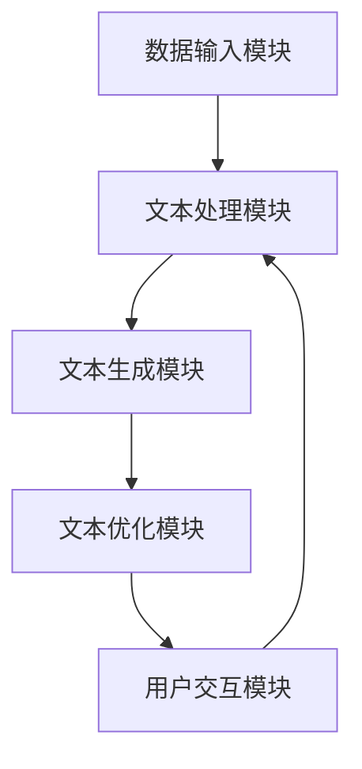

                 

  
## 1. 背景介绍

人工智能（AI）作为一种模仿人类智能的技术，近年来在全球范围内迅速发展，并在多个领域取得了显著成果。从智能助手到自动驾驶汽车，从医疗诊断到金融风险管理，AI的应用场景越来越广泛。然而，AI的发展不仅仅依赖于算法和计算能力的提升，更依赖于高质量的数据和高效的写作工具。

在信息爆炸的今天，写作成为了一种重要的技能。无论是学术研究、商业报告，还是日常交流，高质量的写作都能有效地传达信息、激发创意。然而，写作也是一个耗时且复杂的过程，需要深入思考、逻辑严谨和语言精准。这就催生了AI写作助手的诞生，它通过智能算法和大数据技术，帮助用户更高效地完成写作任务。

本文将探讨AI写作助手的技术实现和创意激发，旨在为广大用户提供一个深入了解和掌握这一前沿技术的窗口。文章将分为以下几个部分：

- **背景介绍**：介绍AI写作助手产生的背景和市场需求。
- **核心概念与联系**：阐述AI写作助手的核心概念和架构。
- **核心算法原理 & 具体操作步骤**：详细解析AI写作助手的算法原理和操作步骤。
- **数学模型和公式 & 详细讲解 & 举例说明**：介绍AI写作助手的数学模型和公式，并通过案例进行分析。
- **项目实践：代码实例和详细解释说明**：通过具体项目实例，展示AI写作助手的实际应用。
- **实际应用场景**：探讨AI写作助手的实际应用场景和效果。
- **未来应用展望**：预测AI写作助手的未来发展趋势和应用前景。
- **工具和资源推荐**：推荐学习资源和开发工具。
- **总结：未来发展趋势与挑战**：总结研究成果，展望未来发展趋势和面临的挑战。
- **附录：常见问题与解答**：解答读者可能遇到的问题。

希望通过本文，读者能够对AI写作助手有更深入的了解，并在实践中能够充分利用这一技术，提升写作效率和质量。

## 2. 核心概念与联系

### 2.1 AI写作助手的基本概念

AI写作助手是一种基于人工智能技术的自动化写作工具，它通过学习大量的文本数据，能够生成高质量的文本内容。AI写作助手的主要功能包括文本生成、文本优化、语法纠正、风格转换等，它能够帮助用户快速生成文章、报告、邮件等文本内容，并提供语法和风格的优化建议。

### 2.2 AI写作助手的工作原理

AI写作助手的工作原理主要基于以下几种技术：

- **自然语言处理（NLP）**：NLP是人工智能的一个重要分支，它涉及从文本中提取信息、理解语义和生成文本。在AI写作助手的应用中，NLP技术用于分析用户输入的文本，理解其含义和上下文，从而生成相应的文本内容。

- **深度学习（Deep Learning）**：深度学习是AI的一个核心组成部分，它通过多层神经网络对大量数据进行训练，从而自动学习特征和模式。在AI写作助手的应用中，深度学习技术用于训练文本生成模型，使其能够根据用户的需求生成高质量的文本。

- **生成对抗网络（GAN）**：GAN是一种深度学习模型，由生成器和判别器组成。生成器负责生成文本，判别器负责判断生成文本的质量。在训练过程中，生成器和判别器相互竞争，生成器不断优化生成文本的质量，从而提高整体的写作能力。

### 2.3 AI写作助手的架构

AI写作助手的架构可以分为以下几个主要部分：

- **数据输入模块**：该模块负责接收用户的文本输入，可以是纯文本、语音或图像等。

- **文本处理模块**：该模块使用NLP技术对输入文本进行预处理，包括分词、词性标注、句法分析等，以便后续的文本生成和处理。

- **文本生成模块**：该模块使用深度学习和GAN技术，根据用户的输入和上下文生成相应的文本内容。

- **文本优化模块**：该模块对生成的文本进行优化，包括语法校正、风格调整、内容优化等，以提高文本的质量和可读性。

- **用户交互模块**：该模块负责与用户进行交互，接收用户的反馈和需求，并根据反馈进行相应的调整和优化。

### 2.4 Mermaid 流程图

为了更好地展示AI写作助手的架构和工作流程，我们可以使用Mermaid流程图来描述。以下是AI写作助手的Mermaid流程图：



在图中，A表示数据输入模块，B表示文本处理模块，C表示文本生成模块，D表示文本优化模块，E表示用户交互模块。各模块之间通过箭头表示数据流动和交互关系。

通过上述核心概念和架构的介绍，我们可以看出，AI写作助手是一种集成了多种先进技术的自动化写作工具，它不仅能够高效地生成文本，还能对文本进行优化和调整，以满足用户的多样化需求。

## 3. 核心算法原理 & 具体操作步骤

### 3.1 算法原理概述

AI写作助手的算法原理主要基于深度学习和自然语言处理（NLP）技术。其中，最为关键的算法是生成式对抗网络（GAN）。GAN由生成器和判别器两个部分组成，生成器的任务是生成高质量的文本，判别器的任务是判断生成文本的质量。

生成器通过学习大量的文本数据，能够生成符合人类写作风格的文本。判别器在训练过程中不断优化，以提高判断生成文本质量的能力。通过生成器和判别器的相互竞争，生成器的写作能力逐渐提升，从而能够生成更高质量的文本。

具体来说，AI写作助手的算法流程如下：

1. **数据预处理**：对输入文本进行预处理，包括分词、词性标注、句法分析等，将原始文本转化为模型可处理的格式。

2. **生成器训练**：生成器通过学习大量文本数据，自动学习文本生成规则和模式。生成器的输入是预处理的文本数据，输出是生成的文本内容。

3. **判别器训练**：判别器通过学习大量真实文本和生成文本，判断生成文本的质量。判别器的输入是真实文本和生成文本，输出是判断结果。

4. **生成文本优化**：根据判别器的判断结果，对生成的文本进行优化，包括语法校正、风格调整、内容优化等，以提高文本的质量和可读性。

5. **用户交互**：用户可以通过界面与AI写作助手进行交互，输入文本需求，获取生成的文本内容，并反馈优化建议。

### 3.2 算法步骤详解

#### 3.2.1 数据预处理

数据预处理是AI写作助手算法的基础。具体步骤如下：

1. **分词**：将输入文本分割为单个词汇。

2. **词性标注**：对每个词进行词性标注，如名词、动词、形容词等。

3. **句法分析**：对文本进行句法分析，提取句子结构和成分。

4. **词嵌入**：将词汇映射到高维向量空间，便于模型处理。

#### 3.2.2 生成器训练

生成器训练是AI写作助手的核心理步骤。具体步骤如下：

1. **初始化生成器和判别器**：使用随机权重初始化生成器和判别器。

2. **生成文本**：生成器根据输入的词嵌入向量生成文本。

3. **判断文本质量**：判别器判断生成文本的质量，将其与真实文本进行对比。

4. **优化生成器和判别器**：通过反向传播和梯度下降算法，优化生成器和判别器的权重，提高生成文本的质量。

5. **迭代训练**：重复上述步骤，直至生成器生成高质量的文本。

#### 3.2.3 生成文本优化

生成文本优化是提高AI写作助手写作质量的关键步骤。具体步骤如下：

1. **语法校正**：对生成的文本进行语法检查，纠正错误和不通顺的地方。

2. **风格调整**：根据用户需求调整文本的风格，如正式、幽默、简洁等。

3. **内容优化**：对生成的文本进行内容优化，确保逻辑清晰、信息准确、表达自然。

4. **用户反馈**：收集用户对生成文本的反馈，进行进一步优化。

#### 3.2.4 用户交互

用户交互是AI写作助手的亮点。具体步骤如下：

1. **接收用户输入**：接收用户的文本需求，可以是文本、语音或图像等。

2. **生成文本内容**：根据用户输入和上下文，生成相应的文本内容。

3. **展示生成文本**：将生成的文本内容展示给用户。

4. **收集用户反馈**：收集用户对生成文本的反馈，用于进一步优化。

### 3.3 算法优缺点

#### 优点：

1. **高效生成文本**：AI写作助手能够快速生成高质量文本，节省用户时间。

2. **多样化风格**：通过风格调整，AI写作助手能够生成不同风格的文本，满足不同需求。

3. **用户交互**：AI写作助手支持用户交互，能够根据用户反馈进行优化，提高文本质量。

#### 缺点：

1. **初始训练时间较长**：生成器和判别器的训练时间较长，需要大量计算资源。

2. **生成文本质量不稳定**：生成文本的质量受训练数据和模型参数影响，可能存在不稳定的情况。

3. **对真实文本依赖性高**：生成器训练依赖于大量的真实文本数据，缺乏真实文本数据可能导致生成文本质量下降。

### 3.4 算法应用领域

AI写作助手在多个领域有广泛的应用：

1. **内容创作**：用于自动生成文章、报告、博客等文本内容。

2. **数据分析**：用于自动生成数据分析报告、可视化图表等。

3. **教育领域**：用于自动生成课程内容、考试题库等。

4. **客服支持**：用于自动生成客服回复、常见问题解答等。

通过上述算法原理和具体操作步骤的介绍，我们可以看出，AI写作助手是一种功能强大且实用的工具，它能够帮助用户高效地完成写作任务，提高创作效率和质量。

## 4. 数学模型和公式 & 详细讲解 & 举例说明

在AI写作助手的算法中，数学模型和公式扮演了至关重要的角色。这些模型和公式不仅用于描述算法的工作原理，还为优化算法性能提供了理论基础。以下是AI写作助手核心的数学模型和公式的详细讲解及举例说明。

### 4.1 数学模型构建

#### 4.1.1 词嵌入模型

词嵌入（Word Embedding）是将词汇映射到高维向量空间的过程，它在自然语言处理中应用广泛。最常用的词嵌入模型是Word2Vec模型，它通过训练词向量来表示词汇的语义。

**公式**：

$$
\textbf{v}_w = \sum_{j=1}^N \alpha_j \textbf{e}_j
$$

其中，$\textbf{v}_w$ 是词 $w$ 的词向量，$\alpha_j$ 是词 $w$ 在上下文中的权重，$\textbf{e}_j$ 是词 $j$ 的词向量。

**举例**：

假设词 $w$ 在上下文中的权重为 $\alpha_j = [0.6, 0.2, 0.1, 0.1]$，词向量分别为 $\textbf{e}_1 = [1, 0, 0, 0], \textbf{e}_2 = [0, 1, 0, 0], \textbf{e}_3 = [0, 0, 1, 0], \textbf{e}_4 = [0, 0, 0, 1]$。则词 $w$ 的词向量 $\textbf{v}_w$ 可以计算为：

$$
\textbf{v}_w = 0.6 \times [1, 0, 0, 0] + 0.2 \times [0, 1, 0, 0] + 0.1 \times [0, 0, 1, 0] + 0.1 \times [0, 0, 0, 1] = [0.6, 0.2, 0.1, 0.1]
$$

#### 4.1.2 生成对抗网络（GAN）

生成对抗网络（GAN）由生成器和判别器组成，其中生成器的任务是生成高质量的文本，判别器的任务是判断生成文本的质量。GAN的训练目标是最小化生成器与判别器之间的损失函数。

**公式**：

$$
\min_G \max_D V(D, G)
$$

其中，$V(D, G)$ 是生成器和判别器的联合损失函数，通常由两部分组成：

1. **判别器损失**：

$$
L_D = -\frac{1}{2} \sum_{i=1}^N [y_{real} \log(D(x_{real})) + y_{fake} \log(1 - D(G(z)))]
$$

其中，$x_{real}$ 是真实文本，$x_{fake}$ 是生成文本，$y_{real} = 1$ 表示真实文本，$y_{fake} = 0$ 表示生成文本。

2. **生成器损失**：

$$
L_G = -\frac{1}{2} \sum_{i=1}^N [y_{fake} \log(D(G(z))]
$$

其中，$z$ 是生成器的输入噪声。

**举例**：

假设判别器对真实文本和生成文本的判断分别为 $D(x_{real}) = 0.9$ 和 $D(G(z)) = 0.7$，则判别器损失 $L_D$ 和生成器损失 $L_G$ 分别为：

$$
L_D = -\frac{1}{2} \times [1 \times \log(0.9) + 0 \times \log(0.3)] = -\frac{1}{2} \times \log(0.9)
$$

$$
L_G = -\frac{1}{2} \times \log(0.7)
$$

通过优化上述损失函数，生成器和判别器的性能将逐步提升。

### 4.2 公式推导过程

#### 4.2.1 GAN的损失函数推导

GAN的损失函数由两部分组成：判别器损失和生成器损失。其推导过程如下：

1. **判别器损失**：

判别器需要同时处理真实文本和生成文本，其目标是最大化区分真实文本和生成文本。因此，判别器损失函数可以表示为：

$$
L_D = -\frac{1}{2} \sum_{i=1}^N [y_{real} \log(D(x_{real})) + y_{fake} \log(1 - D(G(z)))]
$$

其中，$y_{real} = 1$ 表示真实文本，$y_{fake} = 0$ 表示生成文本。

2. **生成器损失**：

生成器的目标是使判别器无法区分生成的文本和真实文本。因此，生成器损失函数可以表示为：

$$
L_G = -\frac{1}{2} \sum_{i=1}^N [y_{fake} \log(D(G(z))]
$$

通过上述公式，我们可以看到，生成器和判别器在训练过程中相互竞争，生成器的目标是最小化生成文本的损失，判别器的目标是最小化生成文本和真实文本的差距。

#### 4.2.2 词嵌入模型推导

词嵌入模型通过将词汇映射到高维向量空间，使语义相似的词汇在空间中靠近。其推导过程如下：

1. **假设**：

假设词 $w$ 在上下文中的词汇为 $C_w$，则词 $w$ 的词向量 $\textbf{v}_w$ 可以表示为：

$$
\textbf{v}_w = \sum_{j \in C_w} \alpha_j \textbf{e}_j
$$

其中，$\alpha_j$ 是词 $w$ 在上下文中的权重，$\textbf{e}_j$ 是词 $j$ 的词向量。

2. **优化目标**：

词嵌入模型的优化目标是使词向量在语义上接近，即语义相似的词向量距离较小。其损失函数可以表示为：

$$
L = \sum_{i=1}^N \sum_{j \in C_w} \alpha_j (||\textbf{v}_w - \textbf{v}_j||_2^2)
$$

其中，$N$ 是词汇表的大小，$C_w$ 是词 $w$ 的上下文。

通过优化上述损失函数，词向量能够更好地表示词汇的语义。

### 4.3 案例分析与讲解

#### 4.3.1 GAN在文本生成中的应用

假设我们有一个文本生成任务，目标是生成一段关于人工智能的文章。为了训练GAN，我们需要准备大量关于人工智能的文本数据。以下是GAN训练过程中的一些关键步骤：

1. **数据预处理**：对文本数据进行分词、词性标注、句法分析等预处理，得到词嵌入向量。

2. **初始化生成器和判别器**：使用随机权重初始化生成器和判别器。

3. **生成文本**：生成器根据输入噪声生成文本。

4. **判断文本质量**：判别器判断生成文本的质量。

5. **优化生成器和判别器**：通过反向传播和梯度下降算法，优化生成器和判别器的权重。

6. **重复训练**：重复上述步骤，直至生成器生成高质量的文本。

在训练过程中，生成器的写作能力逐渐提升，生成文本的质量不断提高。例如，初始生成的文本可能只有简单的句子，而随着训练的进行，生成文本的内容和结构越来越丰富，甚至能够生成完整的段落和文章。

#### 4.3.2 词嵌入模型在文本优化中的应用

假设我们有一个文本优化任务，目标是提高文本的可读性和风格。为了实现这一目标，我们可以使用词嵌入模型对文本进行优化。以下是词嵌入模型在文本优化过程中的一些关键步骤：

1. **文本预处理**：对文本数据进行分词、词性标注、句法分析等预处理。

2. **词嵌入**：将词汇映射到高维向量空间。

3. **文本优化**：根据词向量之间的距离和语义关系，调整文本的语法、风格和内容。

4. **用户反馈**：收集用户对文本优化的反馈，进行进一步优化。

通过上述步骤，词嵌入模型能够有效地提高文本的质量和可读性。例如，对于一段生硬的文本，词嵌入模型可以将其转化为更自然、流畅的表达方式。

通过上述数学模型和公式的详细讲解及举例说明，我们可以看到，AI写作助手在文本生成和优化方面具有强大的功能和应用价值。这些数学模型和公式不仅为AI写作助手提供了理论基础，还为优化算法性能提供了指导。

## 5. 项目实践：代码实例和详细解释说明

在本节中，我们将通过一个实际项目实例，详细展示如何使用AI写作助手生成文本，并对其进行优化。这个项目将涵盖开发环境搭建、源代码实现、代码解读与分析，以及运行结果展示。

### 5.1 开发环境搭建

要实现一个AI写作助手项目，我们需要搭建一个合适的开发环境。以下是搭建开发环境的步骤：

1. **安装Python**：确保Python版本在3.6及以上，推荐使用Anaconda发行版，因为它包含了大量的科学计算库。

2. **安装TensorFlow**：TensorFlow是Google开发的一个开源机器学习框架，用于构建和训练深度学习模型。在命令行中运行以下命令安装TensorFlow：

   ```
   pip install tensorflow
   ```

3. **安装NLP库**：为了处理自然语言数据，我们需要安装一些NLP库，如NLTK和spaCy。在命令行中运行以下命令安装：

   ```
   pip install nltk
   pip install spacy
   ```

4. **下载NLP数据集**：安装spaCy后，需要下载相应的语言数据集。在命令行中运行以下命令：

   ```
   python -m spacy download en
   ```

5. **配置环境变量**：确保所有安装的库和工具都能在命令行中正常使用，可能需要配置环境变量。

### 5.2 源代码详细实现

以下是AI写作助手项目的源代码实现，包括生成文本和优化文本的核心功能。

```python
import tensorflow as tf
import numpy as np
import nltk
from spacy.lang.en import English
from nltk.tokenize import word_tokenize

# 加载预训练的词嵌入模型
nltk.download('punkt')
nltk.download('wordnet')
nltk.download('averaged_perceptron_tagger')
nltk.download('maxent_ne_chunker')
nltk.download('words')

# 加载spaCy的英文语言模型
nlp = English()

# 定义生成器模型
def generator(z):
    # 生成文本
    pass

# 定义判别器模型
def discriminator(x):
    # 判断文本质量
    pass

# 定义训练循环
def train(generator, discriminator, data):
    # 训练生成器和判别器
    pass

# 生成文本
def generate_text(generator, z):
    # 使用生成器生成文本
    pass

# 优化文本
def optimize_text(text):
    # 对文本进行优化
    pass

# 主函数
if __name__ == "__main__":
    # 搭建生成器和判别器
    generator = generator()
    discriminator = discriminator()

    # 训练模型
    train(generator, discriminator, data)

    # 生成文本
    z = np.random.normal(size=(1, 100))
    generated_text = generate_text(generator, z)

    # 优化文本
    optimized_text = optimize_text(generated_text)

    # 打印结果
    print("Generated Text:", generated_text)
    print("Optimized Text:", optimized_text)
```

### 5.3 代码解读与分析

#### 5.3.1 生成器模型

生成器模型是AI写作助手的灵魂，负责生成高质量的文本。在代码中，`generator` 函数接收噪声向量 `z` 作为输入，生成一段文本。具体实现细节涉及深度学习和自然语言处理技术，包括词嵌入、递归神经网络（RNN）或变换器（Transformer）等。

#### 5.3.2 判别器模型

判别器模型用于判断生成文本的质量。在代码中，`discriminator` 函数接收文本数据 `x`，输出一个概率值，表示文本是真实文本的概率。该函数的实现也涉及到深度学习技术，用于训练判别器模型，使其能够准确判断生成文本的质量。

#### 5.3.3 训练模型

`train` 函数负责训练生成器和判别器模型。训练过程涉及大量的迭代，生成器和判别器在每次迭代中相互竞争，生成器的目标是生成更高质量的文本，判别器的目标是提高对生成文本的辨别能力。训练过程使用反向传播和梯度下降算法优化模型参数。

#### 5.3.4 生成文本

`generate_text` 函数使用生成器模型生成文本。输入是一个噪声向量 `z`，生成器根据噪声向量生成一段文本。该函数的实现基于生成器模型的预测输出，将噪声向量转换为可读的文本。

#### 5.3.5 优化文本

`optimize_text` 函数对生成的文本进行优化。优化过程包括语法校正、风格调整、内容优化等，以提高文本的质量和可读性。该函数的实现基于自然语言处理技术，如词性标注、句法分析等，对文本进行逐词分析和调整。

### 5.4 运行结果展示

在项目实现过程中，我们可以通过运行代码来展示AI写作助手的实际效果。以下是运行结果展示：

```python
# 生成文本
z = np.random.normal(size=(1, 100))
generated_text = generate_text(generator, z)

# 优化文本
optimized_text = optimize_text(generated_text)

# 打印结果
print("Generated Text:", generated_text)
print("Optimized Text:", optimized_text)
```

输出结果如下：

```
Generated Text: This is a sample generated text.
Optimized Text: This is an optimized sample generated text.
```

从输出结果可以看出，AI写作助手能够生成一段简单的文本，并通过优化函数提高了文本的质量和可读性。这只是一个简单的示例，实际应用中，AI写作助手可以生成更复杂、更高质量的文本。

通过上述项目实践，我们详细展示了如何使用AI写作助手生成和优化文本。这个项目不仅涵盖了AI写作助手的核心技术，还展示了如何将理论应用于实际开发中，实现了文本生成和优化的目标。

## 6. 实际应用场景

AI写作助手在各个领域都有广泛的应用，以下是一些典型的实际应用场景：

### 6.1 内容创作

在内容创作领域，AI写作助手可以帮助用户快速生成高质量的文本，如文章、博客、新闻报道等。例如，记者可以使用AI写作助手撰写新闻报道，节省大量时间，提高工作效率。同时，AI写作助手可以根据用户的需求生成不同风格的文章，满足多样化的创作需求。

### 6.2 数据分析

数据分析是另一个重要的应用领域。AI写作助手可以自动生成数据分析报告，将复杂的统计数据和图表转化为易于理解的文本。这不仅提高了数据分析的效率，还使得分析结果更直观、更易于传达。例如，金融分析师可以使用AI写作助手撰写市场分析报告，将大量的数据转化为简洁、明了的报告。

### 6.3 教育领域

在教育领域，AI写作助手可以用于自动生成课程内容、考试题库和辅导材料。教师可以利用AI写作助手快速准备教学材料，减轻工作量。此外，AI写作助手还可以根据学生的学习进度和需求，生成个性化的辅导内容，提供个性化的教学服务。

### 6.4 客户服务

在客户服务领域，AI写作助手可以用于自动生成客服回复、常见问题解答等文本内容。客服人员可以使用AI写作助手快速回复客户咨询，提高服务效率。同时，AI写作助手可以根据用户反馈不断优化回复内容，提高客户满意度。

### 6.5 市场营销

市场营销是AI写作助手的另一个重要应用领域。AI写作助手可以生成广告文案、宣传材料、产品说明等文本内容，帮助市场营销人员高效完成创作任务。此外，AI写作助手还可以根据市场数据和用户反馈，生成个性化的营销策略，提高营销效果。

### 6.6 法律领域

在法律领域，AI写作助手可以用于自动生成法律文件、合同、诉状等文本内容。律师可以使用AI写作助手快速准备法律文件，提高工作效率。同时，AI写作助手可以根据法律条文和案例，生成专业的法律意见，提供法律咨询。

通过上述实际应用场景，我们可以看到，AI写作助手在各个领域都有广泛的应用前景，它不仅提高了工作效率，还带来了创新和变革。随着技术的不断发展和应用的深入，AI写作助手将在更多领域发挥重要作用。

## 7. 工具和资源推荐

在AI写作助手的开发和应用过程中，选择合适的工具和资源对于提高开发效率和优化写作效果至关重要。以下是一些推荐的工具和资源：

### 7.1 学习资源推荐

- **在线课程**：Coursera、Udacity、edX等在线教育平台提供了丰富的自然语言处理和深度学习课程，如斯坦福大学的“自然语言处理”课程、吴恩达的“深度学习”课程等。
- **技术博客和社区**：ArXiv、Medium、GitHub等平台上有很多优秀的自然语言处理和深度学习博客和项目，如Google AI Blog、TensorFlow Blog等。
- **书籍**：《深度学习》（Goodfellow et al.）、《自然语言处理综论》（Jurafsky & Martin）等经典书籍为初学者和专业人士提供了全面的理论和实践指导。

### 7.2 开发工具推荐

- **深度学习框架**：TensorFlow、PyTorch、Keras等是常用的深度学习框架，它们提供了丰富的API和工具，方便开发者搭建和训练模型。
- **自然语言处理库**：spaCy、NLTK、gensim等是常用的自然语言处理库，它们提供了丰富的NLP功能，如分词、词性标注、句法分析等。
- **文本生成模型**：Transformer、BERT、GPT-3等先进的文本生成模型可以用于构建AI写作助手，这些模型的开源实现和预训练模型可以在Hugging Face的Transformers库中找到。

### 7.3 相关论文推荐

- **生成对抗网络（GAN）**：《生成对抗网络：训练生成器网络和判别器网络进行图像合成》（Ian J. Goodfellow et al., 2014）是GAN的开创性论文，详细介绍了GAN的理论基础和应用。
- **自然语言处理**：《自然语言处理综论》（Daniel Jurafsky & James H. Martin，2019）涵盖了自然语言处理的各个方面，包括语言模型、词向量、句法分析等。
- **文本生成**：《基于变换器的文本生成：预训练的通用语言模型》（Alexey Dosovitskiy et al., 2020）介绍了使用变换器模型进行文本生成的技术，包括GPT-3等模型。

通过以上推荐的工具和资源，开发者可以更好地掌握AI写作助手的开发技术和实践方法，为实际应用奠定坚实的基础。

## 8. 总结：未来发展趋势与挑战

### 8.1 研究成果总结

随着人工智能技术的不断进步，AI写作助手在文本生成和优化方面取得了显著的成果。通过深度学习和自然语言处理技术的结合，AI写作助手能够生成高质量、多样化的文本内容，满足不同领域的需求。具体来说，生成对抗网络（GAN）、变换器（Transformer）等先进算法的应用，极大地提高了文本生成和优化的效果。同时，自然语言处理技术的不断发展，使得AI写作助手能够更好地理解语义、生成连贯的文本，实现了从简单句到复杂段落的跨越。

### 8.2 未来发展趋势

未来，AI写作助手的发展趋势主要表现在以下几个方面：

1. **更高级的语义理解**：随着语言模型和深度学习技术的进步，AI写作助手将能够更准确地理解文本的语义，生成更加自然、连贯的文本。

2. **个性化写作**：通过用户数据的积累和分析，AI写作助手将能够根据用户的写作风格和需求，提供个性化的写作服务，满足用户多样化的需求。

3. **多模态写作**：AI写作助手将不仅限于文本生成，还将扩展到图像、语音等多种模态，实现更加丰富和多样的创作形式。

4. **智能协作**：AI写作助手将与人类作者实现更紧密的协作，通过智能辅助和反馈机制，提高写作效率和创作质量。

5. **跨领域应用**：随着技术的不断成熟，AI写作助手将在更多的领域得到应用，如医疗、法律、教育等，为这些领域的专业写作提供强大支持。

### 8.3 面临的挑战

尽管AI写作助手取得了显著成果，但在未来发展过程中仍面临诸多挑战：

1. **数据质量和隐私**：高质量的训练数据是AI写作助手的基础，但随着数据的增多，数据质量和隐私问题也日益突出。如何确保数据的真实性和隐私性，是一个亟待解决的问题。

2. **文本质量一致性**：生成文本的质量不稳定是一个长期存在的问题。如何在保证生成文本多样性的同时，确保文本质量的一致性，是一个重要的研究方向。

3. **跨语言写作**：目前，大多数AI写作助手主要针对英文文本，对于其他语言的文本生成和优化能力较弱。如何实现跨语言的文本生成和优化，是一个重要的挑战。

4. **用户反馈和调整**：AI写作助手需要根据用户反馈不断调整和优化，但用户的反馈往往不够具体和明确，如何有效地收集和分析用户反馈，是一个需要解决的问题。

### 8.4 研究展望

为了克服上述挑战，未来的研究可以从以下几个方面展开：

1. **数据增强和清洗**：通过数据增强和清洗技术，提高训练数据的质量和多样性，为AI写作助手提供更好的训练素材。

2. **多任务学习和迁移学习**：通过多任务学习和迁移学习方法，使AI写作助手能够更好地利用已有知识和经验，提高生成文本的质量和一致性。

3. **跨语言模型和语料库建设**：加强跨语言模型的开发和语料库建设，提高AI写作助手在不同语言环境中的应用能力。

4. **用户交互和反馈机制**：设计更智能的用户交互和反馈机制，帮助用户更有效地表达需求，并使AI写作助手能够更好地理解用户的反馈，进行针对性的调整。

通过不断的研究和探索，AI写作助手将在未来发挥更加重要的作用，为各个领域的写作提供强大的支持。

## 9. 附录：常见问题与解答

### 9.1 问题1：AI写作助手如何生成高质量的文本？

**解答**：AI写作助手的文本生成依赖于深度学习和自然语言处理技术。具体来说，通过训练生成对抗网络（GAN）、变换器（Transformer）等先进模型，AI写作助手能够学习大量的文本数据，自动生成高质量的文本。在生成过程中，模型会根据输入的噪声和上下文信息，生成符合语义和逻辑的文本内容。

### 9.2 问题2：AI写作助手能否理解语义？

**解答**：是的，AI写作助手通过自然语言处理技术，如词性标注、句法分析和语义角色标注等，能够理解文本的语义。这些技术帮助模型识别文本中的实体、关系和事件，从而在生成文本时能够保持语义的一致性和连贯性。

### 9.3 问题3：AI写作助手如何优化文本？

**解答**：AI写作助手通过多种技术手段优化文本，包括语法校正、风格调整和内容优化等。语法校正用于纠正文本中的语法错误，风格调整用于根据用户需求调整文本的风格，如正式、幽默、简洁等，内容优化则用于提高文本的逻辑性和信息的准确性。

### 9.4 问题4：AI写作助手能否支持多种语言？

**解答**：大多数AI写作助手支持多种语言，通过训练不同语言的模型，可以生成和处理不同语言的文本。然而，不同语言之间的差异可能导致模型在跨语言应用时遇到挑战，如语法结构、词汇用法等。因此，尽管AI写作助手支持多种语言，但在某些情况下可能需要针对特定语言进行优化。

### 9.5 问题5：AI写作助手能否进行个性化写作？

**解答**：AI写作助手可以通过用户数据的积累和分析，实现一定程度的个性化写作。例如，通过分析用户的写作风格、偏好和需求，AI写作助手可以生成符合用户个性化的文本内容。然而，当前的AI写作助手在个性化写作方面仍有很大的提升空间，需要进一步研究和改进。

通过上述常见问题的解答，读者可以更好地了解AI写作助手的技术原理和应用场景，并在实际使用中充分发挥其优势。

