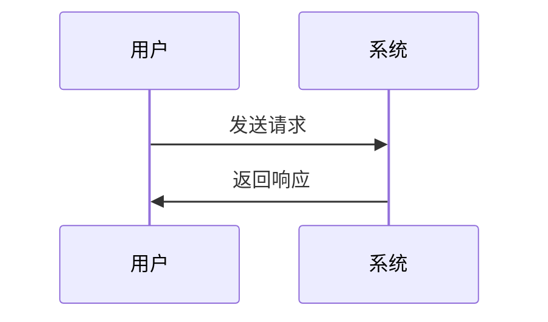

                 

关键词：AI出版，API标准化，软件开发，人工智能技术，出版流程自动化，技术文档，智能搜索，内容推荐系统，云服务，数据安全，开发者社区。

> 摘要：本文探讨了AI出版业开发中API标准化的重要性。通过分析现有的API标准和实际应用案例，本文提出了一个完整的API标准化方案，旨在提升AI出版系统的效率、可扩展性和安全性。同时，本文还探讨了未来AI出版业的发展趋势以及面临的挑战。

## 1. 背景介绍

随着人工智能技术的飞速发展，AI出版业也迎来了前所未有的机遇。传统出版业正逐渐向数字化、智能化方向转型，以适应不断变化的市场需求和用户行为。在这一过程中，API标准化成为了AI出版系统开发的关键因素。API（应用程序接口）是软件系统间交互的桥梁，它允许不同的应用程序相互调用，实现数据的传输和功能的集成。

API标准化的主要目标是确保不同系统之间的互操作性，降低开发成本，提高系统的可维护性和可扩展性。在AI出版业中，API标准化可以帮助开发人员更高效地构建和集成各种功能模块，如内容推荐、智能搜索、用户行为分析等，从而提升出版系统的整体性能和用户体验。

## 2. 核心概念与联系

在探讨API标准化之前，我们需要先了解一些核心概念，如API、RESTful API、GraphQL等。这些概念是API标准化方案的基础。

### 2.1 API

API（应用程序接口）是一组定义了如何访问和使用特定软件或服务的规则和协议。它允许开发人员在不了解底层实现细节的情况下，访问和使用其他软件的功能和服务。

### 2.2 RESTful API

RESTful API 是一种基于HTTP协议的API设计风格。它通过GET、POST、PUT、DELETE等HTTP方法来表示资源的创建、读取、更新和删除操作。RESTful API 旨在实现简单、高效、无状态的服务，使其易于理解和实现。

### 2.3 GraphQL

GraphQL 是一种基于查询的API设计语言，它允许客户端指定所需数据的结构，从而避免过度或不足的数据传输。GraphQL 通过查询语句来请求和获取数据，具有强类型定义和灵活性。

### 2.4 Mermaid 流程图

在API标准化过程中，Mermaid 流程图可以帮助我们直观地展示API的架构和交互流程。以下是一个简单的 Mermaid 流程图示例，展示了API请求和响应的过程：



## 3. 核心算法原理 & 具体操作步骤

### 3.1 算法原理概述

API标准化的核心在于定义一套统一的接口规范，使得不同的系统和组件可以无缝集成。以下是一些关键的算法原理：

1. **接口定义**：通过定义RESTful API或GraphQL接口，明确各个模块的功能和交互方式。
2. **版本控制**：为了确保兼容性，需要对API进行版本控制，如v1、v2等。
3. **错误处理**：定义统一的错误处理机制，如返回状态码、错误消息等。
4. **安全性**：使用令牌认证、加密传输等手段确保数据安全。

### 3.2 算法步骤详解

1. **需求分析**：确定系统需求和功能模块，为API设计提供基础。
2. **接口设计**：基于需求分析，设计RESTful API或GraphQL接口，明确每个接口的功能和参数。
3. **实现接口**：根据接口设计，实现API接口的代码。
4. **测试与调试**：对API接口进行功能测试和性能测试，确保其正常运行和高效性。
5. **文档编写**：编写详细的API文档，包括接口定义、参数说明、使用示例等。

### 3.3 算法优缺点

#### 优点

- **提高开发效率**：统一接口规范，减少重复工作，提高开发速度。
- **提升可维护性**：清晰的接口设计和文档，使得系统更容易维护和扩展。
- **增强安全性**：使用加密传输和令牌认证等手段，确保数据安全。

#### 缺点

- **初期设计复杂**：需要投入时间和精力进行需求分析和接口设计。
- **版本控制复杂**：随着系统功能的不断更新，需要不断更新和维护API版本。

### 3.4 算法应用领域

API标准化在AI出版业中具有广泛的应用。以下是一些具体的应用场景：

- **内容推荐系统**：通过API标准化，实现不同内容模块之间的数据共享和推荐算法的集成。
- **智能搜索**：通过API标准化，实现搜索模块与其他系统的无缝集成，提升搜索效果。
- **用户行为分析**：通过API标准化，实现用户数据的收集和分析，为出版策略提供支持。

## 4. 数学模型和公式 & 详细讲解 & 举例说明

### 4.1 数学模型构建

在API标准化过程中，一些数学模型和公式可以帮助我们更好地理解和优化API性能。以下是一个简单的数学模型示例：

$$
\text{API性能} = f(\text{响应时间}, \text{吞吐量}, \text{错误率})
$$

其中，响应时间、吞吐量和错误率是评估API性能的关键指标。

### 4.2 公式推导过程

假设我们有一个API系统，其响应时间为$t$，吞吐量为$q$，错误率为$r$。根据这些参数，我们可以推导出API性能的公式：

$$
\text{API性能} = f(t, q, r) = \frac{q(1-r)}{t}
$$

### 4.3 案例分析与讲解

假设我们有一个API系统，其响应时间为100ms，吞吐量为1000次/秒，错误率为1%。根据上述公式，我们可以计算出该API的性能：

$$
\text{API性能} = \frac{1000(1-0.01)}{0.1} = 9900
$$

这意味着该API系统的性能为9900个操作/秒。为了提升性能，我们可以从以下几个方面进行优化：

1. **缩短响应时间**：通过优化数据库查询、缓存策略等手段，缩短API的响应时间。
2. **提高吞吐量**：通过增加服务器资源、水平扩展等方式，提高API系统的吞吐量。
3. **降低错误率**：通过错误检测、异常处理等手段，降低API系统的错误率。

## 5. 项目实践：代码实例和详细解释说明

### 5.1 开发环境搭建

在本文中，我们将使用Python和Flask框架来搭建一个简单的API服务。首先，确保安装了Python和pip：

```bash
pip install flask
```

### 5.2 源代码详细实现

以下是一个简单的Flask API服务的示例代码：

```python
from flask import Flask, request, jsonify

app = Flask(__name__)

@app.route('/books', methods=['GET'])
def get_books():
    # 模拟从数据库获取书籍数据
    books = [
        {'id': 1, 'title': '编程之美'},
        {'id': 2, 'title': '人工智能导论'},
        {'id': 3, 'title': '深度学习'}
    ]
    return jsonify(books)

@app.route('/books/<int:book_id>', methods=['GET'])
def get_book(book_id):
    # 模拟根据书籍ID获取具体书籍数据
    book = next((b for b in books if b['id'] == book_id), None)
    if book:
        return jsonify(book)
    else:
        return jsonify({'error': 'Book not found'}), 404

if __name__ == '__main__':
    app.run(debug=True)
```

### 5.3 代码解读与分析

以上代码实现了一个简单的书籍信息API。其中，`/books` 路径用于获取所有书籍信息，`/books/<int:book_id>` 路径用于获取指定书籍的信息。以下是代码的详细解读：

- 第1行：导入Flask库。
- 第2行：创建Flask应用程序实例。
- 第4行：定义`/books` 路径的GET请求处理函数，返回所有书籍数据。
- 第15行：定义`/books/<int:book_id>` 路径的GET请求处理函数，返回指定书籍数据。
- 第21行：启动Flask应用程序。

### 5.4 运行结果展示

在命令行中运行上述代码，然后使用浏览器访问 `http://localhost:5000/books`，可以看到返回的书籍数据：

```json
[
    {"id": 1, "title": "编程之美"},
    {"id": 2, "title": "人工智能导论"},
    {"id": 3, "title": "深度学习"}
]
```

访问 `http://localhost:5000/books/1`，可以看到返回的指定书籍数据：

```json
{
    "id": 1,
    "title": "编程之美"
}
```

## 6. 实际应用场景

API标准化在AI出版业中具有广泛的应用。以下是一些实际应用场景：

- **内容推荐系统**：通过API标准化，实现不同推荐算法之间的数据共享和功能集成，提升推荐效果。
- **智能搜索**：通过API标准化，实现搜索模块与其他系统的无缝集成，提升搜索效果和用户体验。
- **用户行为分析**：通过API标准化，实现用户数据的收集和分析，为出版策略提供支持。
- **内容管理系统**：通过API标准化，实现内容管理系统的扩展和定制，满足不同出版需求。

## 7. 工具和资源推荐

### 7.1 学习资源推荐

- 《API设计指南》
- 《RESTful API设计》
- 《GraphQL入门与实践》

### 7.2 开发工具推荐

- Flask（Python Web框架）
- Express（Node.js Web框架）
- Postman（API测试工具）

### 7.3 相关论文推荐

- "RESTful API Design: Best Practices and Patterns"
- "GraphQL: A Data Query Language for Modern Web APIs"
- "API Design: A Guide for API Developers"

## 8. 总结：未来发展趋势与挑战

### 8.1 研究成果总结

API标准化在AI出版业中取得了显著成果，提高了开发效率、可维护性和用户体验。同时，API标准化还促进了不同系统和组件之间的数据共享和功能集成，为出版系统的智能化和自动化提供了有力支持。

### 8.2 未来发展趋势

- **更加灵活和动态的API设计**：随着业务需求的不断变化，API设计将变得更加灵活和动态，以适应快速迭代和定制化需求。
- **安全性和隐私保护**：随着数据安全和隐私保护的重要性日益增加，API标准化将更加注重安全性和隐私保护，采用更高级的加密和认证技术。
- **跨平台和跨语言的API设计**：未来的API设计将更加注重跨平台和跨语言的兼容性，以实现更广泛的应用场景。

### 8.3 面临的挑战

- **API设计的复杂性和一致性**：随着API功能的不断增加和复杂化，保持API设计的一致性和可维护性将是一个挑战。
- **性能和可扩展性**：如何确保API的高性能和可扩展性，以支持大规模的并发访问和数据处理需求，是一个重要挑战。
- **安全和隐私保护**：如何在确保API安全性和隐私保护的同时，提供高效和便捷的服务，是一个重要的挑战。

### 8.4 研究展望

未来的研究将集中在以下几个方面：

- **智能API设计**：结合人工智能技术，实现智能化的API设计和优化，提高API的性能和用户体验。
- **安全性和隐私保护**：研究和开发更高级的安全和隐私保护技术，确保API的安全性和可靠性。
- **跨平台和跨语言的API设计**：研究和开发跨平台和跨语言的API设计框架和工具，提高API的兼容性和可扩展性。

## 9. 附录：常见问题与解答

### 问题1：API标准化与API设计有何区别？

API标准化是一种确保API设计一致性和可维护性的方法，它定义了一套通用的标准和规范。而API设计则是指具体实现API的过程，包括接口定义、参数设计、错误处理等。

### 问题2：为什么需要API版本控制？

API版本控制有助于确保不同版本的API之间的兼容性，降低对旧版API的依赖，同时为新功能的添加和优化提供空间。版本控制还可以帮助开发人员和管理员更好地管理和追踪API的变更。

### 问题3：如何提高API的性能和可扩展性？

提高API性能和可扩展性的方法包括：

- **优化数据库查询**：使用索引、缓存等技术，提高数据库查询的效率。
- **异步处理**：使用异步编程模型，提高API的处理速度和并发能力。
- **负载均衡**：使用负载均衡器，将请求均匀地分布到多个服务器上，提高系统的吞吐量。

### 问题4：如何确保API的安全性？

确保API安全性的方法包括：

- **使用HTTPS**：使用HTTPS协议，确保数据传输的安全。
- **令牌认证**：使用令牌认证机制，如JWT（JSON Web Token），确保只有授权用户可以访问API。
- **加密存储**：对敏感数据进行加密存储，防止数据泄露。

### 问题5：如何测试API？

API测试的方法包括：

- **功能测试**：测试API接口的功能是否按照预期工作。
- **性能测试**：测试API的性能和响应时间，确保其满足性能要求。
- **安全测试**：测试API的安全性，如SQL注入、XSS攻击等。

### 问题6：如何编写API文档？

编写API文档的方法包括：

- **定义接口规范**：明确每个接口的功能、参数和返回值。
- **提供使用示例**：提供详细的示例代码和文档，帮助开发者快速上手。
- **维护和更新**：定期更新API文档，确保其与实际API接口保持一致。

## 作者署名

作者：禅与计算机程序设计艺术 / Zen and the Art of Computer Programming
----------------------------------------------------------------

完成文章撰写后，请确保文章内容完整、符合格式要求，并已包含了所有必要的内容和元素。现在可以检查并校对文章，确保无误后进行发布。祝您发表成功！🎉📚💻

