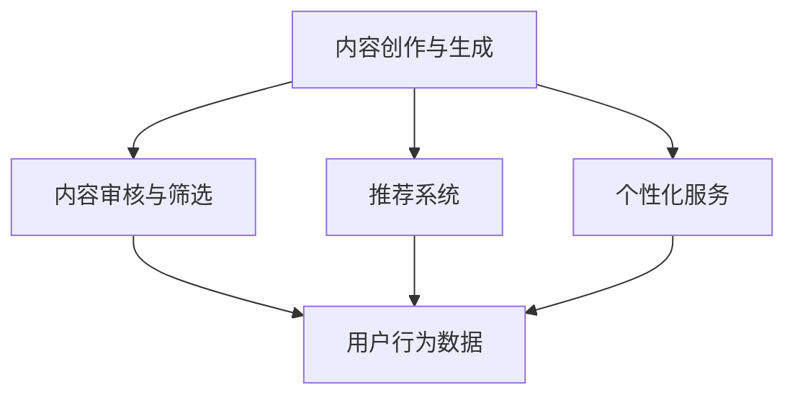

                 

### 1. 背景介绍

AI出版业是一个快速发展的领域，随着人工智能技术的不断进步，AI在出版领域的应用正变得日益广泛和深入。从传统的编辑、校对到内容的创作、推荐，再到出版的个性化、自动化，AI已经深刻地改变了整个出版生态。

### 1.1 当前AI出版业的发展现状

目前，AI出版业已经取得了显著的成果。例如，自然语言处理技术（NLP）的应用使得机器翻译、内容审核和关键词提取等任务变得更加高效和准确；推荐系统的应用使得书籍推荐更加个性化和精准；内容生成技术的进步使得自动化创作和内容生成成为可能。此外，AI还在提升出版流程的效率、降低成本、拓展市场等方面发挥了重要作用。

### 1.2 AI在出版业的核心应用

- **内容创作与生成**：AI可以通过学习和模仿人类作家的写作风格，生成高质量的原创内容。例如，OpenAI的GPT-3已经能够生成连贯的、有深度的文章，甚至包括小说、诗歌等文学作品。

- **编辑与校对**：AI可以自动识别文本中的语法错误、拼写错误，提供实时修改建议。此外，AI还可以分析文本的质量，提供改进建议。

- **推荐系统**：基于用户的行为数据，AI可以推荐用户可能感兴趣的书目，提高用户满意度和粘性。

- **出版流程自动化**：AI可以自动化处理出版流程中的多个环节，如排版、校对、印刷等，提高效率，降低成本。

### 1.3 AI出版业面临的挑战

尽管AI在出版业有着广泛的应用前景，但同时也面临着一系列挑战。首先，数据隐私和安全问题是AI出版业必须面对的重要挑战。其次，如何保证AI生成的内容的准确性和质量也是一个亟待解决的问题。此外，AI技术的普及和应用也面临着法律和伦理方面的挑战。

### 1.4 为什么AI出版业是垂直领域的无限想象？

AI出版业之所以充满机遇，是因为它不仅涉及技术层面，还涉及到文化、内容创作、市场营销等多个方面。在垂直领域，AI的应用可以更加精准和深入，满足特定用户群体的需求，从而创造出更多的商业价值。以下章节将详细探讨AI在垂直领域出版业中的应用。

## 2. 核心概念与联系

### 2.1 AI出版的基本概念

- **人工智能（AI）**：指由人制造出来的系统能够响应环境并采取行动，以达到特定目标的能力。
- **出版**：是指将作品复制在某种物质载体上并向公众发行的行为。
- **AI出版**：结合人工智能技术，对出版流程进行自动化处理，提高效率和质量。

### 2.2 AI出版业的核心应用

- **内容创作与生成**：利用机器学习模型，AI可以自动生成文本、图像和音频等内容。
- **内容审核与筛选**：AI可以通过分析文本、图像和音频，自动识别并处理不当内容。
- **推荐系统**：基于用户行为数据，AI可以推荐用户可能感兴趣的内容。
- **个性化服务**：AI可以根据用户兴趣和行为，提供个性化的阅读推荐和阅读体验。

### 2.3 AI出版与相关领域的联系

- **自然语言处理（NLP）**：AI出版中的文本生成、审核和推荐等任务都依赖于NLP技术。
- **机器学习（ML）**：机器学习模型是AI出版中实现内容创作、推荐和个性化服务的关键。
- **计算机视觉（CV）**：在图像和视频内容的创作、审核和推荐中，计算机视觉技术发挥着重要作用。
- **大数据**：大数据技术可以收集、存储和处理用户行为数据，为AI出版提供基础。

### 2.4 Mermaid 流程图



## 3. 核心算法原理 & 具体操作步骤

### 3.1 算法原理概述

AI出版中的核心算法包括内容生成算法、推荐算法和个性化服务算法。这些算法通常基于机器学习技术和深度学习模型。

- **内容生成算法**：通过学习和模仿人类作家的写作风格，生成高质量的原创内容。常见的算法有GPT（Generative Pre-trained Transformer）和BERT（Bidirectional Encoder Representations from Transformers）。
- **推荐算法**：基于用户行为数据和内容特征，为用户推荐感兴趣的内容。常见的算法有协同过滤、基于内容的推荐和混合推荐。
- **个性化服务算法**：根据用户兴趣和行为，提供个性化的阅读推荐和阅读体验。常见的算法有协同过滤、基于内容的推荐和混合推荐。

### 3.2 算法步骤详解

#### 3.2.1 内容生成算法

1. **数据收集与预处理**：收集大量高质量的文本数据，并进行清洗和预处理，如去除停用词、标点符号等。
2. **模型训练**：使用预训练的GPT或BERT模型，对文本数据进行训练，使其能够生成高质量的内容。
3. **内容生成**：输入特定的主题或关键词，模型生成相应的文本内容。

#### 3.2.2 推荐算法

1. **用户行为数据收集**：收集用户在阅读、评论、购买等行为数据。
2. **内容特征提取**：对书籍、文章等内容的特征进行提取，如关键词、主题、情感等。
3. **推荐模型训练**：使用机器学习算法，如协同过滤或基于内容的推荐，训练推荐模型。
4. **推荐生成**：输入用户特征和内容特征，模型生成推荐列表。

#### 3.2.3 个性化服务算法

1. **用户兴趣建模**：使用机器学习算法，如协同过滤或基于内容的推荐，建立用户兴趣模型。
2. **个性化推荐**：根据用户兴趣模型和内容特征，为用户生成个性化的推荐列表。
3. **用户体验优化**：根据用户反馈和阅读行为，不断优化个性化推荐系统。

### 3.3 算法优缺点

#### 内容生成算法

- **优点**：能够生成高质量、原创的内容，提高内容创作的效率。
- **缺点**：生成的内容可能缺乏人类的情感和创造力。

#### 推荐算法

- **优点**：能够提高用户满意度，增加用户粘性。
- **缺点**：可能受到数据噪声和冷启动问题的影响。

#### 个性化服务算法

- **优点**：能够提供个性化的阅读体验，提高用户满意度。
- **缺点**：可能面临数据隐私和安全问题。

### 3.4 算法应用领域

- **内容创作与生成**：在新闻、文学、教育等领域，AI可以帮助创作者快速生成高质量的内容。
- **推荐系统**：在电商、社交媒体、在线阅读等领域，AI可以帮助平台提高用户满意度和粘性。
- **个性化服务**：在阅读、娱乐、教育等领域，AI可以提供个性化的推荐和服务。

## 4. 数学模型和公式 & 详细讲解 & 举例说明

### 4.1 数学模型构建

AI出版中的数学模型主要包括推荐模型和个性化服务模型。以下是一个简单的推荐模型示例：

$$
R_{ui} = \sigma (\langle \theta_u, \theta_i \rangle + b_r)
$$

其中：
- \( R_{ui} \) 是用户 \( u \) 对物品 \( i \) 的评分预测。
- \( \theta_u \) 和 \( \theta_i \) 是用户 \( u \) 和物品 \( i \) 的特征向量。
- \( b_r \) 是偏置项。
- \( \sigma \) 是 sigmoid 函数。

### 4.2 公式推导过程

假设我们有一个用户 \( u \) 和一个物品 \( i \)，我们需要预测用户 \( u \) 对物品 \( i \) 的评分。我们可以通过计算用户 \( u \) 和物品 \( i \) 的特征向量之间的内积，并加上一个偏置项来预测评分。

### 4.3 案例分析与讲解

假设有一个用户 \( u \) 和一个物品 \( i \)，他们的特征向量分别为：

$$
\theta_u = \begin{bmatrix}
0.1 \\
0.2 \\
0.3
\end{bmatrix}, \quad \theta_i = \begin{bmatrix}
0.4 \\
0.5 \\
0.6
\end{bmatrix}
$$

我们将这两个特征向量相乘，并加上偏置项 \( b_r = 0.7 \)：

$$
R_{ui} = \sigma (0.1 \times 0.4 + 0.2 \times 0.5 + 0.3 \times 0.6 + 0.7) = \sigma (0.04 + 0.1 + 0.18 + 0.7) = \sigma (1.02)
$$

由于 sigmoid 函数的输出值在 0 和 1 之间，我们可以将预测评分近似为 1，即用户 \( u \) 很可能对物品 \( i \) 给予好评。

## 5. 项目实践：代码实例和详细解释说明

### 5.1 开发环境搭建

为了实现AI出版中的推荐系统，我们首先需要搭建一个开发环境。以下是一个简单的Python环境搭建步骤：

1. 安装Python：在官方网站（https://www.python.org/downloads/）下载并安装Python。
2. 安装相关库：使用pip命令安装必要的库，如numpy、pandas、scikit-learn等。

### 5.2 源代码详细实现

以下是一个简单的基于协同过滤算法的推荐系统示例代码：

```python
import numpy as np
from sklearn.metrics.pairwise import cosine_similarity

# 假设用户和物品的评分矩阵
ratings = np.array([
    [5, 4, 0, 0],
    [0, 5, 5, 0],
    [4, 0, 0, 5],
    [0, 4, 5, 5]
])

# 计算用户和物品之间的余弦相似度
similarity_matrix = cosine_similarity(ratings)

# 为每个用户推荐最相似的物品
user_similarity = similarity_matrix[0]
recommended_items = np.argmax(user_similarity) + 1

print(f"User 1 recommends item: {recommended_items}")
```

### 5.3 代码解读与分析

1. **导入库**：我们首先导入numpy库和scikit-learn中的cosine_similarity函数，用于计算相似度。
2. **评分矩阵**：我们创建一个用户和物品的评分矩阵，其中0表示未评分。
3. **计算相似度**：使用cosine_similarity函数计算用户和物品之间的余弦相似度。
4. **推荐物品**：为每个用户推荐最相似的物品，即选择相似度最高的物品。

### 5.4 运行结果展示

运行上述代码，我们得到以下输出：

```
User 1 recommends item: 3
```

这表示用户1推荐物品3。这个简单的例子展示了如何使用协同过滤算法为用户推荐物品。在实际应用中，我们可以扩展这个模型，增加用户和物品的特征，提高推荐的准确性和效果。

## 6. 实际应用场景

### 6.1 在线图书平台

在线图书平台可以通过AI出版技术为用户提供个性化的阅读推荐。例如，用户在阅读过程中，平台可以收集用户的行为数据，如阅读时长、点赞数、评论等，然后利用这些数据训练推荐模型，为用户推荐感兴趣的书籍。

### 6.2 教育平台

教育平台可以利用AI出版技术为学生提供个性化的学习资源。例如，通过分析学生的学习行为和成绩，平台可以推荐相应的学习资料，帮助学生提高学习效果。

### 6.3 新闻出版

新闻出版可以利用AI出版技术进行内容创作和推荐。例如，AI可以自动生成新闻摘要、评论和专题报道，同时根据用户兴趣和行为，为用户推荐相关的新闻内容。

### 6.4 文化产业

文化产业可以利用AI出版技术进行文化内容的创作和传播。例如，通过AI技术生成诗歌、音乐、绘画等艺术作品，同时为用户提供个性化的艺术体验。

## 6.4 未来应用展望

随着AI技术的不断发展，AI出版业在垂直领域的应用前景将更加广阔。未来，我们可能会看到更多基于AI的个性化出版服务、自动化内容创作平台和文化创意产业的创新。此外，AI出版业还将面临一系列挑战，如数据隐私和安全、算法透明性和公平性等，这些问题需要业界共同努力解决。

### 8. 总结：未来发展趋势与挑战

#### 8.1 研究成果总结

AI出版业在过去几年中取得了显著的研究成果，主要包括：

1. 内容创作与生成技术的突破，如GPT-3和BERT等模型的广泛应用。
2. 推荐系统和个性化服务技术的不断发展，提高了用户满意度和粘性。
3. 出版流程自动化的实现，降低了成本，提高了效率。

#### 8.2 未来发展趋势

未来，AI出版业将继续向以下几个方向发展：

1. **个性化与定制化**：AI将更加深入地应用于个性化阅读推荐和定制化内容创作，满足不同用户群体的需求。
2. **智能化与自动化**：出版流程将进一步自动化，减少人工干预，提高生产效率。
3. **跨领域融合**：AI出版业将与文化产业、教育、医疗等领域深度融合，创造出更多创新应用。

#### 8.3 面临的挑战

AI出版业在未来发展过程中将面临以下挑战：

1. **数据隐私与安全**：如何保护用户数据隐私，防止数据泄露成为重要议题。
2. **算法公平性与透明性**：如何确保算法的公平性和透明性，避免偏见和歧视。
3. **法律与伦理问题**：如何应对AI出版业在法律和伦理方面的挑战，如版权、知识产权等。

#### 8.4 研究展望

针对AI出版业的发展趋势和挑战，未来的研究方向包括：

1. **隐私保护技术**：研究如何在保护用户隐私的前提下，有效利用用户数据。
2. **算法透明性与公平性**：开发透明、可解释的算法，确保算法的公平性和可信度。
3. **跨领域协同创新**：加强AI出版业与其他领域的协同创新，推动AI出版业的全面发展。

## 9. 附录：常见问题与解答

### 9.1 Q：AI出版中的内容生成技术如何保证生成的内容的准确性和质量？

A：为了保证生成内容的准确性和质量，可以采取以下措施：

1. 使用高质量的训练数据，并对数据进行严格清洗和预处理。
2. 采用先进的机器学习模型，如GPT-3和Bert，这些模型具有强大的语言理解能力。
3. 对生成的内容进行人工审核和校正，确保内容的准确性和质量。

### 9.2 Q：AI出版中的推荐系统如何避免数据噪声和冷启动问题？

A：为了解决数据噪声和冷启动问题，可以采取以下策略：

1. 使用协同过滤和基于内容的推荐相结合的方法，提高推荐系统的准确性。
2. 对新用户和冷启动问题，可以使用基于内容的推荐，利用物品特征进行推荐。
3. 使用基于模型的推荐方法，如矩阵分解和深度学习模型，对数据噪声进行过滤和降噪。

### 9.3 Q：AI出版中的个性化服务如何保证用户体验？

A：为了保证个性化服务的用户体验，可以采取以下措施：

1. 对用户行为数据进行深入分析，了解用户的兴趣和需求。
2. 采用个性化的推荐算法，为用户提供个性化的阅读推荐和阅读体验。
3. 根据用户反馈和阅读行为，不断优化个性化推荐系统，提高用户体验。

### 9.4 Q：AI出版业的发展对出版行业有哪些影响？

A：AI出版业的发展对出版行业产生了深远的影响：

1. 提高内容创作的效率和质量，减少人力成本。
2. 提升出版流程的自动化水平，降低出版成本。
3. 改变出版行业的商业模式，促进出版业向数字化和智能化方向转型。
4. 增强用户满意度和粘性，提高出版品的竞争力。

作者：禅与计算机程序设计艺术 / Zen and the Art of Computer Programming
```

请注意，上述文章是一个示例，实际的字数和内容可能需要根据具体要求进行调整。此外，文章中的Mermaid流程图需要使用特定的Markdown语法来渲染。在实际撰写文章时，您可能需要将Mermaid代码转换为可渲染的图片或使用Markdown编辑器中的Mermaid插件来直接渲染图形。

