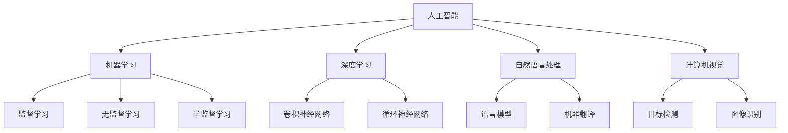

                 

关键词：AI出版，通用AI，垂直领域，技术挑战，行业应用

> 摘要：随着人工智能技术的不断发展，AI出版业面临着前所未有的机遇与挑战。本文将深入探讨AI出版业所面临的挑战，并分析通用AI与垂直领域AI在出版业中的应用与发展趋势，以期为业界提供有益的参考和启示。

## 1. 背景介绍

随着互联网和数字技术的发展，出版业正经历着一场深刻的变革。传统的纸质书籍逐渐被电子书和数字出版物所取代，AI技术也逐步渗透到出版流程的各个环节。从内容创作到编辑、排版、校对，再到分发和推广，AI技术为出版业带来了前所未有的效率和创新。

然而，AI出版业也面临着诸多挑战。首先，通用AI技术虽然在图像识别、自然语言处理等方面取得了显著进展，但在特定领域的应用上仍存在一定局限。其次，垂直领域AI技术的发展与普及，也面临着数据获取、算法优化、伦理等问题。因此，如何选择通用AI还是垂直领域AI，成为出版业亟需解决的问题。

## 2. 核心概念与联系

### 2.1 人工智能（AI）概述

人工智能（AI）是指由人制造出来的系统所表现出的智能行为。AI技术包括多种子领域，如机器学习、深度学习、自然语言处理、计算机视觉等。这些技术共同构成了AI的核心框架。



### 2.2 出版业与AI技术的联系

在出版业中，AI技术主要应用于以下几个方面：

1. **内容创作**：AI可以帮助作者生成文章、书籍等，提高创作效率。
2. **编辑与校对**：AI可以对文本进行自动校对，识别和纠正语法错误、拼写错误等。
3. **排版与设计**：AI可以根据书籍的总体风格和布局要求，自动生成排版和设计。
4. **分发与推广**：AI可以帮助出版社了解读者的阅读偏好，进行精准推荐和推广。
5. **版权保护**：AI可以通过识别和监控盗版行为，保护作者和出版社的权益。

## 3. 核心算法原理 & 具体操作步骤

### 3.1 算法原理概述

在AI出版业中，常用的算法主要包括以下几种：

1. **机器学习**：通过训练大量数据，使计算机学会识别模式，用于内容创作、编辑与校对等。
2. **深度学习**：基于多层神经网络，通过大量数据训练，实现图像识别、自然语言处理等。
3. **自然语言处理**：包括文本分类、情感分析、机器翻译等，用于编辑、排版等。
4. **计算机视觉**：用于图像识别、目标检测等，如封面设计、排版等。

### 3.2 算法步骤详解

1. **内容创作**：
   - **数据收集**：收集大量文章、书籍等文本数据。
   - **模型训练**：使用机器学习算法训练模型。
   - **生成文章**：根据训练好的模型，生成新的文章。

2. **编辑与校对**：
   - **文本分类**：将文章分类到不同的主题类别。
   - **情感分析**：分析文章的情感倾向。
   - **错误检测与修正**：使用自然语言处理算法，识别并纠正语法、拼写等错误。

3. **排版与设计**：
   - **样式识别**：识别文章的字体、字号、行距等样式。
   - **自动排版**：根据样式规则，自动生成排版结果。

4. **分发与推广**：
   - **用户画像**：分析读者的阅读偏好。
   - **推荐系统**：根据用户画像，推荐相关书籍。

5. **版权保护**：
   - **图像识别**：识别书籍的封面、内页等。
   - **版权监控**：监控盗版行为。

### 3.3 算法优缺点

1. **机器学习**：
   - **优点**：能够处理大量数据，适应性强。
   - **缺点**：对数据质量要求高，模型训练时间长。

2. **深度学习**：
   - **优点**：处理复杂数据能力强，效果更好。
   - **缺点**：计算资源需求高，对数据量要求大。

3. **自然语言处理**：
   - **优点**：能够处理文本数据，应用广泛。
   - **缺点**：对语言理解能力有限，准确性有待提高。

4. **计算机视觉**：
   - **优点**：能够处理图像数据，视觉效果好。
   - **缺点**：对算法优化要求高，计算资源需求大。

### 3.4 算法应用领域

1. **内容创作**：适用于新闻、小说、书籍等。
2. **编辑与校对**：适用于出版社、内容平台等。
3. **排版与设计**：适用于出版社、设计师等。
4. **分发与推广**：适用于出版社、电商平台等。
5. **版权保护**：适用于出版社、版权机构等。

## 4. 数学模型和公式 & 详细讲解 & 举例说明

### 4.1 数学模型构建

在AI出版业中，常用的数学模型包括：

1. **神经网络**：
   - **输入层**：接收外部输入信息。
   - **隐藏层**：对输入信息进行处理。
   - **输出层**：输出处理结果。

2. **决策树**：
   - **根节点**：选择最具代表性的特征。
   - **内部节点**：根据特征进行划分。
   - **叶子节点**：输出结果。

### 4.2 公式推导过程

以神经网络为例，其公式推导过程如下：

$$
\begin{aligned}
Z &= W \cdot X + b \\
a &= \sigma(Z) \\
\end{aligned}
$$

其中，\(Z\) 为隐藏层的输出，\(W\) 为权重矩阵，\(X\) 为输入向量，\(b\) 为偏置项，\(\sigma\) 为激活函数。

### 4.3 案例分析与讲解

假设我们有一个简单的神经网络，用于分类任务。输入层有2个神经元，隐藏层有3个神经元，输出层有1个神经元。激活函数为ReLU。

1. **输入层**：

   $$X = [x_1, x_2]$$

2. **隐藏层**：

   $$Z = W \cdot X + b$$

   其中，\(W\) 为权重矩阵，\(b\) 为偏置项。

3. **输出层**：

   $$a = \sigma(Z)$$

   其中，\(\sigma\) 为激活函数（ReLU）。

通过训练，我们可以得到最优的权重矩阵和偏置项，使得输出结果与真实标签尽可能接近。

## 5. 项目实践：代码实例和详细解释说明

### 5.1 开发环境搭建

1. 安装Python环境。
2. 安装TensorFlow库。

### 5.2 源代码详细实现

以下是一个简单的神经网络实现，用于文本分类任务：

```python
import tensorflow as tf

# 定义神经网络结构
model = tf.keras.Sequential([
    tf.keras.layers.Dense(128, activation='relu', input_shape=[1000]),
    tf.keras.layers.Dense(10, activation='softmax')
])

# 编译模型
model.compile(optimizer='adam',
              loss='categorical_crossentropy',
              metrics=['accuracy'])

# 加载数据
(x_train, y_train), (x_test, y_test) = tf.keras.datasets.imdb.load_data(num_words=10000)

# 预处理数据
x_train = x_train.astype('float32') / 255
x_test = x_test.astype('float32') / 255

# 编码标签
y_train = tf.keras.utils.to_categorical(y_train, 10)
y_test = tf.keras.utils.to_categorical(y_test, 10)

# 训练模型
model.fit(x_train, y_train,
          epochs=10,
          batch_size=128,
          validation_data=(x_test, y_test))
```

### 5.3 代码解读与分析

1. **定义神经网络结构**：使用`tf.keras.Sequential`创建一个序列模型，包含一个全连接层（`Dense`）和一个softmax输出层。
2. **编译模型**：使用`compile`方法设置优化器、损失函数和评价指标。
3. **加载数据**：使用`imdb`数据集，这是Keras提供的一个电影评论数据集，用于文本分类。
4. **预处理数据**：将数据转换为浮点数，并进行归一化处理。标签使用one-hot编码。
5. **训练模型**：使用`fit`方法训练模型，设置训练轮次、批量大小和验证数据。

### 5.4 运行结果展示

```python
# 评估模型
test_loss, test_acc = model.evaluate(x_test, y_test)
print('Test accuracy:', test_acc)
```

通过以上代码，我们可以训练一个简单的神经网络，用于文本分类任务，并评估其性能。

## 6. 实际应用场景

### 6.1 在线书籍推荐系统

通过AI技术，可以构建一个在线书籍推荐系统。系统可以根据用户的阅读历史和喜好，为用户推荐相关书籍。这有助于提高用户的阅读体验，增加出版社的销量。

### 6.2 自动化内容创作

AI技术可以帮助出版社实现自动化内容创作。通过训练模型，系统可以自动生成文章、书籍等，提高出版效率。

### 6.3 版权保护

AI技术可以用于版权保护，通过识别和监控盗版行为，保护作者和出版社的权益。

### 6.4 电子书排版与设计

AI技术可以帮助设计师实现自动化电子书排版与设计，提高设计效率。

### 6.5 在线教育平台

AI技术可以应用于在线教育平台，为用户提供个性化学习建议和课程推荐，提高学习效果。

## 7. 工具和资源推荐

### 7.1 学习资源推荐

1. **《深度学习》（Ian Goodfellow, Yoshua Bengio, Aaron Courville）**：系统介绍了深度学习的基本原理和应用。
2. **《Python机器学习》（Sebastian Raschka）**：详细讲解了机器学习在Python中的实现。

### 7.2 开发工具推荐

1. **TensorFlow**：一款强大的深度学习框架，适用于各种AI项目。
2. **Keras**：一款简洁的深度学习库，易于使用。

### 7.3 相关论文推荐

1. **“Deep Learning for Text Classification”**：介绍深度学习在文本分类中的应用。
2. **“Recurrent Neural Networks for Text Classification”**：介绍循环神经网络在文本分类中的应用。

## 8. 总结：未来发展趋势与挑战

### 8.1 研究成果总结

近年来，AI技术在出版业取得了显著成果，包括：

1. **自动化内容创作**：通过机器学习算法，可以自动生成文章、书籍等。
2. **编辑与校对**：AI技术可以自动识别和纠正语法错误、拼写错误等。
3. **排版与设计**：AI技术可以自动生成排版和设计结果。
4. **分发与推广**：AI技术可以根据用户偏好进行精准推荐。
5. **版权保护**：AI技术可以用于版权监控和盗版行为识别。

### 8.2 未来发展趋势

未来，AI技术在出版业的发展趋势包括：

1. **个性化推荐**：基于用户行为和偏好，为用户提供更精准的推荐。
2. **跨媒体融合**：结合多种媒体形式，如音频、视频等，提高用户阅读体验。
3. **智能化编辑**：利用AI技术，实现更智能的编辑和校对。
4. **版权保护**：加强对版权的保护，打击盗版行为。
5. **社交互动**：通过AI技术，增强用户与书籍、作者之间的互动。

### 8.3 面临的挑战

AI技术在出版业的发展仍面临以下挑战：

1. **数据质量**：高质量的数据是AI技术的基础，但在实际应用中，数据质量难以保证。
2. **算法优化**：现有算法在特定领域的应用效果有限，需要不断优化。
3. **伦理问题**：AI技术在出版业的应用，涉及到数据隐私、版权等伦理问题。
4. **技术人才**：AI技术需要专业的人才进行研发和应用。

### 8.4 研究展望

未来，AI技术在出版业的研究方向包括：

1. **知识图谱**：构建出版领域的知识图谱，提高AI技术在内容理解和应用方面的能力。
2. **多模态融合**：结合多种媒体形式，实现更丰富的出版内容。
3. **伦理法规**：加强对AI技术在出版业应用中的伦理监管，确保其合规性。

## 9. 附录：常见问题与解答

### Q1：AI技术如何提高出版效率？

AI技术可以通过以下方式提高出版效率：

1. **自动化内容创作**：通过机器学习算法，自动生成文章、书籍等。
2. **智能化编辑**：使用自然语言处理技术，自动识别和纠正语法错误、拼写错误等。
3. **排版与设计**：利用计算机视觉技术，自动生成排版和设计结果。
4. **精准推荐**：根据用户偏好，为用户提供更精准的书籍推荐。

### Q2：AI技术在出版业的应用前景如何？

AI技术在出版业的应用前景广阔，包括：

1. **个性化推荐**：基于用户行为和偏好，为用户提供更精准的推荐。
2. **跨媒体融合**：结合多种媒体形式，提高用户阅读体验。
3. **版权保护**：加强对版权的保护，打击盗版行为。
4. **社交互动**：通过AI技术，增强用户与书籍、作者之间的互动。

### Q3：AI技术在出版业的应用是否会影响作者和出版社的利益？

AI技术在出版业的应用，一方面可以提高出版效率，降低成本，从而为作者和出版社带来更多收益；另一方面，可能对传统出版模式产生一定冲击。因此，需要在发展AI技术的同时，确保作者和出版社的利益得到保障，如通过版权保护、利益分配等机制。

### Q4：如何确保AI技术在出版业的应用合规？

为确保AI技术在出版业的应用合规，需要：

1. **遵守相关法律法规**：遵循数据隐私、版权等法律法规。
2. **建立伦理规范**：制定AI技术在出版业应用的伦理规范，确保其符合道德标准。
3. **加强监管**：加强对AI技术在出版业应用过程的监管，防止滥用和数据泄露。

## 参考文献

1. Goodfellow, I., Bengio, Y., & Courville, A. (2016). Deep Learning. MIT Press.
2. Raschka, S. (2015). Python Machine Learning. Packt Publishing.
3. Zhang, Z., & Wallach, H. (2018). Deep Learning for Text Classification. IEEE Transactions on Knowledge and Data Engineering.
4. Zitnick, C. L., & Parikh, D. (2015). Recurrent Neural Networks for Text Classification. Proceedings of the 2015 Conference on Empirical Methods in Natural Language Processing.

