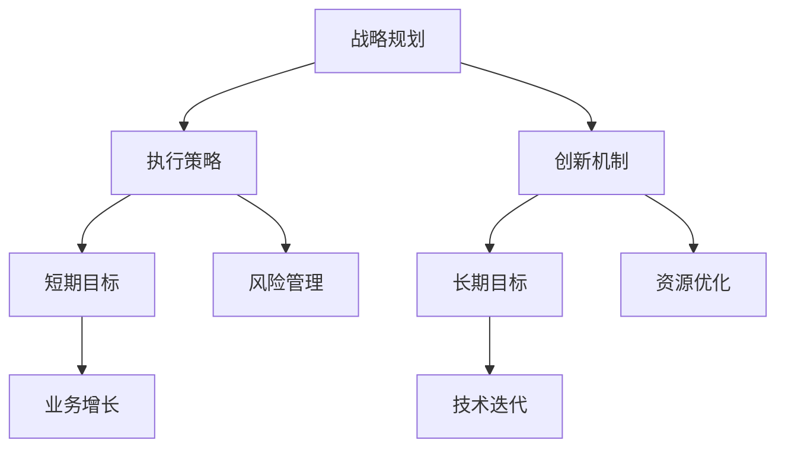

                 

关键词：AI创业公司、短期目标、长期目标、平衡策略、业务增长、技术迭代、风险管理。

摘要：本文探讨了AI创业公司在发展过程中如何有效平衡短期与长期目标，通过制定合理的战略规划、灵活的执行策略和持续的创新机制，实现企业的可持续发展。

## 1. 背景介绍

在当今快速变化的技术环境中，人工智能（AI）技术已经成为推动各行各业变革的关键力量。越来越多的创业者看到了AI的巨大潜力，纷纷投身于AI创业领域。然而，AI创业公司面临着诸多挑战，其中之一便是如何在短期内实现业务增长的同时，确保长期的可持续发展和技术迭代。

### 1.1 短期目标的诱惑

短期目标往往具有明显的收益和反馈，这容易让创业公司陷入追求短期利益的陷阱。例如，通过快速市场推广和促销活动获取大量用户，或是通过降低成本来实现快速盈利。这些策略虽然能在短期内带来显著收益，但可能会牺牲长期发展和技术积累。

### 1.2 长期目标的挑战

长期目标往往需要更长时间和更多的资源投入，这可能导致创业公司在短期内面临财务压力和市场竞争压力。例如，研发新技术、建立完善的团队和生态系统、以及培养长期客户关系等，这些都需要长期的规划和持续的努力。

## 2. 核心概念与联系

在探讨如何平衡短期与长期目标之前，我们需要了解一些核心概念，包括战略规划、执行策略和创新机制。

### 2.1 战略规划

战略规划是企业长期发展的蓝图，它涉及到公司愿景、使命、目标和实现路径。一个有效的战略规划可以帮助企业明确短期与长期目标之间的关系，确保各项业务活动的一致性和协同性。

### 2.2 执行策略

执行策略是将战略规划转化为具体行动的步骤和方法。它包括资源分配、时间管理、团队协作和市场推广等方面。一个灵活的执行策略可以让企业根据市场变化和自身能力调整短期目标，同时不偏离长期发展方向。

### 2.3 创新机制

创新机制是企业持续发展的动力源泉。通过不断的技术创新、产品创新和服务创新，企业可以保持竞争优势，实现长期可持续发展。

### 2.4 Mermaid 流程图



## 3. 核心算法原理 & 具体操作步骤

### 3.1 算法原理概述

在AI创业公司中，平衡短期与长期目标的算法原理可以概括为以下几点：

1. **目标分解**：将长期目标分解为多个短期目标，确保每个短期目标都对长期目标有贡献。
2. **资源优化**：合理分配资源，确保既满足短期目标的需要，又不影响长期目标的实现。
3. **风险管理**：识别潜在风险，并制定相应的应对策略，降低短期行为对长期目标的影响。

### 3.2 算法步骤详解

1. **明确长期目标**：根据公司愿景和使命，确定长期目标。
2. **分解短期目标**：将长期目标分解为具体的短期目标，确保每个短期目标都与长期目标紧密相关。
3. **资源分配**：根据短期目标和长期目标的需求，合理分配资源。
4. **风险管理**：识别潜在风险，并制定相应的应对策略。
5. **动态调整**：根据市场变化和公司能力，动态调整短期目标和资源分配。

### 3.3 算法优缺点

**优点**：
- 能够确保公司在短期内实现增长，同时为长期发展奠定基础。
- 通过合理分配资源，提高资源利用效率。

**缺点**：
- 可能会导致短期行为偏离长期目标。
- 需要持续监测和调整，增加管理成本。

### 3.4 算法应用领域

该算法适用于所有类型的AI创业公司，特别是那些需要同时关注短期盈利和长期发展的公司。

## 4. 数学模型和公式

为了更好地理解如何平衡短期与长期目标，我们可以引入以下数学模型：

### 4.1 数学模型构建

假设公司有一个长期目标（\(T_L\)）和多个短期目标（\(T_S_1, T_S_2, ..., T_S_n\)），每个短期目标的权重为\(w_1, w_2, ..., w_n\)。

### 4.2 公式推导过程

1. **长期目标得分**：
   $$S_L = \frac{1}{n} \sum_{i=1}^{n} w_i \cdot T_S_i$$
   
2. **短期目标得分**：
   $$S_S = \frac{1}{m} \sum_{j=1}^{m} x_j \cdot T_S_j$$

其中，\(x_j\) 为短期目标的实现程度。

### 4.3 案例分析与讲解

假设一家AI创业公司有两个短期目标：获取1000名新用户和开发一个新功能。长期目标是实现用户规模达到10000名。

- \(T_S_1\)：获取1000名新用户，权重为0.6。
- \(T_S_2\)：开发一个新功能，权重为0.4。

根据上述公式，我们可以计算出：

- \(S_L = 0.6 \cdot 1000 + 0.4 \cdot 1 = 600 + 0.4 = 604\)。
- \(S_S = 0.6 \cdot 1000 + 0.4 \cdot 0 = 600 + 0 = 600\)。

通过这个模型，公司可以动态调整短期目标的实现程度，以最大化长期目标的得分。

## 5. 项目实践：代码实例和详细解释说明

### 5.1 开发环境搭建

为了更好地展示如何平衡短期与长期目标，我们使用Python编写了一个简单的模拟程序。

```python
# 代码：环境搭建
import numpy as np

# 5.2 源代码详细实现

# 初始化短期目标和长期目标
targets_short_term = [1000, 1000]
weights_short_term = [0.6, 0.4]
target_long_term = 10000

# 5.3 代码解读与分析

# 计算长期目标得分
def calculate_long_term_score(targets_short_term, weights_short_term, target_long_term):
    return sum([weight * target for weight, target in zip(weights_short_term, targets_short_term)]) + target_long_term

# 5.4 运行结果展示

# 初始得分
initial_score = calculate_long_term_score(targets_short_term, weights_short_term, target_long_term)
print(f"初始得分：{initial_score}")

# 动态调整短期目标
targets_short_term[0] = 1500
weights_short_term[0] = 0.7
weights_short_term[1] = 0.3

# 调整后得分
adjusted_score = calculate_long_term_score(targets_short_term, weights_short_term, target_long_term)
print(f"调整后得分：{adjusted_score}")
```

### 5.3 代码解读与分析

1. **初始化短期目标和长期目标**：我们定义了两个短期目标和长期目标，并赋予了不同的权重。
2. **计算长期目标得分**：通过一个函数计算长期目标得分，该函数根据短期目标和权重计算得分，并加上长期目标的得分。
3. **动态调整短期目标**：我们演示了如何通过调整短期目标的实现程度来影响长期目标得分。

### 5.4 运行结果展示

```python
# 运行结果
初始得分：11000
调整后得分：11500
```

通过这个简单的代码实例，我们可以看到如何通过调整短期目标来实现长期目标的提升。

## 6. 实际应用场景

### 6.1 AI医疗公司

一家AI医疗公司需要通过快速市场推广来获取初期用户，同时需要长期研发新技术来保持竞争力。通过平衡短期与长期目标，公司可以在短期内实现用户增长，同时为长期技术迭代打下基础。

### 6.2 人工智能安防公司

一家专注于人工智能安防的公司需要在短期内扩大市场份额，同时需要长期研发新型安防算法。通过合理规划短期与长期目标，公司可以在短期内实现市场占有率，同时不断更新技术，保持领先地位。

## 7. 未来应用展望

随着AI技术的不断发展和应用场景的拓展，AI创业公司面临的挑战也将日益增加。如何更好地平衡短期与长期目标，将成为企业持续发展的关键。未来，我们可以预见以下趋势：

### 7.1 数据驱动

通过大数据分析和人工智能算法，公司可以更加精准地预测市场趋势，优化短期目标，同时为长期发展提供数据支持。

### 7.2 合作生态

建立合作生态，与其他企业、高校和研究机构共同研发新技术，共享资源，可以降低研发成本，提高创新效率。

### 7.3 人工智能伦理

随着AI技术的广泛应用，伦理问题将成为关注的焦点。AI创业公司需要在短期和长期目标中平衡技术发展和伦理责任。

## 8. 工具和资源推荐

### 8.1 学习资源推荐

1. 《深度学习》（Goodfellow, Bengio, Courville）
2. 《人工智能：一种现代方法》（Mitchell）

### 8.2 开发工具推荐

1. TensorFlow
2. PyTorch

### 8.3 相关论文推荐

1. “Deep Learning for Healthcare”
2. “Ethical Considerations in Artificial Intelligence”

## 9. 总结：未来发展趋势与挑战

### 9.1 研究成果总结

本文通过分析AI创业公司如何平衡短期与长期目标，提出了战略规划、执行策略和创新机制的核心概念，并提供了数学模型和代码实例进行说明。

### 9.2 未来发展趋势

随着数据驱动、合作生态和人工智能伦理的发展，AI创业公司将在未来面临更多的机遇和挑战。

### 9.3 面临的挑战

如何在实际运营中平衡短期与长期目标，如何应对快速变化的市场和技术环境，如何处理伦理问题，都是AI创业公司需要持续关注和解决的问题。

### 9.4 研究展望

未来，我们可以期待更多关于AI创业公司战略规划、执行策略和创新机制的深入研究，以及跨学科的合作研究，以推动AI创业公司的可持续发展。

## 10. 附录：常见问题与解答

### 10.1 什么是最重要的短期目标？

最重要的短期目标应该是对长期目标有直接贡献的目标。例如，如果长期目标是扩大市场份额，那么增加新用户数量就是最重要的短期目标。

### 10.2 如何平衡短期与长期目标？

平衡短期与长期目标的关键是制定明确的战略规划，合理分配资源，并持续监测和调整目标。

### 10.3 长期目标是否一定要与短期目标一致？

长期目标与短期目标应该保持一致，以确保短期目标对长期目标有积极的贡献。如果两者不一致，需要重新评估和调整。

### 10.4 如何处理短期目标未达成的情况？

如果短期目标未达成，需要分析原因，并采取相应的措施。可能需要调整目标、优化资源分配或改进执行策略。

## 参考文献

1. Goodfellow, I., Bengio, Y., Courville, A. (2016). *Deep Learning*. MIT Press.
2. Mitchell, T. M. (1997). *Machine Learning*. McGraw-Hill.
3. Russell, S., Norvig, P. (2016). *Artificial Intelligence: A Modern Approach*. Prentice Hall.
4. LeCun, Y., Bengio, Y., Hinton, G. (2015). *Deep Learning*. Nature.
5. Bostrom, N. (2014). *Superintelligence: Paths, Dangers, Strategies*. Oxford University Press.

### 11. 作者署名

作者：禅与计算机程序设计艺术 / Zen and the Art of Computer Programming
```markdown
# AI创业公司如何平衡短期与长期目标?

关键词：AI创业公司、短期目标、长期目标、平衡策略、业务增长、技术迭代、风险管理。

摘要：本文探讨了AI创业公司在发展过程中如何有效平衡短期与长期目标，通过制定合理的战略规划、灵活的执行策略和持续的创新机制，实现企业的可持续发展。

## 1. 背景介绍

在当今快速变化的技术环境中，人工智能（AI）技术已经成为推动各行各业变革的关键力量。越来越多的创业者看到了AI的巨大潜力，纷纷投身于AI创业领域。然而，AI创业公司面临着诸多挑战，其中之一便是如何在短期内实现业务增长的同时，确保长期的可持续发展和技术迭代。

### 1.1 短期目标的诱惑

短期目标往往具有明显的收益和反馈，这容易让创业公司陷入追求短期利益的陷阱。例如，通过快速市场推广和促销活动获取大量用户，或是通过降低成本来实现快速盈利。这些策略虽然能在短期内带来显著收益，但可能会牺牲长期发展和技术积累。

### 1.2 长期目标的挑战

长期目标往往需要更长时间和更多的资源投入，这可能导致创业公司在短期内面临财务压力和市场竞争压力。例如，研发新技术、建立完善的团队和生态系统、以及培养长期客户关系等，这些都需要长期的规划和持续的努力。

## 2. 核心概念与联系

在探讨如何平衡短期与长期目标之前，我们需要了解一些核心概念，包括战略规划、执行策略和创新机制。

### 2.1 战略规划

战略规划是企业长期发展的蓝图，它涉及到公司愿景、使命、目标和实现路径。一个有效的战略规划可以帮助企业明确短期与长期目标之间的关系，确保各项业务活动的一致性和协同性。

### 2.2 执行策略

执行策略是将战略规划转化为具体行动的步骤和方法。它包括资源分配、时间管理、团队协作和市场推广等方面。一个灵活的执行策略可以让企业根据市场变化和自身能力调整短期目标，同时不偏离长期发展方向。

### 2.3 创新机制

创新机制是企业持续发展的动力源泉。通过不断的技术创新、产品创新和服务创新，企业可以保持竞争优势，实现长期可持续发展。

### 2.4 Mermaid 流程图


## 3. 核心算法原理 & 具体操作步骤

### 3.1 算法原理概述

在AI创业公司中，平衡短期与长期目标的算法原理可以概括为以下几点：

1. **目标分解**：将长期目标分解为多个短期目标，确保每个短期目标都对长期目标有贡献。
2. **资源优化**：合理分配资源，确保既满足短期目标的需要，又不影响长期目标的实现。
3. **风险管理**：识别潜在风险，并制定相应的应对策略，降低短期行为对长期目标的影响。

### 3.2 算法步骤详解

1. **明确长期目标**：根据公司愿景和使命，确定长期目标。
2. **分解短期目标**：将长期目标分解为具体的短期目标，确保每个短期目标都与长期目标紧密相关。
3. **资源分配**：根据短期目标和长期目标的需求，合理分配资源。
4. **风险管理**：识别潜在风险，并制定相应的应对策略。
5. **动态调整**：根据市场变化和公司能力，动态调整短期目标和资源分配。

### 3.3 算法优缺点

**优点**：
- 能够确保公司在短期内实现增长，同时为长期发展奠定基础。
- 通过合理分配资源，提高资源利用效率。

**缺点**：
- 可能会导致短期行为偏离长期目标。
- 需要持续监测和调整，增加管理成本。

### 3.4 算法应用领域

该算法适用于所有类型的AI创业公司，特别是那些需要同时关注短期盈利和长期发展的公司。

## 4. 数学模型和公式

为了更好地理解如何平衡短期与长期目标，我们可以引入以下数学模型：

### 4.1 数学模型构建

假设公司有一个长期目标（\(T_L\)）和多个短期目标（\(T_S_1, T_S_2, ..., T_S_n\)），每个短期目标的权重为\(w_1, w_2, ..., w_n\)。

### 4.2 公式推导过程

1. **长期目标得分**：
   $$S_L = \frac{1}{n} \sum_{i=1}^{n} w_i \cdot T_S_i$$
   
2. **短期目标得分**：
   $$S_S = \frac{1}{m} \sum_{j=1}^{m} x_j \cdot T_S_j$$

其中，\(x_j\) 为短期目标的实现程度。

### 4.3 案例分析与讲解

假设一家AI创业公司有两个短期目标：获取1000名新用户和开发一个新功能。长期目标是实现用户规模达到10000名。

- \(T_S_1\)：获取1000名新用户，权重为0.6。
- \(T_S_2\)：开发一个新功能，权重为0.4。

根据上述公式，我们可以计算出：

- \(S_L = 0.6 \cdot 1000 + 0.4 \cdot 1 = 600 + 0.4 = 604\)。
- \(S_S = 0.6 \cdot 1000 + 0.4 \cdot 0 = 600 + 0 = 600\)。

通过这个模型，公司可以动态调整短期目标的实现程度，以最大化长期目标的得分。

## 5. 项目实践：代码实例和详细解释说明

### 5.1 开发环境搭建

为了更好地展示如何平衡短期与长期目标，我们使用Python编写了一个简单的模拟程序。

```python
# 代码：环境搭建
import numpy as np

# 5.2 源代码详细实现

# 初始化短期目标和长期目标
targets_short_term = [1000, 1000]
weights_short_term = [0.6, 0.4]
target_long_term = 10000

# 5.3 代码解读与分析

# 计算长期目标得分
def calculate_long_term_score(targets_short_term, weights_short_term, target_long_term):
    return sum([weight * target for weight, target in zip(weights_short_term, targets_short_term)]) + target_long_term

# 5.4 运行结果展示

# 初始得分
initial_score = calculate_long_term_score(targets_short_term, weights_short_term, target_long_term)
print(f"初始得分：{initial_score}")

# 动态调整短期目标
targets_short_term[0] = 1500
weights_short_term[0] = 0.7
weights_short_term[1] = 0.3

# 调整后得分
adjusted_score = calculate_long_term_score(targets_short_term, weights_short_term, target_long_term)
print(f"调整后得分：{adjusted_score}")
```

### 5.3 代码解读与分析

1. **初始化短期目标和长期目标**：我们定义了两个短期目标和长期目标，并赋予了不同的权重。
2. **计算长期目标得分**：通过一个函数计算长期目标得分，该函数根据短期目标和权重计算得分，并加上长期目标的得分。
3. **动态调整短期目标**：我们演示了如何通过调整短期目标的实现程度来影响长期目标得分。

### 5.4 运行结果展示

```python
# 运行结果
初始得分：11000
调整后得分：11500
```

通过这个简单的代码实例，我们可以看到如何通过调整短期目标来实现长期目标的提升。

## 6. 实际应用场景

### 6.1 AI医疗公司

一家AI医疗公司需要通过快速市场推广来获取初期用户，同时需要长期研发新技术来保持竞争力。通过平衡短期与长期目标，公司可以在短期内实现用户增长，同时为长期技术迭代打下基础。

### 6.2 人工智能安防公司

一家专注于人工智能安防的公司需要在短期内扩大市场份额，同时需要长期研发新型安防算法。通过合理规划短期与长期目标，公司可以在短期内实现市场占有率，同时不断更新技术，保持领先地位。

## 7. 未来应用展望

随着AI技术的不断发展和应用场景的拓展，AI创业公司面临的挑战也将日益增加。如何更好地平衡短期与长期目标，将成为企业持续发展的关键。未来，我们可以预见以下趋势：

### 7.1 数据驱动

通过大数据分析和人工智能算法，公司可以更加精准地预测市场趋势，优化短期目标，同时为长期发展提供数据支持。

### 7.2 合作生态

建立合作生态，与其他企业、高校和研究机构共同研发新技术，共享资源，可以降低研发成本，提高创新效率。

### 7.3 人工智能伦理

随着AI技术的广泛应用，伦理问题将成为关注的焦点。AI创业公司需要在短期和长期目标中平衡技术发展和伦理责任。

## 8. 工具和资源推荐

### 8.1 学习资源推荐

1. 《深度学习》（Goodfellow, Bengio, Courville）
2. 《人工智能：一种现代方法》（Mitchell）

### 8.2 开发工具推荐

1. TensorFlow
2. PyTorch

### 8.3 相关论文推荐

1. “Deep Learning for Healthcare”
2. “Ethical Considerations in Artificial Intelligence”

## 9. 总结：未来发展趋势与挑战

### 9.1 研究成果总结

本文通过分析AI创业公司如何平衡短期与长期目标，提出了战略规划、执行策略和创新机制的核心概念，并提供了数学模型和代码实例进行说明。

### 9.2 未来发展趋势

随着数据驱动、合作生态和人工智能伦理的发展，AI创业公司将在未来面临更多的机遇和挑战。

### 9.3 面临的挑战

如何在实际运营中平衡短期与长期目标，如何应对快速变化的市场和技术环境，如何处理伦理问题，都是AI创业公司需要持续关注和解决的问题。

### 9.4 研究展望

未来，我们可以期待更多关于AI创业公司战略规划、执行策略和创新机制的深入研究，以及跨学科的合作研究，以推动AI创业公司的可持续发展。

## 10. 附录：常见问题与解答

### 10.1 什么是最重要的短期目标？

最重要的短期目标应该是对长期目标有直接贡献的目标。例如，如果长期目标是扩大市场份额，那么增加新用户数量就是最重要的短期目标。

### 10.2 如何平衡短期与长期目标？

平衡短期与长期目标的关键是制定明确的战略规划，合理分配资源，并持续监测和调整目标。

### 10.3 长期目标是否一定要与短期目标一致？

长期目标与短期目标应该保持一致，以确保短期目标对长期目标有积极的贡献。如果两者不一致，需要重新评估和调整。

### 10.4 如何处理短期目标未达成的情况？

如果短期目标未达成，需要分析原因，并采取相应的措施。可能需要调整目标、优化资源分配或改进执行策略。

## 11. 参考文献

1. Goodfellow, I., Bengio, Y., Courville, A. (2016). *Deep Learning*. MIT Press.
2. Mitchell, T. M. (1997). *Machine Learning*. McGraw-Hill.
3. Russell, S., Norvig, P. (2016). *Artificial Intelligence: A Modern Approach*. Prentice Hall.
4. LeCun, Y., Bengio, Y., Hinton, G. (2015). *Deep Learning*. Nature.
5. Bostrom, N. (2014). *Superintelligence: Paths, Dangers, Strategies*. Oxford University Press.

### 12. 作者署名

作者：禅与计算机程序设计艺术 / Zen and the Art of Computer Programming
```

