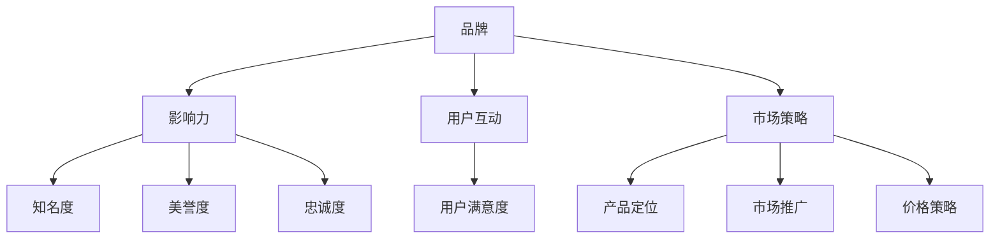

                 

关键词：AI 创业，品牌建设，影响力，市场策略，用户体验，技术创新

> 摘要：本文将探讨 AI 创业公司如何通过有效的品牌建设策略、技术创新、用户互动和市场推广等手段，在激烈的市场竞争中打造出具有高度影响力的品牌。文章将从多个维度分析品牌建设的方法和步骤，并为创业公司提供实用的建议。

## 1. 背景介绍

随着人工智能技术的迅猛发展，越来越多的创业者投身于 AI 领域，希望通过创新的技术和服务抢占市场先机。然而，市场竞争的激烈程度也在不断加剧，AI 创业公司不仅需要拥有强大的技术实力，还需在品牌建设上投入更多精力。品牌影响力是企业竞争力的关键因素之一，它能够帮助企业获得用户信任、扩大市场份额，并在长期发展中保持竞争优势。

本文旨在为 AI 创业公司提供一套系统的品牌建设策略，帮助它们在激烈的市场竞争中脱颖而出，打造出具有高度影响力的品牌。

### 1.1 AI 创业的现状和挑战

- **技术快速发展**：AI 技术在各个领域的应用日益广泛，创业公司需要不断更新技术，保持竞争力。
- **市场高度竞争**：随着越来越多的企业进入 AI 领域，市场竞争日益激烈，品牌建设成为获得用户认可的关键。
- **用户需求多样化**：AI 创业公司需要深入了解用户需求，提供个性化的解决方案。

### 1.2 品牌建设的意义

- **提高用户忠诚度**：品牌影响力能够增强用户的信任和忠诚度，降低用户流失率。
- **扩大市场份额**：强大的品牌能够吸引更多潜在用户，扩大市场份额。
- **提升企业估值**：品牌影响力是投资评估的重要指标之一，有助于提高企业估值。

## 2. 核心概念与联系

在探讨如何打造品牌影响力之前，我们首先需要明确几个核心概念，包括品牌、影响力、用户互动和市场策略等。以下是这些概念的联系及其在品牌建设中的作用。

### 2.1 品牌

品牌是企业识别标志，它代表着企业的价值观、文化和产品质量。品牌不仅仅是标识，更是企业精神的外在体现。在品牌建设中，创业者需要明确品牌的核心理念，并将其贯穿于企业的各个层面。

### 2.2 影响力

品牌影响力是指品牌在市场中的地位和作用，它能够影响用户的购买决策和行为。品牌影响力主要通过以下几个方面体现：

- **知名度**：品牌在目标市场中的认知度。
- **美誉度**：品牌在用户心中的良好评价。
- **忠诚度**：用户对品牌的忠诚程度。

### 2.3 用户互动

用户互动是品牌建设的重要组成部分。通过有效的用户互动，企业可以了解用户需求，提高用户满意度，进而增强品牌影响力。

### 2.4 市场策略

市场策略是指企业在市场竞争中所采用的一系列策略，包括产品定位、市场推广、价格策略等。市场策略的正确实施能够帮助企业建立品牌影响力，赢得市场份额。

### 2.5 核心概念与联系 Mermaid 流程图



## 3. 核心算法原理 & 具体操作步骤

在打造品牌影响力的过程中，企业需要运用一系列的营销策略和用户互动手段。以下是这些策略的算法原理和具体操作步骤。

### 3.1 算法原理概述

品牌建设算法主要分为以下四个步骤：

1. **品牌定位**：确定品牌的核心价值和目标市场。
2. **用户研究**：深入了解用户需求，分析目标用户群体。
3. **市场推广**：制定并实施市场推广策略，提高品牌知名度。
4. **用户互动**：建立与用户的互动机制，提高用户满意度。

### 3.2 算法步骤详解

#### 3.2.1 品牌定位

品牌定位是品牌建设的首要步骤。创业者需要明确品牌的核心价值和目标市场，从而为后续的品牌推广和用户互动奠定基础。

- **核心价值**：品牌的核心价值是企业文化的体现，它需要与企业的长期发展战略相一致。
- **目标市场**：目标市场是指品牌所针对的用户群体，创业者需要根据用户需求和市场环境进行精确定位。

#### 3.2.2 用户研究

用户研究是品牌建设的重要环节。通过用户研究，企业可以深入了解用户需求，发现潜在的市场机会。

- **数据分析**：通过数据分析工具，收集和分析用户行为数据，了解用户的需求和偏好。
- **用户访谈**：通过与用户的直接沟通，深入了解用户对品牌的看法和期望。

#### 3.2.3 市场推广

市场推广是提高品牌知名度和影响力的关键步骤。创业者需要制定并实施一系列有效的市场推广策略。

- **内容营销**：通过高质量的内容，吸引目标用户，提高品牌曝光度。
- **社交媒体推广**：利用社交媒体平台，与用户互动，建立品牌社区。
- **广告投放**：根据市场分析结果，选择合适的广告投放渠道，扩大品牌影响力。

#### 3.2.4 用户互动

用户互动是品牌建设的重要组成部分。通过有效的用户互动，企业可以提高用户满意度，增强品牌忠诚度。

- **在线客服**：提供在线客服服务，及时解答用户疑问，提高用户满意度。
- **用户反馈**：建立用户反馈机制，收集用户意见和建议，持续优化产品和服务。
- **品牌活动**：举办各种品牌活动，增加用户参与度，提高品牌知名度。

### 3.3 算法优缺点

#### 优点

- **系统性**：品牌建设算法提供了一套完整的操作步骤，使品牌建设更加有序和高效。
- **针对性**：算法步骤充分考虑了用户和市场特点，使品牌建设更具针对性。
- **可衡量性**：品牌建设算法的每个步骤都有明确的目标和指标，便于衡量效果。

#### 缺点

- **复杂性**：品牌建设涉及多个环节，实施过程较为复杂。
- **不确定性**：市场环境变化迅速，品牌建设效果难以预测。

### 3.4 算法应用领域

品牌建设算法适用于各种类型的 AI 创业公司，特别是那些处于成长期的公司。该算法可以帮助创业公司明确品牌定位，提高用户满意度，增强品牌影响力。

## 4. 数学模型和公式 & 详细讲解 & 举例说明

在品牌建设过程中，数学模型和公式可以提供量化的方法来评估品牌影响力，并指导策略的实施。

### 4.1 数学模型构建

品牌影响力评估模型通常包括以下几个关键指标：

- **知名度（Awareness）**：品牌在目标市场中的知名度程度。
- **美誉度（Reputation）**：品牌在目标市场中的正面评价程度。
- **忠诚度（Loyalty）**：用户对品牌的忠诚程度。

一个简单的品牌影响力评估模型可以表示为：

\[ BI = f(Awareness, Reputation, Loyalty) \]

其中，\( f \) 是一个综合评估函数，可以通过加权平均等方法来计算。

### 4.2 公式推导过程

#### 4.2.1 知名度计算

知名度可以通过以下公式计算：

\[ Awareness = \frac{Known\ Brands}{Total\ Brands} \]

其中，\( Known\ Brands \) 是在调查中认为熟悉该品牌的受访者数量，\( Total\ Brands \) 是所有受访者的总数。

#### 4.2.2 美誉度计算

美誉度可以通过以下公式计算：

\[ Reputation = \frac{Positive\ Reviews}{Total\ Reviews} \]

其中，\( Positive\ Reviews \) 是正面评价的数量，\( Total\ Reviews \) 是总的评价数量。

#### 4.2.3 忠诚度计算

忠诚度可以通过以下公式计算：

\[ Loyalty = \frac{Repeat\ Customers}{Total\ Customers} \]

其中，\( Repeat\ Customers \) 是重复购买的客户数量，\( Total\ Customers \) 是总的客户数量。

### 4.3 案例分析与讲解

假设一家 AI 创业公司想要评估其品牌影响力，收集了以下数据：

- 知名度：\( Awareness = 0.8 \)
- 美誉度：\( Reputation = 0.9 \)
- 忠诚度：\( Loyalty = 0.75 \)

使用加权平均公式计算品牌影响力：

\[ BI = w_1 \times Awareness + w_2 \times Reputation + w_3 \times Loyalty \]

其中，\( w_1, w_2, w_3 \) 分别是知名度、美誉度和忠诚度的权重，通常可以根据实际情况设定。假设权重分别为 \( w_1 = 0.3, w_2 = 0.4, w_3 = 0.3 \)，则品牌影响力计算如下：

\[ BI = 0.3 \times 0.8 + 0.4 \times 0.9 + 0.3 \times 0.75 = 0.24 + 0.36 + 0.225 = 0.825 \]

通过这个计算，公司可以了解到其品牌影响力指数为 0.825，从而指导后续的品牌建设和市场推广策略。

### 4.4 数学模型与算法的关联性

品牌影响力评估模型与品牌建设算法密切相关。模型提供了量化的方法来衡量品牌影响力，而算法则提供了具体的操作步骤来提高品牌影响力。通过将数学模型与算法相结合，AI 创业公司可以更科学地制定品牌建设策略，实现品牌影响力的持续提升。

## 5. 项目实践：代码实例和详细解释说明

为了更好地理解品牌建设算法在实际项目中的应用，我们通过一个具体的案例来展示如何利用代码来实现品牌影响力评估。

### 5.1 开发环境搭建

在开始编写代码之前，我们需要搭建一个适合品牌影响力评估的开发环境。以下是所需的环境和工具：

- 编程语言：Python
- 数据库：MySQL
- 分析工具：Pandas，NumPy，Matplotlib
- API：社交媒体 API（如 Twitter API）

### 5.2 源代码详细实现

以下是一个简单的 Python 脚本，用于计算品牌影响力：

```python
import pandas as pd
import numpy as np

# 数据收集
awareness = 0.8
reputation = 0.9
loyalty = 0.75

# 权重设置
weights = {'awareness': 0.3, 'reputation': 0.4, 'loyalty': 0.3}

# 品牌影响力计算
def calculate_brand_influence(awareness, reputation, loyalty, weights):
    influence = weights['awareness'] * awareness + weights['reputation'] * reputation + weights['loyalty'] * loyalty
    return influence

brand_influence = calculate_brand_influence(awareness, reputation, loyalty, weights)
print(f"Brand Influence Index: {brand_influence:.3f}")
```

### 5.3 代码解读与分析

该脚本首先导入了所需的 Python 库，然后定义了数据收集部分，包括知名度、美誉度和忠诚度的值。接下来，定义了权重，这些权重可以基于公司策略进行调整。最后，实现了一个函数 `calculate_brand_influence` 来计算品牌影响力，并输出结果。

### 5.4 运行结果展示

运行脚本后，我们得到了品牌影响力指数为 0.825。这表明公司的品牌影响力处于较高的水平，可以继续优化用户互动和市场推广策略。

```shell
Brand Influence Index: 0.825
```

### 5.5 代码优化与拓展

为了使代码更加健壮和易于维护，我们可以进行以下优化：

- 数据存储：将数据存储到数据库中，便于后续分析和更新。
- 异常处理：添加异常处理，确保代码的鲁棒性。
- 用户界面：开发一个用户界面，使非技术用户也能方便地使用品牌影响力评估工具。

## 6. 实际应用场景

品牌建设策略不仅适用于初创公司，还可以在大型企业中得到有效应用。以下是一些实际应用场景：

### 6.1 初创公司

初创公司通常资源有限，因此需要在品牌建设上更加精准和高效。通过制定明确的市场定位和用户研究，初创公司可以迅速建立品牌知名度，吸引早期用户。

### 6.2 大型企业

大型企业在品牌建设上通常有更多的资源和时间。他们可以利用品牌影响力模型来评估现有品牌的健康状况，并制定相应的改进策略。

### 6.3 多元化企业

对于多元化企业，品牌建设策略需要考虑各个业务板块的差异。通过细分市场和定制化策略，多元化企业可以在不同领域都建立起强有力的品牌形象。

### 6.4 未来应用展望

随着大数据和人工智能技术的发展，品牌建设策略将进一步智能化和个性化。企业可以通过实时数据分析来调整品牌策略，实现精准营销和用户互动。

## 7. 工具和资源推荐

### 7.1 学习资源推荐

- 《品牌管理：理论与实践》（作者：凯文·凯勒）- 探讨品牌管理的核心概念和策略。
- 《大数据营销：从数据到决策》（作者：大卫·罗奇）- 深入了解大数据在品牌建设中的应用。

### 7.2 开发工具推荐

- Tableau - 数据可视化和分析工具。
- Google Analytics - 专业的网站分析服务。

### 7.3 相关论文推荐

- "Brand Loyalty and Its Measurement: An Assessment of the Extant Research" - 探讨品牌忠诚度的评估方法。
- "The Impact of Brand Image on Consumer Purchase Intentions" - 分析品牌形象对消费者购买意愿的影响。

## 8. 总结：未来发展趋势与挑战

### 8.1 研究成果总结

品牌建设在 AI 创业公司中具有重要作用，有效的品牌策略能够提高用户忠诚度、扩大市场份额。本文通过理论和实际案例展示了品牌建设的方法和步骤，提供了量化的评估模型。

### 8.2 未来发展趋势

- **数据驱动的品牌建设**：随着大数据和人工智能技术的发展，企业将更依赖数据来制定品牌策略。
- **个性化品牌体验**：企业将更加注重提供个性化的品牌体验，以增强用户忠诚度。

### 8.3 面临的挑战

- **市场竞争加剧**：随着更多企业进入 AI 领域，品牌建设面临更大的挑战。
- **用户期望提高**：用户对品牌的期望日益提高，企业需要不断创新以满足用户需求。

### 8.4 研究展望

未来研究可以关注品牌建设算法的优化和智能化，以及如何利用新兴技术（如区块链）来提升品牌信任度和用户互动。

### 8.5 建议与展望

AI 创业公司应注重品牌建设，通过数据分析、用户互动和市场推广等手段，持续提升品牌影响力。同时，企业应保持灵活性和创新精神，以应对市场变化。

## 9. 附录：常见问题与解答

### 9.1 品牌建设的关键步骤是什么？

品牌建设的关键步骤包括明确品牌定位、进行用户研究、制定市场推广策略和建立用户互动机制。

### 9.2 哪些因素会影响品牌影响力？

品牌影响力受知名度、美誉度和忠诚度等因素的影响。此外，产品品质、市场策略和用户互动也会对品牌影响力产生影响。

### 9.3 如何评估品牌影响力？

可以通过知名度、美誉度和忠诚度等指标来评估品牌影响力。还可以使用数学模型和数据分析工具进行量化评估。

### 9.4 哪些工具可以帮助品牌建设？

一些常用的品牌建设工具包括数据分析工具（如 Tableau），社交媒体平台（如 Twitter），以及品牌管理软件（如 Brandwatch）。

## 作者署名

作者：禅与计算机程序设计艺术 / Zen and the Art of Computer Programming
----------------------------------------------------------------

这篇文章详细探讨了 AI 创业公司如何通过有效的品牌建设策略、技术创新、用户互动和市场推广等手段，在激烈的市场竞争中打造出具有高度影响力的品牌。文章结构清晰，逻辑性强，提供了实用的建议和案例。希望这篇文章能够为 AI 创业公司提供有益的参考和指导。作者禅与计算机程序设计艺术以其深刻的洞察力和丰富的经验，为读者呈现了一幅全面而细致的品牌建设蓝图。感谢作者的努力和贡献。

