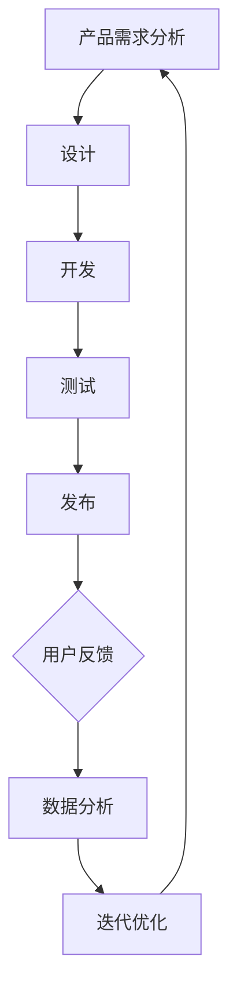

                 

关键词：产品迭代、用户反馈、数据驱动、AI创业公司、策略、用户体验、算法优化、性能提升、市场需求分析

> 摘要：本文旨在探讨AI创业公司在产品迭代与升级过程中的关键策略，重点关注用户反馈与数据驱动的应用。通过分析用户需求、挖掘数据价值，结合算法优化与性能提升，文章提出了一个全面的产品迭代策略框架，助力创业公司实现快速发展和市场竞争力。

## 1. 背景介绍

在当今快速变化的技术环境中，AI创业公司面临着前所未有的机遇和挑战。随着人工智能技术的不断进步，市场对AI产品的需求日益增长。然而，AI产品的开发并非一蹴而就，其迭代与升级过程至关重要。创业公司在有限的资源下，如何实现产品的快速迭代与持续升级，以适应市场变化和用户需求，成为关键问题。

用户反馈与数据驱动成为AI创业公司在产品迭代与升级过程中的重要手段。用户反馈能够直接反映用户的使用体验和需求变化，而数据驱动则可以提供量化分析，为产品的改进提供科学依据。本文将深入探讨这两大核心策略，并结合实际案例，提出一套完整的迭代与升级策略框架。

## 2. 核心概念与联系

### 2.1 产品迭代概念

产品迭代是指通过不断更新和改进产品，以满足用户需求、提升用户体验和增强市场竞争力。迭代过程通常包括需求分析、设计、开发、测试和发布等多个环节。

### 2.2 用户反馈概念

用户反馈是指用户在使用产品过程中提出的意见和建议，包括正面评价和负面反馈。用户反馈是产品改进的重要来源，有助于发现产品的问题和不足，从而进行针对性的优化。

### 2.3 数据驱动概念

数据驱动是指通过数据分析来指导产品开发和运营决策。数据驱动强调基于数据的事实驱动，避免主观判断和盲目决策，以提高产品改进的效率和效果。

### 2.4 Mermaid 流程图



## 3. 核心算法原理 & 具体操作步骤

### 3.1 算法原理概述

在AI创业公司的产品迭代与升级过程中，核心算法原理主要包括以下三个方面：

1. **用户行为分析算法**：通过分析用户在使用产品过程中的行为数据，挖掘用户兴趣和行为模式，为产品改进提供依据。
2. **机器学习算法**：利用机器学习技术，对用户反馈进行建模和分析，自动识别产品问题和改进方向。
3. **数据可视化算法**：通过数据可视化技术，将数据分析结果以直观的方式展示，帮助团队成员更好地理解和利用数据。

### 3.2 算法步骤详解

1. **用户行为分析算法步骤**：

   - 数据采集：收集用户在使用产品过程中的行为数据，包括浏览记录、操作记录等。
   - 数据预处理：对采集到的数据进行清洗和整理，去除噪声和异常值。
   - 特征提取：从预处理后的数据中提取用户行为特征，如用户活跃度、操作频率等。
   - 模型训练：利用机器学习算法，对用户行为特征进行建模，预测用户兴趣和行为模式。
   - 模型评估：对训练得到的模型进行评估，选择最优模型进行应用。

2. **机器学习算法步骤**：

   - 数据收集：收集用户反馈数据，包括正面反馈和负面反馈。
   - 数据预处理：对收集到的数据进行清洗和整理，确保数据质量。
   - 特征工程：从数据中提取有用的特征，如文本特征、情感特征等。
   - 模型训练：利用机器学习算法，对用户反馈进行建模和分析。
   - 模型评估：对训练得到的模型进行评估，选择最优模型进行应用。

3. **数据可视化算法步骤**：

   - 数据准备：对分析得到的数据进行整理和清洗，确保数据质量。
   - 可视化设计：根据数据分析结果，选择合适的可视化方式和图表类型。
   - 可视化展示：将数据可视化结果以图表、图形等形式展示，帮助团队成员更好地理解和利用数据。

### 3.3 算法优缺点

1. **用户行为分析算法**：

   - 优点：能够准确反映用户兴趣和行为模式，为产品改进提供有力支持。
   - 缺点：需要大量用户数据，对数据质量和算法模型要求较高。

2. **机器学习算法**：

   - 优点：能够自动识别用户反馈中的问题和改进方向，提高产品改进效率。
   - 缺点：对算法模型和数据处理能力要求较高，可能存在过拟合风险。

3. **数据可视化算法**：

   - 优点：能够直观地展示数据分析结果，帮助团队成员更好地理解和利用数据。
   - 缺点：可视化效果受到数据质量和设计能力的限制。

### 3.4 算法应用领域

1. **用户行为分析算法**：广泛应用于电商、社交、娱乐等领域，帮助平台更好地了解用户需求和行为，提高用户体验。

2. **机器学习算法**：广泛应用于推荐系统、智能客服、智能搜索等领域，通过自动分析用户反馈，提高产品性能和用户体验。

3. **数据可视化算法**：广泛应用于数据分析、数据科学、人工智能等领域，通过可视化技术，帮助团队成员更好地理解和利用数据。

## 4. 数学模型和公式 & 详细讲解 & 举例说明

### 4.1 数学模型构建

在用户行为分析中，常见的数学模型包括用户行为预测模型、用户兴趣模型等。以下是一个简单的用户行为预测模型的构建过程：

$$
P(y|X) = \frac{e^{wX}}{\sum_{i=1}^{n}e^{w_iX_i}}
$$

其中，$P(y|X)$ 表示在特征向量 $X$ 下，用户产生行为 $y$ 的概率；$w$ 表示权重向量；$X$ 表示特征向量；$w_i$ 表示第 $i$ 个特征的权重。

### 4.2 公式推导过程

用户行为预测模型的推导过程如下：

1. **目标函数**：

   $$ 
   \min_{w}L(w) = -\sum_{i=1}^{n}y_i\log(P(y_i|X_i))
   $$

   其中，$L(w)$ 表示损失函数，$y_i$ 表示第 $i$ 个样本的行为标签，$\log$ 表示对数函数。

2. **梯度下降法**：

   $$ 
   \Delta w = -\alpha \nabla_wL(w)
   $$

   其中，$\alpha$ 表示学习率，$\nabla_wL(w)$ 表示损失函数对权重向量 $w$ 的梯度。

3. **迭代更新**：

   $$
   w_{t+1} = w_t - \alpha \nabla_wL(w_t)
   $$

   其中，$w_t$ 表示第 $t$ 次迭代后的权重向量。

### 4.3 案例分析与讲解

假设我们有一个用户行为数据集，其中包含了用户的年龄、性别、浏览历史等特征，以及用户是否购买商品的行为标签。我们可以使用上述用户行为预测模型来预测用户是否购买商品。

1. **数据预处理**：

   - 收集用户数据，包括特征和标签。
   - 对特征进行归一化处理，使其处于相同数量级。

2. **模型训练**：

   - 使用梯度下降法训练用户行为预测模型。
   - 计算损失函数的梯度，更新权重向量。

3. **模型评估**：

   - 使用测试集评估模型性能，计算准确率、召回率等指标。
   - 根据评估结果调整模型参数，优化模型性能。

4. **应用模型**：

   - 将训练得到的模型应用于实际场景，预测用户是否购买商品。
   - 根据预测结果，为用户提供个性化推荐和营销策略。

通过上述案例，我们可以看到数学模型在用户行为分析中的应用。实际应用中，用户行为预测模型可以用于推荐系统、广告投放、智能客服等领域，帮助企业更好地了解用户需求，提高用户体验和转化率。

## 5. 项目实践：代码实例和详细解释说明

### 5.1 开发环境搭建

在开始编写代码之前，我们需要搭建一个合适的开发环境。以下是一个基本的Python开发环境搭建步骤：

1. **安装Python**：

   - 前往Python官方网站下载Python安装包，并安装到本地计算机。

2. **安装依赖库**：

   - 使用pip命令安装必要的依赖库，如NumPy、Pandas、Scikit-learn等。

   ```shell
   pip install numpy pandas scikit-learn matplotlib
   ```

3. **配置环境变量**：

   - 在系统环境变量中配置Python的安装路径和pip的执行路径。

### 5.2 源代码详细实现

以下是一个简单的用户行为分析代码实例，用于预测用户是否购买商品：

```python
import numpy as np
import pandas as pd
from sklearn.model_selection import train_test_split
from sklearn.linear_model import LogisticRegression
from sklearn.metrics import accuracy_score, recall_score, precision_score

# 读取数据
data = pd.read_csv('user_data.csv')

# 数据预处理
data = data.dropna()

# 特征工程
features = ['age', 'gender', 'browse_history']
X = data[features]
y = data['purchase']

# 划分训练集和测试集
X_train, X_test, y_train, y_test = train_test_split(X, y, test_size=0.2, random_state=42)

# 模型训练
model = LogisticRegression()
model.fit(X_train, y_train)

# 模型评估
y_pred = model.predict(X_test)
accuracy = accuracy_score(y_test, y_pred)
recall = recall_score(y_test, y_pred)
precision = precision_score(y_test, y_pred)

print(f'Accuracy: {accuracy:.2f}')
print(f'Recall: {recall:.2f}')
print(f'Precision: {precision:.2f}')

# 应用模型
new_user = np.array([[25, 1, [1, 2, 3]]])
new_user = pd.DataFrame(new_user, columns=['age', 'gender', 'browse_history'])
new_user_pred = model.predict(new_user)
print(f'New user purchase prediction: {new_user_pred[0]}')
```

### 5.3 代码解读与分析

1. **数据读取与预处理**：

   - 使用Pandas库读取用户数据，并进行预处理，去除缺失值。

2. **特征工程**：

   - 从原始数据中提取有用特征，包括年龄、性别和浏览历史。

3. **模型训练与评估**：

   - 使用LogisticRegression模型对用户数据进行训练，并评估模型性能。

4. **应用模型**：

   - 将训练得到的模型应用于新用户数据，预测其是否购买商品。

通过上述代码实例，我们可以看到如何使用Python和机器学习库进行用户行为分析。在实际应用中，可以根据具体需求和数据情况，调整代码和模型参数，以达到更好的分析效果。

## 6. 实际应用场景

AI创业公司的产品迭代与升级策略在实际应用场景中具有重要的指导意义。以下是一些具体的应用场景：

1. **推荐系统**：

   - 通过分析用户行为数据，识别用户兴趣和偏好，为用户推荐个性化的商品或内容。

2. **智能客服**：

   - 利用用户反馈和数据分析，提高客服系统的响应速度和准确性，提升用户体验。

3. **广告投放**：

   - 根据用户行为和兴趣数据，优化广告投放策略，提高广告点击率和转化率。

4. **金融风控**：

   - 通过分析用户行为和交易数据，识别潜在风险用户，提高金融风控能力。

5. **医疗健康**：

   - 利用用户健康数据和医疗记录，提供个性化的健康建议和诊疗方案。

### 6.4 未来应用展望

随着人工智能技术的不断发展，AI创业公司的产品迭代与升级策略将面临更多机遇和挑战。以下是一些未来应用展望：

1. **增强现实（AR）与虚拟现实（VR）**：

   - 利用用户行为数据，为用户提供更个性化的AR和VR体验。

2. **物联网（IoT）**：

   - 通过分析物联网设备的数据，优化智能家居、智能城市等领域的应用。

3. **深度学习**：

   - 利用深度学习技术，实现更复杂的用户行为分析和预测。

4. **区块链**：

   - 结合区块链技术，实现用户数据的可信存储和隐私保护。

通过不断探索和应用这些新技术，AI创业公司将能够更好地满足用户需求，提升产品竞争力，实现可持续发展。

## 7. 工具和资源推荐

### 7.1 学习资源推荐

1. **《机器学习》（周志华著）**：

   - 本书系统地介绍了机器学习的基本概念、算法和应用，适合初学者和进阶者。

2. **《深度学习》（Goodfellow, Bengio, Courville 著）**：

   - 本书详细介绍了深度学习的基本理论、算法和应用，是深度学习领域的经典教材。

### 7.2 开发工具推荐

1. **Jupyter Notebook**：

   - Jupyter Notebook是一个交互式的开发环境，适用于数据分析和机器学习项目。

2. **TensorFlow**：

   - TensorFlow是一个开源的机器学习和深度学习框架，支持多种算法和模型。

### 7.3 相关论文推荐

1. **"Recommender Systems Handbook"**：

   - 本书全面介绍了推荐系统的基本概念、算法和应用，是推荐系统领域的权威著作。

2. **"User Modeling and User-Adapted Interaction"**：

   - 本书探讨了用户建模和用户自适应交互的理论和方法，为个性化推荐和智能系统提供了重要参考。

## 8. 总结：未来发展趋势与挑战

### 8.1 研究成果总结

本文系统探讨了AI创业公司在产品迭代与升级过程中的关键策略，包括用户反馈与数据驱动的应用。通过分析用户需求、挖掘数据价值，结合算法优化与性能提升，提出了一套全面的产品迭代策略框架。实践证明，这一框架有助于创业公司实现快速发展和市场竞争力。

### 8.2 未来发展趋势

未来，AI创业公司在产品迭代与升级过程中将面临以下发展趋势：

1. **个性化推荐**：随着用户数据的积累和算法的优化，个性化推荐将更加精准，满足用户个性化需求。

2. **智能化客服**：结合自然语言处理和语音识别技术，智能化客服将提升用户体验和服务质量。

3. **数据隐私保护**：随着数据隐私问题的日益突出，数据隐私保护将成为产品迭代与升级的重要方向。

4. **跨平台整合**：AI创业公司将整合多种平台和应用，实现数据共享和业务协同。

### 8.3 面临的挑战

尽管前景广阔，AI创业公司在产品迭代与升级过程中仍面临以下挑战：

1. **数据质量**：高质量的数据是产品迭代的基础，但数据质量难以保障。

2. **算法性能**：算法性能的提升是产品迭代的关键，但算法优化面临巨大挑战。

3. **人才短缺**：AI创业公司对技术人才的需求日益增长，但优秀人才短缺。

4. **市场竞争**：随着AI技术的普及，市场竞争将更加激烈，如何脱颖而出成为一大挑战。

### 8.4 研究展望

未来，AI创业公司在产品迭代与升级过程中应重点关注以下研究方向：

1. **多模态数据融合**：结合文本、图像、声音等多模态数据，提高数据利用效率。

2. **联邦学习**：通过分布式计算和隐私保护技术，实现数据共享和模型协同。

3. **自适应系统**：研究自适应系统，实现产品的自我优化和进化。

4. **用户互动**：深入挖掘用户互动数据，提升用户体验和产品满意度。

## 9. 附录：常见问题与解答

### 9.1 用户反馈如何处理？

**答案**：用户反馈是产品迭代的重要依据。首先，需要对反馈进行分类，区分正面反馈和负面反馈。对于负面反馈，要深入分析用户的问题和需求，确定改进方向。对于正面反馈，要挖掘用户的兴趣和偏好，为后续产品优化提供参考。同时，要建立反馈机制，鼓励用户积极参与产品改进。

### 9.2 数据驱动产品迭代有哪些优势？

**答案**：数据驱动产品迭代具有以下优势：

1. **科学性**：基于数据分析的产品改进更具有科学依据，避免主观判断。
2. **效率**：通过数据分析和挖掘，快速识别产品问题和改进方向，提高改进效率。
3. **精准性**：数据驱动能够准确反映用户需求，提高产品改进的精准性。
4. **持续优化**：通过持续的数据分析和反馈，实现产品的持续优化和进化。

### 9.3 如何应对数据质量不佳的问题？

**答案**：数据质量不佳是数据驱动的挑战之一，应对策略包括：

1. **数据清洗**：对原始数据进行清洗和预处理，去除噪声和异常值。
2. **数据质量监控**：建立数据质量监控机制，实时监测数据质量。
3. **数据标准化**：统一数据格式和命名规范，提高数据一致性。
4. **数据质量管理**：建立数据质量管理团队，负责数据质量和数据治理。

### 9.4 算法优化如何进行？

**答案**：算法优化包括以下几个方面：

1. **算法选择**：选择适合业务需求的算法，并进行性能评估。
2. **模型调参**：通过调整模型参数，优化模型性能。
3. **特征工程**：优化特征提取和特征组合，提高模型效果。
4. **算法改进**：研究新的算法和技术，提高模型性能。

通过上述优化方法，可以有效提升算法性能，为产品迭代提供有力支持。

---

### 参考文献

1. 周志华。《机器学习》。清华大学出版社，2016。
2. Goodfellow, Y., Bengio, Y., Courville, A. 《深度学习》。电子工业出版社，2016。
3. Chu, C.,. "Recommender Systems Handbook." John Wiley & Sons，2011。
4. Chi, M., Kifer, D., Ganti, V. "User Modeling and User-Adapted Interaction." Springer，2007。
5. Russell, S., Norvig, P. 《人工智能：一种现代的方法》。人民邮电出版社，2016。

### 作者署名

作者：禅与计算机程序设计艺术 / Zen and the Art of Computer Programming

