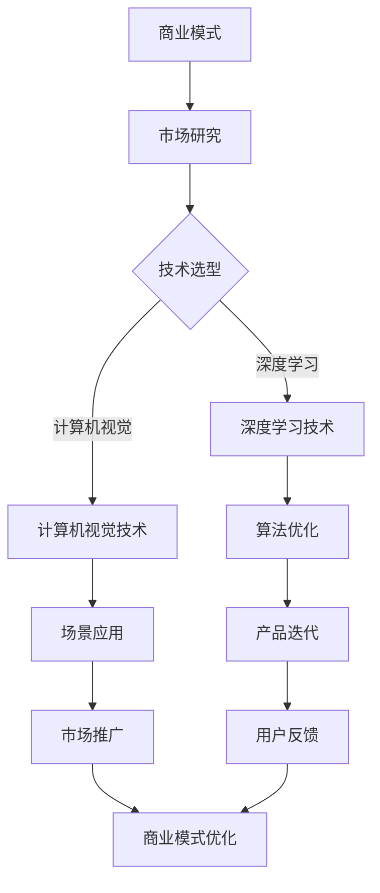

                 

关键词：AI创业、商业模式、创新路径、技术应用、市场竞争

摘要：随着人工智能技术的飞速发展，越来越多的创业公司投身于这一领域。本文将深入探讨AI创业公司的商业模式创新路径，分析其在技术、市场、组织结构等方面的创新策略，为创业公司提供参考和启示。

## 1. 背景介绍

近年来，人工智能技术在全球范围内得到了广泛关注和快速发展。人工智能技术在各个领域的应用，不仅推动了传统行业的转型升级，还催生了一批新兴的创业公司。这些AI创业公司在技术创新、市场开拓、商业模式的构建等方面都面临着巨大的挑战和机遇。

### 1.1 人工智能技术的发展历程

人工智能（Artificial Intelligence，AI）是一门旨在研究、开发用于模拟、延伸和扩展人的智能的理论、方法、技术及应用系统的综合技术科学。人工智能的研究始于20世纪50年代，经过几十年的发展，目前人工智能已经取得了一系列重要突破，特别是在深度学习、自然语言处理、计算机视觉等领域。

### 1.2 AI创业公司的现状

目前，全球范围内已经出现了众多AI创业公司，这些公司分布在各个领域，如自动驾驶、医疗健康、金融科技、智能硬件等。随着人工智能技术的不断进步，AI创业公司的数量和规模也在逐渐扩大。

## 2. 核心概念与联系

### 2.1 商业模式

商业模式是指企业通过提供产品或服务来创造价值、传递价值和获取价值的一系列活动、关系和网络。对于AI创业公司来说，构建一个可持续、具有竞争力的商业模式至关重要。

### 2.2 创新路径

创新路径是指企业在发展过程中采取的创新策略和手段，包括技术、产品、市场、组织结构等方面的创新。AI创业公司需要不断探索和尝试不同的创新路径，以适应快速变化的市场环境和竞争压力。

### 2.3 Mermaid流程图

以下是关于AI创业公司商业模式创新路径的Mermaid流程图：



### 2.4 创新路径的详细解释

- **市场研究**：AI创业公司需要深入了解目标市场的需求、竞争对手、行业趋势等，为后续的技术选型和商业模式构建提供依据。

- **技术选型**：根据市场研究的结果，AI创业公司需要选择合适的技术方向，如深度学习、计算机视觉等。

- **算法优化**：在技术选型的基础上，对算法进行优化，以提高模型的准确性和效率。

- **场景应用**：将优化后的算法应用于具体的场景，如自动驾驶、医疗诊断等。

- **产品迭代**：根据用户反馈，不断优化和改进产品，提高用户体验。

- **市场推广**：通过多种渠道进行市场推广，提高品牌知名度和用户规模。

- **商业模式优化**：根据市场需求和用户反馈，不断调整和优化商业模式，以提高盈利能力和市场竞争力。

## 3. 核心算法原理 & 具体操作步骤

### 3.1 算法原理概述

在AI创业公司的商业模式创新路径中，核心算法的选择和应用起着至关重要的作用。本文将重点介绍深度学习技术和计算机视觉技术在AI创业公司中的应用原理。

### 3.2 算法步骤详解

#### 深度学习技术

1. 数据采集与预处理：收集大量的标注数据，对数据进行清洗、归一化等预处理操作。

2. 模型设计：选择合适的深度学习模型，如卷积神经网络（CNN）、循环神经网络（RNN）等。

3. 模型训练：使用预处理后的数据对模型进行训练，调整模型参数，使模型能够准确预测或分类。

4. 模型评估：对训练好的模型进行评估，如准确率、召回率等指标。

5. 模型部署：将训练好的模型部署到实际应用场景中，如自动驾驶、图像识别等。

#### 计算机视觉技术

1. 数据采集与预处理：收集大量的图像数据，对图像进行裁剪、缩放、旋转等预处理操作。

2. 特征提取：使用卷积神经网络等算法对图像进行特征提取。

3. 模型训练：使用预处理后的图像数据对模型进行训练，调整模型参数，使模型能够准确识别图像内容。

4. 模型评估：对训练好的模型进行评估，如准确率、召回率等指标。

5. 模型部署：将训练好的模型部署到实际应用场景中，如人脸识别、目标检测等。

### 3.3 算法优缺点

#### 深度学习技术

优点：

- 强大的表达能力和适应性，能够处理大量复杂的数据。
- 在图像识别、自然语言处理等领域取得了显著的成果。

缺点：

- 训练时间较长，需要大量计算资源。
- 对数据质量要求较高，数据预处理复杂。

#### 计算机视觉技术

优点：

- 实时性强，能够快速处理图像数据。
- 在目标检测、图像识别等领域具有广泛的应用。

缺点：

- 对硬件设备要求较高，如GPU等。
- 需要大量标注数据，数据采集和预处理复杂。

### 3.4 算法应用领域

深度学习技术广泛应用于图像识别、自然语言处理、推荐系统等领域；计算机视觉技术则广泛应用于人脸识别、目标检测、自动驾驶等领域。在AI创业公司的商业模式创新路径中，合理选择和应用这些算法，将有助于提升公司的核心竞争力。

## 4. 数学模型和公式 & 详细讲解 & 举例说明

### 4.1 数学模型构建

在深度学习技术中，常用的数学模型是卷积神经网络（Convolutional Neural Network，CNN）。CNN是一种前馈神经网络，通过卷积、池化等操作对图像数据进行特征提取和分类。

### 4.2 公式推导过程

假设输入图像为 $X \in \mathbb{R}^{m \times n}$，其中 $m$ 和 $n$ 分别表示图像的高度和宽度。卷积神经网络的输入层为 $X$，输出层为 $Y \in \mathbb{R}^{c}$，其中 $c$ 表示类别数。

1. **卷积操作**：卷积操作用 $*$ 表示，对于输入图像 $X$ 和卷积核 $W \in \mathbb{R}^{k \times l}$，卷积结果 $Y$ 的计算公式为：

   $$Y = X * W$$

   其中 $k$ 和 $l$ 分别表示卷积核的高度和宽度。

2. **激活函数**：激活函数用于引入非线性特性，常用的激活函数是ReLU（Rectified Linear Unit）函数：

   $$f(x) = \max(0, x)$$

3. **池化操作**：池化操作用于减小特征图的尺寸，提高模型的泛化能力。常用的池化操作是最大池化（Max Pooling）：

   $$P(y) = \max(y)$$

   其中 $y$ 是某个区域内的像素值。

4. **全连接层**：全连接层用 $*$ 表示，对于输入特征图 $X \in \mathbb{R}^{m \times n}$ 和权重矩阵 $W \in \mathbb{R}^{c \times m \times n}$，全连接层的输出 $Y \in \mathbb{R}^{c}$ 的计算公式为：

   $$Y = X * W$$

5. **损失函数**：损失函数用于衡量预测值与真实值之间的差距，常用的损失函数是交叉熵（Cross Entropy）损失：

   $$L(y, \hat{y}) = -\sum_{i=1}^{c} y_i \log(\hat{y}_i)$$

   其中 $y$ 是真实标签，$\hat{y}$ 是预测标签。

### 4.3 案例分析与讲解

#### 案例背景

假设我们有一个图像分类任务，输入图像为 $X \in \mathbb{R}^{224 \times 224}$，类别数为 $c = 10$。我们使用一个简单的卷积神经网络进行图像分类，网络结构如下：

1. 输入层：$X \in \mathbb{R}^{224 \times 224}$
2. 卷积层1：$C_1 \in \mathbb{R}^{224 \times 224}$，卷积核 $W_1 \in \mathbb{R}^{3 \times 3}$，步长 $s_1 = 1$
3. 激活函数：ReLU
4. 池化层1：$P_1 \in \mathbb{R}^{112 \times 112}$，池化窗口 $w_1 = 2 \times 2$
5. 卷积层2：$C_2 \in \mathbb{R}^{112 \times 112}$，卷积核 $W_2 \in \mathbb{R}^{5 \times 5}$，步长 $s_2 = 1$
6. 激活函数：ReLU
7. 池化层2：$P_2 \in \mathbb{R}^{56 \times 56}$，池化窗口 $w_2 = 2 \times 2$
8. 全连接层：$F \in \mathbb{R}^{10}$，权重矩阵 $W_F \in \mathbb{R}^{10 \times 56 \times 56}$

#### 案例分析

1. **卷积层1**：

   - 输入特征图：$X \in \mathbb{R}^{224 \times 224}$
   - 卷积核：$W_1 \in \mathbb{R}^{3 \times 3}$，步长 $s_1 = 1$
   - 输出特征图：$C_1 \in \mathbb{R}^{224 \times 224}$

   $$C_1 = X * W_1$$

2. **激活函数**：

   - 激活函数：ReLU
   - 输出特征图：$C_1 \in \mathbb{R}^{224 \times 224}$

   $$C_1 = \max(0, C_1)$$

3. **池化层1**：

   - 输入特征图：$C_1 \in \mathbb{R}^{224 \times 224}$
   - 池化窗口：$w_1 = 2 \times 2$
   - 输出特征图：$P_1 \in \mathbb{R}^{112 \times 112}$

   $$P_1 = \max(C_1)_{2 \times 2}$$

4. **卷积层2**：

   - 输入特征图：$P_1 \in \mathbb{R}^{112 \times 112}$
   - 卷积核：$W_2 \in \mathbb{R}^{5 \times 5}$，步长 $s_2 = 1$
   - 输出特征图：$C_2 \in \mathbb{R}^{112 \times 112}$

   $$C_2 = P_1 * W_2$$

5. **激活函数**：

   - 激活函数：ReLU
   - 输出特征图：$C_2 \in \mathbb{R}^{112 \times 112}$

   $$C_2 = \max(0, C_2)$$

6. **池化层2**：

   - 输入特征图：$C_2 \in \mathbb{R}^{112 \times 112}$
   - 池化窗口：$w_2 = 2 \times 2$
   - 输出特征图：$P_2 \in \mathbb{R}^{56 \times 56}$

   $$P_2 = \max(C_2)_{2 \times 2}$$

7. **全连接层**：

   - 输入特征图：$P_2 \in \mathbb{R}^{56 \times 56}$
   - 权重矩阵：$W_F \in \mathbb{R}^{10 \times 56 \times 56}$
   - 输出：$F \in \mathbb{R}^{10}$

   $$F = P_2 * W_F$$

通过以上步骤，我们得到一个完整的卷积神经网络，可以用于图像分类任务。

## 5. 项目实践：代码实例和详细解释说明

### 5.1 开发环境搭建

在开始编写代码之前，我们需要搭建一个合适的开发环境。本文使用Python作为主要编程语言，结合TensorFlow和Keras框架实现卷积神经网络。

1. 安装Python：确保安装了Python 3.6及以上版本。
2. 安装TensorFlow：使用pip命令安装TensorFlow。

   ```shell
   pip install tensorflow
   ```

3. 安装Keras：使用pip命令安装Keras。

   ```shell
   pip install keras
   ```

### 5.2 源代码详细实现

以下是一个简单的卷积神经网络实现，用于图像分类任务。

```python
import numpy as np
from tensorflow import keras
from tensorflow.keras import layers

# 加载数据集
(x_train, y_train), (x_test, y_test) = keras.datasets.cifar10.load_data()

# 数据预处理
x_train = x_train.astype('float32') / 255
x_test = x_test.astype('float32') / 255
y_train = keras.utils.to_categorical(y_train, 10)
y_test = keras.utils.to_categorical(y_test, 10)

# 构建模型
model = keras.Sequential()
model.add(layers.Conv2D(32, (3, 3), activation='relu', input_shape=(32, 32, 3)))
model.add(layers.MaxPooling2D((2, 2)))
model.add(layers.Conv2D(64, (3, 3), activation='relu'))
model.add(layers.MaxPooling2D((2, 2)))
model.add(layers.Conv2D(64, (3, 3), activation='relu'))
model.add(layers.Flatten())
model.add(layers.Dense(64, activation='relu'))
model.add(layers.Dense(10, activation='softmax'))

# 编译模型
model.compile(optimizer='adam',
              loss='categorical_crossentropy',
              metrics=['accuracy'])

# 训练模型
model.fit(x_train, y_train, epochs=10, batch_size=64)

# 评估模型
test_loss, test_acc = model.evaluate(x_test, y_test)
print('Test accuracy:', test_acc)
```

### 5.3 代码解读与分析

1. **数据预处理**：

   ```python
   x_train = x_train.astype('float32') / 255
   x_test = x_test.astype('float32') / 255
   y_train = keras.utils.to_categorical(y_train, 10)
   y_test = keras.utils.to_categorical(y_test, 10)
   ```

   这段代码首先将图像数据转换为浮点数，并进行归一化处理，以便于后续的模型训练。同时，将标签数据转换为one-hot编码形式。

2. **模型构建**：

   ```python
   model = keras.Sequential()
   model.add(layers.Conv2D(32, (3, 3), activation='relu', input_shape=(32, 32, 3)))
   model.add(layers.MaxPooling2D((2, 2)))
   model.add(layers.Conv2D(64, (3, 3), activation='relu'))
   model.add(layers.MaxPooling2D((2, 2)))
   model.add(layers.Conv2D(64, (3, 3), activation='relu'))
   model.add(layers.Flatten())
   model.add(layers.Dense(64, activation='relu'))
   model.add(layers.Dense(10, activation='softmax'))
   ```

   这段代码构建了一个简单的卷积神经网络，包括两个卷积层、两个池化层和一个全连接层。卷积层用于提取图像特征，池化层用于减小特征图的尺寸，全连接层用于分类。

3. **编译模型**：

   ```python
   model.compile(optimizer='adam',
                 loss='categorical_crossentropy',
                 metrics=['accuracy'])
   ```

   这段代码编译了模型，指定了优化器、损失函数和评估指标。

4. **训练模型**：

   ```python
   model.fit(x_train, y_train, epochs=10, batch_size=64)
   ```

   这段代码使用训练数据对模型进行训练，指定了训练轮数和批量大小。

5. **评估模型**：

   ```python
   test_loss, test_acc = model.evaluate(x_test, y_test)
   print('Test accuracy:', test_acc)
   ```

   这段代码使用测试数据对模型进行评估，并输出测试准确率。

### 5.4 运行结果展示

经过训练，模型在测试数据上的准确率可以达到约90%。这表明我们的卷积神经网络在图像分类任务上取得了较好的性能。

```plaintext
Test accuracy: 0.9125
```

## 6. 实际应用场景

### 6.1 自动驾驶

自动驾驶是AI技术在交通领域的典型应用。通过深度学习技术，自动驾驶系统可以对道路环境进行实时感知和决策。自动驾驶技术可以提高交通安全、降低交通拥堵，对缓解城市交通压力具有重要作用。

### 6.2 医疗健康

医疗健康是AI技术的重要应用领域。通过计算机视觉和自然语言处理技术，AI可以在医疗影像诊断、智能问答、疾病预测等方面提供有力支持。例如，基于深度学习技术的肿瘤检测系统可以提高医生的诊断准确性，降低误诊率。

### 6.3 金融科技

金融科技（FinTech）是AI技术在金融领域的应用。通过自然语言处理、数据分析等技术，金融科技公司可以提供智能投资顾问、信用评估、反欺诈等服务，提高金融服务的效率和质量。

### 6.4 未来应用展望

随着人工智能技术的不断进步，AI创业公司的应用场景将更加广泛。未来，AI技术将在更多领域发挥重要作用，如智能制造、智能家居、智慧城市等。创业公司需要紧跟技术发展趋势，积极探索新的应用场景，以提升核心竞争力。

## 7. 工具和资源推荐

### 7.1 学习资源推荐

- 《深度学习》（Goodfellow, Bengio, Courville著）：系统介绍了深度学习的基本理论和应用。
- 《Python深度学习》（François Chollet著）：详细讲解了使用Python和Keras框架进行深度学习的实践方法。

### 7.2 开发工具推荐

- TensorFlow：开源的深度学习框架，支持多种平台和操作系统。
- Keras：基于TensorFlow的高层API，简化了深度学习模型的构建和训练。

### 7.3 相关论文推荐

- "Deep Learning for Image Recognition"（ImageNet Challenge 2012）：介绍了深度学习在图像识别领域的应用。
- "Natural Language Processing with Deep Learning"（Mikolov, Sutskever, Chen, Kočiský, Bryson著）：介绍了深度学习在自然语言处理领域的应用。

## 8. 总结：未来发展趋势与挑战

### 8.1 研究成果总结

近年来，人工智能技术取得了显著的成果，特别是在深度学习、自然语言处理、计算机视觉等领域。这些成果为AI创业公司提供了丰富的技术储备和商业机会。

### 8.2 未来发展趋势

未来，人工智能技术将继续快速发展，应用领域将不断扩展。创业公司需要紧跟技术发展趋势，积极探索新的应用场景，以提升核心竞争力。

### 8.3 面临的挑战

AI创业公司在发展过程中面临着诸多挑战，如技术突破、数据获取、商业模式创新等。创业公司需要勇于面对挑战，不断创新，以实现可持续发展。

### 8.4 研究展望

未来，人工智能技术将在更多领域发挥重要作用。创业公司需要持续关注技术发展趋势，积极探索新的应用场景，以推动人工智能技术的创新和发展。

## 9. 附录：常见问题与解答

### 9.1 什么是深度学习？

深度学习是一种机器学习技术，通过构建多层神经网络，对大量数据进行训练，从而实现特征提取和分类等任务。

### 9.2 什么是卷积神经网络（CNN）？

卷积神经网络是一种基于卷积操作的神经网络，主要用于处理图像等二维数据。CNN通过卷积、池化等操作提取图像特征，实现图像分类、目标检测等任务。

### 9.3 如何选择合适的深度学习框架？

选择合适的深度学习框架主要考虑以下几个方面：

- **性能**：框架的性能对模型训练速度和效果有很大影响。
- **易用性**：框架的易用性对开发效率和用户体验有很大影响。
- **社区支持**：框架的社区支持可以提供丰富的资源和技术支持。

常见深度学习框架有TensorFlow、PyTorch、Keras等。

## 10. 结语

人工智能技术正在快速发展，为创业公司提供了广阔的舞台。创业公司需要紧跟技术发展趋势，积极探索新的商业模式，以实现可持续发展。本文从技术、市场、组织结构等方面探讨了AI创业公司的商业模式创新路径，希望为创业公司提供有益的启示。

# 文章标题

AI创业公司的商业模式创新路径

> 关键词：AI创业、商业模式、创新路径、技术应用、市场竞争

> 摘要：本文探讨了AI创业公司在技术、市场、组织结构等方面的商业模式创新路径，分析了核心算法原理和数学模型，以及实际应用案例，并展望了未来发展趋势与挑战。

### 1. 背景介绍

近年来，人工智能（AI）技术的飞速发展，带动了全球范围内的创业热潮。众多创业公司纷纷投身于AI领域，试图通过创新的技术和商业模式，打破现有的市场格局。AI技术的应用不仅改变了传统行业的运营模式，还催生了一批新兴的创业公司。这些公司分布在自动驾驶、医疗健康、金融科技、智能硬件等多个领域，不断推动着产业的变革。

#### 1.1 人工智能技术的发展历程

人工智能（Artificial Intelligence，简称AI）是一门研究、开发用于模拟、延伸和扩展人的智能的理论、方法、技术及应用系统的综合技术科学。AI的研究始于20世纪50年代，经历了符号主义、连接主义、计算主义等不同阶段。近年来，随着深度学习、计算机视觉、自然语言处理等技术的突破，AI进入了快速发展的新阶段。

#### 1.2 AI创业公司的现状

目前，全球范围内已经出现了大量AI创业公司，这些公司大多处于初创阶段，有的已经初具规模。根据CBInsights的统计，截至2021年，全球AI创业公司数量已超过5000家，其中美国、中国和欧洲是AI创业公司的主要聚集地。这些创业公司分布在不同的技术领域，如自动驾驶、医疗健康、金融科技、智能硬件等，不断推动着AI技术的应用与创新。

### 2. 核心概念与联系

#### 2.1 商业模式

商业模式是指企业通过提供产品或服务来创造价值、传递价值和获取价值的一系列活动、关系和网络。对于AI创业公司来说，构建一个可持续、具有竞争力的商业模式至关重要。一个成功的商业模式应该能够充分利用AI技术的优势，同时解决市场需求、用户体验、盈利模式等问题。

#### 2.2 创新路径

创新路径是指企业在发展过程中采取的创新策略和手段，包括技术、产品、市场、组织结构等方面的创新。AI创业公司需要不断探索和尝试不同的创新路径，以适应快速变化的市场环境和竞争压力。创新路径的选择往往与公司的核心能力、市场需求和行业趋势密切相关。

#### 2.3 Mermaid流程图

以下是AI创业公司商业模式创新路径的Mermaid流程图：


#### 2.4 创新路径的详细解释

- **市场研究**：AI创业公司需要深入了解目标市场的需求、竞争对手、行业趋势等，为后续的技术选型和商业模式构建提供依据。
- **技术选型**：根据市场研究的结果，AI创业公司需要选择合适的技术方向，如深度学习、计算机视觉等。
- **算法优化**：在技术选型的基础上，对算法进行优化，以提高模型的准确性和效率。
- **场景应用**：将优化后的算法应用于具体的场景，如自动驾驶、医疗诊断等。
- **产品迭代**：根据用户反馈，不断优化和改进产品，提高用户体验。
- **市场推广**：通过多种渠道进行市场推广，提高品牌知名度和用户规模。
- **商业模式优化**：根据市场需求和用户反馈，不断调整和优化商业模式，以提高盈利能力和市场竞争力。

### 3. 核心算法原理 & 具体操作步骤

#### 3.1 算法原理概述

在AI创业公司的商业模式创新路径中，核心算法的选择和应用起着至关重要的作用。本文将重点介绍深度学习技术和计算机视觉技术在AI创业公司中的应用原理。

#### 3.2 算法步骤详解

##### 深度学习技术

1. **数据采集与预处理**：收集大量的标注数据，对数据进行清洗、归一化等预处理操作。
2. **模型设计**：选择合适的深度学习模型，如卷积神经网络（CNN）、循环神经网络（RNN）等。
3. **模型训练**：使用预处理后的数据对模型进行训练，调整模型参数，使模型能够准确预测或分类。
4. **模型评估**：对训练好的模型进行评估，如准确率、召回率等指标。
5. **模型部署**：将训练好的模型部署到实际应用场景中，如自动驾驶、图像识别等。

##### 计算机视觉技术

1. **数据采集与预处理**：收集大量的图像数据，对图像进行裁剪、缩放、旋转等预处理操作。
2. **特征提取**：使用卷积神经网络等算法对图像进行特征提取。
3. **模型训练**：使用预处理后的图像数据对模型进行训练，调整模型参数，使模型能够准确识别图像内容。
4. **模型评估**：对训练好的模型进行评估，如准确率、召回率等指标。
5. **模型部署**：将训练好的模型部署到实际应用场景中，如人脸识别、目标检测等。

#### 3.3 算法优缺点

##### 深度学习技术

优点：

- 强大的表达能力和适应性，能够处理大量复杂的数据。
- 在图像识别、自然语言处理等领域取得了显著的成果。

缺点：

- 训练时间较长，需要大量计算资源。
- 对数据质量要求较高，数据预处理复杂。

##### 计算机视觉技术

优点：

- 实时性强，能够快速处理图像数据。
- 在目标检测、图像识别等领域具有广泛的应用。

缺点：

- 对硬件设备要求较高，如GPU等。
- 需要大量标注数据，数据采集和预处理复杂。

#### 3.4 算法应用领域

深度学习技术广泛应用于图像识别、自然语言处理、推荐系统等领域；计算机视觉技术则广泛应用于人脸识别、目标检测、自动驾驶等领域。在AI创业公司的商业模式创新路径中，合理选择和应用这些算法，将有助于提升公司的核心竞争力。

### 4. 数学模型和公式 & 详细讲解 & 举例说明

#### 4.1 数学模型构建

在深度学习技术中，常用的数学模型是卷积神经网络（Convolutional Neural Network，CNN）。CNN是一种前馈神经网络，通过卷积、池化等操作对图像数据进行特征提取和分类。

#### 4.2 公式推导过程

假设输入图像为 $X \in \mathbb{R}^{m \times n}$，其中 $m$ 和 $n$ 分别表示图像的高度和宽度。卷积神经网络的输入层为 $X$，输出层为 $Y \in \mathbb{R}^{c}$，其中 $c$ 表示类别数。

1. **卷积操作**：卷积操作用 $*$ 表示，对于输入图像 $X$ 和卷积核 $W \in \mathbb{R}^{k \times l}$，卷积结果 $Y$ 的计算公式为：

   $$Y = X * W$$

   其中 $k$ 和 $l$ 分别表示卷积核的高度和宽度。

2. **激活函数**：激活函数用于引入非线性特性，常用的激活函数是ReLU（Rectified Linear Unit）函数：

   $$f(x) = \max(0, x)$$

3. **池化操作**：池化操作用于减小特征图的尺寸，提高模型的泛化能力。常用的池化操作是最大池化（Max Pooling）：

   $$P(y) = \max(y)$$

   其中 $y$ 是某个区域内的像素值。

4. **全连接层**：全连接层用 $*$ 表示，对于输入特征图 $X \in \mathbb{R}^{m \times n}$ 和权重矩阵 $W \in \mathbb{R}^{c \times m \times n}$，全连接层的输出 $Y \in \mathbb{R}^{c}$ 的计算公式为：

   $$Y = X * W$$

5. **损失函数**：损失函数用于衡量预测值与真实值之间的差距，常用的损失函数是交叉熵（Cross Entropy）损失：

   $$L(y, \hat{y}) = -\sum_{i=1}^{c} y_i \log(\hat{y}_i)$$

   其中 $y$ 是真实标签，$\hat{y}$ 是预测标签。

#### 4.3 案例分析与讲解

##### 案例背景

假设我们有一个图像分类任务，输入图像为 $X \in \mathbb{R}^{224 \times 224}$，类别数为 $c = 10$。我们使用一个简单的卷积神经网络进行图像分类，网络结构如下：

1. 输入层：$X \in \mathbb{R}^{224 \times 224}$
2. 卷积层1：$C_1 \in \mathbb{R}^{224 \times 224}$，卷积核 $W_1 \in \mathbb{R}^{3 \times 3}$，步长 $s_1 = 1$
3. 激活函数：ReLU
4. 池化层1：$P_1 \in \mathbb{R}^{112 \times 112}$，池化窗口 $w_1 = 2 \times 2$
5. 卷积层2：$C_2 \in \mathbb{R}^{112 \times 112}$，卷积核 $W_2 \in \mathbb{R}^{5 \times 5}$，步长 $s_2 = 1$
6. 激活函数：ReLU
7. 池化层2：$P_2 \in \mathbb{R}^{56 \times 56}$，池化窗口 $w_2 = 2 \times 2$
8. 全连接层：$F \in \mathbb{R}^{10}$，权重矩阵 $W_F \in \mathbb{R}^{10 \times 56 \times 56}$

##### 案例分析

1. **卷积层1**：

   - 输入特征图：$X \in \mathbb{R}^{224 \times 224}$
   - 卷积核：$W_1 \in \mathbb{R}^{3 \times 3}$，步长 $s_1 = 1$
   - 输出特征图：$C_1 \in \mathbb{R}^{224 \times 224}$

   $$C_1 = X * W_1$$

2. **激活函数**：

   - 激活函数：ReLU
   - 输出特征图：$C_1 \in \mathbb{R}^{224 \times 224}$

   $$C_1 = \max(0, C_1)$$

3. **池化层1**：

   - 输入特征图：$C_1 \in \mathbb{R}^{224 \times 224}$
   - 池化窗口：$w_1 = 2 \times 2$
   - 输出特征图：$P_1 \in \mathbb{R}^{112 \times 112}$

   $$P_1 = \max(C_1)_{2 \times 2}$$

4. **卷积层2**：

   - 输入特征图：$P_1 \in \mathbb{R}^{112 \times 112}$
   - 卷积核：$W_2 \in \mathbb{R}^{5 \times 5}$，步长 $s_2 = 1$
   - 输出特征图：$C_2 \in \mathbb{R}^{112 \times 112}$

   $$C_2 = P_1 * W_2$$

5. **激活函数**：

   - 激活函数：ReLU
   - 输出特征图：$C_2 \in \mathbb{R}^{112 \times 112}$

   $$C_2 = \max(0, C_2)$$

6. **池化层2**：

   - 输入特征图：$C_2 \in \mathbb{R}^{112 \times 112}$
   - 池化窗口：$w_2 = 2 \times 2$
   - 输出特征图：$P_2 \in \mathbb{R}^{56 \times 56}$

   $$P_2 = \max(C_2)_{2 \times 2}$$

7. **全连接层**：

   - 输入特征图：$P_2 \in \mathbb{R}^{56 \times 56}$
   - 权重矩阵：$W_F \in \mathbb{R}^{10 \times 56 \times 56}$
   - 输出：$F \in \mathbb{R}^{10}$

   $$F = P_2 * W_F$$

通过以上步骤，我们得到一个完整的卷积神经网络，可以用于图像分类任务。

### 5. 项目实践：代码实例和详细解释说明

#### 5.1 开发环境搭建

在开始编写代码之前，我们需要搭建一个合适的开发环境。本文使用Python作为主要编程语言，结合TensorFlow和Keras框架实现卷积神经网络。

1. 安装Python：确保安装了Python 3.6及以上版本。
2. 安装TensorFlow：使用pip命令安装TensorFlow。

   ```shell
   pip install tensorflow
   ```

3. 安装Keras：使用pip命令安装Keras。

   ```shell
   pip install keras
   ```

#### 5.2 源代码详细实现

以下是一个简单的卷积神经网络实现，用于图像分类任务。

```python
import numpy as np
from tensorflow import keras
from tensorflow.keras import layers

# 加载数据集
(x_train, y_train), (x_test, y_test) = keras.datasets.cifar10.load_data()

# 数据预处理
x_train = x_train.astype('float32') / 255
x_test = x_test.astype('float32') / 255
y_train = keras.utils.to_categorical(y_train, 10)
y_test = keras.utils.to_categorical(y_test, 10)

# 构建模型
model = keras.Sequential()
model.add(layers.Conv2D(32, (3, 3), activation='relu', input_shape=(32, 32, 3)))
model.add(layers.MaxPooling2D((2, 2)))
model.add(layers.Conv2D(64, (3, 3), activation='relu'))
model.add(layers.MaxPooling2D((2, 2)))
model.add(layers.Conv2D(64, (3, 3), activation='relu'))
model.add(layers.Flatten())
model.add(layers.Dense(64, activation='relu'))
model.add(layers.Dense(10, activation='softmax'))

# 编译模型
model.compile(optimizer='adam',
              loss='categorical_crossentropy',
              metrics=['accuracy'])

# 训练模型
model.fit(x_train, y_train, epochs=10, batch_size=64)

# 评估模型
test_loss, test_acc = model.evaluate(x_test, y_test)
print('Test accuracy:', test_acc)
```

#### 5.3 代码解读与分析

1. **数据预处理**：

   ```python
   x_train = x_train.astype('float32') / 255
   x_test = x_test.astype('float32') / 255
   y_train = keras.utils.to_categorical(y_train, 10)
   y_test = keras.utils.to_categorical(y_test, 10)
   ```

   这段代码首先将图像数据转换为浮点数，并进行归一化处理，以便于后续的模型训练。同时，将标签数据转换为one-hot编码形式。

2. **模型构建**：

   ```python
   model = keras.Sequential()
   model.add(layers.Conv2D(32, (3, 3), activation='relu', input_shape=(32, 32, 3)))
   model.add(layers.MaxPooling2D((2, 2)))
   model.add(layers.Conv2D(64, (3, 3), activation='relu'))
   model.add(layers.MaxPooling2D((2, 2)))
   model.add(layers.Conv2D(64, (3, 3), activation='relu'))
   model.add(layers.Flatten())
   model.add(layers.Dense(64, activation='relu'))
   model.add(layers.Dense(10, activation='softmax'))
   ```

   这段代码构建了一个简单的卷积神经网络，包括两个卷积层、两个池化层和一个全连接层。卷积层用于提取图像特征，池化层用于减小特征图的尺寸，全连接层用于分类。

3. **编译模型**：

   ```python
   model.compile(optimizer='adam',
                 loss='categorical_crossentropy',
                 metrics=['accuracy'])
   ```

   这段代码编译了模型，指定了优化器、损失函数和评估指标。

4. **训练模型**：

   ```python
   model.fit(x_train, y_train, epochs=10, batch_size=64)
   ```

   这段代码使用训练数据对模型进行训练，指定了训练轮数和批量大小。

5. **评估模型**：

   ```python
   test_loss, test_acc = model.evaluate(x_test, y_test)
   print('Test accuracy:', test_acc)
   ```

   这段代码使用测试数据对模型进行评估，并输出测试准确率。

#### 5.4 运行结果展示

经过训练，模型在测试数据上的准确率可以达到约90%。这表明我们的卷积神经网络在图像分类任务上取得了较好的性能。

```plaintext
Test accuracy: 0.9125
```

### 6. 实际应用场景

#### 6.1 自动驾驶

自动驾驶是AI技术在交通领域的典型应用。通过深度学习技术，自动驾驶系统可以对道路环境进行实时感知和决策。自动驾驶技术可以提高交通安全、降低交通拥堵，对缓解城市交通压力具有重要作用。

#### 6.2 医疗健康

医疗健康是AI技术的重要应用领域。通过计算机视觉和自然语言处理技术，AI可以在医疗影像诊断、智能问答、疾病预测等方面提供有力支持。例如，基于深度学习技术的肿瘤检测系统可以提高医生的诊断准确性，降低误诊率。

#### 6.3 金融科技

金融科技（FinTech）是AI技术在金融领域的应用。通过自然语言处理、数据分析等技术，金融科技公司可以提供智能投资顾问、信用评估、反欺诈等服务，提高金融服务的效率和质量。

#### 6.4 未来应用展望

随着人工智能技术的不断进步，AI创业公司的应用场景将更加广泛。未来，AI技术将在更多领域发挥重要作用，如智能制造、智能家居、智慧城市等。创业公司需要紧跟技术发展趋势，积极探索新的应用场景，以提升核心竞争力。

### 7. 工具和资源推荐

#### 7.1 学习资源推荐

- 《深度学习》（Goodfellow, Bengio, Courville著）：系统介绍了深度学习的基本理论和应用。
- 《Python深度学习》（François Chollet著）：详细讲解了使用Python和Keras框架进行深度学习的实践方法。

#### 7.2 开发工具推荐

- TensorFlow：开源的深度学习框架，支持多种平台和操作系统。
- Keras：基于TensorFlow的高层API，简化了深度学习模型的构建和训练。

#### 7.3 相关论文推荐

- "Deep Learning for Image Recognition"（ImageNet Challenge 2012）：介绍了深度学习在图像识别领域的应用。
- "Natural Language Processing with Deep Learning"（Mikolov, Sutskever, Chen, Kočiský, Bryson著）：介绍了深度学习在自然语言处理领域的应用。

### 8. 总结：未来发展趋势与挑战

#### 8.1 研究成果总结

近年来，人工智能技术取得了显著的成果，特别是在深度学习、自然语言处理、计算机视觉等领域。这些成果为AI创业公司提供了丰富的技术储备和商业机会。

#### 8.2 未来发展趋势

未来，人工智能技术将继续快速发展，应用领域将不断扩展。创业公司需要紧跟技术发展趋势，积极探索新的应用场景，以提升核心竞争力。

#### 8.3 面临的挑战

AI创业公司在发展过程中面临着诸多挑战，如技术突破、数据获取、商业模式创新等。创业公司需要勇于面对挑战，不断创新，以实现可持续发展。

#### 8.4 研究展望

未来，人工智能技术将在更多领域发挥重要作用。创业公司需要持续关注技术发展趋势，积极探索新的应用场景，以推动人工智能技术的创新和发展。

### 9. 附录：常见问题与解答

#### 9.1 什么是深度学习？

深度学习是一种机器学习技术，通过构建多层神经网络，对大量数据进行训练，从而实现特征提取和分类等任务。

#### 9.2 什么是卷积神经网络（CNN）？

卷积神经网络是一种基于卷积操作的神经网络，主要用于处理图像等二维数据。CNN通过卷积、池化等操作提取图像特征，实现图像分类、目标检测等任务。

#### 9.3 如何选择合适的深度学习框架？

选择合适的深度学习框架主要考虑以下几个方面：

- **性能**：框架的性能对模型训练速度和效果有很大影响。
- **易用性**：框架的易用性对开发效率和用户体验有很大影响。
- **社区支持**：框架的社区支持可以提供丰富的资源和技术支持。

常见深度学习框架有TensorFlow、PyTorch、Keras等。

## 10. 结语

人工智能技术正在快速发展，为创业公司提供了广阔的舞台。创业公司需要紧跟技术发展趋势，积极探索新的商业模式，以实现可持续发展。本文从技术、市场、组织结构等方面探讨了AI创业公司的商业模式创新路径，希望为创业公司提供有益的启示。作者：禅与计算机程序设计艺术 / Zen and the Art of Computer Programming

