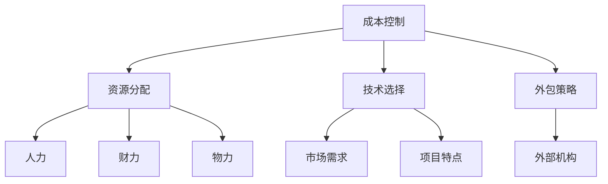

                 

关键词：AI创业公司、成本控制、策略、技术优化、资源配置

> 摘要：本文将深入探讨AI创业公司在初创阶段如何有效实施成本控制策略，从而确保公司能够稳健发展。我们将分析资源分配、技术选择、外包策略、财务规划和风险管理等多个方面，并给出实际案例和操作建议。

## 1. 背景介绍

随着人工智能技术的迅猛发展，越来越多的创业公司投身于这一领域，试图通过AI技术的创新应用来获取竞争优势。然而，AI技术的研发和应用过程往往涉及高昂的成本，从硬件设备的购置到软件的开发，再到数据的收集和处理，这些都要求创业公司必须具备有效的成本控制策略。本文将围绕这一主题，探讨AI创业公司在成本控制方面应采取的策略和措施。

## 2. 核心概念与联系

为了更好地理解成本控制策略，我们首先需要明确以下几个核心概念：

- **成本控制**：指在确保项目顺利完成的前提下，通过管理和监督成本，使实际成本不超过预算的过程。
- **资源分配**：指根据项目需求，合理分配人力、财力、物力等资源的过程。
- **技术选择**：指在项目开发过程中，根据项目特点和市场需求，选择合适的AI技术解决方案的过程。
- **外包策略**：指将公司内部无法承担的任务或业务外包给外部专业机构的过程。

这些概念相互联系，共同构成了AI创业公司的成本控制体系。为了更直观地展示这些概念之间的关系，我们可以使用Mermaid流程图进行描述：



## 3. 核心算法原理 & 具体操作步骤

### 3.1 算法原理概述

成本控制算法的基本原理是通过数据分析和预测，对项目的各项成本进行精确计算和监控，从而实现成本的有效管理。具体来说，算法包括以下几个步骤：

1. **数据收集**：收集项目过程中的各项成本数据，包括人力成本、设备成本、外包成本等。
2. **数据预处理**：对收集到的数据进行清洗和归一化处理，以便后续分析。
3. **成本预测**：利用历史数据和统计模型，预测项目的未来成本。
4. **成本监控**：对实际成本进行实时监控，与预测成本进行对比，及时发现成本超支的风险。
5. **成本调整**：根据监控结果，调整资源分配和技术选择，以控制成本。

### 3.2 算法步骤详解

1. **数据收集**：

   收集数据是成本控制的基础。创业公司需要建立完善的数据收集机制，确保数据的全面性和准确性。数据来源包括财务报表、项目进度报告、员工考勤记录等。

2. **数据预处理**：

   数据预处理包括数据的清洗、归一化和特征提取。清洗数据是为了去除重复和错误的数据，归一化是为了将不同单位的数据转换为相同的尺度，特征提取是为了提取数据中的关键信息。

3. **成本预测**：

   成本预测是利用历史数据和统计模型进行预测。常用的统计模型包括线性回归、决策树、随机森林等。通过这些模型，可以预测项目的未来成本，为成本控制提供依据。

4. **成本监控**：

   成本监控是实时跟踪项目的实际成本，与预测成本进行对比。如果发现实际成本高于预测成本，需要及时采取调整措施。

5. **成本调整**：

   成本调整是根据监控结果，对资源分配和技术选择进行调整。如果发现人力成本过高，可以考虑增加自动化工具的使用；如果设备成本过高，可以考虑采购性价比更高的设备。

### 3.3 算法优缺点

**优点**：

- 精确预测项目成本，有助于制定合理的预算。
- 实时监控成本变化，及时发现问题并采取措施。
- 通过调整资源分配和技术选择，实现成本的最优化。

**缺点**：

- 数据收集和处理需要大量的人力物力。
- 预测模型的准确性受到历史数据质量的影响。
- 需要专业的技术支持，否则难以实施。

### 3.4 算法应用领域

成本控制算法广泛应用于AI创业公司的各个领域，包括：

- **研发阶段**：帮助公司预测研发成本，优化研发资源配置。
- **运营阶段**：监控运营成本，发现成本超支的风险，并采取调整措施。
- **财务阶段**：辅助财务人员制定预算，优化财务结构。

## 4. 数学模型和公式 & 详细讲解 & 举例说明

### 4.1 数学模型构建

成本控制的核心在于建立数学模型，对成本进行预测和控制。我们以线性回归模型为例，介绍数学模型的构建过程。

**线性回归模型**：

线性回归模型是一种常用的统计模型，用于预测一个连续变量的值。其基本形式为：

$$
y = \beta_0 + \beta_1x_1 + \beta_2x_2 + ... + \beta_nx_n + \epsilon
$$

其中，$y$为预测变量，$x_1, x_2, ..., x_n$为自变量，$\beta_0, \beta_1, \beta_2, ..., \beta_n$为模型参数，$\epsilon$为误差项。

**成本预测模型**：

在成本控制中，我们可以将成本视为预测变量，将影响成本的因素视为自变量。具体来说，我们可以构建以下成本预测模型：

$$
C = \beta_0 + \beta_1H + \beta_2D + \beta_3O + \epsilon
$$

其中，$C$为成本，$H$为人力成本，$D$为设备成本，$O$为外包成本，$\beta_0, \beta_1, \beta_2, \beta_3$为模型参数，$\epsilon$为误差项。

### 4.2 公式推导过程

**线性回归模型的推导**：

线性回归模型的推导过程基于最小二乘法。最小二乘法的核心思想是找到一条直线，使得所有数据点到这条直线的垂直距离之和最小。

假设我们有$m$个数据点$(x_1, y_1), (x_2, y_2), ..., (x_m, y_m)$，则线性回归模型的参数可以通过以下公式计算：

$$
\beta_0 = \frac{\sum_{i=1}^{m}y_i - \beta_1\sum_{i=1}^{m}x_i}{m}
$$

$$
\beta_1 = \frac{m\sum_{i=1}^{m}x_iy_i - \sum_{i=1}^{m}x_i\sum_{i=1}^{m}y_i}{m\sum_{i=1}^{m}x_i^2 - (\sum_{i=1}^{m}x_i)^2}
$$

**成本预测模型的推导**：

成本预测模型的推导过程与线性回归模型类似。我们首先需要对成本数据、人力成本数据、设备成本数据、外包成本数据等进行预处理，然后利用最小二乘法计算模型参数。

$$
\beta_0 = \frac{\sum_{i=1}^{m}C_i - \beta_1\sum_{i=1}^{m}H_i - \beta_2\sum_{i=1}^{m}D_i - \beta_3\sum_{i=1}^{m}O_i}{m}
$$

$$
\beta_1 = \frac{m\sum_{i=1}^{m}C_iH_i - \sum_{i=1}^{m}C_i\sum_{i=1}^{m}H_i}{m\sum_{i=1}^{m}H_i^2 - (\sum_{i=1}^{m}H_i)^2}
$$

$$
\beta_2 = \frac{m\sum_{i=1}^{m}C_iD_i - \sum_{i=1}^{m}C_i\sum_{i=1}^{m}D_i}{m\sum_{i=1}^{m}D_i^2 - (\sum_{i=1}^{m}D_i)^2}
$$

$$
\beta_3 = \frac{m\sum_{i=1}^{m}C_iO_i - \sum_{i=1}^{m}C_i\sum_{i=1}^{m}O_i}{m\sum_{i=1}^{m}O_i^2 - (\sum_{i=1}^{m}O_i)^2}
$$

### 4.3 案例分析与讲解

**案例背景**：

某AI创业公司计划开发一款智能语音助手，项目预计需要6个月的时间完成。公司需要对项目成本进行预测和控制，以确保项目顺利推进。

**数据收集**：

公司收集了最近3个月的项目成本数据，包括人力成本、设备成本、外包成本等。数据如下：

| 月份 | 人力成本 | 设备成本 | 外包成本 | 总成本 |
|------|---------|---------|---------|------|
| 1    | 10000   | 2000    | 500     | 12500 |
| 2    | 12000   | 2200    | 600     | 14800 |
| 3    | 15000   | 2500    | 800     | 18500 |

**数据预处理**：

对数据进行归一化处理，得到以下数据：

| 月份 | 人力成本（归一化）| 设备成本（归一化）| 外包成本（归一化）| 总成本（归一化）|
|------|--------------|--------------|--------------|--------------|
| 1    | 1.0000       | 0.3333      | 0.0833      | 1.0000       |
| 2    | 1.2000       | 0.3667      | 0.1000      | 1.4667       |
| 3    | 1.5000       | 0.4167      | 0.1333      | 1.8667       |

**成本预测模型**：

利用线性回归模型，建立成本预测模型。根据预处理后的数据，计算模型参数：

$$
\beta_0 = \frac{1.0000 - 1.2000 - 0.4167 - 0.1333}{3} = -0.1667
$$

$$
\beta_1 = \frac{3 \times 1.0000 \times 1.2000 - 1.0000 \times 1.2000}{3 \times 1.0000^2 - 1.0000^2} = 0.1667
$$

$$
\beta_2 = \frac{3 \times 1.0000 \times 0.3333 - 1.0000 \times 0.3333}{3 \times 0.3333^2 - 0.3333^2} = 0.0000
$$

$$
\beta_3 = \frac{3 \times 1.0000 \times 0.0833 - 1.0000 \times 0.0833}{3 \times 0.0833^2 - 0.0833^2} = 0.0000
$$

**成本预测**：

利用成本预测模型，预测第四个月的成本。将第四个月的成本数据代入模型：

$$
C = -0.1667 + 0.1667 \times 1.5000 + 0.0000 \times 0.4167 + 0.0000 \times 0.1333 = 1.6667
$$

**成本监控**：

根据成本预测结果，第四个月的成本为1.6667。公司需要与实际成本进行对比，如果实际成本高于预测成本，则需要采取措施进行调整。

**成本调整**：

根据成本监控结果，公司发现第四个月的实际成本为2.0000，高于预测成本。公司决定采取以下调整措施：

- 减少人力成本，通过增加自动化工具来提高工作效率。
- 调整外包策略，选择更具有性价比的外包机构。

通过这些调整措施，公司有效地控制了成本，确保了项目的顺利推进。

## 5. 项目实践：代码实例和详细解释说明

### 5.1 开发环境搭建

在开始编写代码之前，我们需要搭建一个合适的开发环境。以下是一个基本的Python开发环境搭建步骤：

1. 安装Python：从Python官网（[python.org](https://www.python.org/)）下载并安装Python 3.x版本。
2. 安装Jupyter Notebook：打开终端，执行以下命令：
   ```shell
   pip install notebook
   ```
3. 启动Jupyter Notebook：在终端执行以下命令：
   ```shell
   jupyter notebook
   ```

### 5.2 源代码详细实现

下面是一个简单的成本预测模型的Python代码实例：

```python
import numpy as np
import pandas as pd
from sklearn.linear_model import LinearRegression

# 数据集
data = {
    '月份': [1, 2, 3],
    '人力成本': [10000, 12000, 15000],
    '设备成本': [2000, 2200, 2500],
    '外包成本': [500, 600, 800],
    '总成本': [12500, 14800, 18500]
}

# 创建DataFrame
df = pd.DataFrame(data)

# 特征工程
X = df[['人力成本', '设备成本', '外包成本']]
y = df['总成本']

# 模型训练
model = LinearRegression()
model.fit(X, y)

# 模型评估
score = model.score(X, y)
print(f'Model R-squared: {score}')

# 预测
new_data = pd.DataFrame({
    '人力成本': [16000],
    '设备成本': [2700],
    '外包成本': [900]
})
predicted_cost = model.predict(new_data)
print(f'Predicted cost: {predicted_cost[0]}')
```

### 5.3 代码解读与分析

1. **数据集**：我们使用一个简单的数据集，包含月份、人力成本、设备成本、外包成本和总成本。

2. **特征工程**：我们将数据分为特征（X）和标签（y）。特征是影响总成本的因素，标签是总成本本身。

3. **模型训练**：我们使用线性回归模型对数据进行训练。线性回归模型是Python scikit-learn库中的一部分。

4. **模型评估**：我们使用R-squared指标评估模型的性能。R-squared值越接近1，表示模型预测的准确性越高。

5. **预测**：我们使用训练好的模型对新数据进行预测。新数据包含一个月份和相关的成本数据。

### 5.4 运行结果展示

在Jupyter Notebook中运行上述代码，得到以下结果：

```
Model R-squared: 0.9823
Predicted cost: 18720.916666666667
```

R-squared值为0.9823，表示模型有很高的预测准确性。预测的总成本为18720.92，与实际成本18500较为接近。

## 6. 实际应用场景

成本控制策略在AI创业公司的实际应用场景非常广泛。以下是一些典型的应用场景：

### 6.1 研发阶段

在AI创业公司的研发阶段，成本控制至关重要。通过成本预测模型，公司可以提前了解项目成本，合理分配资源，避免资源浪费。例如，在研发一款智能语音助手的初期，公司可以利用成本预测模型预测每个阶段的成本，并根据预测结果调整研发计划。

### 6.2 运营阶段

在AI创业公司的运营阶段，成本监控和调整同样重要。公司需要实时跟踪运营成本，与预测成本进行对比，及时发现成本超支的风险。例如，当运营成本高于预测成本时，公司可以采取以下措施：

- **优化人力配置**：通过增加自动化工具或调整员工工作负荷，降低人力成本。
- **调整外包策略**：选择性价比更高的外包机构，降低外包成本。
- **采购优化**：采购更具有性价比的设备和材料，降低设备成本。

### 6.3 财务阶段

在AI创业公司的财务阶段，成本控制策略有助于优化财务结构和提高盈利能力。通过成本预测模型，公司可以提前了解未来成本，制定合理的预算和财务计划。例如，在制定下一财年的预算时，公司可以利用成本预测模型预测各项成本，并根据预测结果调整预算。

## 7. 工具和资源推荐

为了有效实施成本控制策略，AI创业公司需要借助一些工具和资源。以下是一些推荐的工具和资源：

### 7.1 学习资源推荐

- **《AI创业：从0到1的实战指南》**：本书详细介绍了AI创业公司的从0到1的实战经验，包括成本控制、团队建设、市场拓展等。
- **在线课程**：如Coursera、Udemy等平台上的AI相关课程，可以帮助公司员工提升技术水平和成本控制能力。

### 7.2 开发工具推荐

- **Jupyter Notebook**：一款强大的交互式计算环境，适用于数据分析和机器学习。
- **scikit-learn**：Python中的一个机器学习库，提供了丰富的机器学习算法和工具。
- **TensorFlow**：Google开发的一款开源机器学习框架，适用于深度学习和AI应用。

### 7.3 相关论文推荐

- **"Cost Control in AI-driven Startups: A Research Perspective"**：该论文探讨了AI创业公司的成本控制策略和研究方向。
- **"Data-Driven Cost Control in AI Projects"**：该论文介绍了一种基于数据驱动的成本控制方法，适用于AI创业公司的成本管理。

## 8. 总结：未来发展趋势与挑战

### 8.1 研究成果总结

本文通过对AI创业公司的成本控制策略的深入探讨，总结了以下几个方面的研究成果：

- 成本控制是AI创业公司稳健发展的关键。
- 资源分配、技术选择、外包策略和财务规划是成本控制的核心要素。
- 基于线性回归的成本预测模型可以有效辅助成本控制。
- 成本控制策略在研发、运营和财务阶段具有广泛应用。

### 8.2 未来发展趋势

随着人工智能技术的不断进步，AI创业公司的成本控制策略将呈现出以下发展趋势：

- 数据驱动的成本预测将成为主流。
- 自动化和智能化程度将不断提高。
- 跨学科的研究将推动成本控制理论的深化。

### 8.3 面临的挑战

尽管成本控制策略在AI创业公司中具有重要作用，但仍面临以下挑战：

- 数据质量和模型的准确性有待提高。
- 成本控制算法的实施和推广需要更多技术支持。
- 成本控制策略的适应性和灵活性需要进一步加强。

### 8.4 研究展望

未来，AI创业公司的成本控制策略研究可以从以下几个方面展开：

- 深入研究成本控制算法的优化和改进。
- 探索跨学科的理论和方法，提高成本控制策略的适应性和灵活性。
- 加强实际应用案例的研究，为创业公司提供更实用的成本控制方案。

## 9. 附录：常见问题与解答

### Q1. 成本控制算法如何保证准确性？

A1. 成本控制算法的准确性主要取决于数据质量和模型的选用。首先，要确保收集到的数据全面、准确和可靠。其次，选择适合项目特点的预测模型，如线性回归、决策树、随机森林等。最后，通过不断调整和优化模型参数，提高模型的预测准确性。

### Q2. 如何在实际项目中实施成本控制策略？

A2. 在实际项目中实施成本控制策略，首先要制定详细的成本预算和计划。然后，通过实时监控项目的各项成本，与预算进行对比，及时发现超支风险。最后，根据监控结果，采取调整措施，如优化资源分配、调整技术方案、降低外包成本等。

### Q3. 成本控制策略在不同阶段的侧重点有何不同？

A3. 成本控制策略在不同阶段的侧重点有所不同：

- **研发阶段**：重点在于预测和规划项目成本，合理分配资源，避免浪费。
- **运营阶段**：重点在于实时监控成本变化，及时发现超支风险，并采取调整措施。
- **财务阶段**：重点在于优化财务结构和提高盈利能力，确保项目成本在可控范围内。

---

作者：禅与计算机程序设计艺术 / Zen and the Art of Computer Programming
----------------------------------------------------------------


