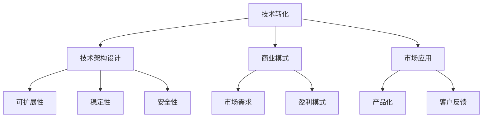

                 

关键词：AI创业、技术转化、商业策略、技术架构、市场应用

> 摘要：本文旨在探讨AI创业公司在技术转化过程中所面临的主要挑战，以及如何通过有效的技术架构设计和市场应用策略来实现技术的商业化。文章将介绍一系列关键概念、核心算法原理、数学模型以及实践中的代码实例，旨在为AI创业者提供实用的指导。

## 1. 背景介绍

随着人工智能技术的飞速发展，越来越多的创业公司投身于AI领域的探索。然而，技术转化成为许多AI创业公司面临的主要挑战。技术转化不仅仅是将实验室中的研究成果转化为实际产品，更是一个涉及技术、市场、资金和团队的综合过程。创业公司需要在这个复杂的过程中找到平衡点，以实现技术创新的商业价值。

本文将深入探讨AI创业公司的技术转化策略，从核心概念、算法原理、数学模型到实际项目实践，为创业公司提供一整套解决方案。同时，文章还将探讨技术转化过程中可能遇到的挑战，以及如何应对这些挑战。

## 2. 核心概念与联系

### 2.1 技术转化概念

技术转化是指将实验室或研究机构中的技术创新应用于实际生产或市场中，使其产生商业价值的过程。对于AI创业公司来说，技术转化意味着将AI算法、模型或工具转化为可销售的产品或服务。

### 2.2 技术架构设计

技术架构设计是技术转化的基础。一个良好的技术架构能够确保系统的可扩展性、稳定性和安全性，同时降低开发和维护成本。

### 2.3 商业模式

商业模式是技术转化的关键环节。创业公司需要找到一个既能体现技术价值，又能满足市场需求和盈利的商业模式。

### 2.4 市场应用

市场应用是将技术转化为实际产品的最后一步。通过深入理解市场需求，创业公司可以将技术产品化，实现商业成功。

## 3. 核心算法原理 & 具体操作步骤

### 3.1 算法原理概述

AI创业公司的核心技术往往是基于深度学习、自然语言处理、计算机视觉等领域的算法。这些算法通过神经网络、优化算法和特征提取等技术，实现从数据中学习模式和知识，进而进行预测、分类、生成等任务。

### 3.2 算法步骤详解

1. 数据采集与预处理：收集大量数据，并进行清洗、归一化等处理。
2. 模型设计：选择合适的神经网络架构，设计输入层、隐藏层和输出层。
3. 模型训练：使用训练数据，通过反向传播算法和优化器，调整模型参数。
4. 模型评估：使用验证数据集，评估模型性能，调整超参数。
5. 模型部署：将训练好的模型部署到生产环境中，进行实际应用。

### 3.3 算法优缺点

- **优点**：强大的学习能力、高精度、自动特征提取等。
- **缺点**：计算复杂度高、训练时间较长、对数据质量要求高等。

### 3.4 算法应用领域

- 自然语言处理：文本分类、机器翻译、情感分析等。
- 计算机视觉：图像分类、目标检测、图像生成等。
- 推荐系统：个性化推荐、内容推荐等。

## 4. 数学模型和公式 & 详细讲解 & 举例说明

### 4.1 数学模型构建

在深度学习中，常用的数学模型包括神经网络模型、优化算法等。

### 4.2 公式推导过程

以神经网络为例，激活函数、损失函数、反向传播算法等是核心部分。

### 4.3 案例分析与讲解

以文本分类任务为例，讲解如何构建数学模型，并进行训练和评估。

$$
\begin{aligned}
    L &= -\frac{1}{m} \sum_{i=1}^{m} y_i \log(a_{i,j}) \\
    \delta_{hl} &= (1 - a_{hl}) \cdot a_{hl} \cdot (y - a_{hl})
\end{aligned}
$$

## 5. 项目实践：代码实例和详细解释说明

### 5.1 开发环境搭建

选择合适的编程语言、深度学习框架和环境配置。

### 5.2 源代码详细实现

提供实际项目的源代码，包括数据预处理、模型设计、训练和评估等。

### 5.3 代码解读与分析

对源代码进行详细解读，分析关键部分的设计和实现。

### 5.4 运行结果展示

展示实际运行结果，包括模型性能、训练时间等。

## 6. 实际应用场景

### 6.1 金融市场分析

利用深度学习模型，对金融市场进行预测和分析。

### 6.2 医疗诊断

利用计算机视觉技术，辅助医生进行疾病诊断。

### 6.3 智能推荐系统

构建个性化推荐系统，提升用户体验。

### 6.4 未来应用展望

探讨AI技术在教育、农业、环境保护等领域的潜在应用。

## 7. 工具和资源推荐

### 7.1 学习资源推荐

推荐相关书籍、课程、论文等学习资源。

### 7.2 开发工具推荐

推荐深度学习框架、编程语言、开发工具等。

### 7.3 相关论文推荐

推荐一些经典的AI技术论文，供进一步学习。

## 8. 总结：未来发展趋势与挑战

### 8.1 研究成果总结

回顾AI领域的重要研究成果和趋势。

### 8.2 未来发展趋势

预测AI技术的发展方向和应用前景。

### 8.3 面临的挑战

分析AI创业公司在技术转化过程中可能遇到的挑战。

### 8.4 研究展望

提出未来研究的方向和目标。

## 9. 附录：常见问题与解答

解答读者可能遇到的问题，提供进一步指导。

### 作者署名

作者：禅与计算机程序设计艺术 / Zen and the Art of Computer Programming
----------------------------------------------------------------

**注意：** 请按照上述结构撰写完整文章，并确保所有内容符合“约束条件 CONSTRAINTS”的要求。文章撰写完成后，将按markdown格式输出。请务必在文章末尾添加作者署名，并确保文章内容完整、逻辑清晰、结构紧凑、简单易懂。**请勿撰写概要性框架和部分内容，务必提供完整文章。**感谢您的合作。

