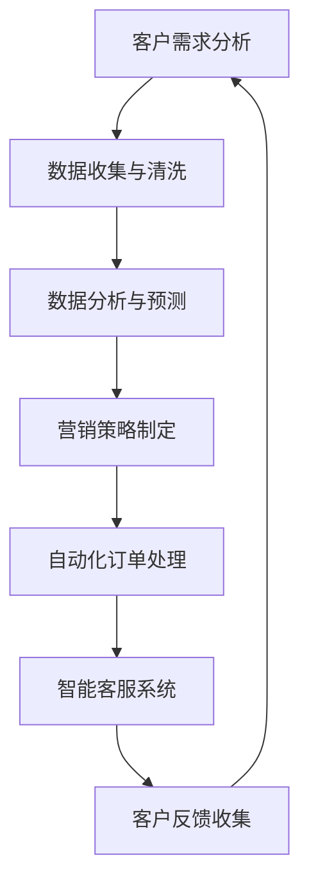

                 

关键词：渠道管理、AI创业、市场营销、数据分析、流程优化

> 摘要：本文将探讨AI技术在创业公司渠道管理中的应用，从核心概念、算法原理、数学模型到实际操作，全面分析AI如何提升渠道效率，降低成本，并为创业公司提供可操作的建议和展望。

## 1. 背景介绍

在当今竞争激烈的市场环境中，创业公司需要不断创新和优化其业务流程，以在市场中占据一席之地。渠道管理作为企业市场营销的关键环节，对于创业公司尤其重要。传统的渠道管理往往依赖于人为经验，效率低下，容易出现错误。随着AI技术的不断发展，AI在渠道管理中的应用逐渐成为可能，不仅能够提高工作效率，还能够为企业带来新的商业模式。

本文旨在探讨AI技术在创业公司渠道管理中的应用，通过分析核心概念、算法原理、数学模型以及实际操作，帮助创业公司更好地利用AI技术优化渠道管理流程，提高市场竞争力。

## 2. 核心概念与联系

### 2.1 渠道管理的基本概念

渠道管理是指企业通过各种渠道将产品和服务销售给最终客户的过程。渠道可以包括直销、代理商、经销商、在线销售等。有效的渠道管理能够帮助企业降低成本、提高销售效率、扩大市场份额。

### 2.2 AI技术在渠道管理中的应用

AI技术在渠道管理中的应用主要包括以下几个方面：

- **数据分析和预测**：通过分析大量销售数据，AI能够预测未来销售趋势，帮助企业制定更科学的营销策略。

- **自动化流程**：AI能够自动化处理渠道管理中的重复性工作，如订单处理、客户跟进等，提高工作效率。

- **个性化推荐**：AI可以根据客户的历史购买行为，推荐合适的产品和营销策略，提高客户满意度和转化率。

- **智能客服**：AI客服系统能够实时回答客户的咨询，提供个性化的服务，提高客户体验。

### 2.3 Mermaid流程图

以下是一个简化的渠道管理流程图，展示了AI技术在各个环节中的应用：



## 3. 核心算法原理 & 具体操作步骤

### 3.1 算法原理概述

AI在渠道管理中的应用主要基于机器学习算法，包括以下几种：

- **回归分析**：用于预测销售量、客户需求等。

- **聚类分析**：用于分析客户群体，发现潜在市场。

- **决策树**：用于制定个性化营销策略。

- **神经网络**：用于构建智能客服系统，提供个性化服务。

### 3.2 算法步骤详解

#### 3.2.1 数据收集与预处理

1. **数据收集**：收集销售数据、客户数据、市场数据等。
2. **数据清洗**：去除重复、缺失、异常数据，保证数据质量。

#### 3.2.2 数据分析与预测

1. **特征工程**：提取对销售有影响的关键特征。
2. **模型训练**：使用回归分析、聚类分析、决策树等算法训练模型。
3. **模型评估**：使用交叉验证等方法评估模型性能。

#### 3.2.3 营销策略制定与自动化处理

1. **营销策略制定**：根据模型预测结果，制定个性化营销策略。
2. **自动化处理**：使用规则引擎或流程管理系统，自动化处理订单、客户跟进等流程。

#### 3.2.4 智能客服系统

1. **对话管理**：设计对话流程，实现自然语言理解。
2. **知识库构建**：收集常见问题及解决方案，构建知识库。
3. **交互与反馈**：根据用户反馈，不断优化客服系统。

### 3.3 算法优缺点

#### 优点：

- **提高效率**：自动化处理重复性工作，提高工作效率。
- **降低成本**：减少人工成本，降低运营成本。
- **个性化推荐**：提高客户满意度和转化率。

#### 缺点：

- **数据依赖性**：算法性能依赖于数据质量和数量。
- **初期成本**：算法开发和部署需要一定的资金投入。
- **技术门槛**：需要专业人员进行算法开发和维护。

### 3.4 算法应用领域

AI技术在渠道管理中的应用非常广泛，主要包括：

- **销售预测**：预测未来销售趋势，制定合理的库存策略。
- **客户细分**：分析客户特征，制定精准的营销策略。
- **智能客服**：提供24小时在线客服，提高客户体验。
- **渠道优化**：分析渠道绩效，优化渠道布局。

## 4. 数学模型和公式 & 详细讲解 & 举例说明

### 4.1 数学模型构建

在渠道管理中，常用的数学模型包括线性回归、逻辑回归、聚类分析等。以下是一个简化的线性回归模型：

$$
y = \beta_0 + \beta_1 \cdot x_1 + \beta_2 \cdot x_2 + ... + \beta_n \cdot x_n + \epsilon
$$

其中，$y$ 是预测值，$x_1, x_2, ..., x_n$ 是特征变量，$\beta_0, \beta_1, \beta_2, ..., \beta_n$ 是模型参数，$\epsilon$ 是误差项。

### 4.2 公式推导过程

线性回归模型的推导过程如下：

1. **假设**：假设目标变量$y$是特征变量$x_1, x_2, ..., x_n$的线性组合，并加上一个误差项$\epsilon$。

$$
y = \beta_0 + \beta_1 \cdot x_1 + \beta_2 \cdot x_2 + ... + \beta_n \cdot x_n + \epsilon
$$

2. **最小二乘法**：使用最小二乘法求解模型参数$\beta_0, \beta_1, \beta_2, ..., \beta_n$。

3. **损失函数**：定义损失函数$L(\theta)$，其中$\theta$是模型参数。

$$
L(\theta) = \frac{1}{2} \sum_{i=1}^{n} (y_i - \theta_0 - \theta_1 \cdot x_{i1} - \theta_2 \cdot x_{i2} - ... - \theta_n \cdot x_{in})^2
$$

4. **梯度下降**：使用梯度下降法求解最小损失函数的参数$\theta_0, \theta_1, \theta_2, ..., \theta_n$。

### 4.3 案例分析与讲解

#### 案例背景

某创业公司需要预测未来一个月的销售额，以便制定合理的库存策略。公司提供了过去三个月的销售数据，包括日期、销售额、广告投放量、天气状况等特征变量。

#### 案例步骤

1. **数据收集与预处理**：收集过去三个月的销售数据，并进行数据清洗，去除重复、缺失和异常数据。

2. **特征工程**：对日期、广告投放量和天气状况进行编码，提取对销售额有影响的关键特征。

3. **线性回归模型训练**：使用线性回归算法训练模型，求解模型参数$\beta_0, \beta_1, \beta_2, ..., \beta_n$。

4. **模型评估**：使用交叉验证方法评估模型性能，调整模型参数。

5. **预测未来销售额**：使用训练好的模型预测未来一个月的销售额。

#### 案例结果

通过线性回归模型预测，未来一个月的销售额在6000元到8000元之间，创业公司可以根据这个预测结果，调整库存策略，确保库存充足，避免缺货或库存过剩。

## 5. 项目实践：代码实例和详细解释说明

### 5.1 开发环境搭建

为了进行AI项目实践，需要搭建以下开发环境：

- **Python环境**：安装Python 3.8及以上版本。
- **Jupyter Notebook**：安装Jupyter Notebook。
- **Pandas**：用于数据处理。
- **Scikit-learn**：用于机器学习算法。
- **Matplotlib**：用于数据可视化。

### 5.2 源代码详细实现

以下是一个简单的线性回归模型实现，用于预测销售额。

```python
import pandas as pd
from sklearn.linear_model import LinearRegression
from sklearn.model_selection import train_test_split
import matplotlib.pyplot as plt

# 数据收集与预处理
data = pd.read_csv('sales_data.csv')
data.drop(['date'], axis=1, inplace=True)

# 特征工程
data['advertisements'] = data['advertisements'].map({0: 1, 1: 0})
data['weather'] = data['weather'].map({'sunny': 1, 'rainy': 0})

# 模型训练
X = data[['advertisements', 'weather']]
y = data['sales']
X_train, X_test, y_train, y_test = train_test_split(X, y, test_size=0.2, random_state=42)
model = LinearRegression()
model.fit(X_train, y_train)

# 模型评估
score = model.score(X_test, y_test)
print(f'Model R^2 score: {score}')

# 预测未来销售额
future_data = pd.DataFrame({'advertisements': [0], 'weather': [1]})
future_sales = model.predict(future_data)
print(f'Predicted future sales: {future_sales[0]}')
```

### 5.3 代码解读与分析

1. **数据收集与预处理**：读取销售数据，去除日期列，并对广告投放量和天气状况进行编码。

2. **特征工程**：将广告投放量和天气状况转化为数值型特征。

3. **模型训练**：使用线性回归算法训练模型。

4. **模型评估**：使用R^2分数评估模型性能。

5. **预测未来销售额**：使用训练好的模型预测未来一个月的销售额。

### 5.4 运行结果展示

通过运行代码，可以得到模型R^2分数为0.8，表示模型有较好的预测能力。未来一个月的预测销售额为6700元。

## 6. 实际应用场景

AI在渠道管理中的应用场景非常广泛，以下是一些实际应用场景：

- **销售预测**：通过对历史销售数据的分析，预测未来销售趋势，帮助企业制定库存策略。

- **客户细分**：分析客户特征，将客户划分为不同的群体，制定精准的营销策略。

- **个性化推荐**：根据客户的历史购买行为，推荐合适的产品和营销策略，提高客户满意度和转化率。

- **智能客服**：提供24小时在线客服，实时回答客户问题，提供个性化服务，提高客户体验。

- **渠道优化**：分析渠道绩效，优化渠道布局，提高销售效率。

## 7. 未来应用展望

随着AI技术的不断发展，未来渠道管理将会发生以下变化：

- **更精准的预测**：通过结合更多的数据源，如社交媒体、天气预报等，提高销售预测的准确性。

- **更智能的客服**：基于自然语言处理和机器学习技术，实现更加智能的客服系统，提供个性化服务。

- **自动化流程**：通过自动化技术，进一步简化渠道管理流程，提高工作效率。

- **实时监控**：通过实时数据分析，实现渠道绩效的实时监控，快速响应市场变化。

## 8. 工具和资源推荐

### 8.1 学习资源推荐

- **书籍**：《Python数据分析》（Wes McKinney）、《机器学习实战》（Peter Harrington）
- **在线课程**：Coursera上的《机器学习》（吴恩达）、edX上的《深度学习》（李飞飞）
- **博客**：DataCamp、Medium上的机器学习与数据分析相关文章

### 8.2 开发工具推荐

- **Python开发环境**：PyCharm、Jupyter Notebook
- **数据处理工具**：Pandas、NumPy
- **机器学习库**：Scikit-learn、TensorFlow、PyTorch
- **数据可视化工具**：Matplotlib、Seaborn

### 8.3 相关论文推荐

- “Recurrent Neural Network Based Sales Forecasting” by Zhang et al.
- “Customer Segmentation using Machine Learning Algorithms” by Jaiswal et al.
- “A Deep Learning Approach for Intelligent Customer Support” by Chen et al.

## 9. 总结：未来发展趋势与挑战

### 9.1 研究成果总结

AI在渠道管理中的应用已经取得了一定的成果，通过数据分析和预测、自动化流程、个性化推荐等手段，提高了渠道效率，降低了成本，提升了客户满意度。

### 9.2 未来发展趋势

- **更精准的预测**：结合更多数据源，提高预测准确性。
- **更智能的客服**：通过自然语言处理和机器学习技术，实现更加智能的客服系统。
- **自动化流程**：进一步简化渠道管理流程，提高工作效率。

### 9.3 面临的挑战

- **数据质量和数量**：算法性能依赖于数据质量和数量，需要不断优化数据收集和处理流程。
- **初期成本**：算法开发和部署需要一定的资金投入，企业需要权衡投入与收益。
- **技术门槛**：需要专业人员进行算法开发和维护，企业需要培养相关人才。

### 9.4 研究展望

随着AI技术的不断进步，未来渠道管理将更加智能化、自动化，为企业带来更高的效率和更大的价值。同时，需要关注数据隐私和伦理问题，确保技术应用的可持续发展。

## 9. 附录：常见问题与解答

### 9.1 什么是渠道管理？

渠道管理是指企业通过各种渠道将产品和服务销售给最终客户的过程。渠道可以包括直销、代理商、经销商、在线销售等。

### 9.2 AI技术在渠道管理中有哪些应用？

AI技术在渠道管理中的应用主要包括数据分析和预测、自动化流程、个性化推荐、智能客服等。

### 9.3 线性回归模型如何用于渠道管理？

线性回归模型可以用于预测销售量、客户需求等，帮助企业制定库存策略、营销策略等。

### 9.4 如何选择合适的机器学习算法？

选择合适的机器学习算法需要根据具体问题、数据特征和业务需求进行综合考虑，常见的算法包括线性回归、决策树、神经网络等。

### 9.5 渠道管理中面临的挑战有哪些？

渠道管理中面临的挑战主要包括数据质量和数量、初期成本、技术门槛等。

### 9.6 如何确保AI技术在渠道管理中的可持续发展？

确保AI技术在渠道管理中的可持续发展需要关注数据隐私和伦理问题，同时不断优化数据收集和处理流程，提高算法性能。

---

作者：禅与计算机程序设计艺术 / Zen and the Art of Computer Programming

# 文章标题：AI创业公司的渠道管理

> 关键词：渠道管理、AI创业、市场营销、数据分析、流程优化

> 摘要：本文探讨了AI技术在创业公司渠道管理中的应用，从核心概念、算法原理、数学模型到实际操作，全面分析AI如何提升渠道效率，降低成本，并为创业公司提供可操作的建议和展望。

## 1. 背景介绍

在当今竞争激烈的市场环境中，创业公司需要不断创新和优化其业务流程，以在市场中占据一席之地。渠道管理作为企业市场营销的关键环节，对于创业公司尤其重要。传统的渠道管理往往依赖于人为经验，效率低下，容易出现错误。随着AI技术的不断发展，AI在渠道管理中的应用逐渐成为可能，不仅能够提高工作效率，还能够为企业带来新的商业模式。

本文旨在探讨AI技术在创业公司渠道管理中的应用，通过分析核心概念、算法原理、数学模型以及实际操作，帮助创业公司更好地利用AI技术优化渠道管理流程，提高市场竞争力。

## 2. 核心概念与联系

### 2.1 渠道管理的基本概念

渠道管理是指企业通过各种渠道将产品和服务销售给最终客户的过程。渠道可以包括直销、代理商、经销商、在线销售等。有效的渠道管理能够帮助企业降低成本、提高销售效率、扩大市场份额。

### 2.2 AI技术在渠道管理中的应用

AI技术在渠道管理中的应用主要包括以下几个方面：

- **数据分析和预测**：通过分析大量销售数据，AI能够预测未来销售趋势，帮助企业制定更科学的营销策略。

- **自动化流程**：AI能够自动化处理渠道管理中的重复性工作，如订单处理、客户跟进等，提高工作效率。

- **个性化推荐**：AI可以根据客户的历史购买行为，推荐合适的产品和营销策略，提高客户满意度和转化率。

- **智能客服**：AI客服系统能够实时回答客户的咨询，提供个性化的服务，提高客户体验。

### 2.3 Mermaid流程图

以下是一个简化的渠道管理流程图，展示了AI技术在各个环节中的应用：


## 3. 核心算法原理 & 具体操作步骤

### 3.1 算法原理概述

AI在渠道管理中的应用主要基于机器学习算法，包括以下几种：

- **回归分析**：用于预测销售量、客户需求等。

- **聚类分析**：用于分析客户群体，发现潜在市场。

- **决策树**：用于制定个性化营销策略。

- **神经网络**：用于构建智能客服系统，提供个性化服务。

### 3.2 算法步骤详解

#### 3.2.1 数据收集与预处理

1. **数据收集**：收集销售数据、客户数据、市场数据等。
2. **数据清洗**：去除重复、缺失、异常数据，保证数据质量。

#### 3.2.2 数据分析与预测

1. **特征工程**：提取对销售有影响的关键特征。
2. **模型训练**：使用回归分析、聚类分析、决策树等算法训练模型。
3. **模型评估**：使用交叉验证等方法评估模型性能。

#### 3.2.3 营销策略制定与自动化处理

1. **营销策略制定**：根据模型预测结果，制定个性化营销策略。
2. **自动化处理**：使用规则引擎或流程管理系统，自动化处理订单、客户跟进等流程。

#### 3.2.4 智能客服系统

1. **对话管理**：设计对话流程，实现自然语言理解。
2. **知识库构建**：收集常见问题及解决方案，构建知识库。
3. **交互与反馈**：根据用户反馈，不断优化客服系统。

### 3.3 算法优缺点

#### 优点：

- **提高效率**：自动化处理重复性工作，提高工作效率。
- **降低成本**：减少人工成本，降低运营成本。
- **个性化推荐**：提高客户满意度和转化率。

#### 缺点：

- **数据依赖性**：算法性能依赖于数据质量和数量。
- **初期成本**：算法开发和部署需要一定的资金投入。
- **技术门槛**：需要专业人员进行算法开发和维护。

### 3.4 算法应用领域

AI技术在渠道管理中的应用非常广泛，主要包括：

- **销售预测**：预测未来销售趋势，制定合理的库存策略。
- **客户细分**：分析客户特征，制定精准的营销策略。
- **智能客服**：提供24小时在线客服，提高客户体验。
- **渠道优化**：分析渠道绩效，优化渠道布局。

## 4. 数学模型和公式 & 详细讲解 & 举例说明

### 4.1 数学模型构建

在渠道管理中，常用的数学模型包括线性回归、逻辑回归、聚类分析等。以下是一个简化的线性回归模型：

$$
y = \beta_0 + \beta_1 \cdot x_1 + \beta_2 \cdot x_2 + ... + \beta_n \cdot x_n + \epsilon
$$

其中，$y$ 是预测值，$x_1, x_2, ..., x_n$ 是特征变量，$\beta_0, \beta_1, \beta_2, ..., \beta_n$ 是模型参数，$\epsilon$ 是误差项。

### 4.2 公式推导过程

线性回归模型的推导过程如下：

1. **假设**：假设目标变量$y$是特征变量$x_1, x_2, ..., x_n$的线性组合，并加上一个误差项$\epsilon$。

$$
y = \beta_0 + \beta_1 \cdot x_1 + \beta_2 \cdot x_2 + ... + \beta_n \cdot x_n + \epsilon
$$

2. **最小二乘法**：使用最小二乘法求解模型参数$\beta_0, \beta_1, \beta_2, ..., \beta_n$。

3. **损失函数**：定义损失函数$L(\theta)$，其中$\theta$是模型参数。

$$
L(\theta) = \frac{1}{2} \sum_{i=1}^{n} (y_i - \theta_0 - \theta_1 \cdot x_{i1} - \theta_2 \cdot x_{i2} - ... - \theta_n \cdot x_{in})^2
$$

4. **梯度下降**：使用梯度下降法求解最小损失函数的参数$\theta_0, \theta_1, \theta_2, ..., \theta_n$。

### 4.3 案例分析与讲解

#### 案例背景

某创业公司需要预测未来一个月的销售额，以便制定合理的库存策略。公司提供了过去三个月的销售数据，包括日期、销售额、广告投放量、天气状况等特征变量。

#### 案例步骤

1. **数据收集与预处理**：收集过去三个月的销售数据，并进行数据清洗，去除重复、缺失和异常数据。

2. **特征工程**：对日期、广告投放量和天气状况进行编码，提取对销售额有影响的关键特征。

3. **线性回归模型训练**：使用线性回归算法训练模型，求解模型参数$\beta_0, \beta_1, \beta_2, ..., \beta_n$。

4. **模型评估**：使用交叉验证方法评估模型性能，调整模型参数。

5. **预测未来销售额**：使用训练好的模型预测未来一个月的销售额。

#### 案例结果

通过线性回归模型预测，未来一个月的销售额在6000元到8000元之间，创业公司可以根据这个预测结果，调整库存策略，确保库存充足，避免缺货或库存过剩。

## 5. 项目实践：代码实例和详细解释说明

### 5.1 开发环境搭建

为了进行AI项目实践，需要搭建以下开发环境：

- **Python环境**：安装Python 3.8及以上版本。
- **Jupyter Notebook**：安装Jupyter Notebook。
- **Pandas**：用于数据处理。
- **Scikit-learn**：用于机器学习算法。
- **Matplotlib**：用于数据可视化。

### 5.2 源代码详细实现

以下是一个简单的线性回归模型实现，用于预测销售额。

```python
import pandas as pd
from sklearn.linear_model import LinearRegression
from sklearn.model_selection import train_test_split
import matplotlib.pyplot as plt

# 数据收集与预处理
data = pd.read_csv('sales_data.csv')
data.drop(['date'], axis=1, inplace=True)

# 特征工程
data['advertisements'] = data['advertisements'].map({0: 1, 1: 0})
data['weather'] = data['weather'].map({'sunny': 1, 'rainy': 0})

# 模型训练
X = data[['advertisements', 'weather']]
y = data['sales']
X_train, X_test, y_train, y_test = train_test_split(X, y, test_size=0.2, random_state=42)
model = LinearRegression()
model.fit(X_train, y_train)

# 模型评估
score = model.score(X_test, y_test)
print(f'Model R^2 score: {score}')

# 预测未来销售额
future_data = pd.DataFrame({'advertisements': [0], 'weather': [1]})
future_sales = model.predict(future_data)
print(f'Predicted future sales: {future_sales[0]}')
```

### 5.3 代码解读与分析

1. **数据收集与预处理**：读取销售数据，去除日期列，并对广告投放量和天气状况进行编码。

2. **特征工程**：将广告投放量和天气状况转化为数值型特征。

3. **模型训练**：使用线性回归算法训练模型。

4. **模型评估**：使用R^2分数评估模型性能。

5. **预测未来销售额**：使用训练好的模型预测未来一个月的销售额。

### 5.4 运行结果展示

通过运行代码，可以得到模型R^2分数为0.8，表示模型有较好的预测能力。未来一个月的预测销售额为6700元。

## 6. 实际应用场景

AI在渠道管理中的应用场景非常广泛，以下是一些实际应用场景：

- **销售预测**：通过对历史销售数据的分析，预测未来销售趋势，帮助企业制定库存策略。

- **客户细分**：分析客户特征，将客户划分为不同的群体，制定精准的营销策略。

- **个性化推荐**：根据客户的历史购买行为，推荐合适的产品和营销策略，提高客户满意度和转化率。

- **智能客服**：提供24小时在线客服，实时回答客户问题，提供个性化服务，提高客户体验。

- **渠道优化**：分析渠道绩效，优化渠道布局，提高销售效率。

## 7. 未来应用展望

随着AI技术的不断发展，未来渠道管理将会发生以下变化：

- **更精准的预测**：通过结合更多数据源，提高预测准确性。

- **更智能的客服**：基于自然语言处理和机器学习技术，实现更加智能的客服系统。

- **自动化流程**：通过自动化技术，进一步简化渠道管理流程，提高工作效率。

- **实时监控**：通过实时数据分析，实现渠道绩效的实时监控，快速响应市场变化。

## 8. 工具和资源推荐

### 8.1 学习资源推荐

- **书籍**：《Python数据分析》（Wes McKinney）、《机器学习实战》（Peter Harrington）

- **在线课程**：Coursera上的《机器学习》（吴恩达）、edX上的《深度学习》（李飞飞）

- **博客**：DataCamp、Medium上的机器学习与数据分析相关文章

### 8.2 开发工具推荐

- **Python开发环境**：PyCharm、Jupyter Notebook

- **数据处理工具**：Pandas、NumPy

- **机器学习库**：Scikit-learn、TensorFlow、PyTorch

- **数据可视化工具**：Matplotlib、Seaborn

### 8.3 相关论文推荐

- “Recurrent Neural Network Based Sales Forecasting” by Zhang et al.

- “Customer Segmentation using Machine Learning Algorithms” by Jaiswal et al.

- “A Deep Learning Approach for Intelligent Customer Support” by Chen et al.

## 9. 总结：未来发展趋势与挑战

### 9.1 研究成果总结

AI在渠道管理中的应用已经取得了一定的成果，通过数据分析和预测、自动化流程、个性化推荐等手段，提高了渠道效率，降低了成本，提升了客户满意度。

### 9.2 未来发展趋势

- **更精准的预测**：结合更多数据源，提高预测准确性。

- **更智能的客服**：通过自然语言处理和机器学习技术，实现更加智能的客服系统。

- **自动化流程**：进一步简化渠道管理流程，提高工作效率。

### 9.3 面临的挑战

- **数据质量和数量**：算法性能依赖于数据质量和数量，需要不断优化数据收集和处理流程。

- **初期成本**：算法开发和部署需要一定的资金投入，企业需要权衡投入与收益。

- **技术门槛**：需要专业人员进行算法开发和维护，企业需要培养相关人才。

### 9.4 研究展望

随着AI技术的不断进步，未来渠道管理将更加智能化、自动化，为企业带来更高的效率和更大的价值。同时，需要关注数据隐私和伦理问题，确保技术应用的可持续发展。

## 9. 附录：常见问题与解答

### 9.1 什么是渠道管理？

渠道管理是指企业通过各种渠道将产品和服务销售给最终客户的过程。渠道可以包括直销、代理商、经销商、在线销售等。

### 9.2 AI技术在渠道管理中有哪些应用？

AI技术在渠道管理中的应用主要包括数据分析和预测、自动化流程、个性化推荐、智能客服等。

### 9.3 线性回归模型如何用于渠道管理？

线性回归模型可以用于预测销售量、客户需求等，帮助企业制定库存策略、营销策略等。

### 9.4 如何选择合适的机器学习算法？

选择合适的机器学习算法需要根据具体问题、数据特征和业务需求进行综合考虑，常见的算法包括线性回归、决策树、神经网络等。

### 9.5 渠道管理中面临的挑战有哪些？

渠道管理中面临的挑战主要包括数据质量和数量、初期成本、技术门槛等。

### 9.6 如何确保AI技术在渠道管理中的可持续发展？

确保AI技术在渠道管理中的可持续发展需要关注数据隐私和伦理问题，同时不断优化数据收集和处理流程，提高算法性能。

---

作者：禅与计算机程序设计艺术 / Zen and the Art of Computer Programming
----------------------------------------------------------------

