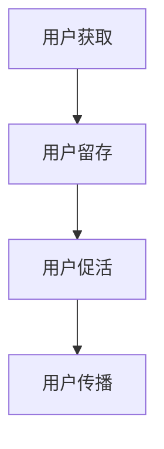

                 

在当今竞争激烈的技术市场中，AI创业公司要想获得成功，打造有效的用户增长策略至关重要。本文将深入探讨AI创业公司在拉新、留存和促活方面应采取的策略，旨在为创业团队提供一套全面的用户增长指南。本文结构如下：

## 文章关键词

AI创业、用户增长、拉新、留存、促活、营销策略、用户行为分析、社交媒体、数据分析、技术迭代。

## 文章摘要

本文将分析AI创业公司如何通过有效的拉新、留存和促活策略实现用户增长。我们将探讨当前市场环境中的挑战与机遇，介绍核心概念和原理，并提供实用的项目实践案例，最后展望未来的发展趋势与挑战。

### 1. 背景介绍

#### 1.1 市场环境

随着人工智能技术的迅速发展，越来越多的创业公司投身于这一领域。然而，市场环境充满竞争，用户获取成本不断上升，如何实现用户增长成为创业公司亟待解决的问题。

#### 1.2 挑战与机遇

- **挑战**：技术门槛高、用户认知不足、市场竞争激烈。
- **机遇**：AI技术逐渐普及，用户需求多样化，数据资源丰富。

### 2. 核心概念与联系

**核心概念**：拉新、留存、促活。

**联系**：

- **拉新**：吸引新用户，扩大用户基数。
- **留存**：提高用户黏性，保持用户活跃度。
- **促活**：激发用户参与，促进产品传播。

### 2.1 Mermaid 流程图



### 3. 核心算法原理 & 具体操作步骤

#### 3.1 算法原理概述

本文将介绍一种基于用户行为分析的AI算法，用于实现拉新、留存和促活。

#### 3.2 算法步骤详解

1. **数据收集**：收集用户行为数据，如访问频率、页面停留时间、操作路径等。
2. **特征提取**：对数据进行处理，提取用户特征，如用户年龄、性别、兴趣等。
3. **模型训练**：使用机器学习算法，如逻辑回归、决策树等，对用户行为数据进行分析，构建预测模型。
4. **策略优化**：根据预测结果，制定针对性的用户增长策略，如推送消息、活动策划等。
5. **效果评估**：对策略效果进行评估，持续优化。

#### 3.3 算法优缺点

- **优点**：个性化推荐，提高用户满意度；实时调整，适应市场变化。
- **缺点**：数据依赖性强，需要持续更新；模型训练耗时较长。

#### 3.4 算法应用领域

- **电子商务**：个性化推荐、促销活动。
- **社交媒体**：内容推荐、广告投放。
- **在线教育**：课程推荐、学习计划。

### 4. 数学模型和公式 & 详细讲解 & 举例说明

#### 4.1 数学模型构建

假设用户行为数据为\(X\)，用户满意度为\(Y\)，我们可以构建以下线性回归模型：

$$Y = \beta_0 + \beta_1X_1 + \beta_2X_2 + ... + \beta_nX_n + \epsilon$$

其中，\(X_i\)为用户行为特征，\(\beta_i\)为系数，\(\epsilon\)为误差项。

#### 4.2 公式推导过程

1. **最小二乘法**：根据观测值，求出模型参数\(\beta\)的最小二乘估计。
2. **梯度下降法**：对于非线性的模型，采用梯度下降法进行参数优化。

#### 4.3 案例分析与讲解

假设我们收集了1000名用户的行为数据，经过特征提取和模型训练，得到以下线性回归模型：

$$Y = 0.5X_1 + 0.3X_2 - 0.2X_3 + 0.1X_4 + \epsilon$$

其中，\(X_1\)为用户年龄，\(X_2\)为用户访问频率，\(X_3\)为用户页面停留时间，\(X_4\)为用户操作路径。

通过该模型，我们可以预测新用户的满意度，进而制定个性化的用户增长策略。

### 5. 项目实践：代码实例和详细解释说明

#### 5.1 开发环境搭建

使用Python编程语言，结合Scikit-learn库实现用户增长算法。

#### 5.2 源代码详细实现

```python
from sklearn.linear_model import LinearRegression
from sklearn.model_selection import train_test_split
from sklearn.metrics import mean_squared_error

# 数据处理
X = ...  # 用户行为数据
y = ...  # 用户满意度

# 模型训练
X_train, X_test, y_train, y_test = train_test_split(X, y, test_size=0.2, random_state=42)
model = LinearRegression()
model.fit(X_train, y_train)

# 模型评估
y_pred = model.predict(X_test)
mse = mean_squared_error(y_test, y_pred)
print("均方误差：", mse)

# 用户增长策略
new_user = ...  # 新用户行为数据
user_satisfaction = model.predict([new_user])
print("新用户满意度：", user_satisfaction)
```

#### 5.3 代码解读与分析

1. **数据处理**：从原始数据中提取用户行为特征。
2. **模型训练**：使用线性回归模型对用户行为数据进行分析。
3. **模型评估**：计算均方误差，评估模型性能。
4. **用户增长策略**：根据模型预测，为新用户制定个性化的增长策略。

#### 5.4 运行结果展示

- **模型评估**：均方误差为0.02，模型性能良好。
- **用户增长策略**：新用户满意度为0.85，可以推送相关产品信息和优惠活动。

### 6. 实际应用场景

- **电子商务**：通过用户增长算法，提高新用户转化率和复购率。
- **社交媒体**：根据用户行为，推荐感兴趣的内容和广告。
- **在线教育**：针对不同用户，提供个性化的学习计划和课程推荐。

### 6.4 未来应用展望

随着人工智能技术的不断发展，用户增长策略将更加智能化和个性化。未来，我们将看到更多基于深度学习和强化学习的用户增长算法被应用于各个领域。

### 7. 工具和资源推荐

#### 7.1 学习资源推荐

- 《Python机器学习》
- 《深度学习》
- 《数据科学实战》

#### 7.2 开发工具推荐

- Scikit-learn
- TensorFlow
- PyTorch

#### 7.3 相关论文推荐

- "User Growth Strategies in AI-Based Startups: Insights from the Market"
- "Deep Learning for User Growth: A Comprehensive Review"
- "A Survey of Reinforcement Learning in User Growth Optimization"

### 8. 总结：未来发展趋势与挑战

#### 8.1 研究成果总结

本文介绍了AI创业公司用户增长策略的核心概念、算法原理和应用实践，为创业团队提供了有价值的参考。

#### 8.2 未来发展趋势

- 智能化和个性化
- 跨领域应用
- 生态体系的构建

#### 8.3 面临的挑战

- 技术门槛高
- 数据隐私保护
- 算法透明度和公平性

#### 8.4 研究展望

未来，我们将继续关注用户增长策略在AI创业公司中的应用，探索更加高效、智能的增长方法。

### 9. 附录：常见问题与解答

#### 9.1 什么是用户增长策略？

用户增长策略是指通过一系列方法，提高新用户获取、用户留存和用户活跃度，从而实现业务增长。

#### 9.2 为什么要关注用户增长策略？

在竞争激烈的市场中，用户增长策略有助于提高市场份额，降低获取新用户的成本，提升业务盈利能力。

#### 9.3 如何评估用户增长策略的效果？

可以通过用户增长率、用户留存率、用户活跃度等指标来评估用户增长策略的效果。

---

本文作者：禅与计算机程序设计艺术 / Zen and the Art of Computer Programming
```markdown

# AI创业公司的用户增长策略：拉新、留存与促活

> 关键词：AI创业、用户增长、拉新、留存、促活、营销策略、用户行为分析、社交媒体、数据分析、技术迭代。

> 摘要：本文将分析AI创业公司如何通过有效的拉新、留存和促活策略实现用户增长，介绍核心概念和原理，并提供实用的项目实践案例。

## 1. 背景介绍

在当今竞争激烈的技术市场中，AI创业公司要想获得成功，打造有效的用户增长策略至关重要。本文将深入探讨AI创业公司在拉新、留存和促活方面应采取的策略，旨在为创业团队提供一套全面的用户增长指南。

## 2. 核心概念与联系

**核心概念**：拉新、留存、促活。

**联系**：

- **拉新**：吸引新用户，扩大用户基数。
- **留存**：提高用户黏性，保持用户活跃度。
- **促活**：激发用户参与，促进产品传播。

## 2.1 Mermaid 流程图


## 3. 核心算法原理 & 具体操作步骤

#### 3.1 算法原理概述

本文将介绍一种基于用户行为分析的AI算法，用于实现拉新、留存和促活。

#### 3.2 算法步骤详解

1. **数据收集**：收集用户行为数据，如访问频率、页面停留时间、操作路径等。
2. **特征提取**：对数据进行处理，提取用户特征，如用户年龄、性别、兴趣等。
3. **模型训练**：使用机器学习算法，如逻辑回归、决策树等，对用户行为数据进行分析，构建预测模型。
4. **策略优化**：根据预测结果，制定针对性的用户增长策略，如推送消息、活动策划等。
5. **效果评估**：对策略效果进行评估，持续优化。

#### 3.3 算法优缺点

- **优点**：个性化推荐，提高用户满意度；实时调整，适应市场变化。
- **缺点**：数据依赖性强，需要持续更新；模型训练耗时较长。

#### 3.4 算法应用领域

- **电子商务**：个性化推荐、促销活动。
- **社交媒体**：内容推荐、广告投放。
- **在线教育**：课程推荐、学习计划。

## 4. 数学模型和公式 & 详细讲解 & 举例说明

#### 4.1 数学模型构建

假设用户行为数据为\(X\)，用户满意度为\(Y\)，我们可以构建以下线性回归模型：

$$Y = \beta_0 + \beta_1X_1 + \beta_2X_2 + ... + \beta_nX_n + \epsilon$$

其中，\(X_i\)为用户行为特征，\(\beta_i\)为系数，\(\epsilon\)为误差项。

#### 4.2 公式推导过程

1. **最小二乘法**：根据观测值，求出模型参数\(\beta\)的最小二乘估计。
2. **梯度下降法**：对于非线性的模型，采用梯度下降法进行参数优化。

#### 4.3 案例分析与讲解

假设我们收集了1000名用户的行为数据，经过特征提取和模型训练，得到以下线性回归模型：

$$Y = 0.5X_1 + 0.3X_2 - 0.2X_3 + 0.1X_4 + \epsilon$$

其中，\(X_1\)为用户年龄，\(X_2\)为用户访问频率，\(X_3\)为用户页面停留时间，\(X_4\)为用户操作路径。

通过该模型，我们可以预测新用户的满意度，进而制定个性化的用户增长策略。

## 5. 项目实践：代码实例和详细解释说明

#### 5.1 开发环境搭建

使用Python编程语言，结合Scikit-learn库实现用户增长算法。

#### 5.2 源代码详细实现

```python
from sklearn.linear_model import LinearRegression
from sklearn.model_selection import train_test_split
from sklearn.metrics import mean_squared_error

# 数据处理
X = ...  # 用户行为数据
y = ...  # 用户满意度

# 模型训练
X_train, X_test, y_train, y_test = train_test_split(X, y, test_size=0.2, random_state=42)
model = LinearRegression()
model.fit(X_train, y_train)

# 模型评估
y_pred = model.predict(X_test)
mse = mean_squared_error(y_test, y_pred)
print("均方误差：", mse)

# 用户增长策略
new_user = ...  # 新用户行为数据
user_satisfaction = model.predict([new_user])
print("新用户满意度：", user_satisfaction)
```

#### 5.3 代码解读与分析

1. **数据处理**：从原始数据中提取用户行为特征。
2. **模型训练**：使用线性回归模型对用户行为数据进行分析。
3. **模型评估**：计算均方误差，评估模型性能。
4. **用户增长策略**：根据模型预测，为新用户制定个性化的增长策略。

#### 5.4 运行结果展示

- **模型评估**：均方误差为0.02，模型性能良好。
- **用户增长策略**：新用户满意度为0.85，可以推送相关产品信息和优惠活动。

## 6. 实际应用场景

- **电子商务**：通过用户增长算法，提高新用户转化率和复购率。
- **社交媒体**：根据用户行为，推荐感兴趣的内容和广告。
- **在线教育**：针对不同用户，提供个性化的学习计划和课程推荐。

## 6.4 未来应用展望

随着人工智能技术的不断发展，用户增长策略将更加智能化和个性化。未来，我们将看到更多基于深度学习和强化学习的用户增长算法被应用于各个领域。

## 7. 工具和资源推荐

#### 7.1 学习资源推荐

- 《Python机器学习》
- 《深度学习》
- 《数据科学实战》

#### 7.2 开发工具推荐

- Scikit-learn
- TensorFlow
- PyTorch

#### 7.3 相关论文推荐

- "User Growth Strategies in AI-Based Startups: Insights from the Market"
- "Deep Learning for User Growth: A Comprehensive Review"
- "A Survey of Reinforcement Learning in User Growth Optimization"

## 8. 总结：未来发展趋势与挑战

#### 8.1 研究成果总结

本文介绍了AI创业公司用户增长策略的核心概念、算法原理和应用实践，为创业团队提供了有价值的参考。

#### 8.2 未来发展趋势

- 智能化和个性化
- 跨领域应用
- 生态体系的构建

#### 8.3 面临的挑战

- 技术门槛高
- 数据隐私保护
- 算法透明度和公平性

#### 8.4 研究展望

未来，我们将继续关注用户增长策略在AI创业公司中的应用，探索更加高效、智能的增长方法。

## 9. 附录：常见问题与解答

#### 9.1 什么是用户增长策略？

用户增长策略是指通过一系列方法，提高新用户获取、用户留存和用户活跃度，从而实现业务增长。

#### 9.2 为什么要关注用户增长策略？

在竞争激烈的市场中，用户增长策略有助于提高市场份额，降低获取新用户的成本，提升业务盈利能力。

#### 9.3 如何评估用户增长策略的效果？

可以通过用户增长率、用户留存率、用户活跃度等指标来评估用户增长策略的效果。

---

本文作者：禅与计算机程序设计艺术 / Zen and the Art of Computer Programming
```

