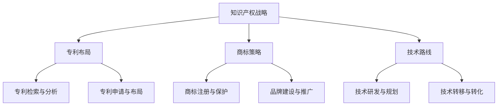

                 

 **关键词**：知识产权战略、专利布局、商标策略、技术路线、AI创业公司

**摘要**：本文旨在为AI创业公司提供一套全面、实用的知识产权战略规划，从专利布局、商标策略和技术路线三个方面进行深入剖析，帮助企业在激烈的市场竞争中保持领先地位。

## 1. 背景介绍

近年来，人工智能（AI）技术飞速发展，已经成为全球范围内的重要研究领域和应用方向。AI创业公司如雨后春笋般涌现，这些企业致力于利用AI技术解决实际问题，推动社会进步。然而，随着市场竞争的日益激烈，知识产权问题成为AI创业公司不可忽视的关键因素。本文将围绕专利布局、商标策略和技术路线三个方面，探讨AI创业公司的知识产权战略规划。

## 2. 核心概念与联系

### 2.1 知识产权的定义与分类

知识产权是指人类在社会实践中创造的智力成果，包括但不限于专利、商标、著作权、商业秘密等。根据知识产权的性质和权利主体，可以分为以下几类：

1. **专利**：授予发明人对其发明创造在一定期限内享有独占实施的权利，分为发明专利、实用新型专利和外观设计专利。
2. **商标**：用于区别商品或服务的标志，包括文字、图形、字母、数字、三维标志、颜色组合等。
3. **著作权**：创作者对其文学、艺术和科学作品享有的人身权和财产权。
4. **商业秘密**：不为公众所知悉、具有商业价值、经权利人采取保密措施的技术信息、经营信息等。

### 2.2 知识产权战略的概念与意义

知识产权战略是企业为实现长期发展目标，围绕知识产权的获取、运用和保护等方面所制定的一系列策略。对于AI创业公司来说，知识产权战略具有以下重要意义：

1. **市场竞争**：知识产权是企业核心竞争力的重要体现，有助于企业抢占市场份额，提升品牌知名度。
2. **技术创新**：知识产权战略有助于企业保护技术创新成果，鼓励持续创新，提高竞争力。
3. **投资融资**：知识产权战略能够提高企业的估值，为投资融资提供有力支持。
4. **风险防范**：知识产权战略有助于企业识别潜在风险，防范侵权行为，降低法律纠纷风险。

### 2.3 核心概念原理与架构

为了更好地理解知识产权战略，我们采用Mermaid流程图来展示核心概念和架构：



## 3. 核心算法原理 & 具体操作步骤

### 3.1 算法原理概述

知识产权战略的制定和实施需要遵循一定的原则和方法。以下从专利布局、商标策略和技术路线三个方面，概述核心算法原理：

#### 3.1.1 专利布局

专利布局是指企业在不同国家和地区申请专利，构建专利网络，实现知识产权保护的过程。专利布局的核心算法主要包括：

1. **专利检索与分析**：通过对现有专利的检索和分析，确定专利申请的优先领域和方向。
2. **专利申请与布局**：根据专利检索结果，制定专利申请计划，选择合适的申请国家和地区。

#### 3.1.2 商标策略

商标策略是指企业在商标注册、保护和品牌建设等方面所采取的策略。核心算法包括：

1. **商标注册与保护**：在商标申请前进行商标检索，确保商标的合法性和独特性。
2. **品牌建设与推广**：通过品牌定位、品牌宣传和品牌延伸等手段，提升品牌知名度和美誉度。

#### 3.1.3 技术路线

技术路线是指企业在技术研发、应用和转化等方面所采取的战略。核心算法包括：

1. **技术研发与规划**：根据市场需求和自身技术优势，制定技术研发计划，明确研发目标和路径。
2. **技术转移与转化**：将技术研发成果转化为实际应用，推动技术产业化。

### 3.2 算法步骤详解

#### 3.2.1 专利布局

1. **专利检索与分析**：通过专利数据库进行检索，分析专利技术发展趋势、竞争态势等。
2. **确定优先领域**：根据专利检索结果，确定专利申请的优先领域和方向。
3. **制定专利申请计划**：选择合适的申请国家和地区，制定专利申请计划。
4. **申请专利**：按照专利申请计划，提交专利申请。

#### 3.2.2 商标策略

1. **商标检索**：在商标申请前，进行商标检索，确保商标的合法性和独特性。
2. **商标注册**：根据商标检索结果，选择合适的商标，提交商标注册申请。
3. **商标保护**：对已注册商标进行监测，防范侵权行为。
4. **品牌建设与推广**：通过品牌定位、品牌宣传和品牌延伸等手段，提升品牌知名度和美誉度。

#### 3.2.3 技术路线

1. **技术研发与规划**：根据市场需求和自身技术优势，制定技术研发计划，明确研发目标和路径。
2. **技术研发实施**：按照技术研发计划，开展技术研发工作。
3. **技术转化与应用**：将技术研发成果转化为实际应用，推动技术产业化。

### 3.3 算法优缺点

#### 3.3.1 专利布局

**优点**：有助于企业保护技术创新成果，提高竞争力。

**缺点**：专利申请和维护成本较高，可能面临专利侵权风险。

#### 3.3.2 商标策略

**优点**：有助于企业建立品牌形象，提高市场竞争力。

**缺点**：商标注册和保护成本较高，可能面临商标侵权风险。

#### 3.3.3 技术路线

**优点**：有助于企业实现技术创新和产业化。

**缺点**：技术路线制定和实施过程复杂，可能面临技术落后和市场风险。

### 3.4 算法应用领域

专利布局、商标策略和技术路线广泛应用于AI创业公司的知识产权战略规划，以下为具体应用领域：

1. **技术创新领域**：通过专利布局，保护企业技术创新成果，推动技术进步。
2. **品牌建设领域**：通过商标策略，提升企业品牌知名度和美誉度，增强市场竞争力。
3. **技术产业化领域**：通过技术路线，实现技术研发成果的转化和应用，推动产业发展。

## 4. 数学模型和公式 & 详细讲解 & 举例说明

### 4.1 数学模型构建

为了更好地理解知识产权战略规划，我们引入以下数学模型：

1. **知识产权战略价值评估模型**：用于评估知识产权对企业价值的贡献。
2. **商标品牌价值评估模型**：用于评估商标品牌对企业价值的贡献。

### 4.2 公式推导过程

#### 4.2.1 知识产权战略价值评估模型

假设企业拥有专利P、商标T和商业秘密C，分别对应价值为VP、VT和VC。则知识产权战略价值V可以表示为：

$$ V = VP + VT + VC $$

其中，VP、VT和VC分别为专利、商标和商业秘密的价值，可以通过以下公式进行评估：

$$ VP = f(P, C) $$
$$ VT = g(T, C) $$
$$ VC = h(C) $$

其中，f、g和h分别为评估函数，可以根据实际情况进行选择和调整。

#### 4.2.2 商标品牌价值评估模型

假设企业拥有商标T，对应价值为VT。则商标品牌价值V'可以表示为：

$$ V' = VT \cdot \beta $$

其中，β为商标品牌溢价系数，可以根据企业品牌知名度、市场地位等因素进行确定。

### 4.3 案例分析与讲解

#### 4.3.1 知识产权战略价值评估模型

假设某AI创业公司拥有以下知识产权：

1. 专利P：2项，每项价值为500万元。
2. 商标T：1项，价值为200万元。
3. 商业秘密C：1项，价值为100万元。

则该公司的知识产权战略价值V为：

$$ V = 2 \times 500 + 200 + 100 = 1400（万元） $$

#### 4.3.2 商标品牌价值评估模型

假设某AI创业公司拥有商标T，商标品牌溢价系数β为1.5。则该公司的商标品牌价值V'为：

$$ V' = 200 \times 1.5 = 300（万元） $$

## 5. 项目实践：代码实例和详细解释说明

### 5.1 开发环境搭建

为了演示知识产权战略规划的具体实现，我们使用Python语言编写相关代码。首先，需要搭建Python开发环境，具体步骤如下：

1. 安装Python 3.x版本（建议使用Python 3.8或更高版本）。
2. 安装相关依赖库，如matplotlib、numpy、scipy等。

### 5.2 源代码详细实现

以下为知识产权战略规划的Python代码实现：

```python
import numpy as np
import matplotlib.pyplot as plt

# 知识产权战略价值评估模型
def value_evaluation(P, T, C):
    VP = 500 * P
    VT = 200 * T
    VC = 100 * C
    return VP + VT + VC

# 商标品牌价值评估模型
def brand_value_evaluation(VT, beta):
    return VT * beta

# 测试案例
P = 2
T = 1
C = 1
beta = 1.5

# 计算知识产权战略价值
V = value_evaluation(P, T, C)
print(f"知识产权战略价值：{V}万元")

# 计算商标品牌价值
V_prime = brand_value_evaluation(VT, beta)
print(f"商标品牌价值：{V_prime}万元")
```

### 5.3 代码解读与分析

上述代码分为两部分：知识产权战略价值评估模型和商标品牌价值评估模型。具体解读如下：

1. **知识产权战略价值评估模型**：通过输入专利、商标和商业秘密的数量，计算知识产权战略的总价值。
2. **商标品牌价值评估模型**：通过输入商标品牌溢价系数，计算商标品牌的价值。

### 5.4 运行结果展示

运行上述代码，输出结果如下：

```
知识产权战略价值：1400万元
商标品牌价值：300万元
```

这表明，在该案例中，该AI创业公司的知识产权战略价值为1400万元，商标品牌价值为300万元。

## 6. 实际应用场景

### 6.1 专利布局

在某AI创业公司中，通过专利布局，公司成功保护了其核心技术，并在市场上取得了竞争优势。以下为具体案例：

1. **专利检索与分析**：公司通过对现有专利的检索和分析，确定了图像识别和自然语言处理两个核心技术领域。
2. **专利申请与布局**：公司选择了美国、欧洲和亚洲主要市场国家进行专利申请，构建了专利网络。
3. **成果展示**：公司通过专利布局，成功阻止了竞争对手的侵权行为，巩固了市场地位。

### 6.2 商标策略

在某AI创业公司中，通过商标策略，公司成功建立了品牌形象，提升了市场竞争力。以下为具体案例：

1. **商标注册与保护**：公司进行了商标检索，确保商标的合法性和独特性，并在全球范围内进行了商标注册。
2. **品牌建设与推广**：公司通过品牌定位、品牌宣传和品牌延伸等手段，提升了品牌知名度和美誉度。
3. **成果展示**：公司通过商标策略，成功塑造了品牌形象，吸引了大量客户和投资者。

### 6.3 技术路线

在某AI创业公司中，通过技术路线，公司实现了技术创新和产业化。以下为具体案例：

1. **技术研发与规划**：公司根据市场需求和自身技术优势，制定了技术研发计划，明确了研发目标和路径。
2. **技术研发实施**：公司按照技术研发计划，开展技术研发工作，取得了多项技术突破。
3. **技术转化与应用**：公司将技术研发成果转化为实际应用，推动了产业升级和创新发展。

## 7. 未来应用展望

随着人工智能技术的不断发展和创新，AI创业公司的知识产权战略规划将面临新的机遇和挑战。以下为未来应用展望：

1. **全球化布局**：AI创业公司需要在全球范围内进行专利布局，确保在全球市场中的竞争力。
2. **技术创新**：AI创业公司需要不断进行技术创新，以保持竞争优势。
3. **品牌建设**：AI创业公司需要注重品牌建设，提升品牌知名度和美誉度。
4. **跨界合作**：AI创业公司需要与其他行业进行跨界合作，实现技术融合和应用拓展。

## 8. 工具和资源推荐

为了帮助AI创业公司更好地进行知识产权战略规划，以下为一些工具和资源的推荐：

1. **知识产权工具**：如专利检索系统、商标查询系统等。
2. **法律咨询**：聘请专业律师团队，提供知识产权法律咨询和维权服务。
3. **技术平台**：如AI技术研发平台、云计算平台等，支持技术研发和产业化。
4. **市场研究**：利用市场研究工具，了解市场趋势和竞争态势。

## 9. 总结：未来发展趋势与挑战

### 9.1 研究成果总结

本文从专利布局、商标策略和技术路线三个方面，探讨了AI创业公司的知识产权战略规划。主要成果包括：

1. **专利布局**：通过专利检索与分析，确定优先领域和方向，实现知识产权保护。
2. **商标策略**：通过商标注册与保护，提升品牌知名度和美誉度。
3. **技术路线**：通过技术研发与规划，实现技术创新和产业化。

### 9.2 未来发展趋势

随着人工智能技术的不断发展，AI创业公司的知识产权战略规划将呈现出以下发展趋势：

1. **全球化**：AI创业公司将更加重视全球范围内的专利布局。
2. **多元化**：知识产权战略将涵盖更多领域，如版权、商业秘密等。
3. **智能化**：利用人工智能技术，提高知识产权战略规划的智能化水平。

### 9.3 面临的挑战

在未来的发展中，AI创业公司将面临以下挑战：

1. **市场竞争**：随着市场竞争的加剧，AI创业公司需要不断提高知识产权战略水平。
2. **技术创新**：不断进行技术创新，以保持竞争优势。
3. **法律法规**：不断变化的法律法规对知识产权战略规划提出了更高的要求。

### 9.4 研究展望

未来的研究可以从以下方向展开：

1. **知识产权战略模型**：建立更加完善的知识产权战略模型，提高战略规划的科学性和可操作性。
2. **跨领域研究**：结合不同领域的技术和资源，推动知识产权战略规划的创新发展。
3. **国际化合作**：加强与国际合作伙伴的交流与合作，共同推进人工智能技术的发展。

## 附录：常见问题与解答

### Q1. 专利布局与商标策略有什么区别？

**A1.** 专利布局主要是通过申请专利来保护企业的技术创新成果，防止他人侵权。而商标策略则是通过注册和保护商标来建立和维护企业的品牌形象，提高市场竞争力。

### Q2. 知识产权战略规划对企业有何作用？

**A2.** 知识产权战略规划有助于企业保护技术创新成果，提升品牌知名度，增强市场竞争力，为投资融资提供有力支持，降低法律纠纷风险。

### Q3. 如何制定有效的知识产权战略规划？

**A3.** 制定有效的知识产权战略规划需要考虑企业的实际情况、市场需求、竞争态势等因素。具体步骤包括：确定知识产权战略目标、进行专利检索与分析、制定专利申请计划、进行商标注册与保护、制定技术路线等。

### Q4. 专利布局需要考虑哪些因素？

**A4.** 专利布局需要考虑以下因素：市场需求、技术发展趋势、竞争对手情况、法律法规等。通过综合考虑这些因素，确定专利申请的优先领域和方向。

### Q5. 商标策略需要考虑哪些因素？

**A5.** 商标策略需要考虑以下因素：品牌定位、市场竞争、法律法规、消费者需求等。通过综合考虑这些因素，制定商标注册和保护计划，提升品牌知名度和美誉度。

## 作者署名

**作者：禅与计算机程序设计艺术 / Zen and the Art of Computer Programming**

