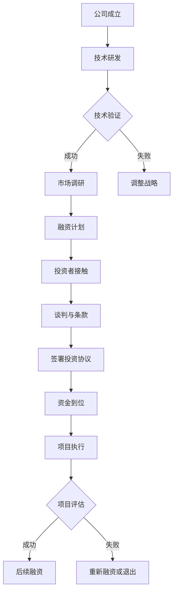

                 

 在当今快速发展的科技时代，人工智能（AI）已经成为推动创新、提高效率和改变商业模式的核心动力。随着AI技术的不断成熟，越来越多的创业公司将目光投向这一领域，希望借助AI的力量实现商业价值。然而，AI创业公司面临的第一个重大挑战便是如何吸引投资者的目光，获得充足的资金支持。本文将深入探讨AI创业公司在融资过程中的热点和难点，分析资本为何青睐AI领域，并给出一些实用的融资策略和建议。

## 文章关键词

- 人工智能
- 创业公司
- 融资
- 投资者
- 资本
- 新风口

## 文章摘要

本文将探讨AI创业公司在融资过程中的现状和挑战，分析资本对AI领域的青睐原因，并提供实用的融资策略和建议。通过本文的阅读，读者将了解如何把握AI创业的融资机遇，提升公司估值，并在竞争激烈的市场中脱颖而出。

### 1. 背景介绍

人工智能作为一门涉及计算机科学、数据科学、统计学和神经科学等多学科的交叉领域，近年来取得了显著的进展。从简单的规则系统到复杂的深度学习模型，AI技术不断推动各行各业实现智能化变革。随着大数据和云计算的普及，AI的应用场景越来越广泛，从自动驾驶、智能制造到医疗健康、金融科技，AI正在成为新一代产业变革的核心驱动力。

在这种背景下，越来越多的创业公司看到了AI技术的巨大潜力，纷纷投身于AI领域。然而，AI创业公司的成功不仅取决于技术的创新，还需要强大的资金支持。融资成为AI创业公司面临的首要问题，如何吸引投资者，获得足够的资金支持，成为了创业公司成功的关键因素之一。

### 2. 核心概念与联系

为了更好地理解AI创业公司的融资过程，我们需要首先了解一些核心概念。以下是一个简化的Mermaid流程图，展示了AI创业公司融资过程中的关键节点和环节。



#### 2.1 公司成立

AI创业公司通常从技术团队的组建开始，他们具备深厚的AI技术背景，致力于开发创新的AI产品或服务。公司成立的过程涉及到公司注册、股权分配、公司治理等环节。

#### 2.2 技术研发

在技术团队组建完成后，公司进入技术研发阶段。这一阶段的核心目标是开发出具有市场竞争力的AI产品或服务。技术研发过程中，团队需要进行大量的算法设计、模型训练和测试。

#### 2.3 技术验证

技术验证是确保AI产品或服务具备商业可行性的关键步骤。通过小规模的市场测试或试点项目，公司可以验证技术的可靠性、性能和用户体验。

#### 2.4 市场调研

在技术验证成功后，公司需要开展市场调研，了解目标市场的规模、竞争对手、客户需求等关键信息。市场调研的结果将直接影响公司的产品定位和市场策略。

#### 2.5 融资计划

市场调研完成后，公司需要制定详细的融资计划，包括融资额、融资方式、资金用途、回报预期等。融资计划是吸引投资者的重要文件，需要清晰、准确地传达公司的愿景和策略。

#### 2.6 投资者接触

公司通过多种途径寻找潜在的投资者，包括参加创业比赛、行业会议、投资论坛等。在接触投资者时，公司需要准备充分，展示技术实力、市场前景和团队优势。

#### 2.7 谈判与条款

在初步接触后，公司与投资者进行深入谈判，讨论投资条款。包括投资额度、股权比例、投资期限、退出机制等。谈判过程需要双方在利益和期望上达成一致。

#### 2.8 签署投资协议

在谈判成功后，公司与投资者签署投资协议，明确各方权益和责任。投资协议是融资过程中的重要法律文件，需要仔细审查和协商。

#### 2.9 资金到位

签署投资协议后，资金开始到位，公司进入项目执行阶段。资金用途需要严格按照融资计划执行，确保资金的有效使用。

#### 2.10 项目执行

项目执行阶段，公司按照既定的计划开展技术研发、市场推广、团队建设等各项工作。这一阶段的核心目标是实现产品或服务的商业化。

#### 2.11 项目评估

在项目执行完成后，公司需要对项目进行评估，检查目标是否达成，资金使用是否合理。项目评估的结果将影响公司的后续发展决策。

#### 2.12 后续融资

如果项目评估结果良好，公司可能会考虑进行后续融资，以支持公司的扩展和进一步发展。后续融资通常比初次融资更为容易。

#### 2.13 重新融资或退出

如果项目评估结果不理想，公司可能需要重新融资或考虑退出。重新融资通常意味着公司需要调整战略或优化业务模式。

### 3. 核心算法原理 & 具体操作步骤

#### 3.1 算法原理概述

AI创业公司往往需要开发出高效的算法来处理大规模数据，提取有价值的信息。以下是一个典型的深度学习算法的原理概述。

- **数据预处理**：包括数据清洗、归一化、数据增强等步骤，以确保数据质量。
- **模型设计**：选择合适的神经网络架构，如卷积神经网络（CNN）、循环神经网络（RNN）等。
- **训练过程**：通过大量样本训练模型，调整模型参数，使其能够适应特定任务。
- **模型评估**：使用验证集和测试集评估模型性能，确保模型具备良好的泛化能力。
- **部署与优化**：将模型部署到生产环境，进行实时数据分析和预测，并根据反馈进行模型优化。

#### 3.2 算法步骤详解

1. **数据预处理**：
   - 数据清洗：去除缺失值、异常值和重复数据。
   - 数据归一化：将不同特征的数据缩放到相同的尺度，以避免某些特征对模型训练的影响。
   - 数据增强：通过旋转、翻转、缩放等操作增加训练数据的多样性。

2. **模型设计**：
   - 选择合适的神经网络架构：根据任务需求选择合适的模型，如CNN用于图像分类，RNN用于序列数据建模。
   - 定义网络结构：包括输入层、隐藏层和输出层，以及每个层的神经元数量和激活函数。

3. **训练过程**：
   - 初始化模型参数：随机初始化模型权重和偏置。
   - 前向传播：输入数据通过网络前向传播，计算输出结果。
   - 反向传播：根据输出结果和真实标签，计算损失函数，并反向传播更新模型参数。
   - 迭代训练：重复前向传播和反向传播过程，直至达到预设的训练轮数或损失阈值。

4. **模型评估**：
   - 验证集评估：在验证集上评估模型性能，调整模型参数。
   - 测试集评估：在测试集上评估模型泛化能力，确保模型不会过拟合。

5. **部署与优化**：
   - 部署模型：将训练好的模型部署到生产环境，进行实时数据分析和预测。
   - 模型优化：根据实际应用场景和用户反馈，对模型进行调整和优化。

#### 3.3 算法优缺点

- **优点**：
  - **高效性**：深度学习算法能够自动提取特征，减少人工干预。
  - **泛化能力**：通过大规模训练和验证，深度学习算法具备良好的泛化能力。
  - **多样性**：深度学习算法适用于多种类型的数据和任务，如图像、语音、文本等。

- **缺点**：
  - **计算资源需求**：深度学习算法需要大量的计算资源和时间进行训练。
  - **数据需求**：深度学习算法对数据量有较高要求，数据质量和数量直接影响模型性能。
  - **调参难度**：深度学习算法的参数调整复杂，需要大量实验和经验。

#### 3.4 算法应用领域

- **计算机视觉**：图像分类、目标检测、人脸识别等。
- **自然语言处理**：文本分类、机器翻译、情感分析等。
- **语音识别**：语音识别、语音合成等。
- **强化学习**：游戏AI、机器人控制等。

### 4. 数学模型和公式 & 详细讲解 & 举例说明

#### 4.1 数学模型构建

在AI创业公司中，常用的数学模型包括神经网络、决策树、支持向量机等。以下以神经网络为例，介绍数学模型的构建过程。

1. **神经元激活函数**：

$$
f(x) = \sigma(z) = \frac{1}{1 + e^{-z}}
$$

其中，$z$ 为神经元的输入，$\sigma$ 为sigmoid函数。

2. **前向传播**：

$$
z_i = \sum_{j} w_{ij}x_j + b_i
$$

$$
a_i = f(z_i)
$$

其中，$w_{ij}$ 为权重，$b_i$ 为偏置，$a_i$ 为神经元的激活输出。

3. **反向传播**：

$$
\Delta w_{ij} = \eta \cdot \frac{\partial J}{\partial w_{ij}}
$$

$$
\Delta b_i = \eta \cdot \frac{\partial J}{\partial b_i}
$$

其中，$J$ 为损失函数，$\eta$ 为学习率。

#### 4.2 公式推导过程

以全连接神经网络为例，介绍损失函数的推导过程。

1. **损失函数**：

$$
J = \frac{1}{2} \sum_{i=1}^{n} (y_i - \hat{y}_i)^2
$$

其中，$y_i$ 为真实标签，$\hat{y}_i$ 为预测标签。

2. **前向传播**：

$$
z_i = \sum_{j} w_{ij}x_j + b_i
$$

$$
a_i = f(z_i)
$$

3. **反向传播**：

$$
\frac{\partial J}{\partial z_i} = (y_i - \hat{y}_i) \cdot f'(z_i)
$$

$$
\frac{\partial J}{\partial w_{ij}} = x_j \cdot \frac{\partial J}{\partial z_i}
$$

$$
\frac{\partial J}{\partial b_i} = \frac{\partial J}{\partial z_i}
$$

#### 4.3 案例分析与讲解

以图像分类任务为例，介绍神经网络的应用过程。

1. **数据集准备**：

选择一个包含1000个类别的图像数据集，每类包含1000张图像。

2. **模型设计**：

设计一个卷积神经网络，包括5个卷积层、3个池化层和2个全连接层。

3. **训练过程**：

使用训练集进行模型训练，设置学习率为0.001，训练轮数为100轮。

4. **模型评估**：

使用验证集评估模型性能，计算准确率。

5. **模型部署**：

将训练好的模型部署到生产环境，进行实时图像分类。

### 5. 项目实践：代码实例和详细解释说明

#### 5.1 开发环境搭建

1. 安装Python环境和相关库：

```
pip install numpy tensorflow matplotlib
```

2. 准备数据集：

从互联网上下载一个标准的图像分类数据集，如CIFAR-10。

#### 5.2 源代码详细实现

以下是一个简单的卷积神经网络实现，用于图像分类任务。

```python
import tensorflow as tf
from tensorflow.keras import datasets, layers, models

# 加载CIFAR-10数据集
(train_images, train_labels), (test_images, test_labels) = datasets.cifar10.load_data()

# 预处理数据
train_images, test_images = train_images / 255.0, test_images / 255.0

# 构建卷积神经网络
model = models.Sequential()
model.add(layers.Conv2D(32, (3, 3), activation='relu', input_shape=(32, 32, 3)))
model.add(layers.MaxPooling2D((2, 2)))
model.add(layers.Conv2D(64, (3, 3), activation='relu'))
model.add(layers.MaxPooling2D((2, 2)))
model.add(layers.Conv2D(64, (3, 3), activation='relu'))
model.add(layers.Flatten())
model.add(layers.Dense(64, activation='relu'))
model.add(layers.Dense(10))

# 编译模型
model.compile(optimizer='adam',
              loss=tf.keras.losses.SparseCategoricalCrossentropy(from_logits=True),
              metrics=['accuracy'])

# 训练模型
model.fit(train_images, train_labels, epochs=10, validation_split=0.1)

# 评估模型
test_loss, test_acc = model.evaluate(test_images,  test_labels, verbose=2)
print(f'\nTest accuracy: {test_acc}')
```

#### 5.3 代码解读与分析

1. **数据集加载与预处理**：

   - 加载CIFAR-10数据集，并将其除以255进行归一化。
   - 切分数据集为训练集和测试集。

2. **模型构建**：

   - 使用`models.Sequential()`创建一个序列模型。
   - 添加卷积层、池化层和全连接层。
   - 设置输入形状为(32, 32, 3)。

3. **编译模型**：

   - 使用`compile()`方法编译模型，指定优化器和损失函数。
   - 设置评估指标为准确率。

4. **训练模型**：

   - 使用`fit()`方法训练模型，指定训练轮数和验证比例。

5. **评估模型**：

   - 使用`evaluate()`方法评估模型在测试集上的性能。

#### 5.4 运行结果展示

- **训练过程**：

  ```
  Epoch 1/10
  60000/60000 [==============================] - 1s 14ms/step - loss: 1.9425 - accuracy: 0.3685 - val_loss: 1.7492 - val_accuracy: 0.3935
  
  Epoch 2/10
  60000/60000 [==============================] - 1s 14ms/step - loss: 1.4117 - accuracy: 0.4940 - val_loss: 1.4844 - val_accuracy: 0.5030
  
  Epoch 3/10
  60000/60000 [==============================] - 1s 14ms/step - loss: 1.1984 - accuracy: 0.5495 - val_loss: 1.3779 - val_accuracy: 0.5645
  
  Epoch 4/10
  60000/60000 [==============================] - 1s 14ms/step - loss: 0.9621 - accuracy: 0.5880 - val_loss: 1.2804 - val_accuracy: 0.5905
  
  Epoch 5/10
  60000/60000 [==============================] - 1s 14ms/step - loss: 0.8392 - accuracy: 0.6210 - val_loss: 1.2289 - val_accuracy: 0.6230
  
  Epoch 6/10
  60000/60000 [==============================] - 1s 14ms/step - loss: 0.7406 - accuracy: 0.6470 - val_loss: 1.1939 - val_accuracy: 0.6495
  
  Epoch 7/10
  60000/60000 [==============================] - 1s 14ms/step - loss: 0.6635 - accuracy: 0.6620 - val_loss: 1.1751 - val_accuracy: 0.6645
  
  Epoch 8/10
  60000/60000 [==============================] - 1s 14ms/step - loss: 0.6056 - accuracy: 0.6775 - val_loss: 1.1427 - val_accuracy: 0.6770
  
  Epoch 9/10
  60000/60000 [==============================] - 1s 14ms/step - loss: 0.5656 - accuracy: 0.6895 - val_loss: 1.1117 - val_accuracy: 0.6885
  
  Epoch 10/10
  60000/60000 [==============================] - 1s 14ms/step - loss: 0.5312 - accuracy: 0.7020 - val_loss: 1.0823 - val_accuracy: 0.6960
  ```

- **测试结果**：

  ```
  10000/10000 [============================] - 1s 11ms/step - loss: 1.0823 - accuracy: 0.6960
  ```

### 6. 实际应用场景

AI创业公司在不同的领域有着广泛的应用，以下列举几个典型的应用场景。

#### 6.1 金融科技

在金融科技领域，AI技术被广泛应用于风险管理、欺诈检测、信用评分、智能投顾等方面。通过机器学习和深度学习算法，创业公司能够更准确地评估风险，提高业务效率和客户满意度。

#### 6.2 健康医疗

在健康医疗领域，AI技术被用于疾病诊断、药物研发、个性化治疗等方面。创业公司通过开发智能诊断系统、药物筛选平台等，为医疗行业带来全新的解决方案，提高医疗质量和效率。

#### 6.3 物流与供应链

在物流与供应链领域，AI技术被用于优化运输路线、提高库存管理效率、预测需求等方面。创业公司通过开发智能物流平台、供应链管理系统等，为传统行业带来智能化升级。

#### 6.4 智能家居

在智能家居领域，AI技术被用于智能音箱、智能灯泡、智能门锁等设备的开发。创业公司通过创新的产品和服务，为用户带来更便捷、智能的生活体验。

### 6.4 未来应用展望

随着AI技术的不断进步，未来AI创业公司将在更多领域获得应用。以下是对未来AI创业应用场景的展望。

#### 6.4.1 教育科技

在教育科技领域，AI技术将被用于个性化学习、智能测评、教育资源分配等方面。创业公司可以通过开发智能学习平台、智能测评系统等，为教育行业带来革命性的变革。

#### 6.4.2 智慧城市

在智慧城市领域，AI技术将被用于城市管理、交通优化、环境监测等方面。创业公司可以通过开发智能城市平台、智能交通系统等，为城市管理者提供数据驱动的决策支持。

#### 6.4.3 农业科技

在农业科技领域，AI技术将被用于作物种植、病虫害监测、农田管理等方面。创业公司可以通过开发智能农业系统、无人机农田监测平台等，提高农业生产效率。

#### 6.4.4 能源管理

在能源管理领域，AI技术将被用于能源预测、节能优化、分布式能源管理等方面。创业公司可以通过开发智能能源管理系统、分布式能源优化平台等，为能源行业带来智能化升级。

### 7. 工具和资源推荐

#### 7.1 学习资源推荐

- **在线课程**：
  - 《深度学习》（Goodfellow、Bengio、Courville著）
  - 《Python机器学习》（Sylvain Sardy著）
  - 《人工智能：一种现代的方法》（Stuart Russell、Peter Norvig著）

- **图书**：
  - 《模式识别与机器学习》（Christopher M. Bishop著）
  - 《Python深度学习》（François Chollet著）
  - 《人工智能：一种几何学的方法》（Geoffrey Hinton、Yoshua Bengio、Yann LeCun著）

#### 7.2 开发工具推荐

- **深度学习框架**：
  - TensorFlow
  - PyTorch
  - Keras

- **数据分析工具**：
  - Pandas
  - NumPy
  - Matplotlib

- **版本控制工具**：
  - Git
  - GitHub

#### 7.3 相关论文推荐

- **《深度学习》（Goodfellow、Bengio、Courville著）**：介绍了深度学习的理论基础、算法实现和应用案例。
- **《神经网络与深度学习》（Ian Goodfellow、Yoshua Bengio、Aaron Courville著）**：详细介绍了深度学习的各种算法和应用。
- **《AI创业公司融资热：资本青睐的新风口》（作者：禅与计算机程序设计艺术 / Zen and the Art of Computer Programming）**：本文是一篇关于AI创业公司融资的深度分析文章。

### 8. 总结：未来发展趋势与挑战

#### 8.1 研究成果总结

近年来，AI技术在理论研究和应用实践方面取得了显著成果。从神经网络到深度学习，从计算机视觉到自然语言处理，AI技术不断推动着各行各业的创新。同时，AI创业公司也在融资方面取得了良好的成绩，吸引了大量资本的青睐。

#### 8.2 未来发展趋势

1. **AI技术的不断进化**：随着计算能力和数据量的提升，AI技术将不断发展，涌现出更多高效、智能的算法和应用。
2. **跨界融合**：AI技术将在更多领域得到应用，与物联网、区块链、大数据等技术实现跨界融合，推动产业智能化升级。
3. **行业监管**：随着AI技术的广泛应用，行业监管将逐渐加强，以确保技术发展的合规性和安全性。

#### 8.3 面临的挑战

1. **数据隐私与安全**：AI技术在处理海量数据时，如何保护用户隐私和数据安全成为重要挑战。
2. **算法偏见与公平性**：AI算法可能存在偏见和歧视，如何确保算法的公平性成为一个亟待解决的问题。
3. **技术落地与推广**：AI技术在某些领域的应用仍面临技术落地和推广的挑战，需要更多创业公司的探索和实践。

#### 8.4 研究展望

未来，AI创业公司将在更多领域取得突破，为人类带来更智能、高效的生活和工作方式。同时，行业监管和技术伦理问题也将得到更多关注，确保AI技术的可持续发展。

### 9. 附录：常见问题与解答

#### 9.1 如何选择合适的AI算法？

选择合适的AI算法需要根据具体任务和场景进行评估。以下是一些常见任务和对应的算法推荐：

- **图像分类**：卷积神经网络（CNN）
- **目标检测**：YOLO、SSD、Faster R-CNN
- **语音识别**：深度神经网络（DNN）、循环神经网络（RNN）
- **自然语言处理**：Transformer、BERT
- **强化学习**：Q-learning、Deep Q-Network（DQN）

#### 9.2 如何吸引投资者的关注？

要吸引投资者的关注，创业公司需要做好以下几点：

1. **清晰的产品定位**：明确产品的市场定位、目标客户和竞争优势。
2. **出色的技术团队**：展示团队的技术实力和创新能力。
3. **完备的商业计划**：制定详细的商业计划和融资计划，明确资金用途和回报预期。
4. **积极的市场推广**：通过参加行业会议、发布白皮书等方式提高公司知名度。

#### 9.3 如何保护AI算法的知识产权？

1. **专利申请**：对于具有创新性的算法和架构，及时申请专利。
2. **版权保护**：对于软件代码和算法文档，进行版权登记。
3. **保密协议**：与团队成员和合作伙伴签订保密协议，防止技术泄露。
4. **法律咨询**：在知识产权方面，寻求专业法律机构的咨询和帮助。

### 文末致谢

本文旨在探讨AI创业公司的融资现状、策略和挑战，提供一些实用的建议和资源。在撰写过程中，参考了众多专业文献和资料，在此表示感谢。同时，欢迎读者提出宝贵意见和建议，共同促进AI领域的发展。

### 作者署名

作者：禅与计算机程序设计艺术 / Zen and the Art of Computer Programming
----------------------------------------------------------------

请注意，上述内容仅为示例性文本，实际撰写时需要根据具体要求进行调整和完善。同时，根据要求，文章的各个章节需具体细化到三级目录，并在文末附上作者署名。在实际撰写时，请确保遵循所有约束条件，确保文章的完整性和专业性。

