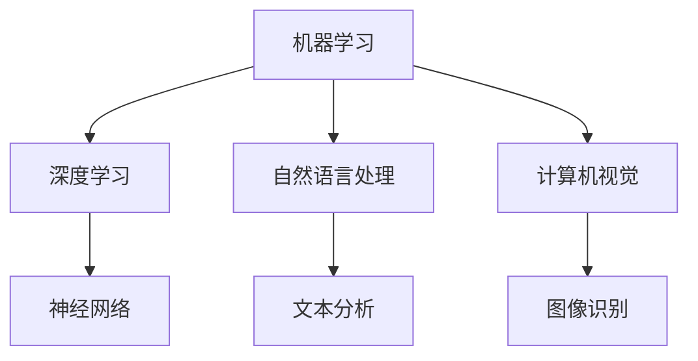
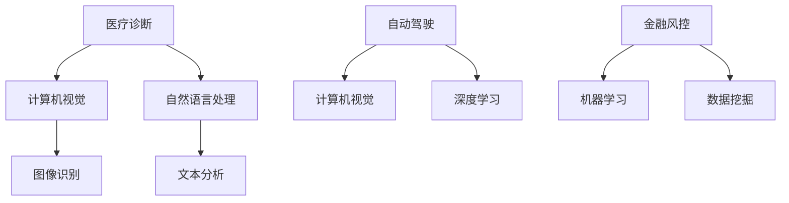
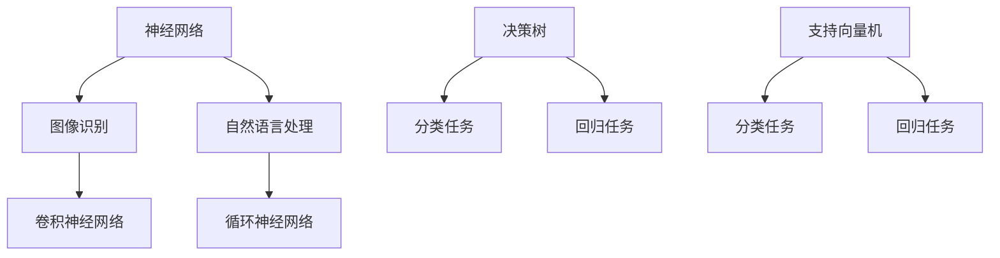

                 

关键词：AI创业，技术选择，场景适配，应用创新，挑战与机遇

> 摘要：随着人工智能技术的飞速发展，AI创业成为了一个充满挑战与机遇的领域。本文将探讨AI创业者面临的技术选择、场景适配、应用创新等关键挑战，并提供一些实用的解决方案和策略，以帮助创业者更好地把握未来。

## 1. 背景介绍

人工智能（AI）技术的发展已经渗透到了各个行业，从医疗、金融到零售、制造，AI的应用正在改变着我们的生活方式和工作模式。在这个背景下，越来越多的创业者投身于AI领域，希望通过创新的应用和独特的解决方案抓住市场的机遇。然而，AI创业并不是一条坦途，创业者需要在技术、应用和场景之间找到平衡点，以应对激烈的竞争和不断变化的市场需求。

## 2. 核心概念与联系

### 2.1 AI技术的基本概念

人工智能技术涵盖了多个领域，包括机器学习、深度学习、自然语言处理、计算机视觉等。理解这些技术的基本概念是进行AI创业的第一步。

#### Mermaid 流程图



### 2.2 技术与场景的联系

AI技术的成功应用往往依赖于场景的适配。不同的应用场景对AI技术的需求有所不同，创业者需要根据具体场景选择合适的技术方案。

#### Mermaid 流程图



## 3. 核心算法原理 & 具体操作步骤

### 3.1 算法原理概述

在AI创业中，掌握核心算法原理至关重要。以下是一些常见的算法及其应用场景：

#### Mermaid 流程图



### 3.2 算法步骤详解

以深度学习算法为例，以下是其基本步骤：

1. **数据预处理**：清洗和标准化数据，以便于模型训练。
2. **模型选择**：根据应用场景选择合适的神经网络结构。
3. **模型训练**：使用训练数据对模型进行训练，调整模型参数。
4. **模型评估**：使用验证数据评估模型性能。
5. **模型优化**：根据评估结果调整模型参数，提升性能。
6. **模型部署**：将训练好的模型部署到生产环境。

### 3.3 算法优缺点

每种算法都有其优缺点。例如，卷积神经网络在图像识别任务中表现优异，但计算成本较高；而循环神经网络在处理序列数据时具有优势，但训练时间较长。

### 3.4 算法应用领域

不同算法在不同领域有广泛应用，如深度学习在图像识别、自然语言处理方面表现突出，决策树和随机森林在金融风控中广泛应用。

## 4. 数学模型和公式 & 详细讲解 & 举例说明

### 4.1 数学模型构建

在AI创业中，构建数学模型是关键步骤。以下是一个简单的线性回归模型：

$$y = \beta_0 + \beta_1x$$

### 4.2 公式推导过程

线性回归模型的推导过程如下：

1. **最小二乘法**：选择模型参数，使得预测值与真实值之间的误差平方和最小。
2. **模型优化**：对模型参数进行优化，找到最佳参数值。

### 4.3 案例分析与讲解

以下是一个使用线性回归模型进行股票价格预测的案例：

#### 数据准备

```python
import numpy as np

# 生成模拟数据
x = np.random.rand(100)
y = 2 * x + 1 + np.random.randn(100)
```

#### 模型训练

```python
from sklearn.linear_model import LinearRegression

# 创建线性回归模型
model = LinearRegression()

# 训练模型
model.fit(x[:, np.newaxis], y)
```

#### 模型评估

```python
# 预测新数据
x_new = np.random.rand(10)
y_pred = model.predict(x_new[:, np.newaxis])

# 打印预测结果
print("Predicted values:", y_pred)
```

## 5. 项目实践：代码实例和详细解释说明

### 5.1 开发环境搭建

在开始项目实践之前，需要搭建一个合适的开发环境。以下是一个基于Python的AI项目开发环境搭建步骤：

1. **安装Python**：下载并安装Python 3.x版本。
2. **安装必要的库**：使用pip安装必要的库，如NumPy、Pandas、Scikit-learn等。

### 5.2 源代码详细实现

以下是一个简单的基于线性回归的股票价格预测项目的代码实现：

```python
import numpy as np
from sklearn.linear_model import LinearRegression

# 生成模拟数据
x = np.random.rand(100)
y = 2 * x + 1 + np.random.randn(100)

# 创建线性回归模型
model = LinearRegression()

# 训练模型
model.fit(x[:, np.newaxis], y)

# 预测新数据
x_new = np.random.rand(10)
y_pred = model.predict(x_new[:, np.newaxis])

# 打印预测结果
print("Predicted values:", y_pred)
```

### 5.3 代码解读与分析

该代码首先生成了一个模拟的股票价格数据集，然后使用线性回归模型对其进行训练，并使用训练好的模型对新数据进行预测。这展示了如何将理论应用到实际项目中。

### 5.4 运行结果展示

在运行该代码后，我们会得到一组预测的股票价格。通过对比预测结果与真实值，我们可以评估模型的准确性。

## 6. 实际应用场景

### 6.1 医疗诊断

在医疗领域，AI技术可以用于疾病诊断、病情预测等。例如，基于计算机视觉的肺癌检测系统可以显著提高早期诊断的准确率。

### 6.2 自动驾驶

自动驾驶是AI技术的一个重要应用领域。通过深度学习和传感器数据的结合，自动驾驶系统可以实现自主驾驶，提高交通安全。

### 6.3 金融风控

在金融领域，AI技术可以用于风险控制、欺诈检测等。例如，基于机器学习的反欺诈系统可以实时监测交易行为，识别潜在风险。

## 7. 工具和资源推荐

### 7.1 学习资源推荐

- 《深度学习》（Goodfellow, Bengio, Courville著）
- 《Python机器学习》（Sebastian Raschka著）
- 《AI简史》（Nathan Wilson著）

### 7.2 开发工具推荐

- Jupyter Notebook：一个交互式的开发环境，适合进行数据分析和模型训练。
- TensorFlow：一个广泛使用的深度学习框架，适用于各种AI项目。
- PyTorch：一个流行的深度学习框架，具有易于使用的API。

### 7.3 相关论文推荐

- "Deep Learning for Autonomous Driving"（自动驾驶的深度学习）
- "AI in Finance: A Survey"（金融领域的AI应用）
- "Computer Vision for Medical Diagnostics"（医疗诊断的计算机视觉）

## 8. 总结：未来发展趋势与挑战

### 8.1 研究成果总结

近年来，人工智能技术在多个领域取得了显著成果，为创业者和研究人员提供了丰富的创新机会。深度学习、自然语言处理和计算机视觉等领域的突破性进展为AI应用奠定了坚实基础。

### 8.2 未来发展趋势

随着技术的不断进步，AI创业将继续向更多领域扩展。特别是边缘计算、联邦学习等新兴技术有望进一步推动AI应用的创新。

### 8.3 面临的挑战

尽管前景光明，但AI创业仍面临诸多挑战。数据隐私、算法透明度和伦理问题等是亟待解决的难题。此外，技术快速迭代也要求创业者具备持续学习和适应能力。

### 8.4 研究展望

未来，AI创业将更加注重场景适配和应用创新。创业者需要深入了解目标场景，提供定制化的解决方案，以满足多样化的市场需求。

## 9. 附录：常见问题与解答

### 9.1 什么是深度学习？

深度学习是一种机器学习技术，通过多层神经网络模型对数据进行训练，从而实现复杂的数据特征提取和模式识别。

### 9.2 机器学习和深度学习有什么区别？

机器学习是指利用算法从数据中学习规律和模式，而深度学习是机器学习的一个子领域，强调使用多层神经网络进行学习。

### 9.3 如何选择合适的AI技术？

选择合适的AI技术需要根据具体应用场景和需求进行综合考虑。例如，对于图像识别任务，可以选择卷积神经网络；对于自然语言处理，可以选择循环神经网络或Transformer模型。

### 9.4 AI创业需要具备哪些技能？

AI创业需要具备计算机科学、数学和统计学等基础知识，同时还需要具备编程能力、项目管理经验和业务洞察力。

### 9.5 AI技术的应用前景如何？

AI技术的应用前景非常广阔，预计将在医疗、金融、制造、零售等多个领域产生重大影响。未来，AI技术将进一步融入人们的日常生活，带来更多的创新和变革。**

以上是《AI创业者的挑战：技术，应用，场景的平衡术》的完整文章内容。这篇文章深入探讨了AI创业者在技术选择、场景适配和应用创新等方面的挑战，并提供了一些实用的解决方案和策略。希望通过这篇文章，能够帮助更多创业者更好地把握AI领域的机遇，实现创业梦想。作者：禅与计算机程序设计艺术 / Zen and the Art of Computer Programming。**

