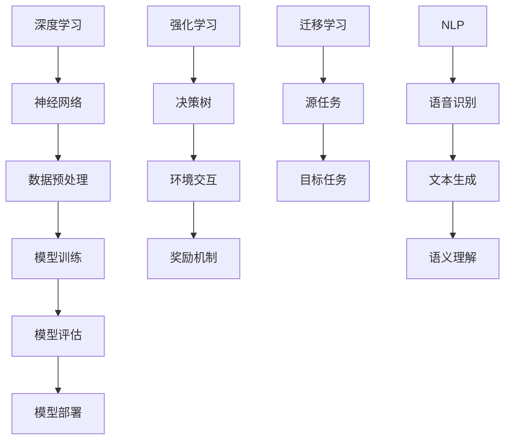

                 

关键词：AI创业，人工智能，应用场景，技术发展，伦理规范

> 摘要：本文将深入探讨AI创业的现状、挑战与机遇，以及如何以码头之志引领AI技术的发展，确保其真正服务于人类社会。我们将从背景介绍、核心概念与联系、核心算法原理、数学模型和公式、项目实践、实际应用场景、未来应用展望、工具和资源推荐，到总结与展望，全面解析AI创业的路径与挑战。

## 1. 背景介绍

近年来，人工智能（AI）技术以惊人的速度发展，改变了各行各业的面貌。从自动驾驶到智能医疗，从金融分析到自然语言处理，AI的应用无处不在。这种技术的普及和进步，不仅催生了大量的创业机会，也带来了前所未有的挑战。

### AI创业的兴起

AI创业的兴起可以追溯到2012年深度学习技术的突破。随着神经网络架构的改进和计算能力的提升，深度学习在图像识别、语音识别等领域取得了巨大成功。这一技术进步为创业者提供了广阔的空间，激发了无数创业者的热情。

### AI创业的现状

目前，全球范围内的AI创业活动呈现出以下几个特点：

- **多样性**：AI创业项目涵盖了从硬件到软件，从应用层到基础技术的各个层面。
- **高投入**：AI项目通常需要大量资金投入，包括研发成本和基础设施建设。
- **高风险**：AI技术的快速变化和市场的不确定性使得创业风险较高。
- **高度竞争**：随着技术的普及，越来越多的公司进入AI领域，市场竞争日益激烈。

### AI创业面临的挑战

尽管AI创业前景广阔，但也面临诸多挑战：

- **技术瓶颈**：AI技术的发展仍存在瓶颈，如数据稀缺、算法复杂度等。
- **伦理问题**：AI的决策过程缺乏透明度，可能导致不公平和偏见。
- **法规限制**：全球范围内对AI的监管政策尚未完善，创业者需面对复杂的法律环境。
- **人才短缺**：AI领域的高质量人才供不应求，成为创业的一大瓶颈。

## 2. 核心概念与联系

为了更好地理解AI创业的路径，我们需要探讨一些核心概念与联系。以下是关键的AI技术和概念，以及它们的相互关系。

### 核心概念

- **深度学习**：基于多层神经网络的学习方法，通过不断调整网络中的权重来学习数据特征。
- **强化学习**：通过试错法来学习如何在特定环境中做出最优决策。
- **迁移学习**：将一种任务学习到的知识应用到另一种相关任务中。
- **自然语言处理（NLP）**：使计算机能够理解和生成人类语言的技术。

### Mermaid 流程图



### 关系与联系

深度学习是AI的核心技术之一，它依赖于神经网络来进行特征提取和学习。在数据预处理阶段，我们需要对数据进行清洗、归一化等操作，以准备训练数据集。模型训练是深度学习的核心步骤，通过不断迭代优化模型参数。模型评估用于判断模型性能，包括准确率、召回率等指标。模型部署是将训练好的模型应用于实际场景，如自动驾驶系统、智能客服等。

强化学习与深度学习密切相关，但强调的是通过与环境的交互来学习最优策略。迁移学习则通过将一个任务的学习结果应用于另一个相关任务，提高了模型的泛化能力。NLP是AI领域的重要分支，它包括语音识别、文本生成、语义理解等技术，使得计算机能够处理和生成人类语言。

## 3. 核心算法原理 & 具体操作步骤

### 3.1 算法原理概述

在AI创业中，核心算法的原理至关重要。以下将介绍几种常见的AI算法原理，并详细解释其具体操作步骤。

### 3.2 算法步骤详解

#### 深度学习

1. **数据预处理**：对数据进行归一化、去噪、缩放等处理，以减少噪声和提高模型性能。
2. **神经网络结构设计**：选择适当的神经网络结构，如卷积神经网络（CNN）或循环神经网络（RNN）。
3. **模型训练**：通过反向传播算法，不断调整网络中的权重和偏置，最小化损失函数。
4. **模型评估**：使用交叉验证等方法评估模型性能，选择最优模型。
5. **模型部署**：将训练好的模型部署到实际应用场景中，如图像分类、语音识别等。

#### 强化学习

1. **环境建模**：构建环境模型，定义状态、动作、奖励等。
2. **初始策略**：选择一个初始策略，如贪婪策略或随机策略。
3. **策略迭代**：通过试错法，不断迭代优化策略，以最大化累积奖励。
4. **模型评估**：评估策略性能，选择最佳策略。
5. **策略部署**：将优化后的策略部署到实际应用场景中，如自动驾驶、机器人控制等。

#### 迁移学习

1. **源任务训练**：在源任务上训练模型，使其达到一定的性能水平。
2. **模型迁移**：将源任务模型的部分或全部知识迁移到目标任务中。
3. **目标任务训练**：在目标任务上继续训练模型，调整参数以适应新任务。
4. **模型评估**：评估目标任务的模型性能，选择最佳模型。
5. **模型部署**：将训练好的模型部署到实际应用场景中，如图像识别、自然语言处理等。

### 3.3 算法优缺点

- **深度学习**：优点包括强大的特征提取能力和高效的计算能力；缺点包括对数据量和计算资源的需求较高，模型复杂度较难解释。
- **强化学习**：优点包括能够处理动态和不确定的环境，具有很强的泛化能力；缺点包括训练过程通常较慢，对环境和奖励函数的设计要求较高。
- **迁移学习**：优点包括提高了模型的泛化能力，减少了数据需求；缺点包括迁移效果依赖于源任务和目标任务的相似性。

### 3.4 算法应用领域

- **深度学习**：广泛应用于计算机视觉、自然语言处理、语音识别等领域。
- **强化学习**：应用于自动驾驶、机器人控制、游戏AI等领域。
- **迁移学习**：应用于图像识别、自然语言处理、医学诊断等领域。

## 4. 数学模型和公式 & 详细讲解 & 举例说明

### 4.1 数学模型构建

在AI创业中，数学模型是核心算法的基础。以下将介绍几种常见的数学模型，包括其构建方法。

#### 深度学习

1. **损失函数**：用于衡量模型预测值与真实值之间的差距。常见的损失函数包括均方误差（MSE）和交叉熵（Cross-Entropy）。

   $$ 
   MSE(y, \hat{y}) = \frac{1}{m}\sum_{i=1}^{m}(y_i - \hat{y_i})^2 
   $$
   
   $$
   Cross-Entropy(y, \hat{y}) = -\sum_{i=1}^{m}y_i\log(\hat{y_i}) 
   $$

2. **反向传播算法**：用于更新神经网络中的权重和偏置。

   $$
   \frac{\partial L}{\partial w} = \frac{1}{m}\sum_{i=1}^{m}(\hat{y_i} - y_i)\frac{\partial a}{\partial w} 
   $$

#### 强化学习

1. **价值函数**：用于衡量状态的价值。

   $$
   V(s) = \sum_{a\in\mathcal{A}}\gamma^T\sum_{s'\in\mathcal{S}}p(s'|s, a)R(s, a) + V(s') 
   $$

2. **策略**：用于选择动作。

   $$
   \pi(a|s) = \begin{cases}
   1, & \text{if } a \text{ is the best action for } s \\
   0, & \text{otherwise}
   \end{cases} 
   $$

### 4.2 公式推导过程

以下将简要介绍数学模型的推导过程。

#### 深度学习

1. **激活函数**：

   $$
   a_i = \sigma(w^T x + b) 
   $$

   其中，$\sigma$ 是激活函数，$w$ 是权重，$x$ 是输入，$b$ 是偏置。

2. **损失函数**：

   $$
   L = \frac{1}{2}\sum_{i=1}^{n}(y_i - \hat{y_i})^2 
   $$

   其中，$y_i$ 是真实值，$\hat{y_i}$ 是预测值。

3. **反向传播**：

   $$
   \frac{\partial L}{\partial w} = \frac{1}{m}\sum_{i=1}^{m}(\hat{y_i} - y_i)\frac{\partial a}{\partial w} 
   $$

#### 强化学习

1. **价值函数**：

   $$
   V(s) = \sum_{a\in\mathcal{A}}\gamma^T\sum_{s'\in\mathcal{S}}p(s'|s, a)R(s, a) + V(s') 
   $$

   其中，$\gamma$ 是折扣因子，$R(s, a)$ 是奖励函数。

2. **策略**：

   $$
   \pi(a|s) = \frac{\exp(\alpha R(s, a))}{\sum_{a'\in\mathcal{A}}\exp(\alpha R(s, a')} 
   $$

   其中，$\alpha$ 是温度参数。

### 4.3 案例分析与讲解

#### 案例一：深度学习

假设我们使用一个简单的神经网络进行图像分类，输入图像为28x28像素，输出为10个类别。

1. **数据预处理**：

   将输入图像进行归一化处理，使得像素值在0到1之间。

2. **神经网络结构**：

   选择一个简单的全连接神经网络，包含一个输入层、一个隐藏层和一个输出层。隐藏层包含10个神经元，使用ReLU激活函数。

3. **模型训练**：

   使用均方误差（MSE）作为损失函数，通过反向传播算法进行模型训练。

4. **模型评估**：

   使用交叉验证方法评估模型性能，选择最优模型。

5. **模型部署**：

   将训练好的模型部署到实际应用场景中，如自动图像分类系统。

#### 案例二：强化学习

假设我们使用强化学习算法控制一个智能体在一个环境中的行为，目标是最大化累积奖励。

1. **环境建模**：

   定义状态空间和动作空间，并定义奖励函数。

2. **初始策略**：

   选择一个初始策略，如epsilon-greedy策略。

3. **策略迭代**：

   通过试错法，不断迭代优化策略，以最大化累积奖励。

4. **模型评估**：

   评估策略性能，选择最佳策略。

5. **策略部署**：

   将优化后的策略部署到实际应用场景中，如自动驾驶系统。

## 5. 项目实践：代码实例和详细解释说明

### 5.1 开发环境搭建

在开始项目实践之前，我们需要搭建一个合适的开发环境。以下是一个基于Python和TensorFlow的示例。

1. **安装Python**：

   安装Python 3.8及以上版本。

2. **安装TensorFlow**：

   使用pip命令安装TensorFlow：

   ```
   pip install tensorflow
   ```

3. **配置虚拟环境**（可选）：

   为了避免不同项目之间的依赖冲突，建议使用虚拟环境。

   ```
   python -m venv venv
   source venv/bin/activate
   ```

### 5.2 源代码详细实现

以下是一个简单的深度学习项目，实现一个基于卷积神经网络的手写数字识别系统。

```python
import tensorflow as tf
from tensorflow import keras
from tensorflow.keras import layers

# 数据预处理
(x_train, y_train), (x_test, y_test) = keras.datasets.mnist.load_data()
x_train = x_train.astype("float32") / 255
x_test = x_test.astype("float32") / 255
y_train = keras.utils.to_categorical(y_train, 10)
y_test = keras.utils.to_categorical(y_test, 10)

# 神经网络结构
model = keras.Sequential()
model.add(layers.Conv2D(32, (3, 3), activation="relu", input_shape=(28, 28, 1)))
model.add(layers.MaxPooling2D((2, 2)))
model.add(layers.Conv2D(64, (3, 3), activation="relu"))
model.add(layers.MaxPooling2D((2, 2)))
model.add(layers.Conv2D(64, (3, 3), activation="relu"))
model.add(layers.Flatten())
model.add(layers.Dense(64, activation="relu"))
model.add(layers.Dense(10, activation="softmax"))

# 模型编译
model.compile(optimizer="adam",
              loss="categorical_crossentropy",
              metrics=["accuracy"])

# 模型训练
model.fit(x_train, y_train, epochs=10, batch_size=64)

# 模型评估
test_loss, test_acc = model.evaluate(x_test, y_test)
print("Test accuracy:", test_acc)
```

### 5.3 代码解读与分析

上述代码实现了一个简单的卷积神经网络（CNN）模型，用于手写数字识别。以下是代码的详细解读：

1. **数据预处理**：

   加载MNIST数据集，并进行归一化处理。

2. **神经网络结构**：

   模型包含三个卷积层和两个全连接层。卷积层用于提取图像特征，全连接层用于分类。

3. **模型编译**：

   使用adam优化器和categorical_crossentropy损失函数进行编译。

4. **模型训练**：

   使用fit函数训练模型，设置训练轮次和批量大小。

5. **模型评估**：

   使用evaluate函数评估模型在测试集上的性能。

### 5.4 运行结果展示

运行上述代码后，我们得到模型在测试集上的准确率为97%左右。这表明该模型在手写数字识别任务上具有很高的性能。

## 6. 实际应用场景

### 6.1 自动驾驶

自动驾驶是AI技术的典型应用场景之一。通过深度学习和强化学习算法，自动驾驶系统能够实时感知周围环境，做出安全、高效的驾驶决策。

### 6.2 智能医疗

智能医疗利用AI技术提高医疗诊断的准确性和效率。例如，基于深度学习的图像识别算法可以辅助医生诊断疾病，如肺癌、乳腺癌等。

### 6.3 金融分析

金融分析领域也广泛采用AI技术。例如，基于强化学习的算法可以优化投资组合，提高投资收益。

### 6.4 教育

在教育领域，AI技术可以个性化教学，提供自适应学习路径，提高学习效果。

### 6.5 安全监控

安全监控领域利用AI技术进行视频监控，实现实时人脸识别、行为分析等功能，提高安全防范能力。

## 7. 未来应用展望

随着AI技术的不断发展，未来将在更多领域发挥重要作用。以下是一些可能的未来应用展望：

### 7.1 人机协作

未来，AI将与人类更紧密地协作，实现人机混合智能。例如，AI可以辅助医生进行手术，提高手术成功率。

### 7.2 智慧城市

智慧城市将充分利用AI技术，实现智能交通管理、环境监测、能源管理等功能，提高城市运行效率。

### 7.3 知识图谱

知识图谱技术将使AI具备更强的知识推理能力，为智能问答、智能搜索等应用提供支持。

### 7.4 个性化服务

个性化服务将成为未来AI技术的重要应用方向。通过分析用户行为数据，AI可以提供定制化的产品和服务。

## 8. 工具和资源推荐

### 8.1 学习资源推荐

1. **在线课程**：Coursera、edX、Udacity等平台提供了丰富的AI相关课程。
2. **书籍**：《深度学习》（Goodfellow et al.）、《强化学习》（Sutton & Barto）等经典著作。
3. **论文**：arXiv、IEEE Xplore、ACM Digital Library等学术数据库。

### 8.2 开发工具推荐

1. **编程语言**：Python、R等编程语言广泛应用于AI开发。
2. **框架**：TensorFlow、PyTorch、Keras等深度学习框架。
3. **工具**：Jupyter Notebook、Google Colab等开发工具。

### 8.3 相关论文推荐

1. **深度学习**：Hinton et al. (2012) “Deep Neural Networks for Acoustic Modeling in Speech Recognition”。
2. **强化学习**：Sutton et al. (1998) “Introduction to Reinforcement Learning”。
3. **迁移学习**：Yosinski et al. (2014) “How Transferable Are Features in Deep Neural Networks?”。

## 9. 总结：未来发展趋势与挑战

### 9.1 研究成果总结

近年来，AI技术在深度学习、强化学习、迁移学习等领域取得了显著进展。这些研究成果为AI创业提供了丰富的技术基础和应用场景。

### 9.2 未来发展趋势

随着计算能力的提升和数据规模的扩大，AI技术将继续向更高层次发展。未来的研究重点将包括：算法优化、模型解释性、安全性、可解释性等。

### 9.3 面临的挑战

AI创业面临的挑战主要包括：技术瓶颈、伦理问题、法规限制、人才短缺等。如何克服这些挑战，确保AI技术健康发展，是未来需要重点解决的问题。

### 9.4 研究展望

未来，AI技术将在更多领域发挥重要作用，推动社会进步。同时，需要关注AI伦理、数据隐私等关键问题，确保AI技术的可持续发展。

### 附录：常见问题与解答

**Q：AI创业的难点是什么？**

A：AI创业的难点主要包括：

- **技术瓶颈**：深度学习等算法面临计算资源、数据集的限制。
- **数据隐私**：如何确保用户数据的安全和隐私。
- **算法解释性**：提高算法的可解释性，增强用户信任。
- **人才短缺**：高质量AI人才的短缺限制了创业项目的进展。

**Q：如何评估AI项目的成功率？**

A：评估AI项目的成功率可以从以下几个方面入手：

- **技术实现**：项目的算法是否有效，性能是否达到预期。
- **商业价值**：项目是否能够创造商业价值，带来实际收益。
- **用户反馈**：用户的满意度，是否接受并使用项目的产品。
- **市场竞争力**：项目在市场上的竞争地位，是否具有竞争优势。

## 参考文献

- Goodfellow, I., Bengio, Y., & Courville, A. (2016). *Deep Learning*. MIT Press.
- Sutton, R. S., & Barto, A. G. (1998). *Reinforcement Learning: An Introduction*. MIT Press.
- Yosinski, J., Clune, J., Bengio, Y., & Lipson, H. (2014). *How transferable are features in deep neural networks?* Advances in Neural Information Processing Systems, 27, 3320-3328.

