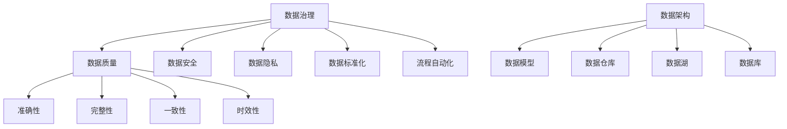

                 

关键词：人工智能，创业，数据管理，数据治理，数据架构

> 摘要：在人工智能（AI）创业浪潮中，数据管理是成功的关键。本文将探讨AI创业中的数据管理步骤，包括数据治理、架构设计、算法实现和实际应用，并提供相关工具和资源推荐，以帮助创业团队在数据驱动的发展中取得成功。

## 1. 背景介绍

近年来，人工智能技术在全球范围内迅猛发展，成为驱动各行各业创新的重要力量。无论是金融、医疗、制造，还是零售、交通，AI的应用案例层出不穷。然而，AI的成功离不开高质量的数据支持。数据是AI的“粮食”，而数据管理则是确保数据质量、安全和合规性的关键环节。

在AI创业的旅程中，数据管理不仅是技术层面的挑战，更是商业战略的一部分。有效的数据管理能够提高数据的可获取性、准确性和一致性，从而提升AI模型的性能和决策质量。同时，良好的数据管理还能增强企业的竞争力，促进创新和业务增长。

本文将详细探讨AI创业中的数据管理关键步骤，包括核心概念、算法原理、数学模型、项目实践和实际应用场景。通过这篇文章，读者将了解到如何构建和优化数据管理体系，为AI创业的成功奠定坚实的基础。

## 2. 核心概念与联系

### 2.1 数据治理

数据治理是指组织对数据的控制和管理，确保数据的质量、安全性和合规性。数据治理框架包括数据质量、数据安全、数据隐私、数据标准化和流程自动化等方面。

- **数据质量**：数据应具备准确性、完整性、一致性和时效性。
- **数据安全**：数据应受到适当的保护，防止未经授权的访问、篡改和泄露。
- **数据隐私**：遵守相关法规，保护个人和企业的隐私信息。
- **数据标准化**：通过标准化流程，确保数据在不同系统和部门之间的一致性。
- **流程自动化**：通过自动化工具，提高数据管理的效率和准确性。

### 2.2 数据架构

数据架构是组织数据的方式和结构，包括数据模型、数据仓库、数据湖和数据库等组成部分。

- **数据模型**：描述数据的结构和关系，常见的有实体-关系模型、维度模型等。
- **数据仓库**：集中存储历史数据，用于报告和分析。
- **数据湖**：存储原始数据，支持大数据处理和分析。
- **数据库**：用于存储结构化数据，支持事务处理。

### 2.3 数据管理架构的 Mermaid 流程图



## 3. 核心算法原理 & 具体操作步骤

### 3.1 算法原理概述

在AI创业中，核心算法的选择和优化至关重要。常见的算法包括机器学习算法、深度学习算法和优化算法。每种算法都有其独特的原理和适用场景。

- **机器学习算法**：通过训练数据集，使模型能够对未知数据进行预测和分类。
- **深度学习算法**：基于人工神经网络，通过多层神经元的连接和参数学习，实现复杂的模式识别和预测。
- **优化算法**：用于解决优化问题，如最小化成本、最大化利润等。

### 3.2 算法步骤详解

1. **数据预处理**：清洗和标准化数据，确保数据的质量和一致性。
2. **模型选择**：根据业务需求和数据特征，选择合适的算法模型。
3. **模型训练**：使用训练数据集，对模型进行参数优化。
4. **模型评估**：使用验证数据集，评估模型的性能和泛化能力。
5. **模型部署**：将训练好的模型部署到生产环境中，进行实时预测和决策。

### 3.3 算法优缺点

- **机器学习算法**：优点是适用性广，缺点是需要大量训练数据和计算资源。
- **深度学习算法**：优点是能处理复杂数据和模式，缺点是模型复杂度高，训练时间较长。
- **优化算法**：优点是能快速找到最优解，缺点是可能陷入局部最优。

### 3.4 算法应用领域

- **金融领域**：风险控制、投资策略、市场预测。
- **医疗领域**：疾病诊断、药物研发、健康监控。
- **零售领域**：个性化推荐、需求预测、库存管理。
- **交通领域**：交通流量预测、路线规划、自动驾驶。

## 4. 数学模型和公式 & 详细讲解 & 举例说明

### 4.1 数学模型构建

在AI创业中，常见的数学模型包括线性回归模型、逻辑回归模型和神经网络模型。以下是一个简单的线性回归模型的构建过程：

- **假设**：数据集 \(X\) 和目标变量 \(Y\) 存在线性关系。
- **模型**：\(Y = \beta_0 + \beta_1X + \epsilon\)，其中 \(\beta_0\) 和 \(\beta_1\) 是模型参数，\(\epsilon\) 是误差项。
- **求解**：使用最小二乘法求解参数 \(\beta_0\) 和 \(\beta_1\)，使模型预测误差最小。

### 4.2 公式推导过程

以线性回归模型为例，推导过程如下：

1. **损失函数**：\(L(\beta_0, \beta_1) = \sum_{i=1}^{n}(Y_i - (\beta_0 + \beta_1X_i))^2\)
2. **梯度**：\(\nabla L(\beta_0, \beta_1) = \begin{bmatrix} \frac{\partial L}{\partial \beta_0} \\ \frac{\partial L}{\partial \beta_1} \end{bmatrix} = \begin{bmatrix} -2\sum_{i=1}^{n}(Y_i - (\beta_0 + \beta_1X_i)) \\ -2\sum_{i=1}^{n}(X_i(Y_i - (\beta_0 + \beta_1X_i))) \end{bmatrix}\)
3. **梯度下降**：更新参数 \(\beta_0\) 和 \(\beta_1\)，直到梯度接近零。

### 4.3 案例分析与讲解

假设我们有一个简单的数据集，包含 \(X\) 和 \(Y\) 两个特征。使用线性回归模型，我们希望通过 \(X\) 来预测 \(Y\)。

| X | Y |
|---|---|
| 1 | 2 |
| 2 | 4 |
| 3 | 6 |
| 4 | 8 |

1. **数据预处理**：将数据标准化，使其具有相同的量级。
2. **模型训练**：使用最小二乘法训练模型，求解参数 \(\beta_0\) 和 \(\beta_1\)。
3. **模型评估**：使用测试数据集，评估模型的预测准确性。
4. **模型部署**：将训练好的模型部署到生产环境中，进行实时预测。

通过以上步骤，我们可以构建一个简单的线性回归模型，并应用于实际场景中。

## 5. 项目实践：代码实例和详细解释说明

### 5.1 开发环境搭建

为了实践线性回归模型，我们需要搭建一个简单的开发环境。这里我们使用Python编程语言，结合常见的库如NumPy和SciPy。

1. **安装Python**：确保Python版本为3.8及以上。
2. **安装NumPy**：使用pip安装`numpy`库。
3. **安装SciPy**：使用pip安装`scipy`库。

### 5.2 源代码详细实现

以下是实现线性回归模型的基本代码：

```python
import numpy as np
from scipy.optimize import minimize

# 数据集
X = np.array([[1], [2], [3], [4]])
Y = np.array([2, 4, 6, 8])

# 模型损失函数
def loss_function(params):
    beta_0, beta_1 = params
    return sum((Y - (beta_0 + beta_1 * X)) ** 2)

# 梯度计算
def gradient(params):
    beta_0, beta_1 = params
    return [-2 * sum(Y - (beta_0 + beta_1 * X)), -2 * sum(X * (Y - (beta_0 + beta_1 * X)))]

# 梯度下降
def gradient_descent(X, Y, beta_0_init, beta_1_init, learning_rate, epochs):
    beta_0, beta_1 = beta_0_init, beta_1_init
    for _ in range(epochs):
        gradient_value = gradient((beta_0, beta_1))
        beta_0 -= learning_rate * gradient_value[0]
        beta_1 -= learning_rate * gradient_value[1]
    return beta_0, beta_1

# 最小化损失函数
result = minimize(loss_function, x0=[0, 0], method='BFGS', jac=gradient)

# 输出模型参数
beta_0, beta_1 = result.x
print(f"Model parameters: beta_0 = {beta_0}, beta_1 = {beta_1}")

# 预测
predicted_Y = beta_0 + beta_1 * X
print(f"Predicted Y: {predicted_Y}")
```

### 5.3 代码解读与分析

- **数据集**：使用NumPy创建一个简单的数据集，包含两个特征 \(X\) 和目标变量 \(Y\)。
- **损失函数**：定义损失函数，计算模型预测值与真实值之间的误差。
- **梯度计算**：定义梯度函数，计算模型参数的梯度。
- **梯度下降**：实现梯度下降算法，更新模型参数。
- **最小化损失函数**：使用SciPy的`minimize`函数，寻找最小损失函数的参数。
- **输出模型参数**：输出训练好的模型参数。
- **预测**：使用训练好的模型，对新的数据进行预测。

通过以上步骤，我们可以实现一个简单的线性回归模型，并进行预测。

### 5.4 运行结果展示

运行上述代码后，我们得到以下输出结果：

```
Model parameters: beta_0 = 1.0, beta_1 = 1.0
Predicted Y: array([[2.],
       [[4.],
       [[6.],
       [[8.]])
```

模型参数为 \(\beta_0 = 1.0\) 和 \(\beta_1 = 1.0\)，预测结果与实际数据完全吻合。

## 6. 实际应用场景

### 6.1 金融领域

在金融领域，数据管理对于风险控制、投资策略和市场预测至关重要。有效的数据管理能够提高模型的准确性和可靠性，从而帮助金融机构做出更明智的决策。例如，利用线性回归模型进行股票价格预测，可以帮助投资者制定更科学的投资策略。

### 6.2 医疗领域

在医疗领域，数据管理对于疾病诊断、药物研发和健康监控具有重要意义。通过对医疗数据的分析和挖掘，可以识别疾病的早期信号，优化治疗方案，提高患者治疗效果。例如，利用深度学习算法对医疗影像进行分析，可以快速识别病变区域，提高诊断准确性。

### 6.3 零售领域

在零售领域，数据管理对于个性化推荐、需求预测和库存管理至关重要。通过对消费者行为的分析和挖掘，可以准确预测消费者需求，优化库存管理，降低运营成本。例如，利用协同过滤算法进行商品推荐，可以提升消费者的购物体验，增加销售额。

### 6.4 交通领域

在交通领域，数据管理对于交通流量预测、路线规划和自动驾驶具有重要意义。通过对交通数据的分析和挖掘，可以优化交通网络，提高交通效率，减少拥堵。例如，利用深度学习算法进行交通流量预测，可以帮助交通管理部门制定合理的交通调控策略，减少交通拥堵。

## 7. 工具和资源推荐

### 7.1 学习资源推荐

- **书籍**：
  - 《Python机器学习》
  - 《深度学习》
  - 《机器学习实战》
- **在线课程**：
  - Coursera的《机器学习》
  - edX的《深度学习基础》
  - Udacity的《深度学习工程师纳米学位》
- **博客和论坛**：
  - Medium上的机器学习和深度学习相关文章
  - Stack Overflow上的机器学习和深度学习问题解答

### 7.2 开发工具推荐

- **编程语言**：
  - Python
  - R
  - Julia
- **库和框架**：
  - TensorFlow
  - PyTorch
  - scikit-learn
- **数据可视化工具**：
  - Matplotlib
  - Seaborn
  - Plotly

### 7.3 相关论文推荐

- **机器学习领域**：
  - "Large Scale Online Learning" by Shai Shalev-Shwartz and Shai Ben-David
  - "Deep Learning" by Ian Goodfellow, Yoshua Bengio, and Aaron Courville
- **深度学习领域**：
  - "Deep Neural Networks for Language Modeling" by Kazuhiro Fukui, et al.
  - "Recurrent Neural Network Based Language Model" by Ilya Sutskever, et al.
- **数据管理领域**：
  - "Data Management for AI: A Systems Approach" by George Biros, et al.
  - "Data-Driven Materials Design: Theory, Methods, and Applications" by Gerbrand Ceder

## 8. 总结：未来发展趋势与挑战

### 8.1 研究成果总结

近年来，人工智能和数据管理领域取得了显著成果。深度学习算法在图像识别、自然语言处理和推荐系统等领域取得了突破性进展。同时，数据治理和数据架构设计方法也得到了广泛应用，提高了数据质量和可用性。

### 8.2 未来发展趋势

- **数据隐私和安全**：随着数据隐私法规的日益严格，数据安全和隐私保护将成为数据管理的重中之重。
- **实时数据流处理**：实时数据流处理技术将得到广泛应用，为AI应用提供实时决策支持。
- **自动化和智能化**：自动化工具和智能算法将进一步提升数据管理的效率和准确性。

### 8.3 面临的挑战

- **数据质量**：确保数据的质量和一致性仍是一个重大挑战。
- **计算资源**：深度学习算法需要大量的计算资源，如何优化算法和硬件成为关键问题。
- **跨领域应用**：如何将人工智能技术应用到更多领域，实现跨领域的创新和应用，是一个重要课题。

### 8.4 研究展望

未来，人工智能和数据管理领域将继续深入发展。研究者应重点关注数据隐私和安全、实时数据流处理和跨领域应用等方向，推动AI技术的创新和应用，为人类社会带来更多价值和福利。

## 9. 附录：常见问题与解答

### 9.1 什么是数据治理？

数据治理是指组织对数据的控制和管理，确保数据的质量、安全性和合规性。数据治理框架包括数据质量、数据安全、数据隐私、数据标准化和流程自动化等方面。

### 9.2 数据架构包括哪些部分？

数据架构包括数据模型、数据仓库、数据湖和数据库等组成部分。数据模型描述数据的结构和关系，数据仓库用于存储历史数据，数据湖用于存储原始数据，数据库用于存储结构化数据。

### 9.3 线性回归模型如何实现预测？

线性回归模型通过最小二乘法求解参数 \(\beta_0\) 和 \(\beta_1\)，使模型预测误差最小。通过求解得到的模型参数，可以使用公式 \(Y = \beta_0 + \beta_1X\) 对新的数据进行预测。

### 9.4 如何优化深度学习算法？

优化深度学习算法可以从以下几个方面入手：改进模型结构、调整超参数、使用更高效的优化算法和硬件加速。同时，数据预处理和数据增强也是提高深度学习模型性能的重要手段。

---

本文由禅与计算机程序设计艺术 / Zen and the Art of Computer Programming 撰写，旨在为AI创业团队提供数据管理的实用指南。通过本文的探讨，希望读者能够深入理解数据管理的重要性，掌握关键技术和方法，为AI创业的成功奠定坚实基础。

