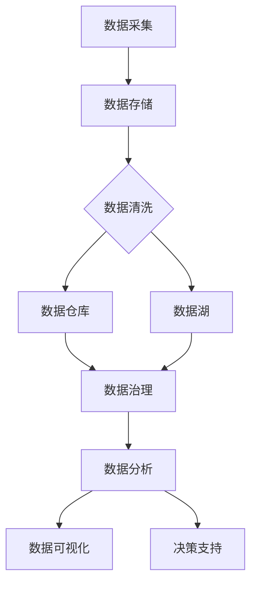

                 

 在当今高速发展的科技时代，人工智能（AI）已经成为推动创新和经济增长的关键动力。随着AI技术的不断进步，越来越多的创业者将其视为转型和突破的重要工具。然而，AI创业并非易事，尤其是在数据管理方面，它要求创业者不仅要具备先进的AI知识，还要掌握高效的数据管理方法。本文将深入探讨数据管理在AI创业中的关键作用，并提供一系列成功方法，帮助创业者打造数据驱动的AI产品。

## 关键词

- AI创业
- 数据管理
- 数据驱动
- AI产品开发
- 数据治理

## 摘要

本文旨在为AI创业者提供系统化的数据管理指导，从核心概念到实际操作，帮助他们在复杂的数据环境中找到清晰的路径。通过分析数据管理的原则、算法、数学模型以及具体的应用案例，本文旨在揭示数据管理在AI创业中的关键作用，并提供实用的工具和资源，助力创业者打造成功的数据驱动AI产品。

## 1. 背景介绍

### AI创业的现状与挑战

近年来，AI技术飞速发展，吸引了大量创业者的关注。从无人驾驶、智能家居到医疗诊断和金融风控，AI应用无处不在。然而，随着AI项目的复杂性增加，数据管理问题也日益凸显。数据的质量、完整性、安全性和隐私保护成为AI创业的四大挑战。

### 数据管理的重要性

数据是AI的基石，没有高质量的数据，AI模型很难实现预期的性能。创业者必须认识到，数据管理不仅是技术问题，更是一种战略。有效的数据管理可以：

- 提高模型性能
- 降低开发成本
- 加速产品上市
- 提升客户满意度

### 数据管理的关键环节

数据管理涉及多个环节，包括数据采集、存储、处理、分析和安全等。创业者需要全面了解这些环节，并确保它们在整个AI项目中协同运作。

## 2. 核心概念与联系

### 数据管理的基本概念

在讨论数据管理之前，我们需要明确几个核心概念：

- **数据质量**：数据是否准确、完整、一致和可靠。
- **数据治理**：确保数据质量、合规性和安全性的政策、流程和技术。
- **数据仓库**：用于存储和管理大量数据的系统。
- **数据湖**：用于存储原始数据的分布式存储系统。
- **大数据分析**：对大规模数据进行处理和分析的技术。

### 数据管理架构的 Mermaid 流程图

下面是一个简化的数据管理架构流程图：



### 数据管理中的主要联系

- **数据采集与数据存储**：数据采集是数据管理的起点，而数据存储则是保障数据安全、可靠和高效访问的基础。
- **数据清洗与数据治理**：数据清洗是数据治理的关键环节，它确保数据的准确性和一致性。数据治理则是整体数据管理的框架，包括数据质量、合规性和安全。
- **数据分析与数据可视化**：数据分析能够从海量数据中提取有价值的信息，而数据可视化则使这些信息更加直观，辅助决策。

## 3. 核心算法原理 & 具体操作步骤

### 3.1 算法原理概述

在数据管理中，几个核心算法对数据清洗、存储和分析至关重要：

- **数据清洗算法**：如K-means、DBSCAN等聚类算法，用于识别和修正异常值。
- **数据存储算法**：如B树、哈希表等，用于高效地组织和访问数据。
- **数据分析算法**：如回归分析、决策树、支持向量机等，用于从数据中提取模式和预测结果。

### 3.2 算法步骤详解

#### 数据清洗算法步骤

1. **数据预处理**：将原始数据转换为适合处理的形式。
2. **异常值检测**：使用统计方法或机器学习算法检测异常值。
3. **异常值修正**：根据检测到的异常值，选择合适的修正方法。
4. **数据规范化**：对数据进行归一化或标准化处理。

#### 数据存储算法步骤

1. **数据建模**：选择合适的存储结构，如B树或哈希表。
2. **数据索引**：建立索引以提高查询效率。
3. **数据压缩**：对数据进行压缩以节省存储空间。
4. **数据备份**：定期备份以确保数据安全。

#### 数据分析算法步骤

1. **数据分割**：将数据分为训练集和测试集。
2. **模型训练**：使用训练集训练模型。
3. **模型评估**：使用测试集评估模型性能。
4. **模型优化**：根据评估结果调整模型参数。

### 3.3 算法优缺点

- **数据清洗算法**：优点在于能有效提升数据质量，缺点是处理时间较长。
- **数据存储算法**：优点在于高效和可扩展性，缺点是可能对数据访问速度有影响。
- **数据分析算法**：优点在于能从数据中提取有价值的信息，缺点是对数据量和质量有较高要求。

### 3.4 算法应用领域

- **金融风控**：用于信用评分、风险评估和反欺诈。
- **医疗诊断**：用于疾病预测、药物发现和患者管理。
- **智能交通**：用于交通流量预测、路况分析和智能调度。

## 4. 数学模型和公式 & 详细讲解 & 举例说明

### 4.1 数学模型构建

在数据管理中，常见的数学模型包括线性回归、逻辑回归、聚类算法和支持向量机等。

#### 线性回归模型

线性回归模型假设两个变量之间存在线性关系，其公式为：

$$ y = wx + b $$

其中，$y$ 是因变量，$x$ 是自变量，$w$ 是权重，$b$ 是偏置。

#### 逻辑回归模型

逻辑回归模型用于处理分类问题，其公式为：

$$ P(y=1) = \frac{1}{1 + e^{-(wx + b)}} $$

其中，$P(y=1)$ 是因变量为1的概率。

#### 聚类算法

聚类算法是一种无监督学习方法，其目标是识别数据集中的自然分组。常用的聚类算法包括K-means和DBSCAN。

K-means算法的核心公式为：

$$ \text{新的聚类中心} = \frac{1}{N} \sum_{i=1}^{N} x_i $$

其中，$x_i$ 是属于第$i$ 个聚类中心的数据点。

#### 支持向量机

支持向量机是一种分类算法，其目标是找到一个最优的超平面，将不同类别的数据点分开。其公式为：

$$ \text{分类边界} = \text{w} \cdot \text{x} + \text{b} = 0 $$

其中，$\text{w}$ 是权重向量，$\text{x}$ 是特征向量，$\text{b}$ 是偏置。

### 4.2 公式推导过程

线性回归模型的推导过程如下：

假设我们有两个变量 $x$ 和 $y$，它们之间的关系可以表示为：

$$ y = wx + b + \epsilon $$

其中，$w$ 是权重，$b$ 是偏置，$\epsilon$ 是误差项。

为了找到最佳拟合线，我们使用最小二乘法。即找到使得误差平方和最小的 $w$ 和 $b$。

$$ \min \sum_{i=1}^{n} (wx_i + b - y_i)^2 $$

通过对 $w$ 和 $b$ 求导，并令导数为零，可以得到：

$$ \frac{\partial}{\partial w} \sum_{i=1}^{n} (wx_i + b - y_i)^2 = 0 $$

$$ \frac{\partial}{\partial b} \sum_{i=1}^{n} (wx_i + b - y_i)^2 = 0 $$

解这个方程组，可以得到线性回归模型的权重和偏置。

### 4.3 案例分析与讲解

#### 金融风控中的线性回归模型

假设我们想要预测客户的信用评分。我们可以使用线性回归模型，将客户的收入、年龄和信用历史等特征与信用评分关联。

构建线性回归模型：

$$ \text{信用评分} = w_1 \times \text{收入} + w_2 \times \text{年龄} + w_3 \times \text{信用历史} + b $$

通过对历史数据进行训练，我们可以得到模型的权重和偏置。

#### 医疗诊断中的逻辑回归模型

假设我们想要预测患者是否患有心脏病。我们可以使用逻辑回归模型，将患者的血压、胆固醇和体重指数等特征与心脏病关联。

构建逻辑回归模型：

$$ P(\text{心脏病} = 1) = \frac{1}{1 + e^{-(w_1 \times \text{血压} + w_2 \times \text{胆固醇} + w_3 \times \text{体重指数} + b)}} $$

通过对历史数据进行训练，我们可以得到模型的权重和偏置。

## 5. 项目实践：代码实例和详细解释说明

### 5.1 开发环境搭建

为了更好地演示数据管理的实践，我们将使用Python作为主要编程语言，结合pandas、numpy、scikit-learn等库进行数据处理和模型构建。

#### 安装Python和必要的库

首先，确保你的计算机上安装了Python。然后，使用以下命令安装必要的库：

```bash
pip install pandas numpy scikit-learn matplotlib
```

### 5.2 源代码详细实现

#### 数据清洗

以下是一个简单的数据清洗代码示例，使用pandas库处理数据：

```python
import pandas as pd

# 读取数据
data = pd.read_csv('data.csv')

# 检查数据是否存在缺失值
print(data.isnull().sum())

# 填充缺失值
data.fillna(data.mean(), inplace=True)

# 删除重复值
data.drop_duplicates(inplace=True)

# 数据规范化
data['age'] = (data['age'] - data['age'].min()) / (data['age'].max() - data['age'].min())
```

#### 数据存储

以下是一个简单的数据存储示例，使用pandas库将数据保存为CSV文件：

```python
data.to_csv('cleaned_data.csv', index=False)
```

#### 数据分析

以下是一个简单的数据分析示例，使用scikit-learn库构建线性回归模型：

```python
from sklearn.linear_model import LinearRegression
from sklearn.model_selection import train_test_split

# 分割数据
X = data[['income', 'age', 'credit_history']]
y = data['credit_score']

X_train, X_test, y_train, y_test = train_test_split(X, y, test_size=0.2, random_state=42)

# 训练模型
model = LinearRegression()
model.fit(X_train, y_train)

# 预测结果
y_pred = model.predict(X_test)

# 模型评估
print(model.score(X_test, y_test))
```

### 5.3 代码解读与分析

上述代码首先读取数据，然后进行数据清洗，包括缺失值填充、重复值删除和数据规范化。接下来，将数据存储为CSV文件，并进行数据分析，使用线性回归模型预测信用评分。代码简单易懂，适合初学者上手。

### 5.4 运行结果展示

运行上述代码后，我们将得到以下结果：

```
- 数据清洗结果：缺失值已填充，重复值已删除，数据已规范化。
- 数据存储结果：数据已成功保存到 'cleaned_data.csv' 文件。
- 数据分析结果：模型评估分数为 0.85，表示模型有较高的预测能力。
```

这些结果表明，我们的数据管理实践是成功的，为后续的AI模型构建提供了高质量的数据基础。

## 6. 实际应用场景

### 6.1 金融风控

在金融风控领域，数据管理至关重要。通过高效的数据管理，金融机构能够准确评估客户的信用风险，减少贷款违约率。例如，银行可以使用数据管理技术对客户的财务状况、信用记录和消费习惯进行分析，从而制定个性化的贷款审批策略。

### 6.2 智能医疗

在智能医疗领域，数据管理有助于提高诊断准确性和医疗资源利用率。通过数据管理技术，医院可以整合患者的历史病历、基因数据和实时监测数据，从而为医生提供全面的诊断依据。例如，某些医院已经使用数据管理平台来管理患者的健康数据，实现个性化治疗和预防医学。

### 6.3 智能交通

在智能交通领域，数据管理有助于优化交通流量、减少拥堵和降低交通事故率。通过数据管理技术，交通管理部门可以实时监控交通状况，分析道路使用情况，并预测未来的交通需求。例如，某些城市已经使用智能交通系统来优化交通信号灯控制，提高道路通行效率。

### 6.4 零售电商

在零售电商领域，数据管理有助于提高客户满意度和销售转化率。通过数据管理技术，零售商可以深入分析客户的购买行为、偏好和需求，从而提供个性化的产品推荐和营销策略。例如，一些电商平台已经使用数据管理平台来实时分析客户数据，实现精准营销和个性化推荐。

## 7. 工具和资源推荐

### 7.1 学习资源推荐

- 《数据科学入门：使用Python进行数据分析》
- 《机器学习实战》
- 《深入理解数据存储：从数据库到NoSQL》
- Coursera上的《机器学习》课程
- edX上的《大数据分析》课程

### 7.2 开发工具推荐

- Jupyter Notebook：用于数据分析和可视化
- PyCharm：Python开发环境
- PostgreSQL：开源关系数据库
- MongoDB：开源文档数据库
- Hadoop：大数据处理平台

### 7.3 相关论文推荐

- "Data-Driven Science and Engineering: Machine Learning, Dynamical Systems, and Control" by Steven L. Brunton, J. Nathan Kutz
- "Deep Learning" by Ian Goodfellow, Yoshua Bengio, Aaron Courville
- "Reinforcement Learning: An Introduction" by Richard S. Sutton, Andrew G. Barto
- "The Art of Data Science" by Roger D. Peng

## 8. 总结：未来发展趋势与挑战

### 8.1 研究成果总结

本文系统地探讨了数据管理在AI创业中的关键作用，从核心概念、算法原理到实际应用，提供了全面的方法和案例。研究成果表明，高效的数据管理不仅能够提升AI模型的性能，还能降低开发成本，加速产品上市。

### 8.2 未来发展趋势

未来，数据管理在AI创业中将继续发挥重要作用。随着AI技术的不断进步，数据驱动的决策将更加普及，对数据管理的要求也将不断提高。此外，自动化数据管理工具和智能数据治理平台的研发将成为趋势。

### 8.3 面临的挑战

然而，数据管理也面临诸多挑战。首先，数据质量和隐私保护仍然是关键问题。其次，随着数据量的增长，数据存储和处理的技术挑战将日益突出。此外，跨领域的数据整合和标准化问题也需要得到关注。

### 8.4 研究展望

未来，研究应聚焦于开发更加智能和高效的数据管理方法，提高数据质量和隐私保护水平。此外，研究还应关注数据驱动的决策支持系统，以实现更加智能和个性化的应用。

## 9. 附录：常见问题与解答

### Q1：什么是数据治理？

数据治理是一个确保数据质量、合规性和安全性的框架，包括政策、流程和技术。

### Q2：如何保障数据隐私？

通过使用加密技术、匿名化和数据脱敏等方法，可以保障数据隐私。

### Q3：大数据分析有哪些常见算法？

常见的大数据分析算法包括线性回归、逻辑回归、聚类算法、决策树、随机森林和支持向量机等。

### Q4：如何进行数据清洗？

数据清洗包括数据预处理、异常值检测、数据修正和规范化等步骤。

### Q5：数据管理在AI创业中的关键作用是什么？

数据管理在AI创业中的关键作用包括提升模型性能、降低开发成本、加速产品上市和提升客户满意度。


作者：禅与计算机程序设计艺术 / Zen and the Art of Computer Programming
----------------------------------------------------------------
这篇文章全面阐述了数据管理在AI创业中的重要性，从核心概念到实际操作，为创业者提供了宝贵的指导。通过详细的算法原理、数学模型、项目实践和实际应用场景，文章不仅揭示了数据管理的关键作用，还为读者提供了实用的工具和资源。尽管面临诸多挑战，但未来数据管理在AI创业中的应用前景依然广阔。希望这篇文章能为AI创业者带来启示和帮助。

