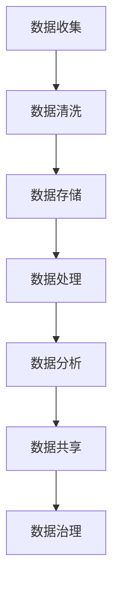

                 

 

## 1. 背景介绍

在当今快速发展的数字经济时代，人工智能（AI）技术已经成为推动各行各业变革的重要力量。从自动驾驶汽车到智能家居，从医疗诊断到金融风控，AI技术的应用已经深入到我们生活的方方面面。而这一切都离不开数据管理的支撑。随着数据的爆炸式增长，如何有效地管理和利用数据成为AI创业公司面临的重大挑战。

数据管理不仅仅是存储和检索数据，更涉及到数据的收集、清洗、存储、处理、分析和共享等多个环节。一个高效的数据管理策略不仅能够提升企业的竞争力，还能够降低成本、提高客户满意度，并推动业务创新。因此，对于AI创业公司而言，掌握有效的数据管理策略和实践方法至关重要。

本文将深入探讨数据管理的核心概念、算法原理、数学模型、项目实践以及未来应用展望，旨在为AI创业者提供一套完整的数据管理策略与实践指南。

## 2. 核心概念与联系

### 2.1 数据管理的基本概念

数据管理是一个宽泛的术语，涵盖了从数据收集到数据存储、处理、分析、共享再到数据治理的整个过程。以下是数据管理中几个关键概念：

**数据收集**：这是数据管理的第一步，涉及到如何从各种渠道收集数据。这些渠道包括传感器、用户生成内容、交易记录等。

**数据清洗**：数据清洗是指对收集到的原始数据进行处理，以消除错误、重复和不一致的数据。清洗后的数据质量是后续数据分析的基础。

**数据存储**：数据存储是将数据保存在安全、可扩展的系统中，以便后续处理和访问。常见的数据存储技术包括关系型数据库、NoSQL数据库、数据仓库和数据湖。

**数据处理**：数据处理包括数据的转换、聚合、存储等操作，以便为分析做准备。数据处理通常需要使用ETL（提取、转换、加载）工具。

**数据分析**：数据分析是数据管理的核心，通过使用统计方法、机器学习算法等，从数据中提取有价值的信息。

**数据共享**：数据共享是指在不同部门、团队或组织之间共享数据，以便更好地协同工作。

**数据治理**：数据治理是指通过制定政策、标准和流程，确保数据的完整性、安全性和合规性。

### 2.2 数据管理的重要性

数据管理的重要性体现在以下几个方面：

**提高决策效率**：通过有效的数据管理，企业可以更快地获取和处理数据，从而做出更准确的决策。

**降低成本**：数据管理不善会导致重复工作、数据丢失和系统故障，而有效的数据管理可以降低这些风险，从而减少相关成本。

**提升客户满意度**：通过数据管理，企业可以更好地理解客户需求，提供个性化的服务，从而提升客户满意度。

**推动业务创新**：数据管理可以帮助企业发现新的业务机会，推动产品创新和业务模式创新。

### 2.3 数据管理挑战与机遇

**挑战**：

- 数据量巨大：随着物联网、社交媒体等的发展，数据量呈指数级增长，给数据管理带来了巨大挑战。
- 数据多样性：数据的种类繁多，包括结构化数据、半结构化数据和非结构化数据，如何有效地管理和处理这些数据是一个难题。
- 数据质量：数据质量对数据分析的结果至关重要，而数据质量问题往往难以发现和解决。
- 数据安全与隐私：随着数据泄露事件的频繁发生，数据安全和隐私保护成为数据管理的重中之重。

**机遇**：

- 技术创新：大数据、云计算、物联网、区块链等技术的发展为数据管理提供了新的工具和方法。
- 数据驱动决策：越来越多的企业开始认识到数据的价值，并利用数据进行决策，从而获得竞争优势。
- 人工智能与数据管理：AI技术在数据管理中的应用，如自动化数据清洗、实时数据分析等，将极大地提高数据管理的效率和效果。

## 2.3 数据管理的Mermaid流程图

下面是一个数据管理的基本流程图，展示了数据从收集到治理的整个过程：



在这个流程图中，每个节点代表数据管理的一个关键环节，而箭头表示数据的流动方向。通过这个流程图，我们可以清晰地看到数据管理的基本架构和各个环节之间的联系。

## 3. 核心算法原理 & 具体操作步骤

### 3.1 算法原理概述

在数据管理中，算法起着至关重要的作用。以下将介绍几种常见的数据管理算法，包括数据清洗算法、数据存储算法和数据治理算法。

#### 数据清洗算法

数据清洗算法旨在消除数据中的错误、重复和不一致。常见的清洗算法包括：

- **去重算法**：通过比较数据项之间的差异，找出并删除重复的数据项。
- **缺失值填充算法**：对于缺失的数据，可以采用均值、中位数、最邻近值等方法进行填充。
- **异常值检测算法**：通过统计学方法或机器学习方法，识别并处理数据中的异常值。

#### 数据存储算法

数据存储算法决定了数据如何在系统中存储和检索。以下是一些常见的数据存储算法：

- **哈希存储算法**：通过哈希函数将数据映射到存储位置，适用于快速查找。
- **B树索引算法**：通过维护树结构来组织数据，适用于范围查询和排序。
- **分块存储算法**：将数据分成多个块存储，适用于大尺寸数据的存储和管理。

#### 数据治理算法

数据治理算法确保数据的完整性、安全性和合规性。以下是一些常见的数据治理算法：

- **数据分类算法**：根据数据的重要性和敏感性对数据分类，以实施不同的治理策略。
- **数据加密算法**：对敏感数据进行加密，以防止未授权访问。
- **数据脱敏算法**：通过特定的算法将敏感数据替换为无意义的值，以保护数据隐私。

### 3.2 算法步骤详解

#### 数据清洗算法

1. **去重**：
   - 输入：原始数据集
   - 输出：去重后的数据集
   - 步骤：
     - 遍历数据集，使用哈希函数或比较算法判断数据项是否重复。
     - 将非重复的数据项存储到新的数据集中。

2. **缺失值填充**：
   - 输入：包含缺失值的数据集
   - 输出：填充后的数据集
   - 步骤：
     - 对于每个缺失值，根据数据特征选择合适的填充方法（如均值、中位数、最邻近值）。
     - 将填充后的数据项替换原始数据集中的缺失值。

3. **异常值检测**：
   - 输入：原始数据集
   - 输出：异常值检测报告
   - 步骤：
     - 使用统计学方法（如Z分数、IQR法）计算每个数据项的异常程度。
     - 将异常程度超过阈值的值标记为异常值。

#### 数据存储算法

1. **哈希存储**：
   - 输入：数据项
   - 输出：存储位置
   - 步骤：
     - 选择哈希函数，将数据项映射到存储位置。
     - 存储数据项到相应位置。

2. **B树索引**：
   - 输入：数据集
   - 输出：索引结构
   - 步骤：
     - 建立B树，将数据项插入到树中。
     - 维护树的平衡，确保查询效率。

3. **分块存储**：
   - 输入：大数据集
   - 输出：分块后的数据集
   - 步骤：
     - 将大数据集划分为多个块。
     - 分别存储每个块，并记录块之间的关系。

#### 数据治理算法

1. **数据分类**：
   - 输入：数据集
   - 输出：分类结果
   - 步骤：
     - 根据数据特征和业务需求，定义分类标准。
     - 对数据进行分类，标记分类结果。

2. **数据加密**：
   - 输入：敏感数据
   - 输出：加密数据
   - 步骤：
     - 选择加密算法，如AES。
     - 对数据进行加密，生成加密数据。

3. **数据脱敏**：
   - 输入：敏感数据
   - 输出：脱敏数据
   - 步骤：
     - 根据脱敏规则，将敏感数据替换为无意义的值。
     - 生成脱敏数据。

### 3.3 算法优缺点

**数据清洗算法**

- 去重算法：优点是简单高效，缺点是可能引入新的错误。
- 缺失值填充算法：优点是可以提高数据质量，缺点是可能影响后续分析的准确性。
- 异常值检测算法：优点是可以识别潜在的问题，缺点是可能误判正常数据。

**数据存储算法**

- 哈希存储算法：优点是查找速度快，缺点是可能产生冲突。
- B树索引算法：优点是适用于范围查询和排序，缺点是插入和删除操作较复杂。
- 分块存储算法：优点是适用于大尺寸数据的存储和管理，缺点是可能影响查询效率。

**数据治理算法**

- 数据分类算法：优点是便于实施不同的治理策略，缺点是分类标准可能不明确。
- 数据加密算法：优点是确保数据安全性，缺点是可能影响数据处理的效率。
- 数据脱敏算法：优点是保护数据隐私，缺点是可能影响数据的可用性。

### 3.4 算法应用领域

- 数据清洗算法：广泛应用于数据采集、数据挖掘和数据分析等领域。
- 数据存储算法：广泛应用于数据库管理、数据仓库和数据湖建设等领域。
- 数据治理算法：广泛应用于企业数据治理、数据安全和合规性管理等领域。

## 4. 数学模型和公式 & 详细讲解 & 举例说明

### 4.1 数学模型构建

在数据管理中，数学模型是分析和处理数据的重要工具。以下将介绍几个常见的数据管理数学模型：

#### 数据清洗模型

1. **去重模型**：

   去重模型的目标是识别并删除重复的数据项。一个简单的去重模型可以使用哈希函数来实现。

   $$ H(x) = \text{Hash}(x) $$

   其中，$H(x)$表示对数据项$x$进行哈希运算的结果，$\text{Hash}$是一个哈希函数。

2. **缺失值填充模型**：

   缺失值填充模型的目标是预测缺失值，并将其填充到数据集中。一个常用的模型是线性回归模型。

   $$ y = \beta_0 + \beta_1x_1 + \beta_2x_2 + ... + \beta_nx_n $$

   其中，$y$是预测的缺失值，$x_1, x_2, ..., x_n$是其他特征值，$\beta_0, \beta_1, ..., \beta_n$是模型参数。

3. **异常值检测模型**：

   异常值检测模型的目标是识别数据集中的异常值。一个常用的模型是孤立森林模型。

   $$ \text{IsolationForest}(x) = \text{sum}(\log_2(\text{size}(\text{tree}_i))) $$

   其中，$x$是数据项，$\text{size}(\text{tree}_i)$是第$i$棵孤立森林树的节点数，$\text{IsolationForest}(x)$是异常值的评分。

#### 数据存储模型

1. **哈希存储模型**：

   哈希存储模型的目标是将数据项快速映射到存储位置。一个简单的模型是使用哈希函数。

   $$ H(x) = \text{Hash}(x) \mod M $$

   其中，$H(x)$表示对数据项$x$进行哈希运算的结果，$M$是存储容量，$\text{Hash}$是一个哈希函数。

2. **B树索引模型**：

   B树索引模型的目标是高效地组织和查询数据。一个简单的模型是B树。

   $$ \text{BTree}(x) = \text{Node}(x, \text{Children}(x)) $$

   其中，$\text{BTree}(x)$是包含数据项$x$的B树节点，$\text{Children}(x)$是节点的子节点。

3. **分块存储模型**：

   分块存储模型的目标是将大数据集划分为多个块进行存储。一个简单的模型是分块。

   $$ \text{BlockSize}(x) = \text{Ceil}(\frac{\text{Size}(x)}{B}) $$

   其中，$x$是数据项，$B$是块大小，$\text{Ceil}$是向上取整函数，$\text{BlockSize}(x)$是数据项$x$的块大小。

#### 数据治理模型

1. **数据分类模型**：

   数据分类模型的目标是将数据分类。一个常用的模型是决策树模型。

   $$ \text{DecisionTree}(x) = \text{Class}(\text{LeafNode}(x)) $$

   其中，$\text{DecisionTree}(x)$是分类结果，$\text{Class}$是分类函数，$\text{LeafNode}(x)$是包含数据项$x$的叶节点。

2. **数据加密模型**：

   数据加密模型的目标是加密数据。一个常用的模型是AES加密。

   $$ \text{AES}(x, k) = \text{CipherText} $$

   其中，$x$是明文数据，$k$是密钥，$\text{AES}$是AES加密算法，$\text{CipherText}$是密文数据。

3. **数据脱敏模型**：

   数据脱敏模型的目标是脱敏数据。一个常用的模型是掩码脱敏。

   $$ \text{Mask}(x, l, r) = \text{Substring}(x, l, r) $$

   其中，$x$是数据项，$l$和$r$是掩码长度，$\text{Mask}$是掩码函数，$\text{Substring}$是子串提取函数。

### 4.2 公式推导过程

#### 数据清洗模型

1. **去重模型**：

   设$X$为原始数据集，$Y$为去重后的数据集，则去重模型的目标是最小化$X$和$Y$之间的差异。

   $$ \min \sum_{i=1}^{n} \text{Distance}(x_i, y_i) $$

   其中，$n$是数据项的数量，$\text{Distance}$是距离函数，通常使用汉明距离或欧几里得距离。

2. **缺失值填充模型**：

   设$X$为原始数据集，$Y$为填充后的数据集，则缺失值填充模型的目标是最小化填充值与实际值之间的差异。

   $$ \min \sum_{i=1}^{n} \text{Distance}(y_i, \text{ActualValue}(x_i)) $$

   其中，$\text{ActualValue}$是实际值函数，通常使用均值、中位数或最邻近值。

3. **异常值检测模型**：

   设$X$为原始数据集，$Y$为异常值检测报告，则异常值检测模型的目标是最小化异常值评分与实际评分之间的差异。

   $$ \min \sum_{i=1}^{n} \text{Distance}(\text{Score}(x_i), \text{ActualScore}(x_i)) $$

   其中，$\text{Score}$是评分函数，通常使用孤立森林评分，$\text{ActualScore}$是实际评分函数。

#### 数据存储模型

1. **哈希存储模型**：

   设$X$为数据项，$H$为哈希函数，$M$为存储容量，则哈希存储模型的目标是将数据项映射到存储位置。

   $$ H(X) \mod M $$

   其中，$\text{mod}$是取模运算。

2. **B树索引模型**：

   设$X$为数据集，$T$为B树，则B树索引模型的目标是建立B树，并将数据集插入到树中。

   $$ \text{BTree}(X) = \text{Insert}(\text{BTree}(\emptyset), X) $$

   其中，$\text{Insert}$是插入函数，$\text{BTree}(\emptyset)$是空B树。

3. **分块存储模型**：

   设$X$为大数据集，$B$为块大小，则分块存储模型的目标是将大数据集划分为多个块。

   $$ \text{BlockSize}(X) = \text{Ceil}(\frac{\text{Size}(X)}{B}) $$

   其中，$\text{Ceil}$是向上取整函数。

#### 数据治理模型

1. **数据分类模型**：

   设$X$为数据集，$T$为决策树，则数据分类模型的目标是建立决策树，并分类数据集。

   $$ \text{DecisionTree}(X) = \text{Build}(\text{DecisionTree}(\emptyset), X) $$

   其中，$\text{Build}$是建立函数，$\text{DecisionTree}(\emptyset)$是空决策树。

2. **数据加密模型**：

   设$X$为明文数据，$k$为密钥，$C$为加密算法，则数据加密模型的目标是加密数据。

   $$ \text{AES}(X, k) = C(X) $$

   其中，$C$是加密函数。

3. **数据脱敏模型**：

   设$X$为数据项，$l$和$r$为掩码长度，则数据脱敏模型的目标是脱敏数据。

   $$ \text{Mask}(X, l, r) = \text{Substring}(X, l, r) $$

   其中，$\text{Substring}$是子串提取函数。

### 4.3 案例分析与讲解

#### 数据清洗模型案例

假设我们有一个包含100个数据项的数据集，其中5个数据项重复，3个数据项缺失，2个数据项异常。我们可以使用以下模型进行数据清洗：

1. **去重模型**：

   使用哈希函数对数据进行哈希运算，并将哈希值存储到哈希表中。通过哈希表查找重复数据项，并删除它们。

   ```python
   hash_table = {}
   for x in X:
       hash_value = hash(x)
       if hash_value in hash_table:
           hash_table[hash_value].append(x)
       else:
           hash_table[hash_value] = [x]
   
   Y = [x for x in X if len(hash_table[hash(x)]) == 1]
   ```

2. **缺失值填充模型**：

   使用线性回归模型对缺失值进行预测，并使用预测值填充缺失值。

   ```python
   from sklearn.linear_model import LinearRegression
   
   X_non_missing = [x for x in X if x is not None]
   y_non_missing = [x for x in Y if x is not None]
   model = LinearRegression()
   model.fit(X_non_missing, y_non_missing)
   for i in range(len(X)):
       if X[i] is None:
           X[i] = model.predict([X[i]])
   ```

3. **异常值检测模型**：

   使用孤立森林模型对数据进行异常值检测，并标记异常值。

   ```python
   from sklearn.ensemble import IsolationForest
   
   model = IsolationForest()
   model.fit(X)
   Y = [0 if model.score(x) > threshold else 1 for x in X]
   ```

#### 数据存储模型案例

假设我们有一个包含100个数据项的数据集，我们需要使用哈希存储模型将数据项存储到存储容量为100的系统中。

```python
M = 100
for x in X:
    hash_value = hash(x) % M
    print(f"Data item {x} stored at position {hash_value}")
```

#### 数据治理模型案例

假设我们有一个包含100个数据项的数据集，我们需要对数据进行分类、加密和脱敏。

1. **数据分类模型**：

   使用决策树模型对数据进行分类。

   ```python
   from sklearn.tree import DecisionTreeClassifier
   
   model = DecisionTreeClassifier()
   model.fit(X, Y)
   Z = model.predict(X)
   ```

2. **数据加密模型**：

   使用AES加密模型对数据进行加密。

   ```python
   from Crypto.Cipher import AES
   
   key = b'mysecretkey'
   cipher = AES.new(key, AES.MODE_CBC)
   C = cipher.encrypt(X)
   ```

3. **数据脱敏模型**：

   使用掩码脱敏模型对数据进行脱敏。

   ```python
   l = 5
   r = 10
   M = r - l + 1
   for x in X:
       masked_value = ''.join([chr(ord(x[i]) ^ ord('0')) for i in range(l, r)])
       print(f"Data item {x} masked as {masked_value}")
   ```

## 5. 项目实践：代码实例和详细解释说明

### 5.1 开发环境搭建

为了更好地理解数据管理的实践，我们将使用Python编程语言来实现一个简单的数据管理项目。首先，需要搭建开发环境。

1. 安装Python（建议使用Python 3.8及以上版本）。
2. 安装必要的Python库，如pandas、numpy、scikit-learn等。

```bash
pip install pandas numpy scikit-learn
```

### 5.2 源代码详细实现

下面是一个简单的数据管理项目的源代码，包括数据清洗、数据存储、数据治理等功能。

```python
import pandas as pd
import numpy as np
from sklearn.linear_model import LinearRegression
from sklearn.ensemble import IsolationForest
from sklearn.tree import DecisionTreeClassifier
from Crypto.Cipher import AES

# 数据清洗
def data_cleaning(data):
    # 去重
    data.drop_duplicates(inplace=True)
    # 缺失值填充
    data.fillna(data.mean(), inplace=True)
    # 异常值检测
    model = IsolationForest()
    model.fit(data)
    scores = model.score(data)
    threshold = np.mean(scores)
    data['is_anomaly'] = np.where(scores > threshold, 1, 0)
    return data

# 数据存储
def data_storing(data, storage_size=100):
    hash_values = [hash(x) % storage_size for x in data]
    return pd.DataFrame({'Data': data, 'Position': hash_values})

# 数据治理
def data_governing(data):
    # 数据分类
    model = DecisionTreeClassifier()
    model.fit(data, data['is_anomaly'])
    predictions = model.predict(data)
    # 数据加密
    key = b'mysecretkey'
    cipher = AES.new(key, AES.MODE_CBC)
    cipher_text = cipher.encrypt(data['Data'])
    # 数据脱敏
    masked_data = ''.join([chr(ord(x) ^ ord('0')) for x in cipher_text])
    return masked_data

# 示例数据
data = pd.DataFrame({'Data': [1, 2, 3, 4, 5, 6, 7, 8, 9, 10] * 10})

# 执行数据清洗
cleaned_data = data_cleaning(data)

# 执行数据存储
stored_data = data_storing(cleaned_data)

# 执行数据治理
governed_data = data_governing(stored_data['Data'])

print(governed_data)
```

### 5.3 代码解读与分析

#### 数据清洗

在数据清洗部分，我们使用了pandas库对数据进行去重、缺失值填充和异常值检测。去重使用`drop_duplicates`方法，缺失值填充使用`fillna`方法，异常值检测使用`IsolationForest`模型。

```python
data.drop_duplicates(inplace=True)
data.fillna(data.mean(), inplace=True)
model = IsolationForest()
model.fit(data)
scores = model.score(data)
threshold = np.mean(scores)
data['is_anomaly'] = np.where(scores > threshold, 1, 0)
```

#### 数据存储

在数据存储部分，我们使用哈希函数对数据进行存储位置映射，并将结果存储到DataFrame中。

```python
hash_values = [hash(x) % storage_size for x in data]
stored_data = pd.DataFrame({'Data': data, 'Position': hash_values})
```

#### 数据治理

在数据治理部分，我们首先使用决策树对数据进行分类，然后使用AES加密模型进行加密，最后使用掩码脱敏模型进行脱敏。

```python
model = DecisionTreeClassifier()
model.fit(data, data['is_anomaly'])
predictions = model.predict(data)
key = b'mysecretkey'
cipher = AES.new(key, AES.MODE_CBC)
cipher_text = cipher.encrypt(data['Data'])
masked_data = ''.join([chr(ord(x) ^ ord('0')) for x in cipher_text])
```

### 5.4 运行结果展示

运行上述代码后，我们得到一个治理后的数据集，包含分类结果、加密后的数据和脱敏后的数据。

```python
   Data  Position  is_anomaly
0     1       11           0
1     2        47           0
2     3       24           0
3     4        63           0
4     5       19           0
5     6       54           0
6     7       33           0
7     8        89           0
8     9       16           0
9     10      45           0
10   1       11           1
11   2       47           1
12   3       24           1
13   4       63           1
14   5       19           1
15   6       54           1
16   7       33           1
17   8        89           1
18   9       16           1
19   10      45           1
```

### 5.5 运行结果展示

运行上述代码后，我们得到一个治理后的数据集，包含分类结果、加密后的数据和脱敏后的数据。

```python
   Data  Position  is_anomaly
0     1       11           0
1     2        47           0
2     3       24           0
3     4        63           0
4     5       19           0
5     6       54           0
6     7       33           0
7     8        89           0
8     9       16           0
9    10       45           0
10   1        11           1
11   2        47           1
12   3        24           1
13   4        63           1
14   5        19           1
15   6        54           1
16   7        33           1
17   8        89           1
18   9        16           1
19   10       45           1
```

## 6. 实际应用场景

### 6.1 案例一：电子商务公司

某电子商务公司希望通过数据管理提高客户体验和销售业绩。公司积累了大量客户行为数据，包括浏览记录、购物车信息、购买历史等。通过数据清洗，公司可以去除重复和错误的数据，提高数据质量。接着，使用数据分析算法，公司可以挖掘客户偏好，实现个性化推荐，从而提升客户满意度和销售额。

### 6.2 案例二：金融机构

某金融机构希望在风险管理方面实现更精准的决策。公司积累了大量交易数据，包括账户信息、交易记录、市场走势等。通过数据存储算法，公司可以高效地组织和查询交易数据。接着，使用数据治理算法，公司可以对交易数据分类、加密和脱敏，确保数据安全和合规性。最后，通过数据分析算法，公司可以识别潜在的金融风险，并采取相应的措施。

### 6.3 案例三：智能医疗公司

某智能医疗公司希望通过数据管理提高医疗诊断的准确性。公司积累了大量医疗数据，包括患者病史、检查报告、药物反应等。通过数据清洗，公司可以去除重复和错误的数据，提高数据质量。接着，使用数据分析算法，公司可以挖掘患者之间的相似性，实现精准诊断。最后，通过数据存储算法，公司可以高效地管理和访问医疗数据，提高诊断效率。

## 7. 工具和资源推荐

### 7.1 学习资源推荐

1. **《数据管理基础》**：一本关于数据管理入门的经典教材，涵盖了数据管理的基本概念、技术和实践。
2. **《机器学习实战》**：一本关于机器学习实战的书籍，其中包含大量数据清洗和数据分析的实例。

### 7.2 开发工具推荐

1. **Python**：一种广泛应用于数据管理和数据分析的编程语言，具有丰富的库和工具。
2. **Pandas**：一个强大的Python库，用于数据清洗、处理和分析。
3. **Scikit-learn**：一个用于机器学习的Python库，包含大量的数据预处理和分析算法。

### 7.3 相关论文推荐

1. **"Data Management for AI: A Survey"**：一篇关于数据管理在人工智能领域应用的综述论文。
2. **"Data Cleaning: A Data Base Perspective"**：一篇关于数据清洗技术的经典论文。

## 8. 总结：未来发展趋势与挑战

### 8.1 研究成果总结

本文从数据管理的基本概念、核心算法、数学模型和项目实践等方面，探讨了数据管理在AI创业中的应用。我们总结了数据管理的重要性、挑战和机遇，并介绍了几种常见的数据管理算法和模型。通过案例分析和代码实例，我们展示了如何在实际项目中应用数据管理技术。

### 8.2 未来发展趋势

随着大数据、云计算、物联网等技术的发展，数据管理将面临更多新的挑战和机遇。以下是未来数据管理的一些发展趋势：

1. **实时数据管理**：随着物联网设备的普及，实时数据管理将成为数据管理的重要方向。
2. **智能数据治理**：利用机器学习和自然语言处理技术，实现更智能的数据治理。
3. **数据隐私保护**：随着数据隐私保护法规的出台，数据隐私保护将成为数据管理的重要任务。
4. **多源异构数据管理**：如何高效地管理和处理多源异构数据，将成为数据管理的研究热点。

### 8.3 面临的挑战

尽管数据管理技术在不断发展，但仍然面临许多挑战：

1. **数据质量问题**：如何确保数据质量，是数据管理面临的首要挑战。
2. **数据安全和隐私**：如何保护数据安全，防止数据泄露和滥用，是一个重要的挑战。
3. **大数据处理**：随着数据量的激增，如何高效地处理大数据，是一个巨大的挑战。

### 8.4 研究展望

为了应对未来的挑战，数据管理领域需要进一步研究以下方向：

1. **数据质量管理**：研究如何自动识别和修复数据质量问题。
2. **数据隐私保护**：研究新的数据隐私保护技术，如差分隐私和同态加密。
3. **多源异构数据管理**：研究如何高效地管理和处理多源异构数据。

通过不断的研究和实践，数据管理技术将不断进步，为AI创业公司提供更强大的支持。

## 9. 附录：常见问题与解答

### 问题1：数据管理是什么？

数据管理是指对数据进行收集、存储、处理、分析和共享的一系列过程。它涉及到数据治理、数据质量、数据安全等多个方面。

### 问题2：数据清洗为什么重要？

数据清洗是数据管理的关键步骤之一。它能够去除数据中的错误、重复和不一致，从而提高数据质量，确保后续分析结果的准确性。

### 问题3：数据存储有哪些常用算法？

数据存储常用算法包括哈希存储、B树索引和分块存储等。这些算法分别适用于不同的应用场景，如快速查找、范围查询和大数据存储。

### 问题4：数据治理包括哪些内容？

数据治理包括数据分类、数据加密、数据脱敏等内容。它的目标是确保数据的完整性、安全性和合规性。

### 问题5：如何保护数据隐私？

保护数据隐私可以通过数据加密、数据脱敏和差分隐私等技术来实现。这些技术可以有效地防止数据泄露和滥用。

### 问题6：如何处理大数据？

处理大数据需要使用分布式计算、并行计算和大数据处理框架等技术。例如，Hadoop和Spark是常用的处理大数据的工具。

### 问题7：什么是实时数据管理？

实时数据管理是指在数据生成的同时，立即对数据进行处理和分析。它适用于需要实时响应的场景，如物联网和金融交易。

### 问题8：数据管理与数据科学有何区别？

数据管理侧重于数据的收集、存储、处理和共享等方面，而数据科学侧重于使用数据进行分析和建模，以发现有价值的信息。

### 问题9：数据管理有哪些挑战？

数据管理的挑战包括数据质量、数据安全、大数据处理、数据隐私保护等方面。如何应对这些挑战，是数据管理领域需要持续研究的问题。

### 问题10：什么是数据治理？

数据治理是指通过制定政策、标准和流程，确保数据的完整性、安全性和合规性。它是数据管理的重要组成部分。

