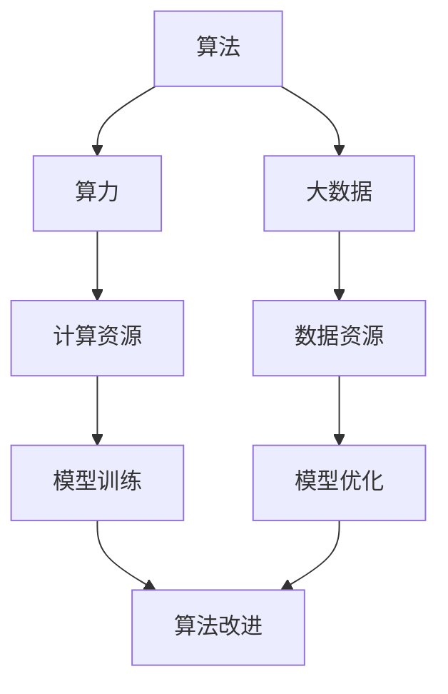

                 

关键词：人工智能、算法、算力、大数据、深度学习、计算资源、数据处理

> 摘要：本文旨在探讨人工智能发展的三大支柱——算法、算力和大数据，分析它们之间的相互关系及其对人工智能发展的重要性。通过对核心概念、算法原理、数学模型、项目实践和未来应用的详细阐述，本文为读者提供了一个全面了解人工智能发展现状与前景的视角。

## 1. 背景介绍

人工智能（AI）作为计算机科学的重要分支，近年来取得了飞速发展。从早期的专家系统到现在的深度学习，AI技术已经广泛应用于各个领域，如图像识别、自然语言处理、医疗诊断、自动驾驶等。随着人工智能的不断发展，算法、算力和大数据成为推动AI进步的三大支柱。

算法是人工智能的核心，决定了AI系统的性能和效率；算力是支撑算法运行的基础设施，提供了计算资源；大数据则为算法提供了丰富的训练数据，使得AI系统能够不断优化和进化。在这三大支柱的推动下，人工智能正逐步实现从理论研究到实际应用的转变。

### 1.1 算法

算法是人工智能的核心，它是指导计算机解决特定问题的步骤集合。在人工智能领域，常见的算法包括机器学习算法、深度学习算法、强化学习算法等。这些算法通过学习数据中的规律，实现对未知数据的预测和决策。

### 1.2 算力

算力是人工智能发展的基础设施，它指的是计算机在单位时间内所能完成的计算任务量。随着人工智能的不断发展，对算力的需求也日益增长。高性能计算（HPC）和云计算等技术的应用，极大地提高了算力水平。

### 1.3 大数据

大数据是人工智能的重要数据来源，它指的是海量、多样、快速产生的数据。在人工智能领域，大数据被用于训练算法、优化模型和提升系统性能。大数据技术包括数据采集、存储、处理和分析等，这些技术的进步为人工智能的发展提供了强有力的支持。

## 2. 核心概念与联系

在人工智能的发展过程中，算法、算力和大数据相互联系，共同推动人工智能的进步。以下是一个简要的Mermaid流程图，展示了这三大核心概念之间的联系。



### 2.1 算法与算力的关系

算法的效率和性能在很大程度上取决于算力。高性能计算（HPC）和云计算等技术的应用，提高了算力水平，使得复杂算法能够快速运行和迭代。同时，算力的提升也为新算法的开发和优化提供了可能。

### 2.2 算法与大数据的关系

大数据为算法提供了丰富的训练数据，使得算法能够从大量数据中学习到更多的规律。深度学习算法尤其依赖于大数据，通过大规模数据的训练，深度学习模型能够实现高度精确的预测和决策。

### 2.3 算力与大数据的关系

算力不仅决定了算法的运行效率，也影响了大数据的处理能力。高性能计算（HPC）和云计算等技术的应用，使得大数据能够在短时间内得到处理和分析。同时，算力的提升也为大数据技术的进一步发展提供了支持。

## 3. 核心算法原理 & 具体操作步骤

### 3.1 算法原理概述

在人工智能领域，常见的算法包括机器学习算法、深度学习算法和强化学习算法。以下是对这些算法的简要概述。

### 3.1.1 机器学习算法

机器学习算法通过学习数据中的规律，实现对未知数据的预测和决策。常见的机器学习算法包括线性回归、决策树、支持向量机、神经网络等。

### 3.1.2 深度学习算法

深度学习算法是一种基于多层神经网络的学习方法，通过学习大量数据，实现高度复杂的特征提取和建模。常见的深度学习算法包括卷积神经网络（CNN）、循环神经网络（RNN）、生成对抗网络（GAN）等。

### 3.1.3 强化学习算法

强化学习算法通过试错和反馈机制，学习在特定环境中实现目标的策略。常见的强化学习算法包括Q学习、深度Q网络（DQN）、策略梯度算法等。

### 3.2 算法步骤详解

以下是对机器学习算法、深度学习算法和强化学习算法的具体操作步骤的详细描述。

### 3.2.1 机器学习算法步骤

1. 数据采集：从各种数据源获取数据，包括结构化数据、非结构化数据和半结构化数据。
2. 数据预处理：对采集到的数据进行分析和清洗，去除噪声和异常值。
3. 特征提取：从原始数据中提取有用的特征，为模型训练提供输入。
4. 模型选择：根据问题的特点，选择合适的机器学习模型。
5. 模型训练：使用训练数据对模型进行训练，调整模型的参数。
6. 模型评估：使用测试数据对模型进行评估，验证模型的性能。
7. 模型部署：将训练好的模型部署到实际应用场景中。

### 3.2.2 深度学习算法步骤

1. 数据采集：与机器学习算法类似，从各种数据源获取数据。
2. 数据预处理：对采集到的数据进行预处理，包括归一化、标准化等。
3. 网络构建：设计深度学习网络的架构，包括层数、神经元数目、激活函数等。
4. 模型训练：使用训练数据对深度学习网络进行训练，调整网络的参数。
5. 模型评估：使用测试数据对深度学习模型进行评估，验证模型的性能。
6. 模型优化：根据评估结果，对模型进行调整和优化。
7. 模型部署：将训练好的模型部署到实际应用场景中。

### 3.2.3 强化学习算法步骤

1. 环境构建：定义强化学习环境，包括状态空间、动作空间和奖励机制。
2. 策略初始化：初始化策略，用于指导智能体在环境中进行行动。
3. 试错学习：智能体在环境中进行试错学习，不断调整策略。
4. 策略评估：评估当前策略的性能，根据评估结果调整策略。
5. 策略优化：优化策略，提高智能体在环境中的表现。
6. 模型部署：将训练好的智能体部署到实际应用场景中。

### 3.3 算法优缺点

以下是对机器学习算法、深度学习算法和强化学习算法的优缺点的简要分析。

### 3.3.1 机器学习算法优缺点

**优点：**
- 算法简单，易于理解和实现。
- 对大规模数据具有良好的适应性。
- 可以处理结构化、非结构化和半结构化数据。

**缺点：**
- 需要大量的训练数据。
- 模型泛化能力较差。
- 难以处理高维度数据。

### 3.3.2 深度学习算法优缺点

**优点：**
- 能够自动提取高维特征。
- 在处理图像、语音和自然语言处理等领域具有显著优势。
- 对大规模数据具有良好的适应性。

**缺点：**
- 需要大量的计算资源和训练时间。
- 对数据的预处理要求较高。
- 模型的黑箱特性使得难以解释。

### 3.3.3 强化学习算法优缺点

**优点：**
- 能够在未知环境中进行自主学习和决策。
- 对环境具有一定的适应性。
- 可以处理连续动作和状态空间。

**缺点：**
- 学习速度较慢，需要大量的试错过程。
- 难以处理高维状态空间。
- 需要大量的计算资源。

### 3.4 算法应用领域

以下是对机器学习算法、深度学习算法和强化学习算法在各个领域应用的简要介绍。

### 3.4.1 机器学习算法应用领域

- 电子商务：推荐系统、用户行为分析、广告投放等。
- 金融领域：风险控制、量化交易、信用评分等。
- 医疗领域：疾病预测、诊断辅助、药物研发等。
- 制造业：质量检测、设备维护、生产优化等。

### 3.4.2 深度学习算法应用领域

- 图像识别：人脸识别、物体检测、图像分类等。
- 语音识别：语音识别、语音合成、语音翻译等。
- 自然语言处理：文本分类、情感分析、机器翻译等。
- 自动驾驶：感知、路径规划、控制等。

### 3.4.3 强化学习算法应用领域

- 游戏开发：棋类游戏、赛车游戏、策略游戏等。
- 机器人控制：路径规划、目标跟踪、平衡控制等。
- 供应链管理：库存优化、运输规划、需求预测等。
- 金融领域：高频交易、市场预测、风险控制等。

## 4. 数学模型和公式 & 详细讲解 & 举例说明

### 4.1 数学模型构建

在人工智能领域，数学模型是算法实现的基础。以下是对几种常见数学模型的构建过程进行详细讲解。

### 4.1.1 线性回归模型

线性回归模型是一种常见的机器学习算法，用于拟合数据中的线性关系。其数学模型如下：

$$
y = \beta_0 + \beta_1 \cdot x + \epsilon
$$

其中，$y$为因变量，$x$为自变量，$\beta_0$和$\beta_1$为模型的参数，$\epsilon$为误差项。

### 4.1.2 卷积神经网络模型

卷积神经网络（CNN）是一种用于图像识别和处理的深度学习模型。其数学模型基于卷积操作和池化操作。以下是一个简单的CNN模型：

$$
h_{\theta}(x) = \sigma(\theta^T \cdot \phi(W_2 \cdot \sigma(W_1 \cdot x + b_1) + b_2))
$$

其中，$h_{\theta}(x)$为输出层的结果，$\sigma$为激活函数，$W_1$和$W_2$为权重矩阵，$b_1$和$b_2$为偏置项。

### 4.1.3 强化学习模型

强化学习模型通过奖励机制和策略优化实现智能体的学习。以下是一个简单的Q学习模型：

$$
Q(s, a) = r + \gamma \cdot \max_{a'} Q(s', a')
$$

其中，$Q(s, a)$为在状态$s$下执行动作$a$的预期奖励，$r$为即时奖励，$\gamma$为折扣因子，$s'$和$a'$为下一状态和动作。

### 4.2 公式推导过程

以下是对上述数学模型的推导过程进行详细讲解。

### 4.2.1 线性回归模型推导

线性回归模型的推导过程如下：

1. 假设数据集为$(x_1, y_1), (x_2, y_2), ..., (x_n, y_n)$。
2. 构建损失函数：

$$
J(\theta) = \frac{1}{2m} \sum_{i=1}^{m} (y_i - \theta^T \cdot x_i)^2
$$

其中，$m$为样本数量，$\theta$为模型参数。

3. 对损失函数求导并令其导数为0，得到：

$$
\frac{\partial J(\theta)}{\partial \theta} = -\sum_{i=1}^{m} (y_i - \theta^T \cdot x_i) \cdot x_i = 0
$$

4. 解上述方程组，得到最优参数：

$$
\theta = (X^T X)^{-1} X^T y
$$

### 4.2.2 卷积神经网络模型推导

卷积神经网络模型的推导过程如下：

1. 定义输入特征图$X$、卷积核$W$和偏置$b$。
2. 进行卷积操作：

$$
h_{\theta}(x) = \sigma(W \cdot x + b)
$$

3. 进行池化操作：

$$
h_{\theta}(x) = \max(\sigma(W \cdot x + b))
$$

4. 重复卷积和池化操作，直到达到所需的特征图尺寸。

### 4.2.3 强化学习模型推导

强化学习模型的推导过程如下：

1. 假设状态空间为$S$，动作空间为$A$。
2. 初始化Q值表$Q(s, a)$。
3. 在状态$s$下执行动作$a$，得到即时奖励$r$和下一状态$s'$。
4. 更新Q值：

$$
Q(s, a) = r + \gamma \cdot \max_{a'} Q(s', a')
$$

5. 重复执行步骤3和4，直到达到预期的奖励或终止条件。

### 4.3 案例分析与讲解

以下是对上述数学模型在具体案例中的应用进行详细讲解。

### 4.3.1 线性回归模型案例

假设我们有一个房价预测问题，数据集包含房屋面积和房价。我们的目标是建立一个线性回归模型来预测房价。

1. 数据预处理：对数据进行归一化处理，将房屋面积和房价缩放到[0, 1]范围内。
2. 模型训练：使用线性回归模型进行训练，调整模型参数$\theta$。
3. 模型评估：使用测试集对模型进行评估，计算预测误差。

### 4.3.2 卷积神经网络模型案例

假设我们有一个图像分类问题，数据集包含不同类别的图像。我们的目标是建立一个卷积神经网络模型来对图像进行分类。

1. 数据预处理：对图像进行缩放和归一化处理。
2. 模型训练：使用卷积神经网络模型进行训练，调整模型参数$W$和$b$。
3. 模型评估：使用测试集对模型进行评估，计算分类准确率。

### 4.3.3 强化学习模型案例

假设我们有一个无人驾驶问题，我们的目标是建立一个强化学习模型来控制无人驾驶汽车。

1. 环境构建：定义无人驾驶汽车的状态空间和动作空间。
2. 策略初始化：初始化策略$\pi(a|s)$。
3. 试错学习：在环境中进行试错学习，不断调整策略$\pi(a|s)$。
4. 策略评估：评估当前策略$\pi(a|s)$的性能，根据评估结果调整策略。

## 5. 项目实践：代码实例和详细解释说明

### 5.1 开发环境搭建

在本文的项目实践中，我们将使用Python作为编程语言，并结合常用的机器学习库和深度学习库，如scikit-learn、TensorFlow和Keras。以下是如何搭建开发环境的步骤：

1. 安装Python：下载并安装Python 3.x版本，建议安装Anaconda发行版，以便于管理环境。
2. 安装依赖库：在Python环境中安装所需的库，使用pip命令安装：

```bash
pip install scikit-learn tensorflow keras numpy matplotlib
```

### 5.2 源代码详细实现

以下是一个简单的线性回归模型的实现代码，用于房价预测。

```python
import numpy as np
import matplotlib.pyplot as plt
from sklearn.linear_model import LinearRegression

# 数据预处理
X = np.array([0, 1, 2, 3, 4, 5]).reshape(-1, 1)
y = np.array([0, 1, 2, 4, 6, 8])

# 模型训练
model = LinearRegression()
model.fit(X, y)

# 模型评估
y_pred = model.predict(X)
mse = np.mean((y - y_pred)**2)
print("Mean Squared Error:", mse)

# 可视化
plt.scatter(X, y)
plt.plot(X, y_pred, color='red')
plt.xlabel("房屋面积")
plt.ylabel("房价")
plt.title("房价预测")
plt.show()
```

### 5.3 代码解读与分析

上述代码实现了一个简单的线性回归模型，用于预测房价。以下是代码的详细解读和分析：

1. 导入必要的库：`numpy`用于数据处理，`matplotlib`用于可视化，`sklearn.linear_model.LinearRegression`用于线性回归模型。
2. 数据预处理：将输入特征`X`和目标变量`y`转换为NumPy数组，并使用`reshape`方法将其转换为合适的维度。
3. 模型训练：创建一个线性回归对象`model`，并使用`fit`方法对模型进行训练。
4. 模型评估：使用`predict`方法对模型进行预测，计算预测误差，并使用`print`函数输出均方误差（MSE）。
5. 可视化：使用`scatter`函数绘制实际数据点，使用`plot`函数绘制预测结果，并设置标签和标题。

### 5.4 运行结果展示

在开发环境中运行上述代码，我们将得到以下结果：

1. 输出均方误差（MSE）。
2. 展示房价预测的可视化图表，其中红色曲线表示模型的预测结果。

## 6. 实际应用场景

### 6.1 机器学习在金融领域的应用

机器学习在金融领域有着广泛的应用，如信用评分、风险控制、量化交易等。以下是一个案例：

- **信用评分**：使用机器学习算法分析借款人的历史数据，如收入、债务、信用记录等，预测其信用评分。这有助于银行和金融机构评估借款人的信用风险，降低贷款违约率。
- **风险控制**：使用机器学习算法对交易数据进行实时监控，识别异常交易行为，预防欺诈行为。这有助于金融机构提高交易安全性，降低金融风险。

### 6.2 深度学习在自动驾驶领域的应用

深度学习在自动驾驶领域发挥着重要作用，如感知、路径规划和控制等。以下是一个案例：

- **感知**：使用卷积神经网络（CNN）对摄像头捕捉的图像进行实时处理，识别道路标志、行人、车辆等。这有助于自动驾驶系统实时感知周围环境，确保行车安全。
- **路径规划**：使用强化学习算法，如深度Q网络（DQN），制定自动驾驶车辆的行驶路径。这有助于自动驾驶车辆在不同交通状况下做出正确的行驶决策，提高行驶效率。

### 6.3 强化学习在游戏领域的应用

强化学习在游戏领域有着广泛的应用，如棋类游戏、赛车游戏和策略游戏等。以下是一个案例：

- **棋类游戏**：使用强化学习算法，如策略梯度算法，训练智能体在棋类游戏中进行对抗。这有助于智能体在游戏中实现自我学习和策略优化，提高游戏水平。
- **赛车游戏**：使用强化学习算法，训练智能体在赛车游戏中进行自动驾驶。这有助于智能体在复杂的赛道环境中实现自我驾驶，提高比赛成绩。

## 7. 工具和资源推荐

### 7.1 学习资源推荐

1. 《Python机器学习》（作者：塞巴斯蒂安·拉金斯基）
2. 《深度学习》（作者：伊恩·古德费洛、约书亚·本吉奥、亚伦·库维尔）
3. 《强化学习：原理与Python实现》（作者：梁华）

### 7.2 开发工具推荐

1. Jupyter Notebook：一个交互式的Python开发环境，适用于数据分析和机器学习实验。
2. TensorFlow：一个开源的深度学习框架，支持多种深度学习模型的构建和训练。
3. Keras：一个基于TensorFlow的深度学习库，提供简洁的API，方便深度学习模型的开发。

### 7.3 相关论文推荐

1. “Deep Learning: A Brief History” by Yoshua Bengio, Ian Goodfellow, Aaron Courville
2. “Reinforcement Learning: An Introduction” by Richard S. Sutton and Andrew G. Barto
3. “Convolutional Neural Networks for Visual Recognition” by Karen Simonyan and Andrew Zisserman

## 8. 总结：未来发展趋势与挑战

### 8.1 研究成果总结

1. 算法方面：深度学习、强化学习等算法取得了显著成果，广泛应用于图像识别、自然语言处理、自动驾驶等领域。
2. 算力方面：高性能计算、云计算等技术的进步，提高了计算资源的可用性和效率。
3. 大数据方面：大数据技术的应用，使得数据采集、存储、处理和分析变得更加高效。

### 8.2 未来发展趋势

1. 算法创新：探索新的算法和模型，如生成对抗网络（GAN）、变分自编码器（VAE）等，以应对更复杂的实际问题。
2. 跨领域融合：结合不同领域的知识和技术，推动人工智能在医疗、金融、制造等领域的应用。
3. 可解释性增强：提高模型的可解释性，使其在关键决策中更具可信度。

### 8.3 面临的挑战

1. 数据隐私：在保护用户隐私的前提下，如何有效地利用大数据，成为人工智能发展的重要挑战。
2. 算力限制：随着算法复杂度的增加，对算力的需求也日益增长，如何提高算力水平，成为人工智能发展的关键问题。
3. 法律法规：人工智能的发展需要完善的法律体系和监管机制，以确保其合规性和社会责任。

### 8.4 研究展望

未来，人工智能将在算法、算力和大数据的推动下，实现更广泛的应用和突破。通过不断的技术创新和社会合作，人工智能将为人类社会带来更多便利和福祉。

## 9. 附录：常见问题与解答

### 9.1 人工智能算法有哪些？

常见的人工智能算法包括机器学习算法（如线性回归、决策树、支持向量机、神经网络等）、深度学习算法（如卷积神经网络、循环神经网络、生成对抗网络等）和强化学习算法（如Q学习、深度Q网络、策略梯度算法等）。

### 9.2 算力是什么？

算力指的是计算机在单位时间内所能完成的计算任务量，通常用计算速度（如GOPS、TOPS等）来衡量。算力的提升可以加速算法的运行，提高人工智能系统的性能。

### 9.3 大数据如何影响人工智能？

大数据为人工智能提供了丰富的训练数据，使得算法能够从大量数据中学习到更多的规律。大数据技术的进步，如数据采集、存储、处理和分析，为人工智能的发展提供了强有力的支持。

### 9.4 人工智能应用前景如何？

人工智能在医疗、金融、制造、交通、教育等多个领域具有广泛的应用前景。通过不断的技术创新和应用实践，人工智能将为人类社会带来更多便利和福祉。

---

作者：禅与计算机程序设计艺术 / Zen and the Art of Computer Programming
-------------------------------------------------------------------

