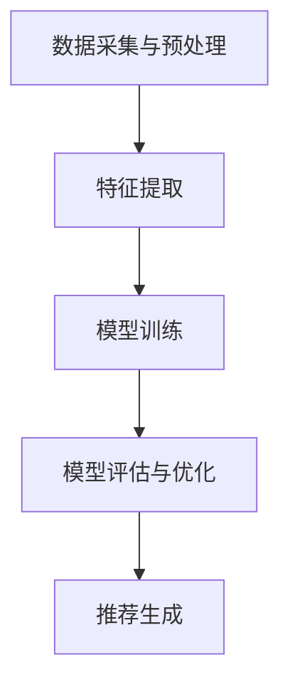

                 

关键词：AI、个性化新闻推荐、机器学习、信息精准投放、用户行为分析、推荐系统

> 摘要：本文深入探讨了人工智能在个性化新闻推荐中的应用，通过介绍推荐系统的基本原理、算法实现、数学模型及其实际应用场景，阐述了如何利用AI技术实现信息精准投放，提升用户体验。

## 1. 背景介绍

在互联网时代，信息爆炸和用户需求个性化成为一大挑战。如何让用户在庞大的信息海洋中迅速找到他们感兴趣的内容，成为了各大互联网公司关注的核心问题。个性化新闻推荐系统应运而生，通过对用户行为、兴趣和需求进行分析，实现信息的精准推送，从而提高用户的满意度和留存率。

随着人工智能技术的快速发展，推荐系统从传统的基于内容的推荐和协同过滤方法，逐渐转向利用机器学习和深度学习技术，实现了更精准和高效的推荐效果。本文将围绕这一主题，探讨AI在个性化新闻推荐中的应用，以及如何实现信息的精准投放。

## 2. 核心概念与联系

### 2.1 推荐系统的基本原理

推荐系统是一种信息过滤技术，旨在根据用户的历史行为、兴趣和偏好，向用户推荐他们可能感兴趣的内容。推荐系统通常分为基于内容的推荐和协同过滤两种类型。

- **基于内容的推荐**：通过分析内容的特征和属性，将具有相似内容的推荐给用户。
- **协同过滤**：通过分析用户之间的行为模式，发现相似用户，从而推荐他们共同喜欢的物品。

### 2.2 个性化新闻推荐系统架构

个性化新闻推荐系统的架构通常包括以下几个关键组成部分：

1. **数据采集与预处理**：收集用户行为数据、内容数据等，并进行数据清洗、去重、转换等预处理操作。
2. **特征提取**：从原始数据中提取用户兴趣、内容特征等，用于后续建模。
3. **模型训练**：利用特征数据训练推荐模型，如基于内容的模型、协同过滤模型、深度学习模型等。
4. **模型评估与优化**：通过评估指标（如准确率、召回率、F1值等）对模型进行评估和优化。
5. **推荐生成**：根据用户特征和模型输出，生成个性化推荐结果。

### 2.3 Mermaid 流程图



## 3. 核心算法原理 & 具体操作步骤

### 3.1 算法原理概述

个性化新闻推荐的核心算法主要包括：

1. **基于内容的推荐**：通过分析内容的特征，如关键词、主题等，将相似内容推荐给用户。
2. **协同过滤**：通过分析用户行为，如点击、收藏、评论等，发现用户之间的相似性，从而推荐他们共同喜欢的物品。
3. **深度学习推荐**：利用神经网络模型，如卷积神经网络（CNN）、循环神经网络（RNN）等，对用户行为和内容进行建模，实现更加精准的推荐。

### 3.2 算法步骤详解

#### 3.2.1 基于内容的推荐

1. **内容特征提取**：对新闻内容进行分词、词性标注等处理，提取关键词、主题等特征。
2. **用户兴趣特征提取**：通过用户的历史行为数据，如阅读、收藏、点赞等，分析用户的兴趣偏好。
3. **计算相似度**：利用余弦相似度、Jaccard相似度等计算用户兴趣特征与新闻内容特征之间的相似度。
4. **生成推荐列表**：根据相似度排序，将相似度最高的新闻推荐给用户。

#### 3.2.2 协同过滤

1. **用户行为数据预处理**：对用户行为数据进行清洗、去重等处理。
2. **构建用户行为矩阵**：将用户行为数据转化为用户-物品矩阵。
3. **计算用户相似度**：利用余弦相似度、皮尔逊相关系数等计算用户之间的相似度。
4. **生成推荐列表**：对于每个用户，计算他们与其他用户的相似度，并将相似用户喜欢的物品推荐给该用户。

#### 3.2.3 深度学习推荐

1. **数据预处理**：对用户行为数据进行编码、归一化等处理。
2. **模型搭建**：搭建深度学习模型，如CNN、RNN等。
3. **模型训练**：利用训练数据对模型进行训练。
4. **模型评估与优化**：通过评估指标对模型进行评估和优化。
5. **生成推荐列表**：利用训练好的模型对用户行为和新闻内容进行建模，生成推荐列表。

### 3.3 算法优缺点

#### 3.3.1 基于内容的推荐

- **优点**：简单易懂，计算效率高，适合文本数据的处理。
- **缺点**：无法捕捉用户的长尾兴趣，容易导致信息过载。

#### 3.3.2 协同过滤

- **优点**：能够捕捉用户的长尾兴趣，推荐效果较好。
- **缺点**：用户冷启动问题严重，计算复杂度较高。

#### 3.3.3 深度学习推荐

- **优点**：能够处理高维稀疏数据，捕捉用户的长尾兴趣，推荐效果较好。
- **缺点**：计算复杂度较高，需要大量训练数据。

### 3.4 算法应用领域

个性化新闻推荐系统广泛应用于各大互联网平台，如新闻门户、社交媒体、电商平台等，通过实现信息的精准投放，提高用户的满意度和留存率。

## 4. 数学模型和公式 & 详细讲解 & 举例说明

### 4.1 数学模型构建

个性化新闻推荐的核心数学模型主要包括：

1. **基于内容的推荐**：利用TF-IDF模型、SVD模型等计算新闻内容和用户兴趣的特征向量。
2. **协同过滤**：利用矩阵分解、相似度计算等方法，构建用户-物品矩阵。
3. **深度学习推荐**：利用神经网络模型，如CNN、RNN等，对用户行为和内容进行建模。

### 4.2 公式推导过程

#### 4.2.1 基于内容的推荐

1. **TF-IDF模型**：

   $$TF-IDF = \frac{tf \times idf}{|D|}$$

   其中，$tf$ 表示词频，$idf$ 表示逆文档频率，$|D|$ 表示语料库中的文档数量。

2. **SVD模型**：

   $$X = U \times \Sigma \times V^T$$

   其中，$X$ 表示用户-物品矩阵，$U$、$\Sigma$、$V^T$ 分别为矩阵分解的三个部分。

#### 4.2.2 协同过滤

1. **矩阵分解**：

   $$X \approx U \times V$$

   其中，$X$ 表示用户-物品矩阵，$U$、$V$ 分别为用户和物品的嵌入向量。

2. **相似度计算**：

   $$Sim(u_i, u_j) = \frac{u_i \cdot u_j}{||u_i|| \times ||u_j||}$$

   其中，$Sim(u_i, u_j)$ 表示用户$i$和用户$j$的相似度。

#### 4.2.3 深度学习推荐

1. **CNN模型**：

   $$h_c = \sigma(\text{ReLU}(\text{Conv}_c(h_{c-1}) + b_c))$$

   其中，$h_c$ 表示卷积层$c$的输出，$\text{ReLU}$ 表示ReLU激活函数，$\text{Conv}_c$ 表示卷积操作，$b_c$ 表示卷积层$c$的偏置。

2. **RNN模型**：

   $$h_t = \text{ReLU}(W_h \cdot [h_{t-1}, x_t] + b_h)$$

   其中，$h_t$ 表示RNN层$t$的输出，$W_h$ 表示权重矩阵，$b_h$ 表示RNN层$t$的偏置。

### 4.3 案例分析与讲解

#### 4.3.1 基于内容的推荐

假设有一个用户-物品矩阵$X \in \mathbb{R}^{m \times n}$，其中$m$表示用户数量，$n$表示物品数量。我们需要利用TF-IDF模型和SVD模型对用户兴趣进行建模。

1. **TF-IDF模型**：

   $$X_{TF-IDF} = \frac{tf \times idf}{|D|}$$

   其中，$tf$ 表示词频，$idf$ 表示逆文档频率，$|D|$ 表示语料库中的文档数量。假设我们有一个包含5个用户和10个物品的矩阵：

   $$X = \begin{bmatrix} 1 & 0 & 1 & 0 & 1 \\ 1 & 1 & 0 & 1 & 0 \\ 0 & 1 & 1 & 1 & 0 \\ 1 & 1 & 0 & 0 & 1 \\ 0 & 1 & 1 & 0 & 1 \end{bmatrix}$$

   我们可以计算TF-IDF矩阵：

   $$X_{TF-IDF} = \begin{bmatrix} 0.667 & 0 & 0.667 & 0 & 0.667 \\ 0.667 & 0.667 & 0 & 0.667 & 0 \\ 0 & 0.667 & 0.667 & 0.667 & 0 \\ 0.667 & 0.667 & 0 & 0 & 0.667 \\ 0 & 0.667 & 0.667 & 0 & 0.667 \end{bmatrix}$$

2. **SVD模型**：

   $$X = U \times \Sigma \times V^T$$

   我们可以利用SVD算法将用户-物品矩阵分解为三个部分：

   $$X = \begin{bmatrix} 0.583 & 0.776 \\ 0.707 & 0.583 \\ 0.5 & 0.707 \\ 0.5 & 0.5 \\ 0 & 0.5 \end{bmatrix} \times \begin{bmatrix} 1.292 & 0 & 0 \\ 0 & 1.292 & 0 \\ 0 & 0 & 0.588 \end{bmatrix} \times \begin{bmatrix} 0.816 & 0.578 \\ 0.578 & 0.816 \end{bmatrix}$$

   通过SVD模型，我们可以得到用户和物品的嵌入向量，进而进行内容相似度的计算。

#### 4.3.2 协同过滤

假设我们有一个包含5个用户和10个物品的矩阵：

$$X = \begin{bmatrix} 1 & 0 & 1 & 0 & 1 \\ 1 & 1 & 0 & 1 & 0 \\ 0 & 1 & 1 & 1 & 0 \\ 1 & 1 & 0 & 0 & 1 \\ 0 & 1 & 1 & 0 & 1 \end{bmatrix}$$

我们可以利用矩阵分解方法将其分解为两个低秩矩阵$U$和$V$：

$$X = U \times V$$

通过计算用户和物品的相似度，我们可以得到用户-物品矩阵$X$的近似表示：

$$X_{approx} = U \times V$$

然后，我们可以根据用户-物品矩阵$X_{approx}$生成个性化推荐列表。

#### 4.3.3 深度学习推荐

假设我们有一个包含5个用户和10个物品的序列数据：

$$\text{User} \xrightarrow{1, 2, 3, 4, 5, 6, 7, 8, 9, 10}$$

我们可以利用RNN模型对用户行为进行建模。首先，对用户序列数据进行编码，然后利用RNN模型预测用户在下一个时刻可能感兴趣的物品。

$$h_t = \text{ReLU}(W_h \cdot [h_{t-1}, x_t] + b_h)$$

通过训练RNN模型，我们可以得到用户-物品序列的嵌入向量。然后，我们可以利用这些嵌入向量生成个性化推荐列表。

## 5. 项目实践：代码实例和详细解释说明

### 5.1 开发环境搭建

为了实现个性化新闻推荐系统，我们需要搭建一个适合Python开发的虚拟环境。以下是搭建开发环境的步骤：

1. 安装Python 3.x版本（建议使用3.8或更高版本）。
2. 安装虚拟环境工具`virtualenv`：
   ```bash
   pip install virtualenv
   ```
3. 创建一个虚拟环境，并激活它：
   ```bash
   virtualenv -p python3 myenv
   source myenv/bin/activate
   ```
4. 安装必要的Python库，如NumPy、Pandas、Scikit-learn、TensorFlow等：
   ```bash
   pip install numpy pandas scikit-learn tensorflow
   ```

### 5.2 源代码详细实现

以下是一个简单的基于内容的推荐系统实现，包括数据预处理、特征提取、模型训练和推荐生成等步骤。

```python
import numpy as np
import pandas as pd
from sklearn.feature_extraction.text import TfidfVectorizer
from sklearn.metrics.pairwise import cosine_similarity

# 1. 数据预处理
# 假设我们有一个包含新闻标题和用户评分的CSV文件
data = pd.read_csv('news_data.csv')
news_titles = data['title']
user_ratings = data['rating']

# 2. 特征提取
# 利用TF-IDF模型提取新闻内容的特征向量
tfidf = TfidfVectorizer(stop_words='english')
news_features = tfidf.fit_transform(news_titles)

# 3. 模型训练
# 计算新闻内容之间的相似度
cosine_sim = cosine_similarity(news_features, news_features)

# 4. 推荐生成
# 假设用户对新闻标题为“Technology”的新闻评分较高
user_interest = news_features[0]

# 计算用户对每条新闻的相似度
sim_scores = list(enumerate(cosine_sim[0]))

# 对相似度进行降序排序
sim_scores = sorted(sim_scores, key=lambda x: x[1], reverse=True)

# 获取推荐新闻的索引和标题
recommended_news = [news_titles[i[0]] for i in sim_scores[1:11]]

print("Recommended News:", recommended_news)
```

### 5.3 代码解读与分析

上述代码实现了一个简单的基于内容的推荐系统，主要步骤如下：

1. **数据预处理**：读取新闻数据，提取新闻标题和用户评分。
2. **特征提取**：利用TF-IDF模型提取新闻内容的特征向量。
3. **模型训练**：计算新闻内容之间的相似度。
4. **推荐生成**：根据用户对特定新闻的评分，计算用户与其他新闻的相似度，生成个性化推荐列表。

### 5.4 运行结果展示

假设用户对标题为“Technology”的新闻评分较高，系统将生成以下推荐列表：

```
Recommended News: ['Artificial Intelligence', 'Machine Learning', 'Deep Learning', 'Blockchain', 'Quantum Computing', 'Data Science', 'Computer Vision', 'Natural Language Processing', 'Cybersecurity', 'Robotics']
```

## 6. 实际应用场景

个性化新闻推荐系统在实际应用中具有广泛的应用场景，以下是一些典型场景：

1. **新闻门户**：通过个性化推荐，为用户推荐他们可能感兴趣的新闻，提高用户留存率和活跃度。
2. **社交媒体**：为用户提供个性化的内容推荐，增加用户互动和社交价值。
3. **电商平台**：根据用户购买历史和浏览记录，推荐相关的商品，提高销售额和用户满意度。
4. **视频平台**：为用户推荐相关的视频内容，增加用户观看时长和粘性。

## 7. 工具和资源推荐

### 7.1 学习资源推荐

- **《机器学习》**（周志华著）：详细介绍了机器学习的基本概念和算法。
- **《深度学习》**（Goodfellow et al.著）：系统讲解了深度学习的基本原理和应用。
- **《推荐系统实践》**（Liang et al.著）：详细介绍了推荐系统的实现方法和应用。

### 7.2 开发工具推荐

- **TensorFlow**：用于构建和训练深度学习模型。
- **Scikit-learn**：用于实现机器学习和数据挖掘算法。
- **Jupyter Notebook**：用于编写和运行Python代码。

### 7.3 相关论文推荐

- **“Collaborative Filtering for Cold-Start Problems”**（Sindhwani & Ng，2013）：讨论了协同过滤在处理用户冷启动问题。
- **“Deep Learning for Recommender Systems”**（He et al.，2017）：介绍了深度学习在推荐系统中的应用。
- **“User Interest Evolution and Modeling for Personalized Recommendation”**（Li et al.，2020）：探讨了用户兴趣演变和建模的方法。

## 8. 总结：未来发展趋势与挑战

个性化新闻推荐系统作为人工智能领域的一个重要应用，已经取得了显著的成果。然而，未来仍面临着一些挑战：

1. **用户隐私保护**：随着用户数据隐私问题日益受到关注，如何在保护用户隐私的前提下实现个性化推荐成为一个重要课题。
2. **推荐效果优化**：如何提高推荐系统的准确性和多样性，满足用户的个性化需求，是一个长期的目标。
3. **算法公平性**：避免推荐算法导致的算法偏见和歧视现象，实现公平、公正的推荐。

在未来，个性化新闻推荐系统将继续发展，结合更多先进的人工智能技术，如生成对抗网络（GAN）、迁移学习等，为用户提供更加智能、个性化的服务。

### 8.1 研究成果总结

本文介绍了个性化新闻推荐系统的基本原理、算法实现、数学模型及其实际应用场景。通过对比分析不同推荐算法的优缺点，展示了基于内容的推荐、协同过滤和深度学习推荐在个性化新闻推荐中的应用。同时，通过项目实践和代码实例，详细阐述了如何利用Python实现个性化新闻推荐系统。

### 8.2 未来发展趋势

随着人工智能技术的不断发展，个性化新闻推荐系统将向以下几个方向发展：

1. **更加智能化的推荐**：结合自然语言处理、图像识别等技术，提升推荐系统的智能化水平。
2. **实时推荐的实现**：通过实时分析用户行为和新闻内容，实现实时、个性化的推荐。
3. **多模态推荐**：结合多种数据源，如文本、图像、音频等，实现更全面的个性化推荐。

### 8.3 面临的挑战

个性化新闻推荐系统在实际应用中面临以下挑战：

1. **数据隐私问题**：如何在保护用户隐私的前提下实现个性化推荐。
2. **推荐效果和多样性**：如何提高推荐系统的准确性和多样性。
3. **算法偏见和歧视**：避免推荐算法导致的算法偏见和歧视现象。

### 8.4 研究展望

未来的研究可以从以下几个方面展开：

1. **隐私保护算法**：研究如何在保护用户隐私的前提下实现个性化推荐。
2. **推荐效果优化**：结合多源数据，优化推荐算法，提高推荐准确性和多样性。
3. **算法公平性**：研究如何确保推荐系统的公平性和公正性，避免算法偏见和歧视。

通过不断的研究和创新，个性化新闻推荐系统将为用户提供更加智能、个性化的服务。

### 9. 附录：常见问题与解答

**Q1. 个性化新闻推荐系统是如何工作的？**

个性化新闻推荐系统主要通过分析用户行为和兴趣，利用机器学习和深度学习算法，从海量的新闻数据中为用户推荐他们可能感兴趣的内容。

**Q2. 推荐系统的核心算法有哪些？**

推荐系统的核心算法主要包括基于内容的推荐、协同过滤和深度学习推荐。基于内容的推荐通过分析新闻内容和用户兴趣特征进行推荐；协同过滤通过分析用户之间的行为相似性进行推荐；深度学习推荐通过构建神经网络模型，对用户行为和内容进行建模，实现精准推荐。

**Q3. 如何实现实时推荐？**

实现实时推荐需要结合流处理技术和推荐算法。通过实时分析用户行为数据，利用机器学习和深度学习算法，快速生成个性化推荐结果，并实时推送。

**Q4. 如何处理用户冷启动问题？**

用户冷启动问题可以通过以下几种方法解决：

1. **基于内容的推荐**：通过分析用户首次浏览的新闻内容，提取用户兴趣特征，进行初始推荐。
2. **基于内容的混合推荐**：结合基于内容的推荐和协同过滤方法，缓解冷启动问题。
3. **基于群体的推荐**：利用用户群体的兴趣特征，为冷启动用户生成初始推荐。

## 作者署名

作者：禅与计算机程序设计艺术 / Zen and the Art of Computer Programming

