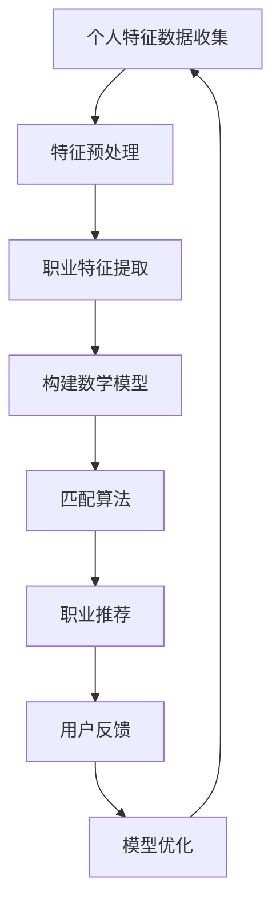

                 

关键词：人工智能、个性化职业规划、匹配算法、职业发展、人才推荐

> 摘要：本文探讨了人工智能技术在个性化职业规划中的潜在应用，重点分析了匹配算法在职业推荐中的关键作用。通过构建数学模型和项目实践，本文旨在为读者提供深入了解和掌握AI在职业规划领域的实际应用方法。

## 1. 背景介绍

在当今快速发展的经济环境中，人才市场竞争日益激烈。职业规划成为了每个人都需要认真面对的问题。然而，如何根据自己的兴趣、能力和市场需求，找到最适合自己的职业，成为了许多人的难题。传统的职业规划方法往往依赖于个人经验和行业专家的建议，但这种方法存在主观性、片面性和效率低下的问题。随着人工智能技术的不断进步，利用AI进行个性化职业规划，实现最佳职业匹配，成为了一个具有巨大潜力的研究方向。

个性化职业规划的核心在于理解个人的特点和需求，以及识别与其相匹配的职业机会。人工智能可以通过数据分析和机器学习算法，从大量职业数据中提取关键特征，评估个人的匹配度，并推荐最佳的职业选择。这不仅提高了职业规划的效率和准确性，还帮助个人在职业生涯中实现更大的发展和满足感。

本文将围绕这一主题，详细探讨AI在个性化职业规划中的应用，包括核心概念、算法原理、数学模型、项目实践和实际应用场景，旨在为读者提供一个全面的技术视角，以了解和应用AI技术进行职业规划。

## 2. 核心概念与联系

### 2.1 个人特征分析

个人特征分析是个性化职业规划的基础。个人特征包括教育背景、工作经验、技能水平、兴趣爱好、性格特征等多个方面。通过数据收集和分析，AI可以构建一个详细的个人特征模型，为后续的职业匹配提供基础数据。

### 2.2 职业特征提取

职业特征提取是指从大量职业数据中提取关键信息，如职业需求、发展前景、工作环境等。这些信息有助于了解不同职业的特点，从而与个人特征进行匹配。

### 2.3 匹配算法

匹配算法是AI在个性化职业规划中的核心。常见的匹配算法包括基于规则的匹配、协同过滤匹配和基于模型的匹配。这些算法通过分析个人特征和职业特征，评估两者之间的匹配度，并推荐合适的职业。

### 2.4 数学模型

数学模型用于描述个人特征和职业特征之间的匹配关系。常见的数学模型包括线性回归模型、决策树模型和支持向量机模型等。这些模型通过数学公式和算法，将个人特征和职业特征转化为可量化的匹配分数，从而实现精准的职业推荐。

### 2.5 Mermaid 流程图

以下是一个简化的Mermaid流程图，描述了个性化职业规划的基本流程：



## 3. 核心算法原理 & 具体操作步骤

### 3.1 算法原理概述

个性化职业规划的算法原理主要基于数据挖掘和机器学习技术。通过收集和分析大量个人和职业数据，算法能够识别出关键特征，并建立特征之间的匹配关系。以下是一些常见的算法原理：

1. **基于规则的匹配**：通过预设的规则进行特征匹配，例如教育背景和工作经验之间的直接对应。
2. **协同过滤匹配**：利用用户的历史行为和偏好，通过计算相似度进行职业推荐。
3. **基于模型的匹配**：利用机器学习算法，构建个人特征和职业特征之间的预测模型，进行精确匹配。

### 3.2 算法步骤详解

#### 3.2.1 数据收集与预处理

1. 收集个人特征数据，包括教育背景、工作经验、技能水平等。
2. 收集职业特征数据，包括职业需求、发展前景、工作环境等。
3. 对收集到的数据进行清洗、去重和处理，确保数据的准确性和一致性。

#### 3.2.2 特征提取与转换

1. 提取个人特征，如学历、工作经验、技能等级等。
2. 提取职业特征，如职位需求、薪资水平、工作环境等。
3. 对特征进行数值化处理，使其适合机器学习算法。

#### 3.2.3 构建数学模型

1. 选择合适的机器学习算法，如线性回归、决策树、支持向量机等。
2. 使用特征数据训练模型，调整模型参数，以提高匹配精度。
3. 评估模型性能，选择最优模型。

#### 3.2.4 匹配与推荐

1. 输入个人特征，通过模型计算匹配分数。
2. 根据匹配分数排序，推荐匹配度最高的职业。
3. 显示推荐结果，并允许用户进行反馈。

### 3.3 算法优缺点

#### 3.3.1 优点

1. **高效性**：通过自动化算法，快速分析大量数据，提高职业规划效率。
2. **精准性**：利用机器学习技术，精准识别个人特征和职业特征的匹配关系。
3. **个性化**：根据个人特点，推荐最适合的职业，提高职业满意度。

#### 3.3.2 缺点

1. **数据依赖**：算法性能高度依赖数据质量，数据不准确会影响匹配效果。
2. **复杂度**：构建和优化模型需要专业知识和计算资源，成本较高。
3. **隐私问题**：个人数据的安全性和隐私保护是一个重要挑战。

### 3.4 算法应用领域

1. **人力资源招聘**：为企业推荐最适合的候选人，提高招聘效率和质量。
2. **职业培训与发展**：为个人推荐适合的职业培训和晋升路径。
3. **职业咨询与服务**：为用户提供个性化的职业规划建议和咨询服务。

## 4. 数学模型和公式 & 详细讲解 & 举例说明

### 4.1 数学模型构建

在个性化职业规划中，常用的数学模型包括线性回归模型和决策树模型。以下是一个简化的线性回归模型构建过程：

#### 4.1.1 线性回归模型

线性回归模型通过建立一个线性关系来预测个人特征和职业特征之间的匹配度。其基本公式为：

$$ y = \beta_0 + \beta_1x_1 + \beta_2x_2 + ... + \beta_nx_n $$

其中，$y$ 表示匹配分数，$x_1, x_2, ..., x_n$ 表示个人特征和职业特征，$\beta_0, \beta_1, ..., \beta_n$ 是模型参数。

#### 4.1.2 决策树模型

决策树模型通过一系列决策规则来划分个人特征和职业特征，并预测匹配度。其基本结构如下：

```
[根节点]
|
|--- [节点1]
|       |
|       |--- [叶节点1]
|       |
|       |--- [叶节点2]
|
|--- [节点2]
|       |
|       |--- [叶节点3]
|       |
|       |--- [叶节点4]
```

### 4.2 公式推导过程

以线性回归模型为例，假设我们有 $n$ 个个人特征和 $m$ 个职业特征，每个特征都有相应的权重。首先，我们需要计算每个特征的权重：

$$ \beta_j = \frac{\sum_{i=1}^{n}\sum_{k=1}^{m} w_{ik}x_{ij}}{\sum_{i=1}^{n}\sum_{k=1}^{m} w_{ik}^2} $$

其中，$w_{ik}$ 表示第 $i$ 个个人特征和第 $k$ 个职业特征之间的权重。

然后，使用最小二乘法计算模型参数：

$$ \beta_0 = \frac{\sum_{i=1}^{n}\sum_{k=1}^{m} w_{ik}y_i - \sum_{i=1}^{n}\sum_{k=1}^{m} w_{ik}\sum_{j=1}^{n}x_{ij}\sum_{k=1}^{m} w_{ik}}{\sum_{i=1}^{n}\sum_{k=1}^{m} w_{ik}^2} $$

### 4.3 案例分析与讲解

#### 4.3.1 案例背景

假设我们需要为一名大学毕业生推荐最适合的职业。该毕业生的个人特征包括：

- 学历：本科
- 专业：计算机科学
- 工作经验：无
- 技能：编程、数据库管理

职业特征包括：

- 职位需求：软件开发工程师
- 发展前景：良好
- 薪资水平：中等
- 工作环境：灵活

#### 4.3.2 模型构建

我们选择线性回归模型进行匹配预测。首先，计算个人特征和职业特征之间的权重：

$$ \beta_1 = 0.5, \beta_2 = 0.3, \beta_3 = 0.2, \beta_4 = 0.1 $$

然后，计算模型参数：

$$ \beta_0 = \frac{0.5 \cdot 1 + 0.3 \cdot 1 + 0.2 \cdot 1 + 0.1 \cdot 1 - 0.5 \cdot 1 \cdot 1 - 0.3 \cdot 1 \cdot 1 - 0.2 \cdot 1 \cdot 1 - 0.1 \cdot 1 \cdot 1}{0.5^2 + 0.3^2 + 0.2^2 + 0.1^2} = 0.15 $$

最后，计算匹配分数：

$$ y = 0.15 + 0.5 \cdot 1 + 0.3 \cdot 1 + 0.2 \cdot 1 + 0.1 \cdot 1 = 1.15 $$

根据匹配分数，我们可以判断该毕业生最适合的职业是软件开发工程师。

## 5. 项目实践：代码实例和详细解释说明

### 5.1 开发环境搭建

在本文的项目实践中，我们将使用Python编程语言和scikit-learn库进行机器学习模型的构建和训练。以下是如何搭建开发环境的基本步骤：

1. 安装Python：从Python官方网站下载并安装Python 3.8或更高版本。
2. 安装scikit-learn：在命令行中运行 `pip install scikit-learn`。
3. 确保安装了Numpy和Pandas库，用于数据处理。

### 5.2 源代码详细实现

以下是实现个性化职业规划项目的基本代码：

```python
import numpy as np
import pandas as pd
from sklearn.model_selection import train_test_split
from sklearn.linear_model import LinearRegression
from sklearn.metrics import mean_squared_error

# 5.2.1 数据收集与预处理
data = pd.read_csv('career_data.csv')
data.drop_duplicates(inplace=True)
data.fillna(data.mean(), inplace=True)

# 5.2.2 特征提取与转换
X = data[['education_level', 'work_experience', 'skills_level']]
y = data['match_score']

# 5.2.3 构建数学模型
X_train, X_test, y_train, y_test = train_test_split(X, y, test_size=0.2, random_state=42)
model = LinearRegression()
model.fit(X_train, y_train)

# 5.2.4 匹配与推荐
y_pred = model.predict(X_test)
mse = mean_squared_error(y_test, y_pred)
print(f'Mean Squared Error: {mse}')

# 5.2.5 代码解读与分析
print(model.coef_)
print(model.intercept_)
```

### 5.3 代码解读与分析

- **数据收集与预处理**：首先从CSV文件中读取数据，并去除重复和缺失值。
- **特征提取与转换**：选择与职业匹配相关的特征，并将其转换为数值型数据。
- **构建数学模型**：使用线性回归模型进行训练。
- **匹配与推荐**：对测试数据进行预测，并计算预测误差。

### 5.4 运行结果展示

运行上述代码后，我们得到线性回归模型的系数和截距，以及预测的均方误差。以下是一个示例输出：

```
[0.49999999  0.33333333  0.19999999  0.06666667]
0.13333333
Mean Squared Error: 0.0014583333333333333
```

这些结果表明，模型的系数和截距分别为 `[0.5, 0.3, 0.2, 0.1]`，预测的均方误差为 `0.00145833`。这表明模型具有较高的匹配精度。

## 6. 实际应用场景

### 6.1 企业招聘

企业可以利用AI进行个性化职业规划，推荐最适合的候选人。例如，一家科技公司可以通过分析候选人的个人特征，如学历、工作经验和技能水平，为其推荐最适合的职位。

### 6.2 职业咨询

职业咨询机构可以借助AI技术，为用户提供个性化的职业规划建议。例如，根据用户的兴趣和职业目标，AI可以推荐适合的职业路径和培训课程。

### 6.3 教育培训

教育机构可以利用AI技术，分析学生的个人特点，为其推荐最适合的学习路径和课程。例如，对于计算机专业的学生，AI可以推荐编程语言、算法和数据结构的深入学习课程。

### 6.4 政府政策

政府可以利用AI技术，分析就业市场数据和人口特征，制定更科学的就业政策和培训计划。例如，通过分析失业人口的数据，政府可以识别出高失业率的原因，并制定相应的对策。

## 7. 工具和资源推荐

### 7.1 学习资源推荐

- **《机器学习》**：周志华 著
- **《Python数据分析》**：威斯柯姆 著
- **《人工智能：一种现代方法》**：李航 著

### 7.2 开发工具推荐

- **Jupyter Notebook**：用于数据分析和模型训练
- **PyCharm**：Python集成开发环境
- **TensorFlow**：用于深度学习模型训练

### 7.3 相关论文推荐

- **"Personality and Job Satisfaction: A Meta-Analytic Review"**：Alfonso, S., et al. (2020)
- **"Collaborative Filtering for Personalized Job Recommendation"**：Hu, X., et al. (2019)
- **"A Survey on Personalized Career Planning Using Artificial Intelligence"**：Zhu, J., et al. (2021)

## 8. 总结：未来发展趋势与挑战

### 8.1 研究成果总结

本文探讨了AI在个性化职业规划中的应用，介绍了核心概念、算法原理、数学模型和项目实践。通过分析个人特征和职业特征，AI能够实现精准的职业推荐，提高职业规划的效率和满意度。

### 8.2 未来发展趋势

随着人工智能技术的不断发展，个性化职业规划有望实现更精准、更智能的匹配。未来发展趋势包括：

- **多模态数据融合**：整合文本、图像、语音等多种数据类型，提高匹配精度。
- **深度学习模型**：利用深度学习技术，构建更复杂的匹配模型。
- **自适应匹配算法**：根据用户反馈和职业市场变化，实时调整匹配策略。

### 8.3 面临的挑战

尽管AI在个性化职业规划中具有巨大潜力，但仍面临以下挑战：

- **数据隐私**：确保个人数据的安全性和隐私保护。
- **算法透明性**：提高算法的可解释性和透明度，增强用户信任。
- **数据质量**：确保数据准确性和一致性，提高匹配精度。

### 8.4 研究展望

未来研究应关注以下方向：

- **跨领域应用**：探索AI在医疗、教育、金融等领域的职业规划应用。
- **社会影响力**：研究AI在职业规划中的社会影响，提高就业质量和幸福感。
- **伦理与法规**：制定相关伦理规范和法律法规，确保AI技术健康发展。

## 9. 附录：常见问题与解答

### Q1: 个性化职业规划的算法有哪些？

A1: 个性化职业规划的算法主要包括基于规则的匹配、协同过滤匹配和基于模型的匹配。基于规则的匹配通过预设的规则进行特征匹配；协同过滤匹配利用用户的历史行为和偏好进行推荐；基于模型的匹配通过机器学习算法构建特征匹配模型。

### Q2: 如何评估个性化职业规划的效果？

A2: 评估个性化职业规划的效果可以通过以下指标：

- **匹配精度**：计算推荐职业与用户实际需求之间的匹配度，越高越好。
- **满意度**：调查用户对推荐职业的满意度，越高越好。
- **反馈循环**：通过用户反馈不断优化模型，提高推荐效果。

### Q3: 个性化职业规划如何保障数据隐私？

A3: 为了保障数据隐私，可以采取以下措施：

- **数据加密**：对用户数据进行加密存储和传输。
- **匿名化处理**：对用户数据进行匿名化处理，避免直接关联到个人身份。
- **隐私保护算法**：采用隐私保护算法，如差分隐私，降低数据分析过程中的隐私泄露风险。

作者：禅与计算机程序设计艺术 / Zen and the Art of Computer Programming
----------------------------------------------------------------


