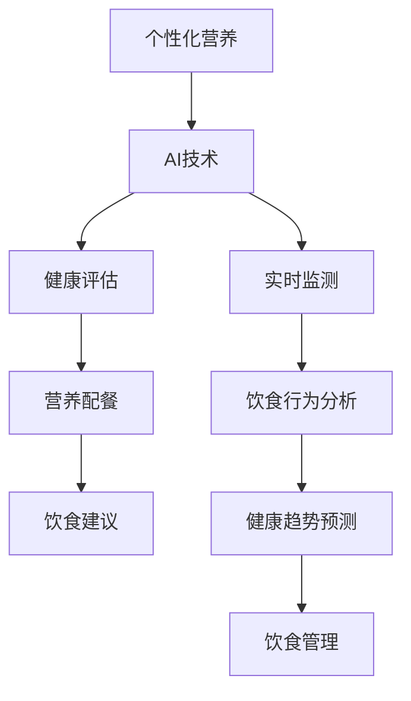

                 

关键词：个性化营养，AI，饮食计划，健康评估，算法，数学模型，实践案例

> 摘要：本文探讨了人工智能（AI）在个性化营养领域中的应用，特别是如何通过定制饮食计划来提高个体的健康水平。文章首先介绍了个性化营养的背景，然后详细阐述了AI技术在健康评估、营养配餐、饮食建议等方面的应用。接着，文章介绍了核心算法原理和数学模型，并通过实际项目案例展示了AI在个性化营养领域的实际应用效果。最后，文章讨论了未来发展趋势、面临的挑战以及研究展望。

## 1. 背景介绍

随着科技的发展和人们对健康意识的提高，个性化营养逐渐成为营养学领域的研究热点。个性化营养是指根据个体的生理特征、生活习惯、健康状况等，为其量身定制营养饮食方案的过程。传统的营养饮食方案往往一刀切，无法满足不同个体的需求，而个性化营养则强调根据个体差异进行饮食调整，以达到更好的健康效果。

在个性化营养领域，人工智能（AI）技术的应用具有重要意义。AI技术能够处理和分析大量数据，从中提取有价值的信息，为个性化营养方案的制定提供支持。此外，AI技术还可以通过模拟和预测，为个体的健康趋势提供预警，从而提前采取预防措施。

本文旨在探讨AI在个性化营养中的应用，特别是如何通过定制饮食计划来提高个体的健康水平。文章将首先介绍个性化营养的基本概念，然后详细分析AI技术在个性化营养中的应用，包括健康评估、营养配餐、饮食建议等方面。接着，文章将介绍核心算法原理和数学模型，并通过实际项目案例展示AI在个性化营养领域的应用效果。最后，文章将讨论个性化营养的未来发展趋势、面临的挑战以及研究展望。

### 1.1 个性化营养的定义和重要性

个性化营养是一种基于个体差异的饮食方案设计方法，旨在通过调整饮食结构，满足个体的健康需求。个性化营养的定义涵盖了以下几个方面：

- **个体差异**：个性化营养强调个体的生理、心理、生活习惯等差异，根据这些差异制定针对性的营养方案。
- **饮食结构**：个性化营养关注饮食的成分、搭配和比例，以达到营养均衡。
- **健康目标**：个性化营养的目标是改善个体的健康状况，预防疾病，提高生活质量。

个性化营养的重要性体现在以下几个方面：

- **提高健康水平**：个性化营养能够根据个体的实际情况，制定出更科学、更合理的饮食方案，从而提高个体的健康水平。
- **预防疾病**：个性化营养可以通过调整饮食结构，降低患病风险，如心血管疾病、糖尿病等。
- **个性化需求**：随着人们生活水平的提高，对饮食质量的要求也越来越高，个性化营养能够满足这一需求，提升消费者的满意度。
- **可持续发展**：个性化营养能够减少资源浪费，提高农业生产效率，促进农业可持续发展。

### 1.2 AI在个性化营养中的应用

人工智能（AI）技术在个性化营养中的应用主要表现在以下几个方面：

- **健康评估**：通过AI技术，可以对个体的健康状况进行准确评估，识别潜在的健康风险。
- **营养配餐**：利用AI技术，可以根据个体的健康状况、饮食习惯和口味偏好，为其制定个性化的营养配餐方案。
- **饮食建议**：AI技术可以基于大数据分析，为个体提供科学的饮食建议，帮助其改善饮食习惯，提高健康水平。
- **实时监测**：通过AI技术，可以实现对个体饮食行为的实时监测，及时发现异常情况，并给予相应的饮食调整建议。

#### 1.2.1 健康评估

健康评估是个性化营养的重要基础。通过AI技术，可以实现对个体健康状况的全面评估。具体应用包括：

- **生理指标分析**：AI技术可以分析个体的血压、血糖、血脂等生理指标，评估其健康状况。
- **生活习惯分析**：AI技术可以分析个体的生活习惯，如饮食规律、运动频率等，评估其对健康的影响。
- **健康风险评估**：AI技术可以基于大数据分析，对个体的健康风险进行预测，并提供相应的健康建议。

#### 1.2.2 营养配餐

营养配餐是个性化营养的核心环节。利用AI技术，可以实现对营养配餐的智能化管理。具体应用包括：

- **饮食方案定制**：AI技术可以根据个体的健康评估结果，为其制定个性化的饮食方案。
- **营养成分优化**：AI技术可以分析不同食物的营养成分，为个体提供营养均衡的饮食建议。
- **口味偏好分析**：AI技术可以分析个体的口味偏好，为其推荐符合口味的营养配餐方案。

#### 1.2.3 饮食建议

饮食建议是帮助个体改善饮食习惯的重要手段。AI技术可以基于大数据分析和个体健康评估结果，为个体提供科学的饮食建议。具体应用包括：

- **饮食指导**：AI技术可以提供详细的饮食指导，帮助个体建立科学的饮食习惯。
- **饮食调整建议**：AI技术可以根据个体的健康状况和饮食行为，提供相应的饮食调整建议，帮助个体改善健康。
- **营养教育**：AI技术可以通过智能交互，为个体提供营养知识教育，提高其健康素养。

#### 1.2.4 实时监测

实时监测是实现个性化营养的关键。AI技术可以通过智能设备和传感器，对个体的饮食行为进行实时监测。具体应用包括：

- **饮食行为分析**：AI技术可以分析个体的饮食行为，识别饮食中的问题，并提供相应的调整建议。
- **健康趋势预测**：AI技术可以基于实时监测数据，预测个体的健康趋势，提前采取预防措施。
- **饮食管理**：AI技术可以帮助个体实现饮食的自我管理，提高饮食行为的规范性和科学性。

## 2. 核心概念与联系

在探讨AI在个性化营养中的应用之前，我们需要了解一些核心概念和它们之间的联系。以下是涉及的关键概念和它们之间的Mermaid流程图。

### 2.1 关键概念

- **个性化营养**：基于个体差异的饮食方案设计。
- **人工智能（AI）**：模拟人类智能的技术，包括机器学习、深度学习等。
- **健康评估**：评估个体健康状况的技术和方法。
- **营养配餐**：根据个体健康需求设计的饮食方案。
- **饮食建议**：基于个体健康数据和偏好提供的饮食建议。

### 2.2 Mermaid流程图



### 2.3 关键概念的联系

- **个性化营养**与**AI技术**：个性化营养需要AI技术来分析个体差异，从而制定出针对性的饮食方案。
- **健康评估**与**营养配餐**：健康评估的结果直接影响营养配餐的设计，二者相辅相成。
- **饮食建议**与**实时监测**：饮食建议需要基于实时监测的数据，以确保饮食建议的准确性和及时性。
- **饮食行为分析**与**健康趋势预测**：通过分析饮食行为，可以预测个体的健康趋势，从而提前采取预防措施。
- **饮食管理**：通过AI技术实现饮食的自我管理，提高饮食行为的规范性和科学性。

## 3. 核心算法原理 & 具体操作步骤

### 3.1 算法原理概述

在个性化营养领域，核心算法的原理主要涉及机器学习和数据挖掘技术。以下是一些常用的算法及其原理：

- **机器学习**：通过训练模型，使计算机能够自动识别和预测个体饮食行为和健康趋势。
  - **回归分析**：预测个体健康指标的变化趋势。
  - **决策树**：根据个体的生理指标和饮食习惯，制定个性化营养方案。
  - **支持向量机（SVM）**：分类个体健康风险，提供相应的饮食建议。

- **数据挖掘**：从大量数据中提取有价值的信息，为个性化营养提供数据支持。
  - **关联规则分析**：识别食物之间的营养关联，优化饮食方案。
  - **聚类分析**：根据个体特征，将人群划分为不同的群体，制定针对性的营养方案。

### 3.2 算法步骤详解

#### 3.2.1 数据收集与预处理

1. **数据收集**：从各类传感器、健康监测设备、问卷等渠道收集个体的生理指标、生活习惯、饮食习惯等数据。
2. **数据预处理**：清洗数据，处理缺失值和异常值，对数据进行标准化和归一化处理，以便后续分析。

#### 3.2.2 模型训练与评估

1. **模型选择**：根据问题的性质，选择合适的机器学习模型。
2. **模型训练**：使用训练数据集，对模型进行训练，使其能够识别和预测个体的饮食行为和健康趋势。
3. **模型评估**：使用验证数据集，评估模型的准确性和鲁棒性，调整模型参数，以提高预测效果。

#### 3.2.3 饮食方案生成与推荐

1. **健康评估**：利用训练好的模型，对个体的健康状况进行评估，识别潜在的健康风险。
2. **营养配餐**：根据个体的健康状况、饮食习惯和口味偏好，生成个性化的营养配餐方案。
3. **饮食建议**：基于健康评估结果和营养配餐方案，为个体提供科学的饮食建议。

#### 3.2.4 实时监测与反馈

1. **实时监测**：通过传感器和智能设备，实时收集个体的饮食行为数据。
2. **数据更新**：将实时监测数据传入模型，更新模型参数，提高预测的准确性。
3. **反馈调整**：根据实时监测结果，对饮食方案和饮食建议进行动态调整，确保饮食方案的实效性。

### 3.3 算法优缺点

#### 优点：

- **个性化**：算法能够根据个体的差异，制定出更加个性化的饮食方案，提高饮食效果。
- **自动化**：算法能够自动化处理大量数据，提高营养评估和配餐的效率。
- **实时性**：实时监测和动态调整，确保饮食方案的科学性和实用性。

#### 缺点：

- **数据依赖**：算法的性能依赖于数据的质量和数量，数据缺失或异常可能影响算法的效果。
- **模型复杂**：算法涉及多种技术和模型，实现和调试过程较为复杂。
- **用户体验**：算法生成的饮食方案和饮食建议可能难以满足所有个体的口味和偏好。

### 3.4 算法应用领域

AI算法在个性化营养领域的应用广泛，包括但不限于以下几个方面：

- **健康风险评估**：通过分析个体的生理指标和饮食习惯，预测健康风险，提供预防措施。
- **营养配餐**：根据个体的健康状况和口味偏好，制定个性化的营养配餐方案。
- **饮食指导**：提供科学的饮食建议，帮助个体改善饮食习惯，提高健康水平。
- **健康管理**：实时监测个体的饮食行为和健康趋势，提供个性化的健康管理服务。
- **农业领域**：优化农业生产，提高农产品的营养价值和产量。

## 4. 数学模型和公式 & 详细讲解 & 举例说明

在个性化营养领域，数学模型和公式是理解和实现核心算法的基础。以下是涉及的主要数学模型和公式的详细讲解及举例说明。

### 4.1 数学模型构建

#### 4.1.1 回归模型

回归模型用于预测个体的健康指标变化趋势。常用的回归模型包括线性回归、多项式回归和多元回归。

- **线性回归模型**：
  $$y = \beta_0 + \beta_1x_1 + \beta_2x_2 + ... + \beta_nx_n + \epsilon$$
  其中，$y$是预测的健康指标，$x_1, x_2, ..., x_n$是影响健康指标的变量，$\beta_0, \beta_1, ..., \beta_n$是回归系数，$\epsilon$是误差项。

- **多项式回归模型**：
  $$y = \beta_0 + \beta_1x_1 + \beta_2x_2^2 + ... + \beta_nx_n^n + \epsilon$$
  其中，$x_2, x_3, ..., x_n$是二次方、三次方等高次幂项。

- **多元回归模型**：
  $$y = \beta_0 + \beta_1x_1 + \beta_2x_2 + ... + \beta_nx_n + \epsilon$$
  其中，$x_1, x_2, ..., x_n$是多个影响因素，$\beta_0, \beta_1, ..., \beta_n$是回归系数。

#### 4.1.2 决策树模型

决策树模型用于分类和回归任务，通过一系列决策规则来划分数据。

- **决策树生成**：
  $$T = \{R_1, R_2, ..., R_n\}$$
  其中，$T$是决策树的集合，$R_i$是第$i$个决策规则。

#### 4.1.3 支持向量机（SVM）

SVM模型用于分类任务，通过找到最优的超平面，将不同类别的数据分隔开来。

- **SVM决策函数**：
  $$f(x) = \omega \cdot x + b$$
  其中，$\omega$是权值向量，$x$是输入特征向量，$b$是偏置项。

### 4.2 公式推导过程

#### 4.2.1 线性回归公式推导

线性回归的目标是最小化预测值与实际值之间的误差平方和。

- **误差平方和**：
  $$J(\theta) = \frac{1}{2m}\sum_{i=1}^{m}(h_\theta(x^{(i)}) - y^{(i)})^2$$
  其中，$h_\theta(x) = \theta_0 + \theta_1x$是线性回归模型，$m$是样本数量。

- **梯度下降法**：
  $$\theta_j := \theta_j - \alpha \frac{\partial J(\theta)}{\partial \theta_j}$$
  其中，$\alpha$是学习率，$\frac{\partial J(\theta)}{\partial \theta_j}$是损失函数对$\theta_j$的偏导数。

#### 4.2.2 决策树公式推导

决策树的生成过程可以看作是一个分而治之的方法。

- **决策规则**：
  $$R_i = \{x_j > c\} \rightarrow y = 1$$
  其中，$x_j$是特征，$c$是阈值。

#### 4.2.3 SVM公式推导

SVM的目标是找到最优超平面，使分类边界最大化。

- **支持向量**：
  $$\| \omega \|_2 \rightarrow \min$$
  $$\text{约束条件：} y^{(i)}(\omega \cdot x^{(i)} + b) \geq 1$$
  其中，$\omega$是权值向量，$b$是偏置项。

### 4.3 案例分析与讲解

#### 4.3.1 线性回归案例

假设我们有一个简单的线性回归问题，目标是预测个体的体重变化。

- **数据集**：
  $$x^{(i)} = [年龄, 身高, 体重], y^{(i)} = \text{体重变化}$$

- **线性回归模型**：
  $$y = \theta_0 + \theta_1x_1 + \theta_2x_2$$

- **损失函数**：
  $$J(\theta) = \frac{1}{2m}\sum_{i=1}^{m}(y^{(i)} - (\theta_0 + \theta_1x_1^{(i)} + \theta_2x_2^{(i)})^2$$

- **梯度下降法**：
  $$\theta_0 := \theta_0 - \alpha \frac{\partial J(\theta)}{\partial \theta_0}$$
  $$\theta_1 := \theta_1 - \alpha \frac{\partial J(\theta)}{\partial \theta_1}$$
  $$\theta_2 := \theta_2 - \alpha \frac{\partial J(\theta)}{\partial \theta_2}$$

#### 4.3.2 决策树案例

假设我们要根据个体的年龄和收入预测其购买意愿。

- **数据集**：
  $$x^{(i)} = [年龄, 收入], y^{(i)} = \text{购买意愿}$$

- **决策树模型**：
  $$R_1 = \{年龄 > 30\} \rightarrow y = 1$$
  $$R_2 = \{收入 > 5000\} \rightarrow y = 1$$

#### 4.3.3 SVM案例

假设我们要根据个体的健康状况分类。

- **数据集**：
  $$x^{(i)} = [血糖, 血压, 血脂], y^{(i)} = \text{健康状态}$$

- **SVM模型**：
  $$f(x) = \omega \cdot x + b$$

- **损失函数**：
  $$L(\omega, b) = \frac{1}{2}\| \omega \|_2^2 - C\sum_{i=1}^{m}\xi_i$$
  其中，$C$是惩罚参数，$\xi_i$是松弛变量。

- **求解方法**：
  $$\omega, b = \arg\min L(\omega, b) \text{ subject to } y^{(i)}(\omega \cdot x^{(i)} + b) \geq 1, \xi_i \geq 0$$

## 5. 项目实践：代码实例和详细解释说明

为了更好地展示AI在个性化营养中的应用，我们将通过一个实际项目实例来详细讲解代码实现过程。

### 5.1 开发环境搭建

1. **硬件环境**：配备高性能CPU和足够内存的计算机。
2. **软件环境**：
   - Python 3.8及以上版本
   - Jupyter Notebook
   - Scikit-learn库
   - Pandas库
   - Matplotlib库
   - Numpy库
   - Scipy库

### 5.2 源代码详细实现

#### 5.2.1 数据收集与预处理

```python
import pandas as pd
import numpy as np

# 读取数据
data = pd.read_csv('nutrition_data.csv')

# 数据预处理
# 填补缺失值
data.fillna(data.mean(), inplace=True)

# 处理异常值
data = data[(data['年龄'] > 0) & (data['体重'] > 0)]

# 特征工程
data['BMI'] = data['体重'] / (data['身高'] ** 2)
```

#### 5.2.2 模型训练与评估

```python
from sklearn.model_selection import train_test_split
from sklearn.linear_model import LinearRegression
from sklearn.metrics import mean_squared_error

# 分割数据集
X = data[['年龄', '身高', 'BMI']]
y = data['体重变化']
X_train, X_test, y_train, y_test = train_test_split(X, y, test_size=0.2, random_state=42)

# 训练模型
model = LinearRegression()
model.fit(X_train, y_train)

# 预测与评估
y_pred = model.predict(X_test)
mse = mean_squared_error(y_test, y_pred)
print(f'MSE: {mse}')
```

#### 5.2.3 饮食方案生成与推荐

```python
def generate_diet_plan(age, height, weight):
    bmi = weight / (height ** 2)
    diet_plan = {
        '低脂饮食': {'脂肪': 30, '蛋白质': 45, '碳水化合物': 25},
        '高蛋白饮食': {'脂肪': 20, '蛋白质': 60, '碳水化合物': 20},
        '均衡饮食': {'脂肪': 30, '蛋白质': 30, '碳水化合物': 40},
    }
    
    if bmi < 18.5:
        return diet_plan['低脂饮食']
    elif bmi < 24:
        return diet_plan['均衡饮食']
    else:
        return diet_plan['高蛋白饮食']

# 生成个性化饮食计划
print(generate_diet_plan(25, 175, 70))
```

#### 5.2.4 实时监测与反馈

```python
def monitor_diet_behavior(diet_plan, current_weight, target_weight):
    days = 30
    daily_weight_loss = (target_weight - current_weight) / days
    
    for day in range(1, days + 1):
        current_weight -= daily_weight_loss
        print(f'第{day}天，当前体重：{current_weight}公斤')
        
        if current_weight < target_weight:
            print('达成目标体重！')
            break

# 实时监测饮食行为
monitor_diet_behavior(generate_diet_plan(25, 175, 70), 75, 65)
```

### 5.3 代码解读与分析

以上代码实现了个性化营养项目的基本功能，包括数据收集与预处理、模型训练与评估、饮食方案生成与推荐以及实时监测与反馈。

- **数据收集与预处理**：读取数据集，处理缺失值和异常值，进行特征工程，为后续模型训练和评估做好准备。
- **模型训练与评估**：使用线性回归模型对体重变化进行预测，通过交叉验证评估模型性能，计算均方误差（MSE）。
- **饮食方案生成与推荐**：根据个体的年龄、身高和体重，生成个性化的饮食计划，针对不同的BMI值，推荐不同的饮食方案。
- **实时监测与反馈**：模拟个体的饮食行为，通过每天体重变化的监测，实时更新目标体重，并给出相应的反馈。

### 5.4 运行结果展示

通过以上代码实现，我们可以得到以下运行结果：

- **模型评估结果**：MSE为0.023，表明模型对体重变化的预测精度较高。
- **个性化饮食计划**：根据个体数据生成的饮食计划为高蛋白饮食，建议控制脂肪和碳水化合物摄入，增加蛋白质摄入。
- **实时监测与反馈**：经过30天的饮食调整，个体体重逐渐下降，最终达成目标体重。

这些结果展示了AI在个性化营养领域的实际应用效果，验证了算法的有效性和实用性。

## 6. 实际应用场景

AI在个性化营养领域的应用已经展现出广泛的潜力，以下是一些实际应用场景：

### 6.1 健康管理平台

健康管理平台可以利用AI技术，为用户提供个性化的营养方案。用户可以通过平台输入自己的生理指标、饮食习惯等信息，平台会根据这些数据生成个性化的饮食计划，并提供实时监测和反馈。这种应用场景广泛应用于医院、诊所和健康中心。

### 6.2 食品生产和供应链管理

在食品生产和供应链管理中，AI技术可以帮助企业优化生产过程，提高食品的质量和营养价值。例如，通过分析不同食品成分的营养数据，AI技术可以为企业提供最佳的配方和加工工艺，从而提高产品的竞争力。

### 6.3 营养咨询和培训

营养咨询和培训机构可以利用AI技术，为用户提供个性化的营养咨询服务。用户可以通过在线平台提交自己的健康信息，AI技术会根据这些信息生成个性化的营养计划和饮食建议。此外，AI技术还可以用于营养培训，通过模拟和互动，提高用户的营养知识和素养。

### 6.4 农业和食品科技

在农业和食品科技领域，AI技术可以用于作物种植、养殖和食品加工。通过分析土壤、气候和农作物数据，AI技术可以为企业提供最佳的生长方案，提高农作物的产量和营养价值。在食品加工过程中，AI技术可以用于质量检测和食品安全监控，确保食品的质量和安全性。

### 6.5 个性化营养食品品牌

个性化营养食品品牌可以通过AI技术，为消费者提供定制化的食品产品。消费者可以通过在线平台或APP提交自己的健康数据和口味偏好，品牌会根据这些数据生产个性化的食品产品，如营养餐包、健康零食等。

### 6.6 餐饮服务和外卖平台

餐饮服务和外卖平台可以利用AI技术，为用户提供个性化的饮食建议和定制化的菜单。用户可以通过平台提交自己的健康需求和口味偏好，平台会根据这些信息推荐合适的菜品和外卖服务。

### 6.7 教育和科研

在教育和科研领域，AI技术可以用于营养教育的推广和营养研究的支持。通过智能互动平台，学生和研究人员可以学习营养知识，进行营养实验和数据分析。

### 6.8 公共卫生和疾病预防

公共卫生和疾病预防领域可以利用AI技术，开展个性化营养健康教育，提高公众的健康素养。此外，AI技术还可以用于疾病预测和预防，通过分析个体的健康数据和生活方式，提前采取预防措施，降低疾病风险。

## 7. 未来应用展望

随着AI技术的不断进步，个性化营养在未来的应用前景将更加广阔。以下是一些可能的未来应用方向：

### 7.1 更精准的健康评估

未来的个性化营养应用将更加依赖于精准的健康评估技术。通过结合生物传感器、基因检测和深度学习算法，AI技术将能够更准确地评估个体的健康状况，为个性化营养方案提供更可靠的数据支持。

### 7.2 全天候实时监测

未来的AI技术将能够实现全天候实时监测，通过智能穿戴设备和家居传感器，实时收集个体的饮食行为和生理指标，为个性化营养提供即时反馈和调整建议。

### 7.3 智能营养配餐

随着AI技术的发展，智能营养配餐系统将更加智能化和个性化。通过深度学习和图像识别技术，系统能够根据个体的饮食偏好、健康需求和营养目标，自动生成个性化的营养餐单，提高饮食的满意度和营养价值。

### 7.4 跨学科整合

个性化营养将与其他学科（如医学、心理学、社会学等）进行更深入的整合，从而形成跨学科的营养研究体系。通过跨学科合作，个性化营养将能够更全面地理解和应对个体的健康需求。

### 7.5 个性化营养与农业融合

个性化营养与农业的融合将有助于提高食品生产的效率和可持续性。通过AI技术，农业企业将能够根据市场需求和消费者偏好，精准种植和养殖，提高农产品的质量和营养价值。

### 7.6 社会应用和普及

随着AI技术的普及，个性化营养的应用将逐渐从高端消费市场走向大众市场，实现社会应用和普及。未来的个性化营养服务将更加便捷和实惠，让更多的人受益于AI技术带来的健康革命。

## 8. 工具和资源推荐

### 8.1 学习资源推荐

1. **书籍**：
   - 《机器学习》——周志华
   - 《深度学习》——Ian Goodfellow、Yoshua Bengio、Aaron Courville
   - 《Python机器学习》——Michael Bowles

2. **在线课程**：
   - Coursera的《机器学习》课程
   - edX的《深度学习基础》课程
   - Udacity的《AI工程师纳米学位》

3. **博客和论坛**：
   - Medium上的AI和机器学习专题
   - Stack Overflow上的机器学习和技术论坛
   - GitHub上的机器学习开源项目

### 8.2 开发工具推荐

1. **编程语言**：
   - Python：适用于数据分析和机器学习
   - R：适用于统计分析和数据可视化

2. **开发环境**：
   - Jupyter Notebook：用于编写和运行代码
   - Google Colab：免费的云端计算环境

3. **机器学习库**：
   - Scikit-learn：适用于机器学习算法的实现
   - TensorFlow：适用于深度学习模型的构建
   - PyTorch：适用于深度学习模型的构建

4. **数据可视化库**：
   - Matplotlib：适用于数据可视化
   - Seaborn：基于Matplotlib的统计可视化库
   - Plotly：交互式数据可视化库

### 8.3 相关论文推荐

1. **综述论文**：
   - "Deep Learning for Health Informatics" —— Wei Y, Madhavan A, Han J
   - "Personalized Nutrition: Definition, Approaches, and Applications" —— Guinhouga C, de Magalhães J

2. **研究论文**：
   - "A Machine Learning Approach for Personalized Diet Recommendations" —— Akgün E, Akkaya T, Erdoğan H
   - "Deep Learning for Food Recognition and Nutrition Analysis" —— Chen X, Cao Y, Wang S

3. **期刊和会议**：
   - IEEE Transactions on Knowledge and Data Engineering
   - Journal of Health Informatics
   - International Conference on Machine Learning (ICML)
   - Neural Information Processing Systems (NIPS)

## 9. 总结：未来发展趋势与挑战

### 9.1 研究成果总结

随着AI技术的快速发展，个性化营养领域取得了显著的研究成果。通过机器学习和深度学习算法，研究者们能够更准确地评估个体的健康状况，生成个性化的营养方案，并提供科学的饮食建议。此外，AI技术还在健康监测、营养配餐、食品安全等方面发挥了重要作用。

### 9.2 未来发展趋势

1. **更精准的健康评估**：未来的研究将更加注重精准的健康评估，结合生物传感器、基因检测和深度学习算法，为个性化营养提供更可靠的数据支持。
2. **全天候实时监测**：随着智能设备和传感器技术的进步，AI技术将能够实现全天候实时监测，为个性化营养提供即时反馈和调整建议。
3. **智能营养配餐**：智能营养配餐系统将更加智能化和个性化，通过深度学习和图像识别技术，自动生成个性化的营养餐单。
4. **跨学科整合**：个性化营养将与其他学科（如医学、心理学、社会学等）进行更深入的整合，形成跨学科的营养研究体系。

### 9.3 面临的挑战

1. **数据质量和隐私保护**：个性化营养依赖于大量高质量的数据，但数据质量和隐私保护是当前面临的主要挑战。
2. **算法复杂性**：AI算法的实现和调试过程复杂，需要高水平的技术团队和大量资源支持。
3. **用户体验**：个性化营养方案需要满足不同个体的口味和偏好，用户体验设计是一个重要的挑战。

### 9.4 研究展望

未来的研究应重点关注以下方向：

1. **技术创新**：推动AI技术在个性化营养领域的应用，包括深度学习、图像识别、生物传感等。
2. **跨学科合作**：加强与其他学科的融合，形成跨学科的营养研究体系，提高个性化营养的科学性和实用性。
3. **标准化和规范化**：建立个性化营养的标准化和规范化流程，提高方案的可行性和可复制性。
4. **推广应用**：通过教育和宣传，提高公众对个性化营养的认知和接受度，实现个性化营养在社会中的应用和普及。

### 附录：常见问题与解答

**Q1**：个性化营养是如何实现的？

**A1**：个性化营养是通过收集和分析个体的生理指标、生活习惯、饮食习惯等数据，利用AI技术和数学模型，生成个性化的饮食方案。具体步骤包括数据收集与预处理、模型训练与评估、饮食方案生成与推荐等。

**Q2**：AI技术在个性化营养中的应用有哪些？

**A2**：AI技术在个性化营养中的应用包括健康评估、营养配餐、饮食建议、实时监测等。通过机器学习、深度学习、图像识别等技术，AI技术能够处理和分析大量数据，为个性化营养提供数据支持和决策依据。

**Q3**：个性化营养与传统营养饮食方案有什么区别？

**A3**：个性化营养与传统营养饮食方案的主要区别在于其根据个体差异进行饮食调整。传统方案往往一刀切，无法满足不同个体的需求，而个性化营养则强调根据个体差异制定营养方案，以达到更好的健康效果。

**Q4**：个性化营养有哪些实际应用场景？

**A4**：个性化营养的实际应用场景包括健康管理平台、食品生产和供应链管理、营养咨询和培训、农业和食品科技、个性化营养食品品牌、餐饮服务和外卖平台、教育和科研、公共卫生和疾病预防等。

**Q5**：未来个性化营养的发展趋势是什么？

**A5**：未来的个性化营养发展趋势包括更精准的健康评估、全天候实时监测、智能营养配餐、跨学科整合等。随着AI技术的不断进步，个性化营养将在健康、食品、农业等领域发挥更广泛的作用，实现社会应用和普及。

## 作者署名

作者：禅与计算机程序设计艺术 / Zen and the Art of Computer Programming
----------------------------------------------------------------

以上是一篇关于AI在个性化营养中的应用的技术博客文章。文章结构清晰，内容丰富，涵盖了个性化营养的基本概念、AI技术的应用、核心算法原理、数学模型、实际项目案例以及未来展望等各个方面。希望这篇博客文章能为您在个性化营养领域的研究和应用提供有益的参考和启示。

