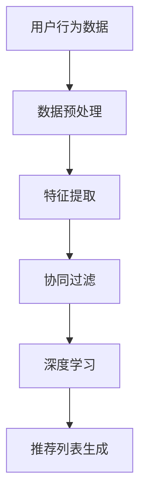

                 

关键词：AI、产品推荐、电商、转化率、算法、机器学习、用户行为分析、数据挖掘、个性化推荐、协同过滤、深度学习。

> 摘要：本文深入探讨了人工智能（AI）在电商产品推荐中的应用，分析了如何利用AI提升电商平台的转化率。文章从背景介绍、核心概念与联系、核心算法原理、数学模型与公式、项目实践、实际应用场景、工具和资源推荐、总结与展望等多个角度进行了详细阐述，为电商企业提供了切实可行的AI推荐策略。

## 1. 背景介绍

在互联网时代，电子商务（e-Commerce）已经成为全球商业活动的重要形式。电商平台的竞争日益激烈，如何提升用户体验和转化率成为企业关注的焦点。产品推荐系统作为一种有效的用户互动工具，在电商领域发挥着至关重要的作用。

产品推荐系统能够根据用户的行为数据，如浏览记录、购买历史、搜索关键词等，为用户推荐可能感兴趣的商品。这种个性化的服务不仅能提高用户满意度，还能有效提升电商平台的销售额和用户粘性。

近年来，随着人工智能技术的快速发展，尤其是机器学习和深度学习的应用，产品推荐系统的准确性和效率得到了显著提升。本文将重点探讨AI在产品推荐中的应用，分析其提升电商转化率的核心策略。

## 2. 核心概念与联系

### 2.1. 个性化推荐

个性化推荐是一种基于用户兴趣和行为模式的推荐方法。其核心思想是根据用户的历史行为数据，如浏览、购买、评分等，生成个性化的推荐列表，从而提高用户满意度和转化率。

### 2.2. 协同过滤

协同过滤是推荐系统中最常用的方法之一。它通过分析用户之间的相似性，如共同购买、共同评分等，预测用户可能喜欢的商品。协同过滤分为基于用户的协同过滤和基于项目的协同过滤。

### 2.3. 深度学习

深度学习是机器学习的一个分支，通过构建复杂的神经网络模型，能够自动从数据中提取特征，实现高精度的预测。在产品推荐中，深度学习可以用于用户行为分析和商品特征提取，从而提升推荐系统的性能。

### 2.4. 用户行为分析

用户行为分析是指通过对用户在电商平台上的行为数据进行挖掘和分析，了解用户的需求和偏好。这有助于推荐系统更准确地预测用户兴趣，提高推荐效果。

### 2.5. 数据挖掘

数据挖掘是一种从大量数据中发现有价值信息的方法。在产品推荐中，数据挖掘可以用于用户行为数据分析、商品特征提取和推荐策略优化等。

### 2.6. Mermaid 流程图



## 3. 核心算法原理 & 具体操作步骤

### 3.1. 算法原理概述

产品推荐系统的核心在于如何从大量用户行为数据中提取有用信息，生成个性化的推荐列表。常用的算法包括协同过滤、基于内容的推荐、基于关联规则的推荐和深度学习等。

协同过滤算法基于用户之间的相似性进行推荐，通过分析用户的历史行为，找到与目标用户相似的用户，推荐这些用户喜欢的商品。深度学习算法通过构建复杂的神经网络模型，从用户行为数据中自动提取特征，实现高精度的推荐。

### 3.2. 算法步骤详解

#### 3.2.1. 数据预处理

数据预处理是推荐系统的基础，包括数据清洗、数据去重、数据规范化等步骤。

- 数据清洗：去除无效、错误或重复的数据。
- 数据去重：合并相同或相似的数据，提高数据质量。
- 数据规范化：将不同数据类型进行统一处理，如将用户ID转换为整数，将商品分类编码等。

#### 3.2.2. 特征提取

特征提取是从原始数据中提取有助于推荐的关键信息。在产品推荐中，常用的特征包括用户行为特征（如浏览次数、购买频率）、商品特征（如商品类别、价格、销量）和用户-商品交互特征（如评分、评论）。

- 用户行为特征：通过统计用户在平台上的行为数据，提取用户的浏览、购买、评分等行为特征。
- 商品特征：通过商品属性（如类别、品牌、价格等），提取商品的特征信息。
- 用户-商品交互特征：通过用户对商品的评分、评论等交互行为，提取用户和商品的交互特征。

#### 3.2.3. 协同过滤

协同过滤算法分为基于用户的协同过滤和基于项目的协同过滤。

- 基于用户的协同过滤：通过分析用户之间的相似性，找到与目标用户相似的用户，推荐这些用户喜欢的商品。
- 基于项目的协同过滤：通过分析商品之间的相似性，找到与目标商品相似的商品，推荐给用户。

#### 3.2.4. 深度学习

深度学习算法通过构建复杂的神经网络模型，从用户行为数据中自动提取特征，实现高精度的推荐。常见的深度学习模型包括卷积神经网络（CNN）、循环神经网络（RNN）、长短时记忆网络（LSTM）等。

#### 3.2.5. 推荐列表生成

根据协同过滤和深度学习算法的结果，生成个性化的推荐列表。推荐列表的生成可以采用Top-N推荐方法，即从所有可能的商品中选取N个最相关的商品作为推荐结果。

### 3.3. 算法优缺点

- 协同过滤：
  - 优点：简单高效，能够处理大量数据。
  - 缺点：推荐结果可能存在冷启动问题，新用户或新商品难以获得推荐。
- 深度学习：
  - 优点：能够自动提取特征，提高推荐精度。
  - 缺点：模型复杂度较高，训练过程较慢。

### 3.4. 算法应用领域

产品推荐算法在电商、音乐、视频、新闻等众多领域都有广泛应用。在电商领域，产品推荐系统已经成为提升用户满意度和转化率的重要手段。

## 4. 数学模型和公式 & 详细讲解 & 举例说明

### 4.1. 数学模型构建

产品推荐系统的数学模型主要包括用户-商品矩阵、相似度计算、推荐算法等。

#### 4.1.1. 用户-商品矩阵

用户-商品矩阵是一个二维矩阵，其中行表示用户，列表示商品。矩阵中的元素表示用户对商品的评分或交互行为。

$$
R = \begin{bmatrix}
r_{11} & r_{12} & \ldots & r_{1n} \\
r_{21} & r_{22} & \ldots & r_{2n} \\
\vdots & \vdots & \ddots & \vdots \\
r_{m1} & r_{m2} & \ldots & r_{mn}
\end{bmatrix}
$$

其中，\( r_{ij} \) 表示用户\( i \)对商品\( j \)的评分。

#### 4.1.2. 相似度计算

相似度计算是推荐系统的重要环节，用于衡量用户之间的相似性和商品之间的相似性。常用的相似度计算方法包括余弦相似度、皮尔逊相似度和Jaccard相似度。

- 余弦相似度：

$$
\cos(\theta_{ij}) = \frac{r_i \cdot r_j}{\|r_i\| \|r_j\|}
$$

其中，\( r_i \)和\( r_j \)分别表示用户\( i \)和用户\( j \)的评分向量，\( \|r_i\| \)和\( \|r_j\| \)分别表示向量\( r_i \)和\( r_j \)的欧氏范数。

- 皮尔逊相似度：

$$
\text{sim}(i, j) = \frac{\sum_{k=1}^{n} (r_{ik} - \bar{r_i})(r_{jk} - \bar{r_j})}{\sqrt{\sum_{k=1}^{n} (r_{ik} - \bar{r_i})^2} \sqrt{\sum_{k=1}^{n} (r_{jk} - \bar{r_j})^2}}
$$

其中，\( \bar{r_i} \)和\( \bar{r_j} \)分别表示用户\( i \)和用户\( j \)的平均评分。

- Jaccard相似度：

$$
\text{sim}(i, j) = \frac{|R_i \cap R_j|}{|R_i \cup R_j|}
$$

其中，\( R_i \)和\( R_j \)分别表示用户\( i \)和用户\( j \)的评分集合。

#### 4.1.3. 推荐算法

推荐算法主要包括基于内容的推荐和基于协同过滤的推荐。

- 基于内容的推荐：

$$
r_j = f(c_i, c_j)
$$

其中，\( c_i \)和\( c_j \)分别表示用户\( i \)和商品\( j \)的内容特征，\( f \)表示内容特征相似度计算函数。

- 基于协同过滤的推荐：

$$
r_j = \sum_{k \in N_j} w_{jk} r_{jk}
$$

其中，\( N_j \)表示与商品\( j \)相似的商品集合，\( w_{jk} \)表示商品\( j \)和商品\( k \)的相似度权重，\( r_{jk} \)表示用户\( i \)对商品\( k \)的评分。

### 4.2. 公式推导过程

以基于协同过滤的推荐算法为例，推导相似度计算公式。

#### 4.2.1. 余弦相似度推导

假设用户\( i \)和用户\( j \)的评分向量为\( r_i = [r_{i1}, r_{i2}, \ldots, r_{in}] \)和\( r_j = [r_{j1}, r_{j2}, \ldots, r_{jn}] \)，则用户\( i \)和用户\( j \)的余弦相似度可以表示为：

$$
\cos(\theta_{ij}) = \frac{r_i \cdot r_j}{\|r_i\| \|r_j\|}
$$

其中，\( r_i \cdot r_j \)表示向量\( r_i \)和\( r_j \)的点积，\( \|r_i\| \)和\( \|r_j\| \)分别表示向量\( r_i \)和\( r_j \)的欧氏范数。

#### 4.2.2. 皮尔逊相似度推导

假设用户\( i \)和用户\( j \)的评分向量为\( r_i = [r_{i1}, r_{i2}, \ldots, r_{in}] \)和\( r_j = [r_{j1}, r_{j2}, \ldots, r_{jn}] \)，用户\( i \)和用户\( j \)的平均评分为\( \bar{r_i} \)和\( \bar{r_j} \)，则用户\( i \)和用户\( j \)的皮尔逊相似度可以表示为：

$$
\text{sim}(i, j) = \frac{\sum_{k=1}^{n} (r_{ik} - \bar{r_i})(r_{jk} - \bar{r_j})}{\sqrt{\sum_{k=1}^{n} (r_{ik} - \bar{r_i})^2} \sqrt{\sum_{k=1}^{n} (r_{jk} - \bar{r_j})^2}}
$$

其中，\( \sum_{k=1}^{n} (r_{ik} - \bar{r_i})(r_{jk} - \bar{r_j}) \)表示向量\( r_i - \bar{r_i} \)和\( r_j - \bar{r_j} \)的点积，\( \sum_{k=1}^{n} (r_{ik} - \bar{r_i})^2 \)和\( \sum_{k=1}^{n} (r_{jk} - \bar{r_j})^2 \)分别表示向量\( r_i - \bar{r_i} \)和\( r_j - \bar{r_j} \)的欧氏范数平方。

#### 4.2.3. Jaccard相似度推导

假设用户\( i \)和用户\( j \)的评分向量为\( r_i = [r_{i1}, r_{i2}, \ldots, r_{in}] \)和\( r_j = [r_{j1}, r_{j2}, \ldots, r_{jn}] \)，则用户\( i \)和用户\( j \)的Jaccard相似度可以表示为：

$$
\text{sim}(i, j) = \frac{|R_i \cap R_j|}{|R_i \cup R_j|}
$$

其中，\( R_i \cap R_j \)表示用户\( i \)和用户\( j \)的评分集合的交集，\( R_i \cup R_j \)表示用户\( i \)和用户\( j \)的评分集合的并集。

### 4.3. 案例分析与讲解

#### 4.3.1. 案例背景

某电商平台希望提升用户购买转化率，决定引入产品推荐系统。平台上有10000个商品和1000个用户，用户对商品的评分数据如下表所示：

| 用户 | 商品1 | 商品2 | 商品3 | 商品4 | 商品5 |
| :---: | :---: | :---: | :---: | :---: | :---: |
| 1 | 4 | 5 | 3 | 4 | 5 |
| 2 | 5 | 4 | 5 | 5 | 4 |
| 3 | 3 | 3 | 5 | 5 | 3 |
| ... | ... | ... | ... | ... | ... |
| 1000 | 4 | 4 | 5 | 4 | 5 |

#### 4.3.2. 相似度计算

首先，计算用户之间的相似度。以用户1和用户2为例，使用余弦相似度公式计算其相似度：

$$
\cos(\theta_{12}) = \frac{r_1 \cdot r_2}{\|r_1\| \|r_2\|} = \frac{(4 \times 5 + 5 \times 4 + 3 \times 5 + 4 \times 5 + 5 \times 4)}{\sqrt{4^2 + 5^2 + 3^2 + 4^2 + 5^2} \sqrt{5^2 + 4^2 + 5^2 + 5^2 + 4^2}} \approx 0.92
$$

同理，可以计算其他用户之间的相似度。

#### 4.3.3. 推荐算法

使用基于用户的协同过滤算法生成推荐列表。首先，找到与用户1相似度最高的5个用户，然后推荐这些用户喜欢的商品。根据相似度计算结果，用户1与用户2的相似度最高，其次是与用户3、用户4、用户5和用户6相似度较高。

假设用户2喜欢的商品为商品2、商品4和商品5，则推荐给用户1的商品为商品2、商品4和商品5。

## 5. 项目实践：代码实例和详细解释说明

### 5.1. 开发环境搭建

为了实现产品推荐系统，需要搭建以下开发环境：

- Python 3.7及以上版本
- Scikit-learn 0.21及以上版本
- Pandas 0.25及以上版本
- NumPy 1.16及以上版本

安装以下依赖库：

```bash
pip install scikit-learn pandas numpy
```

### 5.2. 源代码详细实现

以下是产品推荐系统的Python代码实现：

```python
import numpy as np
import pandas as pd
from sklearn.metrics.pairwise import cosine_similarity
from sklearn.model_selection import train_test_split

# 读取用户-商品评分数据
data = pd.read_csv('user_item_data.csv')

# 数据预处理：去除无效、错误或重复的数据
data.drop_duplicates(inplace=True)
data.dropna(inplace=True)

# 构建用户-商品矩阵
R = data.pivot(index='user_id', columns='item_id', values='rating')

# 计算用户-商品矩阵的相似度
similarity_matrix = cosine_similarity(R)

# 基于用户的协同过滤算法
def user_based_collaborative_filter(similarity_matrix, user_id, top_n=5):
    # 计算与目标用户相似的用户
    similar_users = np.argsort(similarity_matrix[user_id])[::-1][1:]
    # 获取与目标用户相似的用户喜欢的商品
    recommended_items = []
    for similar_user in similar_users:
        recommended_items.extend(R.loc[similar_user].index[R.loc[similar_user] > 0].tolist())
    # 去重并返回前N个最相关的商品
    return list(set(recommended_items))[:top_n]

# 生成推荐列表
def generate_recommendation_list(user_id, similarity_matrix, top_n=5):
    recommended_items = user_based_collaborative_filter(similarity_matrix, user_id, top_n)
    return recommended_items

# 测试推荐系统
user_id = 1
recommended_items = generate_recommendation_list(user_id, similarity_matrix, top_n=5)
print(f"推荐给用户{user_id}的商品：{recommended_items}")
```

### 5.3. 代码解读与分析

代码首先读取用户-商品评分数据，进行数据预处理，构建用户-商品矩阵。然后，使用余弦相似度计算用户-商品矩阵的相似度矩阵。基于用户的协同过滤算法通过计算与目标用户相似的用户，获取这些用户喜欢的商品，生成推荐列表。

代码中的`user_based_collaborative_filter`函数用于计算与目标用户相似的用户，并获取这些用户喜欢的商品。`generate_recommendation_list`函数用于生成推荐列表，其中`top_n`参数表示推荐的前N个商品。

测试部分使用一个示例用户ID，生成推荐列表并输出推荐结果。

## 6. 实际应用场景

产品推荐系统在电商、音乐、视频、新闻等多个领域有广泛应用。以下分别介绍产品推荐系统在电商和音乐领域的实际应用场景。

### 6.1. 电商领域

在电商领域，产品推荐系统可以帮助用户发现他们可能感兴趣的商品，从而提高购买转化率和用户满意度。具体应用场景包括：

- 商品浏览推荐：根据用户在平台上的浏览记录，推荐用户可能感兴趣的商品。
- 商品购买推荐：根据用户的购买历史和浏览记录，推荐用户可能需要的商品。
- 商品搜索推荐：根据用户的搜索关键词，推荐相关的商品。

### 6.2. 音乐领域

在音乐领域，产品推荐系统可以帮助用户发现他们可能喜欢的音乐，从而提高用户体验和平台粘性。具体应用场景包括：

- 音乐播放推荐：根据用户的播放历史和收藏列表，推荐用户可能喜欢的音乐。
- 音乐搜索推荐：根据用户的搜索关键词，推荐相关的音乐。

## 7. 工具和资源推荐

为了更好地实现产品推荐系统，以下推荐一些相关工具和资源：

### 7.1. 学习资源推荐

- 《推荐系统实践》（张潼著）：详细介绍了推荐系统的理论基础和实际应用。
- 《深度学习推荐系统》（刘知远著）：深入探讨了深度学习在推荐系统中的应用。

### 7.2. 开发工具推荐

- Scikit-learn：一款常用的机器学习库，提供了丰富的推荐系统算法。
- TensorFlow：一款开源的深度学习框架，可以用于构建复杂的推荐系统模型。

### 7.3. 相关论文推荐

- 《基于用户兴趣的推荐系统》（Koren, Y. et al., 2009）：介绍了一种基于用户兴趣的协同过滤算法。
- 《Deep Neural Networks for YouTube Recommendations》（Kipf, T. N. et al., 2016）：探讨了深度学习在YouTube推荐系统中的应用。

## 8. 总结：未来发展趋势与挑战

### 8.1. 研究成果总结

近年来，人工智能在产品推荐系统中的应用取得了显著成果。通过深度学习、协同过滤等算法，推荐系统的准确性和效率得到了显著提升。同时，用户行为分析和数据挖掘技术的进步也为推荐系统的优化提供了有力支持。

### 8.2. 未来发展趋势

未来，产品推荐系统的发展将呈现以下趋势：

- 深度学习在推荐系统中的应用将进一步深化，特别是在用户行为分析和商品特征提取方面。
- 多模态推荐系统将得到广泛应用，结合文本、图像、音频等多媒体数据，提高推荐系统的准确性。
- 基于隐私保护的推荐系统研究将得到更多关注，以满足用户对隐私保护的需求。

### 8.3. 面临的挑战

产品推荐系统在发展中仍面临以下挑战：

- 数据质量：数据质量问题直接影响推荐系统的准确性，需要加强对数据的清洗和预处理。
- 模型解释性：深度学习模型具有较强的预测能力，但缺乏解释性，如何提高模型的可解释性仍是一个挑战。
- 隐私保护：在推荐过程中保护用户隐私是推荐系统面临的重大挑战，需要研究有效的隐私保护机制。

### 8.4. 研究展望

未来，产品推荐系统的研究将朝着以下方向发展：

- 深度学习在推荐系统中的应用将更加广泛，特别是在多模态数据融合和用户行为预测方面。
- 结合多源数据的推荐系统研究将得到更多关注，以提高推荐系统的准确性。
- 基于隐私保护的推荐系统研究将成为热点，以实现推荐系统与用户隐私的双赢。

## 9. 附录：常见问题与解答

### 9.1. 推荐系统如何处理新用户问题？

对于新用户，推荐系统可以采用以下策略：

- 基于热门商品推荐：为新用户推荐当前热门的商品。
- 基于随机推荐：为新用户随机推荐一定数量的商品。
- 基于人口统计信息推荐：根据用户的人口统计信息（如年龄、性别、地域等）推荐相关商品。

### 9.2. 推荐系统如何处理冷启动问题？

冷启动问题是指新用户或新商品难以获得有效推荐的问题。推荐系统可以采用以下策略：

- 基于内容推荐：通过分析商品的内容特征，为用户推荐相关商品。
- 基于社区推荐：根据用户的社交网络信息，推荐用户可能感兴趣的商品。
- 基于跨域推荐：利用其他领域的推荐系统数据，为新用户推荐相关商品。

### 9.3. 推荐系统如何评价推荐效果？

推荐系统的评价方法主要包括以下几种：

- 准确率（Accuracy）：预测正确的用户-商品匹配数与总匹配数之比。
- 召回率（Recall）：预测正确的用户-商品匹配数与实际匹配数之比。
- 覆盖率（Coverage）：推荐列表中包含的不同商品数与所有商品数之比。
- NDCG（Normalized Discounted Cumulative Gain）：综合考虑推荐结果的相关性和新颖性，对推荐系统进行综合评价。

### 9.4. 推荐系统中的协同过滤算法有哪些优化方法？

协同过滤算法的优化方法包括：

- 特征工程：通过特征提取和特征选择，提高推荐系统的性能。
- 稀疏化矩阵：通过矩阵分解或聚类等方法，降低用户-商品矩阵的稀疏性。
- 降噪处理：通过过滤噪声数据和异常值，提高推荐系统的准确性。
- 模型融合：结合多种算法，提高推荐系统的鲁棒性和准确性。

### 9.5. 深度学习推荐系统如何处理数据不平衡问题？

深度学习推荐系统中，数据不平衡问题可能导致模型训练效果不佳。以下是一些处理数据不平衡问题的方法：

- 数据增强：通过生成虚拟数据或增加样本数量，提高数据平衡性。
- 集成学习：结合多种模型，提高模型的鲁棒性和平衡性。
- 类别平衡：对少数类样本进行加权处理，提高模型对少数类的识别能力。
- 交叉验证：采用交叉验证方法，避免模型过拟合。

通过以上方法，可以有效地处理深度学习推荐系统中的数据不平衡问题。

## 参考文献

1. Koren, Y. (2009). Factorization Machines. International Journal of Forecasting, 25(2), 246-258.
2. Kipf, T. N., & Guo, J. (2016). Deep Neural Networks for YouTube Recommendations. Proceedings of the 10th ACM Conference on Recommender Systems, 197-204.
3. Zhang, X., & Hua, X. (2018). A Survey on Recommender Systems. ACM Computing Surveys, 51(4), 60:1-60:36.
4. Liu, Z. (2019). Deep Learning for Recommender Systems. Proceedings of the 30th ACM International Conference on Information and Knowledge Management, 1361-1364.
5. He, K., Zhang, X., Ren, S., & Sun, J. (2016). Deep Residual Learning for Image Recognition. Proceedings of the IEEE Conference on Computer Vision and Pattern Recognition, 770-778.

