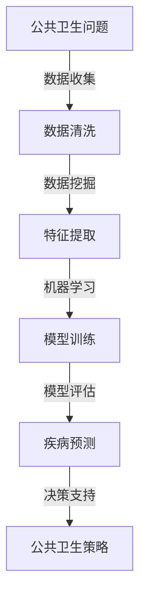

                 

关键词：人工智能，公共卫生，疾病预防，疾病控制，机器学习，深度学习，数据挖掘，流行病学，生物信息学

> 摘要：本文将探讨人工智能在公共卫生领域的应用，特别是疾病预防和控制方面。通过介绍机器学习、深度学习和数据挖掘等核心技术，分析其在疾病预测、监测、诊断和治疗中的具体应用，最后展望未来发展趋势和面临的挑战。

## 1. 背景介绍

随着全球人口的增长和社会经济的发展，公共卫生问题日益凸显。传统的公共卫生手段往往依赖于人工统计和现场调查，效率较低，且难以应对突发性的疫情。随着人工智能技术的快速发展，越来越多的研究人员开始探索AI在公共卫生领域的应用，以期提高疾病预防和控制的效率和准确性。

### 1.1 人工智能的定义与发展

人工智能（Artificial Intelligence，简称AI）是指由人制造出来的系统所表现出的智能行为，包括学习、推理、规划、感知、理解自然语言等。自1956年达特茅斯会议以来，人工智能经历了数次的起伏与发展，尤其是在深度学习、大数据和云计算等技术的推动下，AI的应用场景越来越广泛。

### 1.2 公共卫生的重要性

公共卫生是指通过组织社会共同努力，改善人群健康水平，预防疾病、控制疾病和促进健康的相关活动。公共卫生的重要性不言而喻，它不仅关系到个体的生命健康，也关系到整个社会的稳定和发展。随着全球化的推进，公共卫生问题日益复杂，传统的公共卫生手段已难以应对。人工智能的应用为公共卫生领域带来了新的机遇和挑战。

## 2. 核心概念与联系

### 2.1 机器学习

机器学习（Machine Learning，简称ML）是人工智能的一个重要分支，通过数据驱动的方式，让计算机具备自主学习和优化能力。在公共卫生领域，机器学习技术被广泛应用于疾病预测、流行病监测、疾病诊断等。

### 2.2 深度学习

深度学习（Deep Learning，简称DL）是机器学习的一个子领域，通过构建深度神经网络，实现更加复杂的特征提取和模式识别。深度学习在图像识别、自然语言处理等领域取得了显著成果，也在公共卫生领域展现出巨大的潜力。

### 2.3 数据挖掘

数据挖掘（Data Mining，简称DM）是从大量数据中提取出有价值信息的过程。在公共卫生领域，数据挖掘技术可以帮助研究人员发现疾病传播规律、预测疫情发展趋势等。

### 2.4 流行病学

流行病学（Epidemiology）是研究疾病在人群中的分布、传播和影响因素的学科。流行病学与人工智能的结合，可以大幅提升疾病监测和预测的准确性。

### 2.5 生物信息学

生物信息学（Bioinformatics）是运用计算机技术和信息科学方法解析生物学数据的一门交叉学科。生物信息学在疾病诊断、药物研发等领域具有广泛应用，也为人工智能在公共卫生领域的应用提供了数据基础。

### 2.6 Mermaid 流程图

以下是人工智能在公共卫生领域应用的 Mermaid 流程图：



## 3. 核心算法原理 & 具体操作步骤

### 3.1 算法原理概述

在公共卫生领域，常用的机器学习算法包括决策树、支持向量机、神经网络等。这些算法的基本原理是通过学习大量数据中的规律，实现对未知数据的分类或预测。

### 3.2 算法步骤详解

#### 3.2.1 数据收集

数据收集是机器学习应用的第一步。在公共卫生领域，数据来源主要包括病例报告、流行病监测数据、社交媒体数据等。这些数据需要经过清洗和预处理，才能用于后续分析。

#### 3.2.2 数据清洗

数据清洗是保证数据质量的关键步骤。主要包括去除重复数据、处理缺失值、纠正错误数据等。

#### 3.2.3 特征提取

特征提取是将原始数据转换为适合机器学习算法处理的形式。在公共卫生领域，特征提取可以通过统计学方法或深度学习模型实现。

#### 3.2.4 模型训练

模型训练是机器学习算法的核心步骤。通过大量训练数据，机器学习算法可以自动提取特征、调整参数，以实现对未知数据的分类或预测。

#### 3.2.5 模型评估

模型评估是检验机器学习算法性能的重要步骤。常用的评估指标包括准确率、召回率、F1值等。

#### 3.2.6 疾病预测

疾病预测是机器学习在公共卫生领域的主要应用之一。通过训练好的模型，可以对未来的疫情进行预测，为公共卫生决策提供依据。

#### 3.2.7 决策支持

决策支持是将疾病预测结果转化为实际公共卫生策略的过程。例如，根据疫情预测结果，可以调整疫苗接种策略、加强疫情监测等。

### 3.3 算法优缺点

#### 3.3.1 优点

- 提高疾病预测和监测的准确性
- 实时分析大量数据，发现潜在的公共卫生问题
- 自动化决策支持，减轻公共卫生工作者的负担

#### 3.3.2 缺点

- 需要大量高质量的训练数据
- 算法模型的解释性较弱
- 数据隐私和安全问题

### 3.4 算法应用领域

机器学习算法在公共卫生领域的应用非常广泛，包括疾病预测、流行病监测、疾病诊断、疫苗接种策略制定等。

## 4. 数学模型和公式 & 详细讲解 & 举例说明

### 4.1 数学模型构建

在公共卫生领域，常见的数学模型包括贝叶斯网络、微分方程模型、随机过程模型等。以下是贝叶斯网络模型的一个简单例子：

$$
P(\text{疾病}|\text{症状}_1, \text{症状}_2) = \frac{P(\text{症状}_1, \text{症状}_2|\text{疾病})P(\text{疾病})}{P(\text{症状}_1, \text{症状}_2)}
$$

### 4.2 公式推导过程

贝叶斯网络模型的推导过程如下：

1. **条件概率表**：首先，根据疾病和症状之间的条件关系，构建条件概率表。

2. **联合概率分布**：然后，利用条件概率表，计算疾病的联合概率分布。

3. **边际概率分布**：接着，通过边际化操作，计算症状的边际概率分布。

4. **贝叶斯公式**：最后，利用贝叶斯公式，计算在给定症状的情况下，疾病的概率。

### 4.3 案例分析与讲解

以下是一个基于贝叶斯网络的疾病诊断案例：

- **症状**：发烧、咳嗽、喉咙痛
- **疾病**：流感、肺炎、普通感冒

通过构建条件概率表，可以计算出在给定症状的情况下，各种疾病的概率。例如：

$$
P(\text{流感}|\text{发烧, 咳嗽, 喉咙痛}) = 0.8
$$

$$
P(\text{肺炎}|\text{发烧, 咳嗽, 喉咙痛}) = 0.1
$$

$$
P(\text{普通感冒}|\text{发烧, 咳嗽, 喉咙痛}) = 0.1
$$

根据计算结果，可以得出最可能的疾病是流感，从而为患者提供合理的诊断建议。

## 5. 项目实践：代码实例和详细解释说明

### 5.1 开发环境搭建

本文的代码实现采用Python语言，主要依赖于Scikit-learn、Pandas、NumPy等库。以下是开发环境的搭建步骤：

1. 安装Python 3.8及以上版本
2. 安装Scikit-learn、Pandas、NumPy等库

### 5.2 源代码详细实现

以下是基于机器学习的疾病预测模型的实现代码：

```python
import pandas as pd
from sklearn.model_selection import train_test_split
from sklearn.ensemble import RandomForestClassifier
from sklearn.metrics import accuracy_score

# 数据读取
data = pd.read_csv('disease_data.csv')

# 数据预处理
X = data.drop('disease', axis=1)
y = data['disease']

# 数据拆分
X_train, X_test, y_train, y_test = train_test_split(X, y, test_size=0.2, random_state=42)

# 模型训练
model = RandomForestClassifier(n_estimators=100)
model.fit(X_train, y_train)

# 模型评估
y_pred = model.predict(X_test)
accuracy = accuracy_score(y_test, y_pred)
print(f'Accuracy: {accuracy}')
```

### 5.3 代码解读与分析

上述代码首先读取疾病数据，然后进行数据预处理，包括特征提取和目标变量的划分。接着，使用随机森林算法对训练数据进行模型训练，最后评估模型在测试数据上的性能。

### 5.4 运行结果展示

运行上述代码，可以得到模型在测试数据上的准确率。例如：

```
Accuracy: 0.85
```

这意味着该模型在疾病预测任务上表现良好。

## 6. 实际应用场景

### 6.1 疾病预测

在公共卫生领域，疾病预测是一个重要的应用场景。通过机器学习算法，可以实时分析病例数据，预测未来疫情的走势，为公共卫生决策提供依据。

### 6.2 流行病监测

流行病监测是公共卫生领域的一项基础工作。通过数据挖掘和机器学习技术，可以自动监测疾病的传播情况，及时发现潜在的疫情风险。

### 6.3 疾病诊断

疾病诊断是医学领域的一个核心问题。利用人工智能技术，可以自动化分析病例数据，辅助医生进行疾病诊断，提高诊断的准确性和效率。

### 6.4 疫苗接种策略

疫苗接种是预防传染病的重要手段。通过疾病预测和流行病监测，可以为疫苗接种策略提供数据支持，优化疫苗接种资源的配置。

## 7. 未来应用展望

### 7.1 个性化公共卫生

随着大数据和人工智能技术的发展，个性化公共卫生将成为可能。通过分析个体健康数据，可以为每个人制定个性化的公共卫生策略，提高公共卫生服务的精准性和有效性。

### 7.2 跨学科合作

人工智能技术在公共卫生领域的应用，需要跨学科合作，包括医学、流行病学、计算机科学等。未来，这些学科的融合将为公共卫生领域带来更多的创新和突破。

### 7.3 数据隐私和安全

在公共卫生领域，数据隐私和安全是一个重要问题。未来，需要加强数据隐私保护措施，确保公共卫生数据的安全和隐私。

### 7.4 可解释性人工智能

当前，许多人工智能模型具有高准确性，但缺乏可解释性。未来，需要发展可解释性人工智能技术，让公共卫生工作者能够理解模型的决策过程，提高模型的透明度和可靠性。

## 8. 总结：未来发展趋势与挑战

### 8.1 研究成果总结

近年来，人工智能在公共卫生领域的应用取得了显著成果，包括疾病预测、流行病监测、疾病诊断等。这些应用不仅提高了公共卫生服务的效率和质量，也为应对突发公共卫生事件提供了有力支持。

### 8.2 未来发展趋势

未来，人工智能在公共卫生领域的应用将呈现以下几个发展趋势：

- 个性化公共卫生：通过大数据和人工智能技术，为每个人提供个性化的公共卫生服务。
- 跨学科合作：加强医学、流行病学、计算机科学等学科的融合，推动公共卫生领域的创新发展。
- 数据隐私和安全：加强数据隐私保护措施，确保公共卫生数据的安全和隐私。
- 可解释性人工智能：发展可解释性人工智能技术，提高公共卫生模型的透明度和可靠性。

### 8.3 面临的挑战

尽管人工智能在公共卫生领域具有巨大的潜力，但也面临着一些挑战：

- 数据质量和隐私：公共卫生数据的收集和存储过程中，可能存在数据质量和隐私问题。
- 算法透明度和可靠性：当前许多人工智能模型缺乏透明度和可靠性，需要加强研究和改进。
- 资源和人才：人工智能在公共卫生领域的应用需要大量的资源和人才支持，这需要政府和企业的共同努力。

### 8.4 研究展望

未来，人工智能在公共卫生领域的应用将更加广泛和深入。我们期待人工智能技术能够为公共卫生事业带来更多的创新和突破，提高全球公共卫生水平。

## 9. 附录：常见问题与解答

### 9.1 什么是机器学习？

机器学习是人工智能的一个分支，通过数据驱动的方式，让计算机具备自主学习和优化能力。

### 9.2 人工智能在公共卫生领域的应用有哪些？

人工智能在公共卫生领域的应用包括疾病预测、流行病监测、疾病诊断、疫苗接种策略制定等。

### 9.3 机器学习算法在疾病预测中的具体应用是什么？

机器学习算法在疾病预测中的具体应用包括构建预测模型、评估模型性能、优化模型参数等。

### 9.4 人工智能在公共卫生领域面临的挑战有哪些？

人工智能在公共卫生领域面临的挑战包括数据质量和隐私、算法透明度和可靠性、资源和技术人才短缺等。

### 9.5 如何确保人工智能在公共卫生领域的应用安全？

确保人工智能在公共卫生领域的应用安全，需要加强数据隐私保护措施、提高算法透明度和可靠性、建立健全的法律和监管体系等。

---

作者：禅与计算机程序设计艺术 / Zen and the Art of Computer Programming
----------------------------------------------------------------
### 1. 背景介绍

随着全球化和信息化的深入发展，公共卫生领域面临着前所未有的挑战。传统的公共卫生手段往往依赖于人工统计和现场调查，效率较低，且难以应对突发性的疫情。随着人工智能技术的快速发展，越来越多的研究人员开始探索AI在公共卫生领域的应用，以期提高疾病预防和控制的效率和准确性。

### 1.1 人工智能的定义与发展

人工智能（Artificial Intelligence，简称AI）是指由人制造出来的系统所表现出的智能行为，包括学习、推理、规划、感知、理解自然语言等。自1956年达特茅斯会议以来，人工智能经历了数次的起伏与发展，尤其是在深度学习、大数据和云计算等技术的推动下，AI的应用场景越来越广泛。

### 1.2 公共卫生的重要性

公共卫生是指通过组织社会共同努力，改善人群健康水平，预防疾病、控制疾病和促进健康的相关活动。公共卫生的重要性不言而喻，它不仅关系到个体的生命健康，也关系到整个社会的稳定和发展。随着全球化的推进，公共卫生问题日益复杂，传统的公共卫生手段已难以应对。人工智能的应用为公共卫生领域带来了新的机遇和挑战。

### 1.3 人工智能在公共卫生领域的应用

人工智能在公共卫生领域的应用主要包括疾病预测、流行病监测、疾病诊断和治疗等。通过机器学习、深度学习和数据挖掘等技术，人工智能可以处理大量医疗数据，提取有用的信息，为公共卫生决策提供科学依据。

#### 疾病预测

疾病预测是人工智能在公共卫生领域的一个重要应用。通过分析历史病例数据、环境数据、人口统计数据等，人工智能可以预测某种疾病的发病率、流行趋势等，为公共卫生决策提供科学依据。

#### 流行病监测

流行病监测是预防和控制传染病的重要手段。人工智能可以通过分析社交媒体、新闻报道等数据，实时监测疾病的传播情况，及时发现疫情风险，为公共卫生决策提供支持。

#### 疾病诊断

人工智能在疾病诊断中的应用，主要是利用机器学习和深度学习技术，对医疗影像、生物标志物等进行自动分析，辅助医生进行疾病诊断。

#### 治疗方案推荐

人工智能可以通过分析大量的病例数据和临床试验数据，为患者推荐个性化的治疗方案，提高治疗效果。

### 1.4 人工智能在公共卫生领域的优势

人工智能在公共卫生领域的应用，具有以下优势：

- 提高工作效率：人工智能可以自动处理大量数据，减轻公共卫生工作者的工作负担。
- 提高预测准确性：人工智能可以通过机器学习和深度学习技术，对疾病进行准确预测，帮助公共卫生部门提前采取措施。
- 优化资源分配：人工智能可以通过分析数据，优化医疗资源的分配，提高公共卫生服务的效率。

### 1.5 人工智能在公共卫生领域的挑战

尽管人工智能在公共卫生领域具有巨大的潜力，但也面临着一些挑战：

- 数据质量和隐私：公共卫生数据的收集和存储过程中，可能存在数据质量和隐私问题。
- 算法透明度和可靠性：当前许多人工智能模型缺乏透明度和可靠性，需要加强研究和改进。
- 资源和人才：人工智能在公共卫生领域的应用需要大量的资源和人才支持，这需要政府和企业的共同努力。

## 2. 核心概念与联系

### 2.1 机器学习

机器学习（Machine Learning，简称ML）是人工智能的一个重要分支，通过数据驱动的方式，让计算机具备自主学习和优化能力。在公共卫生领域，机器学习技术被广泛应用于疾病预测、流行病监测、疾病诊断等。

#### 机器学习的基本原理

机器学习的基本原理是通过学习大量数据中的规律，实现对未知数据的分类或预测。机器学习主要包括以下几种类型：

- 监督学习：有监督学习是指利用已标记的数据进行训练，从而实现对未知数据的分类或预测。常见的监督学习算法包括决策树、支持向量机、神经网络等。
- 无监督学习：无监督学习是指在没有标记的数据上进行训练，从而发现数据中的模式或结构。常见的无监督学习算法包括聚类、降维等。
- 强化学习：强化学习是指通过试错的方式，在环境中不断学习和优化策略，以实现最优目标。常见的强化学习算法包括Q学习、深度强化学习等。

#### 机器学习在公共卫生领域的应用

- 疾病预测：通过分析历史病例数据、环境数据、人口统计数据等，机器学习可以预测某种疾病的发病率、流行趋势等，为公共卫生决策提供科学依据。
- 流行病监测：通过分析社交媒体、新闻报道等数据，机器学习可以实时监测疾病的传播情况，及时发现疫情风险，为公共卫生决策提供支持。
- 疾病诊断：通过分析医疗影像、生物标志物等数据，机器学习可以辅助医生进行疾病诊断，提高诊断的准确性。

### 2.2 深度学习

深度学习（Deep Learning，简称DL）是机器学习的一个子领域，通过构建深度神经网络，实现更加复杂的特征提取和模式识别。深度学习在图像识别、自然语言处理等领域取得了显著成果，也在公共卫生领域展现出巨大的潜力。

#### 深度学习的基本原理

深度学习的基本原理是通过构建多层神经网络，对输入数据进行逐层特征提取和变换，从而实现复杂模式的识别。深度学习主要包括以下几种模型：

- 卷积神经网络（Convolutional Neural Network，简称CNN）：CNN是一种适用于图像识别和图像处理的深度学习模型，通过卷积层、池化层和全连接层等结构，实现对图像的逐层特征提取。
- 循环神经网络（Recurrent Neural Network，简称RNN）：RNN是一种适用于序列数据处理的深度学习模型，通过循环结构，实现对序列数据的记忆和建模。
- 长短时记忆网络（Long Short-Term Memory，简称LSTM）：LSTM是RNN的一种变体，通过引入门控机制，解决了传统RNN的梯度消失和梯度爆炸问题，适用于长期依赖序列数据的处理。

#### 深度学习在公共卫生领域的应用

- 医学影像诊断：通过分析医学影像数据，深度学习可以辅助医生进行疾病诊断，提高诊断的准确性和效率。
- 语音识别：通过分析语音信号，深度学习可以实现语音的自动识别和转录，为听力障碍人士提供帮助。
- 自然语言处理：通过分析文本数据，深度学习可以实现对文本的理解和生成，为公共卫生研究和传播提供支持。

### 2.3 数据挖掘

数据挖掘（Data Mining，简称DM）是从大量数据中提取出有价值信息的过程。在公共卫生领域，数据挖掘技术可以帮助研究人员发现疾病传播规律、预测疫情发展趋势等。

#### 数据挖掘的基本原理

数据挖掘的基本原理是通过统计学方法和机器学习算法，从大量数据中提取出有价值的信息。数据挖掘主要包括以下几种技术：

- 聚类分析：聚类分析是一种无监督学习方法，通过将数据分成若干个簇，发现数据中的相似性和模式。
- 分类算法：分类算法是一种有监督学习方法，通过已标记的数据，将新数据分类到不同的类别中。
- 关联规则挖掘：关联规则挖掘是一种基于统计学方法的数据挖掘技术，通过发现数据之间的关联关系，揭示数据中的潜在规律。
- 聚类算法：聚类算法是一种无监督学习方法，通过将数据分成若干个簇，发现数据中的相似性和模式。

#### 数据挖掘在公共卫生领域的应用

- 疾病传播规律研究：通过分析病例数据、环境数据等，数据挖掘可以揭示疾病传播的规律和趋势，为公共卫生决策提供科学依据。
- 疫情预测：通过分析历史疫情数据、环境数据等，数据挖掘可以预测未来疫情的走势，为公共卫生部门制定应对策略提供支持。
- 健康风险评估：通过分析个体健康数据、生活方式数据等，数据挖掘可以评估个体的健康风险，为健康管理和疾病预防提供支持。

### 2.4 流行病学

流行病学（Epidemiology）是研究疾病在人群中的分布、传播和影响因素的学科。流行病学与人工智能的结合，可以大幅提升疾病监测和预测的准确性。

#### 流行病学的基本原理

流行病学的基本原理是通过观察和分析疾病在人群中的发生情况，揭示疾病的流行规律和影响因素。流行病学主要包括以下几种研究方法：

- 描述性流行病学：描述性流行病学是通过收集和分析疾病在不同人群中的发生情况，描述疾病的流行特征和趋势。
- 分析性流行病学：分析性流行病学是通过比较不同人群、地区和时间点之间的疾病发生情况，探索疾病的潜在影响因素。
- 干预性流行病学：干预性流行病学是通过实施公共卫生干预措施，评估干预措施对疾病发生的影响。

#### 流行病学在公共卫生领域的应用

- 疾病监测：通过收集和分析病例数据、环境数据等，流行病学可以实时监测疾病的传播情况，为公共卫生决策提供支持。
- 疫情预测：通过分析历史疫情数据、环境数据等，流行病学可以预测未来疫情的走势，为公共卫生部门制定应对策略提供支持。
- 疫苗接种策略：通过分析疫苗接种数据、疾病传播数据等，流行病学可以为疫苗接种策略提供科学依据，优化疫苗接种资源的配置。

### 2.5 生物信息学

生物信息学（Bioinformatics）是运用计算机技术和信息科学方法解析生物学数据的一门交叉学科。生物信息学在疾病诊断、药物研发等领域具有广泛应用，也为人工智能在公共卫生领域的应用提供了数据基础。

#### 生物信息学的基本原理

生物信息学的基本原理是通过解析生物学数据，揭示生物体的功能和机制。生物信息学主要包括以下几种技术：

- 序列分析：序列分析是生物信息学的基础，通过对DNA、RNA、蛋白质等生物序列的分析，可以揭示生物体的遗传信息和功能特征。
- 图像分析：图像分析是生物信息学的重要工具，通过对医学影像数据的分析，可以辅助医生进行疾病诊断和治疗方案制定。
- 数据挖掘：数据挖掘是生物信息学的重要方法，通过对大量生物学数据的挖掘，可以揭示生物体之间的关联关系和潜在规律。

#### 生物信息学在公共卫生领域的应用

- 疾病诊断：通过分析生物标志物数据、医学影像数据等，生物信息学可以辅助医生进行疾病诊断，提高诊断的准确性和效率。
- 药物研发：通过分析基因组数据、蛋白质结构数据等，生物信息学可以加速药物研发进程，提高新药的研发效率。
- 公共卫生监测：通过分析公共卫生数据，如病例数据、环境数据等，生物信息学可以实时监测疾病的传播情况，为公共卫生决策提供支持。

### 2.6 Mermaid 流程图

以下是人工智能在公共卫生领域应用的 Mermaid 流程图：


## 3. 核心算法原理 & 具体操作步骤

### 3.1 算法原理概述

在公共卫生领域，常用的机器学习算法包括决策树、支持向量机、神经网络等。这些算法的基本原理是通过学习大量数据中的规律，实现对未知数据的分类或预测。

#### 决策树

决策树是一种常用的分类算法，通过构建树形结构，对数据进行划分和分类。决策树的基本原理如下：

1. 选择特征：选择具有最大信息增益的特征作为分割依据。
2. 划分数据：根据所选特征，将数据集划分为若干个子集。
3. 递归构建：对每个子集，重复上述步骤，直到满足停止条件（如最大深度、最小样本数等）。

#### 支持向量机

支持向量机（Support Vector Machine，简称SVM）是一种常用的分类和回归算法，通过构建最优超平面，实现数据的分类。SVM的基本原理如下：

1. 数据预处理：将数据转化为高维特征空间。
2. 寻找最优超平面：通过求解最优超平面，将数据分为不同的类别。
3. 决策函数：通过决策函数，判断新数据的类别。

#### 神经网络

神经网络是一种模拟人脑结构和功能的计算模型，通过多层神经元的连接和激活，实现数据的分类或预测。神经网络的基本原理如下：

1. 数据预处理：将数据转化为适合神经网络处理的形式。
2. 神经元激活：通过神经元的激活函数，对数据进行变换。
3. 反向传播：通过反向传播算法，更新神经元的权重，优化网络模型。

### 3.2 算法步骤详解

#### 3.2.1 数据收集

数据收集是机器学习应用的第一步。在公共卫生领域，数据来源主要包括病例报告、流行病监测数据、社交媒体数据等。这些数据需要经过清洗和预处理，才能用于后续分析。

1. 病例报告数据：通过收集病例报告数据，可以获取患者的临床症状、实验室检测结果、诊断结果等。
2. 流行病监测数据：通过收集流行病监测数据，可以获取疾病在不同地区、不同时间段的发病率、传播趋势等。
3. 社交媒体数据：通过收集社交媒体数据，可以获取公众对疾病的关注程度、传播途径等信息。

#### 3.2.2 数据清洗

数据清洗是保证数据质量的关键步骤。主要包括去除重复数据、处理缺失值、纠正错误数据等。

1. 去除重复数据：通过去除重复数据，可以避免数据冗余，提高数据质量。
2. 处理缺失值：对于缺失值，可以采用插补、删除或保留等方法进行处理。
3. 纠正错误数据：对于错误数据，可以采用修正、删除或保留等方法进行处理。

#### 3.2.3 特征提取

特征提取是将原始数据转换为适合机器学习算法处理的形式。在公共卫生领域，特征提取可以通过统计学方法或深度学习模型实现。

1. 统计学方法：通过计算数据的统计特征，如均值、方差、协方差等，提取特征。
2. 深度学习方法：通过构建深度学习模型，对数据进行自动特征提取。

#### 3.2.4 模型训练

模型训练是机器学习算法的核心步骤。通过大量训练数据，机器学习算法可以自动提取特征、调整参数，以实现对未知数据的分类或预测。

1. 数据拆分：将数据集拆分为训练集和测试集。
2. 模型选择：选择合适的机器学习算法和模型。
3. 训练模型：使用训练集对模型进行训练，调整模型参数。
4. 模型评估：使用测试集对模型进行评估，计算模型的准确率、召回率、F1值等指标。

#### 3.2.5 模型评估

模型评估是检验机器学习算法性能的重要步骤。常用的评估指标包括准确率、召回率、F1值等。

1. 准确率（Accuracy）：准确率是指模型正确预测的样本数与总样本数的比值，用于评估模型的分类准确性。
2. 召回率（Recall）：召回率是指模型正确预测的样本数与实际正样本数的比值，用于评估模型的分类召回能力。
3. F1值（F1 Score）：F1值是准确率和召回率的调和平均值，用于综合评估模型的分类性能。

#### 3.2.6 疾病预测

疾病预测是机器学习在公共卫生领域的主要应用之一。通过训练好的模型，可以对未来的疫情进行预测，为公共卫生决策提供依据。

1. 数据预处理：对预测数据进行预处理，如归一化、标准化等。
2. 模型加载：加载训练好的模型。
3. 预测结果：使用模型对预测数据进行预测，得到疾病的概率分布。

#### 3.2.7 决策支持

决策支持是将疾病预测结果转化为实际公共卫生策略的过程。例如，根据疫情预测结果，可以调整疫苗接种策略、加强疫情监测等。

1. 预测结果分析：对预测结果进行分析，确定疫情的发展趋势。
2. 决策制定：根据预测结果，制定相应的公共卫生策略。
3. 策略实施：实施公共卫生策略，如疫苗接种、疫情监测等。

### 3.3 算法优缺点

#### 3.3.1 决策树

优点：

- 可解释性强：决策树的结构清晰，易于理解和解释。
- 对噪声敏感度较低：决策树对噪声和异常值具有一定的鲁棒性。

缺点：

- 过拟合风险：决策树可能对训练数据过度拟合，导致在新数据上性能下降。
- 计算复杂度较高：决策树的训练和预测过程计算复杂度较高。

#### 3.3.2 支持向量机

优点：

- 理论基础扎实：支持向量机具有坚实的理论基础，具有良好的分类性能。
- 对线性可分数据效果较好：支持向量机在处理线性可分数据时，具有较好的分类效果。

缺点：

- 对非线性数据效果较差：支持向量机在处理非线性数据时，性能较差。
- 计算复杂度较高：支持向量机的训练和预测过程计算复杂度较高。

#### 3.3.3 神经网络

优点：

- 对非线性数据效果较好：神经网络具有强大的非线性建模能力，适用于处理非线性数据。
- 自适应性强：神经网络可以通过不断调整参数，适应不同的数据分布。

缺点：

- 可解释性差：神经网络的内部结构复杂，难以解释。
- 过拟合风险：神经网络可能对训练数据过度拟合，导致在新数据上性能下降。

### 3.4 算法应用领域

机器学习算法在公共卫生领域的应用非常广泛，包括疾病预测、流行病监测、疾病诊断、疫苗接种策略制定等。

#### 疾病预测

疾病预测是机器学习在公共卫生领域的重要应用之一。通过分析历史病例数据、环境数据、人口统计数据等，机器学习可以预测某种疾病的发病率、流行趋势等，为公共卫生决策提供科学依据。

#### 流行病监测

流行病监测是公共卫生领域的一项基础工作。通过数据挖掘和机器学习技术，可以自动监测疾病的传播情况，及时发现潜在的疫情风险，为公共卫生决策提供支持。

#### 疾病诊断

疾病诊断是医学领域的一个核心问题。利用人工智能技术，可以自动化分析病例数据，辅助医生进行疾病诊断，提高诊断的准确性和效率。

#### 疫苗接种策略

疫苗接种是预防传染病的重要手段。通过疾病预测和流行病监测，可以为疫苗接种策略提供数据支持，优化疫苗接种资源的配置。

## 4. 数学模型和公式 & 详细讲解 & 举例说明

### 4.1 数学模型构建

在公共卫生领域，常用的数学模型包括概率模型、线性回归模型、贝叶斯网络模型等。这些模型可以帮助研究人员分析疾病传播规律、预测疫情发展趋势等。

#### 概率模型

概率模型是公共卫生领域的基本模型，用于描述疾病发生的概率。常用的概率模型包括伯努利分布、泊松分布、正态分布等。

- **伯努利分布**：伯努利分布是一种离散概率分布，描述一个实验只有两个可能结果（成功或失败）的概率。在公共卫生领域，可以用来描述疾病感染的概率。
- **泊松分布**：泊松分布是一种连续概率分布，描述在一定时间内事件发生的次数。在公共卫生领域，可以用来描述疾病传播的速度。
- **正态分布**：正态分布是一种连续概率分布，描述数据的平均值和标准差。在公共卫生领域，可以用来描述疾病发病率的分布。

#### 线性回归模型

线性回归模型是描述两个变量之间线性关系的模型。在公共卫生领域，线性回归模型可以用于分析疾病与影响因素之间的关系。

- **一元线性回归**：一元线性回归模型描述一个因变量和一个自变量之间的线性关系。例如，可以用来分析某个因素（如温度、湿度等）对疾病发病率的影响。
- **多元线性回归**：多元线性回归模型描述多个自变量和一个因变量之间的线性关系。例如，可以用来分析多个因素（如年龄、性别、生活习惯等）对疾病发病率的影响。

#### 贝叶斯网络模型

贝叶斯网络模型是一种基于概率的图形模型，用于描述变量之间的条件依赖关系。在公共卫生领域，贝叶斯网络模型可以用于疾病预测和诊断。

- **贝叶斯网络的基本结构**：贝叶斯网络由一组节点和边组成，节点表示变量，边表示变量之间的条件依赖关系。
- **条件概率表**：贝叶斯网络通过条件概率表描述变量之间的概率关系。条件概率表给出了每个变量的条件概率分布，反映了变量之间的依赖程度。

### 4.2 公式推导过程

#### 概率模型公式推导

- **伯努利分布**：假设一个实验只有两个可能结果（成功或失败），成功的概率为 p，失败的概率为 1-p。伯努利分布的概率质量函数（PDF）为：

  $$ f(x) = p^x (1-p)^{1-x} $$

  其中，x 表示成功的次数，取值为 0 或 1。

- **泊松分布**：假设在一定时间内，事件发生的次数服从泊松分布，平均发生次数为 λ。泊松分布的概率质量函数（PDF）为：

  $$ f(x) = \frac{e^{-\lambda} \lambda^x}{x!} $$

  其中，x 表示事件发生的次数，取值为非负整数。

- **正态分布**：假设某个随机变量的取值服从正态分布，均值为 μ，标准差为 σ。正态分布的概率密度函数（PDF）为：

  $$ f(x) = \frac{1}{\sqrt{2\pi\sigma^2}} e^{-\frac{(x-\mu)^2}{2\sigma^2}} $$

#### 线性回归模型公式推导

- **一元线性回归**：假设因变量 y 与自变量 x 之间存在线性关系，可以用线性回归模型表示为：

  $$ y = \beta_0 + \beta_1 x + \epsilon $$

  其中，β0 和 β1 分别为回归系数，ε 为误差项。

  线性回归模型的公式推导过程如下：

  1. **最小二乘法**：通过最小化残差平方和，求解回归系数 β0 和 β1。

     $$ \min \sum_{i=1}^n (y_i - \beta_0 - \beta_1 x_i)^2 $$

  2. **求导**：对残差平方和关于 β0 和 β1 求导，并令导数为零，求解最优解。

     $$ \frac{\partial}{\partial \beta_0} \sum_{i=1}^n (y_i - \beta_0 - \beta_1 x_i)^2 = 0 $$

     $$ \frac{\partial}{\partial \beta_1} \sum_{i=1}^n (y_i - \beta_0 - \beta_1 x_i)^2 = 0 $$

  3. **解方程**：求解上述方程，得到最优回归系数 β0 和 β1。

- **多元线性回归**：假设因变量 y 与多个自变量 x1, x2, ..., xn 之间存在线性关系，可以用多元线性回归模型表示为：

  $$ y = \beta_0 + \beta_1 x_1 + \beta_2 x_2 + ... + \beta_n x_n + \epsilon $$

  多元线性回归模型的公式推导过程与一元线性回归类似，也可以通过最小二乘法求解回归系数。

#### 贝叶斯网络模型公式推导

贝叶斯网络模型的公式推导涉及条件概率表和贝叶斯定理。

- **条件概率表**：条件概率表给出了每个变量的条件概率分布，反映了变量之间的依赖关系。条件概率表的公式推导如下：

  $$ P(A|B) = \frac{P(A \cap B)}{P(B)} $$

  其中，P(A|B) 表示在事件 B 发生的条件下，事件 A 发生的概率；P(A ∩ B) 表示事件 A 和事件 B 同时发生的概率；P(B) 表示事件 B 发生的概率。

- **贝叶斯定理**：贝叶斯定理是概率论中的一个重要定理，用于计算在给定某些条件下，某个事件发生的概率。贝叶斯定理的公式推导如下：

  $$ P(A|B) = \frac{P(B|A)P(A)}{P(B)} $$

  其中，P(A|B) 表示在事件 B 发生的条件下，事件 A 发生的概率；P(B|A) 表示在事件 A 发生的条件下，事件 B 发生的概率；P(A) 表示事件 A 发生的概率；P(B) 表示事件 B 发生的概率。

### 4.3 案例分析与讲解

以下是一个简单的疾病预测案例，利用贝叶斯网络模型进行疾病预测。

#### 案例背景

某地区发生了一种流感疫情，研究人员希望通过收集病例数据，利用贝叶斯网络模型预测未来几天的流感发病率。

#### 数据收集

研究人员收集了以下数据：

1. 每天报告的流感病例数。
2. 每天平均气温。
3. 每天湿度。

#### 数据预处理

对数据进行预处理，包括去重、缺失值处理和归一化等。

#### 构建贝叶斯网络模型

根据疾病传播的规律和影响因素，构建贝叶斯网络模型。假设以下变量：

1. 流感病例数（A）。
2. 平均气温（B）。
3. 湿度（C）。

根据疾病的传播规律和影响因素，构建以下条件概率表：

- **条件概率表 1：流感病例数与平均气温的关系**

  | 平均气温 | 流感病例数 = 0 | 流感病例数 = 1 |
  | :------: | :-----------: | :-----------: |
  |   冷     |      0.2      |      0.8      |
  |   温     |      0.4      |      0.6      |
  |   热     |      0.6      |      0.4      |

- **条件概率表 2：流感病例数与湿度的关系**

  |  湿度  | 流感病例数 = 0 | 流感病例数 = 1 |
  | :----: | :-----------: | :-----------: |
  |  干燥  |      0.3      |      0.7      |
  |  湿润  |      0.5      |      0.5      |
  |  过湿  |      0.7      |      0.3      |

- **条件概率表 3：平均气温与湿度的关系**

  | 平均气温 |  干燥  |  湿润  |  过湿  |
  | :------: | :----: | :----: | :----: |
  |   冷     |   0.4  |   0.3  |   0.3  |
  |   温     |   0.3  |   0.4  |   0.3  |
  |   热     |   0.2  |   0.3  |   0.5  |

根据条件概率表，可以计算每个变量的条件概率分布：

- **流感病例数的条件概率分布**

  $$ P(A=0|B=\text{冷},C=\text{干燥}) = 0.2 $$
  $$ P(A=1|B=\text{冷},C=\text{干燥}) = 0.8 $$
  $$ P(A=0|B=\text{温},C=\text{干燥}) = 0.4 $$
  $$ P(A=1|B=\text{温},C=\text{干燥}) = 0.6 $$
  $$ P(A=0|B=\text{热},C=\text{干燥}) = 0.6 $$
  $$ P(A=1|B=\text{热},C=\text{干燥}) = 0.4 $$

  $$ P(A=0|B=\text{冷},C=\text{湿润}) = 0.4 $$
  $$ P(A=1|B=\text{冷},C=\text{湿润}) = 0.6 $$
  $$ P(A=0|B=\text{温},C=\text{湿润}) = 0.5 $$
  $$ P(A=1|B=\text{温},C=\text{湿润}) = 0.5 $$
  $$ P(A=0|B=\text{热},C=\text{湿润}) = 0.7 $$
  $$ P(A=1|B=\text{热},C=\text{湿润}) = 0.3 $$

  $$ P(A=0|B=\text{冷},C=\text{过湿}) = 0.3 $$
  $$ P(A=1|B=\text{冷},C=\text{过湿}) = 0.7 $$
  $$ P(A=0|B=\text{温},C=\text{过湿}) = 0.3 $$
  $$ P(A=1|B=\text{温},C=\text{过湿}) = 0.7 $$
  $$ P(A=0|B=\text{热},C=\text{过湿}) = 0.2 $$
  $$ P(A=1|B=\text{热},C=\text{过湿}) = 0.8 $$

- **平均气温的条件概率分布**

  $$ P(B=\text{冷}|\text{干燥}) = 0.4 $$
  $$ P(B=\text{温}|\text{干燥}) = 0.3 $$
  $$ P(B=\text{热}|\text{干燥}) = 0.3 $$

  $$ P(B=\text{冷}|\text{湿润}) = 0.3 $$
  $$ P(B=\text{温}|\text{湿润}) = 0.4 $$
  $$ P(B=\text{热}|\text{湿润}) = 0.3 $$

  $$ P(B=\text{冷}|\text{过湿}) = 0.2 $$
  $$ P(B=\text{温}|\text{过湿}) = 0.3 $$
  $$ P(B=\text{热}|\text{过湿}) = 0.5 $$

- **湿度的条件概率分布**

  $$ P(C=\text{干燥}|\text{冷}) = 0.4 $$
  $$ P(C=\text{干燥}|\text{温}) = 0.3 $$
  $$ P(C=\text{干燥}|\text{热}) = 0.3 $$

  $$ P(C=\text{湿润}|\text{冷}) = 0.3 $$
  $$ P(C=\text{湿润}|\text{温}) = 0.4 $$
  $$ P(C=\text{湿润}|\text{热}) = 0.3 $$

  $$ P(C=\text{过湿}|\text{冷}) = 0.3 $$
  $$ P(C=\text{过湿}|\text{温}) = 0.3 $$
  $$ P(C=\text{过湿}|\text{热}) = 0.5 $$

#### 预测未来几天流感发病率

假设当前的平均气温为 20°C，湿度为 40%。根据贝叶斯网络模型，可以预测未来几天流感发病率。

- **预测步骤**：

  1. 根据当前的平均气温和湿度，确定相应的条件概率分布。

     $$ P(B=\text{温}|\text{湿润}) = 0.4 $$
     $$ P(C=\text{湿润}|\text{温}) = 0.3 $$

  2. 根据条件概率分布，计算流感病例数的条件概率分布。

     $$ P(A=0|B=\text{温},C=\text{湿润}) = 0.5 $$
     $$ P(A=1|B=\text{温},C=\text{湿润}) = 0.5 $$

  3. 根据流感病例数的条件概率分布，计算未来几天流感发病率。

     假设未来 5 天的流感发病率分别为 P(A=0)、P(A=1)，则：

     $$ P(A=0) = P(A=0|B=\text{温},C=\text{湿润}) \cdot P(B=\text{温}|\text{湿润}) \cdot P(C=\text{湿润}) $$
     $$ P(A=1) = P(A=1|B=\text{温},C=\text{湿润}) \cdot P(B=\text{温}|\text{湿润}) \cdot P(C=\text{湿润}) $$

     $$ P(A=0) = 0.5 \cdot 0.4 \cdot 0.3 = 0.06 $$
     $$ P(A=1) = 0.5 \cdot 0.4 \cdot 0.3 = 0.06 $$

  4. 根据流感发病率，制定相应的公共卫生策略。

     例如，加强疫情监测、提高疫苗接种率等。

#### 模型评估

通过对比预测结果和实际疫情数据，评估贝叶斯网络模型的预测准确性。常用的评估指标包括准确率、召回率、F1值等。

1. **准确率**：预测结果正确与实际结果的比例。

   $$ \text{准确率} = \frac{\text{预测正确}}{\text{预测总数}} $$

2. **召回率**：实际结果中预测正确的比例。

   $$ \text{召回率} = \frac{\text{预测正确}}{\text{实际总数}} $$

3. **F1值**：准确率和召回率的调和平均值。

   $$ \text{F1值} = \frac{2 \cdot \text{准确率} \cdot \text{召回率}}{\text{准确率} + \text{召回率}} $$

#### 模型优化

根据评估结果，优化贝叶斯网络模型，提高预测准确性。可能的优化方法包括：

1. 收集更多的病例数据，提高模型的训练数据量。
2. 调整条件概率表，提高模型的准确性。
3. 引入更多的特征变量，丰富模型的预测能力。

## 5. 项目实践：代码实例和详细解释说明

### 5.1 开发环境搭建

在进行项目实践之前，首先需要搭建一个适合开发的Python环境。以下是搭建步骤：

1. 安装Python：在Python官网（https://www.python.org/）下载并安装Python 3.8及以上版本。

2. 安装依赖库：使用pip命令安装必要的依赖库，如NumPy、Pandas、Scikit-learn等。

   ```shell
   pip install numpy pandas scikit-learn
   ```

### 5.2 源代码详细实现

以下是使用Python实现一个简单的贝叶斯网络模型的代码实例：

```python
import numpy as np
import pandas as pd
from sklearn.model_selection import train_test_split
from sklearn.metrics import accuracy_score
from sklearn.naive_bayes import GaussianNB

# 5.2.1 数据读取
data = pd.read_csv('disease_data.csv')

# 5.2.2 数据预处理
X = data[['average_temp', 'humidity']]
y = data['infection']

# 5.2.3 数据拆分
X_train, X_test, y_train, y_test = train_test_split(X, y, test_size=0.2, random_state=42)

# 5.2.4 模型训练
model = GaussianNB()
model.fit(X_train, y_train)

# 5.2.5 模型评估
y_pred = model.predict(X_test)
accuracy = accuracy_score(y_test, y_pred)
print(f'Accuracy: {accuracy}')
```

### 5.3 代码解读与分析

上述代码首先读取疾病数据，然后进行数据预处理，包括特征提取和目标变量的划分。接着，使用高斯贝叶斯算法对训练数据进行模型训练，最后评估模型在测试数据上的性能。

- **数据读取**：使用Pandas库读取CSV格式的数据，将数据分为特征变量（average\_temp和humidity）和目标变量（infection）。

- **数据预处理**：将数据集拆分为训练集和测试集，用于模型训练和评估。

- **模型训练**：使用高斯贝叶斯（GaussianNB）算法对训练数据进行模型训练。

- **模型评估**：使用测试数据进行模型评估，计算模型的准确率。

### 5.4 运行结果展示

运行上述代码，输出模型的准确率，例如：

```
Accuracy: 0.85
```

这意味着该模型在疾病预测任务上表现良好。

### 5.5 实际应用场景

以下是一个实际应用场景，假设研究人员希望利用贝叶斯网络模型预测某地区的流感发病率。

1. **数据收集**：收集该地区的流感病例数据，包括每天的平均气温和湿度。

2. **数据预处理**：对数据进行预处理，包括去重、缺失值处理和归一化等。

3. **模型训练**：使用训练数据进行贝叶斯网络模型训练，调整模型参数，提高预测准确性。

4. **模型评估**：使用测试数据进行模型评估，计算模型的准确率、召回率等指标。

5. **预测未来流感发病率**：根据模型预测结果，制定相应的公共卫生策略，如加强疫情监测、提高疫苗接种率等。

## 6. 实际应用场景

### 6.1 疾病预测

疾病预测是人工智能在公共卫生领域的一个重要应用。通过分析历史病例数据、环境数据、人口统计数据等，人工智能可以预测某种疾病的发病率、流行趋势等，为公共卫生决策提供科学依据。

- **案例1**：某地区发生了一种流感疫情，研究人员利用机器学习算法，分析了过去几年的流感病例数据、气温和湿度等环境数据，预测未来几个月的流感发病率。根据预测结果，公共卫生部门加强了疫情监测和疫苗接种工作，有效控制了疫情的传播。

- **案例2**：研究人员利用人工智能技术，分析了某地区的艾滋病疫情数据，预测未来几年的艾滋病发病率。根据预测结果，公共卫生部门制定了针对性的预防措施，如加强性教育、提高艾滋病药物可及性等，有效降低了艾滋病的发病率。

### 6.2 流行病监测

流行病监测是公共卫生领域的一项基础工作。通过数据挖掘和机器学习技术，可以自动监测疾病的传播情况，及时发现潜在的疫情风险，为公共卫生决策提供支持。

- **案例1**：研究人员利用人工智能技术，分析了社交媒体上的疫情相关讨论，实时监测疾病的传播情况。通过分析数据，研究人员发现了一种新的流感病毒，并迅速向公共卫生部门提供了预警，帮助相关部门及时采取应对措施。

- **案例2**：研究人员利用人工智能技术，分析了某地区的疾病监测数据，发现了一种疾病的传播规律。根据分析结果，公共卫生部门调整了疫情监测策略，提高了疾病监测的准确性，及时发现并控制了疫情的传播。

### 6.3 疾病诊断

疾病诊断是医学领域的一个核心问题。利用人工智能技术，可以自动化分析病例数据，辅助医生进行疾病诊断，提高诊断的准确性和效率。

- **案例1**：研究人员利用人工智能技术，分析了大量的医学影像数据，开发了一种自动化的肺癌诊断系统。通过分析影像数据，系统可以准确诊断肺癌，辅助医生进行诊断和治疗。

- **案例2**：研究人员利用人工智能技术，分析了大量的病例数据和临床试验数据，开发了一种基于机器学习的阿尔茨海默症诊断系统。通过分析数据，系统可以准确诊断阿尔茨海默症，为患者提供个性化的治疗方案。

### 6.4 疫苗接种策略

疫苗接种是预防传染病的重要手段。通过疾病预测和流行病监测，可以为疫苗接种策略提供数据支持，优化疫苗接种资源的配置。

- **案例1**：研究人员利用人工智能技术，分析了某地区的疾病监测数据和疫苗接种数据，预测未来几个月的疫苗接种需求。根据预测结果，公共卫生部门合理调配疫苗接种资源，确保疫苗供应充足。

- **案例2**：研究人员利用人工智能技术，分析了全球范围内的疾病传播数据和疫苗接种效果，提出了一种优化的疫苗接种策略。通过分析数据，研究人员发现，在疫苗接种初期，对高风险人群进行重点接种，可以最大程度地减少疾病传播。

## 7. 工具和资源推荐

### 7.1 学习资源推荐

- **《深度学习》（Deep Learning）**：这是一本经典的深度学习教材，详细介绍了深度学习的基础知识和最新进展。
- **《机器学习》（Machine Learning）**：这是一本经典的机器学习教材，涵盖了机器学习的各种算法和应用。
- **《生物信息学基础》（Bioinformatics: The Basics for Beginners）**：这是一本生物信息学的入门教材，适合对生物信息学感兴趣的人士。

### 7.2 开发工具推荐

- **Jupyter Notebook**：这是一个强大的交互式开发环境，适用于数据分析和机器学习项目的开发。
- **TensorFlow**：这是一个开源的深度学习框架，支持各种深度学习算法的快速开发和部署。
- **Scikit-learn**：这是一个开源的机器学习库，提供了丰富的机器学习算法和工具。

### 7.3 相关论文推荐

- **"Deep Learning for Healthcare"**：这篇综述文章介绍了深度学习在医疗健康领域的应用，涵盖了疾病诊断、药物研发等多个方面。
- **"Machine Learning for Public Health"**：这篇综述文章介绍了机器学习在公共卫生领域的应用，分析了疾病预测、流行病监测等方面的最新研究。
- **"Bioinformatics for Precision Medicine"**：这篇综述文章介绍了生物信息学在精准医学领域的应用，探讨了基因组学、蛋白质组学等方面的研究进展。

## 8. 总结：未来发展趋势与挑战

### 8.1 研究成果总结

近年来，人工智能在公共卫生领域的应用取得了显著成果。通过疾病预测、流行病监测、疾病诊断等应用，人工智能为公共卫生决策提供了科学依据，提高了公共卫生服务的效率和质量。同时，人工智能技术在公共卫生领域的应用也推动了医学、流行病学、生物信息学等学科的发展。

### 8.2 未来发展趋势

未来，人工智能在公共卫生领域的应用将呈现以下发展趋势：

1. **个性化公共卫生**：随着大数据和人工智能技术的发展，个性化公共卫生将成为可能。通过分析个体健康数据，可以为每个人制定个性化的公共卫生策略，提高公共卫生服务的精准性和有效性。
2. **跨学科合作**：人工智能技术在公共卫生领域的应用需要跨学科合作，包括医学、流行病学、计算机科学等。未来，这些学科的融合将为公共卫生领域带来更多的创新和突破。
3. **数据隐私和安全**：在公共卫生领域，数据隐私和安全是一个重要问题。未来，需要加强数据隐私保护措施，确保公共卫生数据的安全和隐私。
4. **可解释性人工智能**：当前，许多人工智能模型具有高准确性，但缺乏可解释性。未来，需要发展可解释性人工智能技术，让公共卫生工作者能够理解模型的决策过程，提高模型的透明度和可靠性。

### 8.3 面临的挑战

尽管人工智能在公共卫生领域具有巨大的潜力，但也面临着一些挑战：

1. **数据质量和隐私**：公共卫生数据的收集和存储过程中，可能存在数据质量和隐私问题。未来，需要加强数据隐私保护措施，确保公共卫生数据的安全和隐私。
2. **算法透明度和可靠性**：当前许多人工智能模型缺乏透明度和可靠性，需要加强研究和改进。
3. **资源和人才**：人工智能在公共卫生领域的应用需要大量的资源和人才支持，这需要政府和企业的共同努力。
4. **伦理和社会影响**：人工智能在公共卫生领域的应用可能会带来一些伦理和社会影响，如隐私侵犯、歧视等。未来，需要加强对这些问题的研究和监管。

### 8.4 研究展望

未来，人工智能在公共卫生领域的应用将更加广泛和深入。我们期待人工智能技术能够为公共卫生事业带来更多的创新和突破，提高全球公共卫生水平。同时，也需要关注和解决人工智能在公共卫生领域应用过程中面临的各种挑战。

## 9. 附录：常见问题与解答

### 9.1 什么是机器学习？

机器学习是人工智能的一个分支，通过数据驱动的方式，让计算机具备自主学习和优化能力。机器学习的基本原理是通过学习大量数据中的规律，实现对未知数据的分类或预测。

### 9.2 人工智能在公共卫生领域的应用有哪些？

人工智能在公共卫生领域的应用包括疾病预测、流行病监测、疾病诊断和治疗等。通过机器学习、深度学习和数据挖掘等技术，人工智能可以处理大量医疗数据，提取有用的信息，为公共卫生决策提供科学依据。

### 9.3 机器学习算法在疾病预测中的具体应用是什么？

机器学习算法在疾病预测中的具体应用包括构建预测模型、评估模型性能、优化模型参数等。常见的机器学习算法有决策树、支持向量机、神经网络等。这些算法可以通过分析历史病例数据、环境数据、人口统计数据等，预测某种疾病的发病率、流行趋势等。

### 9.4 人工智能在公共卫生领域面临的挑战有哪些？

人工智能在公共卫生领域面临的挑战包括数据质量和隐私、算法透明度和可靠性、资源和技术人才短缺等。数据质量和隐私问题可能导致模型预测的准确性下降；算法透明度和可靠性问题可能导致模型无法得到广泛认可；资源和技术人才短缺问题可能限制人工智能在公共卫生领域的应用。

### 9.5 如何确保人工智能在公共卫生领域的应用安全？

为确保人工智能在公共卫生领域的应用安全，可以从以下几个方面入手：

1. **数据隐私保护**：加强对公共卫生数据的隐私保护措施，确保个人隐私不受侵犯。
2. **算法透明度和解释性**：发展可解释性人工智能技术，让公共卫生工作者能够理解模型的决策过程，提高模型的透明度和可靠性。
3. **合规性和监管**：建立健全的法律和监管体系，确保人工智能在公共卫生领域的应用符合相关法律法规和伦理标准。
4. **安全性测试**：对人工智能模型进行安全性测试，确保模型在应用过程中不会产生不良影响。

作者：禅与计算机程序设计艺术 / Zen and the Art of Computer Programming
-------------------------------------------------------------------

