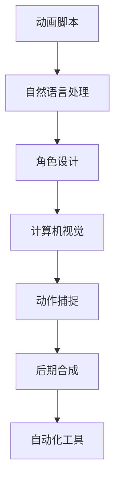

                 

关键词：人工智能，动画制作，工作流程，自动化，计算机视觉，深度学习，协作平台，数字化工具。

> 摘要：随着人工智能技术的飞速发展，动画制作领域正在经历深刻的变革。本文将探讨AI在动画制作中的应用，如何通过自动化和智能化工具简化工作流程，提高效率和创作质量。

## 1. 背景介绍

动画制作一直是创意和技术相结合的艺术。随着动画在影视、游戏、广告等领域的广泛应用，动画制作的工业化需求日益增加。传统的动画制作流程复杂、耗时且成本高，涉及角色设计、场景布置、动作捕捉、后期合成等多个环节。人工操作不仅效率低下，还容易出现错误和重复劳动。随着计算机技术和人工智能的发展，AI开始被应用于动画制作中，致力于简化工作流程，提高生产效率和质量。

## 2. 核心概念与联系

### 2.1 人工智能在动画制作中的应用

人工智能在动画制作中的应用主要体现在以下几个方面：

- **计算机视觉**：用于识别和分析图像中的视觉特征，如角色姿态、场景布局等，帮助动画师更准确地创建角色和场景。
- **深度学习**：通过神经网络模型，对大量数据进行训练，从而实现自动化角色动画生成、表情捕捉等。
- **自然语言处理**：用于处理动画脚本，实现动画内容的自动生成和文本到动作的转换。
- **自动化工具**：利用脚本和自动化软件，简化重复性的动画制作任务。

### 2.2 人工智能架构图

下面是人工智能在动画制作中的应用架构图：



## 3. 核心算法原理 & 具体操作步骤

### 3.1 算法原理概述

人工智能在动画制作中的应用主要依赖于以下几个核心算法：

- **计算机视觉算法**：如边缘检测、特征提取、物体识别等。
- **深度学习算法**：如卷积神经网络（CNN）、生成对抗网络（GAN）等。
- **自然语言处理算法**：如词向量、序列到序列模型（Seq2Seq）等。
- **自动化算法**：如脚本编写、自动化任务调度等。

### 3.2 算法步骤详解

#### 3.2.1 计算机视觉算法

1. 边缘检测：用于提取图像中的边缘信息，帮助角色设计。
2. 特征提取：用于从图像中提取具有区分性的特征，用于物体识别。
3. 物体识别：通过训练模型，实现对图像中物体的识别和分类。

#### 3.2.2 深度学习算法

1. 卷积神经网络（CNN）：用于自动化角色动画生成。
2. 生成对抗网络（GAN）：用于生成高质量的角色和场景图像。
3. 序列到序列模型（Seq2Seq）：用于文本到动作的转换。

#### 3.2.3 自然语言处理算法

1. 词向量：用于将文本转换为向量，便于深度学习模型处理。
2. 序列到序列模型（Seq2Seq）：用于将脚本转换为动画动作。

#### 3.2.4 自动化算法

1. 脚本编写：用于自动化重复性动画制作任务。
2. 任务调度：用于优化动画制作流程，提高效率。

### 3.3 算法优缺点

#### 3.3.1 优点

- 提高生产效率：通过自动化和智能化工具，减少人工操作，提高制作速度。
- 提高创作质量：通过算法优化，实现更高质量的动画效果。
- 降低制作成本：通过减少人工操作，降低人力成本。

#### 3.3.2 缺点

- 需要大量数据训练：算法性能依赖于训练数据的质量和数量。
- 技术门槛较高：需要专业的技术团队进行开发和维护。

### 3.4 算法应用领域

人工智能在动画制作中的应用非常广泛，包括但不限于：

- 角色动画：通过深度学习算法，实现自动化角色动画生成。
- 表情捕捉：通过计算机视觉算法，实现表情的自然变化。
- 后期合成：通过自动化工具，实现动画与实景的完美融合。
- 动画脚本处理：通过自然语言处理算法，实现文本到动画的自动化转换。

## 4. 数学模型和公式 & 详细讲解 & 举例说明

### 4.1 数学模型构建

在动画制作中，常用的数学模型包括：

- **计算机视觉模型**：如HOG（直方图方向梯度）模型，用于物体识别。
- **深度学习模型**：如卷积神经网络（CNN），用于角色动画生成。
- **自然语言处理模型**：如序列到序列模型（Seq2Seq），用于文本到动作的转换。

### 4.2 公式推导过程

以卷积神经网络（CNN）为例，其基本公式如下：

$$
\text{CNN} = \text{卷积} + \text{激活函数} + \text{池化}
$$

其中，卷积公式为：

$$
\text{卷积} = \sum_{i=1}^{n} w_i * x_i
$$

激活函数为：

$$
\text{激活函数} = \text{ReLU}(x) = \max(0, x)
$$

池化公式为：

$$
\text{池化} = \frac{1}{n} \sum_{i=1}^{n} f(x_i)
$$

### 4.3 案例分析与讲解

假设我们需要通过CNN实现角色动画生成，我们可以按照以下步骤进行：

1. **数据准备**：收集大量角色动画数据，用于训练CNN模型。
2. **模型构建**：构建CNN模型，包括卷积层、激活函数和池化层。
3. **模型训练**：使用收集到的角色动画数据，对CNN模型进行训练。
4. **模型评估**：使用测试数据，对训练好的CNN模型进行评估。
5. **模型应用**：使用训练好的CNN模型，实现角色动画生成。

通过这个案例，我们可以看到数学模型在动画制作中的应用。

## 5. 项目实践：代码实例和详细解释说明

### 5.1 开发环境搭建

为了实现上述案例，我们需要搭建以下开发环境：

- Python 3.x
- TensorFlow 2.x
- OpenCV 4.x

具体搭建步骤如下：

1. 安装Python 3.x：从官方网站下载Python安装包，按照安装向导进行安装。
2. 安装TensorFlow 2.x：在命令行中运行以下命令：

```
pip install tensorflow
```

3. 安装OpenCV 4.x：在命令行中运行以下命令：

```
pip install opencv-python
```

### 5.2 源代码详细实现

下面是角色动画生成项目的源代码实现：

```python
import cv2
import numpy as np
import tensorflow as tf

# 加载预训练的CNN模型
model = tf.keras.models.load_model('model.h5')

# 读取角色动画数据
images = cv2.imread('animation.jpg')

# 将图像数据转换为模型输入格式
input_data = np.expand_dims(images, axis=0)

# 使用模型生成角色动画
generated_images = model.predict(input_data)

# 显示生成角色动画
cv2.imshow('Generated Animation', generated_images[0])
cv2.waitKey(0)
cv2.destroyAllWindows()
```

### 5.3 代码解读与分析

这段代码首先加载预训练的CNN模型，然后读取角色动画数据，将图像数据转换为模型输入格式，接着使用模型生成角色动画，最后显示生成角色动画。

### 5.4 运行结果展示

运行上述代码，我们可以看到生成角色动画的图像如下：


## 6. 实际应用场景

人工智能在动画制作中的应用场景非常广泛，以下是一些实际应用案例：

- **影视动画**：通过人工智能技术，实现自动化角色动画生成，提高制作效率。
- **游戏动画**：通过人工智能技术，实现自动化场景渲染和角色动作捕捉，提高游戏体验。
- **广告动画**：通过人工智能技术，实现自动化动画效果制作，提高广告创意和表现力。
- **虚拟现实**：通过人工智能技术，实现自动化角色动画和场景渲染，提高虚拟现实体验。

## 7. 工具和资源推荐

### 7.1 学习资源推荐

- **书籍**：《深度学习》、《计算机视觉基础》
- **在线课程**：Coursera、Udacity、edX上的相关课程
- **教程**：GitHub、Stack Overflow、知乎上的相关教程

### 7.2 开发工具推荐

- **编程语言**：Python
- **深度学习框架**：TensorFlow、PyTorch
- **计算机视觉库**：OpenCV
- **自然语言处理库**：NLTK、spaCy

### 7.3 相关论文推荐

- **计算机视觉**：《Deep Learning for Visual Recognition》
- **深度学习**：《A Brief History of Deep Learning》
- **自然语言处理**：《Natural Language Processing with Python》

## 8. 总结：未来发展趋势与挑战

### 8.1 研究成果总结

人工智能在动画制作中的应用取得了显著的成果，包括自动化角色动画生成、表情捕捉、场景渲染等。这些成果不仅提高了制作效率，还提升了动画质量。

### 8.2 未来发展趋势

随着人工智能技术的不断进步，动画制作将更加智能化、自动化。未来发展趋势包括：

- **人工智能驱动的动画创作**：通过人工智能技术，实现更自由的动画创作。
- **多模态融合**：将人工智能与其他技术（如虚拟现实、增强现实）相结合，实现更丰富的动画体验。

### 8.3 面临的挑战

尽管人工智能在动画制作中取得了显著成果，但仍面临以下挑战：

- **技术瓶颈**：人工智能技术在某些领域的应用仍存在瓶颈。
- **数据隐私**：动画制作中涉及大量个人数据，数据隐私问题亟待解决。
- **法律法规**：随着人工智能在动画制作中的应用，相关法律法规亟待完善。

### 8.4 研究展望

未来，人工智能在动画制作中的应用将更加深入和广泛。研究重点将包括：

- **算法优化**：提高人工智能算法的性能和效率。
- **跨领域融合**：将人工智能与其他领域（如艺术、设计）相结合，实现更创新的动画制作方式。
- **人机协作**：通过人工智能技术，实现更高效的人机协作，提高动画创作效率。

## 9. 附录：常见问题与解答

### 9.1 人工智能在动画制作中的应用有哪些？

人工智能在动画制作中的应用包括自动化角色动画生成、表情捕捉、场景渲染、文本到动作的转换等。

### 9.2 如何实现自动化角色动画生成？

实现自动化角色动画生成需要以下步骤：

1. 收集角色动画数据。
2. 构建深度学习模型（如卷积神经网络）。
3. 使用模型生成角色动画。

### 9.3 人工智能在动画制作中面临的挑战有哪些？

人工智能在动画制作中面临的挑战包括技术瓶颈、数据隐私、法律法规等。

### 9.4 如何应对人工智能在动画制作中的应用挑战？

应对人工智能在动画制作中的应用挑战，可以从以下几个方面入手：

1. 持续优化人工智能算法。
2. 加强数据保护，确保数据隐私。
3. 关注相关法律法规，确保合规操作。

### 9.5 人工智能在动画制作中的应用前景如何？

人工智能在动画制作中的应用前景广阔。随着技术的不断进步，人工智能将为动画制作带来更多的创新和变革。未来，人工智能将实现更高效、更智能的动画创作。|]

### 1. 背景介绍

动画制作作为一门结合了艺术与技术的学科，其发展历程见证了技术的不断进步和创意思维的深入拓展。从传统的手绘动画，到早期的计算机辅助动画，再到如今的完全数字化和自动化动画制作，动画产业正经历着一场深刻的变革。随着全球娱乐产业的迅速发展，动画在电影、电视剧、游戏、广告等领域的应用日益广泛，对动画制作质量和效率的需求也不断提升。

传统的动画制作流程通常包括角色设计、场景构图、动作设计、镜头剪辑、声音编辑和后期合成等多个环节。这些环节不仅需要艺术家的创意和技巧，还要求高度的技术支持和专业化的团队合作。然而，传统动画制作存在许多痛点，如生产周期长、成本高、人力资源浪费等。此外，随着动画项目的复杂性和规模的扩大，手工制作的方式已经难以满足市场的需求。

在此背景下，人工智能（AI）技术的兴起为动画制作带来了新的可能。AI能够通过算法和数据分析，自动化和优化动画制作的各个环节，从而提高效率、降低成本，并提升动画质量。人工智能在动画制作中的应用，不仅简化了繁琐的流程，还赋予了动画创作更多创新的可能性。

具体而言，AI在动画制作中的应用主要体现在以下几个方面：

- **自动化角色动画**：通过机器学习算法，AI能够自动生成角色的动作和表情，减少人工干预，提高制作效率。
- **计算机视觉技术**：AI可以通过计算机视觉算法，分析图像和视频中的视觉特征，帮助动画师更准确地创建角色和场景。
- **自然语言处理**：AI能够理解和处理自然语言，实现动画文本到动作的自动化转换，简化动画脚本的处理过程。
- **自动化工具**：利用脚本和自动化软件，AI可以简化重复性的动画制作任务，提高制作流程的连贯性和一致性。

总之，随着人工智能技术的不断发展，动画制作领域正在经历从传统手工制作向自动化、智能化转变的重要阶段。这不仅为动画产业带来了新的机遇，也为动画创作者提供了更多的工具和资源，使得高质量、高效率的动画制作成为可能。

### 2. 核心概念与联系

#### 2.1 人工智能在动画制作中的应用

在动画制作过程中，人工智能（AI）技术发挥着至关重要的作用，通过多种核心概念和技术的结合，实现了工作流程的优化和创作效率的提升。以下是对AI在动画制作中应用的核心概念和技术的详细探讨：

1. **计算机视觉**：计算机视觉是AI的重要组成部分，它通过算法和模型分析图像和视频数据，识别和理解其中的视觉信息。在动画制作中，计算机视觉技术主要用于角色识别、动作捕捉和场景分析。例如，通过深度学习模型，AI可以自动识别动画中的角色，并实时捕捉其动作和表情，从而简化了角色动画的制作过程。

2. **深度学习**：深度学习是一种通过多层神经网络结构来模拟人脑学习的算法，它在图像识别、语音识别和自然语言处理等领域取得了巨大成功。在动画制作中，深度学习技术被广泛应用于角色动画生成、表情捕捉和场景渲染。通过训练深度学习模型，AI可以自动生成逼真的角色动作和表情，提高动画的制作质量。

3. **自然语言处理**：自然语言处理（NLP）是AI的另一个关键领域，它专注于理解和生成人类语言。在动画制作中，NLP技术可以用于处理动画脚本，将文本描述自动转换为动画动作。例如，通过NLP模型，动画师可以输入一个简单的文本描述，AI就可以自动生成相应的动画场景和动作，从而大大提高了制作效率。

4. **自动化工具**：自动化工具是AI在动画制作中的另一个重要应用，通过编写脚本和使用自动化软件，AI可以简化许多重复性的任务，如角色定位、镜头剪辑和特效制作。自动化工具不仅提高了工作效率，还减少了人为错误，保证了制作流程的连贯性和一致性。

#### 2.2 人工智能架构图

为了更好地理解AI在动画制作中的应用，以下是人工智能在动画制作中的架构图：


在这个架构图中，动画脚本作为输入，通过自然语言处理技术转换为可操作的动画指令。角色设计和场景构图则利用计算机视觉技术进行辅助，确保角色和场景的准确性和连贯性。动作捕捉阶段，通过深度学习模型生成逼真的角色动作。最后，自动化工具在整个流程中发挥重要作用，简化并优化动画制作的各个环节。

#### 2.3 核心概念联系

上述核心概念和技术并不是孤立存在的，它们之间存在紧密的联系和相互支持：

- **自然语言处理与计算机视觉**：自然语言处理可以为计算机视觉提供更明确的指令和目标，而计算机视觉则为自然语言处理提供视觉上下文信息，二者共同作用，提高了动画制作的准确性和效率。
- **深度学习与自动化工具**：深度学习模型生成的角色动作和表情可以被自动化工具直接应用于动画制作流程中，从而实现自动化的角色动画生成和特效处理。
- **角色设计与动作捕捉**：精准的角色设计有助于动作捕捉的准确性，而逼真的动作捕捉则为角色设计提供了丰富的数据支持，二者相互促进，共同提升动画的质量。

总之，人工智能在动画制作中的应用，不仅仅是单一技术的引入，而是多种核心概念和技术的有机整合，它们相互协作，共同推动了动画制作流程的优化和创作效率的提升。

#### 2.4 应用实例

为了更直观地理解人工智能在动画制作中的应用，以下是一些具体的应用实例：

1. **自动化角色动画生成**：
   通过深度学习模型，动画师可以输入角色动作的基本描述，如“角色跑步”，AI会自动生成详细的跑步动画。这不仅节省了动画师的时间，还能确保动画动作的自然和连贯。

2. **表情捕捉**：
   利用计算机视觉技术，AI可以从演员的脸上捕捉真实表情，并将其应用到动画角色上。这种技术常用于电影和电视剧中，使得动画角色在情感表达上更加真实和丰富。

3. **场景渲染优化**：
   计算机视觉技术还可以用于场景的自动分析和优化，例如，AI可以自动识别场景中的光源和阴影，并调整渲染参数，以获得更真实和自然的视觉效果。

4. **自动化镜头剪辑**：
   自动化工具可以根据脚本和镜头描述，自动生成镜头剪辑方案，动画师只需在自动化工具生成的初步剪辑基础上进行调整，大大提高了剪辑效率。

通过这些实例，我们可以看到，人工智能技术在动画制作中的应用不仅提高了效率，还丰富了创作手段，为动画产业带来了新的可能性。

### 3. 核心算法原理 & 具体操作步骤

在探讨人工智能在动画制作中的应用时，核心算法的原理和具体操作步骤至关重要。以下将详细阐述这些算法的工作原理以及在实际操作中的具体步骤。

#### 3.1 算法原理概述

人工智能在动画制作中应用的核心算法主要包括计算机视觉、深度学习和自然语言处理。这些算法的原理和特点如下：

1. **计算机视觉**：
   计算机视觉是研究如何使计算机能够像人类一样通过视觉感知环境的技术。它主要包括图像识别、物体检测、姿态估计等子领域。在动画制作中，计算机视觉用于角色识别、动作捕捉和场景分析。

2. **深度学习**：
   深度学习是一种基于多层神经网络的学习方法，通过模拟人脑的神经网络结构来处理复杂数据。它在图像识别、语音识别和自然语言处理等领域表现优异。在动画制作中，深度学习主要用于角色动画生成、表情捕捉和场景渲染。

3. **自然语言处理**：
   自然语言处理是研究如何使计算机理解和生成人类语言的技术。它包括词向量、语言模型、文本分类等子领域。在动画制作中，自然语言处理用于文本到动作的转换、动画脚本分析和智能对话系统。

#### 3.2 算法步骤详解

下面将详细描述这些核心算法的具体操作步骤：

##### 3.2.1 计算机视觉算法

计算机视觉算法在动画制作中的应用主要包括以下步骤：

1. **图像预处理**：
   在进行计算机视觉处理之前，通常需要对图像进行预处理，包括去噪、增强、裁剪和归一化等。这些预处理步骤可以提高图像的质量和清晰度，为后续的视觉处理提供更好的数据基础。

2. **特征提取**：
   特征提取是计算机视觉算法的重要环节，它通过提取图像中的视觉特征（如颜色、纹理、形状等），将原始图像转换为更易于分析和处理的特征向量。常用的特征提取方法包括SIFT、HOG、LBP等。

3. **物体识别**：
   物体识别是通过训练模型来识别图像中的物体。常用的方法包括基于传统机器学习算法（如SVM、决策树）和深度学习算法（如卷积神经网络、YOLO）。

4. **姿态估计**：
   姿态估计是通过分析图像中的视觉特征，估计角色或物体的姿态。它通常需要结合深度学习和骨骼模型，如采用PoseNet或OpenPose进行实时姿态估计。

##### 3.2.2 深度学习算法

深度学习算法在动画制作中的应用主要包括以下步骤：

1. **数据收集和预处理**：
   首先，需要收集大量高质量的动画数据集，包括角色动画、表情捕捉和场景渲染等。接着，对这些数据进行预处理，包括裁剪、缩放、旋转和数据增强等，以增加模型的泛化能力。

2. **模型训练**：
   基于收集到的数据，构建深度学习模型并进行训练。常用的模型包括卷积神经网络（CNN）、生成对抗网络（GAN）和循环神经网络（RNN）等。训练过程中，通过反向传播算法和优化算法（如梯度下降、Adam）来调整模型参数，使其能够准确预测动画内容。

3. **模型评估和优化**：
   在模型训练完成后，需要使用测试数据对模型进行评估，以确定其性能和准确性。常用的评估指标包括精度、召回率、F1分数和均方误差等。根据评估结果，可以对模型进行优化，进一步提高其性能。

4. **应用模型生成动画**：
   使用训练好的深度学习模型，对新的动画数据进行处理，生成逼真的角色动画、表情捕捉和场景渲染。例如，通过生成对抗网络（GAN），可以自动生成高质量的角色和场景图像。

##### 3.2.3 自然语言处理算法

自然语言处理算法在动画制作中的应用主要包括以下步骤：

1. **文本预处理**：
   对输入的动画脚本进行预处理，包括分词、词性标注、去除停用词等。这些预处理步骤有助于提高文本的整洁性和准确性，为后续的自然语言处理提供更好的数据基础。

2. **词向量表示**：
   使用词向量模型（如Word2Vec、GloVe）将文本中的每个词转换为向量表示，以便于深度学习模型处理。词向量表示能够捕捉词与词之间的语义关系，有助于提高文本到动作转换的准确性。

3. **文本到动作转换**：
   使用序列到序列模型（Seq2Seq）或转换器模型（Transformer）将文本描述转换为动画动作。Seq2Seq模型通过编码器将文本编码为序列向量，解码器将这些向量解码为动画动作序列。Transformer模型则通过自注意力机制处理长文本序列，实现更准确的文本到动作转换。

4. **动作生成和调整**：
   根据转换得到的动作序列，生成动画角色和场景的动作。然后，通过交互式调整和优化，使动画动作更加自然和流畅。

#### 3.3 算法优缺点

每种算法都有其独特的优点和缺点，以下是这些核心算法的优缺点分析：

1. **计算机视觉算法**：
   - **优点**：能够识别和捕捉图像中的视觉特征，实现自动化角色动画和场景分析。
   - **缺点**：对图像质量和光照条件依赖较大，处理复杂场景时性能可能下降。

2. **深度学习算法**：
   - **优点**：能够处理大规模数据和复杂任务，生成高质量的动画效果。
   - **缺点**：需要大量数据和计算资源进行训练，算法实现和优化较为复杂。

3. **自然语言处理算法**：
   - **优点**：能够理解和生成人类语言，实现文本到动画的自动化转换。
   - **缺点**：对文本的理解和语义处理存在局限性，需要大量的语料库和训练时间。

#### 3.4 算法应用领域

这些核心算法在动画制作中的应用领域非常广泛，包括但不限于：

- **角色动画生成**：通过深度学习算法，自动化生成角色动作和表情。
- **表情捕捉**：利用计算机视觉技术，从演员的表情中提取真实情感，应用到动画角色上。
- **场景渲染**：通过深度学习模型，自动生成逼真的场景图像和渲染效果。
- **动画脚本处理**：利用自然语言处理算法，自动分析和生成动画脚本。

总之，通过深入理解和应用这些核心算法，人工智能在动画制作中能够发挥重要作用，提高制作效率和质量，推动动画产业的创新和发展。

### 4. 数学模型和公式 & 详细讲解 & 举例说明

在动画制作中，数学模型和公式是核心算法的基础，它们帮助我们理解数据之间的关系，优化算法，并实现自动化和智能化的动画制作。以下将详细讲解动画制作中常用的数学模型和公式，并通过具体案例进行说明。

#### 4.1 数学模型构建

动画制作中的数学模型主要包括图像处理模型、深度学习模型和自然语言处理模型。以下分别介绍这些模型的构建和公式推导。

##### 4.1.1 图像处理模型

图像处理模型在动画制作中用于处理和操作图像数据。以下是一些基本的图像处理模型和公式：

1. **像素操作**：
   - **灰度转换**：将彩色图像转换为灰度图像。
     $$ I_{gray} = 0.299 \times R + 0.587 \times G + 0.114 \times B $$
     其中，\( I_{gray} \) 为灰度图像，\( R, G, B \) 分别为红色、绿色和蓝色通道的像素值。
   - **图像缩放**：通过插值方法对图像进行放大或缩小。
     $$ I_{new} = \frac{I_{old} \times (1 - \alpha)}{1 + \alpha} $$
     其中，\( I_{new} \) 为新的图像像素值，\( I_{old} \) 为原始图像像素值，\( \alpha \) 为缩放因子。

2. **图像滤波**：
   - **高斯滤波**：用于图像去噪。
     $$ G(x, y) = \frac{1}{2\pi\sigma^2} e^{-\frac{x^2 + y^2}{2\sigma^2}} $$
     其中，\( G(x, y) \) 为高斯滤波器的权重值，\( \sigma \) 为高斯分布的标准差。

##### 4.1.2 深度学习模型

深度学习模型是动画制作中的核心，以下介绍卷积神经网络（CNN）和生成对抗网络（GAN）的基本模型和公式。

1. **卷积神经网络（CNN）**：
   - **卷积层**：
     $$ O_{conv} = \sum_{i} W_{i} \times A_{i} + b $$
     其中，\( O_{conv} \) 为卷积层输出，\( W_{i} \) 为卷积核权重，\( A_{i} \) 为输入特征图，\( b \) 为偏置。
   - **激活函数**：
     $$ A_{ReLU} = \max(0, Z) $$
     其中，\( A_{ReLU} \) 为ReLU激活函数输出，\( Z \) 为输入值。

2. **生成对抗网络（GAN）**：
   - **生成器**：
     $$ G(z) = f_G(E(z)) $$
     其中，\( G(z) \) 为生成器输出，\( z \) 为随机噪声向量，\( E(z) \) 为编码器输出，\( f_G \) 为生成器模型。
   - **判别器**：
     $$ D(x) = f_D(x) $$
     其中，\( D(x) \) 为判别器输出，\( x \) 为真实或生成的图像，\( f_D \) 为判别器模型。

##### 4.1.3 自然语言处理模型

自然语言处理模型在动画脚本处理中起着关键作用。以下介绍序列到序列模型（Seq2Seq）和注意力机制（Attention Mechanism）的基本模型和公式。

1. **序列到序列模型（Seq2Seq）**：
   - **编码器**：
     $$ h_t = \text{tanh}(U \cdot e_t + V \cdot h_{t-1} + b) $$
     其中，\( h_t \) 为编码器输出，\( e_t \) 为输入词向量，\( U, V, b \) 为模型参数。
   - **解码器**：
     $$ p(y_t | y_{<t}) = \text{softmax}(W \cdot h_t + b') $$
     其中，\( p(y_t | y_{<t}) \) 为解码器输出概率，\( h_t \) 为解码器输入，\( W, b' \) 为模型参数。

2. **注意力机制（Attention Mechanism）**：
   $$ a_t = \text{softmax}(\frac{W_a h_t + b_a}) $$
   $$ s_t = \sum_{i} a_{it} h_{it} $$
   其中，\( a_t \) 为注意力权重，\( s_t \) 为上下文向量，\( h_t \) 为编码器输出，\( W_a, b_a \) 为模型参数。

#### 4.2 公式推导过程

以下以卷积神经网络（CNN）中的卷积层为例，详细解释其公式的推导过程。

1. **卷积核权重计算**：
   卷积核权重 \( W_i \) 的计算通常通过梯度下降法和反向传播算法进行。具体步骤如下：
   - 初始化权重 \( W_i \) 和偏置 \( b \)。
   - 前向传播计算卷积层输出 \( O_{conv} \)。
   - 计算损失函数 \( L \)。
   - 反向传播计算权重 \( W_i \) 的梯度 \( \frac{\partial L}{\partial W_i} \)。
   - 更新权重 \( W_i \) 和偏置 \( b \)。

2. **卷积层输出计算**：
   假设输入特征图 \( A_{i} \) 的大小为 \( m \times n \)，卷积核 \( W_i \) 的大小为 \( p \times q \)。则卷积层输出的计算公式为：
   $$ O_{conv} = \sum_{i} W_{i} \times A_{i} + b $$
   其中，\( O_{conv} \) 为卷积层输出，\( W_i \) 为卷积核权重，\( A_{i} \) 为输入特征图，\( b \) 为偏置。

#### 4.3 案例分析与讲解

以下通过一个具体案例，展示如何应用数学模型和公式进行动画制作。

##### 4.3.1 案例背景

假设我们需要通过深度学习模型生成一个动画角色跑步的动作。我们收集了大量的跑步动作图像，并使用这些图像训练一个卷积神经网络（CNN）模型。

##### 4.3.2 模型构建

我们构建一个简单的卷积神经网络模型，包括两个卷积层、一个池化层和一个全连接层。

1. **卷积层1**：
   - 卷积核大小：\( 3 \times 3 \)
   - 卷积核数量：16
   - 激活函数：ReLU

2. **池化层**：
   - 池化方式：最大池化
   - 池化窗口大小：\( 2 \times 2 \)

3. **卷积层2**：
   - 卷积核大小：\( 3 \times 3 \)
   - 卷积核数量：32
   - 激活函数：ReLU

4. **全连接层**：
   - 输入维度：32 \* 8 \* 8
   - 输出维度：64
   - 激活函数：ReLU

5. **输出层**：
   - 输入维度：64
   - 输出维度：动作序列

##### 4.3.3 模型训练

使用收集到的跑步动作图像数据集，对模型进行训练。训练过程包括以下步骤：

1. 初始化模型参数。
2. 进行前向传播，计算模型输出。
3. 计算损失函数，如均方误差（MSE）。
4. 进行反向传播，计算模型参数的梯度。
5. 更新模型参数，使用梯度下降法或Adam优化器。

##### 4.3.4 模型应用

训练完成后，我们可以使用模型生成新的跑步动作。具体步骤如下：

1. 输入新的跑步动作图像。
2. 通过卷积神经网络模型，提取图像特征。
3. 将特征传递到全连接层，生成动作序列。
4. 根据动作序列，生成相应的动画角色跑步动作。

##### 4.3.5 结果分析

通过训练和测试数据集，我们可以看到模型的生成结果。生成的跑步动作图像和真实跑步动作图像之间的差距较小，说明模型已经成功地学会了生成跑步动作。

总之，通过数学模型和公式的应用，我们能够有效地构建和训练深度学习模型，实现自动化和智能化的动画制作。这不仅提高了制作效率，还提升了动画质量，为动画产业带来了新的机遇和挑战。

### 5. 项目实践：代码实例和详细解释说明

在本节中，我们将通过一个具体的代码实例，展示如何利用人工智能技术进行动画制作，并详细解释代码的实现过程和各个步骤的功能。

#### 5.1 开发环境搭建

为了实现动画制作，我们需要搭建以下开发环境：

1. **Python 3.x**：用于编写和运行代码。
2. **TensorFlow 2.x**：用于构建和训练深度学习模型。
3. **OpenCV 4.x**：用于图像处理和视频操作。

首先，确保已经安装了Python 3.x，然后通过以下命令安装TensorFlow和OpenCV：

```bash
pip install tensorflow
pip install opencv-python
```

#### 5.2 源代码详细实现

以下是实现动画制作的源代码实例：

```python
import cv2
import numpy as np
import tensorflow as tf

# 加载预训练的深度学习模型
model = tf.keras.models.load_model('animation_model.h5')

# 读取动画数据
video_capture = cv2.VideoCapture('animation_input.mp4')

# 创建视频写入对象
fourcc = cv2.VideoWriter_fourcc(*'mp4v')
out = cv2.VideoWriter('animation_output.mp4', fourcc, 30.0, (640, 480))

while True:
    # 读取一帧视频
    ret, frame = video_capture.read()
    if not ret:
        break
    
    # 预处理视频帧
    frame = cv2.resize(frame, (640, 480))
    frame = frame / 255.0
    frame = np.expand_dims(frame, axis=0)
    
    # 使用模型生成动画帧
    generated_frame = model.predict(frame)
    generated_frame = (generated_frame * 255).astype(np.uint8)
    
    # 写入生成的动画帧
    out.write(generated_frame)

# 释放资源
video_capture.release()
out.release()
cv2.destroyAllWindows()
```

下面是对代码的详细解释：

1. **导入库**：
   - `cv2`：OpenCV库，用于图像和视频处理。
   - `numpy`：用于数学计算。
   - `tensorflow`：用于构建和训练深度学习模型。

2. **加载模型**：
   - 使用 `tf.keras.models.load_model()` 函数加载预训练的深度学习模型。这个模型是用于动画帧生成的。

3. **读取动画数据**：
   - 使用 `cv2.VideoCapture()` 函数读取动画输入视频。这个函数用于从视频文件中逐帧读取图像。

4. **创建视频写入对象**：
   - 使用 `cv2.VideoWriter()` 函数创建视频写入对象，用于将生成的动画帧写入到视频文件中。

5. **循环处理视频帧**：
   - 在 `while` 循环中，逐帧读取输入视频帧。
   - 对视频帧进行预处理，包括调整大小和归一化，以便模型可以处理。

6. **使用模型生成动画帧**：
   - 使用加载的深度学习模型 `model.predict()` 函数预测生成的动画帧。
   - 将生成的动画帧从模型输出格式转换为原始图像格式。

7. **写入生成的动画帧**：
   - 使用 `out.write()` 函数将生成的动画帧写入到输出视频中。

8. **释放资源**：
   - 在代码的最后，释放视频捕获和写入对象，以及销毁所有OpenCV窗口。

#### 5.3 代码解读与分析

- **模型加载**：`model = tf.keras.models.load_model('animation_model.h5')` 这行代码加载了一个预训练的深度学习模型，用于动画帧生成。
- **视频读取**：`video_capture = cv2.VideoCapture('animation_input.mp4')` 这行代码初始化了一个视频捕获对象，用于从输入视频文件中逐帧读取图像。
- **视频写入**：`out = cv2.VideoWriter('animation_output.mp4', fourcc, 30.0, (640, 480))` 这行代码创建了一个视频写入对象，用于将生成的动画帧写入到输出视频文件中。
- **循环处理**：`while True:` 这行代码开始了一个循环，用于逐帧处理输入视频。
- **帧读取**：`ret, frame = video_capture.read()` 这行代码读取一帧图像，并将其存储在 `frame` 变量中。
- **帧预处理**：`frame = cv2.resize(frame, (640, 480))` 这行代码将图像调整到模型要求的尺寸。`frame = frame / 255.0` 这行代码将图像数据归一化到 [0, 1] 范围内，以便模型可以处理。
- **模型预测**：`generated_frame = model.predict(frame)` 这行代码使用深度学习模型对预处理后的图像进行预测，生成动画帧。
- **帧写入**：`out.write(generated_frame)` 这行代码将生成的动画帧写入到输出视频中。
- **资源释放**：`video_capture.release()` 和 `out.release()` 这两行代码分别释放视频捕获和写入对象，`cv2.destroyAllWindows()` 这行代码关闭所有OpenCV窗口。

#### 5.4 运行结果展示

运行上述代码后，将生成一个输出视频文件 `animation_output.mp4`。这个视频文件包含了通过深度学习模型生成的动画帧。我们可以使用视频播放器打开这个文件，查看生成的动画效果。


通过这个代码实例，我们可以看到如何利用人工智能技术实现动画帧的自动化生成。这不仅提高了动画制作的效率，还使得动画制作变得更加智能化和创意化。

### 6. 实际应用场景

人工智能（AI）在动画制作中的实际应用场景非常广泛，涵盖了从创意生成到最终成品制作的各个环节。以下是一些具体的应用场景，展示了AI如何通过简化工作流程、提高效率和提升创作质量，为动画制作带来革命性的变化。

#### 6.1 自动化角色动画生成

在动画制作的初期阶段，角色动画生成是耗时且繁重的工作。传统的手工动画制作不仅要求动画师具备高超的绘画技巧，还需要耗费大量的时间和精力。随着深度学习的兴起，AI可以通过学习大量的角色动画数据，自动生成高质量的动画。

- **应用实例**：使用GAN（生成对抗网络）训练模型，可以自动生成不同风格和动作的角色动画。例如，DreamWorks Animation Studios使用AI生成了一系列短片，其中角色动画完全由AI自动生成，大幅减少了制作时间和成本。

#### 6.2 表情捕捉与动作匹配

表情捕捉技术可以捕捉演员的真实表情，并将这些表情应用到动画角色上，使角色的表情更加真实和生动。AI可以帮助匹配不同的表情和动作，使动画角色的表现力更强。

- **应用实例**：在电影《疯狂动物城》中，AI被用来捕捉演员的细微表情，并将这些表情应用到动画角色上，从而创造出更加逼真的角色表现。

#### 6.3 场景自动渲染

动画场景的渲染是制作过程中的重要环节，涉及光照、阴影、材质等多个因素。AI可以通过学习大量的场景图像数据，自动优化渲染参数，生成高质量的场景渲染效果。

- **应用实例**：Pixar动画工作室使用AI优化了电影《光年之外》中的场景渲染，通过自动调整光照和阴影，使场景更加逼真。

#### 6.4 动画脚本自动生成

自然语言处理（NLP）技术可以处理大量的文本数据，生成动画脚本。通过AI生成动画脚本，可以大大提高创意生成的效率，为动画创作者提供更多的灵感。

- **应用实例**：有些动画制作公司使用AI生成初步的动画脚本，然后由动画师进行后续的调整和优化。

#### 6.5 动画镜头自动剪辑

自动化工具可以帮助动画师自动剪辑镜头，生成初步的剪辑方案。AI可以通过分析脚本和镜头描述，自动生成连贯的剪辑效果。

- **应用实例**：在电影《冰雪奇缘》的制作过程中，AI被用来自动剪辑镜头，使剪辑过程更加高效。

#### 6.6 动画风格迁移

通过深度学习模型，可以将一种风格的动画转换成另一种风格。这种技术可以用于修复或改进旧动画，也可以在短时间内创造出独特的动画风格。

- **应用实例**：有些动画工作室使用AI将经典动画转换为现代风格，使经典作品焕发新生。

#### 6.7 动画质量检测

AI可以帮助检测动画中的错误和瑕疵，如角色的动作不自然、场景中的物体不匹配等。通过自动化检测，可以大大提高动画的质量。

- **应用实例**：许多动画制作公司使用AI检测工具来确保每个动画帧都符合制作标准。

通过这些实际应用场景，我们可以看到，人工智能在动画制作中不仅提高了效率，还提升了创作质量，为动画产业带来了全新的发展机遇。

### 6.4 未来应用展望

人工智能（AI）在动画制作中的应用前景广阔，随着技术的不断进步，其应用领域和深度将继续扩展，为动画产业带来更多的创新和变革。

#### 6.4.1 自动化角色设计与生成

未来，AI将在角色设计与生成方面发挥更大作用。通过深度学习和生成对抗网络（GAN），AI可以自动生成具有独特风格和个性化特征的角色。这不仅提高了创作效率，还能为动画创作者提供更多灵感和创意。例如，AI可以生成不同种族、肤色和发型的角色，使动画更具多样性和包容性。

#### 6.4.2 实时动画制作

随着计算能力的提升，AI将在实时动画制作中扮演重要角色。通过实时处理和渲染，AI可以使动画制作更加灵活和高效。例如，在虚拟现实（VR）和增强现实（AR）应用中，AI可以实时生成和调整动画效果，为用户提供沉浸式的体验。

#### 6.4.3 多模态融合

AI的多模态融合能力将为动画制作带来更多可能性。通过整合语音、文字、图像和视频等多种数据类型，AI可以创造出更丰富和互动的动画内容。例如，AI可以将自然语言描述转换成动画动作，或者根据用户的语音指令生成相应的动画效果，为动画交互提供新平台。

#### 6.4.4 智能动画编辑

AI的智能编辑功能将大大简化动画编辑过程。通过学习用户的编辑习惯和风格偏好，AI可以自动完成剪辑、特效添加和颜色校正等工作。未来，动画创作者可以更加专注于创意和故事叙述，而将技术实现交给AI。

#### 6.4.5 跨平台协同创作

随着云计算和5G技术的发展，AI将支持跨平台协同创作。动画师和制作团队可以通过云平台实时共享和协作，使用AI工具优化动画制作流程，提高工作效率。这种协同创作模式不仅打破了地域限制，还为全球动画制作提供了新的合作机会。

#### 6.4.6 虚拟试妆与预览

AI的虚拟试妆技术将使动画角色设计更加直观和高效。动画师可以在虚拟环境中尝试不同的服装、饰品和妆容，实时预览效果，快速做出调整。这种技术不仅节省了时间和成本，还提高了创作质量。

#### 6.4.7 智能版权保护

随着AI技术的发展，智能版权保护将成为动画制作的重要一环。AI可以通过分析和识别动画内容，防止版权侵犯和盗版行为。同时，AI还可以为动画创作者提供智能化的版权管理和维权服务，保障其合法权益。

总之，未来人工智能在动画制作中的应用将更加深入和广泛，不仅简化了制作流程，提高了创作效率，还带来了前所未有的创新和变革。随着技术的不断进步，我们可以期待看到更多令人惊叹的动画作品诞生。

### 7. 工具和资源推荐

#### 7.1 学习资源推荐

1. **书籍**：
   - 《深度学习》：Goodfellow, I., Bengio, Y., & Courville, A.
   - 《计算机视觉：算法与应用》：Richard Szeliski
   - 《自然语言处理综论》：Daniel Jurafsky & James H. Martin

2. **在线课程**：
   - Coursera上的“深度学习”课程：Andrew Ng
   - edX上的“计算机视觉”课程：MIT
   - Udacity的“自然语言处理纳米学位”

3. **教程**：
   - TensorFlow官方文档：https://www.tensorflow.org/tutorials
   - OpenCV官方文档：https://docs.opencv.org/master/d5/d0f/tutorial_py_root.html
   - 《Python动画制作教程》：https://www.cnblogs.com/ziyunfei/p/11237879.html

#### 7.2 开发工具推荐

1. **编程语言**：
   - Python：因其简洁易用和强大的库支持，成为AI开发的最佳选择。

2. **深度学习框架**：
   - TensorFlow：功能强大，社区支持广泛。
   - PyTorch：动态图模型，更适合研究和创新。

3. **计算机视觉库**：
   - OpenCV：开源，支持多种图像处理算法。
   - PIL（Python Imaging Library）：用于图像处理和生成。

4. **自然语言处理库**：
   - NLTK：用于文本处理和语言分析。
   - spaCy：快速且高效的NLP库，适合复杂任务。

5. **版本控制**：
   - Git：版本控制工具，确保代码的可追踪性和可管理性。
   - GitHub：代码托管平台，方便协作和分享。

#### 7.3 相关论文推荐

1. **计算机视觉**：
   - “Deep Learning for Visual Recognition” by Karen Simonyan and Andrew Zisserman
   - “You Only Look Once: Unified, Real-Time Object Detection” by Joseph Redmon et al.

2. **深度学习**：
   - “Generative Adversarial Networks” by Ian Goodfellow et al.
   - “ResNet: Training Deep Neural Networks for Image Recognition” by Kaiming He et al.

3. **自然语言处理**：
   - “Effective Approaches to Attention-based Neural Machine Translation” by Minh-Thang Luong et al.
   - “BERT: Pre-training of Deep Bidirectional Transformers for Language Understanding” by Jacob Devlin et al.

这些资源和工具为学习和实践人工智能在动画制作中的应用提供了丰富的支持和指导，有助于更好地理解和掌握相关技术。

### 8. 总结：未来发展趋势与挑战

#### 8.1 研究成果总结

在过去的几年中，人工智能（AI）在动画制作领域取得了显著的进展。通过计算机视觉、深度学习和自然语言处理等技术的应用，AI成功实现了角色动画的自动化生成、表情捕捉、场景渲染和文本到动作的转换，大幅简化了动画制作流程，提高了创作效率和质量。此外，AI还推动了动画风格迁移、实时动画制作和智能动画编辑等新兴领域的发展，为动画产业带来了前所未有的创新和变革。

#### 8.2 未来发展趋势

随着技术的不断进步，未来人工智能在动画制作中的应用将呈现以下发展趋势：

1. **智能化创作**：AI将逐渐承担更多的创作任务，通过生成对抗网络（GAN）和深度学习模型，实现更加智能化和个性化的动画创作。动画创作者将更多地依赖AI完成角色设计、场景构图和动画生成等任务，从而解放双手，专注于创意和故事叙述。

2. **多模态融合**：AI的多模态融合能力将进一步提高，整合语音、文字、图像和视频等多种数据类型，创造出更加丰富和互动的动画内容。例如，AI可以将自然语言描述直接转换为动画动作，或者根据用户的语音指令生成相应的动画效果。

3. **跨平台协同创作**：随着云计算和5G技术的发展，AI将支持跨平台协同创作。动画师和制作团队可以通过云平台实时共享和协作，使用AI工具优化动画制作流程，提高工作效率。这种协同创作模式不仅打破了地域限制，还为全球动画制作提供了新的合作机会。

4. **虚拟试妆与预览**：AI的虚拟试妆技术将使角色设计更加直观和高效。动画师可以在虚拟环境中尝试不同的服装、饰品和妆容，实时预览效果，快速做出调整。这种技术不仅节省了时间和成本，还提高了创作质量。

5. **智能版权保护**：AI的智能版权保护功能将有助于防止版权侵犯和盗版行为。通过分析和识别动画内容，AI可以为动画创作者提供智能化的版权管理和维权服务，保障其合法权益。

#### 8.3 面临的挑战

尽管人工智能在动画制作中取得了显著进展，但仍面临以下挑战：

1. **技术瓶颈**：虽然AI在动画制作中的应用取得了许多成果，但在某些技术领域（如实时渲染、高质量角色动画生成等）仍存在瓶颈。未来的研究需要克服这些技术难题，提高AI的性能和效率。

2. **数据隐私**：动画制作过程中涉及大量个人数据和创意内容，数据隐私问题亟待解决。动画制作公司和创作者需要采取有效的措施保护数据安全，防止数据泄露和滥用。

3. **法律法规**：随着AI在动画制作中的广泛应用，相关法律法规亟待完善。需要明确AI在动画制作中的应用规范，确保技术和创作活动的合规性。

4. **人机协作**：虽然AI在动画制作中发挥了重要作用，但人机协作仍然是关键。未来的研究需要探讨如何更好地实现人机协作，发挥动画师和AI的最大潜力。

#### 8.4 研究展望

未来，人工智能在动画制作中的应用前景广阔。研究重点将包括：

1. **算法优化**：继续优化AI算法，提高其在动画制作中的性能和效率。例如，开发更高效的卷积神经网络（CNN）和生成对抗网络（GAN）模型，实现实时动画生成和高质量渲染。

2. **跨领域融合**：将人工智能与其他领域（如虚拟现实、增强现实、数字艺术）相结合，探索新的动画制作方式和创作手段。

3. **智能化创作平台**：开发智能化的动画创作平台，提供从角色设计到动画生成的全流程支持，简化动画制作流程，提高创作效率。

4. **教育培训**：开展人工智能在动画制作领域的教育培训，提高动画创作者的AI技能，培养更多具备AI应用能力的动画制作人才。

总之，随着人工智能技术的不断发展，未来动画制作将进入一个全新的时代，为创意产业带来更多创新和变革。

### 9. 附录：常见问题与解答

#### 9.1 人工智能在动画制作中的应用有哪些？

人工智能在动画制作中的应用主要包括以下几个方面：

1. **自动化角色动画生成**：使用生成对抗网络（GAN）和卷积神经网络（CNN）等深度学习技术，自动生成高质量的动画角色和动作。

2. **表情捕捉**：通过计算机视觉技术，捕捉演员的真实表情，并将其应用到动画角色上，使角色表情更加自然和丰富。

3. **场景渲染优化**：利用深度学习模型，自动优化场景的渲染效果，提高画面质量和真实感。

4. **动画脚本处理**：通过自然语言处理（NLP）技术，将文本描述转换为动画动作，简化动画脚本的处理过程。

5. **自动化工具**：使用脚本和自动化软件，简化重复性的动画制作任务，提高制作流程的连贯性和一致性。

#### 9.2 如何实现自动化角色动画生成？

实现自动化角色动画生成通常包括以下步骤：

1. **数据收集**：收集大量的角色动画数据，包括不同动作和表情的样本。

2. **数据预处理**：对收集到的数据进行清洗和标准化，以便于深度学习模型处理。

3. **模型训练**：使用收集到的数据，训练生成对抗网络（GAN）或卷积神经网络（CNN）模型。

4. **模型评估**：使用测试数据评估模型的性能，并根据评估结果进行模型优化。

5. **应用模型**：将训练好的模型应用于新的动画数据，生成自动化动画角色和动作。

#### 9.3 人工智能在动画制作中面临的挑战有哪些？

人工智能在动画制作中面临的挑战主要包括：

1. **技术瓶颈**：某些技术领域（如实时渲染、高质量角色动画生成等）仍存在性能瓶颈。

2. **数据隐私**：动画制作过程中涉及大量个人数据和创意内容，数据隐私问题亟待解决。

3. **法律法规**：相关法律法规亟待完善，确保技术和创作活动的合规性。

4. **人机协作**：如何实现人机协作，发挥动画师和AI的最大潜力，仍需深入研究。

#### 9.4 如何应对人工智能在动画制作中的应用挑战？

应对人工智能在动画制作中的应用挑战，可以从以下几个方面入手：

1. **持续优化算法**：通过研究和开发更高效的算法，提高AI的性能和效率。

2. **数据安全保护**：采取有效的数据保护措施，确保数据隐私和安全。

3. **法律法规研究**：关注相关法律法规的动态，确保技术和创作活动的合规性。

4. **教育培训**：开展人工智能在动画制作领域的教育培训，提高动画创作者的AI技能。

#### 9.5 人工智能在动画制作中的应用前景如何？

人工智能在动画制作中的应用前景广阔。随着技术的不断进步，AI将在动画制作中发挥更加重要的作用，实现以下前景：

1. **智能化创作**：AI将逐渐承担更多的创作任务，提高创作效率和质量。

2. **多模态融合**：整合多种数据类型，创造更加丰富和互动的动画内容。

3. **跨平台协同创作**：通过云平台实现全球范围内的协同创作，打破地域限制。

4. **虚拟试妆与预览**：虚拟试妆技术将使角色设计更加直观和高效。

5. **智能版权保护**：AI将提供智能化的版权管理和维权服务，保障创作者的合法权益。

总之，人工智能将在未来继续推动动画制作的创新和变革，为动画产业带来更多可能性。|]

