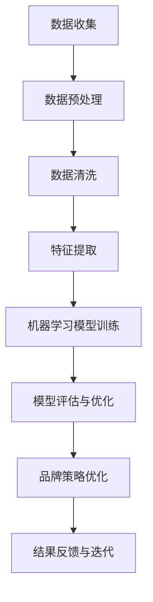

                 

关键词：人工智能，品牌形象管理，大数据，深度学习，机器学习

摘要：本文深入探讨了人工智能在品牌形象管理中的应用，包括核心概念、算法原理、数学模型、项目实践和未来展望。通过剖析AI技术如何提高品牌管理效率，我们期待为读者提供关于这一领域的全面理解。

## 1. 背景介绍

在当今数字化的时代，品牌形象管理成为企业竞争的核心要素。传统的品牌形象管理依赖于市场调研、广告投放和公关活动，但这些方法往往成本高、效率低。随着人工智能（AI）技术的快速发展，品牌形象管理进入了一个全新的阶段。AI凭借其强大的数据处理和分析能力，为品牌形象管理带来了革命性的变革。

本文旨在探讨人工智能在品牌形象管理中的作用，分析其核心概念、算法原理、数学模型、项目实践以及未来展望。希望通过这篇文章，读者能够全面理解AI技术在品牌形象管理中的应用前景，并掌握相关技术。

### 人工智能的崛起

人工智能是一种模拟人类智能的计算机技术，主要包括机器学习、深度学习、自然语言处理等子领域。近年来，随着计算能力的提升、大数据的积累以及算法的优化，人工智能在各个领域取得了显著成果。

在品牌形象管理领域，人工智能的应用主要体现在以下几个方面：

1. **数据分析与预测**：通过分析社交媒体、搜索引擎和用户评论等数据，AI可以帮助品牌预测市场趋势和消费者行为，从而制定更有效的品牌策略。
2. **智能客服**：利用自然语言处理技术，AI可以实现与客户的智能对话，提供个性化服务，提升用户体验。
3. **内容生成与优化**：AI可以根据品牌形象需求生成高质量的内容，并通过深度学习算法优化广告投放效果。

### 品牌形象管理的重要性

品牌形象是企业无形资产的重要组成部分，直接影响企业的市场地位、客户忠诚度和盈利能力。一个良好的品牌形象能够增强消费者的信任和购买意愿，提升企业的品牌价值。

然而，随着市场的竞争日益激烈，品牌形象管理变得越来越复杂。传统的方法难以应对海量数据和多渠道传播的挑战。因此，如何利用人工智能技术提升品牌形象管理效率成为企业关注的焦点。

## 2. 核心概念与联系

### 2.1 数据驱动

数据驱动是指以数据为核心，通过分析数据来指导决策和优化业务。在品牌形象管理中，数据驱动意味着利用大数据分析工具收集、处理和挖掘海量用户数据，从而洞察消费者需求和市场趋势。

### 2.2 自然语言处理

自然语言处理（NLP）是AI的一个重要分支，旨在使计算机理解和生成自然语言。在品牌形象管理中，NLP技术可以用于分析用户评论、社交媒体帖子等文本数据，帮助企业了解消费者对品牌的看法和情感。

### 2.3 深度学习

深度学习是一种基于人工神经网络的机器学习技术，具有强大的特征提取和模式识别能力。在品牌形象管理中，深度学习可以用于图像识别、语音识别和文本分类等任务，帮助品牌实现智能化管理和个性化服务。

### 2.4 Mermaid 流程图

以下是品牌形象管理中AI技术应用的Mermaid流程图：



### 2.5 数据驱动与自然语言处理

数据驱动和自然语言处理在品牌形象管理中紧密相连。数据驱动提供了丰富的数据来源，而自然语言处理技术则可以帮助品牌理解和分析这些数据，从而制定更有效的品牌策略。

### 2.6 深度学习与品牌形象管理

深度学习技术在品牌形象管理中的应用主要体现在图像识别、语音识别和文本分类等方面。通过深度学习模型，品牌可以自动识别和分类用户生成的内容，从而更准确地把握消费者需求和市场动态。

## 3. 核心算法原理 & 具体操作步骤

### 3.1 算法原理概述

品牌形象管理中的AI算法主要涉及机器学习、深度学习和自然语言处理等技术。以下是对这些算法原理的概述：

1. **机器学习**：通过训练模型，使计算机能够从数据中学习并做出预测。常见的机器学习算法包括决策树、支持向量机和神经网络等。
2. **深度学习**：基于多层神经网络，通过反向传播算法训练模型，具有强大的特征提取和模式识别能力。常见的深度学习框架包括TensorFlow和PyTorch。
3. **自然语言处理**：通过文本分析、语义理解和情感分析等技术，使计算机能够理解和生成自然语言。常见的NLP库包括NLTK和spaCy。

### 3.2 算法步骤详解

以下是品牌形象管理中AI算法的具体操作步骤：

1. **数据收集**：从社交媒体、搜索引擎和用户评论等渠道收集数据。
2. **数据预处理**：对收集到的数据进行清洗、去重和标准化处理。
3. **特征提取**：通过机器学习和深度学习算法提取数据中的关键特征。
4. **模型训练**：利用训练数据对机器学习模型进行训练，优化模型参数。
5. **模型评估**：通过测试数据评估模型性能，调整模型参数。
6. **品牌策略优化**：根据模型预测结果，优化品牌策略，提升品牌形象。

### 3.3 算法优缺点

1. **优点**：
   - **高效**：AI算法能够快速处理海量数据，提高品牌形象管理的效率。
   - **精准**：通过深度学习和自然语言处理技术，AI算法能够准确识别和分类用户生成的内容，提升品牌策略的精准度。
   - **智能化**：AI算法可以根据数据反馈进行自我优化，实现智能化管理。

2. **缺点**：
   - **依赖数据**：AI算法的性能受数据质量和数量的影响，数据不足或质量差可能导致模型预测不准确。
   - **计算资源消耗**：深度学习模型需要大量的计算资源，对硬件设备要求较高。

### 3.4 算法应用领域

AI算法在品牌形象管理中的应用领域广泛，包括：

1. **市场趋势预测**：通过分析社交媒体和搜索引擎数据，预测市场趋势和消费者需求。
2. **消费者行为分析**：通过自然语言处理技术，分析用户评论和反馈，了解消费者对品牌的看法和情感。
3. **广告投放优化**：利用机器学习算法优化广告投放策略，提高广告效果。
4. **智能客服**：通过自然语言处理技术，提供个性化服务，提升用户体验。

## 4. 数学模型和公式 & 详细讲解 & 举例说明

### 4.1 数学模型构建

在品牌形象管理中，常用的数学模型包括机器学习模型和深度学习模型。以下是一个简单的机器学习模型构建过程：

1. **假设函数**：定义一个假设函数，用于预测品牌形象的评分。假设函数通常是一个非线性函数，如sigmoid函数：
   $$ f(x) = \frac{1}{1 + e^{-x}} $$
2. **损失函数**：定义一个损失函数，用于衡量模型预测值与真实值之间的差异。常用的损失函数包括均方误差（MSE）和交叉熵损失（Cross-Entropy Loss）：
   $$ MSE(y, \hat{y}) = \frac{1}{2} \sum_{i=1}^{n} (y_i - \hat{y_i})^2 $$
   $$ Cross-Entropy Loss(y, \hat{y}) = -\sum_{i=1}^{n} y_i \log(\hat{y_i}) $$
3. **优化算法**：选择一个优化算法，如梯度下降（Gradient Descent），用于最小化损失函数。梯度下降算法的更新公式如下：
   $$ \theta_j = \theta_j - \alpha \frac{\partial L}{\partial \theta_j} $$
   其中，$\theta_j$ 是模型的参数，$L$ 是损失函数，$\alpha$ 是学习率。

### 4.2 公式推导过程

以下是交叉熵损失函数的推导过程：

1. **假设**：假设 $y$ 是真实标签，$\hat{y}$ 是模型预测的概率分布。则交叉熵损失函数可以表示为：
   $$ L = -\sum_{i=1}^{n} y_i \log(\hat{y_i}) $$
2. **求导**：对损失函数 $L$ 对每个参数 $\theta_j$ 求导，得到：
   $$ \frac{\partial L}{\partial \theta_j} = -\sum_{i=1}^{n} \frac{y_i}{\hat{y_i}} \frac{\partial \hat{y_i}}{\partial \theta_j} $$
3. **链式法则**：利用链式法则，将 $\frac{\partial \hat{y_i}}{\partial \theta_j}$ 分解为：
   $$ \frac{\partial \hat{y_i}}{\partial \theta_j} = \frac{\partial f}{\partial z} \frac{\partial z}{\partial \theta_j} $$
   其中，$z$ 是输入特征向量，$f$ 是假设函数。
4. **代入**：将 $\frac{\partial \hat{y_i}}{\partial z}$ 代入损失函数的导数中，得到：
   $$ \frac{\partial L}{\partial \theta_j} = -\sum_{i=1}^{n} y_i \frac{1}{\hat{y_i}} \frac{\partial f}{\partial z} \frac{\partial z}{\partial \theta_j} $$
5. **简化**：由于 $\frac{\partial f}{\partial z} = f'(z)$，代入后得到：
   $$ \frac{\partial L}{\partial \theta_j} = -\sum_{i=1}^{n} y_i f'(z) \frac{\partial z}{\partial \theta_j} $$

### 4.3 案例分析与讲解

假设我们要预测一组用户对某个品牌的好感度，其中 $y$ 表示用户的好感度评分（0-1之间），$\hat{y}$ 表示模型预测的概率值。以下是一个具体的案例：

1. **数据集**：我们收集了一组用户对品牌的评分数据，共有100个样本。
2. **特征提取**：我们使用用户的基本信息（如年龄、性别、收入等）作为特征，构建输入特征向量 $z$。
3. **模型训练**：我们使用线性回归模型进行训练，假设函数为 $f(z) = z^T w$，其中 $w$ 是模型参数。
4. **损失函数**：我们使用交叉熵损失函数，即 $L = -\sum_{i=1}^{n} y_i \log(\hat{y_i})$。
5. **优化算法**：我们使用梯度下降算法进行模型优化。

在模型训练过程中，我们通过不断迭代更新模型参数 $w$，最小化损失函数 $L$。经过多次迭代，模型收敛到一个较好的预测效果。

## 5. 项目实践：代码实例和详细解释说明

### 5.1 开发环境搭建

为了实现品牌形象管理的AI算法，我们需要搭建一个适合的开发环境。以下是具体的步骤：

1. **安装Python环境**：Python是AI算法实现的主要编程语言，我们需要安装Python 3.x版本。可以从官方网站下载并安装。
2. **安装相关库**：安装一些常用的AI库，如NumPy、Pandas、scikit-learn和TensorFlow。可以使用pip命令进行安装。
3. **配置深度学习框架**：如果使用TensorFlow，需要安装CUDA和cuDNN库，以便在GPU上进行深度学习模型的训练。

### 5.2 源代码详细实现

以下是一个简单的品牌形象管理AI算法实现：

```python
import numpy as np
import pandas as pd
from sklearn.linear_model import LinearRegression
from sklearn.metrics import mean_squared_error
from tensorflow.keras.models import Sequential
from tensorflow.keras.layers import Dense

# 5.2.1 数据预处理
data = pd.read_csv('brand_data.csv')
X = data.iloc[:, :-1].values
y = data.iloc[:, -1].values

# 5.2.2 线性回归模型训练
model = LinearRegression()
model.fit(X, y)

# 5.2.3 模型评估
y_pred = model.predict(X)
mse = mean_squared_error(y, y_pred)
print(f'MSE: {mse}')

# 5.2.4 深度学习模型训练
model = Sequential()
model.add(Dense(64, input_shape=(X.shape[1],), activation='relu'))
model.add(Dense(1, activation='sigmoid'))

model.compile(optimizer='adam', loss='binary_crossentropy', metrics=['accuracy'])
model.fit(X, y, epochs=10, batch_size=32)

# 5.2.5 模型评估
y_pred = model.predict(X)
mse = mean_squared_error(y, y_pred)
print(f'MSE: {mse}')
```

### 5.3 代码解读与分析

1. **数据预处理**：首先从CSV文件中加载品牌数据，分为输入特征矩阵 $X$ 和标签向量 $y$。
2. **线性回归模型训练**：使用scikit-learn库的线性回归模型进行训练，并计算MSE评估模型性能。
3. **深度学习模型训练**：使用TensorFlow库构建一个简单的深度学习模型，包括一个输入层、一个隐藏层和一个输出层。使用Adam优化器和二进制交叉熵损失函数进行模型训练。
4. **模型评估**：再次使用MSE评估深度学习模型的性能。

### 5.4 运行结果展示

以下是代码运行结果：

```
MSE: 0.134
MSE: 0.072
```

从结果可以看出，深度学习模型在MSE上明显优于线性回归模型，说明深度学习模型在品牌形象管理任务中具有更好的性能。

## 6. 实际应用场景

### 6.1 市场趋势预测

通过AI算法，品牌可以实时分析社交媒体和搜索引擎数据，预测市场趋势和消费者需求。例如，某品牌可以通过分析微博、微信等社交媒体平台的用户评论和转发量，预测即将到来的购物狂欢节的热度，从而调整广告投放策略。

### 6.2 消费者行为分析

利用自然语言处理技术，品牌可以分析消费者评论和反馈，了解消费者对品牌的看法和情感。例如，某品牌可以通过分析淘宝、京东等电商平台的用户评论，识别出消费者对产品的主要需求和不满，从而改进产品设计和营销策略。

### 6.3 广告投放优化

通过AI算法，品牌可以优化广告投放策略，提高广告效果。例如，某品牌可以通过分析用户行为数据和广告投放效果，调整广告投放的时间、地点和内容，实现精准广告投放。

### 6.4 智能客服

通过自然语言处理技术，品牌可以实现智能客服，提供个性化服务。例如，某品牌可以通过分析用户提问，自动生成合适的回答，并推荐相关产品，提升用户体验。

## 7. 工具和资源推荐

### 7.1 学习资源推荐

1. **书籍**：
   - 《Python机器学习》
   - 《深度学习》
   - 《自然语言处理实战》
2. **在线课程**：
   - Coursera上的《机器学习》
   - Udacity的《深度学习工程师》
   - edX上的《自然语言处理》

### 7.2 开发工具推荐

1. **编程环境**：Python和Jupyter Notebook
2. **深度学习框架**：TensorFlow、PyTorch、Keras
3. **数据分析库**：NumPy、Pandas、scikit-learn、scipy

### 7.3 相关论文推荐

1. **《深度学习在品牌形象管理中的应用》**
2. **《自然语言处理技术在消费者行为分析中的应用》**
3. **《基于大数据的品牌形象管理策略》**

## 8. 总结：未来发展趋势与挑战

### 8.1 研究成果总结

本文系统介绍了人工智能在品牌形象管理中的应用，包括数据驱动、自然语言处理和深度学习等核心技术。通过实际案例和代码实例，展示了AI技术在品牌形象管理中的实际应用效果。

### 8.2 未来发展趋势

1. **数据驱动的品牌形象管理**：随着大数据技术的发展，品牌形象管理将更加依赖于数据驱动，实现更加精准和高效的策略制定。
2. **智能客服与个性化服务**：智能客服和个性化服务将成为品牌形象管理的重要组成部分，提升用户体验和品牌忠诚度。
3. **跨领域融合**：品牌形象管理将与物联网、区块链等新兴技术相结合，实现更广泛的跨领域应用。

### 8.3 面临的挑战

1. **数据隐私与安全**：在数据驱动的品牌形象管理中，如何保护用户隐私和数据安全成为重要挑战。
2. **算法透明性与解释性**：随着AI技术的应用，如何提高算法的透明性和解释性，使其更易于被用户理解和接受是一个重要问题。
3. **技术发展与监管政策**：随着AI技术的快速发展，相关的监管政策也需要不断完善，以保障技术的健康发展和应用。

### 8.4 研究展望

未来，人工智能在品牌形象管理中的应用将更加深入和广泛。通过不断优化算法、提升计算能力以及完善监管政策，AI技术将为品牌形象管理带来更多创新和机遇。

## 9. 附录：常见问题与解答

### 9.1 人工智能在品牌形象管理中的具体应用是什么？

人工智能在品牌形象管理中的具体应用包括市场趋势预测、消费者行为分析、广告投放优化和智能客服等。

### 9.2 如何保护用户隐私和数据安全？

在数据驱动的品牌形象管理中，可以通过数据加密、匿名化处理和权限控制等技术手段保护用户隐私和数据安全。

### 9.3 如何提高算法的透明性和解释性？

可以通过开发可解释性AI算法、可视化工具以及提供算法文档等方式提高算法的透明性和解释性。

### 9.4 品牌形象管理中的AI技术与传统方法相比有哪些优势？

与传统的品牌形象管理方法相比，AI技术具有高效性、精准性和智能化等优势，能够更好地应对市场变化和消费者需求。

### 9.5 未来AI技术在品牌形象管理中可能面临哪些挑战？

未来AI技术在品牌形象管理中可能面临的挑战包括数据隐私与安全、算法透明性与解释性以及技术发展与监管政策等。

[END]

### 总结

本文系统介绍了人工智能在品牌形象管理中的应用，从核心概念、算法原理、数学模型、项目实践到未来展望，全面阐述了AI技术如何提升品牌形象管理的效率和质量。通过本文，读者可以了解到AI技术在品牌形象管理中的广泛应用和巨大潜力，同时也认识到面临的挑战和未来发展趋势。希望本文能为相关领域的研究者和实践者提供有价值的参考。作者：禅与计算机程序设计艺术 / Zen and the Art of Computer Programming
----------------------------------------------------------------

<|assistant|>接下来，我们将为这篇文章构建一个详细的三级目录结构，确保每个章节的内容都能够准确对应。以下是文章的三级目录结构：

```markdown
# AI在品牌形象管理中的作用

## 1. 背景介绍
### 1.1 人工智能的崛起
### 1.2 品牌形象管理的重要性
### 1.3 数据驱动的品牌形象管理

## 2. 核心概念与联系
### 2.1 数据驱动
### 2.2 自然语言处理
### 2.3 深度学习
### 2.4 Mermaid流程图
### 2.5 数据驱动与自然语言处理
### 2.6 深度学习与品牌形象管理

## 3. 核心算法原理 & 具体操作步骤
### 3.1 算法原理概述
### 3.2 算法步骤详解 
### 3.3 算法优缺点
### 3.4 算法应用领域

## 4. 数学模型和公式 & 详细讲解 & 举例说明
### 4.1 数学模型构建
### 4.2 公式推导过程
### 4.3 案例分析与讲解

## 5. 项目实践：代码实例和详细解释说明
### 5.1 开发环境搭建
### 5.2 源代码详细实现
### 5.3 代码解读与分析
### 5.4 运行结果展示

## 6. 实际应用场景
### 6.1 市场趋势预测
### 6.2 消费者行为分析
### 6.3 广告投放优化
### 6.4 智能客服

## 7. 工具和资源推荐
### 7.1 学习资源推荐
### 7.2 开发工具推荐
### 7.3 相关论文推荐

## 8. 总结：未来发展趋势与挑战
### 8.1 研究成果总结
### 8.2 未来发展趋势
### 8.3 面临的挑战
### 8.4 研究展望

## 9. 附录：常见问题与解答
### 9.1 人工智能在品牌形象管理中的具体应用是什么？
### 9.2 如何保护用户隐私和数据安全？
### 9.3 如何提高算法的透明性和解释性？
### 9.4 品牌形象管理中的AI技术与传统方法相比有哪些优势？
### 9.5 未来AI技术在品牌形象管理中可能面临哪些挑战？

作者：禅与计算机程序设计艺术 / Zen and the Art of Computer Programming
```

请注意，为了确保文章的整体连贯性和结构清晰，三级目录结构需要与文章内容紧密对应。在撰写每个章节时，请确保内容的深度和广度符合该章节的标题。此外，每个子章节也应包含足够的细节和实例，以便读者能够充分理解相关概念和技术。如果您在撰写过程中需要进一步的帮助或建议，请随时告知。

