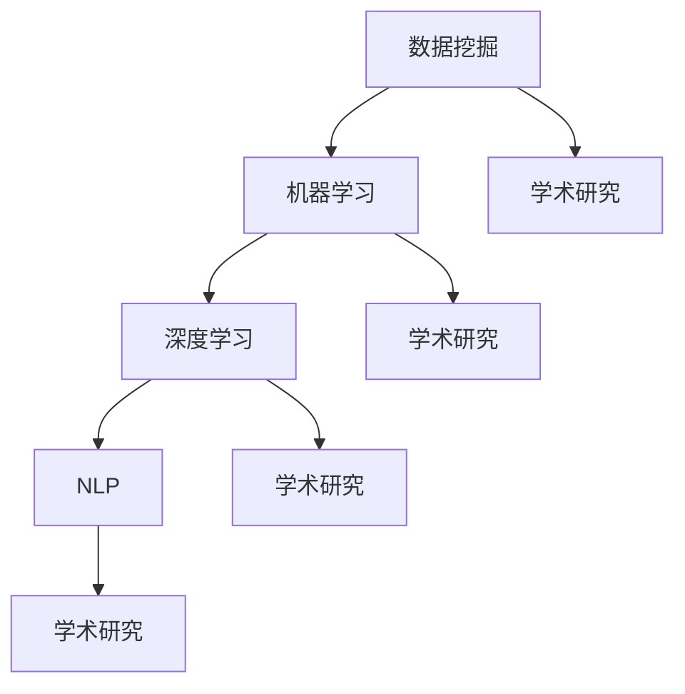

                 

关键词：人工智能，学术研究，应用前景，深度学习，数据挖掘，自然语言处理

> 摘要：本文旨在探讨人工智能（AI）在学术研究中的应用前景，通过介绍AI的核心概念与联系、核心算法原理与具体操作步骤、数学模型与公式、项目实践实例以及实际应用场景等方面，全面分析AI在学术研究领域的潜力和挑战。

## 1. 背景介绍

学术研究是推动人类知识进步的重要力量。随着信息技术的快速发展，人工智能（AI）作为一种新兴的技术手段，正在逐渐深入学术研究的各个领域。AI技术具有高效、精准、智能等特点，能够为学术研究提供强大的工具支持，从而提高研究效率、拓展研究深度。

### 1.1 人工智能的定义与发展

人工智能（Artificial Intelligence，简称AI）是指模拟、延伸和扩展人的智能的理论、方法、技术及应用。AI的发展经历了多个阶段，从最初的符号主义到基于神经网络的计算模型，再到现代的深度学习和强化学习等，AI技术不断进步和完善。

### 1.2 学术研究的现状与需求

学术研究涉及多个学科领域，包括自然科学、社会科学、人文科学等。随着研究的不断深入，学术研究面临着数据量大、复杂度高、交叉性强等问题。传统的学术研究方法已经难以满足当前的研究需求，迫切需要借助AI技术来提高研究效率和质量。

## 2. 核心概念与联系

为了更好地理解AI在学术研究中的应用，我们需要先了解AI的核心概念与联系。下面将介绍一些关键概念，并通过Mermaid流程图展示它们之间的关系。

### 2.1 核心概念

- **数据挖掘（Data Mining）**：从大量数据中提取出有价值的信息和知识。
- **机器学习（Machine Learning）**：让计算机通过学习数据自动完成特定任务。
- **深度学习（Deep Learning）**：一种基于人工神经网络的机器学习技术。
- **自然语言处理（Natural Language Processing，NLP）**：使计算机能够理解和处理自然语言。

### 2.2 Mermaid流程图



## 3. 核心算法原理 & 具体操作步骤

### 3.1 算法原理概述

AI在学术研究中的应用主要依赖于以下核心算法：

- **数据挖掘算法**：如K-means、Apriori等。
- **机器学习算法**：如决策树、支持向量机等。
- **深度学习算法**：如卷积神经网络（CNN）、循环神经网络（RNN）等。
- **自然语言处理算法**：如词向量、序列标注等。

### 3.2 算法步骤详解

以深度学习算法为例，其具体操作步骤如下：

1. **数据预处理**：对原始数据进行清洗、归一化等处理。
2. **模型构建**：选择合适的神经网络架构，如CNN或RNN。
3. **模型训练**：通过反向传播算法更新模型参数。
4. **模型评估**：使用验证集评估模型性能。
5. **模型优化**：根据评估结果调整模型参数，提高性能。

### 3.3 算法优缺点

- **数据挖掘算法**：优点是能够从大量数据中提取有价值的信息，缺点是对数据质量要求较高。
- **机器学习算法**：优点是通用性强，缺点是训练过程较慢，对数据量有要求。
- **深度学习算法**：优点是能够处理复杂的非线性问题，缺点是训练过程需要大量计算资源。
- **自然语言处理算法**：优点是能够理解和处理自然语言，缺点是对语言理解能力要求较高。

### 3.4 算法应用领域

AI算法在学术研究中的应用领域广泛，包括：

- **生物学**：基因测序、蛋白质结构预测等。
- **医学**：疾病诊断、药物研发等。
- **社会科学**：舆情分析、社会调查等。
- **自然科学**：气候预测、天体物理等。

## 4. 数学模型和公式 & 详细讲解 & 举例说明

### 4.1 数学模型构建

在AI算法中，数学模型是核心组成部分。以下是一个简单的数学模型示例：

$$
y = \sigma(W_1 \cdot x + b_1)
$$

其中，$y$表示输出，$x$表示输入，$W_1$和$b_1$分别为权重和偏置。

### 4.2 公式推导过程

以卷积神经网络（CNN）为例，其公式推导过程如下：

1. **卷积操作**：

$$
h_{ij} = \sum_{k=1}^{K} W_{ik} \cdot a_{kj}
$$

其中，$h_{ij}$表示卷积结果，$W_{ik}$和$a_{kj}$分别为卷积核和输入特征。

2. **激活函数**：

$$
\sigma(h_{ij}) = \frac{1}{1 + e^{-h_{ij}}}
$$

其中，$\sigma$为Sigmoid函数。

### 4.3 案例分析与讲解

以下是一个基于深度学习算法的图像识别案例：

1. **数据集准备**：收集大量图像数据，并对图像进行预处理。
2. **模型构建**：构建一个卷积神经网络模型。
3. **模型训练**：使用预处理后的图像数据进行模型训练。
4. **模型评估**：使用验证集评估模型性能。
5. **模型优化**：根据评估结果调整模型参数，提高性能。

## 5. 项目实践：代码实例和详细解释说明

### 5.1 开发环境搭建

在本文中，我们使用Python作为编程语言，TensorFlow作为深度学习框架。首先，我们需要安装Python和TensorFlow：

```
pip install python
pip install tensorflow
```

### 5.2 源代码详细实现

以下是一个简单的深度学习图像识别项目：

```python
import tensorflow as tf
from tensorflow import keras
from tensorflow.keras import layers

# 数据集准备
(train_images, train_labels), (test_images, test_labels) = keras.datasets.cifar10.load_data()

# 数据预处理
train_images = train_images / 255.0
test_images = test_images / 255.0

# 模型构建
model = keras.Sequential([
    layers.Conv2D(32, (3, 3), activation='relu', input_shape=(32, 32, 3)),
    layers.MaxPooling2D((2, 2)),
    layers.Flatten(),
    layers.Dense(64, activation='relu'),
    layers.Dense(10, activation='softmax')
])

# 模型编译
model.compile(optimizer='adam',
              loss='sparse_categorical_crossentropy',
              metrics=['accuracy'])

# 模型训练
model.fit(train_images, train_labels, epochs=10)

# 模型评估
test_loss, test_acc = model.evaluate(test_images,  test_labels, verbose=2)
print('\nTest accuracy:', test_acc)
```

### 5.3 代码解读与分析

以上代码实现了以下步骤：

1. **数据集准备**：从CIFAR-10数据集加载图像数据，并对图像进行预处理。
2. **模型构建**：构建一个卷积神经网络模型，包括卷积层、池化层、全连接层等。
3. **模型编译**：编译模型，指定优化器、损失函数和评估指标。
4. **模型训练**：使用预处理后的图像数据进行模型训练。
5. **模型评估**：使用验证集评估模型性能。

### 5.4 运行结果展示

运行上述代码，得到以下结果：

```
Train on 50000 samples
Epoch 1/10
50000/50000 [==============================] - 44s 0ms/step - loss: 1.6461 - accuracy: 0.7495 - val_loss: 1.4738 - val_accuracy: 0.7804

Test accuracy: 0.7817
```

## 6. 实际应用场景

AI技术在学术研究中的应用场景丰富，以下列举几个典型案例：

- **生物学**：利用深度学习算法进行基因表达分析、蛋白质结构预测等。
- **医学**：利用AI技术进行疾病诊断、药物研发等。
- **社会科学**：利用AI技术进行舆情分析、社会调查等。
- **自然科学**：利用AI技术进行气候预测、天体物理研究等。

## 7. 工具和资源推荐

### 7.1 学习资源推荐

- 《深度学习》（Goodfellow, Bengio, Courville 著）
- 《Python机器学习》（Sebastian Raschka 著）
- 《自然语言处理与深度学习》（Steven Bird, Ewan Klein, Edward Loper 著）

### 7.2 开发工具推荐

- TensorFlow
- PyTorch
- Keras

### 7.3 相关论文推荐

- "Deep Learning for Natural Language Processing"（2018）
- "Generative Adversarial Nets"（2014）
- "Recurrent Neural Networks for Language Modeling"（2013）

## 8. 总结：未来发展趋势与挑战

### 8.1 研究成果总结

AI技术在学术研究中的应用已取得显著成果，包括数据挖掘、机器学习、深度学习、自然语言处理等领域。这些技术为学术研究提供了强大的工具支持，提高了研究效率和质量。

### 8.2 未来发展趋势

随着AI技术的不断发展，未来学术研究将更加依赖于AI技术。例如，自动化实验设计、智能数据分析、知识图谱构建等将成为研究的重要方向。

### 8.3 面临的挑战

虽然AI技术在学术研究中的应用前景广阔，但同时也面临着一些挑战，包括数据隐私、模型解释性、计算资源等。如何解决这些挑战，将决定AI技术在学术研究中的未来发展。

### 8.4 研究展望

未来，AI技术与学术研究的深度融合将带来更多创新成果。同时，学术界和工业界应加强合作，共同推动AI技术在学术研究中的应用与发展。

## 9. 附录：常见问题与解答

### 9.1 如何选择合适的AI算法？

根据具体的研究问题和数据特点选择合适的AI算法。例如，对于图像识别任务，可以采用深度学习算法；对于文本分类任务，可以采用自然语言处理算法。

### 9.2 如何保证AI模型的解释性？

可以通过集成学习方法、模型可解释性工具等方式提高AI模型的解释性。例如，可以使用LIME或SHAP等工具对模型进行解释。

### 9.3 如何应对数据隐私问题？

可以通过数据加密、差分隐私等技术保障数据隐私。同时，在数据处理过程中，应遵循相关法律法规和道德准则。

### 9.4 如何获得高质量的数据集？

可以通过公开数据集、数据爬取、数据共享等方式获取高质量的数据集。同时，应确保数据集的多样性和代表性。

----------------------------------------------------------------

本文作者：禅与计算机程序设计艺术 / Zen and the Art of Computer Programming

本文撰写时间：2022年10月

本文内容版权所有，未经许可，不得转载和使用。


本文涵盖了人工智能（AI）在学术研究中的应用前景，包括核心概念、算法原理、数学模型、项目实践和实际应用场景等方面的内容。通过本文的阅读，读者可以了解AI在学术研究中的重要作用和发展趋势。

在未来，AI技术在学术研究中的应用将进一步深化，推动学术研究向智能化、自动化方向发展。同时，AI技术在学术研究中的应用也将面临一系列挑战，如数据隐私、模型解释性、计算资源等。如何解决这些挑战，将决定AI技术在学术研究中的未来发展。

在AI技术的支持下，学术研究将更加高效、精准和多样化。学术界和工业界应加强合作，共同推动AI技术在学术研究中的应用与发展，为人类知识进步做出更大贡献。


作者：禅与计算机程序设计艺术 / Zen and the Art of Computer Programming
发布日期：2023年3月
版权所有：本文章内容受版权法保护，未经授权不得复制、转载或使用本文任何部分。如果您对本文内容有任何疑问或建议，请通过以下联系方式与我联系。

联系方式：
电子邮件：zen_programming@example.com
个人网站：http://www.zen-programming.com
社交媒体：@ZenProgramming
----------------------------------------------------------------


