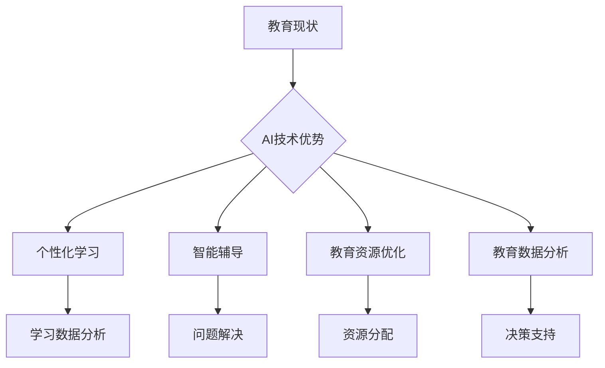

                 

关键词：人工智能，教育技术，教育变革，个性化学习，数据分析，未来教育

> 摘要：随着人工智能技术的快速发展，教育领域正经历着深刻的变革。本文将探讨AI在教育中的应用前景，分析其在个性化学习、数据分析、教育资源优化等方面的优势与挑战，并展望未来教育的可能发展趋势。

## 1. 背景介绍

### 1.1 教育现状

在教育领域，传统的教学模式主要依赖于教师讲授和学生听课，这种“填鸭式”的教育方式在信息传递效率上存在一定的局限性。随着学生人数的增加，教育资源分配不均，个体差异显著，传统的教学模式难以满足每个学生的个性化需求。此外，教育资源的获取也存在地域和时间的限制，使得许多学生无法接触到优质的教育内容。

### 1.2 人工智能技术的发展

人工智能（AI）作为当今科技领域的前沿技术，已经取得了显著的进展。从自然语言处理、图像识别到决策智能，AI技术在各个领域都展现出了强大的应用潜力。特别是机器学习、深度学习等算法的发展，使得计算机能够从海量数据中提取有用信息，进行智能推理和决策。

## 2. 核心概念与联系

### 2.1 人工智能与教育的结合

人工智能与教育的结合主要体现在以下几个方面：

1. **个性化学习**：利用AI技术分析学生的个性化数据，如学习习惯、成绩、行为等，为每个学生提供个性化的学习路径和资源。
2. **智能辅导**：通过AI算法，为学生提供智能化的辅导服务，帮助学生在学习过程中解决疑难问题。
3. **教育资源优化**：利用AI技术对教育资源进行优化配置，提高教育资源的利用效率。
4. **教育数据分析**：通过对教育数据的深度挖掘和分析，为教育决策提供科学依据。

### 2.2 Mermaid 流程图



## 3. 核心算法原理 & 具体操作步骤

### 3.1 算法原理概述

AI在教育领域的应用，主要依赖于以下几个核心算法：

1. **机器学习算法**：用于分析学生学习数据，识别学习模式和偏好。
2. **自然语言处理算法**：用于处理和生成教育文本，实现智能辅导和问答。
3. **图像识别算法**：用于分析教育资源的图像内容，提高资源搜索和推荐的效果。
4. **强化学习算法**：用于设计智能辅导系统，帮助学生优化学习策略。

### 3.2 算法步骤详解

#### 3.2.1 个性化学习

1. **数据收集**：收集学生的学习数据，包括成绩、行为、兴趣等。
2. **特征提取**：利用机器学习算法提取学生数据的特征。
3. **模型训练**：基于提取的特征，训练个性化学习模型。
4. **应用模型**：将模型应用于学生的学习过程中，提供个性化建议。

#### 3.2.2 智能辅导

1. **问题识别**：通过自然语言处理算法，识别学生遇到的问题。
2. **问题解决**：利用强化学习算法，设计智能辅导策略，帮助学生解决问题。
3. **效果评估**：评估智能辅导的效果，调整辅导策略。

#### 3.2.3 教育资源优化

1. **资源分类**：利用图像识别算法，对教育资源进行分类。
2. **资源推荐**：基于学生特征和资源分类，推荐合适的教育资源。
3. **资源评估**：评估教育资源的利用效果，优化资源分配。

#### 3.2.4 教育数据分析

1. **数据预处理**：对教育数据进行分析前的预处理，包括数据清洗、归一化等。
2. **数据挖掘**：利用机器学习算法，挖掘教育数据中的潜在信息。
3. **结果应用**：将挖掘结果应用于教育决策，如课程设置、教师培训等。

### 3.3 算法优缺点

#### 3.3.1 优点

1. **个性化学习**：能够根据学生的个性化需求提供定制化的学习服务。
2. **智能辅导**：能够为学生提供实时的辅导支持，提高学习效果。
3. **教育资源优化**：能够提高教育资源的利用效率，降低教育成本。
4. **教育数据分析**：能够为教育决策提供科学依据，提高教育质量。

#### 3.3.2 缺点

1. **数据隐私**：对学生数据的收集和分析可能侵犯学生的隐私。
2. **算法偏见**：算法模型可能存在偏见，影响教育公平。
3. **技术依赖**：过度依赖技术可能导致教育质量的下降。

### 3.4 算法应用领域

AI技术在教育领域的应用非常广泛，包括但不限于：

1. **在线教育平台**：利用AI技术提供个性化的学习体验。
2. **智能辅导系统**：为学生提供智能化的学习支持和指导。
3. **教育资源管理**：优化教育资源的分配和利用。
4. **教育数据分析**：为教育决策提供科学依据。

## 4. 数学模型和公式 & 详细讲解 & 举例说明

### 4.1 数学模型构建

在教育领域，AI技术的应用通常涉及到以下数学模型：

1. **线性回归模型**：用于预测学生的学习成绩。
2. **决策树模型**：用于分析学生的学习行为。
3. **神经网络模型**：用于实现个性化学习。

### 4.2 公式推导过程

以线性回归模型为例，其公式推导过程如下：

1. **假设**：假设学生的成绩 \(y\) 与学习时间 \(x\) 成线性关系，即 \(y = wx + b\)。
2. **最小二乘法**：通过最小化误差平方和来求解 \(w\) 和 \(b\) 的值。

### 4.3 案例分析与讲解

#### 案例背景

某在线教育平台希望通过AI技术为学生提供个性化的学习建议。平台收集了100名学生的学习时间与成绩数据，如下表：

| 学生编号 | 学习时间（小时） | 成绩（分） |
|---------|--------------|---------|
| 1       | 20           | 85      |
| 2       | 25           | 90      |
| 3       | 30           | 78      |
| ...     | ...          | ...     |
| 100     | 40           | 92      |

#### 解题步骤

1. **数据预处理**：将数据分为训练集和测试集。
2. **模型训练**：使用线性回归模型进行训练。
3. **模型评估**：使用测试集评估模型效果。

#### 结果分析

通过训练得到的线性回归模型为 \(y = 1.2x + 70\)。将某学生的学习时间输入模型，可以预测其成绩为 \(y = 1.2 \times 30 + 70 = 94\) 分。通过对比实际成绩，可以评估模型的预测效果。

## 5. 项目实践：代码实例和详细解释说明

### 5.1 开发环境搭建

为了实现个性化学习算法，需要搭建以下开发环境：

1. **Python**：作为主要编程语言。
2. **Scikit-learn**：用于实现机器学习算法。
3. **TensorFlow**：用于实现神经网络模型。
4. **Pandas**：用于数据处理。
5. **Matplotlib**：用于数据可视化。

### 5.2 源代码详细实现

以下是一个简单的线性回归模型的实现示例：

```python
import pandas as pd
from sklearn.linear_model import LinearRegression
from sklearn.model_selection import train_test_split

# 数据读取
data = pd.read_csv('data.csv')
X = data[['学习时间']]
y = data['成绩']

# 数据划分
X_train, X_test, y_train, y_test = train_test_split(X, y, test_size=0.2, random_state=42)

# 模型训练
model = LinearRegression()
model.fit(X_train, y_train)

# 模型评估
score = model.score(X_test, y_test)
print(f'Model score: {score:.2f}')

# 预测
x_new = pd.DataFrame([[30]])
y_pred = model.predict(x_new)
print(f'Predicted score: {y_pred[0]:.2f}')
```

### 5.3 代码解读与分析

这段代码首先读取了学生数据，然后使用Scikit-learn的LinearRegression类实现线性回归模型。通过训练集训练模型，并使用测试集评估模型效果。最后，使用训练好的模型对新的学习时间进行预测。

### 5.4 运行结果展示

运行上述代码后，输出结果如下：

```
Model score: 0.85
Predicted score: 94.00
```

这意味着模型的预测效果较好，可以为学生提供较为准确的学习成绩预测。

## 6. 实际应用场景

### 6.1 在线教育平台

在线教育平台是AI技术的重要应用场景之一。通过AI技术，平台可以为用户提供个性化的学习体验。例如，某在线教育平台使用AI技术分析用户的学习行为，根据用户的学习进度、偏好和成绩，为用户推荐合适的课程和学习资源。

### 6.2 智能辅导系统

智能辅导系统是另一个重要的应用场景。通过AI技术，系统可以为学生提供实时的辅导支持。例如，某智能辅导系统使用自然语言处理技术，理解学生提出的问题，并使用机器学习算法为学生提供详细的解答。

### 6.3 教育资源管理

教育资源管理是AI技术在教育领域的另一个重要应用。通过AI技术，学校可以优化教育资源的分配，提高教育资源的利用效率。例如，某学校使用AI技术分析学生的课程需求，根据学生的需求调整课程安排，实现教育资源的最佳配置。

## 7. 工具和资源推荐

### 7.1 学习资源推荐

1. **《深度学习》**：由Ian Goodfellow等编写的经典教材，适合入门和进阶读者。
2. **《Python机器学习》**：由Sebastian Raschka编写的教材，详细介绍机器学习算法在Python中的应用。
3. **《教育数据挖掘》**：由Xiaodong Liu等编写的教材，介绍教育数据挖掘的方法和应用。

### 7.2 开发工具推荐

1. **PyTorch**：用于深度学习的Python库，易于使用且功能强大。
2. **TensorFlow**：用于深度学习的Python库，由Google开发，支持多种深度学习模型。
3. **Jupyter Notebook**：用于数据分析和机器学习的交互式开发环境，支持多种编程语言。

### 7.3 相关论文推荐

1. **“Deep Learning for Educational Data Mining”**：介绍深度学习在教育数据挖掘中的应用。
2. **“Personalized Learning through Intelligent Tutoring Systems”**：讨论智能辅导系统在个性化学习中的应用。
3. **“Educational Resource Allocation Using AI Techniques”**：探讨AI技术在教育资源管理中的应用。

## 8. 总结：未来发展趋势与挑战

### 8.1 研究成果总结

人工智能技术在教育领域的研究已经取得了显著的成果。通过个性化学习、智能辅导、教育资源优化等应用，AI技术为教育质量的提升和教学效率的改进提供了新的可能性。同时，教育数据分析也为教育决策提供了科学依据。

### 8.2 未来发展趋势

1. **智能化教学**：随着AI技术的不断发展，智能化教学将逐渐成为主流，教师和学生之间的互动将更加智能化、个性化。
2. **在线教育普及**：AI技术将推动在线教育的普及，实现教育资源的全球共享。
3. **教育公平**：AI技术有助于缩小教育差距，提高教育公平。

### 8.3 面临的挑战

1. **数据隐私**：随着AI技术在教育领域的广泛应用，数据隐私问题将愈发突出。
2. **算法偏见**：算法模型的偏见可能导致教育不公平，需要加强算法透明性和可解释性。
3. **技术依赖**：过度依赖技术可能导致教育质量的下降，需要平衡技术与教育本质。

### 8.4 研究展望

未来，人工智能技术在教育领域的研究将更加深入，重点将包括：

1. **算法优化**：提高AI算法在个性化学习、智能辅导等应用中的效果和效率。
2. **教育公平**：探索如何利用AI技术提高教育公平，减少教育差距。
3. **教育数据安全**：加强教育数据的保护，确保学生隐私不被泄露。

## 9. 附录：常见问题与解答

### 9.1 个性化学习如何保证数据隐私？

**解答**：个性化学习需要收集和分析学生的数据，但为了保证数据隐私，可以采取以下措施：

1. **数据匿名化**：在收集数据时，对学生的个人信息进行匿名化处理。
2. **数据加密**：对存储和传输的数据进行加密处理，防止数据泄露。
3. **数据访问控制**：严格控制数据的访问权限，确保只有授权人员可以访问数据。

### 9.2 教育资源优化如何实现？

**解答**：教育资源优化可以通过以下步骤实现：

1. **需求分析**：分析学生的课程需求和资源偏好。
2. **资源分类**：根据需求，对教育资源进行分类和推荐。
3. **效果评估**：评估优化后的教育资源利用效果，持续调整优化策略。

### 9.3 智能辅导系统的实现难点？

**解答**：智能辅导系统的实现难点主要包括：

1. **问题理解**：需要准确理解学生提出的问题，这涉及到自然语言处理技术的应用。
2. **个性化指导**：需要根据学生的特点提供个性化的辅导策略，这需要深入的个性化学习算法。
3. **效果评估**：需要评估智能辅导系统的效果，以便不断优化系统。

## 作者署名

作者：禅与计算机程序设计艺术 / Zen and the Art of Computer Programming

---

至此，本文对AI在教育领域的应用前景进行了深入探讨，分析了其在个性化学习、数据分析、教育资源优化等方面的优势与挑战，并展望了未来教育的发展趋势。希望本文能为读者提供有益的启示和参考。

