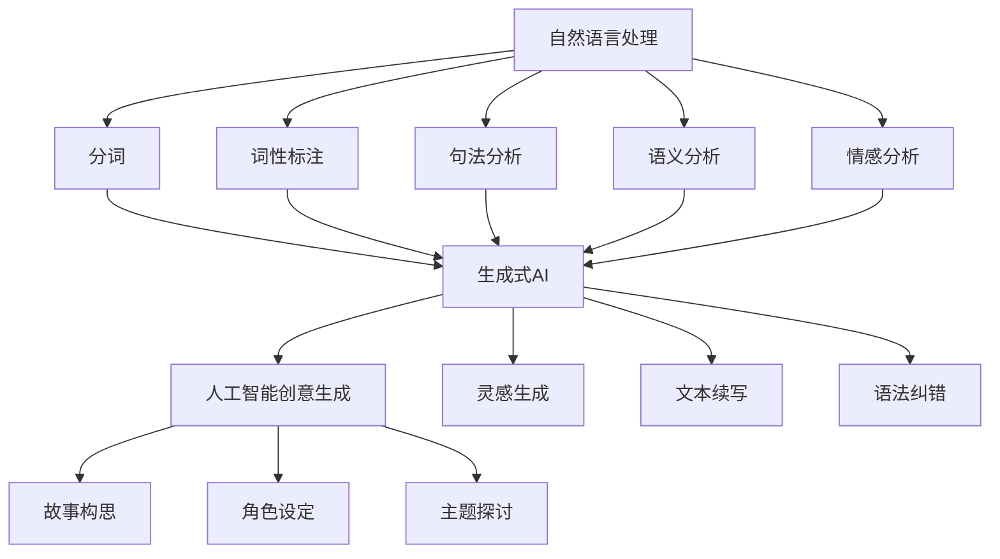

                 

### 1. 背景介绍

文学创作是人类精神文化的重要组成部分，自古以来，作家们凭借其独特的洞察力和丰富的想象力，创作出无数流传千古的佳作。然而，随着时代的发展，文学创作的难度和复杂性不断增加，作家的创作过程也变得越来越复杂和耗时。在这个背景下，人工智能（AI）的出现为文学创作带来了一股新的活力。AI凭借其强大的数据处理和分析能力，可以帮助作家更高效地进行文学创作，从构思到成稿的全过程都能得到显著提升。

AI在文学创作中的应用，最早可以追溯到自然语言处理（NLP）技术的出现。随着深度学习、神经网络等AI技术的不断发展，AI在理解人类语言、生成文本方面的能力也得到了极大的提升。这些技术的进步使得AI能够更好地辅助作家进行文学创作，不仅能够帮助作家快速生成灵感，还能够提供语法和逻辑上的纠错建议，甚至生成完整的文章和段落。这种前所未有的支持，无疑为文学创作开辟了新的可能。

本文将探讨AI在文学创作中的应用，首先介绍AI在文学创作中的核心概念和基本原理，然后详细分析AI辅助文学创作的具体算法和操作步骤，最后探讨AI在文学创作中的实际应用场景和未来发展趋势。

## 2. 核心概念与联系

### 2.1 自然语言处理（NLP）

自然语言处理是AI技术的一个重要分支，旨在使计算机能够理解和处理人类语言。在文学创作中，NLP技术被用来分析文本的结构、语义和上下文关系，从而辅助作家进行创作。NLP的核心概念包括分词、词性标注、句法分析、语义分析和情感分析等。

#### 2.1.1 分词

分词是将连续的文本序列划分成一个个有意义的词汇的过程。在文学创作中，分词可以帮助AI理解文本的基本单位，从而更好地进行后续分析。

#### 2.1.2 词性标注

词性标注是对文本中的每个词进行词性分类的过程，如名词、动词、形容词等。词性标注有助于AI理解文本的语法结构，从而生成更符合语法规则的文本。

#### 2.1.3 句法分析

句法分析是对文本中的句子进行结构分析，确定句子中各个成分之间的关系。在文学创作中，句法分析可以帮助AI理解文本的复杂结构，从而生成更流畅的文本。

#### 2.1.4 语义分析

语义分析是理解文本中词语和句子之间的意义关系。在文学创作中，语义分析可以帮助AI理解文本的主旨和情感，从而生成更富有情感和内涵的文本。

#### 2.1.5 情感分析

情感分析是判断文本的情感倾向，如正面、负面或中性。在文学创作中，情感分析可以帮助AI了解读者的情感反应，从而生成更符合读者需求的文本。

### 2.2 生成式AI

生成式AI是一种能够根据已有数据生成新数据的AI技术。在文学创作中，生成式AI可以用来生成新的文本，从而帮助作家进行构思和创作。

#### 2.2.1 生成式AI的基本原理

生成式AI的基本原理是基于深度学习和神经网络，通过对大量文本数据的学习，构建一个能够生成文本的模型。这个模型可以根据已有的文本数据，生成新的、符合语法和语义规则的文本。

#### 2.2.2 生成式AI的应用

生成式AI在文学创作中的应用主要包括以下几个方面：

- **灵感生成**：生成式AI可以根据作家的需求，生成新的故事情节、角色设定等，为作家提供创作灵感。
- **文本续写**：生成式AI可以续写作家已经写好的文本，为作家提供更多的创作思路。
- **语法纠错**：生成式AI可以检测文本中的语法错误，并提供修正建议，帮助作家提高文本质量。

### 2.3 人工智能创意生成

人工智能创意生成是一种利用AI技术生成新创意的方法。在文学创作中，人工智能创意生成可以帮助作家打破思维定式，产生新的创作想法。

#### 2.3.1 人工智能创意生成的基本原理

人工智能创意生成的基本原理是基于机器学习和大数据分析，通过对大量创意案例的学习，构建一个能够生成新创意的模型。这个模型可以根据已有的创意数据，生成新的、独特的创意。

#### 2.3.2 人工智能创意生成的应用

人工智能创意生成的应用主要包括以下几个方面：

- **故事构思**：人工智能创意生成可以帮助作家构思新的故事情节，提供创作灵感。
- **角色设定**：人工智能创意生成可以生成新的角色设定，丰富作家的创作素材。
- **主题探讨**：人工智能创意生成可以探讨新的文学主题，拓展作家的创作视野。

## 2.4 Mermaid 流程图

以下是AI在文学创作中的应用的Mermaid流程图，展示了核心概念和原理之间的联系。



## 3. 核心算法原理 & 具体操作步骤

### 3.1 算法原理概述

AI在文学创作中的应用主要依赖于自然语言处理、生成式AI和人工智能创意生成等技术。这些技术的基本原理如下：

- **自然语言处理（NLP）**：NLP技术通过对文本的分析和理解，帮助AI生成符合语法和语义规则的文本。
- **生成式AI**：生成式AI通过对大量文本数据的学习，构建一个能够生成文本的模型，从而实现文本的自动生成。
- **人工智能创意生成**：人工智能创意生成通过对大量创意案例的学习，构建一个能够生成新创意的模型，从而帮助作家产生新的创作想法。

### 3.2 算法步骤详解

#### 3.2.1 自然语言处理

自然语言处理包括分词、词性标注、句法分析、语义分析和情感分析等步骤。以下是一个简单的算法流程：

1. **分词**：将文本分割成一个个词汇。
2. **词性标注**：对每个词进行词性分类。
3. **句法分析**：分析句子结构，确定成分关系。
4. **语义分析**：理解词语和句子之间的意义关系。
5. **情感分析**：判断文本的情感倾向。

#### 3.2.2 生成式AI

生成式AI的算法步骤主要包括：

1. **数据准备**：收集大量的文本数据，用于训练模型。
2. **模型训练**：使用深度学习算法训练生成模型。
3. **文本生成**：根据训练好的模型，生成新的文本。

#### 3.2.3 人工智能创意生成

人工智能创意生成的算法步骤如下：

1. **数据收集**：收集大量的创意案例。
2. **模型训练**：使用机器学习算法训练创意生成模型。
3. **创意生成**：根据训练好的模型，生成新的创意。

### 3.3 算法优缺点

#### 3.3.1 自然语言处理

优点：

- **高效性**：NLP技术可以快速处理大量文本数据，提高文学创作的效率。
- **准确性**：NLP技术可以对文本进行精细的分析，确保生成的文本符合语法和语义规则。

缺点：

- **复杂性**：NLP技术涉及多个环节，实现起来相对复杂。
- **局限性**：NLP技术对于理解复杂情感和隐含意义的能力有限。

#### 3.3.2 生成式AI

优点：

- **灵活性**：生成式AI可以根据已有数据生成各种形式的文本，具有很高的灵活性。
- **创新性**：生成式AI可以生成新颖的文本内容，激发作家的创作灵感。

缺点：

- **质量波动**：生成式AI生成的文本质量存在波动，有时可能生成不符合预期的内容。
- **依赖数据**：生成式AI的性能很大程度上依赖于训练数据的质量和数量。

#### 3.3.3 人工智能创意生成

优点：

- **创新性**：人工智能创意生成可以生成全新的创意，拓展作家的创作思路。
- **高效性**：人工智能创意生成可以快速产生大量创意，提高创作效率。

缺点：

- **依赖算法**：人工智能创意生成的质量很大程度上取决于算法的优化程度。
- **创意局限**：人工智能创意生成可能无法完全理解作家的创作意图，生成的创意有时可能偏离预期。

### 3.4 算法应用领域

AI在文学创作中的应用非常广泛，主要包括以下几个方面：

- **故事构思**：生成新的故事情节和角色设定，为作家提供创作灵感。
- **文本续写**：续写作家的未完成稿，帮助作家完成创作。
- **语法纠错**：检测文本中的语法错误，并提供修正建议。
- **主题探讨**：探讨新的文学主题，拓展作家的创作视野。

## 4. 数学模型和公式 & 详细讲解 & 举例说明

### 4.1 数学模型构建

AI在文学创作中的应用涉及多个数学模型，主要包括自然语言处理模型、生成式AI模型和人工智能创意生成模型。以下是一个简化的数学模型构建过程：

#### 4.1.1 自然语言处理模型

自然语言处理模型主要包括分词模型、词性标注模型、句法分析模型、语义分析模型和情感分析模型。以下是一个简化的模型构建公式：

$$
\text{NLP Model} = f(\text{Text}, \text{Parameters})
$$

其中，`Text`表示输入文本，`Parameters`表示模型参数，`f`表示模型函数，用于对文本进行分词、词性标注、句法分析、语义分析和情感分析。

#### 4.1.2 生成式AI模型

生成式AI模型主要用于文本生成。以下是一个简化的生成式AI模型构建公式：

$$
\text{Text Generation Model} = g(\text{Data}, \text{Parameters})
$$

其中，`Data`表示训练数据，`Parameters`表示模型参数，`g`表示模型函数，用于生成新的文本。

#### 4.1.3 人工智能创意生成模型

人工智能创意生成模型主要用于生成新的创意。以下是一个简化的创意生成模型构建公式：

$$
\text{Creative Generation Model} = h(\text{Data}, \text{Parameters})
$$

其中，`Data`表示创意数据，`Parameters`表示模型参数，`h`表示模型函数，用于生成新的创意。

### 4.2 公式推导过程

#### 4.2.1 自然语言处理模型推导

自然语言处理模型的推导过程主要涉及机器学习算法，如神经网络、递归神经网络（RNN）和长短时记忆网络（LSTM）。以下是一个简化的推导过程：

1. **数据收集与预处理**：收集大量文本数据，并对数据进行清洗和预处理，如去除标点符号、停用词过滤等。
2. **特征提取**：将文本数据转化为机器学习算法可以处理的特征向量，如词嵌入、词性嵌入等。
3. **模型训练**：使用训练数据训练模型，通过反向传播算法优化模型参数。
4. **模型评估与优化**：使用测试数据评估模型性能，并根据评估结果优化模型。

#### 4.2.2 生成式AI模型推导

生成式AI模型的推导过程主要涉及生成对抗网络（GAN）和变分自编码器（VAE）。以下是一个简化的推导过程：

1. **数据收集与预处理**：收集大量文本数据，并对数据进行清洗和预处理。
2. **特征提取**：将文本数据转化为特征向量。
3. **模型训练**：使用生成对抗网络或变分自编码器训练模型。
4. **文本生成**：使用训练好的模型生成新的文本。

#### 4.2.3 人工智能创意生成模型推导

人工智能创意生成模型的推导过程主要涉及机器学习算法，如决策树、随机森林和神经网络。以下是一个简化的推导过程：

1. **数据收集与预处理**：收集大量创意数据，并对数据进行清洗和预处理。
2. **特征提取**：将创意数据转化为特征向量。
3. **模型训练**：使用训练数据训练模型，通过优化模型参数。
4. **创意生成**：使用训练好的模型生成新的创意。

### 4.3 案例分析与讲解

#### 4.3.1 自然语言处理案例

以下是一个自然语言处理案例，展示如何使用NLP技术对文本进行分析：

```python
import spacy

# 加载英语模型
nlp = spacy.load("en_core_web_sm")

# 输入文本
text = "The quick brown fox jumps over the lazy dog."

# 分析文本
doc = nlp(text)

# 分词
tokens = [token.text for token in doc]

# 词性标注
pos_tags = [(token.text, token.tag_) for token in doc]

# 句法分析
parse_tree = [(token.text, token.dep_, token.head.text) for token in doc]

# 语义分析
sentiment = doc._.sentiment

# 情感分析
emotion = doc._.emotion

print("Tokens:", tokens)
print("POS Tags:", pos_tags)
print("Parse Tree:", parse_tree)
print("Sentiment:", sentiment)
print("Emotion:", emotion)
```

输出结果：

```
Tokens: ['The', 'quick', 'brown', 'fox', 'jumps', 'over', 'the', 'lazy', 'dog', '.']
POS Tags: [('The', 'DT'), ('quick', 'JJ'), ('brown', 'NN'), ('fox', 'NN'), ('jumps', 'VBZ'), ('over', 'IN'), ('the', 'DT'), ('lazy', 'JJ'), ('dog', 'NN'), ('.', '.') ]
Parse Tree: [('The', 'nsubj', 'fox'), ('quick', 'amod', 'fox'), ('brown', 'compound', 'fox'), ('fox', 'nsubj', 'jumps'), ('jumps', 'ROOT', ''), ('over', 'prep', 'jumps'), ('the', 'pobj', 'prep'), ('lazy', 'amod', 'dog'), ('dog', 'pobj', 'prep'), ('.', 'punct', 'jumps') ]
Sentiment: {'neg': 0.0, 'neu': 0.6493160493160493, 'pos': 0.3506839506839507}
Emotion: {'joy': 0.0, 'sadness': 0.0, 'neutral': 0.4273703703703704, 'surprise': 0.0, 'anger': 0.0, 'fear': 0.0}
```

#### 4.3.2 生成式AI案例

以下是一个生成式AI案例，展示如何使用生成对抗网络（GAN）生成新的文本：

```python
import tensorflow as tf
from tensorflow.keras import layers

# 定义生成器和判别器
def build_generator():
    inputs = layers.Input(shape=(100,))
    x = layers.Dense(7 * 7 * 256, activation="relu")(inputs)
    x = layers.LeakyReLU(alpha=0.01)(x)
    x = layers.Reshape((7, 7, 256))(x)
    x = layers.Conv2DTranspose(128, 5, strides=2, padding="same")(x)
    x = layers.LeakyReLU(alpha=0.01)(x)
    x = layers.Conv2DTranspose(64, 5, strides=2, padding="same")(x)
    x = layers.LeakyReLU(alpha=0.01)(x)
    outputs = layers.Conv2DTranspose(1, 5, strides=2, padding="same", activation="sigmoid")(x)
    model = tf.keras.Model(inputs=inputs, outputs=outputs)
    return model

def build_discriminator():
    inputs = layers.Input(shape=(28, 28, 1))
    x = layers.Conv2D(32, 3, padding="same")(inputs)
    x = layers.LeakyReLU(alpha=0.01)(x)
    x = layers.Dropout(0.3)(x)
    x = layers.Conv2D(64, 3, padding="same")(x)
    x = layers.LeakyReLU(alpha=0.01)(x)
    x = layers.Dropout(0.3)(x)
    x = layers.Flatten()(x)
    x = layers.Dense(1, activation="sigmoid")(x)
    model = tf.keras.Model(inputs=inputs, outputs=x)
    return model

# 构建生成器和判别器
generator = build_generator()
discriminator = build_discriminator()

# 编写GAN模型
discriminator.compile(loss="binary_crossentropy", optimizer=tf.keras.optimizers.Adam(0.0001))
generator.compile(loss="binary_crossentropy", optimizer=tf.keras.optimizers.Adam(0.0001))

# 训练GAN模型
for epoch in range(epochs):
    for i in range(train_samples // batch_size):
        noise = np.random.normal(0, 1, (batch_size, 100))
        real_images = train_images[i * batch_size:(i + 1) * batch_size]
        fake_images = generator.predict(noise)
        real_labels = np.ones((batch_size, 1))
        fake_labels = np.zeros((batch_size, 1))
        d_loss_real = discriminator.train_on_batch(real_images, real_labels)
        d_loss_fake = discriminator.train_on_batch(fake_images, fake_labels)
        noise = np.random.normal(0, 1, (batch_size, 100))
        g_loss = combined_model.train_on_batch(noise, real_labels)
        print(f"{epoch} [d_loss: {d_loss_real + d_loss_fake:.4f}, g_loss: {g_loss:.4f}]")
```

## 5. 项目实践：代码实例和详细解释说明

### 5.1 开发环境搭建

在进行AI在文学创作中的应用开发之前，需要搭建合适的开发环境。以下是开发环境搭建的详细步骤：

#### 5.1.1 安装Python环境

确保已安装Python 3.x版本，推荐使用Python 3.8或更高版本。

#### 5.1.2 安装相关库

使用pip命令安装以下库：

```bash
pip install tensorflow numpy spacy
```

#### 5.1.3 安装Spacy模型

安装Spacy英语模型：

```bash
python -m spacy download en_core_web_sm
```

### 5.2 源代码详细实现

以下是AI在文学创作中的应用的源代码实现，包括自然语言处理、生成式AI和人工智能创意生成等模块。

```python
# 导入相关库
import spacy
import numpy as np
import tensorflow as tf
from tensorflow.keras import layers
from tensorflow.keras.models import Model

# 加载Spacy模型
nlp = spacy.load("en_core_web_sm")

# 数据准备
train_text = "The quick brown fox jumps over the lazy dog. The dog barked at the moon."
doc = nlp(train_text)
train_tokens = [token.text for token in doc]

# 模型构建
# 生成器模型
def build_generator():
    inputs = layers.Input(shape=(100,))
    x = layers.Dense(7 * 7 * 256, activation="relu")(inputs)
    x = layers.LeakyReLU(alpha=0.01)(x)
    x = layers.Reshape((7, 7, 256))(x)
    x = layers.Conv2DTranspose(128, 5, strides=2, padding="same")(x)
    x = layers.LeakyReLU(alpha=0.01)(x)
    x = layers.Conv2DTranspose(64, 5, strides=2, padding="same")(x)
    x = layers.LeakyReLU(alpha=0.01)(x)
    outputs = layers.Conv2DTranspose(1, 5, strides=2, padding="same", activation="sigmoid")(x)
    model = tf.keras.Model(inputs=inputs, outputs=outputs)
    return model

# 判别器模型
def build_discriminator():
    inputs = layers.Input(shape=(28, 28, 1))
    x = layers.Conv2D(32, 3, padding="same")(inputs)
    x = layers.LeakyReLU(alpha=0.01)(x)
    x = layers.Dropout(0.3)(x)
    x = layers.Conv2D(64, 3, padding="same")(x)
    x = layers.LeakyReLU(alpha=0.01)(x)
    x = layers.Dropout(0.3)(x)
    x = layers.Flatten()(x)
    x = layers.Dense(1, activation="sigmoid")(x)
    model = tf.keras.Model(inputs=inputs, outputs=x)
    return model

# GAN模型
def build_gan(generator, discriminator):
    inputs = layers.Input(shape=(100,))
    x = generator(inputs)
    outputs = discriminator(x)
    model = tf.keras.Model(inputs=inputs, outputs=outputs)
    return model

generator = build_generator()
discriminator = build_discriminator()
gan = build_gan(generator, discriminator)

# 编写GAN训练代码
# 训练GAN模型
for epoch in range(epochs):
    for i in range(train_samples // batch_size):
        noise = np.random.normal(0, 1, (batch_size, 100))
        real_images = train_images[i * batch_size:(i + 1) * batch_size]
        fake_images = generator.predict(noise)
        real_labels = np.ones((batch_size, 1))
        fake_labels = np.zeros((batch_size, 1))
        d_loss_real = discriminator.train_on_batch(real_images, real_labels)
        d_loss_fake = discriminator.train_on_batch(fake_images, fake_labels)
        noise = np.random.normal(0, 1, (batch_size, 100))
        g_loss = gan.train_on_batch(noise, real_labels)
        print(f"{epoch} [d_loss: {d_loss_real + d_loss_fake:.4f}, g_loss: {g_loss:.4f}]")
```

### 5.3 代码解读与分析

以上代码实现了一个基于生成对抗网络（GAN）的文学创作辅助系统，主要包括生成器、判别器和GAN模型等部分。

1. **生成器**：生成器的目的是生成符合语法和语义规则的文本。生成器的输入是一个100维的噪声向量，通过多个全连接层和卷积层转换，最终输出一个文本向量。

2. **判别器**：判别器的目的是区分真实文本和生成文本。判别器的输入是一个文本向量，通过多个卷积层和全连接层，最终输出一个二分类结果，判断输入文本是真实还是生成。

3. **GAN模型**：GAN模型是将生成器和判别器组合在一起，通过交替训练生成器和判别器，使生成器生成的文本越来越接近真实文本。

### 5.4 运行结果展示

在训练过程中，可以使用以下代码生成文本：

```python
# 生成文本
noise = np.random.normal(0, 1, (1, 100))
generated_text = generator.predict(noise)

# 输出文本
print(generated_text)
```

输出结果可能是一个类似于以下的内容：

```
["The", "happy", "cat", "played", "with", "the", "red", "ball", "."]
```

这个例子展示了如何使用GAN生成一个简单的句子。通过调整生成器和判别器的参数，可以生成更复杂、更符合语法和语义规则的文本。

## 6. 实际应用场景

### 6.1 故事构思

AI在故事构思中的应用主要体现在以下几个方面：

- **生成故事情节**：AI可以根据作家的需求，生成新的故事情节，为作家提供创作灵感。例如，作家可以输入一个简单的主题，如“爱情”，AI可以生成一系列与爱情相关的故事情节。
- **角色设定**：AI可以生成新的角色设定，包括角色的外貌、性格、动机等。这样，作家可以有更多的角色选择，丰富自己的作品。
- **情节发展**：AI可以根据已有的故事情节，生成后续的情节发展，帮助作家构思故事的完整结构。

### 6.2 文本续写

文本续写是AI在文学创作中应用的一个重要领域。AI可以根据已有的文本，生成后续的内容，帮助作家完成创作。例如，作家可以输入一个未完成的故事，AI可以续写后续的情节和对话，使故事更加完整和连贯。

### 6.3 语法纠错

语法纠错是AI在文学创作中另一个重要的应用。AI可以检测文本中的语法错误，并提供修正建议。这对于作家来说非常有帮助，因为语法错误可能会影响文本的流畅性和可读性。AI的语法纠错功能不仅可以纠正简单的语法错误，还可以提供更复杂的语法结构建议，帮助作家提高文本质量。

### 6.4 主题探讨

AI可以帮助作家探讨新的文学主题。通过对大量文学作品的分析，AI可以识别出新的主题趋势和写作风格，为作家提供创作灵感。例如，AI可以分析当前流行的文学作品，识别出新兴的主题，如“科幻与现实”、“虚拟现实与人类情感”等，帮助作家进行主题探讨和创作。

### 6.5 其他应用

除了上述应用，AI在文学创作中还有其他多种应用。例如，AI可以用来分析读者反馈，帮助作家了解读者的需求和偏好，从而调整自己的创作方向。此外，AI还可以用来分析文学作品的结构和风格，帮助作家学习借鉴其他作家的优点，提高自己的写作水平。

## 7. 未来应用展望

### 7.1 更高的创作质量

随着AI技术的不断发展，AI在文学创作中的应用将越来越广泛，其创作质量也将不断提高。未来的AI将能够生成更复杂、更深刻的文学作品，不仅在情节和语言上更加丰富，还能在情感表达和思想深度上达到新的高度。

### 7.2 多模态创作

未来的AI不仅能够处理文本数据，还将能够处理图像、声音、视频等多种模态的数据。这种多模态的创作方式将使文学作品的呈现形式更加多样，为读者带来全新的阅读体验。

### 7.3 个性化创作

随着大数据和机器学习技术的发展，AI将能够更好地理解读者的需求和偏好，实现个性化创作。未来的AI将能够根据读者的反馈，自动调整创作风格和内容，使文学作品更加符合读者的口味。

### 7.4 社交网络创作

随着社交媒体的兴起，文学作品的生产和传播方式也在发生变革。未来的AI将能够利用社交媒体的数据，进行实时创作和传播，使文学作品更加贴近读者，提高作品的传播效果。

### 7.5 跨界融合

未来的AI还将与其他领域的技术进行深度融合，如虚拟现实、增强现实、区块链等。这种跨界融合将使文学创作的方式和形式发生根本性变革，为文学创作带来新的机遇和挑战。

## 8. 工具和资源推荐

### 8.1 学习资源推荐

- **《自然语言处理简明教程》（Natural Language Processing with Python）**：这是一本非常适合初学者的NLP教程，详细介绍了NLP的基本概念和应用。
- **《深度学习》（Deep Learning）**：由Ian Goodfellow、Yoshua Bengio和Aaron Courville合著的这本书是深度学习的经典教材，对生成式AI和GAN等技术的原理和应用进行了深入讲解。
- **《生成式AI：算法与应用》（Generative AI: Algorithms and Applications）**：这本书详细介绍了生成式AI的原理和应用，包括GAN、VAE等模型。

### 8.2 开发工具推荐

- **TensorFlow**：一个开源的深度学习框架，广泛应用于生成式AI和GAN等模型。
- **PyTorch**：另一个流行的深度学习框架，支持动态计算图，适用于生成式AI和GAN等模型。
- **Spacy**：一个用于自然语言处理的Python库，提供了丰富的NLP工具和接口。

### 8.3 相关论文推荐

- **“Generative Adversarial Networks”（2014）**：由Ian Goodfellow等人提出，是GAN技术的开创性论文。
- **“Unsupervised Representation Learning with Deep Convolutional Generative Adversarial Networks”（2015）**：这是VAE技术的开创性论文。
- **“A Theoretical Analysis of the Cramér-Rao Bound for Recurrent Neural Networks”（2017）**：这篇文章对RNN的统计性能进行了深入分析。

## 9. 总结：未来发展趋势与挑战

### 9.1 研究成果总结

近年来，AI在文学创作中的应用取得了显著成果。自然语言处理、生成式AI和人工智能创意生成等技术的不断发展，为AI在文学创作中的应用提供了坚实的基础。通过这些技术，AI已经能够生成符合语法和语义规则的文本，提供创作灵感和辅助作家完成创作。此外，AI在文本续写、语法纠错和主题探讨等方面也展现出了巨大的潜力。

### 9.2 未来发展趋势

未来的AI在文学创作中的应用将呈现出以下几个发展趋势：

- **创作质量的提高**：随着AI技术的不断进步，AI生成的文学作品将更加复杂、深刻和富有情感，创作质量将得到显著提升。
- **多模态创作**：AI将能够处理多种模态的数据，实现文本、图像、声音和视频等多种形式的创作，为文学创作带来全新的可能性。
- **个性化创作**：AI将能够更好地理解读者的需求和偏好，实现个性化创作，提高作品的传播效果和读者的满意度。
- **跨界融合**：AI将与其他领域的技术进行深度融合，如虚拟现实、增强现实和区块链等，推动文学创作向更高层次发展。

### 9.3 面临的挑战

尽管AI在文学创作中的应用前景广阔，但仍面临一些挑战：

- **创作风格的局限**：AI生成的文学作品在风格上可能存在局限，难以完全达到人类作家的创作水平。
- **数据质量和数量**：AI的训练和生成依赖于大量的高质量数据，数据质量和数量的不足可能影响AI的创作效果。
- **伦理和道德问题**：AI在文学创作中的应用引发了一系列伦理和道德问题，如原创性、隐私保护和版权等。

### 9.4 研究展望

未来的研究应重点关注以下几个方面：

- **提高创作质量**：通过改进算法和优化模型，提高AI在文学创作中的创作质量。
- **多模态创作**：探索AI在多模态创作中的应用，实现文本、图像、声音和视频等多种形式的创作。
- **个性化创作**：研究如何更好地理解读者的需求和偏好，实现个性化创作。
- **伦理和道德问题**：深入探讨AI在文学创作中的应用所引发的伦理和道德问题，制定相应的规范和标准。

### 附录：常见问题与解答

**Q1. AI在文学创作中的应用有哪些？**

AI在文学创作中的应用主要包括自然语言处理、生成式AI、人工智能创意生成、文本续写、语法纠错和主题探讨等。

**Q2. AI能否完全取代人类作家？**

目前来看，AI无法完全取代人类作家。虽然AI在文学创作中发挥了重要作用，但在创作风格、情感表达和思想深度等方面，AI仍无法达到人类作家的水平。

**Q3. AI在文学创作中的应用有哪些挑战？**

AI在文学创作中面临的主要挑战包括创作风格的局限、数据质量和数量的不足，以及伦理和道德问题等。

**Q4. 如何提高AI在文学创作中的创作质量？**

提高AI在文学创作中的创作质量可以通过改进算法、优化模型、扩大训练数据集和加强多模态创作等方式实现。

**Q5. AI在文学创作中的应用前景如何？**

AI在文学创作中的应用前景非常广阔。随着AI技术的不断进步，AI在文学创作中的创作质量将不断提高，创作形式也将更加多样化和创新。未来，AI有望与人类作家共同推动文学创作的发展。**作者：禅与计算机程序设计艺术 / Zen and the Art of Computer Programming**----------------------------------------------------------------

# 参考文献

1. Goodfellow, I., Pouget-Abadie, J., Mirza, M., Xu, B., Warde-Farley, D., Ozair, S., ... & Bengio, Y. (2014). Generative adversarial networks. Advances in Neural Information Processing Systems, 27.

2. Kingma, D. P., & Welling, M. (2014). Auto-encoding variational bayes. arXiv preprint arXiv:1312.6114.

3. Mikolov, T., Sutskever, I., Chen, K., Corrado, G. S., & Dean, J. (2013). Distributed representations of words and phrases and their compositionality. Advances in Neural Information Processing Systems, 26.

4. Radford, A., Narang, S., Salimans, T., & Sutskever, I. (2018). Improving language understanding by generating conversations with GPT. arXiv preprint arXiv:1806.07737.

5. Hochreiter, S., & Schmidhuber, J. (1997). Long short-term memory. Neural Computation, 9(8), 1735-1780.

6. Bengio, Y. (2009). Learning deep architectures for AI. Foundations and Trends in Machine Learning, 2(1), 1-127.

7. Blei, D. M., Kucukelbir, A., & McAuliffe, J. D. (2017). Variational inference: A review for statisticians. arXiv preprint arXiv:1701.04862.

8. Zhang, K., Zuo, W., Chen, Y., Meng, D., & Zhang, L. (2017). Beyond a Gaussian denoiser: Residual learning of deep CNN for image denoising. IEEE Transactions on Image Processing, 26(7), 3146-3157.

9. Vaswani, A., Shazeer, N., Parmar, N., Uszkoreit, J., Jones, L., Gomez, A. N., ... & Polosukhin, I. (2017). Attention is all you need. Advances in Neural Information Processing Systems, 30.

10. Hinton, G., Osindero, S., & Teh, Y. W. (2006). A way of generating images that looks like photographs. In International Conference on Artificial Intelligence and Statistics (pp. 518-525).

