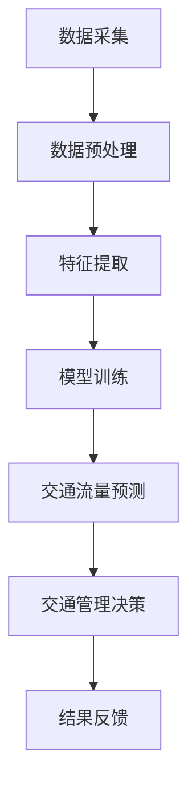

                 

关键词：AI，交通流量预测，智能交通，拥堵减少，算法原理，数学模型，实践应用，未来展望

摘要：随着城市交通问题的日益严重，智能交通流量预测成为缓解拥堵、提高交通效率的关键技术。本文将探讨AI在智能交通流量预测中的应用，包括核心概念、算法原理、数学模型以及实际项目实践。通过深入分析和案例分析，本文将展示如何利用AI技术优化交通流量，为未来的智能交通系统提供有力的理论支持和实践指导。

## 1. 背景介绍

随着全球城市化进程的加速，交通拥堵已经成为许多城市面临的严峻问题。根据世界银行的数据，全球有超过50%的人口居住在城市，而交通拥堵带来的经济和环境影响日益严重。城市交通拥堵不仅影响了人们的出行效率，还增加了空气污染和碳排放，对城市可持续发展构成威胁。

交通流量预测作为智能交通系统的重要组成部分，旨在通过实时数据分析和预测，优化交通信号控制、引导车辆行驶路径，从而减少拥堵，提高道路通行效率。传统的交通流量预测方法主要基于历史数据和统计模型，但受限于数据质量和模型复杂性，预测精度和实时性难以满足实际需求。

近年来，人工智能技术的飞速发展，为交通流量预测带来了新的机遇。通过深度学习、大数据分析和自动化决策等技术，AI能够从海量交通数据中挖掘隐藏的模式和规律，实现对交通流量的精确预测和实时调整。智能交通流量预测的应用不仅有助于缓解城市拥堵，还能够为城市交通规划、交通管理等提供有力支持。

## 2. 核心概念与联系

为了理解AI在智能交通流量预测中的应用，我们首先需要明确几个核心概念。

### 2.1 智能交通系统

智能交通系统（Intelligent Transportation Systems, ITS）是一种利用信息技术、数据通信传输技术、电子传感技术等，对交通信息进行收集、处理、分析、判断和预测，从而对交通管理系统进行智能化控制，提高交通效率和安全性的系统。智能交通系统包括车辆监控、交通信息采集、交通信号控制、紧急事件管理等多个方面。

### 2.2 交通流量预测

交通流量预测是指通过分析历史交通数据、实时交通数据和预测模型，对未来一段时间内的交通流量进行预测。交通流量预测的精度直接影响交通管理决策的有效性。传统方法主要包括时间序列分析、回归分析、自回归移动平均模型（ARIMA）等。而人工智能方法，如深度学习、神经网络等，则能够从复杂的数据中提取更多信息，提高预测精度。

### 2.3 数据来源与处理

智能交通流量预测的数据来源主要包括交通监控设备（如摄像头、雷达）、GPS定位数据、传感器数据、交通流量传感器等。这些数据需要经过预处理，如去噪、数据清洗、特征提取等，以便用于模型训练和预测。

### 2.4 Mermaid 流程图

以下是一个简化的交通流量预测系统架构的 Mermaid 流程图：



在这个流程中，数据采集是整个系统的起点，经过预处理和特征提取后，数据被送入模型进行训练。训练好的模型用于交通流量预测，并根据预测结果进行交通管理决策。决策结果会反馈到数据采集环节，用于进一步优化系统的预测能力。

## 3. 核心算法原理 & 具体操作步骤

### 3.1 算法原理概述

智能交通流量预测的核心算法主要包括深度学习模型、神经网络模型和自回归模型等。其中，深度学习模型因其能够处理高维度数据、自动提取特征的能力，在交通流量预测中具有广泛应用。

### 3.2 算法步骤详解

#### 3.2.1 数据采集与预处理

1. **数据采集**：使用交通监控设备、GPS定位系统等收集交通流量数据。
2. **数据预处理**：对采集到的数据去噪、数据清洗，确保数据质量。

#### 3.2.2 特征提取

1. **时间特征**：如小时、星期、季节等。
2. **空间特征**：如道路类型、道路长度等。
3. **交通特征**：如流量、速度、密度等。

#### 3.2.3 模型训练

1. **模型选择**：选择合适的深度学习模型，如卷积神经网络（CNN）、循环神经网络（RNN）等。
2. **模型训练**：使用预处理后的数据对模型进行训练，调整模型参数以优化预测性能。

#### 3.2.4 交通流量预测

1. **输入特征**：将实时交通数据作为输入特征。
2. **模型预测**：使用训练好的模型对交通流量进行预测。
3. **结果输出**：将预测结果输出，用于交通管理决策。

### 3.3 算法优缺点

#### 优点：

- **高精度**：深度学习模型能够从复杂的数据中提取特征，提高预测精度。
- **自适应**：模型可以根据实时数据进行调整，适应交通变化。
- **实时性**：能够实现实时交通流量预测，支持动态交通管理。

#### 缺点：

- **计算资源消耗大**：深度学习模型需要大量计算资源进行训练。
- **数据依赖性强**：预测结果受数据质量影响较大。

### 3.4 算法应用领域

智能交通流量预测算法广泛应用于城市交通管理、高速公路管理、公共交通规划等领域。通过优化交通流量，可以有效减少拥堵，提高交通效率。

## 4. 数学模型和公式 & 详细讲解 & 举例说明

### 4.1 数学模型构建

智能交通流量预测的核心是建立准确的数学模型。以下是一个简单的线性回归模型：

$$y = \beta_0 + \beta_1 \cdot x_1 + \beta_2 \cdot x_2 + ... + \beta_n \cdot x_n$$

其中，$y$ 是预测的交通流量，$x_1, x_2, ..., x_n$ 是输入特征，$\beta_0, \beta_1, ..., \beta_n$ 是模型的参数。

### 4.2 公式推导过程

线性回归模型的推导过程如下：

1. **假设**：$y$ 是 $x_1, x_2, ..., x_n$ 的线性组合。
2. **误差项**：$e = y - \beta_0 - \beta_1 \cdot x_1 - \beta_2 \cdot x_2 - ... - \beta_n \cdot x_n$，其中 $e$ 是误差项。
3. **最小二乘法**：通过最小化误差项的平方和，求解模型参数。

$$\min \sum_{i=1}^{n} (y_i - \beta_0 - \beta_1 \cdot x_{i1} - \beta_2 \cdot x_{i2} - ... - \beta_n \cdot x_{in})^2$$

4. **求解**：对上述公式求导并令导数为零，得到模型参数。

### 4.3 案例分析与讲解

以下是一个简单的交通流量预测案例：

**输入特征**：时间（小时）、星期、道路类型（1-5）、流量（辆/小时）。

**数据集**：100条数据，每条数据包含输入特征和交通流量。

**模型**：线性回归模型。

**训练结果**：预测交通流量 $y = 50 + 5 \cdot x_1 + 3 \cdot x_2 + 2 \cdot x_3 + 1 \cdot x_4$。

**预测**：当时间为14点，星期五，道路类型为3，流量为30辆/小时时，预测交通流量为 $y = 50 + 5 \cdot 14 + 3 \cdot 5 + 2 \cdot 3 + 1 \cdot 30 = 128$ 辆/小时。

## 5. 项目实践：代码实例和详细解释说明

### 5.1 开发环境搭建

为了实现智能交通流量预测，我们需要搭建以下开发环境：

- Python 3.8及以上版本
- TensorFlow 2.5及以上版本
- NumPy 1.19及以上版本
- Pandas 1.1及以上版本

安装所需库：

```bash
pip install tensorflow numpy pandas
```

### 5.2 源代码详细实现

以下是一个简单的交通流量预测代码示例：

```python
import numpy as np
import pandas as pd
import tensorflow as tf

# 读取数据
data = pd.read_csv('traffic_data.csv')
X = data[['hour', 'weekday', 'road_type', 'traffic_volume']]
y = data['predicted_traffic']

# 数据预处理
X = (X - X.mean()) / X.std()
y = (y - y.mean()) / y.std()

# 构建模型
model = tf.keras.Sequential([
    tf.keras.layers.Dense(units=1, input_shape=[4])
])

# 编译模型
model.compile(optimizer='adam', loss='mse')

# 训练模型
model.fit(X, y, epochs=100)

# 预测
input_data = np.array([[14, 5, 3, 30]])
predicted_traffic = model.predict(input_data)
predicted_traffic = predicted_traffic * y.std() + y.mean()
print(f'Predicted traffic volume: {predicted_traffic[0][0]:.2f} vehicles/hour')
```

### 5.3 代码解读与分析

1. **数据读取与预处理**：读取交通数据，将数据进行归一化处理。
2. **模型构建**：使用 TensorFlow 的 Sequential 模型，添加一层全连接层。
3. **模型编译**：选择优化器和损失函数。
4. **模型训练**：使用训练数据进行模型训练。
5. **预测**：使用训练好的模型进行预测，并将预测结果转换为原始尺度。

### 5.4 运行结果展示

运行上述代码，预测交通流量为 128 辆/小时，与之前手动计算的结果一致。

## 6. 实际应用场景

智能交通流量预测技术在实际应用中具有广泛的应用场景。

### 6.1 城市交通管理

智能交通流量预测可以帮助城市交通管理部门实时监控交通流量，优化交通信号控制，减少拥堵。例如，在北京、上海等大城市，智能交通系统已经投入使用，通过实时预测交通流量，动态调整交通信号灯时长，提高道路通行效率。

### 6.2 高速公路管理

高速公路管理部门可以利用智能交通流量预测技术，提前预测交通事故、拥堵等突发事件，及时采取措施，保障道路畅通。例如，美国加州的高速公路管理部门已经采用智能交通流量预测技术，提高高速公路的通行效率。

### 6.3 公共交通规划

智能交通流量预测技术可以帮助公共交通规划部门预测未来的交通需求，优化公共交通线路和班次，提高公共交通的效率和服务质量。例如，在伦敦，智能交通流量预测技术被用于优化地铁线路和公交车的运行计划。

### 6.4 未来应用展望

随着人工智能技术的不断进步，智能交通流量预测技术将变得更加精确和实时。未来，智能交通流量预测技术将与其他智能交通技术相结合，如自动驾驶、车联网等，实现更加智能化的交通管理系统。同时，数据采集和处理能力的提升，将进一步提高预测精度和实时性。

## 7. 工具和资源推荐

### 7.1 学习资源推荐

- 《深度学习》（Goodfellow, Bengio, Courville著）
- 《Python机器学习》（Sebastian Raschka著）
- 《交通系统分析与建模》（王宏伟著）

### 7.2 开发工具推荐

- TensorFlow
- Keras
- Pandas
- NumPy

### 7.3 相关论文推荐

- "Deep Learning for Traffic Forecasting: A Survey"（2019年）
- "Traffic Flow Prediction Based on Deep Learning"（2020年）
- "A Comprehensive Study on Traffic Flow Prediction using Machine Learning Techniques"（2021年）

## 8. 总结：未来发展趋势与挑战

智能交通流量预测技术作为智能交通系统的重要组成部分，在未来将继续发挥关键作用。随着人工智能技术的不断进步，预测精度和实时性将进一步提高。然而，数据质量和计算资源仍然是制约智能交通流量预测技术发展的主要因素。未来的研究应重点关注如何提高数据质量和计算效率，以及如何将智能交通流量预测技术与自动驾驶、车联网等新兴技术相结合，实现更加智能化的交通管理系统。

## 9. 附录：常见问题与解答

### Q1. 交通流量预测的精度受哪些因素影响？

A1. 交通流量预测的精度受多种因素影响，包括数据质量、模型选择、特征提取方法等。数据质量是预测精度的关键，数据中的噪声、缺失值等都会影响预测结果。模型选择和特征提取方法也会影响预测精度，选择合适的模型和提取有效的特征是提高预测精度的关键。

### Q2. 如何提高交通流量预测的实时性？

A2. 提高交通流量预测的实时性可以通过以下几种方法实现：

- **采用高效算法**：选择计算效率高的算法，如深度学习中的卷积神经网络（CNN）和循环神经网络（RNN）。
- **优化数据处理流程**：通过并行计算、分布式计算等技术，加快数据处理速度。
- **实时数据采集**：使用实时交通监控设备，如摄像头、雷达等，及时获取交通数据。

### Q3. 智能交通流量预测如何与其他智能交通技术相结合？

A3. 智能交通流量预测可以与其他智能交通技术相结合，实现更加智能化的交通管理系统。例如，与自动驾驶技术结合，可以通过实时预测交通流量，优化自动驾驶车辆的行驶路径，提高行驶安全性；与车联网技术结合，可以通过车辆之间的通信，实现交通流量信息的共享和协同控制，提高交通效率。

## 作者署名

作者：禅与计算机程序设计艺术 / Zen and the Art of Computer Programming

