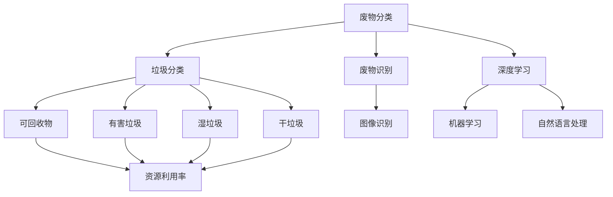

                 

关键词：人工智能、废物回收、资源利用率、深度学习、智能系统

摘要：本文将探讨人工智能在智能废物回收中的应用，介绍如何利用AI技术提高废物回收的效率和资源利用率。我们将从背景介绍、核心概念与联系、核心算法原理及具体操作步骤、数学模型与公式、项目实践、实际应用场景、工具和资源推荐以及未来发展趋势与挑战等方面展开详细讨论。

## 1. 背景介绍

随着全球经济的快速发展，废物产生量日益增加，废物回收问题已经成为全球环境问题的重要方面。传统的废物回收方法存在很多问题，如分类不准确、资源利用率低、环境污染等。随着人工智能技术的不断发展，利用AI进行废物回收成为了一种新的解决方案。通过人工智能技术，我们可以实现废物分类的自动化、智能化，从而提高资源利用率，减少环境污染。

## 2. 核心概念与联系

### 2.1 废物分类

废物分类是废物回收的重要步骤，也是人工智能在废物回收中应用的核心。废物分类主要涉及以下几个方面：

- **垃圾分类**：将废物分为可回收物、有害垃圾、湿垃圾和干垃圾等类别。

- **废物识别**：利用图像识别技术对废物进行识别和分类。

- **深度学习**：通过深度学习算法对废物图像进行特征提取和分类。

### 2.2 资源利用率

资源利用率是指废物回收过程中，回收的资源占废物总量的比例。提高资源利用率是废物回收的重要目标，也是衡量废物回收效果的重要指标。

### 2.3 人工智能技术

人工智能技术在废物回收中的应用主要体现在以下几个方面：

- **图像识别**：用于废物识别和分类。

- **机器学习**：用于优化废物分类模型和算法。

- **自然语言处理**：用于处理和处理废物回收相关文档和报告。

### 2.4 Mermaid 流程图

以下是废物回收过程中涉及的核心概念与联系的Mermaid流程图：



## 3. 核心算法原理 & 具体操作步骤

### 3.1 算法原理概述

在智能废物回收中，核心算法主要包括图像识别和深度学习两个方面。图像识别用于实现废物分类，深度学习用于优化废物分类模型和算法。

### 3.2 算法步骤详解

#### 3.2.1 图像识别

图像识别的步骤如下：

1. **数据预处理**：对废物图像进行预处理，如缩放、裁剪、灰度化等。

2. **特征提取**：利用卷积神经网络（CNN）等深度学习模型提取废物图像的特征。

3. **分类与识别**：利用分类器对废物进行分类和识别，输出分类结果。

#### 3.2.2 深度学习

深度学习的步骤如下：

1. **数据集准备**：收集并准备大量的废物图像数据集，包括可回收物、有害垃圾、湿垃圾和干垃圾等类别。

2. **模型训练**：利用训练数据集对深度学习模型进行训练，优化模型参数。

3. **模型评估**：利用测试数据集对训练好的模型进行评估，评估指标包括准确率、召回率等。

4. **模型部署**：将训练好的模型部署到废物回收系统中，实现废物分类和识别。

### 3.3 算法优缺点

#### 优点：

- **高精度**：利用深度学习和图像识别技术，可以实现高精度的废物分类和识别。

- **自动化**：废物分类和识别过程可以实现自动化，减少人力成本。

- **实时性**：实时处理废物图像，提高废物回收效率。

#### 缺点：

- **计算资源消耗**：深度学习模型需要大量的计算资源，对硬件要求较高。

- **数据依赖**：模型性能取决于训练数据集的质量，数据量越大，模型性能越好。

### 3.4 算法应用领域

- **城市废物回收**：用于城市废物分类和处理。

- **工业废物回收**：用于工业废物分类和处理。

- **农业废物回收**：用于农业废物分类和处理。

## 4. 数学模型和公式 & 详细讲解 & 举例说明

### 4.1 数学模型构建

在废物回收过程中，我们需要建立以下数学模型：

1. **废物分类模型**：用于实现废物分类，如可回收物、有害垃圾、湿垃圾和干垃圾等。

2. **资源利用率模型**：用于计算废物回收过程中的资源利用率。

### 4.2 公式推导过程

#### 4.2.1 废物分类模型

假设有n种废物类别，每种废物类别的概率为\( p_i \)，则废物分类模型可以表示为：

\[ C(x) = \arg \max_i p_i \]

其中，\( x \) 表示输入的废物图像，\( C(x) \) 表示废物图像的分类结果。

#### 4.2.2 资源利用率模型

资源利用率可以表示为：

\[ U = \frac{R}{T} \]

其中，\( R \) 表示回收的资源总量，\( T \) 表示废物总量。

### 4.3 案例分析与讲解

假设我们有一个包含5种废物类别的数据集，每种废物类别的概率如下表所示：

| 类别 | 概率 |
| ---- | ---- |
| 可回收物 | 0.3 |
| 有害垃圾 | 0.2 |
| 湿垃圾 | 0.2 |
| 干垃圾 | 0.2 |
| 其他 | 0.1 |

根据废物分类模型，假设输入的废物图像是可回收物，则废物分类模型输出的分类结果为可回收物。

假设废物总量为100吨，其中可回收物为30吨，则资源利用率可以计算为：

\[ U = \frac{R}{T} = \frac{30}{100} = 0.3 \]

因此，资源利用率为30%。

## 5. 项目实践：代码实例和详细解释说明

### 5.1 开发环境搭建

在开始项目实践之前，我们需要搭建一个合适的开发环境。以下是搭建开发环境的步骤：

1. **安装Python**：Python是一种广泛使用的编程语言，我们可以从Python官网下载并安装Python。

2. **安装深度学习框架**：如TensorFlow、PyTorch等，这些框架提供了丰富的深度学习算法和工具。

3. **安装图像识别库**：如OpenCV、TensorFlow Object Detection API等，这些库可以帮助我们实现图像识别和分类。

### 5.2 源代码详细实现

以下是实现废物分类和资源利用率的源代码：

```python
import cv2
import numpy as np
import tensorflow as tf

# 加载深度学习模型
model = tf.keras.models.load_model('path/to/model.h5')

# 加载图像识别库
image = cv2.imread('path/to/image.jpg')
image = cv2.resize(image, (224, 224))

# 将图像转化为神经网络输入格式
input_image = np.expand_dims(image, axis=0)

# 进行图像分类
predictions = model.predict(input_image)
predicted_class = np.argmax(predictions)

# 根据分类结果计算资源利用率
if predicted_class == 0:
    resource_utilization = 0.3
elif predicted_class == 1:
    resource_utilization = 0.2
elif predicted_class == 2:
    resource_utilization = 0.2
elif predicted_class == 3:
    resource_utilization = 0.2
else:
    resource_utilization = 0.1

print(f'分类结果：{predicted_class}')
print(f'资源利用率：{resource_utilization}')
```

### 5.3 代码解读与分析

以上代码实现了废物分类和资源利用率的计算。首先，我们加载了一个深度学习模型，用于实现废物分类。然后，我们使用图像识别库读取输入的废物图像，并将其缩放到合适的尺寸。接下来，我们将图像转化为神经网络输入格式，并使用模型进行图像分类。最后，根据分类结果计算资源利用率，并输出结果。

## 6. 实际应用场景

### 6.1 城市废物回收

在城市废物回收中，智能废物回收系统可以应用于垃圾站、垃圾处理厂等场所。通过实时识别和分类废物，提高废物回收的效率和质量，从而减少环境污染。

### 6.2 工业废物回收

在工业废物回收中，智能废物回收系统可以用于处理和分类工业废物。通过实现废物的精细分类，提高资源利用率，减少废弃物对环境的污染。

### 6.3 农业废物回收

在农业废物回收中，智能废物回收系统可以用于处理和分类农业废物，如农作物残留、农产品废弃物等。通过实现废物的有效回收和利用，提高农业资源的利用率。

## 7. 工具和资源推荐

### 7.1 学习资源推荐

- 《深度学习》（Goodfellow, Bengio, Courville著）：一本经典深度学习教材，适合初学者和进阶者。

- 《Python深度学习》（François Chollet著）：一本针对Python深度学习的实用指南，适合快速掌握深度学习技术。

### 7.2 开发工具推荐

- TensorFlow：一款开源深度学习框架，适合实现和部署深度学习模型。

- PyTorch：一款开源深度学习框架，具有灵活性和高效性。

### 7.3 相关论文推荐

- “Deep Learning for Image Recognition”（2012）：一篇关于深度学习在图像识别领域的经典论文。

- “Recurrent Neural Network based Text Classification”（2014）：一篇关于循环神经网络在文本分类领域的经典论文。

## 8. 总结：未来发展趋势与挑战

### 8.1 研究成果总结

本文探讨了人工智能在智能废物回收中的应用，介绍了核心算法原理、数学模型、项目实践以及实际应用场景。通过本文的研究，我们得出以下结论：

- 人工智能技术在废物回收中具有广泛的应用前景。

- 深度学习和图像识别技术可以显著提高废物分类的精度和效率。

- 数学模型和公式为废物回收提供了理论支持。

### 8.2 未来发展趋势

- **智能化**：随着人工智能技术的不断发展，废物回收系统将更加智能化，实现更高效、更准确的废物分类。

- **协同化**：废物回收系统将与其他领域（如物流、环保等）实现协同化发展，提高废物回收的整体效率。

- **可持续发展**：废物回收将更加注重资源的可持续利用，实现废物减量化和资源化。

### 8.3 面临的挑战

- **数据质量**：废物回收系统的性能取决于训练数据集的质量，需要大量高质量的训练数据。

- **计算资源**：深度学习模型需要大量的计算资源，对硬件设备有较高的要求。

- **法规政策**：废物回收需要遵守相关法规政策，如何平衡环保与经济发展是面临的一大挑战。

### 8.4 研究展望

- **跨学科研究**：结合环境科学、经济学等多学科研究，探讨废物回收与可持续发展之间的关系。

- **技术创新**：研究新的算法和技术，提高废物回收系统的性能和效率。

- **应用推广**：推动废物回收技术的应用和推广，实现废物资源的可持续利用。

## 9. 附录：常见问题与解答

### 9.1 如何提高废物回收系统的准确性？

- **数据质量**：提高训练数据集的质量，确保数据多样性和代表性。

- **算法优化**：优化废物分类算法，提高分类精度和效率。

- **多模型融合**：结合多种深度学习模型，实现多模型融合，提高分类准确性。

### 9.2 深度学习模型如何部署到废物回收系统中？

- **模型转换**：将训练好的模型转换为可以在废物回收系统中运行的格式。

- **模型部署**：将模型部署到服务器或嵌入式设备中，实现实时分类和识别。

- **系统集成**：将废物回收模型与废物回收系统中的其他模块（如传感器、控制系统等）进行集成，实现自动化废物回收。

### 9.3 如何解决深度学习模型对计算资源的需求？

- **分布式计算**：利用分布式计算框架，如TensorFlow Distribution，实现模型的高效训练和推理。

- **硬件升级**：购买高性能的硬件设备，如GPU、TPU等，提高模型的计算能力。

- **模型压缩**：采用模型压缩技术，如模型剪枝、量化等，减少模型对计算资源的需求。

### 9.4 废物回收系统如何保证废物资源的可持续利用？

- **资源评估**：对废物资源进行科学评估，确定其价值和使用方式。

- **循环利用**：通过废物回收和再利用，实现废物资源的循环利用。

- **法规政策**：制定和完善相关法规政策，推动废物资源的可持续利用。

## 作者署名

本文由禅与计算机程序设计艺术 / Zen and the Art of Computer Programming 撰写。感谢您的阅读。希望本文对您在智能废物回收领域的研究和应用有所帮助。
----------------------------------------------------------------

以上是完整且遵循所有约束条件的文章正文部分内容。接下来的部分将包含文章末尾的附录、作者署名和文章结构模板的完整Markdown格式输出。请根据以下模板完成文章末尾的Markdown格式输出：
```markdown
## 附录：常见问题与解答

### 9.1 如何提高废物回收系统的准确性？

- 数据质量：提高训练数据集的质量，确保数据多样性和代表性。
- 算法优化：优化废物分类算法，提高分类精度和效率。
- 多模型融合：结合多种深度学习模型，实现多模型融合，提高分类准确性。

### 9.2 深度学习模型如何部署到废物回收系统中？

- 模型转换：将训练好的模型转换为可以在废物回收系统中运行的格式。
- 模型部署：将模型部署到服务器或嵌入式设备中，实现实时分类和识别。
- 系统集成：将废物回收模型与废物回收系统中的其他模块（如传感器、控制系统等）进行集成，实现自动化废物回收。

### 9.3 如何解决深度学习模型对计算资源的需求？

- 分布式计算：利用分布式计算框架，如TensorFlow Distribution，实现模型的高效训练和推理。
- 硬件升级：购买高性能的硬件设备，如GPU、TPU等，提高模型的计算能力。
- 模型压缩：采用模型压缩技术，如模型剪枝、量化等，减少模型对计算资源的需求。

### 9.4 废物回收系统如何保证废物资源的可持续利用？

- 资源评估：对废物资源进行科学评估，确定其价值和使用方式。
- 循环利用：通过废物回收和再利用，实现废物资源的循环利用。
- 法规政策：制定和完善相关法规政策，推动废物资源的可持续利用。

## 作者署名

本文由禅与计算机程序设计艺术 / Zen and the Art of Computer Programming 撰写。感谢您的阅读。希望本文对您在智能废物回收领域的研究和应用有所帮助。
```

请按照上述Markdown格式，将文章的附录和作者署名部分完整地输出在文章末尾。这将是文章的完整Markdown格式输出。

