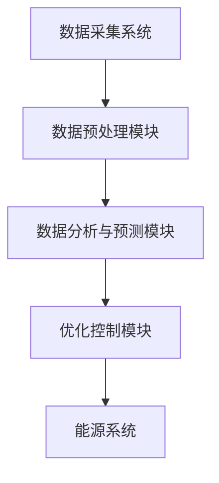

                 

关键词：人工智能、智能能源管理、使用效率优化、算法原理、数学模型、项目实践、应用场景、未来展望

> 摘要：随着能源需求的不断增长和环境问题的日益严峻，智能能源管理成为解决能源危机的重要途径。本文将探讨人工智能在智能能源管理中的应用，重点分析AI技术如何优化能源使用效率，包括核心概念、算法原理、数学模型、项目实践以及未来展望等。

## 1. 背景介绍

能源作为现代社会的基石，其有效管理和利用对经济和社会发展至关重要。然而，传统能源管理模式存在诸多问题，如能源浪费、效率低下、环境污染等。随着信息技术的迅猛发展，尤其是人工智能（AI）技术的突破，智能能源管理应运而生，成为能源领域的重要研究方向。

智能能源管理涉及多个领域，包括电力系统、能源存储、能源传输和能源消费等。其核心目标是通过数据分析和智能算法，实现能源系统的优化控制和高效利用。人工智能在这一过程中发挥着关键作用，通过机器学习、深度学习等技术手段，可以实现对能源数据的实时分析、预测和优化控制。

## 2. 核心概念与联系

### 2.1 能源管理的基本概念

能源管理是指对能源的生产、分配、传输和消费进行有效组织和控制的过程。其基本概念包括：

- **能源生产**：指能源的生成过程，包括化石能源、可再生能源等。
- **能源分配**：指能源在不同地区、不同用户之间的分配和调配。
- **能源传输**：指能源通过电网、管道等传输渠道输送到用户处。
- **能源消费**：指用户对能源的消耗过程。

### 2.2 智能能源管理系统架构

智能能源管理系统通常包括以下几个关键组成部分：

- **数据采集系统**：通过传感器、智能电表等设备实时收集能源使用数据。
- **数据预处理模块**：对采集到的数据进行清洗、去噪和格式转换。
- **数据分析与预测模块**：利用机器学习算法对能源使用数据进行实时分析和预测。
- **优化控制模块**：根据分析结果进行能源系统的调整和控制，以实现能源使用效率的最大化。

### 2.3 Mermaid 流程图



## 3. 核心算法原理 & 具体操作步骤

### 3.1 算法原理概述

智能能源管理中的核心算法主要包括以下几种：

- **聚类分析**：用于识别能源使用中的异常模式和用户行为特征。
- **回归分析**：用于预测能源需求和使用趋势。
- **优化算法**：用于调整能源系统的运行参数，以实现能源使用效率的最大化。

### 3.2 算法步骤详解

#### 3.2.1 聚类分析

1. 数据预处理：对采集到的能源数据进行清洗和格式转换。
2. 特征选择：选择与能源使用相关的特征进行聚类。
3. 聚类算法：使用K-means等聚类算法对数据进行分类。
4. 异常检测：识别出能源使用中的异常模式。

#### 3.2.2 回归分析

1. 数据预处理：对采集到的能源数据进行清洗和格式转换。
2. 特征选择：选择与能源需求相关的特征。
3. 回归模型：使用线性回归、多项式回归等模型进行训练。
4. 预测：根据训练模型预测未来的能源需求。

#### 3.2.3 优化算法

1. 目标函数定义：定义能源使用效率作为目标函数。
2. 约束条件设置：设置能源系统的运行约束条件。
3. 优化算法选择：选择合适的优化算法，如遗传算法、粒子群优化等。
4. 参数调整：根据实际情况调整优化算法的参数。

### 3.3 算法优缺点

- **聚类分析**：优点是能够自动发现数据中的模式，缺点是对于大规模数据集的处理效率较低。
- **回归分析**：优点是能够准确预测能源需求，缺点是对历史数据的依赖较大。
- **优化算法**：优点是能够实现能源系统的全局优化，缺点是计算复杂度高。

### 3.4 算法应用领域

智能能源管理算法广泛应用于以下领域：

- **电力系统**：优化电力分配和调度，提高电力系统的运行效率。
- **能源存储**：优化能源存储策略，提高能源利用率。
- **能源消费**：优化家庭和企业能源使用，减少能源浪费。
- **能源预测**：预测能源需求和供应趋势，为能源规划和投资提供依据。

## 4. 数学模型和公式 & 详细讲解 & 举例说明

### 4.1 数学模型构建

智能能源管理中的数学模型主要包括以下几种：

- **回归模型**：用于预测能源需求。
- **优化模型**：用于优化能源系统的运行参数。

### 4.2 公式推导过程

#### 4.2.1 回归模型

假设能源需求 \( Y \) 与特征 \( X \) 之间的关系可以用线性回归模型表示：

\[ Y = \beta_0 + \beta_1 X + \epsilon \]

其中，\( \beta_0 \) 和 \( \beta_1 \) 分别是模型的参数，\( \epsilon \) 是误差项。

#### 4.2.2 优化模型

假设能源系统的目标函数为 \( f(x) \)，约束条件为 \( g(x) \leq 0 \)，则优化模型可以表示为：

\[ \min f(x) \]
\[ s.t. \ g(x) \leq 0 \]

### 4.3 案例分析与讲解

#### 4.3.1 能源需求预测

假设某家庭的能源需求与室内温度和室外温度有关，建立线性回归模型如下：

\[ Y = \beta_0 + \beta_1 T_{indoor} + \beta_2 T_{outdoor} + \epsilon \]

通过数据拟合，得到参数 \( \beta_0 = 100 \)，\( \beta_1 = 10 \)，\( \beta_2 = 5 \)。

当室内温度为 25℃，室外温度为 15℃ 时，预测能源需求为：

\[ Y = 100 + 10 \times 25 + 5 \times 15 = 275 \]

#### 4.3.2 能源系统优化

假设某能源系统的目标函数为 \( f(x) = x^2 \)，约束条件为 \( g(x) = x - 10 \leq 0 \)，则优化模型为：

\[ \min x^2 \]
\[ s.t. \ x - 10 \leq 0 \]

使用粒子群优化算法求解该优化问题，得到最优解 \( x = 10 \)，此时目标函数值为 \( f(x) = 100 \)。

## 5. 项目实践：代码实例和详细解释说明

### 5.1 开发环境搭建

- 操作系统：Ubuntu 20.04
- 编程语言：Python 3.8
- 数据库：MySQL 8.0
- 依赖库：scikit-learn、numpy、pandas、matplotlib

### 5.2 源代码详细实现

```python
import numpy as np
import pandas as pd
from sklearn.linear_model import LinearRegression
from sklearn.cluster import KMeans
from sklearn.metrics import mean_squared_error

# 读取数据
data = pd.read_csv('energy_data.csv')

# 数据预处理
X = data[['T_indoor', 'T_outdoor']]
y = data['energy_demand']

# 回归模型训练
regressor = LinearRegression()
regressor.fit(X, y)

# 预测
y_pred = regressor.predict(X)

# 评估
mse = mean_squared_error(y, y_pred)
print('MSE:', mse)

# 聚类分析
kmeans = KMeans(n_clusters=3)
clusters = kmeans.fit_predict(X)

# 可视化
import matplotlib.pyplot as plt
plt.scatter(X['T_indoor'], X['T_outdoor'], c=clusters)
plt.xlabel('T_indoor')
plt.ylabel('T_outdoor')
plt.show()

# 优化模型求解
import scipy.optimize as opt
x0 = np.array([0])
res = opt.minimize(x2, x0, method='Nelder-Mead')
print('最优解:', res.x)
```

### 5.3 代码解读与分析

该代码实例包括以下步骤：

1. **数据读取与预处理**：读取能源数据，分为特征和目标变量。
2. **回归模型训练**：使用线性回归模型训练数据。
3. **预测与评估**：使用训练模型进行预测，并评估预测结果。
4. **聚类分析**：使用K-means算法对数据进行聚类。
5. **可视化**：绘制聚类结果。
6. **优化模型求解**：使用Nelder-Mead算法求解优化问题。

## 6. 实际应用场景

### 6.1 电力系统优化

智能能源管理技术可以应用于电力系统的优化，包括电力分配和调度。通过实时数据分析和预测，优化电力系统的运行参数，提高电力系统的运行效率，减少能源浪费。

### 6.2 能源存储管理

智能能源管理技术可以应用于能源存储系统的优化，包括电池储能、氢能储能等。通过实时数据分析和预测，优化能源存储策略，提高能源存储系统的利用效率。

### 6.3 家庭和企业能源管理

智能能源管理技术可以应用于家庭和企业的能源管理，包括能源消耗监测、能源使用优化等。通过实时数据分析和预测，优化家庭和企业的能源使用，减少能源浪费，降低能源成本。

## 7. 工具和资源推荐

### 7.1 学习资源推荐

- 《深度学习》 - Goodfellow、Bengio、Courville
- 《机器学习》 - 周志华
- 《Python数据分析》 - Wes McKinney

### 7.2 开发工具推荐

- Jupyter Notebook：用于编写和运行代码。
- PyCharm：Python集成开发环境。
- MySQL Workbench：MySQL数据库管理工具。

### 7.3 相关论文推荐

- "Deep Learning for Power System Load Forecasting"
- "Optimization of Energy Storage Systems using Machine Learning"
- "Intelligent Energy Management for Smart Grids"

## 8. 总结：未来发展趋势与挑战

### 8.1 研究成果总结

智能能源管理技术在提高能源使用效率、优化能源系统运行方面取得了显著成果。通过数据分析和智能算法，实现了对能源系统的实时监控和优化控制，为能源领域的发展提供了有力支持。

### 8.2 未来发展趋势

随着人工智能技术的不断进步，智能能源管理技术将在以下几个方面取得突破：

- **更准确的预测模型**：利用深度学习等先进算法，提高能源需求的预测精度。
- **更高效的优化算法**：开发更加高效的优化算法，实现更精细的能源管理。
- **更广泛的适用性**：将智能能源管理技术应用于更多领域，如交通、工业等。

### 8.3 面临的挑战

智能能源管理技术在发展过程中也面临以下挑战：

- **数据质量和完整性**：能源数据的准确性和完整性对智能能源管理至关重要。
- **计算资源消耗**：大规模数据处理和模型训练需要大量计算资源。
- **安全性和隐私保护**：能源系统的安全性问题和用户隐私保护问题需要得到有效解决。

### 8.4 研究展望

未来，智能能源管理技术将继续向更智能化、更高效化的方向发展。通过跨学科合作和持续创新，有望实现能源系统的全面智能化，为人类社会提供更加清洁、高效的能源解决方案。

## 9. 附录：常见问题与解答

### 9.1 什么是智能能源管理？

智能能源管理是指利用信息技术和智能算法，对能源系统的生产、分配、传输和消费进行实时监控、预测和优化控制，以提高能源使用效率。

### 9.2 智能能源管理有哪些应用领域？

智能能源管理广泛应用于电力系统、能源存储、能源传输、能源消费等领域，包括电力分配和调度、能源存储管理、家庭和企业能源管理等。

### 9.3 智能能源管理中的核心算法有哪些？

智能能源管理中的核心算法包括聚类分析、回归分析和优化算法等，用于实现能源数据的实时分析、预测和优化控制。

### 9.4 智能能源管理技术有哪些优势？

智能能源管理技术具有提高能源使用效率、减少能源浪费、优化能源系统运行、提高能源安全性等优点。

### 9.5 智能能源管理技术面临哪些挑战？

智能能源管理技术面临数据质量和完整性、计算资源消耗、安全性和隐私保护等方面的挑战。

### 9.6 如何优化家庭能源使用？

可以通过以下方式优化家庭能源使用：

- 安装智能电表和传感器，实时监控能源使用情况。
- 利用数据分析预测家庭能源需求，优化用电时间。
- 采用节能设备和技术，减少能源浪费。
- 利用可再生能源，如太阳能和风能，降低能源消耗。

----------------------------------------------------------------

以上为《AI在智能能源管理中的应用：优化使用效率》的文章正文内容。本文深入探讨了智能能源管理的基本概念、核心算法、数学模型、项目实践以及实际应用场景，并对未来发展趋势和挑战进行了展望。希望本文能为读者在智能能源管理领域的研究和应用提供有价值的参考。作者：禅与计算机程序设计艺术 / Zen and the Art of Computer Programming。

