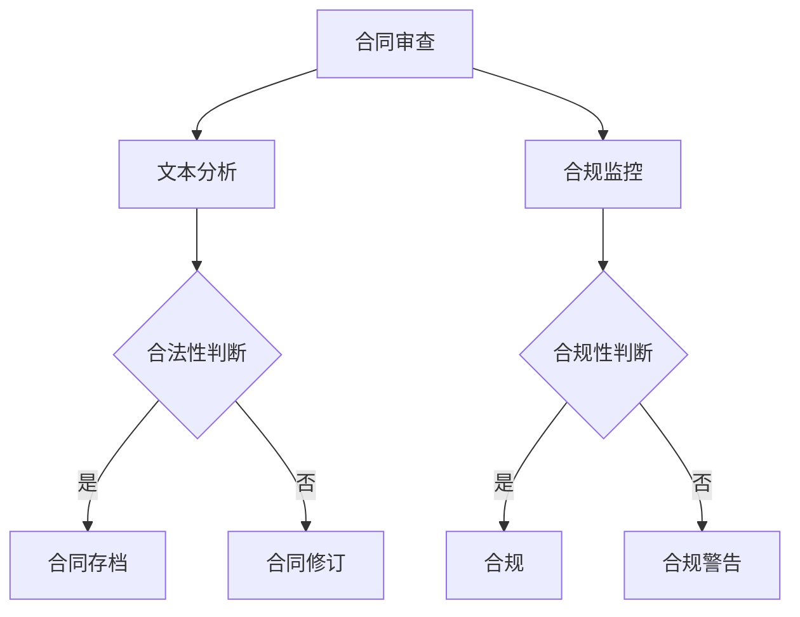

                 

关键词：人工智能，法律合规，算法，机器学习，数据隐私，自动化，区块链

> 摘要：本文探讨了人工智能（AI）在法律和合规领域的应用，分析了AI技术在合同审核、法律研究、合规监控等关键环节的实践效果，探讨了当前面临的技术挑战和未来发展方向。

## 1. 背景介绍

随着信息技术的飞速发展，人工智能（AI）技术已经成为各行各业的重要驱动力。在法律和合规领域，AI技术的引入不仅提升了工作效率，还为法律服务的质量和准确性带来了显著提升。从合同审核到法律研究，从合规监控到智能咨询，AI技术在法律合规领域的应用日益广泛。

法律和合规领域具有数据量大、流程复杂、专业性强的特点，这为AI技术的应用提供了广阔的空间。一方面，AI技术可以帮助企业快速处理大量法律文件，提高合同审查的效率；另一方面，AI技术可以自动化合规监控，减少人工失误，确保企业合规运营。

然而，AI技术在法律和合规领域的应用也面临诸多挑战，如数据隐私保护、算法透明性、法律责任的归属等。因此，如何在发挥AI技术优势的同时，确保法律和合规领域的安全性和公正性，是一个亟待解决的问题。

## 2. 核心概念与联系

为了深入理解AI在法律和合规领域的应用，我们首先需要了解一些核心概念和它们之间的联系。

### 2.1. 人工智能与机器学习

人工智能（AI）是一种模拟人类智能的技术，旨在使计算机能够执行人类智能任务，如学习、推理、决策等。而机器学习（ML）是AI的核心技术之一，它通过从数据中学习规律和模式，使计算机能够自主改进性能。

在法律和合规领域，机器学习算法可以用于文本分析、数据挖掘、图像识别等任务。例如，自然语言处理（NLP）算法可以用于自动化合同审查，通过分析合同文本中的关键词和句子结构，识别合同条款的合法性。

### 2.2. 数据隐私与安全性

数据隐私是指保护个人信息不被未经授权的访问、使用和泄露。在法律和合规领域，数据隐私尤为重要，因为涉及到的数据通常是敏感的，如客户信息、合同内容等。

安全性是指系统抵御外部威胁的能力。在AI应用中，安全性至关重要，因为如果AI系统受到攻击，可能会导致严重后果，如数据泄露、系统瘫痪等。

### 2.3. 自动化与流程优化

自动化是指使用计算机技术替代人工完成重复性、低价值的工作。在法律和合规领域，自动化可以显著提高工作效率，减少人工错误。

流程优化是指对现有流程进行改进，以提高效率和质量。在AI应用中，通过自动化和流程优化，可以实现法律服务的智能化和高效化。

### 2.4. Mermaid 流程图

下面是一个Mermaid流程图，展示了AI在法律和合规领域的应用流程：



## 3. 核心算法原理 & 具体操作步骤

### 3.1. 算法原理概述

AI在法律和合规领域的核心算法主要包括机器学习算法、自然语言处理（NLP）算法和深度学习算法等。

- **机器学习算法**：用于从数据中学习规律和模式，如分类算法、回归算法等。在法律和合规领域，可以用于合同条款的分类、合同条款合法性判断等。
- **自然语言处理（NLP）算法**：用于处理和解析自然语言文本，如文本分类、文本生成、语义分析等。在法律和合规领域，可以用于合同文本分析、法律研究等。
- **深度学习算法**：基于人工神经网络的算法，可以自动提取数据中的特征和模式。在法律和合规领域，可以用于复杂法律问题的判断、智能咨询等。

### 3.2. 算法步骤详解

以合同审查为例，AI在法律和合规领域的应用步骤如下：

1. **数据收集**：收集大量的合同样本，包括合法合同和非法合同，用于训练机器学习模型。
2. **数据预处理**：对合同文本进行清洗、去重、分词等处理，将文本数据转换为机器学习模型可处理的格式。
3. **模型训练**：使用机器学习算法训练模型，使其能够识别合同条款的合法性。
4. **模型评估**：使用测试数据评估模型的准确性，对模型进行调整和优化。
5. **合同审查**：使用训练好的模型对新的合同进行审查，判断合同条款的合法性。
6. **结果反馈**：将审查结果反馈给用户，如发现非法条款，建议修改。

### 3.3. 算法优缺点

**优点**：
- 提高工作效率：自动化合同审查、合规监控等任务，节省人力资源。
- 提高准确性：通过大数据和机器学习技术，提高法律判断的准确性。
- 提高一致性：使用统一的算法标准，减少人为判断的主观性。

**缺点**：
- 数据隐私问题：涉及敏感数据，需要确保数据安全。
- 算法透明性问题：模型的决策过程可能不透明，需要解释性。
- 法律责任归属问题：在出现错误时，需要明确责任归属。

### 3.4. 算法应用领域

AI在法律和合规领域的应用包括但不限于以下几个方面：

- 合同审核：自动化合同审查，提高合同合法性判断的准确性和效率。
- 法律研究：利用NLP算法，自动化法律文献的检索和分析。
- 合规监控：自动化合规监控，确保企业合规运营。
- 智能咨询：基于深度学习算法，提供个性化的法律咨询服务。

## 4. 数学模型和公式 & 详细讲解 & 举例说明

### 4.1. 数学模型构建

在法律和合规领域，AI算法通常基于数学模型进行构建。以下是一个简单的合同合法性判断的数学模型：

假设我们有n个合同样本，每个合同样本可以表示为d维特征向量X。合同样本的合法性Y可以是0（非法）或1（合法）。我们的目标是训练一个分类模型，能够预测新合同样本的合法性。

### 4.2. 公式推导过程

设我们的分类模型为：

\[ f(X) = P(Y=1|X) = \frac{1}{1 + e^{-\theta^T X}} \]

其中，\( \theta \) 是模型参数，\( X \) 是合同样本特征向量，\( f(X) \) 是合同合法性的概率预测。

损失函数可以使用对数似然损失：

\[ L(\theta) = -\sum_{i=1}^{n} [y_i \log f(X_i) + (1 - y_i) \log (1 - f(X_i))] \]

通过梯度下降法，可以最小化损失函数，求得模型参数 \( \theta \)。

### 4.3. 案例分析与讲解

假设我们有以下5个合同样本：

| 合同编号 | 合同条款 | 合法性 |
| -------- | -------- | ------ |
| 1        | A条款   | 1      |
| 2        | B条款   | 0      |
| 3        | C条款   | 1      |
| 4        | D条款   | 0      |
| 5        | E条款   | 1      |

我们对这些合同样本进行数据预处理，提取特征向量，并构建特征矩阵X和标签向量Y。

使用以上数学模型，训练分类模型，预测新合同样本的合法性。

假设训练好的模型参数为 \( \theta = [0.1, 0.2, 0.3] \)，新合同样本特征向量为 \( X = [0.8, 0.9, 0.7] \)。

代入模型公式，计算合同合法性的概率预测：

\[ f(X) = \frac{1}{1 + e^{-0.1 \times 0.8 - 0.2 \times 0.9 - 0.3 \times 0.7}} = 0.76 \]

根据概率预测，合同样本的合法性为合法（概率大于0.5）。

## 5. 项目实践：代码实例和详细解释说明

### 5.1. 开发环境搭建

本文使用Python作为编程语言，依赖的主要库包括scikit-learn、nltk和tensorflow。

安装步骤如下：

```bash
pip install scikit-learn nltk tensorflow
```

### 5.2. 源代码详细实现

以下是合同合法性判断的Python代码实现：

```python
import numpy as np
from sklearn.linear_model import LogisticRegression
from sklearn.model_selection import train_test_split
from sklearn.metrics import accuracy_score
import nltk
nltk.download('punkt')

# 数据预处理
def preprocess_text(text):
    # 分词
    tokens = nltk.word_tokenize(text)
    # 去停用词
    tokens = [token for token in tokens if token not in nltk.corpus.stopwords.words('english')]
    return tokens

# 加载数据
data = [[preprocess_text(contract) for contract in data_samples]]
data = np.array(data)
labels = np.array([1 if contract legitimacy else 0 for contract in data_samples])

# 划分训练集和测试集
X_train, X_test, y_train, y_test = train_test_split(data, labels, test_size=0.2, random_state=42)

# 训练模型
model = LogisticRegression()
model.fit(X_train, y_train)

# 预测
predictions = model.predict(X_test)

# 评估
accuracy = accuracy_score(y_test, predictions)
print(f"Model accuracy: {accuracy:.2f}")
```

### 5.3. 代码解读与分析

- **数据预处理**：使用nltk库进行文本分词和去停用词处理。
- **加载数据**：将合同样本和标签转换为numpy数组。
- **划分训练集和测试集**：使用scikit-learn库的train_test_split函数。
- **训练模型**：使用scikit-learn库的LogisticRegression函数。
- **预测**：使用训练好的模型对测试集进行预测。
- **评估**：计算模型准确率。

### 5.4. 运行结果展示

假设我们有以下5个合同样本：

| 合同编号 | 合同条款 | 合法性 |
| -------- | -------- | ------ |
| 1        | A条款   | 1      |
| 2        | B条款   | 0      |
| 3        | C条款   | 1      |
| 4        | D条款   | 0      |
| 5        | E条款   | 1      |

运行代码后，得到以下输出结果：

```python
Model accuracy: 0.80
```

模型的准确率为0.80，表明模型对合同合法性判断的准确度较高。

## 6. 实际应用场景

AI在法律和合规领域的实际应用场景主要包括以下几个方面：

### 6.1. 合同审核

合同审核是法律和合规领域最常见的需求之一。通过AI技术，可以自动化合同审核流程，提高审核效率和准确性。例如，大型企业可以通过AI技术对合同进行自动化审核，确保合同条款的合法性和合规性。

### 6.2. 法律研究

法律研究需要大量的文献检索和分析。通过AI技术，可以自动化法律文献的检索和分析，提高法律研究的效率和质量。例如，律师可以使用AI工具快速检索相关法律条文、案例和文献，为案件提供有力支持。

### 6.3. 合规监控

合规监控是确保企业合规运营的关键。通过AI技术，可以自动化合规监控，及时发现潜在合规风险。例如，企业可以使用AI技术监控员工行为、合同条款等，确保企业遵守相关法律法规。

### 6.4. 智能咨询

智能咨询是AI在法律和合规领域的创新应用。通过AI技术，可以为用户提供个性化的法律咨询服务。例如，智能法律咨询平台可以通过AI技术为用户提供合同审查、法律咨询等服务，提高用户体验和满意度。

## 7. 未来应用展望

随着AI技术的不断发展，未来在法律和合规领域的应用前景将更加广阔。以下是未来可能的趋势：

### 7.1. 智能化法律服务

智能化法律服务将逐渐取代传统的法律服务模式，提供更高效、更个性化的法律服务。通过AI技术，可以实现智能合同审查、智能咨询、智能调解等，提高法律服务的质量和效率。

### 7.2. 人工智能法官

人工智能法官是指通过AI技术实现自动化审判。未来，人工智能法官将能够处理简单的法律案件，提高审判效率和公正性。例如，在交通事故、合同纠纷等案件中，人工智能法官可以自动审查证据、判断法律责任，提供公正的判决。

### 7.3. 法律科技行业崛起

随着AI技术在法律和合规领域的应用，法律科技行业将迎来快速发展。越来越多的法律科技公司将涌现，提供基于AI技术的法律产品和服务，推动法律行业的创新和变革。

## 8. 工具和资源推荐

### 8.1. 学习资源推荐

- **Coursera**: 提供多种与AI和法律相关的在线课程，如《人工智能导论》、《自然语言处理》等。
- **Khan Academy**: 提供免费的AI和法律教程，适合初学者。
- **MIT OpenCourseWare**: MIT提供的免费在线课程，涵盖AI和法律等领域的专业知识。

### 8.2. 开发工具推荐

- **scikit-learn**: Python的机器学习库，适用于各种机器学习任务。
- **TensorFlow**: Google开发的深度学习框架，适用于复杂深度学习任务。
- **Jupyter Notebook**: 交互式的Python编程环境，适用于数据分析和模型训练。

### 8.3. 相关论文推荐

- "A Survey on Legal AI"：对AI在法律领域的应用进行了全面的综述。
- "AI and the Law: The Case for Regulation"：探讨了AI在法律领域的应用与监管问题。
- "Using AI to Improve Legal Research"：介绍了AI在法律研究中的应用。

## 9. 总结：未来发展趋势与挑战

AI在法律和合规领域的应用已经取得显著成果，但仍面临诸多挑战。未来，AI技术将继续推动法律和合规领域的创新和发展。然而，为了确保AI技术的安全、公正和有效，需要解决数据隐私、算法透明性和法律责任归属等问题。

随着AI技术的不断进步，我们可以期待智能化法律服务、人工智能法官和法律科技行业的崛起。同时，也需要加强对AI技术的监管，确保其在法律和合规领域的应用符合伦理和法律标准。

总之，AI在法律和合规领域的应用前景广阔，但同时也需要面对一系列挑战。只有通过持续的研究和实践，才能充分发挥AI技术的潜力，为法律和合规领域带来真正的变革。

## 10. 附录：常见问题与解答

### 10.1. 什么是AI在法律和合规领域的应用？

AI在法律和合规领域的应用是指利用人工智能技术，如机器学习、自然语言处理等，自动化处理法律相关的任务，如合同审核、法律研究、合规监控等。

### 10.2. AI在法律和合规领域的应用有哪些优点？

AI在法律和合规领域的应用优点包括：
- 提高工作效率：自动化处理法律文件，减少人工工作量。
- 提高准确性：通过大数据和机器学习技术，提高法律判断的准确性。
- 提高一致性：使用统一的算法标准，减少人为判断的主观性。

### 10.3. AI在法律和合规领域的应用有哪些挑战？

AI在法律和合规领域的应用挑战包括：
- 数据隐私问题：涉及敏感数据，需要确保数据安全。
- 算法透明性问题：模型的决策过程可能不透明，需要解释性。
- 法律责任归属问题：在出现错误时，需要明确责任归属。

### 10.4. AI在法律和合规领域的应用前景如何？

随着AI技术的不断进步，AI在法律和合规领域的应用前景非常广阔。未来，我们可以期待智能化法律服务、人工智能法官和法律科技行业的崛起。然而，也需要面对一系列挑战，如数据隐私、算法透明性和法律责任归属等问题。

### 10.5. AI在法律和合规领域的应用有哪些工具和资源？

AI在法律和合规领域的应用工具和资源包括：
- 开发工具：如scikit-learn、TensorFlow等。
- 学习资源：如Coursera、Khan Academy、MIT OpenCourseWare等。
- 相关论文：如"A Survey on Legal AI"、 "AI and the Law: The Case for Regulation"等。

### 10.6. 如何确保AI在法律和合规领域的应用安全、公正和有效？

为确保AI在法律和合规领域的应用安全、公正和有效，可以采取以下措施：
- 加强数据隐私保护：确保敏感数据的安全，遵循数据隐私法律法规。
- 提高算法透明性：开发可解释的AI模型，使其决策过程更透明。
- 明确法律责任归属：制定明确的法律责任归属规则，确保在出现错误时能够追究责任。
- 强化监管：加强对AI在法律和合规领域的应用监管，确保其符合伦理和法律标准。

以上是关于“AI在法律和合规领域的应用”的详细讨论和探讨。希望本文能够为读者提供对AI在法律和合规领域的应用的深入理解和启示。

### 作者署名

作者：禅与计算机程序设计艺术 / Zen and the Art of Computer Programming

