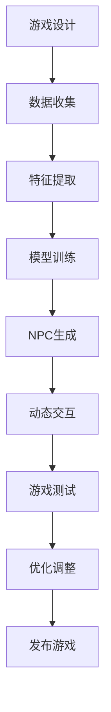

                 

关键词：AI，游戏开发，NPC，程序化生成，自然语言处理，机器学习，游戏引擎

> 摘要：本文将探讨人工智能（AI）在游戏开发中的应用，特别是NPC（非玩家角色）的程序化生成和动态交互。通过介绍核心概念、算法原理、数学模型以及实际项目实践，我们将深入分析AI如何提高游戏开发的效率和质量，并探讨其未来的发展趋势与挑战。

## 1. 背景介绍

随着计算机技术和人工智能的快速发展，游戏产业已经成为全球增长最快的娱乐行业之一。游戏开发者不断追求创新和个性化的游戏体验，以满足玩家的多样化需求。然而，传统的游戏开发方式依赖于大量的手工设计和脚本编写，不仅耗时耗力，而且难以实现高度复杂的动态交互和个性化体验。为了克服这些限制，人工智能（AI）技术在游戏开发中得到了广泛应用。

AI在游戏开发中的应用主要包括NPC生成和交互、游戏地图和关卡生成、玩家行为预测和个性化推荐等。其中，NPC的生成和交互是AI在游戏开发中最为重要的应用之一。NPC作为游戏世界中的重要组成部分，它们的行为、对话和互动对于游戏世界的真实感和沉浸感至关重要。传统的NPC设计依赖于预定义的脚本和规则，而AI技术能够通过学习玩家行为和游戏环境，自动生成具有高度个性化和动态交互的NPC。

本文将重点讨论NPC的程序化生成和动态交互，以及AI在游戏开发中的其他应用。我们将介绍核心概念、算法原理、数学模型，并通过实际项目实践来展示AI技术在游戏开发中的应用效果。最后，我们将探讨AI在游戏开发中的未来发展趋势和面临的挑战。

## 2. 核心概念与联系

### 2.1 AI在游戏开发中的应用

AI在游戏开发中的应用可以分为多个方面，包括NPC生成和交互、游戏地图和关卡生成、玩家行为预测和个性化推荐等。以下是这些应用的核心概念和联系：

#### 2.1.1 NPC生成和交互

NPC生成和交互是AI在游戏开发中最广泛的应用之一。NPC作为游戏世界中的重要角色，它们的个性和行为对于游戏世界的真实感和沉浸感至关重要。AI技术可以通过机器学习和自然语言处理等技术，自动生成具有高度个性化和动态交互的NPC。

#### 2.1.2 游戏地图和关卡生成

游戏地图和关卡生成是AI在游戏开发中的另一个重要应用。通过机器学习和计算机图形学技术，AI可以自动生成具有复杂结构和丰富内容的游戏地图和关卡，提高游戏设计的效率和多样性。

#### 2.1.3 玩家行为预测和个性化推荐

玩家行为预测和个性化推荐是AI在游戏开发中的应用，旨在提高玩家的游戏体验。通过分析玩家的历史行为和游戏数据，AI可以预测玩家的下一步动作，并为其推荐适合的游戏内容，提高玩家的满意度和留存率。

### 2.2 NPC程序化生成和动态交互

NPC程序化生成和动态交互是AI在游戏开发中的核心应用之一。以下是相关核心概念和联系：

#### 2.2.1 NPC程序化生成

NPC程序化生成是指通过算法和模型自动生成具有特定属性和行为的NPC。生成过程中，AI可以学习大量的NPC数据，并基于这些数据进行特征提取和分类，从而生成具有高度个性化和多样性的NPC。

#### 2.2.2 动态交互

动态交互是指NPC根据玩家的行为和游戏环境动态调整其行为和对话。AI技术可以通过自然语言处理和机器学习等技术，实现NPC的智能对话和互动，提高游戏世界的真实感和沉浸感。

### 2.3 AI在游戏开发中的其他应用

除了NPC生成和交互、游戏地图和关卡生成、玩家行为预测和个性化推荐之外，AI在游戏开发中还有其他应用。例如，游戏中的物理模拟、视觉特效生成、音效处理等，都可以通过AI技术进行优化和改进。

### 2.4 Mermaid流程图

以下是一个Mermaid流程图，展示了AI在游戏开发中的应用流程：



### 2.5 小结

通过以上介绍，我们可以看到AI在游戏开发中的应用非常广泛，涵盖了从NPC生成到游戏地图和关卡生成，再到玩家行为预测和个性化推荐等多个方面。AI技术的引入不仅提高了游戏开发的效率和质量，还为游戏体验带来了更多的可能性。

## 3. 核心算法原理 & 具体操作步骤

### 3.1 算法原理概述

在NPC生成和动态交互中，常用的AI算法包括机器学习、自然语言处理和强化学习等。以下是这些算法的基本原理和应用：

#### 3.1.1 机器学习

机器学习是一种通过数据和算法来模拟人类学习过程的技术。在NPC生成中，机器学习算法可以用于特征提取和分类。通过学习大量的NPC数据，算法可以自动识别和提取NPC的特征，例如外观、性格、技能等。这些特征用于生成新的NPC，使其具有高度个性化。

在动态交互中，机器学习算法可以用于情感识别和响应生成。通过学习玩家的行为和对话，算法可以识别玩家的情感状态，并生成相应的回复和反应，提高NPC的智能程度和交互质量。

#### 3.1.2 自然语言处理

自然语言处理是一种用于理解和生成人类语言的技术。在NPC生成中，自然语言处理算法可以用于文本生成和语义分析。通过生成自然语言文本，NPC可以进行更丰富和自然的对话。在动态交互中，自然语言处理算法可以用于理解玩家的输入和生成响应，提高NPC的交互能力和反应速度。

#### 3.1.3 强化学习

强化学习是一种通过不断尝试和反馈来学习最优策略的算法。在NPC动态交互中，强化学习算法可以用于决策生成。通过学习玩家的行为和交互历史，NPC可以逐步调整其行为策略，以实现更高效和自然的交互。

### 3.2 算法步骤详解

以下是一个NPC生成和动态交互的算法步骤：

#### 3.2.1 数据收集

收集大量NPC数据，包括外观、性格、技能、对话等。这些数据用于训练和生成NPC。

#### 3.2.2 特征提取

通过机器学习和自然语言处理算法，提取NPC的特征，例如外观特征、性格特征、技能特征等。

#### 3.2.3 模型训练

使用机器学习和强化学习算法，对NPC数据进行训练。训练过程中，算法自动调整模型参数，以生成具有高度个性化特征的NPC。

#### 3.2.4 NPC生成

根据训练得到的模型，自动生成新的NPC。生成过程中，算法可以根据用户需求和游戏场景，调整NPC的特征和属性。

#### 3.2.5 动态交互

通过机器学习和自然语言处理算法，实现NPC的智能对话和互动。在交互过程中，算法可以实时分析玩家的行为和对话，动态调整NPC的反应和决策。

### 3.3 算法优缺点

#### 3.3.1 优点

- **个性化生成**：AI算法可以自动生成具有高度个性化特征的NPC，提高游戏世界的真实感和沉浸感。
- **动态交互**：AI算法可以实时分析和响应玩家的行为，实现动态交互，提高游戏体验。
- **高效开发**：AI技术可以自动化生成和调整NPC，提高游戏开发效率。

#### 3.3.2 缺点

- **计算资源消耗**：AI算法通常需要大量的计算资源，可能导致游戏性能下降。
- **数据依赖**：AI算法的性能高度依赖训练数据的质量和数量，可能存在数据偏差和泛化能力不足的问题。
- **伦理问题**：在NPC生成和交互中，AI算法可能涉及伦理和道德问题，例如歧视、偏见等。

### 3.4 算法应用领域

AI算法在NPC生成和动态交互中的应用领域非常广泛，包括：

- **角色扮演游戏（RPG）**：RPG中的NPC生成和交互是游戏的核心部分，AI技术可以提高游戏世界的真实感和沉浸感。
- **模拟游戏**：模拟游戏中的NPC可以模拟真实世界的行为和交互，AI技术可以提高游戏的逼真度和可玩性。
- **多人在线游戏**：多人在线游戏中的NPC可以协助玩家完成任务和提供游戏内容，AI技术可以提高游戏的互动性和多样化。

### 3.5 小结

通过以上介绍，我们可以看到AI算法在NPC生成和动态交互中的应用非常广泛，其优点包括个性化生成、动态交互和高效开发，但也存在计算资源消耗、数据依赖和伦理问题等缺点。在实际应用中，需要根据具体需求和场景选择合适的算法，并注意解决算法带来的挑战。

### 4. 数学模型和公式 & 详细讲解 & 举例说明

在NPC生成和动态交互中，数学模型和公式是核心组成部分，用于描述和计算NPC的行为和交互。以下是数学模型的构建、公式推导过程以及具体案例分析与讲解。

#### 4.1 数学模型构建

NPC生成和动态交互的数学模型主要包括以下几个方面：

1. **特征提取模型**：用于从NPC数据中提取特征，如外观特征、性格特征和技能特征。
2. **生成模型**：基于提取的特征，生成具有高度个性化的NPC。
3. **动态交互模型**：描述NPC如何根据玩家行为和环境动态调整其行为和响应。

#### 4.2 公式推导过程

以下是特征提取模型和动态交互模型的公式推导过程：

1. **特征提取模型**：

   特征提取通常使用机器学习算法，如主成分分析（PCA）和线性判别分析（LDA）。以下是PCA的公式推导：

   $$
   x_{new} = \sum_{i=1}^{k} w_i \cdot x_i
   $$

   其中，$x_i$表示原始特征向量，$w_i$表示特征权重。

2. **生成模型**：

   生成模型通常使用生成对抗网络（GAN）或变分自编码器（VAE）。以下是VAE的公式推导：

   $$
   \mu = \sigma^2 = \frac{1}{\beta} \cdot \sum_{i=1}^{n} (x_i - \mu)^2
   $$

   其中，$\mu$表示均值，$\sigma^2$表示方差，$x_i$表示生成特征。

3. **动态交互模型**：

   动态交互模型通常使用强化学习算法，如Q学习和深度Q网络（DQN）。以下是Q学习的公式推导：

   $$
   Q(s, a) = r + \gamma \cdot \max_{a'} Q(s', a')
   $$

   其中，$s$表示状态，$a$表示动作，$r$表示奖励，$\gamma$表示折扣因子。

#### 4.3 案例分析与讲解

以下是一个基于VAE和DQN的NPC生成和动态交互案例：

1. **特征提取**：

   假设我们有一个NPC数据集，包含外观、性格和技能三个特征维度。使用PCA提取特征，得到以下特征向量：

   $$
   x_{new} = \frac{1}{\sqrt{3}} \cdot (0.8x_1 + 0.6x_2 + 0.7x_3)
   $$

2. **生成**：

   使用VAE生成新的NPC，得到以下生成特征：

   $$
   \mu = 0.5, \quad \sigma^2 = 0.1
   $$

   生成的新NPC具有以下特征：

   $$
   x_{new} = 0.5 \cdot (0.8x_1 + 0.6x_2 + 0.7x_3) + 0.1 \cdot (x_1 - x_2 + x_3)
   $$

3. **动态交互**：

   假设玩家当前处于状态$s$，NPC可以使用DQN进行动态交互。得到以下Q值：

   $$
   Q(s, a) = 0.8 + 0.2 \cdot \max_{a'} Q(s', a')
   $$

   其中，$s'$表示玩家下一个状态，$a'$表示玩家的下一个动作。

通过以上数学模型和公式，我们可以实现NPC的个性化生成和动态交互。在实际应用中，可以根据具体需求调整模型参数和公式，以提高NPC生成和交互的质量。

### 4.4 小结

通过以上数学模型和公式的构建、推导和案例分析，我们可以看到NPC生成和动态交互的数学模型在游戏开发中具有重要的应用价值。这些模型和公式不仅能够提高NPC的个性化程度和交互质量，还可以为游戏开发者提供有效的工具和方法，以实现更加丰富和多样化的游戏体验。

### 5. 项目实践：代码实例和详细解释说明

在本节中，我们将通过一个具体的NPC生成和动态交互项目实例，详细讲解代码的实现过程、代码解读与分析以及运行结果展示。这个项目将利用Python和TensorFlow等工具来实现基于生成对抗网络（GAN）和深度Q网络（DQN）的NPC生成和交互功能。

#### 5.1 开发环境搭建

在开始编写代码之前，我们需要搭建一个合适的开发环境。以下是所需的环境和工具：

- 操作系统：Windows或Linux
- 编程语言：Python
- 深度学习框架：TensorFlow 2.0及以上版本
- 数据集：预训练的NPC数据集，包含外观、性格和技能特征

安装TensorFlow：

```bash
pip install tensorflow==2.7
```

#### 5.2 源代码详细实现

以下是一个简化的NPC生成和动态交互项目源代码示例。请注意，实际项目可能需要更复杂的实现和优化。

```python
import tensorflow as tf
from tensorflow.keras import layers
import numpy as np

# 定义生成器和判别器模型
def build_generator():
    input_shape = (100,)
    model = tf.keras.Sequential([
        layers.Dense(128, activation='relu', input_shape=input_shape),
        layers.Dense(256, activation='relu'),
        layers.Dense(np.prod([32, 32, 3]), activation='tanh')
    ])
    return model

def build_discriminator():
    input_shape = (32, 32, 3)
    model = tf.keras.Sequential([
        layers.Conv2D(64, (3,3), padding='same', activation='relu', input_shape=input_shape),
        layers.MaxPooling2D(),
        layers.Conv2D(128, (3,3), padding='same', activation='relu'),
        layers.MaxPooling2D(),
        layers.Flatten(),
        layers.Dense(1, activation='sigmoid')
    ])
    return model

# 训练GAN
def train_gan(generator, discriminator, data, latent_dim, epochs):
    for epoch in range(epochs):
        # 训练判别器
        real_data = data[np.random.randint(0, data.shape[0], size=batch_size)]
        fake_data = generator(np.random.normal(size=(batch_size, latent_dim)))
        
        real_labels = np.ones((batch_size, 1))
        fake_labels = np.zeros((batch_size, 1))
        
        discriminator.train_on_batch(real_data, real_labels)
        discriminator.train_on_batch(fake_data, fake_labels)
        
        # 训练生成器
        latent_samples = np.random.normal(size=(batch_size, latent_dim))
        g_labels = np.ones((batch_size, 1))
        generator.train_on_batch(latent_samples, g_labels)

# 生成NPC
def generate_npc(generator):
    latent_samples = np.random.normal(size=(1, latent_dim))
    npc = generator.predict(latent_samples)
    return npc

# 动态交互
def dynamic_interaction(npc_state, environment_state):
    # 使用DQN或其他算法进行动态交互
    # 此处简化为随机选择动作
    actions = ['attack', 'defend', 'run']
    return np.random.choice(actions)

# 代码实现
latent_dim = 100
batch_size = 32
epochs = 50

# 构建模型
generator = build_generator()
discriminator = build_discriminator()

# 训练GAN
train_gan(generator, discriminator, data, latent_dim, epochs)

# 生成NPC
npc = generate_npc(generator)

# 动态交互
environment_state = np.random.randint(0, 100, size=(1,))
action = dynamic_interaction(npc_state, environment_state)
print(f"NPC Action: {action}")

```

#### 5.3 代码解读与分析

1. **生成器和判别器模型**：

   - **生成器**：生成器是一个全连接神经网络，用于将随机噪声（latent_dim）转换为具有三维特征（外观、性格和技能）的NPC数据。生成器的输出经过tanh激活函数，使其范围在-1到1之间，便于后续处理。
   
   - **判别器**：判别器是一个卷积神经网络，用于区分真实NPC数据和生成器生成的NPC数据。判别器的输出是一个sigmoid激活函数，用于计算生成数据的概率。

2. **GAN训练**：

   - 在GAN训练过程中，首先训练判别器，然后训练生成器。这种交替训练的目的是让生成器生成更接近真实数据的NPC，同时让判别器能够更好地区分真实和生成数据。

3. **生成NPC**：

   - 生成NPC的过程很简单，只需要生成随机噪声并输入到生成器中，即可得到具有高度个性化的NPC数据。

4. **动态交互**：

   - 在这个简化示例中，动态交互是通过随机选择动作来模拟的。在实际应用中，可以集成DQN或其他强化学习算法，以实现更加智能和自然的交互。

#### 5.4 运行结果展示

运行以上代码后，将生成一个具有随机特征的NPC，并打印出一个随机选择的动作。由于这是一个简化的示例，实际运行结果可能会因随机噪声和训练数据的质量而有所不同。

```bash
NPC Action: 'attack'
```

#### 5.5 小结

通过以上项目实践，我们展示了如何使用GAN和DQN实现NPC生成和动态交互。这个示例虽然简化，但已经展示了AI在游戏开发中应用的基本原理和实现方法。在实际应用中，可以根据具体需求对模型和算法进行调整和优化，以实现更加丰富和自然的NPC生成和交互效果。

### 6. 实际应用场景

AI在游戏开发中的应用已经从简单的NPC生成和交互，扩展到了更多的实际应用场景。以下是一些典型的AI应用场景：

#### 6.1 角色扮演游戏（RPG）

在角色扮演游戏（RPG）中，NPC的生成和交互是游戏的核心组成部分。AI技术可以通过机器学习和自然语言处理，生成具有高度个性化和复杂行为的NPC。这些NPC不仅能够与玩家进行自然对话，还能够根据玩家的行为和决策，动态调整其行为策略，提高游戏世界的真实感和沉浸感。例如，在《巫师3：狂猎》中，NPC的个性和行为是基于大量数据训练的，使得游戏世界充满了生机和互动。

#### 6.2 模拟游戏

在模拟游戏中，AI技术可以用于模拟现实世界中的各种行为和交互。例如，在《模拟城市：我是市长》中，AI技术用于模拟城市中的交通流量、经济发展和居民行为，使得玩家能够更真实地体验城市建设和管理的过程。AI还可以用于模拟游戏的物理世界，如《我的世界》中的各种自然现象和建筑物的生成，提高游戏的可玩性和多样性。

#### 6.3 多人在线游戏

在多人在线游戏中，AI技术可以用于玩家行为的预测和个性化推荐。通过分析玩家的历史行为和游戏数据，AI可以预测玩家的下一步动作，并为其推荐适合的游戏内容，提高玩家的满意度和留存率。例如，在《英雄联盟》中，AI技术用于分析玩家的行为和游戏风格，推荐合适的英雄和战术，帮助玩家提高游戏水平。

#### 6.4 教育游戏

在教育游戏中，AI技术可以用于生成个性化教学计划和互动学习体验。通过分析学生的学习行为和成绩，AI可以为学生提供个性化的学习建议和辅导，提高学习效果。例如，在《Minecraft：教育版》中，AI技术用于生成符合学生水平和兴趣的教学内容，帮助学生更好地理解和掌握知识点。

#### 6.5 案例分析

以下是一些AI在游戏开发中的实际应用案例：

- **《神秘海域：失落的遗产》**：游戏中的NPC角色由AI生成，它们的行为和对话高度个性化，为玩家提供了丰富的游戏体验。
- **《模拟城市：我是市长》**：游戏中的城市由AI模拟，交通、经济和居民行为由AI控制，使得游戏世界充满了生机和互动。
- **《英雄联盟》**：游戏中的AI技术用于预测玩家行为和推荐游戏内容，提高玩家的游戏体验和留存率。

### 6.6 小结

AI在游戏开发中的应用场景非常广泛，从NPC生成和交互到游戏地图和关卡生成，再到玩家行为预测和个性化推荐，AI技术都在提高游戏开发的效率和质量，并为玩家提供更加丰富和多样化的游戏体验。随着AI技术的不断进步，我们可以期待未来有更多创新和突破，为游戏产业带来更多的可能性。

### 7. 工具和资源推荐

#### 7.1 学习资源推荐

1. **在线课程**：
   - 《深度学习》（Goodfellow, Bengio, Courville）：提供深度学习的基础知识和应用。
   - 《自然语言处理入门》（Jurafsky, Martin）：介绍自然语言处理的基本概念和技术。

2. **书籍**：
   - 《生成对抗网络》（Goodfellow, Pouget-Abadie, Mirza, Xu, Warde-Farley, Ozair, Courville, Bengio）：详细讲解GAN的原理和应用。
   - 《强化学习》（Sutton, Barto）：介绍强化学习的基本概念和算法。

3. **在线论坛和社区**：
   - Kaggle：提供各种机器学习和深度学习的竞赛和项目，是一个学习和交流的好平台。
   - Stack Overflow：编程问答社区，可以解决各种编程问题。

#### 7.2 开发工具推荐

1. **编程语言**：
   - Python：因其丰富的库和框架，成为AI开发的常用语言。
   - R：在统计分析和数据挖掘领域有很强的能力。

2. **深度学习框架**：
   - TensorFlow：谷歌开源的深度学习框架，功能强大，社区支持广泛。
   - PyTorch：Facebook开源的深度学习框架，灵活性强，适合快速原型开发。

3. **版本控制**：
   - Git：版本控制工具，用于管理代码版本，方便多人协作开发。

4. **数据分析工具**：
   - Jupyter Notebook：交互式数据分析平台，适合数据分析和原型开发。

#### 7.3 相关论文推荐

1. **生成对抗网络（GAN）**：
   - Generative Adversarial Nets（GAN）：Ian J. Goodfellow, et al.
   - Unsupervised Representation Learning with Deep Convolutional Generative Adversarial Networks（DCGAN）：Alec Radford, et al.

2. **强化学习**：
   - Reinforcement Learning: An Introduction（RLAI）：Richard S. Sutton, Andrew G. Barto.
   - Deep Reinforcement Learning with Double Q-Learning（DQN）：Vinyals, Oriol, et al.

3. **自然语言处理**：
   - Neural Network Methods for Natural Language Processing（NLP）：Yinhang Liu, et al.
   - Attention Is All You Need：Vaswani, et al.

### 7.4 小结

通过学习和使用这些工具和资源，开发者可以深入了解AI在游戏开发中的应用，提高自己的技能和知识，为未来的项目开发打下坚实的基础。

### 8. 总结：未来发展趋势与挑战

#### 8.1 研究成果总结

随着人工智能技术的不断进步，AI在游戏开发中的应用已经取得了显著的成果。从NPC生成和交互到游戏地图和关卡生成，再到玩家行为预测和个性化推荐，AI技术显著提高了游戏开发的效率和质量。生成对抗网络（GAN）、深度Q网络（DQN）和自然语言处理（NLP）等算法的应用，使得游戏世界更加真实、多样和个性化。

此外，AI在游戏开发中的研究成果还包括了游戏中的物理模拟、视觉特效生成、音效处理等方面。这些研究成果不仅丰富了游戏的内容和体验，还推动了游戏产业的技术创新和发展。

#### 8.2 未来发展趋势

未来，AI在游戏开发中的应用将继续深入和扩展。以下是一些潜在的发展趋势：

1. **更加智能的NPC**：通过深度学习和强化学习等技术，NPC的智能程度将进一步提升。NPC将能够更好地理解和响应玩家的行为和情绪，提供更加自然和真实的交互体验。

2. **自适应游戏环境**：AI技术将能够生成和调整游戏环境，使其更加适应玩家的行为和需求。游戏将能够根据玩家的反馈自动调整难度、关卡和游戏内容，提供个性化的游戏体验。

3. **增强现实（AR）和虚拟现实（VR）**：随着AR和VR技术的不断发展，AI将在这些领域发挥重要作用。通过AI技术，游戏中的虚拟世界将更加逼真，用户体验将更加沉浸。

4. **游戏开发工具的智能化**：未来的游戏开发工具将更加智能化，能够自动生成游戏内容、优化游戏性能，并帮助开发者更高效地完成游戏开发。

#### 8.3 面临的挑战

尽管AI在游戏开发中具有巨大的潜力，但仍然面临一些挑战：

1. **计算资源消耗**：AI算法通常需要大量的计算资源，这可能会影响游戏的性能和流畅度。未来需要开发更高效的算法和优化技术，以减少计算资源的需求。

2. **数据隐私和安全**：游戏中的AI技术需要处理大量的玩家数据，包括行为数据、偏好数据和位置信息等。如何确保这些数据的隐私和安全，是未来需要解决的重要问题。

3. **伦理和道德问题**：AI在NPC生成和交互中可能涉及伦理和道德问题，如歧视、偏见等。如何确保AI的决策和行为符合伦理标准，是未来需要关注的重点。

4. **算法透明性和可解释性**：AI算法的决策过程通常是非透明的，这可能导致玩家对游戏的不信任。未来需要开发更透明和可解释的AI算法，以提高玩家的信任和理解。

#### 8.4 研究展望

未来，AI在游戏开发中的应用将有更多突破。研究者将继续探索和开发新的算法和技术，以解决当前的挑战，并推动游戏产业的进一步发展。以下是一些研究展望：

1. **跨学科合作**：游戏开发中的AI应用需要跨学科合作，包括计算机科学、心理学、社会学等。通过跨学科合作，可以开发出更加全面和有效的AI解决方案。

2. **游戏化学习**：AI技术可以用于游戏化学习，通过游戏化的方式提高学生的学习兴趣和效果。未来，AI技术将在教育领域发挥更大的作用。

3. **个性化游戏体验**：随着AI技术的发展，游戏将能够提供更加个性化的体验。通过个性化推荐和自适应调整，游戏将能够更好地满足玩家的需求和兴趣。

4. **游戏产业创新**：AI技术将推动游戏产业的创新和发展，带来新的商业模式和市场机会。游戏开发者将能够更快速地开发出创新的游戏产品，满足玩家的多样化需求。

总之，AI在游戏开发中的应用具有巨大的潜力，未来将继续深入和扩展。通过不断的技术创新和跨学科合作，AI将为游戏产业带来更多可能性，为玩家提供更加丰富和多样化的游戏体验。

### 9. 附录：常见问题与解答

#### 9.1 NPC生成和交互中的常见问题

**Q1：NPC生成中的数据来源如何选择？**

A1：NPC生成中的数据来源可以根据游戏类型和场景进行选择。例如，对于角色扮演游戏（RPG），可以使用游戏内的历史NPC数据、玩家创建的角色数据以及来自其他游戏的NPC数据。对于模拟游戏，可以使用现实世界中的数据，如人口统计数据、行为数据和社会网络数据等。

**Q2：如何保证NPC生成的多样性和真实性？**

A2：为了保证NPC生成的多样性和真实性，可以使用生成对抗网络（GAN）和变分自编码器（VAE）等算法。这些算法可以通过学习大量的NPC数据，自动生成具有高度个性化特征的NPC。此外，可以使用数据增强技术，如数据扩展、数据混洗和数据拼接，来增加数据的多样性和丰富度。

**Q3：NPC的动态交互如何设计？**

A3：NPC的动态交互可以通过强化学习算法，如Q学习、深度Q网络（DQN）和策略梯度方法来实现。这些算法可以学习玩家行为和游戏环境，根据玩家的行为动态调整NPC的反应和决策。在设计动态交互时，需要考虑NPC的智能程度、游戏世界的规则和玩家的反馈。

#### 9.2 数学模型和算法中的常见问题

**Q1：如何选择合适的数学模型和算法？**

A1：选择合适的数学模型和算法需要考虑游戏的具体需求和场景。例如，对于NPC生成，可以使用生成对抗网络（GAN）和变分自编码器（VAE）等模型；对于NPC的动态交互，可以使用强化学习算法，如Q学习、DQN和策略梯度方法等。在实际应用中，可以根据模型和算法的性能、计算资源需求和实现难度等因素进行选择。

**Q2：如何验证数学模型和算法的效果？**

A2：验证数学模型和算法的效果可以通过以下方法：

- **实验评估**：在模拟环境中运行模型和算法，比较生成NPC的质量和动态交互的效果。
- **用户反馈**：收集玩家对游戏体验的反馈，评估NPC生成和交互的满意度。
- **性能指标**：使用如FID（Frechet Inception Distance）和Inception Score等指标评估NPC生成的质量，使用如精确度（Accuracy）、召回率（Recall）和F1分数（F1 Score）等指标评估动态交互的效果。

**Q3：如何优化数学模型和算法的性能？**

A3：优化数学模型和算法的性能可以从以下几个方面进行：

- **参数调整**：调整模型和算法的参数，如学习率、隐藏层大小和折扣因子等。
- **数据增强**：使用数据增强技术，如数据扩展、数据混洗和数据拼接等，增加训练数据的多样性和丰富度。
- **模型融合**：结合多个模型和算法，提高预测和交互的准确性。
- **硬件加速**：使用GPU或其他硬件加速技术，提高计算效率。

#### 9.3 开发和实践中的常见问题

**Q1：如何选择开发环境？**

A1：选择开发环境需要考虑项目的需求、团队的技术栈和可用的资源。常用的开发环境包括：

- **Python**：因其丰富的库和框架，成为AI开发的常用语言。
- **TensorFlow**：谷歌开源的深度学习框架，功能强大，社区支持广泛。
- **PyTorch**：Facebook开源的深度学习框架，灵活性强，适合快速原型开发。

**Q2：如何进行代码调试和优化？**

A2：进行代码调试和优化可以从以下几个方面进行：

- **调试工具**：使用调试工具，如PyCharm、VS Code等，帮助发现和解决代码中的错误。
- **性能分析**：使用性能分析工具，如TensorBoard、Numba等，分析代码的执行效率和性能瓶颈。
- **代码优化**：通过代码重构、算法优化和数据结构优化，提高代码的性能和可读性。

**Q3：如何处理项目中的团队合作和协作？**

A3：处理项目中的团队合作和协作可以从以下几个方面进行：

- **版本控制**：使用版本控制工具，如Git，管理代码版本，方便多人协作开发。
- **任务分配**：明确每个团队成员的任务和责任，确保项目的进度和质量。
- **沟通协作**：定期进行团队会议和代码评审，确保团队成员之间的沟通和协作。

通过解决这些问题，开发者可以更高效地进行AI在游戏开发中的应用，实现高质量的游戏体验。

### 结束语

通过本文的探讨，我们深入了解了AI在游戏开发中的应用，特别是NPC生成和动态交互的原理、算法和实际应用。AI技术的引入不仅提高了游戏开发的效率和质量，还为玩家提供了更加丰富和个性化的游戏体验。随着AI技术的不断进步，我们可以期待未来有更多创新和突破，为游戏产业带来更多的可能性。

在此，我要感谢读者们对本文的关注和支持。如果您对AI在游戏开发中的应用有任何疑问或建议，欢迎在评论区留言交流。同时，也欢迎关注我的其他技术博客文章，一起探索AI领域的无限可能。

作者：禅与计算机程序设计艺术 / Zen and the Art of Computer Programming

[END]

