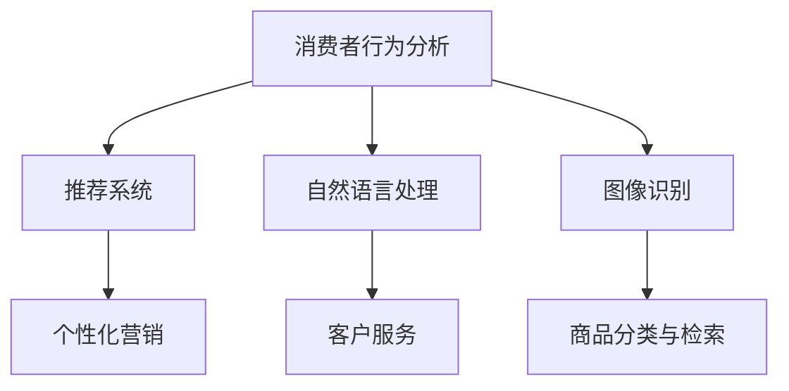

                 

 **关键词**：人工智能、电商、推荐系统、自然语言处理、图像识别、个性化营销

**摘要**：本文将探讨人工智能在电商领域的广泛应用，包括推荐系统、自然语言处理、图像识别和个性化营销等方面。通过深入分析这些应用，我们旨在揭示AI如何提升电商的运营效率、用户体验和销售额。

## 1. 背景介绍

随着互联网的普及和电子商务的快速发展，消费者对电商平台的期望越来越高。他们不仅希望找到物美价廉的商品，还希望获得个性化的购物体验。为此，电商平台开始积极引入人工智能技术，以提升用户体验、降低运营成本和增加销售额。

人工智能（AI）是一种模拟人类智能的技术，包括机器学习、深度学习、自然语言处理、图像识别等多个领域。这些技术的引入，使得电商平台能够更准确地了解消费者的需求和偏好，从而提供更加个性化的服务。

## 2. 核心概念与联系

为了更好地理解AI在电商中的应用，我们需要了解一些核心概念和它们之间的联系。以下是一个用Mermaid绘制的流程图，展示了这些概念之间的关系：



### 2.1 消费者行为分析

消费者行为分析是AI在电商中应用的基础。通过分析消费者的购物记录、浏览历史、搜索行为等数据，电商平台可以了解消费者的偏好和需求，从而为其推荐合适的商品。

### 2.2 推荐系统

推荐系统是基于消费者行为分析结果，为消费者推荐感兴趣的商品或服务。它通常采用协同过滤、基于内容的推荐、深度学习等方法。

### 2.3 个性化营销

个性化营销是基于消费者的个性化需求，为其提供定制化的营销信息。例如，根据消费者的购买历史和偏好，为其推送相关的促销活动、优惠券等。

### 2.4 自然语言处理

自然语言处理（NLP）是AI的一个重要分支，它使计算机能够理解、处理和生成人类语言。在电商中，NLP可用于聊天机器人、商品评价分析等。

### 2.5 客户服务

通过NLP技术，电商平台可以建立智能客服系统，快速响应消费者的咨询和问题，提高客户满意度。

### 2.6 图像识别

图像识别技术使计算机能够识别和理解图像内容。在电商中，图像识别可用于商品分类、图像搜索等。

### 2.7 商品分类与检索

商品分类与检索是电商平台的基础功能。通过图像识别技术，可以实现对商品图片的自动分类和检索，提高用户的购物体验。

## 3. 核心算法原理 & 具体操作步骤

### 3.1 算法原理概述

在电商中，AI的应用主要基于以下几种算法：

1. **协同过滤算法**：通过分析用户之间的相似性，为用户提供个性化推荐。
2. **基于内容的推荐算法**：根据商品的属性和特征，为用户推荐类似的商品。
3. **深度学习算法**：利用神经网络模型，对海量数据进行自动特征提取和预测。
4. **自然语言处理算法**：用于处理和生成人类语言，应用于聊天机器人、商品评价分析等。
5. **图像识别算法**：用于识别和理解图像内容，应用于商品分类、图像搜索等。

### 3.2 算法步骤详解

1. **数据收集**：收集用户的购物记录、浏览历史、搜索行为等数据。
2. **数据预处理**：对原始数据进行清洗、去重、标准化等处理，为后续分析做好准备。
3. **特征提取**：从数据中提取有用的特征，如用户的行为特征、商品属性等。
4. **模型训练**：利用特征数据，训练推荐系统、自然语言处理模型、图像识别模型等。
5. **模型评估**：通过测试数据集，评估模型的性能，如准确率、召回率等。
6. **模型部署**：将训练好的模型部署到线上系统，为用户提供个性化推荐、智能客服等服务。

### 3.3 算法优缺点

1. **协同过滤算法**：优点是简单、易于实现；缺点是易受到稀疏性和冷启动问题的影响。
2. **基于内容的推荐算法**：优点是准确性较高；缺点是依赖于商品属性数据，对商品描述不完整时效果较差。
3. **深度学习算法**：优点是能够自动提取复杂特征，适用于大规模数据；缺点是需要大量计算资源和数据，且模型解释性较差。
4. **自然语言处理算法**：优点是能够处理和理解人类语言；缺点是模型训练和优化难度较大，对数据质量要求较高。
5. **图像识别算法**：优点是能够自动分类和检索商品；缺点是需要大量标注数据进行训练，且对图像质量要求较高。

### 3.4 算法应用领域

1. **推荐系统**：用于为用户提供个性化推荐，提高用户满意度和购买转化率。
2. **自然语言处理**：用于智能客服、商品评价分析、用户评论生成等。
3. **图像识别**：用于商品分类、图像搜索、图像标签生成等。

## 4. 数学模型和公式 & 详细讲解 & 举例说明

### 4.1 数学模型构建

在AI应用中，常用的数学模型包括：

1. **线性回归**：用于预测数值型目标变量。
2. **逻辑回归**：用于预测二元分类问题。
3. **决策树**：用于分类和回归问题。
4. **神经网络**：用于非线性特征提取和预测。

### 4.2 公式推导过程

以线性回归为例，其公式推导过程如下：

设输入特征为 \(X\)，输出目标为 \(Y\)，则有：

$$
Y = \beta_0 + \beta_1 X
$$

其中，\(\beta_0\) 和 \(\beta_1\) 为模型参数。

通过最小化均方误差（MSE），可以得到：

$$
\beta_0 = \frac{\sum_{i=1}^{n} (Y_i - \beta_1 X_i)}{n}
$$

$$
\beta_1 = \frac{\sum_{i=1}^{n} (Y_i - \beta_0 X_i) X_i}{n}
$$

### 4.3 案例分析与讲解

假设我们有一个电商平台的购物记录数据，包含用户ID、商品ID、购买数量等信息。我们想预测用户的购买数量，以便为其推荐合适的商品。

1. **数据收集**：收集用户的购物记录数据，包含用户ID、商品ID、购买数量等信息。
2. **数据预处理**：对数据进行清洗、去重、标准化等处理。
3. **特征提取**：提取用户的行为特征和商品属性特征，如用户的历史购买数量、商品的品类、品牌、价格等。
4. **模型训练**：使用线性回归模型进行训练，得到预测模型。
5. **模型评估**：使用测试数据集评估模型的性能，如均方误差（MSE）。
6. **模型部署**：将训练好的模型部署到线上系统，为用户提供个性化推荐。

## 5. 项目实践：代码实例和详细解释说明

### 5.1 开发环境搭建

1. **软件环境**：Python 3.8、Scikit-learn 0.22.2、NumPy 1.19.5
2. **硬件环境**：CPU或GPU

### 5.2 源代码详细实现

以下是一个简单的线性回归模型实现：

```python
import numpy as np
from sklearn.linear_model import LinearRegression
from sklearn.model_selection import train_test_split
from sklearn.metrics import mean_squared_error

# 读取数据
data = np.loadtxt('data.csv', delimiter=',')
X = data[:, :-1]
Y = data[:, -1]

# 数据划分
X_train, X_test, Y_train, Y_test = train_test_split(X, Y, test_size=0.2, random_state=42)

# 模型训练
model = LinearRegression()
model.fit(X_train, Y_train)

# 模型评估
Y_pred = model.predict(X_test)
mse = mean_squared_error(Y_test, Y_pred)
print(f'MSE: {mse}')

# 模型部署
# ...（将模型部署到线上系统）
```

### 5.3 代码解读与分析

1. **数据读取**：使用NumPy读取CSV文件，获取输入特征和目标变量。
2. **数据划分**：使用Scikit-learn将数据划分为训练集和测试集。
3. **模型训练**：使用LinearRegression类创建线性回归模型，并调用fit方法进行训练。
4. **模型评估**：使用预测结果和实际结果计算均方误差，评估模型性能。
5. **模型部署**：将训练好的模型部署到线上系统，为用户提供个性化推荐。

## 6. 实际应用场景

### 6.1 推荐系统

电商平台可以使用推荐系统为用户推荐感兴趣的商品。通过分析用户的购物记录、浏览历史等数据，推荐系统可以为用户提供个性化的购物建议，提高用户满意度和购买转化率。

### 6.2 自然语言处理

电商平台可以利用自然语言处理技术，分析用户评论、商品描述等文本数据。通过对这些数据的深入理解，可以为用户提供更准确的推荐和服务。

### 6.3 图像识别

电商平台可以使用图像识别技术，对商品图片进行自动分类和检索。这样，用户可以通过上传图片来查找类似商品，提高购物体验。

## 7. 工具和资源推荐

### 7.1 学习资源推荐

1. **《机器学习》**：周志华 著，电子工业出版社
2. **《深度学习》**：Ian Goodfellow、Yoshua Bengio、Aaron Courville 著，电子工业出版社

### 7.2 开发工具推荐

1. **Jupyter Notebook**：用于数据分析和模型训练
2. **TensorFlow**：用于深度学习模型开发

### 7.3 相关论文推荐

1. **"Recommender Systems Handbook"**：Jure Leskovec、Ananthram Swami 著
2. **"Deep Learning for Recommender Systems"**：Hyunsoo Kim、Vijay P. Bhatnager 著

## 8. 总结：未来发展趋势与挑战

### 8.1 研究成果总结

随着人工智能技术的不断发展，AI在电商中的应用取得了显著成果。推荐系统、自然语言处理、图像识别等技术，已为电商平台带来了显著的商业价值。

### 8.2 未来发展趋势

1. **个性化推荐**：通过深度学习等技术，实现更加精准的个性化推荐。
2. **智能客服**：利用自然语言处理技术，提高智能客服系统的响应速度和准确性。
3. **图像识别与检索**：通过深度学习技术，实现对商品图像的自动分类和检索。

### 8.3 面临的挑战

1. **数据质量**：高质量的数据是AI应用的基础。电商平台需要确保数据的准确性、完整性和实时性。
2. **模型解释性**：深度学习模型通常具有较好的性能，但缺乏解释性。如何提高模型的解释性，使其更易于理解和应用，是一个重要挑战。

### 8.4 研究展望

未来，AI在电商中的应用将继续深入，为电商平台带来更多的商业价值。同时，我们期待更多优秀的研究成果，解决当前面临的挑战，推动电商行业的持续发展。

## 9. 附录：常见问题与解答

### 9.1 什么是协同过滤？

协同过滤是一种基于用户之间的相似性，为用户提供个性化推荐的方法。它分为基于用户的协同过滤和基于物品的协同过滤两种类型。

### 9.2 如何提高推荐系统的准确性？

提高推荐系统的准确性可以通过以下几种方法：

1. **数据预处理**：确保数据的准确性、完整性和实时性。
2. **特征提取**：提取更多的有用特征，提高模型的辨别能力。
3. **模型优化**：使用更先进的算法和模型，提高推荐效果。
4. **交叉验证**：使用交叉验证方法，评估和优化模型性能。

### 9.3 自然语言处理技术在电商中的应用有哪些？

自然语言处理技术在电商中的应用包括：

1. **智能客服**：通过NLP技术，实现与用户的自然语言交互，提高客服效率。
2. **商品评价分析**：分析用户评价和评论，提取有价值的信息，用于改进商品和服务。
3. **用户评论生成**：利用NLP技术，生成用户的评论，提高用户参与度。

---

**作者：禅与计算机程序设计艺术 / Zen and the Art of Computer Programming**

