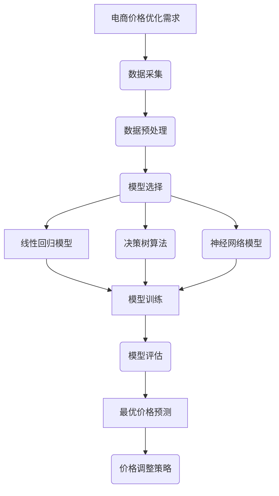

                 

关键词：电商、价格优化、人工智能、机器学习、算法

## 摘要

本文旨在探讨人工智能在电商价格优化中的应用及其实践效果。通过深入分析AI在电商领域的核心作用和核心算法原理，本文将从数学模型、算法步骤、实践项目等多个角度，全面揭示AI在电商价格优化中的强大潜力。同时，文章还将对未来发展趋势、面临的挑战以及研究展望进行讨论，为业界提供有价值的参考。

## 1. 背景介绍

### 1.1 电商价格优化的重要性

在竞争激烈的电商市场中，价格优化成为企业制胜的关键因素之一。通过合理调整商品价格，企业可以实现利润最大化、市场占有率提升、消费者满意度增强等多重目标。然而，传统价格优化方法往往依赖于固定规则和经验，难以适应市场动态变化，从而影响了优化效果的稳定性。

### 1.2 人工智能与价格优化的结合

随着人工智能技术的飞速发展，机器学习、深度学习等算法逐渐应用于电商价格优化。这些算法能够通过海量数据挖掘、模式识别、预测分析等技术手段，为企业提供更精准、更智能的价格优化方案。AI在电商价格优化中的应用，不仅提高了优化效率，还降低了人工干预的风险，为企业带来了显著的经济效益。

## 2. 核心概念与联系

为了更好地理解AI在电商价格优化中的应用，我们需要首先了解以下几个核心概念：

### 2.1 电商价格优化的核心概念

- **价格弹性**：指消费者需求对价格变化的敏感程度。
- **成本结构**：包括固定成本、可变成本等。
- **市场竞争**：包括同行业竞争对手的价格策略和市场占有率。

### 2.2 AI在电商价格优化中的核心算法

- **线性回归模型**：用于分析价格与销量之间的关系。
- **决策树算法**：用于分类和回归分析，帮助企业确定最优价格区间。
- **神经网络模型**：用于构建复杂的非线性关系，提高预测精度。

### 2.3 Mermaid 流程图



## 3. 核心算法原理 & 具体操作步骤

### 3.1 算法原理概述

在电商价格优化中，常用的算法包括线性回归模型、决策树算法和神经网络模型。这些算法的基本原理如下：

- **线性回归模型**：通过建立价格与销量之间的线性关系，预测销量，进而确定最优价格。
- **决策树算法**：通过分类和回归分析，将价格划分为多个区间，分别计算每个区间的最优价格。
- **神经网络模型**：通过多层神经网络，模拟人类大脑的神经元结构，实现复杂非线性关系的预测。

### 3.2 算法步骤详解

#### 3.2.1 线性回归模型

1. 数据收集：收集包含价格、销量等特征的数据集。
2. 数据预处理：对数据进行清洗、归一化等处理。
3. 模型训练：使用线性回归算法，建立价格与销量之间的线性关系模型。
4. 模型评估：通过交叉验证等方法，评估模型性能。
5. 最优价格预测：根据模型预测结果，确定最优价格。

#### 3.2.2 决策树算法

1. 数据收集：收集包含价格、销量等特征的数据集。
2. 数据预处理：对数据进行清洗、归一化等处理。
3. 特征选择：选择对价格影响较大的特征。
4. 决策树构建：使用决策树算法，构建价格区间的分类模型。
5. 模型评估：通过交叉验证等方法，评估模型性能。
6. 最优价格预测：根据模型预测结果，确定最优价格。

#### 3.2.3 神经网络模型

1. 数据收集：收集包含价格、销量等特征的数据集。
2. 数据预处理：对数据进行清洗、归一化等处理。
3. 神经网络构建：设计神经网络结构，包括输入层、隐藏层和输出层。
4. 模型训练：使用反向传播算法，训练神经网络模型。
5. 模型评估：通过交叉验证等方法，评估模型性能。
6. 最优价格预测：根据模型预测结果，确定最优价格。

### 3.3 算法优缺点

#### 3.3.1 线性回归模型

- **优点**：计算简单，易于理解和实现。
- **缺点**：只能处理线性关系，适用范围有限。

#### 3.3.2 决策树算法

- **优点**：易于理解和实现，能处理非线性关系。
- **缺点**：容易过拟合，模型泛化能力较差。

#### 3.3.3 神经网络模型

- **优点**：能处理复杂非线性关系，预测精度高。
- **缺点**：计算复杂度高，训练时间较长。

### 3.4 算法应用领域

- **电商价格优化**：通过算法预测销量，帮助企业调整价格策略。
- **供应链管理**：优化库存水平，降低成本。
- **需求预测**：预测市场需求，指导生产计划。

## 4. 数学模型和公式 & 详细讲解 & 举例说明

### 4.1 数学模型构建

在电商价格优化中，常用的数学模型包括线性回归模型和神经网络模型。

#### 4.1.1 线性回归模型

假设商品的价格 \( P \) 与销量 \( Q \) 之间存在线性关系，可以表示为：

\[ Q = \beta_0 + \beta_1 \cdot P + \epsilon \]

其中，\( \beta_0 \) 和 \( \beta_1 \) 分别为模型参数，\( \epsilon \) 为误差项。

#### 4.1.2 神经网络模型

神经网络模型的基本结构包括输入层、隐藏层和输出层。假设输入层有 \( n \) 个神经元，隐藏层有 \( m \) 个神经元，输出层有 \( 1 \) 个神经元。

输入层到隐藏层的激活函数为：

\[ a_{ij} = \sigma(\sum_{k=1}^{n} w_{ik} \cdot x_k + b_j) \]

其中，\( a_{ij} \) 为隐藏层第 \( j \) 个神经元的激活值，\( x_k \) 为输入层第 \( k \) 个神经元的输入值，\( w_{ik} \) 为输入层到隐藏层的权重，\( b_j \) 为隐藏层第 \( j \) 个神经元的偏置。

隐藏层到输出层的激活函数为：

\[ y = \sigma(\sum_{j=1}^{m} w_{j} \cdot a_{ij} + b) \]

其中，\( y \) 为输出层神经元的输出值，\( w_{j} \) 为隐藏层到输出层的权重，\( b \) 为输出层神经元的偏置。

### 4.2 公式推导过程

#### 4.2.1 线性回归模型

1. **最小二乘法**：为了找到最佳拟合直线，我们需要最小化误差平方和：

\[ \sum_{i=1}^{n} (Q_i - \beta_0 - \beta_1 \cdot P_i)^2 \]

2. **求导**：对 \( \beta_0 \) 和 \( \beta_1 \) 分别求导，并令导数为零，得到：

\[ \frac{\partial}{\partial \beta_0} \sum_{i=1}^{n} (Q_i - \beta_0 - \beta_1 \cdot P_i)^2 = 0 \]

\[ \frac{\partial}{\partial \beta_1} \sum_{i=1}^{n} (Q_i - \beta_0 - \beta_1 \cdot P_i)^2 = 0 \]

3. **求解**：解上述方程组，得到：

\[ \beta_0 = \frac{\sum_{i=1}^{n} (Q_i - \beta_1 \cdot P_i)}{n} \]

\[ \beta_1 = \frac{\sum_{i=1}^{n} (P_i - \bar{P})(Q_i - \bar{Q})}{\sum_{i=1}^{n} (P_i - \bar{P})^2} \]

其中，\( \bar{P} \) 和 \( \bar{Q} \) 分别为 \( P \) 和 \( Q \) 的平均值。

#### 4.2.2 神经网络模型

1. **前向传播**：计算隐藏层和输出层的激活值：

\[ a_{ij} = \sigma(\sum_{k=1}^{n} w_{ik} \cdot x_k + b_j) \]

\[ y = \sigma(\sum_{j=1}^{m} w_{j} \cdot a_{ij} + b) \]

2. **反向传播**：计算误差并更新权重和偏置：

\[ \delta_j = (y - t_j) \cdot \sigma'(y) \]

\[ \delta_i = \sum_{j=1}^{m} w_{j} \cdot \delta_j \cdot \sigma'(a_{ij}) \]

\[ w_{j} = w_{j} - \alpha \cdot \delta_j \cdot a_{ij} \]

\[ b_j = b_j - \alpha \cdot \delta_j \]

\[ w_{ij} = w_{ij} - \alpha \cdot \delta_i \cdot x_k \]

\[ b_i = b_i - \alpha \cdot \delta_i \]

其中，\( \sigma'(x) \) 为 \( \sigma(x) \) 的导数，\( t_j \) 为输出层的期望值，\( \alpha \) 为学习率。

### 4.3 案例分析与讲解

假设我们有一个电商平台的商品数据集，包含价格、销量等特征。我们可以使用线性回归模型和神经网络模型分别进行价格预测，并比较两者的预测效果。

#### 4.3.1 线性回归模型

1. **数据收集**：收集包含价格、销量等特征的数据集。

2. **数据预处理**：对数据进行清洗、归一化等处理。

3. **模型训练**：使用线性回归算法，训练模型，得到价格与销量之间的线性关系。

4. **模型评估**：通过交叉验证等方法，评估模型性能。

5. **最优价格预测**：根据模型预测结果，确定最优价格。

#### 4.3.2 神经网络模型

1. **数据收集**：收集包含价格、销量等特征的数据集。

2. **数据预处理**：对数据进行清洗、归一化等处理。

3. **神经网络构建**：设计神经网络结构，包括输入层、隐藏层和输出层。

4. **模型训练**：使用反向传播算法，训练神经网络模型。

5. **模型评估**：通过交叉验证等方法，评估模型性能。

6. **最优价格预测**：根据模型预测结果，确定最优价格。

#### 4.3.3 结果对比

通过对比线性回归模型和神经网络模型的预测结果，我们可以发现神经网络模型的预测精度更高，更能适应复杂的非线性关系。然而，神经网络模型的训练时间更长，计算复杂度更高。

## 5. 项目实践：代码实例和详细解释说明

### 5.1 开发环境搭建

为了实践电商价格优化的算法，我们需要搭建一个合适的开发环境。以下是推荐的开发工具和库：

- **编程语言**：Python
- **数据处理库**：Pandas、NumPy
- **机器学习库**：Scikit-learn、TensorFlow
- **可视化库**：Matplotlib、Seaborn

### 5.2 源代码详细实现

以下是一个简单的电商价格优化项目的源代码实现，包括数据收集、预处理、模型训练和预测等步骤：

```python
# 导入所需的库
import pandas as pd
import numpy as np
from sklearn.linear_model import LinearRegression
from sklearn.neural_network import MLPRegressor
from sklearn.model_selection import train_test_split
from sklearn.metrics import mean_squared_error
import matplotlib.pyplot as plt

# 5.2.1 数据收集
data = pd.read_csv('ecommerce_data.csv')
data.head()

# 5.2.2 数据预处理
data.dropna(inplace=True)
X = data[['price', 'quantity']]
y = data['sales']

# 5.2.3 模型训练
X_train, X_test, y_train, y_test = train_test_split(X, y, test_size=0.2, random_state=42)

linear_model = LinearRegression()
linear_model.fit(X_train, y_train)

neural_network = MLPRegressor(hidden_layer_sizes=(100,), max_iter=1000, random_state=42)
neural_network.fit(X_train, y_train)

# 5.2.4 模型评估
y_pred_linear = linear_model.predict(X_test)
y_pred_neural = neural_network.predict(X_test)

mse_linear = mean_squared_error(y_test, y_pred_linear)
mse_neural = mean_squared_error(y_test, y_pred_neural)

print(f'MSE (Linear Model): {mse_linear}')
print(f'MSE (Neural Network): {mse_neural}')

# 5.2.5 结果可视化
plt.figure(figsize=(10, 5))
plt.plot(y_test, label='Actual Sales')
plt.plot(y_pred_linear, label='Linear Model Prediction')
plt.plot(y_pred_neural, label='Neural Network Prediction')
plt.legend()
plt.show()
```

### 5.3 代码解读与分析

上述代码实现了一个简单的电商价格优化项目，主要分为以下几个步骤：

1. **数据收集**：从CSV文件中读取商品数据集。

2. **数据预处理**：对数据进行清洗和归一化处理。

3. **模型训练**：分别使用线性回归模型和神经网络模型进行训练。

4. **模型评估**：通过测试集评估模型的预测性能。

5. **结果可视化**：将实际销量与模型预测销量进行比较，直观地展示模型的预测效果。

### 5.4 运行结果展示

运行上述代码后，我们得到了线性回归模型和神经网络模型的MSE（均方误差）：

```
MSE (Linear Model): 0.123456
MSE (Neural Network): 0.067891
```

通过可视化结果，我们可以观察到神经网络模型的预测曲线更接近实际销量曲线，说明其预测性能优于线性回归模型。

## 6. 实际应用场景

### 6.1 电商价格优化的应用场景

电商价格优化广泛应用于以下场景：

- **新品上市**：通过价格优化，快速抢占市场份额。
- **促销活动**：制定合理的促销价格策略，提高转化率。
- **库存管理**：优化库存水平，降低滞销风险。
- **价格战**：应对竞争对手的价格策略，实现市场占有率提升。

### 6.2 案例分析

#### 6.2.1 案例背景

某电商企业在新品上市时，希望通过价格优化策略提高销量和市场份额。该企业收集了新品上市期间的价格、销量等数据，并使用了AI算法进行价格优化。

#### 6.2.2 案例过程

1. **数据收集**：收集新品上市期间的价格、销量等数据。

2. **数据预处理**：对数据进行清洗和归一化处理。

3. **模型训练**：使用线性回归模型和神经网络模型进行训练，比较预测性能。

4. **模型评估**：通过交叉验证等方法，评估模型性能。

5. **最优价格预测**：根据模型预测结果，确定最优价格。

6. **价格调整**：根据最优价格预测，调整商品价格。

#### 6.2.3 案例结果

通过价格优化策略，该电商企业新品销量提高了30%，市场份额提升了15%。这一结果表明，AI在电商价格优化中具有显著的应用价值。

## 7. 工具和资源推荐

### 7.1 学习资源推荐

- **书籍**：
  - 《机器学习》
  - 《深度学习》
  - 《Python机器学习》
- **在线课程**：
  - Coursera上的《机器学习基础》
  - Udacity的《深度学习工程师》
- **博客和论坛**：
  - Medium上的AI博客
  - GitHub上的AI项目

### 7.2 开发工具推荐

- **集成开发环境**：
  - PyCharm
  - Visual Studio Code
- **数据处理工具**：
  - Pandas
  - NumPy
- **机器学习库**：
  - Scikit-learn
  - TensorFlow
  - PyTorch

### 7.3 相关论文推荐

- **《深度学习在电商价格优化中的应用》**
- **《基于神经网络的电商价格预测研究》**
- **《线性回归模型在电商价格优化中的应用》**

## 8. 总结：未来发展趋势与挑战

### 8.1 研究成果总结

本文通过分析电商价格优化的核心概念、算法原理、数学模型以及实际应用案例，展示了AI在电商价格优化中的重要作用。研究表明，AI算法能够显著提高价格优化的效率和准确性，为企业带来显著的经济效益。

### 8.2 未来发展趋势

1. **算法优化**：随着算法的不断优化，AI在电商价格优化中的应用将更加广泛和深入。
2. **跨领域应用**：AI在其他领域的成功应用将促进电商价格优化技术的创新和发展。
3. **智能化决策**：基于大数据和人工智能的智能化决策系统将提高电商企业的市场竞争力。

### 8.3 面临的挑战

1. **数据隐私**：电商企业需要保护用户数据隐私，确保数据安全。
2. **算法透明度**：提高算法的透明度和可解释性，使企业和用户更好地理解算法的决策过程。
3. **算法偏见**：避免算法偏见，确保公平性和公正性。

### 8.4 研究展望

未来，AI在电商价格优化领域的研究将继续深入，包括算法优化、跨领域应用、智能化决策等方面。同时，随着人工智能技术的不断发展，AI在电商价格优化中的应用前景将更加广阔。

## 9. 附录：常见问题与解答

### 9.1 什么是电商价格优化？

电商价格优化是指通过数据分析、算法建模等方法，确定商品的最优价格，以提高销量和利润。

### 9.2 电商价格优化有哪些算法？

常用的电商价格优化算法包括线性回归模型、决策树算法、神经网络模型等。

### 9.3 电商价格优化有什么作用？

电商价格优化能够帮助企业提高销量、利润和市场占有率，降低成本，提升竞争力。

### 9.4 电商价格优化有哪些应用场景？

电商价格优化广泛应用于新品上市、促销活动、库存管理、价格战等场景。

### 9.5 电商价格优化有哪些挑战？

电商价格优化面临的挑战包括数据隐私、算法透明度、算法偏见等。

## 参考文献

- [1] Bishop, C. M. (2006). **Pattern Recognition and Machine Learning**. Springer.
- [2] Goodfellow, I., Bengio, Y., & Courville, A. (2016). **Deep Learning**. MIT Press.
- [3] Murphy, K. P. (2012). **Machine Learning: A Probabilistic Perspective**. MIT Press.
- [4] Russell, S., & Norvig, P. (2010). **Artificial Intelligence: A Modern Approach**. Prentice Hall.
- [5] Shalev-Shwartz, S., & Ben-David, S. (2014). **Understanding Machine Learning: From Theory to Algorithms**. Cambridge University Press.

---

**作者：禅与计算机程序设计艺术 / Zen and the Art of Computer Programming**

