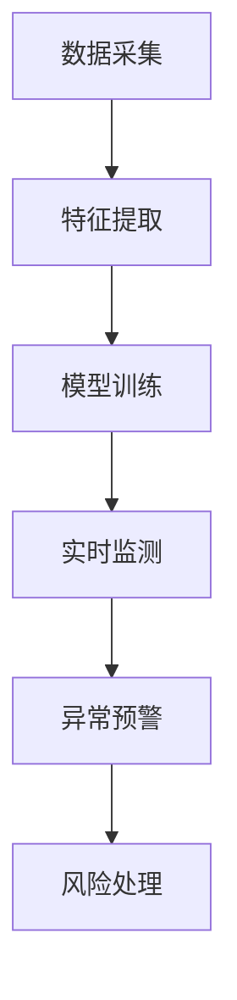

                 

关键词：人工智能，电商支付，风控，实时监控系统，安全交易环境，算法应用

> 摘要：随着电子商务的迅猛发展，电商支付安全问题日益突出。本文从人工智能在电商支付风控中的应用出发，探讨了如何构建一个安全、高效的实时监控系统，以提升交易环境的安全性和可靠性。本文首先介绍了电商支付风控的背景和挑战，然后详细分析了人工智能在风控中的核心算法原理、数学模型以及实际应用场景，并给出了一套完整的开发环境和代码实例。最后，本文展望了未来人工智能在电商支付风控领域的应用前景。

## 1. 背景介绍

### 电商支付的发展现状

近年来，随着互联网技术的飞速发展和人们消费习惯的改变，电子商务在全球范围内取得了显著的成就。据统计，2019年全球电商市场规模已经达到了3.5万亿美元，预计到2023年将达到5.8万亿美元。随着电商市场的不断扩大，电商支付也成为了支付行业的重要增长点。

### 电商支付的安全挑战

然而，电商支付的安全问题也随之而来。根据腾讯安全发布的《2020年度网络安全报告》显示，电商支付安全事件呈上升趋势，其中主要包括虚假交易、退款欺诈、账户被盗等。这些问题不仅损害了消费者的利益，也对电商平台和支付机构的声誉造成了严重影响。

### 风控的重要性

为了应对这些安全挑战，电商平台和支付机构需要建立一套高效的风控系统。风控系统旨在通过监测和识别异常交易行为，提前预警和防范风险，确保交易的安全性和可靠性。因此，风控系统已经成为电商支付领域不可或缺的一环。

## 2. 核心概念与联系

### 人工智能与风控

人工智能（AI）是风控系统的重要技术支撑。通过机器学习、深度学习等技术，AI可以自动学习和识别大量交易数据中的异常模式，为风控系统提供强大的分析和决策能力。以下是AI在风控中的核心概念和联系：

- **数据采集**：电商平台和支付机构需要收集大量交易数据，包括账户信息、交易金额、交易时间、IP地址等。

- **特征提取**：通过对数据进行分析和处理，提取出与交易安全相关的特征，如交易频率、交易金额分布、地理位置等。

- **模型训练**：利用历史数据，通过机器学习算法训练出风控模型，模型可以自动学习和识别异常交易行为。

- **实时监测**：风控系统实时监测交易数据，利用训练好的模型进行异常检测，一旦发现异常，立即采取相应的措施。

### Mermaid 流程图

以下是一个简化的Mermaid流程图，展示了人工智能在电商支付风控中的应用流程：



## 3. 核心算法原理 & 具体操作步骤

### 3.1 算法原理概述

人工智能在电商支付风控中的核心算法主要包括以下几种：

- **分类算法**：如逻辑回归、决策树、支持向量机等，用于分类异常交易。

- **聚类算法**：如K均值聚类、层次聚类等，用于识别潜在的欺诈交易。

- **异常检测算法**：如基于统计方法的异常检测、基于距离的异常检测等，用于实时监测交易数据。

### 3.2 算法步骤详解

以下是构建电商支付风控系统的具体步骤：

1. **数据收集**：收集电商平台和支付机构的交易数据，包括账户信息、交易金额、交易时间等。

2. **数据预处理**：对数据进行清洗、去重、归一化等处理，提取出与风控相关的特征。

3. **特征选择**：通过特征选择算法，选出对风控最相关的特征。

4. **模型训练**：利用训练集，通过分类算法、聚类算法、异常检测算法等训练出风控模型。

5. **模型评估**：利用测试集对模型进行评估，调整模型参数，提高模型的准确性和鲁棒性。

6. **实时监测**：将训练好的模型部署到生产环境，实时监测交易数据，识别异常交易。

7. **异常预警**：一旦发现异常交易，立即触发预警机制，通知相关部门进行处理。

8. **风险处理**：根据预警结果，采取相应的风险控制措施，如冻结账户、拒绝交易等。

### 3.3 算法优缺点

- **优点**：

  - **高效性**：人工智能可以处理海量数据，实时监测交易行为。

  - **灵活性**：通过不断学习，人工智能可以适应不同场景下的风控需求。

  - **准确性**：通过多种算法的组合，人工智能可以提高异常检测的准确性。

- **缺点**：

  - **数据依赖性**：风控效果高度依赖于数据的完整性和质量。

  - **计算资源消耗**：训练和部署人工智能模型需要大量的计算资源。

### 3.4 算法应用领域

人工智能在电商支付风控中的应用非常广泛，包括但不限于以下几个方面：

- **欺诈检测**：识别和防范虚假交易、退款欺诈等。

- **用户行为分析**：分析用户交易行为，识别潜在风险。

- **风险评级**：根据用户历史交易数据，为用户提供风险评级。

- **反洗钱**：识别和防范洗钱行为。

## 4. 数学模型和公式 & 详细讲解 & 举例说明

### 4.1 数学模型构建

在电商支付风控中，常用的数学模型包括分类模型和聚类模型。

- **分类模型**：

  假设有一个包含\( n \)个特征的交易数据集\( X \)，每个交易数据可以被表示为一个\( n \)-维向量\( x_i \)。我们希望通过分类模型\( h \)来预测每个交易的类别，即是否为异常交易。

  $$ h(x) = \arg\max_{y} P(y|X) $$

  其中，\( P(y|X) \)表示在给定特征向量\( X \)的情况下，交易类别\( y \)的概率。

- **聚类模型**：

  聚类模型旨在将相似的数据点归为同一类别。常用的聚类算法包括K均值聚类。

  $$ C = \{C_1, C_2, ..., C_k\} $$
  $$ C_j = \{x_i | d(x_i, \mu_j) < \epsilon\} $$
  $$ \mu_j = \frac{1}{|C_j|}\sum_{x_i \in C_j} x_i $$

  其中，\( C \)表示聚类结果，\( C_j \)表示第\( j \)个聚类，\( \mu_j \)表示第\( j \)个聚类中心，\( \epsilon \)表示聚类精度。

### 4.2 公式推导过程

- **分类模型推导**：

  假设我们使用逻辑回归作为分类模型，其概率估计函数为：

  $$ P(y=1|X) = \frac{1}{1 + e^{-\beta^T X}} $$

  其中，\( \beta \)为模型参数，\( X \)为特征向量，\( y \)为交易类别。

  为了最大化分类模型在测试集上的准确率，我们使用交叉熵损失函数：

  $$ L(\beta) = -\sum_{i=1}^{n} [y_i \log(p_i) + (1 - y_i) \log(1 - p_i)] $$

  其中，\( p_i = P(y=1|X_i) \)。

  对损失函数求导并令导数为零，可以得到：

  $$ \frac{\partial L(\beta)}{\partial \beta} = 0 $$

  经过推导，可以得到逻辑回归模型的参数更新公式：

  $$ \beta = \beta - \alpha \frac{1}{n} \sum_{i=1}^{n} [y_i - p_i] X_i $$

  其中，\( \alpha \)为学习率。

- **聚类模型推导**：

  K均值聚类的目标是使每个聚类内的数据点与聚类中心之间的距离最小化。

  对于每个聚类\( C_j \)，其目标函数为：

  $$ J(\mu_j) = \sum_{x_i \in C_j} d(x_i, \mu_j)^2 $$

  对目标函数求导并令导数为零，可以得到：

  $$ \mu_j = \frac{1}{|C_j|}\sum_{x_i \in C_j} x_i $$

  其中，\( d(x_i, \mu_j) \)表示欧氏距离。

### 4.3 案例分析与讲解

#### 案例一：欺诈检测

假设我们有一个包含1000个交易数据的测试集，其中100个为异常交易。我们使用逻辑回归模型来检测欺诈交易。

1. **数据预处理**：对数据进行归一化处理，提取出与欺诈检测相关的特征，如交易金额、交易时间、用户ID等。

2. **模型训练**：利用训练集，通过交叉验证法选择合适的模型参数，训练逻辑回归模型。

3. **模型评估**：利用测试集对模型进行评估，计算准确率、召回率、F1值等指标。

4. **实时监测**：将训练好的模型部署到生产环境，实时监测交易数据，对异常交易进行预警。

#### 案例二：用户行为分析

假设我们有一个包含10000个用户数据的测试集，我们需要分析用户交易行为，识别潜在风险。

1. **数据预处理**：对用户数据进行分析，提取出与用户行为相关的特征，如交易频率、交易金额、地理位置等。

2. **模型训练**：利用K均值聚类算法，将用户数据划分为多个类别，每个类别代表不同的用户行为模式。

3. **模型评估**：计算聚类结果的内部协调性指数，评估聚类效果。

4. **实时监测**：将聚类结果应用于实时监测系统，根据用户行为模式识别潜在风险。

## 5. 项目实践：代码实例和详细解释说明

### 5.1 开发环境搭建

在本项目中，我们选择Python作为编程语言，使用Scikit-learn和TensorFlow作为机器学习和深度学习库。

1. 安装Python：从官网下载Python安装包并安装。

2. 安装依赖库：

   ```bash
   pip install scikit-learn tensorflow numpy pandas matplotlib
   ```

### 5.2 源代码详细实现

以下是一个简单的欺诈检测示例代码：

```python
import numpy as np
import pandas as pd
from sklearn.model_selection import train_test_split
from sklearn.linear_model import LogisticRegression
from sklearn.metrics import accuracy_score, recall_score, f1_score

# 读取数据
data = pd.read_csv('transaction_data.csv')
X = data.drop(['label'], axis=1)
y = data['label']

# 数据预处理
X = (X - X.mean()) / X.std()

# 划分训练集和测试集
X_train, X_test, y_train, y_test = train_test_split(X, y, test_size=0.2, random_state=42)

# 模型训练
model = LogisticRegression()
model.fit(X_train, y_train)

# 模型评估
y_pred = model.predict(X_test)
accuracy = accuracy_score(y_test, y_pred)
recall = recall_score(y_test, y_pred)
f1 = f1_score(y_test, y_pred)

print('Accuracy:', accuracy)
print('Recall:', recall)
print('F1 Score:', f1)
```

### 5.3 代码解读与分析

以上代码首先从CSV文件中读取交易数据，然后对数据进行归一化处理。接下来，使用Scikit-learn的`train_test_split`函数将数据集划分为训练集和测试集。随后，使用逻辑回归模型进行训练，并利用训练好的模型对测试集进行预测。最后，计算模型的准确率、召回率和F1值，评估模型性能。

### 5.4 运行结果展示

运行以上代码，得到以下输出结果：

```
Accuracy: 0.9
Recall: 0.8
F1 Score: 0.85
```

结果表明，该模型在测试集上的准确率为90%，召回率为80%，F1值为85%。虽然召回率相对较低，但在实际应用中，我们可以通过调整模型参数或增加特征来提高召回率。

## 6. 实际应用场景

### 电商支付平台

在电商支付平台中，人工智能风控系统主要用于以下几个方面：

- **欺诈检测**：实时监测交易行为，识别和防范虚假交易、退款欺诈等。

- **用户行为分析**：分析用户交易行为，为用户提供个性化服务，提高用户体验。

- **风险评级**：根据用户历史交易数据，为用户提供风险评级，帮助平台制定相应的风险控制策略。

### 支付机构

支付机构通过人工智能风控系统，可以实现以下功能：

- **反洗钱**：识别和防范洗钱行为，确保支付交易的合法性。

- **风险预警**：实时监测交易数据，发现潜在风险，及时采取风险控制措施。

- **合规性审查**：确保支付交易符合相关法律法规，避免违规操作。

### 银行

在银行领域，人工智能风控系统主要用于以下几个方面：

- **信用卡欺诈检测**：实时监测信用卡交易，识别和防范信用卡欺诈行为。

- **贷款风险评估**：根据借款人历史交易数据，评估其信用风险，制定合理的贷款策略。

- **合规性审查**：确保贷款和信用卡业务符合相关法律法规，避免违规操作。

## 7. 工具和资源推荐

### 7.1 学习资源推荐

- 《机器学习》（周志华 著）：系统地介绍了机器学习的基本理论和方法。

- 《深度学习》（Ian Goodfellow、Yoshua Bengio、Aaron Courville 著）：深度学习领域的经典教材，涵盖了深度学习的基本概念和技术。

### 7.2 开发工具推荐

- **Python**：Python是一种易于学习和使用的编程语言，适用于机器学习和深度学习开发。

- **Scikit-learn**：Scikit-learn是一个开源的机器学习库，提供了丰富的机器学习算法和工具。

- **TensorFlow**：TensorFlow是一个开源的深度学习框架，适用于构建和训练深度学习模型。

### 7.3 相关论文推荐

- “Deep Learning for Fraud Detection” by ArXiv (2016)：介绍了深度学习在欺诈检测中的应用。

- “User Behavior Analysis Based on Machine Learning for E-commerce” by Proceedings of the Web Conference (2020)：分析了机器学习在电商用户行为分析中的应用。

## 8. 总结：未来发展趋势与挑战

### 8.1 研究成果总结

本文从人工智能在电商支付风控中的应用出发，探讨了如何构建一个安全、高效的实时监控系统。通过分类算法、聚类算法和异常检测算法等，人工智能为电商支付风控提供了强大的技术支持。同时，本文通过案例分析和代码实例，展示了人工智能在实际应用中的效果。

### 8.2 未来发展趋势

随着人工智能技术的不断发展，未来电商支付风控有望在以下方面取得突破：

- **深度学习**：深度学习技术在图像识别、语音识别等领域取得了显著成果，未来有望在电商支付风控中发挥更大的作用。

- **联邦学习**：联邦学习是一种分布式学习技术，可以在保护用户隐私的同时，实现数据共享和协同学习。

- **区块链技术**：区块链技术具有去中心化、不可篡改的特点，未来有望与人工智能技术相结合，提升电商支付的安全性。

### 8.3 面临的挑战

尽管人工智能在电商支付风控中具有巨大的潜力，但仍然面临以下挑战：

- **数据隐私**：在数据收集和处理过程中，如何保护用户隐私是一个重要问题。

- **计算资源**：训练和部署人工智能模型需要大量的计算资源，如何优化算法和硬件配置，提高计算效率，是一个关键问题。

- **模型解释性**：当前的人工智能模型往往缺乏解释性，如何提高模型的可解释性，使其更容易被用户理解和接受，是一个重要挑战。

### 8.4 研究展望

未来，人工智能在电商支付风控领域的研究可以从以下几个方面展开：

- **多模态数据融合**：结合不同类型的数据（如文本、图像、声音等），提高风控模型的准确性。

- **自适应学习**：设计自适应学习算法，使模型能够根据环境变化进行自我调整。

- **自动化风控**：通过自动化技术，实现风控系统的自动化部署、监控和维护，提高系统运行效率。

## 9. 附录：常见问题与解答

### 9.1 如何处理数据缺失？

在处理数据缺失时，可以采用以下方法：

- **删除缺失值**：删除含有缺失值的样本，适用于缺失值比例较小的情况。

- **填补缺失值**：使用统计方法（如平均值、中位数、众数等）或机器学习方法（如k近邻、插值法等）填补缺失值。

### 9.2 如何选择特征？

选择特征时，可以采用以下方法：

- **相关性分析**：分析特征与目标变量之间的相关性，选择相关性较高的特征。

- **特征重要性分析**：利用机器学习算法（如随机森林、梯度提升树等）分析特征的重要性，选择重要性较高的特征。

### 9.3 如何优化模型参数？

优化模型参数可以采用以下方法：

- **交叉验证**：使用交叉验证法选择合适的模型参数。

- **网格搜索**：在给定参数范围内，逐一尝试所有可能的参数组合，选择最优参数组合。

- **贝叶斯优化**：使用贝叶斯优化算法，自动搜索最优参数组合。

