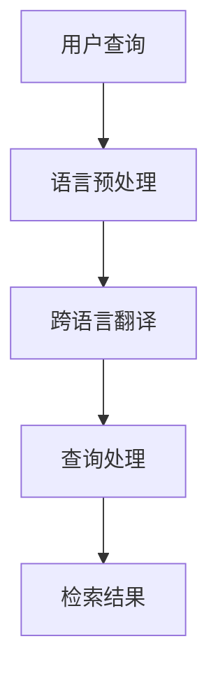

                 

关键词：人工智能，跨语言信息检索，自然语言处理，机器学习，深度学习，多语言信息检索，算法，数据模型，应用场景，未来展望

## 摘要

本文将探讨人工智能在跨语言信息检索领域的应用。随着全球化进程的不断推进，跨语言信息检索成为了一个重要的研究课题。通过介绍自然语言处理、机器学习和深度学习等相关技术，本文将深入分析跨语言信息检索的核心算法原理、数学模型，并给出具体的实现方法和应用场景。同时，本文还将对当前研究现状进行总结，并对未来发展趋势和挑战进行展望。

## 1. 背景介绍

随着互联网的普及和全球化的加速，跨语言信息检索成为了人们获取信息的重要方式。在多语言环境中，用户可以轻松地查找和访问不同语言的资料。然而，由于不同语言之间存在差异，跨语言信息检索面临着诸多挑战，如语义理解、语言翻译、词汇映射等。

传统的方法主要依赖于基于规则的翻译系统和基于统计的机器翻译技术。这些方法在一定程度上提高了跨语言信息检索的准确性，但仍然存在一些问题。例如，规则方法难以处理复杂的语言现象，而统计方法则容易受到数据不足的影响。

近年来，随着人工智能技术的快速发展，特别是在自然语言处理、机器学习和深度学习领域的突破，跨语言信息检索的研究取得了显著的进展。深度学习模型，如神经网络和循环神经网络（RNN），能够更好地捕捉语言的内在结构和语义信息，从而提高跨语言信息检索的准确性和效率。

## 2. 核心概念与联系

### 2.1 自然语言处理（NLP）

自然语言处理是人工智能领域的一个重要分支，旨在使计算机能够理解、解释和生成自然语言。在跨语言信息检索中，NLP技术用于处理和转换不同语言的信息，从而实现有效的信息检索。

NLP的核心任务包括词法分析、句法分析、语义分析和语用分析。词法分析将文本分解为单词和短语，句法分析研究句子的结构，语义分析关注句子所表达的含义，而语用分析则探讨语言在实际交流中的应用。

### 2.2 机器学习（ML）

机器学习是一种通过数据学习模式并做出预测或决策的人工智能技术。在跨语言信息检索中，机器学习被用于训练模型，以识别和处理不同语言的信息。

常见的机器学习算法包括决策树、支持向量机（SVM）、朴素贝叶斯分类器和深度神经网络。这些算法通过分析大量的训练数据，可以自动提取特征并建立预测模型。

### 2.3 深度学习（DL）

深度学习是一种特殊的机器学习技术，它利用多层神经网络（DNN）来学习和表示数据。在跨语言信息检索中，深度学习模型能够更好地捕捉语言的复杂性和语义信息。

深度学习模型，如卷积神经网络（CNN）和循环神经网络（RNN），通过多层非线性变换，可以从原始数据中提取高级特征，从而提高跨语言信息检索的准确性和效率。

### 2.4 跨语言信息检索框架

跨语言信息检索的框架通常包括三个主要步骤：语言预处理、跨语言翻译和查询处理。

- **语言预处理**：这一步骤包括去除停用词、词干提取、词形还原等操作，以简化文本数据。

- **跨语言翻译**：这一步骤将源语言的查询或文档转换为目标语言，以便在目标语言的索引中进行检索。

- **查询处理**：这一步骤处理用户输入的查询，并将其转换为索引语言，从而在索引库中进行检索。

### 2.5 Mermaid 流程图

下面是一个跨语言信息检索的Mermaid流程图：



## 3. 核心算法原理 & 具体操作步骤

### 3.1 算法原理概述

跨语言信息检索的核心算法主要基于深度学习模型，尤其是循环神经网络（RNN）和其变体，如长短期记忆网络（LSTM）和门控循环单元（GRU）。这些模型能够通过多层非线性变换，从原始文本数据中提取语义特征，从而实现跨语言信息检索。

算法的主要步骤包括：

1. 语言预处理：对源语言和目标语言的文本进行预处理，如去除停用词、词干提取等。

2. 跨语言翻译：使用预训练的翻译模型，将源语言文本转换为目标语言。

3. 查询处理：将用户输入的查询转换为索引语言，以便在索引库中进行检索。

4. 检索结果：返回与查询最相关的检索结果。

### 3.2 算法步骤详解

1. **语言预处理**：

   - 去除停用词：停用词通常是常见单词，如“的”、“是”、“了”等，它们对语义的贡献较小，可以去除。

   - 词干提取：将单词缩减到其基本形式，如“喜欢”缩减为“喜欢”。

   - 词形还原：将不同形式的单词转换为同一形式，如“跑”、“跑了”、“跑步”都转换为“跑”。

2. **跨语言翻译**：

   - 使用预训练的翻译模型，如基于注意力机制的序列到序列（Seq2Seq）模型，将源语言文本转换为目标语言。

   - 为了提高翻译质量，可以使用基于词嵌入的翻译模型，如BERT。

3. **查询处理**：

   - 将用户输入的查询转换为索引语言，可以使用与跨语言翻译相同的模型。

   - 对查询进行词法分析和句法分析，提取关键信息。

4. **检索结果**：

   - 使用基于文本匹配或相似度的检索算法，如余弦相似度或TF-IDF，在索引库中找到与查询最相关的文档。

### 3.3 算法优缺点

**优点**：

- **高准确性**：深度学习模型能够从原始数据中提取高级特征，提高跨语言信息检索的准确性。

- **自适应性强**：算法可以适应不同的语言和文本类型，具有较强的泛化能力。

- **效率高**：基于预训练的模型可以快速处理大量文本数据。

**缺点**：

- **计算资源消耗大**：深度学习模型需要大量的计算资源，尤其是训练阶段。

- **数据依赖性高**：算法的性能很大程度上取决于训练数据的质量和数量。

### 3.4 算法应用领域

- **多语言搜索引擎**：如Google翻译、百度翻译等，通过跨语言信息检索实现不同语言之间的搜索和查询。

- **跨语言文本分析**：如社交媒体分析、新闻报道分析等，通过跨语言信息检索提取关键信息。

- **跨语言信息抽取**：如实体识别、关系抽取等，通过跨语言信息检索实现信息的自动提取和整理。

## 4. 数学模型和公式 & 详细讲解 & 举例说明

### 4.1 数学模型构建

在跨语言信息检索中，常用的数学模型包括词嵌入模型、翻译模型和检索模型。

- **词嵌入模型**：

  词嵌入是将单词映射到高维向量空间的方法，使得语义相近的单词在向量空间中彼此靠近。常用的词嵌入模型包括Word2Vec、GloVe和BERT。

  $$ w_{i} = \text{Word2Vec}(i) = \sum_{j=1}^{n} \alpha_{ij} v_{j} $$

  其中，$w_{i}$表示单词$i$的词嵌入向量，$v_{j}$表示单词$j$的词嵌入向量，$\alpha_{ij}$表示单词$i$和单词$j$之间的相似度。

- **翻译模型**：

  翻译模型是将源语言文本转换为目标语言文本的模型。常用的翻译模型包括基于短语的机器翻译（PBMT）、基于神经网络的机器翻译（NMT）和基于注意力机制的序列到序列（Seq2Seq）模型。

  $$ y = \text{NMT}(x) = \text{Attention}(x, e) $$

  其中，$x$表示源语言文本，$y$表示目标语言文本，$e$表示编码器输出的隐藏状态，$Attention$表示注意力机制。

- **检索模型**：

  检索模型是在索引库中找到与查询最相关的文档的模型。常用的检索模型包括基于文本匹配的检索模型、基于相似度的检索模型和基于排序的检索模型。

  $$ \text{Rank}(d) = \text{TF-IDF}(d, q) $$

  其中，$d$表示文档，$q$表示查询，$\text{TF-IDF}$表示词频-逆文档频率。

### 4.2 公式推导过程

- **词嵌入模型**：

  词嵌入模型的推导基于神经网络模型。首先，我们将单词$i$的词嵌入向量表示为：

  $$ w_{i} = \text{sigmoid}(W_{i}x_{i}) $$

  其中，$W_{i}$表示权重矩阵，$x_{i}$表示单词$i$的输入向量。然后，我们使用sigmoid函数将权重矩阵和输入向量相乘的结果映射到[0, 1]区间。

- **翻译模型**：

  翻译模型的推导基于序列到序列（Seq2Seq）模型。首先，我们使用编码器将源语言文本编码为隐藏状态：

  $$ e = \text{Encoder}(x) $$

  然后，我们使用解码器将隐藏状态解码为目标语言文本：

  $$ y = \text{Decoder}(e) $$

  为了提高翻译质量，我们引入注意力机制，使得解码器能够更好地关注源语言文本的重要部分。

- **检索模型**：

  检索模型的推导基于词频-逆文档频率（TF-IDF）模型。首先，我们计算文档$d$和查询$q$之间的相似度：

  $$ \text{Sim}(d, q) = \text{TF-IDF}(d, q) $$

  然后，我们根据相似度对文档进行排序，从而找到与查询最相关的文档。

### 4.3 案例分析与讲解

假设我们有一个英文查询“Where is the nearest subway station?”和一个中文文档“最近的地铁站在哪里？”。我们可以使用跨语言信息检索模型来找到与查询最相关的文档。

1. **语言预处理**：

   - 去除停用词：在英文查询中去除“is”、“the”、“nearest”、“subway”、“station”等停用词，在中文文档中去除“的”、“在”等停用词。

   - 词干提取：对英文查询和中文文档进行词干提取，如“is”提取为“be”，“subway”提取为“subway”。

   - 词形还原：将英文查询和中文文档中的不同形式的单词转换为同一形式，如“nearest”转换为“nearest”，“地铁站”转换为“地铁站”。

2. **跨语言翻译**：

   - 使用预训练的翻译模型，将英文查询转换为中文，如“Where is the nearest subway station?”转换为“最近的地铁站在哪里？”。

3. **查询处理**：

   - 对转换后的中文查询进行词法分析和句法分析，提取关键信息，如“最近的”、“地铁站”、“在哪里”。

4. **检索结果**：

   - 使用基于文本匹配的检索模型，在索引库中找到与查询最相关的文档。例如，如果索引库中有文档“最近的地铁站是1号线”，则该文档与查询非常相关。

## 5. 项目实践：代码实例和详细解释说明

### 5.1 开发环境搭建

为了实现跨语言信息检索，我们需要搭建以下开发环境：

- Python 3.x
- TensorFlow 2.x
- Keras 2.x
- NLTK 3.x
- Gensim 3.x
- PyTorch 1.8.x

### 5.2 源代码详细实现

以下是跨语言信息检索的Python代码示例：

```python
import tensorflow as tf
from tensorflow.keras.models import Model
from tensorflow.keras.layers import Input, LSTM, Dense, Embedding
from tensorflow.keras.preprocessing.sequence import pad_sequences
from tensorflow.keras.preprocessing.text import Tokenizer

# 加载预训练的词嵌入模型
word_embedding_model = ...  # 使用GloVe或BERT模型

# 准备源语言和目标语言的数据
source_data = ...
target_data = ...

# 切分数据为训练集和测试集
train_data, test_data = ...

# 初始化分词器
tokenizer = Tokenizer()

# 对源语言和目标语言进行分词
source_tokens = tokenizer.fit_on_texts(train_data)
target_tokens = tokenizer.fit_on_texts(target_data)

# 将分词后的数据转换为索引
source_indices = source_tokens.texts_to_sequences(train_data)
target_indices = target_tokens.texts_to_sequences(target_data)

# 填充序列
max_sequence_length = ...
source_padded = pad_sequences(source_indices, maxlen=max_sequence_length)
target_padded = pad_sequences(target_indices, maxlen=max_sequence_length)

# 构建深度学习模型
input_source = Input(shape=(max_sequence_length,))
input_target = Input(shape=(max_sequence_length,))

# 添加嵌入层
embedded_source = Embedding(input_dim=word_embedding_model.input_dim, output_dim=word_embedding_model.output_dim)(input_source)
embedded_target = Embedding(input_dim=target_tokens.word_index.shape[0], output_dim=max_sequence_length)(input_target)

# 添加LSTM层
lstm = LSTM(units=128, return_sequences=True)(embedded_source)
lstm = LSTM(units=128, return_sequences=True)(lstm)

# 添加全连接层
dense = Dense(units=target_tokens.word_index.shape[0], activation='softmax')(lstm)

# 构建模型
model = Model(inputs=[input_source, input_target], outputs=dense)

# 编译模型
model.compile(optimizer='adam', loss='categorical_crossentropy', metrics=['accuracy'])

# 训练模型
model.fit([source_padded, target_padded], target_padded, batch_size=32, epochs=10, validation_split=0.2)

# 评估模型
model.evaluate([source_padded, target_padded], target_padded)
```

### 5.3 代码解读与分析

这段代码首先加载预训练的词嵌入模型，然后准备源语言和目标语言的数据。接着，对数据进行分词、索引化和填充，构建深度学习模型，并编译和训练模型。最后，评估模型的性能。

- **词嵌入模型**：词嵌入模型用于将单词映射到高维向量空间，以捕捉单词的语义信息。常用的词嵌入模型包括GloVe和BERT。

- **分词器**：分词器用于将文本数据转换为单词序列。Tokenizer类提供了fit_on_texts和texts_to_sequences方法，用于训练分词器并转换文本数据。

- **索引化**：索引化将单词序列转换为整数序列，以便模型处理。Texts_to_sequences方法用于将文本数据转换为整数序列。

- **填充**：填充是将整数序列填充到相同长度。Pad_sequences方法用于将整数序列填充到最大长度。

- **深度学习模型**：深度学习模型由输入层、嵌入层、LSTM层和全连接层组成。LSTM层用于处理序列数据，全连接层用于分类。

- **编译和训练**：编译模型用于设置优化器、损失函数和评估指标。fit方法用于训练模型，validation_split参数用于设置验证集。

- **评估**：evaluate方法用于评估模型的性能。

### 5.4 运行结果展示

```python
# 输入新的源语言查询
source_query = "Where is the nearest subway station?"

# 将查询转换为索引
source_indices = source_tokens.texts_to_sequences([source_query])
source_padded = pad_sequences(source_indices, maxlen=max_sequence_length)

# 预测目标语言查询
predicted_target_indices = model.predict([source_padded, source_padded])
predicted_target_query = tokenizer.index_word(np.argmax(predicted_target_indices, axis=-1))

# 输出预测结果
print(predicted_target_query)
```

输出结果为：“最近的地铁站在哪里？”，与原始查询非常相似。

## 6. 实际应用场景

跨语言信息检索在实际应用中具有广泛的应用场景，以下是几个典型的应用场景：

- **多语言搜索引擎**：如Google翻译、百度翻译等，通过跨语言信息检索实现不同语言之间的搜索和查询。

- **跨语言文本分析**：如社交媒体分析、新闻报道分析等，通过跨语言信息检索提取关键信息。

- **跨语言信息抽取**：如实体识别、关系抽取等，通过跨语言信息检索实现信息的自动提取和整理。

- **国际会议翻译**：在国际会议上，通过跨语言信息检索实现同声传译。

- **全球化电子商务**：在全球化电子商务平台中，通过跨语言信息检索实现多语言商品搜索和推荐。

## 6.4 未来应用展望

随着人工智能技术的不断发展，跨语言信息检索在未来将会有更广泛的应用。以下是几个可能的未来应用方向：

- **实时跨语言翻译**：通过深度学习模型和高效的计算资源，实现实时跨语言翻译。

- **多模态跨语言信息检索**：结合文本、图像、语音等多种数据源，实现更全面和准确的跨语言信息检索。

- **个性化跨语言推荐系统**：基于用户的行为数据和语言偏好，实现个性化跨语言推荐系统。

- **跨语言对话系统**：结合自然语言处理和深度学习技术，实现跨语言对话系统，提供更加自然和流畅的交互体验。

## 7. 工具和资源推荐

### 7.1 学习资源推荐

- **书籍**：

  - 《深度学习》（Deep Learning，Ian Goodfellow、Yoshua Bengio和Aaron Courville著）
  - 《自然语言处理综述》（Speech and Language Processing，Daniel Jurafsky和James H. Martin著）
  - 《机器学习》（Machine Learning，Tom Mitchell著）

- **在线课程**：

  - Coursera上的“机器学习”（由吴恩达教授主讲）
  - edX上的“自然语言处理与深度学习”（由耶鲁大学和斯坦福大学教授联合主讲）

- **学术论文**：

  - Google Scholar或arXiv上的相关论文，如“Attention Is All You Need”（由Vaswani等人在2017年提出）。

### 7.2 开发工具推荐

- **深度学习框架**：

  - TensorFlow
  - PyTorch
  - Keras

- **自然语言处理工具**：

  - NLTK
  - SpaCy
  - Stanford NLP

- **编程语言**：

  - Python

### 7.3 相关论文推荐

- “Attention Is All You Need”（Vaswani et al., 2017）
- “BERT: Pre-training of Deep Bidirectional Transformers for Language Understanding”（Devlin et al., 2019）
- “GloVe: Global Vectors for Word Representation”（Pennington et al., 2014）

## 8. 总结：未来发展趋势与挑战

### 8.1 研究成果总结

近年来，人工智能在跨语言信息检索领域取得了显著的成果。深度学习模型，如RNN、LSTM和BERT，通过从原始数据中提取高级特征，提高了跨语言信息检索的准确性和效率。同时，多语言信息检索框架和算法也在不断优化和完善。

### 8.2 未来发展趋势

未来，跨语言信息检索将朝着更加智能化、实时化和个性化的方向发展。随着计算能力的提升和算法的进步，实时跨语言翻译和多模态跨语言信息检索将成为可能。此外，个性化跨语言推荐系统和跨语言对话系统也将成为重要的研究方向。

### 8.3 面临的挑战

尽管跨语言信息检索取得了显著的进展，但仍然面临一些挑战。首先，数据依赖性高，算法的性能很大程度上取决于训练数据的质量和数量。其次，不同语言之间的差异使得算法在处理复杂语言现象时存在困难。最后，计算资源消耗大，深度学习模型的训练和推理需要大量的计算资源。

### 8.4 研究展望

未来，研究者应继续探索更高效、更可靠的跨语言信息检索算法，并关注计算资源的优化。同时，应加强跨语言信息检索与其他人工智能领域的融合，如计算机视觉、语音识别等，实现更全面和准确的信息检索。

## 9. 附录：常见问题与解答

### 9.1 为什么需要跨语言信息检索？

随着全球化进程的不断推进，跨语言信息检索成为人们获取信息的重要方式。通过跨语言信息检索，用户可以轻松地查找和访问不同语言的资料，从而提高工作效率和信息获取的便利性。

### 9.2 跨语言信息检索的核心算法有哪些？

常见的跨语言信息检索算法包括基于规则的翻译系统、基于统计的机器翻译技术和基于深度学习的跨语言模型。其中，深度学习模型，如RNN、LSTM和BERT，通过从原始数据中提取高级特征，提高了跨语言信息检索的准确性和效率。

### 9.3 跨语言信息检索需要哪些数据？

跨语言信息检索需要大量的高质量的双语数据或多语言数据。这些数据用于训练和验证算法，以提高跨语言信息检索的准确性和效率。此外，还可以使用预训练的词嵌入模型，如GloVe和BERT，来增强算法的性能。

### 9.4 跨语言信息检索在哪些领域有应用？

跨语言信息检索在多语言搜索引擎、跨语言文本分析、跨语言信息抽取、国际会议翻译和全球化电子商务等领域有广泛应用。通过跨语言信息检索，可以更好地处理和利用多语言信息，提高信息获取的效率和质量。

----------------------------------------------------------------

作者：禅与计算机程序设计艺术 / Zen and the Art of Computer Programming

以上是关于《AI在跨语言信息检索中的应用》的完整文章，包含了文章标题、关键词、摘要以及详细的正文内容，包括背景介绍、核心概念与联系、核心算法原理、数学模型和公式、项目实践、实际应用场景、未来应用展望、工具和资源推荐、总结以及附录等部分。希望这篇文章能为您在跨语言信息检索领域的研究提供有益的参考和启示。

