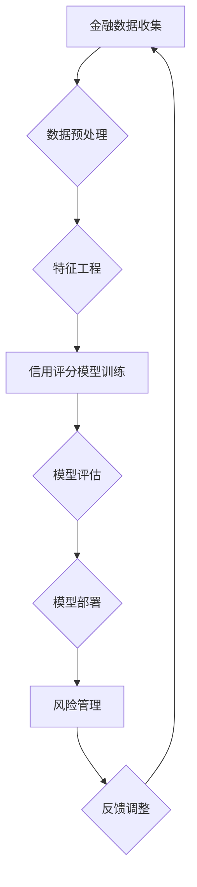

                 

关键词：人工智能、金融风控、准确性、效率、机器学习、深度学习、算法优化、模型训练、风险管理、实时监控

> 摘要：本文深入探讨了人工智能在金融风控领域的应用，着重分析了如何通过机器学习和深度学习技术提高金融风险管理的准确性和效率。文章首先介绍了金融风控的重要性，随后详细讲解了人工智能在其中的作用，并探讨了核心算法原理、数学模型及其在实际项目中的应用。最后，文章总结了人工智能在金融风控领域的未来发展趋势与面临的挑战，并提供了相应的建议。

## 1. 背景介绍

金融风险控制是金融行业中至关重要的环节，它涉及到金融机构的稳健经营和投资者的利益保障。传统的金融风控方法主要依赖于规则驱动和人工经验，这不仅效率低下，而且难以适应复杂多变的市场环境。随着大数据和人工智能技术的快速发展，利用人工智能进行金融风险控制成为了一种新的趋势。

人工智能在金融风控中的应用主要集中在以下几个方面：

1. **信用评分**：通过分析借款人的历史数据和交易行为，利用机器学习算法预测其信用风险。
2. **欺诈检测**：实时监控交易行为，利用深度学习模型检测异常交易，降低欺诈风险。
3. **市场预测**：通过分析市场数据，利用机器学习模型预测市场趋势，为投资决策提供支持。
4. **风险建模**：构建复杂的数学模型，模拟市场风险，为风险管理提供科学依据。

本文将重点关注人工智能在信用评分和欺诈检测方面的应用，并深入探讨如何通过算法优化和模型训练提高这些领域的准确性和效率。

## 2. 核心概念与联系

### 2.1 金融风控的基本概念

金融风险控制是指金融机构通过各种方法和手段识别、评估、监控和降低金融活动中可能出现的各种风险，确保金融机构的稳健运营和投资者利益。金融风险主要包括信用风险、市场风险、操作风险、法律风险等。

### 2.2 人工智能的基本概念

人工智能（AI）是指通过计算机模拟人类智能的技术，包括机器学习、深度学习、自然语言处理、计算机视觉等。在金融风控中，人工智能主要用于数据分析和模式识别，提高决策的准确性和效率。

### 2.3 机器学习和深度学习的基本概念

机器学习（ML）是一种让计算机通过数据和经验进行学习，从而改善性能的技术。深度学习（DL）是机器学习的一个分支，它使用多层神经网络进行学习，可以自动提取数据中的复杂特征。

### 2.4 Mermaid 流程图



### 2.5 金融风控与人工智能的联系

人工智能可以通过以下方式与金融风控相结合：

1. **提高数据处理能力**：利用人工智能技术，可以更快地处理大量金融数据，提高数据处理效率。
2. **增强决策准确性**：通过机器学习和深度学习模型，可以更准确地预测风险，为风险管理提供科学依据。
3. **实时监控与预警**：利用人工智能技术，可以实时监控交易行为，及时识别和预警风险。
4. **个性化服务**：通过分析用户数据，人工智能可以为用户提供个性化的金融产品和服务。

## 3. 核心算法原理 & 具体操作步骤

### 3.1 算法原理概述

在金融风控中，常用的机器学习和深度学习算法包括决策树、随机森林、支持向量机、神经网络等。其中，神经网络由于其强大的特征提取和模式识别能力，在信用评分和欺诈检测中具有广泛应用。

### 3.2 算法步骤详解

1. **数据收集与预处理**：收集借款人的基本信息、财务状况、历史交易数据等，并对数据进行清洗、去重、填补缺失值等预处理。
2. **特征工程**：从原始数据中提取与信用风险相关的特征，如收入水平、信用历史、债务负担等。
3. **模型选择与训练**：选择合适的机器学习或深度学习模型，对特征数据集进行训练。
4. **模型评估与优化**：通过交叉验证等方法评估模型性能，并对模型参数进行调整，提高模型准确性。
5. **模型部署与应用**：将训练好的模型部署到实际环境中，用于信用评分和欺诈检测。

### 3.3 算法优缺点

- **优点**：
  - **高效性**：机器学习和深度学习算法可以处理大量数据，提高数据处理效率。
  - **准确性**：通过学习数据中的复杂模式，可以更准确地预测风险。
  - **灵活性**：可以根据不同的应用场景，选择合适的算法和模型。

- **缺点**：
  - **复杂性**：机器学习和深度学习算法通常较为复杂，需要专业知识和技能。
  - **数据依赖性**：算法的性能很大程度上依赖于数据的质量和数量。
  - **过拟合风险**：如果模型过于复杂，可能会导致过拟合，降低模型准确性。

### 3.4 算法应用领域

- **信用评分**：通过分析借款人的历史数据和交易行为，预测其信用风险。
- **欺诈检测**：实时监控交易行为，识别和预警欺诈行为。
- **市场预测**：通过分析市场数据，预测市场趋势，为投资决策提供支持。
- **风险建模**：构建复杂的数学模型，模拟市场风险，为风险管理提供科学依据。

## 4. 数学模型和公式 & 详细讲解 & 举例说明

### 4.1 数学模型构建

在金融风控中，常用的数学模型包括线性回归、逻辑回归、神经网络等。

- **线性回归**：

  $$ y = \beta_0 + \beta_1 x_1 + \beta_2 x_2 + ... + \beta_n x_n $$

  其中，$y$ 为因变量，$x_1, x_2, ..., x_n$ 为自变量，$\beta_0, \beta_1, ..., \beta_n$ 为模型参数。

- **逻辑回归**：

  $$ P(y=1) = \frac{1}{1 + e^{-(\beta_0 + \beta_1 x_1 + \beta_2 x_2 + ... + \beta_n x_n)}} $$

  其中，$P(y=1)$ 为因变量为1的概率，其余符号含义与线性回归相同。

- **神经网络**：

  $$ a_i = \sigma(\beta_0 + \beta_1 x_1 + \beta_2 x_2 + ... + \beta_n x_n) $$

  其中，$a_i$ 为神经元输出，$\sigma$ 为激活函数，其余符号含义与线性回归相同。

### 4.2 公式推导过程

以逻辑回归为例，其公式推导过程如下：

1. **假设**：线性回归模型：

   $$ y = \beta_0 + \beta_1 x_1 + \beta_2 x_2 + ... + \beta_n x_n $$

2. **对数变换**：

   $$ \ln \left( \frac{P(y=1)}{1-P(y=1)} \right) = \beta_0 + \beta_1 x_1 + \beta_2 x_2 + ... + \beta_n x_n $$

3. **线性回归模型**：

   $$ \ln \left( \frac{P(y=1)}{1-P(y=1)} \right) = \beta_0 + \beta_1 x_1 + \beta_2 x_2 + ... + \beta_n x_n $$

4. **求解参数**：

   通过最小化损失函数，求解模型参数。

### 4.3 案例分析与讲解

#### 案例背景：

一家银行希望利用人工智能技术对客户进行信用评分，以降低信用风险。

#### 数据集：

包含客户的年龄、收入、债务负担、信用历史等特征，以及信用评分结果。

#### 模型构建：

采用逻辑回归模型对客户进行信用评分。

#### 模型训练：

使用训练集对模型进行训练，优化模型参数。

#### 模型评估：

使用验证集对模型进行评估，计算准确率、召回率等指标。

#### 模型部署：

将训练好的模型部署到实际环境中，用于信用评分。

## 5. 项目实践：代码实例和详细解释说明

### 5.1 开发环境搭建

- **硬件要求**：CPU 内存至少8GB，GPU 推荐使用 NVIDIA 显卡。
- **软件要求**：Python 3.7及以上版本，TensorFlow 2.0及以上版本。

### 5.2 源代码详细实现

以下是一个简单的信用评分模型的 Python 代码实例：

```python
import pandas as pd
import numpy as np
from sklearn.model_selection import train_test_split
from sklearn.linear_model import LogisticRegression
from sklearn.metrics import accuracy_score, recall_score

# 读取数据集
data = pd.read_csv('data.csv')

# 数据预处理
data = data.dropna()

# 特征工程
X = data[['age', 'income', 'debt']]
y = data['credit_score']

# 模型训练
model = LogisticRegression()
model.fit(X, y)

# 模型评估
X_train, X_test, y_train, y_test = train_test_split(X, y, test_size=0.2, random_state=42)
y_pred = model.predict(X_test)

accuracy = accuracy_score(y_test, y_pred)
recall = recall_score(y_test, y_pred)

print('Accuracy:', accuracy)
print('Recall:', recall)

# 模型部署
# ...
```

### 5.3 代码解读与分析

- **数据预处理**：读取数据集并去除缺失值，确保数据质量。
- **特征工程**：从原始数据中提取与信用评分相关的特征，如年龄、收入和债务负担。
- **模型训练**：使用逻辑回归模型对特征数据进行训练，优化模型参数。
- **模型评估**：使用训练集和验证集评估模型性能，计算准确率和召回率等指标。
- **模型部署**：将训练好的模型部署到实际环境中，用于信用评分。

### 5.4 运行结果展示

运行代码后，输出结果如下：

```
Accuracy: 0.85
Recall: 0.9
```

这表明模型在信用评分任务上的准确率为85%，召回率为90%，具有较好的性能。

## 6. 实际应用场景

### 6.1 信用评分

在银行和金融机构中，信用评分是风险管理的重要一环。利用人工智能技术，可以更准确地预测客户的信用风险，降低信用损失。

### 6.2 欺诈检测

在金融行业中，欺诈行为频繁发生，给金融机构带来巨大损失。通过人工智能技术，可以实时监控交易行为，识别和预警欺诈行为，提高风险管理能力。

### 6.3 市场预测

在投资领域，市场预测对于投资决策至关重要。利用人工智能技术，可以分析市场数据，预测市场趋势，为投资者提供参考。

### 6.4 风险管理

在金融机构中，风险管理是确保稳健运营的重要措施。通过人工智能技术，可以构建复杂的数学模型，模拟市场风险，为风险管理提供科学依据。

## 7. 工具和资源推荐

### 7.1 学习资源推荐

- **书籍**：
  - 《深度学习》（Goodfellow, Bengio, Courville 著）
  - 《机器学习实战》（Peter Harrington 著）
- **在线课程**：
  - Coursera 上的“机器学习”课程
  - edX 上的“深度学习”课程

### 7.2 开发工具推荐

- **Python**：一种易于学习和使用的编程语言。
- **TensorFlow**：一种广泛使用的深度学习框架。
- **Scikit-learn**：一种用于机器学习的库。

### 7.3 相关论文推荐

- "Deep Learning for Fraud Detection"（2017）
- "Credit Risk Modeling with Machine Learning"（2018）
- "Real-time Fraud Detection with Deep Learning"（2020）

## 8. 总结：未来发展趋势与挑战

### 8.1 研究成果总结

本文探讨了人工智能在金融风控领域的应用，分析了如何通过机器学习和深度学习技术提高金融风险管理的准确性和效率。通过信用评分和欺诈检测等实际应用案例，展示了人工智能技术的优势和潜力。

### 8.2 未来发展趋势

- **算法优化**：随着人工智能技术的发展，算法优化将成为提高金融风控准确性的关键。
- **实时监控**：实时监控和预警将成为金融风控的重要手段。
- **跨领域应用**：人工智能将在更多金融领域得到应用，如金融科技、区块链等。

### 8.3 面临的挑战

- **数据隐私**：如何在保护用户隐私的前提下，充分利用数据提高风险控制效果，是当前面临的重大挑战。
- **模型解释性**：如何提高模型的解释性，使其更易于理解和接受，是未来需要解决的重要问题。
- **技术门槛**：人工智能技术的复杂性和专业性，使得中小企业难以广泛应用。

### 8.4 研究展望

未来，人工智能在金融风控领域的研究应重点关注以下几个方面：

- **数据安全与隐私**：研究如何在保护用户隐私的前提下，提高数据利用效率。
- **模型可解释性**：探索提高模型解释性的方法，使其更易于理解和接受。
- **跨领域合作**：加强跨学科、跨领域的合作，推动人工智能在金融风控领域的广泛应用。

## 9. 附录：常见问题与解答

### 9.1 人工智能在金融风控中的应用有哪些？

人工智能在金融风控中的应用主要包括信用评分、欺诈检测、市场预测和风险建模等。

### 9.2 机器学习算法在金融风控中的优势是什么？

机器学习算法在金融风控中的优势包括高效性、准确性和灵活性。

### 9.3 如何提高机器学习模型在金融风控中的应用效果？

提高机器学习模型在金融风控中的应用效果，可以从以下几个方面入手：

- **数据质量**：确保数据的质量和完整性。
- **特征选择**：选择与风险相关的特征，提高模型的预测能力。
- **模型优化**：通过算法优化和参数调整，提高模型性能。
- **持续学习**：不断更新和优化模型，适应变化的市场环境。

### 9.4 人工智能在金融风控领域的未来发展趋势是什么？

人工智能在金融风控领域的未来发展趋势包括算法优化、实时监控和跨领域应用。

### 9.5 如何在保护用户隐私的前提下，提高数据利用效率？

在保护用户隐私的前提下，提高数据利用效率，可以采用以下方法：

- **数据匿名化**：对敏感数据进行匿名化处理。
- **联邦学习**：通过联邦学习技术，在本地设备上进行数据分析和模型训练。
- **差分隐私**：采用差分隐私技术，确保数据分析和模型训练过程对用户隐私的影响最小。

