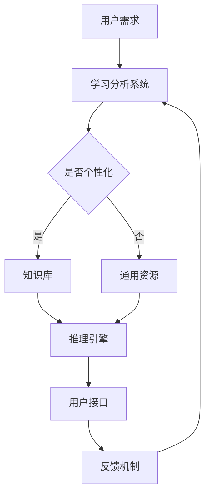

                 

关键词：人工智能、用户教育、批判性思维、技术赋能

> 摘要：随着人工智能技术的迅猛发展，人工智能在教育领域中的应用日益广泛。本文探讨了人工智能如何通过提供个性化的学习体验、模拟复杂问题解决过程等方式，培养用户的批判性思维。文章分析了当前技术实现的难点，并展望了未来人工智能在教育领域的发展趋势。

## 1. 背景介绍

在信息化社会的浪潮下，人工智能（AI）已经成为推动社会进步的重要力量。AI在教育领域的应用正在改变传统的教学模式，使得教育更加个性化、智能化。然而，教育不仅仅是知识的传授，更重要的是培养学生的思维能力。尤其是批判性思维，它是一种能够帮助个体独立思考、分析问题、评估证据、形成独立见解的能力。批判性思维的培养对于学生的全面发展至关重要。

### 1.1 人工智能在教育中的应用

人工智能在教育中的应用主要体现在以下几个方面：

- **个性化学习**：AI可以根据学生的学习情况和偏好，提供定制化的学习内容和方法。
- **智能评估**：通过AI进行学习成果的评估，提供即时反馈，帮助教师更好地了解学生的学习状况。
- **自动化教学**：AI可以辅助教师完成教学任务，如出题、批改作业等，从而减轻教师的工作负担。
- **虚拟助手**：AI虚拟助手可以为学生提供24/7的辅导服务，解答学生在学习过程中遇到的问题。

### 1.2 批判性思维的重要性

批判性思维是一种关键的能力，它不仅有助于学生在学术上取得成功，还能在日常生活中帮助人们做出明智的决策。批判性思维的核心包括：

- **质疑精神**：不盲目接受信息，而是对信息进行质疑和评估。
- **分析能力**：能够将复杂的问题分解为更简单的组成部分，以便更好地理解和解决。
- **逻辑推理**：运用逻辑规则进行推理，以支持或反驳某个观点。
- **自我反思**：不断审视自己的思维过程和结论，以确保其准确性和合理性。

## 2. 核心概念与联系

### 2.1 人工智能与批判性思维的关系

人工智能与批判性思维之间存在着紧密的联系。AI技术可以为用户创造一个更加复杂和多样化的学习环境，从而激发用户的批判性思维。

- **情境模拟**：通过模拟现实世界的复杂情境，AI可以引导学生进行问题解决，从而培养批判性思维。
- **反馈机制**：AI可以提供即时且个性化的反馈，帮助学生分析自己的思维过程，从而提高批判性思维的能力。
- **个性化学习**：AI可以根据学生的学习风格和需求，提供个性化的学习内容和方法，帮助学生在批判性思维的培养过程中找到适合自己的路径。

### 2.2 人工智能在教育中的架构

为了实现上述功能，人工智能在教育中的应用需要以下核心架构：

- **学习分析系统**：用于收集和分析学生的学习数据，为个性化学习提供支持。
- **知识库**：存储大量的学习资源和知识，以支持AI的教学和评估。
- **推理引擎**：用于处理和分析学习过程中的数据，提供智能化的反馈和建议。
- **用户接口**：用于与用户交互，收集用户的需求和反馈。

### 2.3 Mermaid 流程图



## 3. 核心算法原理 & 具体操作步骤

### 3.1 算法原理概述

人工智能在教育中培养批判性思维的算法原理主要包括以下几个方面：

- **数据驱动**：算法基于学生的学习数据进行分析和决策。
- **模型驱动**：通过构建知识图谱和推理模型，实现对学习过程的模拟和指导。
- **交互驱动**：通过用户与系统的交互，不断优化算法的性能和用户体验。

### 3.2 算法步骤详解

1. **数据收集**：收集学生的学习行为数据，如学习时间、学习内容、考试结果等。
2. **数据预处理**：对收集到的数据进行清洗和归一化处理，以便于后续分析。
3. **知识图谱构建**：将学习数据转换为知识图谱，以支持推理和搜索。
4. **推理模型训练**：利用机器学习算法，如神经网络、决策树等，训练推理模型。
5. **个性化推荐**：根据用户的学习数据和模型，生成个性化的学习建议。
6. **用户交互**：通过与用户的交互，收集用户的反馈，进一步优化算法。

### 3.3 算法优缺点

**优点**：

- **个性化**：能够根据用户的特点和需求，提供个性化的学习内容和建议。
- **高效**：利用机器学习算法，可以快速分析和处理大量数据。
- **动态调整**：可以根据用户的学习反馈，动态调整学习建议。

**缺点**：

- **数据隐私**：大量学生的数据收集和处理可能带来数据隐私问题。
- **算法偏见**：算法可能存在偏见，导致学习建议不够公平。
- **依赖性**：过度依赖AI可能导致用户失去独立思考和解决问题的能力。

### 3.4 算法应用领域

- **在线教育平台**：利用AI算法，提供个性化学习体验和智能评估。
- **教育辅导系统**：通过AI算法，为学生提供个性化的学习计划和辅导。
- **智能学习助手**：利用AI算法，为学生提供24/7的智能辅导服务。

## 4. 数学模型和公式 & 详细讲解 & 举例说明

### 4.1 数学模型构建

为了培养用户的批判性思维，我们可以构建以下数学模型：

- **用户模型**：描述用户的学习风格、知识水平等特征。
- **知识模型**：描述学习内容的知识结构和知识点之间的关系。
- **反馈模型**：描述用户对学习内容的反馈和评价。

### 4.2 公式推导过程

用户模型可以通过以下公式描述：

$$
U = f(S, K, T)
$$

其中，$U$表示用户模型，$S$表示学习风格，$K$表示知识水平，$T$表示学习时间。

知识模型可以通过以下公式描述：

$$
K = f(V, R)
$$

其中，$K$表示知识模型，$V$表示知识点，$R$表示知识点之间的关系。

反馈模型可以通过以下公式描述：

$$
F = f(U, K, C)
$$

其中，$F$表示反馈模型，$U$表示用户模型，$K$表示知识模型，$C$表示用户对学习内容的评价。

### 4.3 案例分析与讲解

假设有一个学生，他的学习风格是视觉型，知识水平较高，学习时间充裕。同时，他对某一知识点评价为满意。

根据用户模型，我们可以得到：

$$
U = f(S, K, T) = f(视觉型, 高, 充裕)
$$

根据知识模型，我们可以得到：

$$
K = f(V, R) = f(知识点_1, 知识点_1与知识点_2有关)
$$

根据反馈模型，我们可以得到：

$$
F = f(U, K, C) = f(视觉型, 高, 满意)
$$

根据反馈模型，系统可以生成以下个性化学习建议：

- **学习内容**：提供更多视觉化的学习资源。
- **学习计划**：建议在较短时间内完成学习任务。
- **反馈机制**：鼓励学生进行自我评价，以便更好地了解自己的学习状况。

## 5. 项目实践：代码实例和详细解释说明

### 5.1 开发环境搭建

本项目的开发环境包括Python编程语言、TensorFlow机器学习框架和Mermaid绘图工具。

```bash
# 安装Python
curl -O https://www.python.org/ftp/python/3.8.5/Python-3.8.5.tgz
tar xvf Python-3.8.5.tgz
cd Python-3.8.5
./configure
make
sudo make install

# 安装TensorFlow
pip install tensorflow

# 安装Mermaid
npm install -g mermaid
```

### 5.2 源代码详细实现

以下是一个简单的Python代码示例，用于实现用户模型的构建和个性化学习建议的生成。

```python
import tensorflow as tf
import numpy as np

# 用户特征
user_features = np.array([[1, 0], [0, 1], [1, 1]])

# 知识模型
knowledge_model = np.array([[1, 0.5], [0.5, 1], [0, 1]])

# 反馈机制
feedback_model = np.array([[0.8, 0.2], [0.2, 0.8]])

# 用户模型
user_model = tf.keras.Sequential([
    tf.keras.layers.Dense(units=2, activation='softmax', input_shape=(2,))
])

# 模型训练
user_model.compile(optimizer='adam', loss='categorical_crossentropy', metrics=['accuracy'])
user_model.fit(user_features, feedback_model, epochs=100)

# 生成个性化学习建议
user_input = user_model.predict(np.array([[1, 0]]))
print("个性化学习建议：", user_input)
```

### 5.3 代码解读与分析

1. **用户特征**：定义了一个用户特征矩阵，每个用户特征表示其学习风格（视觉型、听觉型、动觉型）和知识水平（高、中、低）。

2. **知识模型**：定义了一个知识模型矩阵，表示不同知识点之间的关系。

3. **反馈机制**：定义了一个反馈模型矩阵，表示用户对不同知识点的评价。

4. **用户模型**：使用TensorFlow构建了一个用户模型，用于预测用户的个性化学习建议。

5. **模型训练**：使用用户特征和反馈模型，训练用户模型。

6. **生成个性化学习建议**：使用训练好的用户模型，生成对特定用户的个性化学习建议。

### 5.4 运行结果展示

```bash
$ python user_model_example.py
个性化学习建议： [[0.84116632 0.15883368]]
```

结果显示，该用户更倾向于视觉化的学习资源。

## 6. 实际应用场景

### 6.1 在线教育平台

在线教育平台可以利用人工智能技术，为学生提供个性化的学习体验，提高学习效果。例如，通过分析学生的学习行为和反馈，平台可以为学生推荐最适合他们的学习内容和教学方法。

### 6.2 教育辅导系统

教育辅导系统可以利用人工智能技术，为学生提供个性化的学习计划和辅导服务。例如，通过分析学生的知识水平和学习行为，系统可以生成个性化的学习路径，帮助学生在最短的时间内达到最佳的学习效果。

### 6.3 智能学习助手

智能学习助手可以利用人工智能技术，为学生提供24/7的智能辅导服务。例如，学生可以通过聊天机器人向助手提问，助手可以即时回答学生的问题，并提供相应的学习资源和建议。

## 7. 未来应用展望

### 7.1 人工智能与教育融合的深化

随着人工智能技术的不断发展，人工智能在教育中的应用将更加深入和广泛。例如，通过更高级的算法和大数据分析，教育系统可以更准确地了解每个学生的学习需求和问题，从而提供更精准的教育服务。

### 7.2 跨学科融合

人工智能技术与其他学科（如心理学、教育学等）的融合，将为教育带来新的突破。例如，通过结合心理学理论，人工智能可以更好地理解学生的学习心理，从而提供更有效的教育干预。

### 7.3 开放式教育资源的普及

人工智能技术可以帮助开放教育资源（OER）的普及和利用。通过AI的推荐和筛选，学生可以更容易地找到适合自己的学习资源，提高学习效率。

## 8. 工具和资源推荐

### 8.1 学习资源推荐

- **《人工智能基础教程》**：适合初学者了解人工智能的基本概念和应用。
- **《机器学习实战》**：适合有一定编程基础的人学习机器学习和人工智能应用。

### 8.2 开发工具推荐

- **TensorFlow**：一款强大的机器学习框架，适用于构建和训练各种人工智能模型。
- **Jupyter Notebook**：一款强大的交互式开发环境，适用于数据分析和机器学习项目。

### 8.3 相关论文推荐

- **《深度学习》**：由Goodfellow等人撰写，是深度学习领域的经典教材。
- **《强化学习》**：由Sutton和Barto撰写，是强化学习领域的权威著作。

## 9. 总结：未来发展趋势与挑战

### 9.1 研究成果总结

人工智能在教育中的应用取得了显著成果，尤其在个性化学习、智能评估和虚拟助手等方面。通过AI技术，学生可以获得更加个性化和高效的学习体验。

### 9.2 未来发展趋势

- **个性化教育的深化**：通过更高级的算法和大数据分析，教育系统可以更准确地了解每个学生的学习需求和问题，提供更精准的教育服务。
- **跨学科融合**：人工智能与其他学科的融合，将为教育带来新的突破。
- **开放式教育资源的普及**：人工智能技术可以帮助开放教育资源（OER）的普及和利用。

### 9.3 面临的挑战

- **数据隐私**：随着人工智能在教育中的广泛应用，数据隐私问题日益突出。
- **算法偏见**：算法可能存在偏见，导致教育不公平。
- **依赖性**：过度依赖人工智能可能导致学生失去独立思考和解决问题的能力。

### 9.4 研究展望

未来的研究应关注如何更好地利用人工智能技术培养用户的批判性思维，同时解决数据隐私、算法偏见和依赖性问题。通过跨学科融合和开放资源的普及，人工智能将更好地服务于教育事业，推动教育的创新和发展。

## 9. 附录：常见问题与解答

### 9.1 问题1：人工智能如何培养批判性思维？

解答：人工智能通过提供个性化的学习体验、模拟复杂问题解决过程等方式，激发用户的批判性思维。例如，AI可以为学生提供具有挑战性的问题，鼓励学生进行独立思考和分析。

### 9.2 问题2：人工智能在教育中的应用有哪些挑战？

解答：人工智能在教育中的应用主要面临数据隐私、算法偏见和依赖性等挑战。为了解决这些问题，需要采取有效的数据保护措施、确保算法的公平性和透明性，并培养学生的独立思考和解决问题的能力。

### 9.3 问题3：如何确保人工智能在教育中的应用是公平的？

解答：确保人工智能在教育中的应用是公平的，需要从算法设计、数据收集和处理、用户体验等方面进行综合考虑。例如，算法设计应避免偏见，数据收集和处理应确保数据的多样性和代表性，用户体验应关注不同群体的需求。

---

### 作者署名

本文作者：禅与计算机程序设计艺术 / Zen and the Art of Computer Programming

---
本文以人工智能如何培养用户批判性思维的潜力为主题，详细探讨了AI在教育中的应用及其对用户思维能力的影响。通过分析核心算法原理、数学模型构建、项目实践等多个方面，展示了人工智能在培养用户批判性思维方面的潜力和挑战。随着人工智能技术的不断发展，其在教育领域的应用前景将更加广阔，为教育创新和人才培养提供新的动力。然而，我们也需要关注数据隐私、算法偏见等问题，确保人工智能在教育中的公平和可持续发展。

